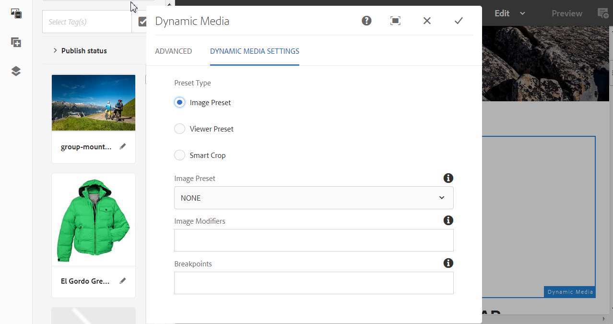

# Agregar recursos de Dynamic Media a las páginas {#adding-dynamic-media-assets-to-pages}

Para agregar la funcionalidad de medios dinámicos a los recursos que utilice en sus sitios web, puede agregar el componente **Dynamic Media** o **Medios interactivos** directamente en la página. Para ello, introduzca el modo Diseño y active los componentes de medios dinámicos. A continuación, puede añadir estos componentes a la página y añadir recursos al componente. Los componentes de Dynamic Media y Medios interactivos son inteligentes; es decir, saben si va a añadir una imagen o un vídeo, y las opciones disponibles cambian según corresponda.

Puede agregar recursos de medios dinámicos directamente a la página si está utilizando AEM como WCM. Si utiliza un tercero para su WCM, [vincule](linking-urls-to-yourwebapplication.md) o [incruste](embed-code.md) los recursos. Para ver un sitio web interactivo de terceros, consulte [Distribución de imágenes optimizadas en un sitio interactivo](responsive-site.md).

>[!NOTE]
>
>Debe publicar los recursos antes de agregarlos a las páginas de AEM. Consulte [Publicación de Dynamic Media Assets](publishing-dynamicmedia-assets.md).

## Añadir un componente de Dynamic Media en una página {#adding-a-dynamic-media-component-to-a-page}

Añadir un componente de Dynamic Media en una página es lo mismo que agregar un componente a cualquier página. Los componentes de Dynamic Media se describen en detalle en las siguientes secciones.

>[!NOTE]
>
>Si un usuario con permisos de solo lectura accede a un componente de Dynamic Media en una página web, los saltos de página y los componentes no se representan correctamente. El motivo es que la página se reconstruye para garantizar que las propiedades de los componentes sean correctas y que los recursos a los que se hace referencia y las configuraciones sean accesibles. A continuación, la página se vuelve a representar provocando que los componentes se rompan; el código de componente correspondiente de la página no se puede volver a procesar debido al acceso de solo lectura del usuario.
>  
>Para evitar este problema, asegúrese de que los usuarios de AEM Sites tienen los permisos necesarios para acceder a los recursos.

1. En AEM, abra la página a la que desea añadir el componente de Dynamic Media.
1. En el panel de la parte izquierda de la página (es posible que necesite alternar la visualización del panel lateral), haga clic en el icono **[!UICONTROL Componentes]**.
1. Bajo el encabezado **[!UICONTROL Componentes]**, en la lista desplegable, seleccione **[!UICONTROL Dynamic Media]**. Si no hay ninguna lista de componentes de Dynamic Media disponible, es probable que deba habilitar los componentes de Dynamic Media que desee utilizar. Consulte [Activación de componentes de Dynamic Media](#enabling-dynamic-media-components).

   

1. Arrastre un componente de Dynamic Media que desee utilizar a la página en la ubicación deseada.
1. Sitúe el puntero del ratón directamente sobre el componente. Cuando el componente esté rodeado por un cuadro azul, toque una vez para mostrar la barra de herramientas del componente. Toque el icono **[!UICONTROL Configuration]** (llave inglesa).
1. [Edite los ](#dynamic-media-components) componentes según sea necesario y haga clic en la marca de verificación para guardar los cambios.

### Habilitación de componentes de Dynamic Media {#enabling-dynamic-media-components}

Si no hay componentes de Dynamic Media disponibles para agregar a una página, es probable que primero deba habilitar los componentes que desee utilizar.

1. En AEM, abra la página a la que desea añadir el componente de Dynamic Media.
1. En la parte izquierda de la barra de herramientas, cerca de la parte superior de la página, toque el icono Información de página y, a continuación, toque **[!UICONTROL Editar plantilla]** en la lista desplegable.

   

1. En la parte derecha de la barra de herramientas cerca de la parte superior de la página, en la lista desplegable, toque **[!UICONTROL Estructura]**.

   

1. Cerca de la parte inferior de la página, toque **[!UICONTROL Contenedor de diseño]** para abrir su barra de herramientas y, a continuación, toque el icono de directiva.
1. En la página **[!UICONTROL Contenedor de diseño]**, bajo el encabezado **[!UICONTROL Propiedades]**, asegúrese de que la ficha **[!UICONTROL Componentes permitidos]** está seleccionada.

   

1. Desplácese hasta que vea **[!UICONTROL Dynamic Media]**.
1. Toque el icono > a la izquierda de **[!UICONTROL Dynamic Media]** para expandir la lista, seleccione los componentes de Dynamic Media que desee habilitar.

   

1. Cerca de la esquina superior derecha de la página **[!UICONTROL Contenedor de diseño]**, toque el icono Listo (marca de verificación).

1. En la parte derecha de la barra de herramientas cerca de la parte superior de la página, en la lista desplegable, toque **[!UICONTROL Contenido inicial]** y luego [agregue un componente de Dynamic Media a una página](#adding-a-dynamic-media-component-to-a-page) como de costumbre.

## Localización de componentes de Dynamic Media {#localizing-dynamic-media-components}

Puede localizar componentes de Dynamic Media de una de estas dos formas:

* En una página web de Sites, abra **[!UICONTROL Propiedades]** y seleccione la pestaña **[!UICONTROL Avanzadas]**. Seleccione el idioma que desee para la localización.

   

* En el selector de sitios, seleccione la página o el grupo de páginas que desee. Toque **[!UICONTROL Propiedades]** y seleccione la ficha **[!UICONTROL Avanzado]**. Seleccione el idioma que desee para la localización.

   >[!NOTE]
   >
   >Tenga en cuenta que actualmente no todos los idiomas disponibles en el menú **[!UICONTROL Idioma]** tienen tokens asignados.

## Componentes de Dynamic Media {#dynamic-media-components}

Dynamic Media y Medios interactivos están disponibles en la ficha [!UICONTROL Dynamic Media] de [!UICONTROL Componentes]. El componente de [!UICONTROL Medios interactivos] se utiliza para cualquier recurso interactivo, como vídeo interactivo, imágenes interactivas o conjuntos de carrusel. Para todos los demás componentes de Dynamic Media, utilice el componente de Dynamic Media.

>[!NOTE]
>
>Estos componentes no están disponibles de forma predeterminada y deben estar disponibles mediante el editor de plantillas antes de usarlos. [Una vez que estén ](/help/sites-authoring/templates.md#editing-templates-template-authors) disponibles en el editor de plantillas, puede agregar los componentes a la página como lo haría con cualquier otro componente de AEM.

### Componente de Dynamic Media {#dynamic-media-component}

El componente Dynamic Media es inteligente, ya sea que agregue una imagen o un vídeo, tiene varias opciones. El componente admite ajustes preestablecidos de imagen, visores basados en imágenes, como conjuntos de imágenes, conjuntos de giros, conjuntos de medios mixtos y vídeo. Además, el visor responde. Es decir, el tamaño de la pantalla cambia automáticamente en función del tamaño de la pantalla. Todos los visores son visores HTML5.

>[!NOTE]
>
>Si hay un componente de Dynamic Media, un componente de medios interactivos o ambos en una página web a la que accede un usuario con permisos de solo lectura, los saltos de página y los componentes no se representan correctamente. El motivo es que la página se reconstruye para garantizar que las propiedades de los componentes sean correctas y que los recursos a los que se hace referencia y las configuraciones sean accesibles. A continuación, la página se vuelve a representar provocando que los componentes se rompan; el código de componente correspondiente de la página no se puede volver a procesar debido al acceso de solo lectura del usuario.
>  
>Para evitar este problema, asegúrese de que los usuarios de AEM Sites tienen los permisos necesarios para acceder a los recursos.

>[!NOTE]
>
>Cuando se añade el componente de Dynamic Media y la opción **[!UICONTROL Configuración de Dynamic Media]** está vacía o no puede añadir un recurso correctamente, compruebe lo siguiente:
>
>* [Dynamic Media](config-dynamic.md) se ha activado. Dynamic Media está desactivado de forma predeterminada.
>* La imagen tiene un archivo TIFF piramidal. Las imágenes importadas antes de la activación de Dynamic Media no tienen un archivo TIFF piramidal.

>

#### Uso de imágenes {#when-working-with-images}

El componente de Dynamic Media permite añadir imágenes dinámicas, como conjuntos de imágenes, conjuntos de giros y conjuntos de medios mixtos. Puede acercar, alejar y, si procede, girar una imagen en un conjunto de giros o seleccionar una imagen de otro tipo de conjunto.

También puede configurar el ajuste preestablecido de visor, el ajuste preestablecido de imagen o el formato de imagen directamente en el componente. Para hacer que en una imagen sea interactiva, puede establecer puntos de interrupción o aplicar un ajuste preestablecido de imagen interactiva.

Debe editar la siguiente Configuración de Dynamic Media haciendo clic en el icono **[!UICONTROL Editar]** del componente y luego **[!UICONTROL Configuración de Dynamic Media]**.

>[!NOTE]
>
>De forma predeterminada, el componente de imagen Dynamic Media es adaptable. Si desea que sea un tamaño fijo, configúrelo en la ficha **[!UICONTROL Avanzado]** con las opciones **[!UICONTROL Ancho]** y **[!UICONTROL Altura]**.

* **[!UICONTROL Ajuste]**
preestablecido de visorSeleccione un ajuste preestablecido de visor existente en el menú desplegable. Si el ajuste preestablecido de visor que busca no está visible, es posible que tenga que hacerlo visible. Consulte Administración de ajustes preestablecidos de visor. No es posible seleccionar un ajuste preestablecido de visor si utiliza un ajuste preestablecido de imagen, y viceversa.
Esta es la única opción disponible al visualizar conjuntos de imágenes, conjuntos de giros o conjuntos de medios mixtos. Los ajustes preestablecidos de visor que se muestran también son inteligentes: solo aparecen los ajustes preestablecidos del visor pertinente.

* **[!UICONTROL Modificadores de visorLos modificadores de visor adoptan la forma de par nombre=valor con un delimitador &amp; y permiten cambiar los visores como se describe en la Guía de referencia de visores.]**
Un ejemplo de modificador de visor es posterimage=img.jpg&amp;caption=text.vtt,1, que establece una imagen diferente para la miniatura de vídeo y asocia un archivo de subtítulo/subtítulo con el vídeo.

* **[!UICONTROL Ajuste]**
preestablecido de imagenSeleccione un ajuste preestablecido de imagen existente en el menú desplegable. Si el ajuste preestablecido de imagen que busca no está visible, es posible que tenga que hacerlo visible. Consulte Administración de ajustes preestablecidos de imagen. No es posible seleccionar un ajuste preestablecido de visor si utiliza un ajuste preestablecido de imagen, y viceversa.
Esta opción no está disponible si visualiza conjuntos de imágenes, conjuntos de giros o conjuntos de medios mixtos.

* **[!UICONTROL Modificadores de]**
imagenPuede aplicar efectos de imagen proporcionando comandos de imagen adicionales. Estos se describen en Ajustes preestablecidos de imagen y en la referencia de comandos de servicio de imágenes.
Esta opción no está disponible si visualiza conjuntos de imágenes, conjuntos de giros o conjuntos de medios mixtos.

* **[!UICONTROL Puntos de]**
interrupciónSi utiliza este recurso en un sitio interactivo, debe agregar los puntos de interrupción de la imagen. Los puntos de interrupción de imagen deben separarse por comas (,). Esta opción funciona cuando no se ha definido ninguna altura o anchura en el ajuste preestablecido de una imagen.
Esta opción no está disponible si visualiza conjuntos de imágenes, conjuntos de giros o conjuntos de medios mixtos.
Puede editar la siguiente Configuración avanzada haciendo clic en **[!UICONTROL Editar]** en el componente.

* ****
TítuloCambie el título de la imagen.

* **[!UICONTROL Texto alternativoAñada un título a la imagen para los usuarios que tienen gráficos desactivados.]**
Esta opción no está disponible si visualiza conjuntos de imágenes, conjuntos de giros o conjuntos de medios mixtos.

* **[!UICONTROL URL, Abrir]**
enPuede definir un recurso para abrir un vínculo. Defina la dirección URL y, en Abrir en, indique si quiere que se abra en la misma ventana o en una nueva.
Esta opción no está disponible si visualiza conjuntos de imágenes, conjuntos de giros o conjuntos de medios mixtos.

* **** Anchura y  ****
alturaIntroduzca el valor en píxeles si desea que la imagen tenga un tamaño fijo. Si deja estos valores en blanco, hace que el recurso sea adaptable.

#### Uso de vídeos {#when-working-with-video}

Utilice el componente Dynamic Media para añadir vídeo dinámico a las páginas web. Cuando edita el componente, tiene la opción de usar un ajuste preestablecido de visor de vídeo predefinido para reproducir el vídeo en la página.

Debe editar la siguiente configuración de Dynamic Media haciendo clic en **[!UICONTROL Editar]** en el componente.

>[!NOTE]
>
>De forma predeterminada, el componente de vídeo de Dynamic Media es adaptable. Si desea que sea un tamaño fijo, configúrelo en el componente con la **[!UICONTROL anchura]** y **[!UICONTROL altura]** en la ficha [!UICONTROL Avanzado].

* **[!UICONTROL Ajuste]**
preestablecido de visorSeleccione un ajuste preestablecido de visor de vídeo existente en el menú desplegable. Si el ajuste preestablecido de visor que busca no está visible, es posible que tenga que hacerlo visible. Consulte Administración de ajustes preestablecidos de visor. 

* **[!UICONTROL Modificadores del visorLos modificadores del visor adoptan la forma de par nombre=valor con un delimitador &amp; y permiten cambiar los visores como se describe en la Guía de referencia de visores de Adobe.]**
Un ejemplo de modificador de visor es posterimage=img.jpg&amp;caption=text.vtt,1

   Con los modificadores del visor, por ejemplo, puede hacer lo siguiente:

   * Asocie un archivo de subtítulos con un [subtítulo de vídeo.](https://docs.adobe.com/content/help/en/dynamic-media-developer-resources/library/viewers-aem-assets-dmc/video/command-reference-url-video/r-html5-video-viewer-url-caption.html)
   * Asocie un archivo de navegación con una [navegación de vídeo.](https://docs.adobe.com/content/help/en/dynamic-media-developer-resources/library/viewers-aem-assets-dmc/video/command-reference-url-video/r-html5-video-viewer-url-navigation.html)

Puede editar la siguiente [!UICONTROL Configuración avanzada] haciendo clic en **[!UICONTROL Editar]** en el componente.

* ****
TítuloCambie el título del vídeo.

* **** Anchura y  ****
alturaIntroduzca el valor en píxeles si desea que el vídeo tenga un tamaño fijo. Si deja estos valores en blanco, hace que el vídeo sea adaptable.

#### Al trabajar con Smart Crop {#when-working-with-smart-crop}

Utilice el componente Dynamic Media para añadir recursos de imagen de recorte inteligente a sus páginas web. Cuando edita el componente, tiene la opción de usar un ajuste preestablecido de visor de vídeo predefinido para reproducir el vídeo en la página.

Consulte también [Perfiles de imagen](image-profiles.md).

Puede editar la siguiente [!UICONTROL Configuración de Dynamic Media] haciendo clic en **[!UICONTROL Editar]** en el componente.

>[!NOTE]
>
>De forma predeterminada, el componente de imagen Dynamic Media es adaptable. Si desea que tenga un tamaño fijo, configúrelo en el componente de la pestaña [!UICONTROL Avanzado] con la **[!UICONTROL anchura]** y la **[!UICONTROL altura]** apropiadas.

* **[!UICONTROL Modificadores de]**
imagenPuede aplicar efectos de imagen proporcionando comandos de imagen adicionales. Estos se describen en Ajustes preestablecidos de imagen y en la referencia de comandos de servicio de imágenes.
Esta opción no está disponible si visualiza conjuntos de imágenes, conjuntos de giros o conjuntos de medios mixtos.

Puede editar la siguiente configuración **[!UICONTROL Avanzada]** haciendo clic en **[!UICONTROL Editar]** en el componente.

* ****
TítuloCambie el título de la imagen de recorte inteligente.

* **[!UICONTROL Texto]**
alternativoAgregue un título a la imagen de recorte inteligente para los usuarios que tienen gráficos desactivados.
Esta opción no está disponible si visualiza conjuntos de imágenes, conjuntos de giros o conjuntos de medios mixtos.

* **[!UICONTROL URL, Abrir]**
enPuede definir un recurso para abrir un vínculo. Defina la dirección URL y, en Abrir en, indique si quiere que se abra en la misma ventana o en una nueva.
Esta opción no está disponible si visualiza conjuntos de imágenes, conjuntos de giros o conjuntos de medios mixtos.

* **[!UICONTROL Altura]** y  ****
anchuraIntroduzca el valor en píxeles si desea que la imagen de recorte inteligente tenga un tamaño fijo. Si deja estos valores en blanco, hace que el vídeo sea adaptable.

### Componente de medios interactivos {#interactive-media-component}

El componente de Medios interactivos es para los recursos que tienen elementos interactivos integrados en ellos, como puntos interactivos o mapas de imágenes. Si tiene una imagen interactiva, un vídeo interactivo o un titular de carrusel, utilice el componente de Medios interactivos.

El componente de medios interactivos es inteligente, ya sea que agregue una imagen o un vídeo, tiene varias opciones. Además, el visor es interactivo: el tamaño de la pantalla cambia automáticamente en función del tamaño de la pantalla. Todos los visores son visores HTML5.

>[!NOTE]
>
>Si hay un componente de Dynamic Media, un componente de medios interactivos o ambos en una página web a la que accede un usuario con permisos de solo lectura, los saltos de página y los componentes no se representan correctamente. El motivo es que la página se reconstruye para garantizar que las propiedades de los componentes sean correctas y que los recursos a los que se hace referencia y las configuraciones sean accesibles. A continuación, la página se vuelve a representar provocando que los componentes se rompan; el código de componente correspondiente de la página no se puede volver a procesar debido al acceso de solo lectura del usuario.
> 
>Para evitar este problema, asegúrese de que los usuarios de AEM Sites tienen los permisos necesarios para acceder a los recursos.

Puede editar las siguientes opciones de configuración **[!UICONTROL General]** al hacer clic en **[!UICONTROL Editar]** en el componente.

* **[!UICONTROL Ajuste]**
preestablecido de visorSeleccione un ajuste preestablecido de visor existente en el menú desplegable. Si el ajuste preestablecido de visor que busca no está visible, es posible que tenga que hacerlo visible. Los ajustes preestablecidos de visor se deben publicar para que se puedan usar. Consulte Administración de ajustes preestablecidos de visor. 

* ****
TítuloCambie el título del vídeo.

* **** Anchura y  ****
alturaIntroduzca el valor en píxeles si desea que el vídeo tenga un tamaño fijo. Si deja estos valores en blanco, hace que el vídeo sea adaptable.

Puede editar las siguientes opciones de configuración **[!UICONTROL Añadir a carro]** al hacer clic en **[!UICONTROL Editar]** en el componente.

* **[!UICONTROL Mostrar]**
recurso de productoDe forma predeterminada, se selecciona este valor. El recurso del producto muestra una imagen del producto, según se ha definido en el módulo Commerce. Desactive la casilla para no mostrar el recurso del producto.

* **[!UICONTROL Mostrar]**
precio del productoDe forma predeterminada, se selecciona este valor. El precio del producto muestra el precio del artículo, según se ha definido en el módulo Commerce. Desactive la casilla para no mostrar el precio del producto.

* **[!UICONTROL Mostrar]**
formulario de productoDe forma predeterminada, este valor no está seleccionado. En el formulario del producto se incluye las variantes de producto, como talla y color. Desactive la casilla para no mostrar las variantes del producto.

### Componente de medios panorámicos {#panoramic-media-component}

El componente de medios panorámicos es para aquellos recursos que son imágenes panorámicas esféricas. Estas imágenes proporcionan una experiencia de visualización de 360° de una habitación, propiedad, ubicación o paisaje. Para que una imagen se considere panorámica esférica, debe tener una O ambas de las opciones siguientes:

* Proporción de aspecto de 2:1.
* Etiquetado con las palabras &quot;equirectangular&quot; o (&quot;esférico&quot; + &quot;panorámico&quot;) o (&quot;esférico&quot; + &quot;panorámico&quot;). Consulte [Uso de etiquetas](/help/sites-authoring/tags.md).

Tanto la proporción de aspecto como los criterios de palabra clave se aplican a los recursos panorámicos para la página de detalles de recursos y el componente WCM &quot;Panoramic Media&quot;.

Puede editar la siguiente configuración tocando **[!UICONTROL Configurar]** en el componente.

* **[!UICONTROL Ajuste]**
preestablecido de visorSeleccione un visor existente en el menú desplegable Ajuste preestablecido de visor.

Si el ajuste preestablecido de visor que está buscando no está visible, asegúrese de que se ha publicado. Debe publicar ajustes preestablecidos de visor para poder utilizarlos. Consulte [Administración de ajustes preestablecidos de visor](managing-viewer-presets.md). 

### Uso de HTTP/2 para envío de recursos de Dynamic Media {#using-http-to-delivery-dynamic-media-assets}

HTTP/2 es el nuevo protocolo web actualizado que mejora la forma en que se comunican los exploradores y los servidores. Proporciona una transferencia de información más rápida y reduce la cantidad de potencia de procesamiento necesaria. Ahora, el envío de recursos de Dynamic Media puede realizarse a través de HTTP/2, lo que proporciona una mejor respuesta y tiempos de carga.

Consulte [Envío HTTP2 de contenido](http2.md) para obtener información detallada sobre cómo empezar a utilizar HTTP/2 con su cuenta de Dynamic Media.

>[!MORELIKETHIS]
>
>* [Explicación de la administración de color con AEM Dynamic Media](https://helpx.adobe.com/experience-manager/kt/assets/using/dynamic-media-color-management-technical-video-setup.html)
>* [Uso de miniaturas de vídeo personalizadas con AEM Dynamic Media](https://helpx.adobe.com/experience-manager/kt/assets/using/dynamic-media-video-thumbnails-feature-video-use.html)
>* [Información sobre Asset Viewer con AEM Dynamic Media](https://helpx.adobe.com/experience-manager/kt/assets/using/dynamic-media-viewer-feature-video-understand.html)
>* [Uso de vídeo interactivo con AEM Dynamic Media](https://helpx.adobe.com/experience-manager/kt/assets/using/dynamic-media-interactive-video-feature-video-use.html)
>* [Uso del reproductor de vídeo en AEM Dynamic Media](https://helpx.adobe.com/experience-manager/kt/assets/using/dynamic-media-video-player-feature-video-use.html)
>* [Uso del enfoque de imágenes con AEM Dynamic Media](https://helpx.adobe.com/experience-manager/6-4/assets/using/best-practices-for-optimizing-the-quality-of-your-images.html)

