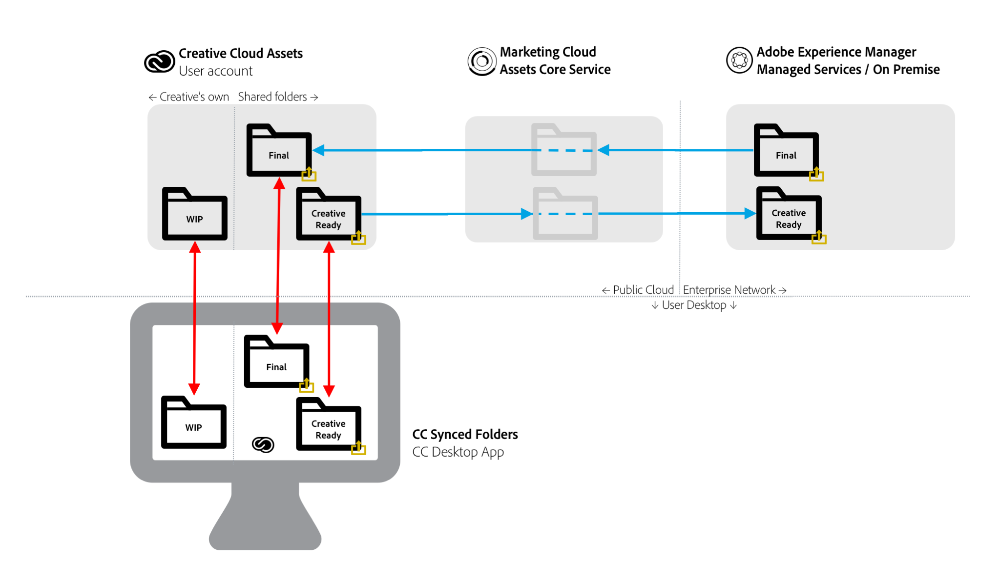

# Prácticas recomendadas de uso compartido de carpetas de AEM a Creative Cloud {#aem-to-creative-cloud-folder-sharing-best-practices}

>[!CAUTION]
>
>La función de uso compartido de carpetas de AEM a Creative Cloud está en desuso. Adobe recomienda enfáticamente utilizar las nuevas funciones como [Vínculo de recursos de Adobe](https://helpx.adobe.com/es/enterprise/using/adobe-asset-link.html) o [AEM aplicación de escritorio](https://helpx.adobe.com/experience-manager/desktop-app/aem-desktop-app.html). Obtenga más información en [prácticas recomendadas de integración de AEM y Creative Cloud](/help/assets/aem-cc-integration-best-practices.md).

Adobe Experience Manager (AEM) se puede configurar para permitir que los usuarios de AEM Assets compartan carpetas con usuarios Creative Cloud, de modo que estén disponibles como carpetas compartidas en el servicio Creative Cloud Assets. La función se puede utilizar para intercambiar archivos entre equipos creativos y usuarios de AEM Assets, especialmente cuando los usuarios creativos no tienen acceso a la instancia de AEM Assets (no están en la red empresarial).

Este tipo de integración se puede utilizar en ambos casos de uso, especialmente cuando se trabaja con usuarios que no tienen acceso directo a AEM Assets:

* Uso compartido de un conjunto de recursos específicos de AEM Assets con usuarios de Creative Cloud Files (por ejemplo, un resumen creativo y un conjunto de recursos aprobados para el trabajo de diseño de una nueva actividad de marketing)
* Recibir nuevos archivos de usuarios Creative Cloud.

>[!NOTE]
>
>Antes de leer este documento, puede revisar las [optimizaciones generales de integración de AEM y Creative Cloud](aem-cc-integration-best-practices.md) para obtener una visión general de nivel superior del tema.

## Información general {#overview}

El uso compartido de carpetas de AEM a Creative Cloud depende del uso compartido de carpetas y archivos del lado del servidor entre cuentas de AEM Assets y Creative Cloud. Los profesionales creativos, que utilizan la aplicación de escritorio Creative Cloud en sus equipos de escritorio, pueden además hacer que las carpetas compartidas estén disponibles directamente en sus discos mediante la tecnología Adobe CreativeSync.

En el diagrama siguiente se proporciona una descripción general de la integración.

La integración incluye los siguientes elementos:

* **Servidor AEM Assets** implementado en la red empresarial (servicios administrados o in situ): El uso compartido de carpetas se inicia aquí.
* **Servicio** principal de Adobe Marketing Cloud Assets: Actúa como intermediario entre los servicios de almacenamiento AEM y Creative Cloud. El administrador de la compañía que utiliza la integración necesita establecer una relación de confianza entre la organización de Marketing Cloud y la instancia de AEM Assets. También [definen una lista de colaboradores de Creative Cloud aprobados](https://experienceleague.adobe.com/docs/core-services/interface/assets/t-admin-add-cc-user.html?lang=en#assets), que los usuarios de AEM Assets también pueden compartir carpetas para mayor seguridad.
* **Servicios**  web de Creative Cloud Assets (interfaz de usuario web de almacenamiento y archivos de Creative Cloud): Aquí es donde usuarios específicos del Creative Cloud, con los que se compartió una carpeta de AEM Assets, podrían aceptar la invitación y ver la carpeta en el almacenamiento de su cuenta de Creative Cloud.
* **Aplicación** de escritorio Creative Cloud: (Opcional) Permite el acceso directo a las carpetas o archivos compartidos desde el escritorio del usuario creativo mediante la sincronización con el almacenamiento de Creative Cloud Assets.

## Características y limitaciones {#characteristics-and-limitations}

* **Propagación unidireccional de cambios:los cambios** de archivos se propagan solo en una dirección, desde el sistema (Recursos AEM o Creative Cloud), donde el recurso se creó originalmente (se cargó). La integración no proporciona una sincronización bidireccional completamente automatizada entre los dos sistemas.

* **Versiones:**

   * AEM solo crea versiones de un recurso en actualizaciones si el archivo se originó en AEM y se actualiza en él.
   * Creative Cloud Assets proporciona su propia [función de versiones](https://helpx.adobe.com/creative-cloud/help/versioning-faq.html) que está dirigida a las actualizaciones de Work in Progress (básicamente, almacena actualizaciones durante un máximo de 10 días)

* **Limitaciones de espacio:** los tamaños y volúmenes de archivos intercambiados están limitados por la cuota específica de recursos de  [Creative Cloud ](https://helpx.adobe.com/creative-cloud/kb/file-storage-quota.html) para usuarios creativos (depende del nivel de suscripción) y una limitación de 5 GB de tamaño máximo de archivo. El espacio está limitado además por la cuota de recursos que la organización tiene en el servicio principal de Adobe Marketing Cloud Assets.

* **Requisitos de espacio:** Los archivos de las carpetas compartidas también deben almacenarse físicamente en AEM y, a continuación, en la cuenta de Creative Cloud, con una copia en caché en el servicio principal de Marketing Cloud Assets.
* **Redes y ancho de banda:** Los archivos de las carpetas compartidas y todas las actualizaciones deben transportarse a través de la red entre los sistemas. Debe asegurarse de que solo se comparten los archivos y las actualizaciones relevantes.
* **Tipo** de carpeta: No se puede compartir una carpeta de recursos del tipo  `sling:OrderedFolder`. Si desea compartir una carpeta, al crearla en AEM Assets, no seleccione la opción Pedido.

## Prácticas recomendadas {#best-practices}

Entre las prácticas recomendadas para aprovechar el uso compartido de carpetas de AEM a Creative Cloud se incluyen:

* **Consideraciones de volumen:** Compartir carpetasAEM/Creative Cloud debe utilizarse para compartir un número menor de archivos, por ejemplo, relevantes para una campaña o actividad específica. Para compartir conjuntos más grandes de recursos, como todos los recursos aprobados en la organización, utilice otros métodos de distribución (por ejemplo, AEM Assets Brand Portal) o AEM aplicación de escritorio.
* **Evite compartir jerarquías profundas:** El uso compartido funciona de forma recursiva y no permite la desdistribución selectiva. Normalmente, solo las carpetas sin subcarpetas o con una jerarquía muy superficial, como el nivel de subcarpeta 1, deben considerarse para uso compartido.
* **Carpetas independientes para el uso compartido unidireccional:** Las carpetas independientes deben usarse para compartir recursos finales de AEM Assets a archivos Creative Cloud y para compartir recursos listos para la creación de archivos Creative Cloud a AEM Assets. Junto con una buena convención de nombres para estas carpetas, crea un entorno de trabajo más fácil de entender tanto para usuarios de AEM Assets como de Creative Cloud.
* **Evite el trabajo en curso en la carpeta compartida:la carpeta** compartida no debe utilizarse para el trabajo en curso; utilice una carpeta separada en Archivos Creative Cloud para realizar trabajos que requieran cambios frecuentes en el archivo.
* **Inicio de nuevo trabajo fuera de la carpeta compartida:** Los nuevos diseños (archivos creativos) deben iniciarse en la carpeta WIP independiente en Archivos Creative Cloud y, cuando estén listos para compartirse con los usuarios de AEM Assets, se deben mover o guardar en la carpeta compartida.
* **Simplifique la estructura de uso compartido:** para una configuración operativa más manejable, piense en simplificar la estructura de uso compartido. En lugar de compartir con todos los usuarios creativos, las carpetas de AEM Assets deben compartirse únicamente con los representantes del equipo, como un director creativo o un administrador de equipos. El administrador del lado creativo recibiría los activos finales, decidiría las asignaciones de trabajo y, a continuación, dejaría que los diseñadores trabajaran en sus propias cuentas de Creative Cloud en los activos de WIP. Pueden utilizar funciones de colaboración de Creative Cloud para coordinar el trabajo y, finalmente, seleccionar y colocar los recursos que estén listos para volver a compartirse en AEM Assets en la carpeta compartida lista para creativos.

El diagrama siguiente ilustra una configuración de ejemplo para crear nuevos diseños en función de los recursos finales existentes de AEM Assets.

