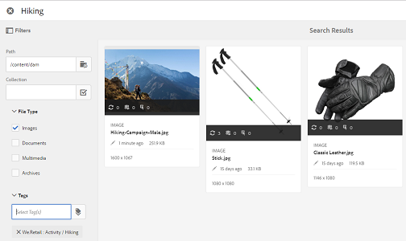

# Selector de recursos {#asset-selector}

>[!NOTE]
>
>El selector de recursos se llamaba [Selector de recursos](https://helpx.adobe.com/experience-manager/6-2/assets/using/asset-picker.html) en versiones anteriores de AEM.

El selector de recursos permite examinar, buscar y filtrar recursos en [!DNL Adobe Experience Manager] recursos. También puede recuperar los metadatos de los recursos seleccionados mediante el selector de recursos. Para personalizar la interfaz del selector de recursos, puede iniciarla con parámetros de solicitud admitidos. Estos parámetros establecen el contexto del selector de recursos para un escenario en particular.

Actualmente, puede pasar los parámetros de solicitud `assettype` (*Imagen/Video/Text*) y la selección `mode` (*Single/Multiple*) como información contextual para el selector de recursos, que permanece intacta durante toda la selección.

El selector de recursos utiliza el mensaje HTML5 **Window.postMessage** para enviar datos del recurso seleccionado al destinatario.

El selector de recursos se basa en el vocabulario del selector de base de Granite. De forma predeterminada, el selector de recursos funciona en modo de exploración. Sin embargo, puede aplicar filtros utilizando la experiencia de Omniture para restringir la búsqueda de recursos concretos.

Puede integrar cualquier página web (independientemente de si forma parte del contenedor de CQ) con el selector de recursos (`https://[AEM_server]:[port]/aem/assetpicker.html`).

## Parámetros contextuales {#contextual-parameters}

Puede pasar los siguientes parámetros de solicitud en una URL para iniciar el selector de recursos en un contexto concreto:

| Nombre | Valores | Ejemplo | Función |
|---|---|---|---|
| sufijo de recurso (B) | Ruta de la carpeta como sufijo del recurso en la dirección URL:`http://localhost:4502/aem/` `assetpicker.html/<folder_path>` | Para iniciar el selector de recursos con una carpeta concreta seleccionada, por ejemplo con la carpeta `/content/dam/we-retail/en/activities` seleccionada, la dirección URL debe tener el formato: `http://localhost:4502/aem/assetpicker.html` `/content/dam/we-retail/en/activities?assettype=images` | Si necesita que se seleccione una carpeta determinada cuando se inicie el selector de recursos, pasarla como sufijo de recurso. |
| modo | único, múltiple | `http://localhost:4502/aem/assetpicker.html` `?mode=multiple`   `http://localhost:4502/aem/assetpicker.html` `?mode=single` | En varios modos, puede seleccionar varios recursos simultáneamente mediante el selector de recursos. |
| el cuadro de diálogo | true, false | `http://localhost:4502/aem/assetpicker.html` `?dialog=true` | Utilice estos parámetros para abrir el selector de recursos como cuadro de diálogo Granito. Esta opción solo se aplica cuando se inicia el selector de recursos mediante Campo de ruta de granito y se configura como URL de pickerSrc. |
| raíz | `<folder_path>` | `http://localhost:4502/aem/` `assetpicker.html?assettype=images` `&root=/content/dam/we-retail/en/activities` | Utilice esta opción para especificar la carpeta raíz del selector de recursos. En este caso, el selector de recursos permite seleccionar solo recursos secundarios (directos/indirectos) en la carpeta raíz. |
| viewmode | búsqueda |  | Para iniciar el selector de recursos en modo de búsqueda, con los parámetros assettype y mimetype. |
| assettype (S) | imágenes, documentos, multimedia, archivos | <ul><li>`http://localhost:4502/aem/assetpicker.html?viewmode=search&assettype=images`</li> <li>`http://localhost:4502/aem/assetpicker.html?viewmode=search&assettype=documents`</li> <li>`http://localhost:4502/aem/assetpicker.html?viewmode=search&assettype=multimedia`</li> <li>`http://localhost:4502/aem/assetpicker.html?viewmode=search&assettype=archives`</li> | Utilice esta opción para filtrar los tipos de recursos en función del valor pasado. |
| mimetype | mimetype(s) (`/jcr:content/metadata/dc:format`) de un recurso (también se admite el comodín) | <ul><li>`http://localhost:4502/aem/assetpicker.html?viewmode=search&mimetype=image/png`</li>  <li>`http://localhost:4502/aem/assetpicker.html?viewmode=search&?mimetype=*png`</li>  <li>`http://localhost:4502/aem/assetpicker.html?viewmode=search&mimetype=*presentation`</li>  <li>`http://localhost:4502/aem/assetpicker?viewmode=search&mimetype=*presentation&mimetype=*png`</li></ul> | Utilícelo para filtrar recursos en función de tipos MIME |

## Utilice el selector de recursos {#using-the-asset-selector}

1. Para acceder a la interfaz del selector de recursos, vaya a `https://[AEM_server]:[port]/aem/assetpicker`.
1. Vaya a la carpeta que desee y seleccione uno o varios recursos.

   

   También puede buscar el recurso deseado desde el cuadro OmniSearch y luego seleccionarlo.

   

   Si busca recursos utilizando el cuadro OmniSearch, puede seleccionar varios filtros del panel **[!UICONTROL Filtros]** para restringir la búsqueda.

   

1. Toque o haga clic **[!UICONTROL Seleccione]** en la barra de herramientas.
