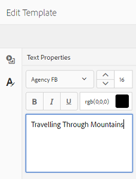

# Plantillas de recursos {#asset-templates}

Las plantillas de recursos son una clase especial de recursos que facilitan un reuso rápido del contenido con gran riqueza visual para medios digitales y de impresión. Una plantilla de recursos incluye dos partes, la sección de mensajería fija y la sección editable.

La sección de mensajería fija puede contener contenido propio, como el logotipo de la marca y la información de copyright que está desactivada para la edición. La sección editable puede contener contenido visual y textual en campos que se pueden editar para personalizar la mensajería.

La flexibilidad para realizar ediciones limitadas y, al mismo tiempo, asegurar las señalizaciones globales, hace que las plantillas de recursos sean componentes básicos ideales para una rápida adaptación y distribución del contenido como artefactos de contenido para diversas funciones. El repropósito del contenido ayuda a reducir el costo de la administración de canales digitales e impresos y ofrece experiencias holísticas y coherentes en todos estos canales.

Como especialista en marketing, puede almacenar y administrar plantillas dentro de AEM Assets y utilizar una sola plantilla base para crear varias experiencias de impresión personalizadas con facilidad. Puede crear varios tipos de material publicitario de marketing, incluidos folletos, folletos, postales, tarjetas de visita, etc., para transmitir su mensaje de marketing a los clientes de forma lúcida. También puede ensamblar salidas de impresión de varias páginas a partir de salidas de impresión existentes o nuevas. Sobre todo, puede ofrecer simultáneamente experiencias digitales e impresas con facilidad para proporcionar una experiencia coherente e integrada a los usuarios.

Aunque las plantillas de recursos son en su mayoría archivos de InDesign, la competencia en el InDesign no es una barrera para la creación de artefactos estelares. No es necesario asignar los campos de la plantilla de InDesign a los campos de producto que necesita para crear catálogos. Puede editar las plantillas en modo WYSIWYG directamente en la interfaz web. Sin embargo, para que el InDesign procese los cambios de edición, primero debe configurar AEM Assets para que se integre con el servidor de InDesign.

La capacidad de editar plantillas de InDesign desde la interfaz web ayuda a fomentar la buena colaboración entre el personal creativo y de marketing, a la vez que reduce el tiempo de comercialización para las iniciativas de promoción locales.

Puede hacer lo siguiente con las plantillas de recursos:

* Modificación de campos de plantilla editables desde la interfaz web
* Controle el estilo básico del texto, por ejemplo el tamaño de fuente, el estilo y el tipo en el nivel de etiqueta
* Cambiar imágenes dentro de la plantilla mediante el selector de contenido
* Vista previa de las ediciones de plantillas
* Combinar varios archivos de plantilla para crear un artefacto de varias páginas

Al elegir una plantilla para el material colateral, AEM Assets crea una copia de la plantilla que puede editar. Se conserva la plantilla original, lo que garantiza que la señalización global permanezca intacta y se pueda reutilizar para garantizar la coherencia de la marca.

Puede exportar el archivo actualizado dentro de la carpeta principal en los siguientes formatos:

* INDD
* PDF
* JPG

También puede descargar la salida en estos formatos en su sistema local.

## Crear un colateral {#creating-a-collateral}

Considere un escenario en el que desee crear garantías digitales imprimibles, como folletos, folletos y publicidades para una próxima campaña, y compartirlas con tiendas de venta en todo el mundo. La creación de material colateral basado en una plantilla ayuda a ofrecer una experiencia de cliente unificada en todos los canales. Los diseñadores pueden crear las plantillas de campaña (de una sola página o de varias páginas) mediante una solución creativa, como el InDesign y cargar las plantillas en AEM Assets por usted. Antes de crear un colateral, haga que una o más plantillas INDD se carguen en y estén disponibles en el Experience Manager con antelación.

1. Toque o haga clic en el logotipo de AEM y, a continuación, toque o haga clic en **[!UICONTROL Assets]** en la página Navegación.
1. En las opciones, seleccione **[!UICONTROL Templates]**.

   

1. Pulse o haga clic en **[!UICONTROL Crear]** y, a continuación, elija el colateral que desee crear en el menú. Por ejemplo, elija **[!UICONTROL Folleto]**.

   

1. Tener una o más plantillas INDD cargadas en y disponibles previamente en el Experience Manager. Elija una plantilla para el folleto y pulse o haga clic en **[!UICONTROL Siguiente]**.

   

1. Especifique un nombre y una descripción opcional para el folleto.

   

1. (Opcional) Toque o haga clic en el icono **[!UICONTROL Etiquetas]** situado junto al campo **[!UICONTROL Etiquetas]** y seleccione una o más etiquetas para el folleto. Pulse o haga clic en **[!UICONTROL Confirmar]** para confirmar la selección.

   

1. Haga clic en **[!UICONTROL Crear]**. Un cuadro de diálogo confirma que se crea un nuevo folleto. Pulse o haga clic en **[!UICONTROL Abrir]** para abrir el folleto en modo de edición.

   

   Como alternativa, cierre el cuadro de diálogo y vaya a la carpeta de la página Plantillas con la que comenzó a trabajar para ver el folleto que ha creado. El tipo de garantía aparece en su miniatura en la vista de tarjeta. Por ejemplo, en este caso, el folleto se muestra en la miniatura.

   

## Editar un colateral {#editing-a-collateral}

Puede editar un colateral inmediatamente después de crearlo. También puede abrirlo desde la página Plantillas o la página de recursos.

1. Para abrir el material secundario para editarlo, realice una de las siguientes acciones:

   * Abra el colateral (folleto en este caso) que creó en el paso 7 de [Creación de un colateral](asset-templates.md#creating-a-collateral).
   * En la página Plantillas , vaya a la carpeta en la que creó el material colateral y pulse o haga clic en la acción rápida Editar en la miniatura de un material colateral.
   * En la página del recurso para el material colateral, pulse o haga clic en el icono Editar de la barra de herramientas.
   * Seleccione el material secundario y pulse o haga clic en el icono Editar de la barra de herramientas.

   

   El buscador de recursos y el editor de texto se muestran a la izquierda de la página. El editor de texto está abierto de forma predeterminada.

   Puede utilizar el editor de texto para modificar el texto que desea que se muestre en el campo de texto. Puede modificar el tamaño de fuente, el estilo, el color y el tipo en el nivel de etiqueta.

   Con el buscador de recursos, puede examinar o buscar imágenes en AEM Assets y reemplazar las imágenes editables de la plantilla por las imágenes que elija.

   

   Los editables se muestran a la derecha. Para que un campo se pueda editar en AEM Assets, el campo correspondiente de la plantilla debe etiquetarse en InDesign. En otras palabras, deben marcarse como editables en InDesign.

   

   >[!NOTE]
   >
   >Asegúrese de que la instancia de AEM esté integrada con un servidor de InDesign para permitir que AEM Assets extraiga datos de la plantilla de InDesign y que esté disponible para la edición. Para obtener más información, consulte [Integración de AEM Assets con InDesign Server](indesign.md).

1. Para modificar el texto de un campo editable, toque o haga clic en el campo de texto de la lista de campos editables y edite el texto en el campo.

   

   Puede editar las propiedades del texto, por ejemplo el estilo de fuente, el color y el tamaño, utilizando las opciones proporcionadas.

1. Toque o haga clic en el icono **[!UICONTROL Preview]** para obtener una vista previa de los cambios de texto.

   

1. Para intercambiar una imagen, toque o haga clic en el icono **[!UICONTROL Buscador de recursos]**.

   

1. Seleccione el campo de imagen de la lista de campos editables y, a continuación, arrastre una imagen desde el selector de recursos al campo editable.

   

   También puede buscar imágenes utilizando palabras clave, etiquetas y según su estado de publicación. Puede navegar por el repositorio de AEM Assets y navegar a la ubicación de la imagen deseada.

   

1. Toque o haga clic en el icono **[!UICONTROL Preview]** para previsualizar la imagen.

   

1. Para editar una página específica en una página secundaria de varias páginas, utilice el navegador de páginas en la parte inferior.

   

1. Pulse o haga clic en el icono **[!UICONTROL Preview]** de la barra de herramientas para obtener una vista previa de todos los cambios. Pulse o haga clic en **[!UICONTROL Listo]** para guardar los cambios de edición en el material promocional.

   >[!NOTE]
   >
   >Los iconos Vista previa y Listo solo se activan cuando los campos de imagen editables del material no tienen iconos que falten. Si falta algún icono en el colateral, es porque AEM no puede resolver las imágenes en la plantilla de InDesign. Normalmente, AEM no puede resolver imágenes en los siguientes casos:
   >
   >* Las imágenes no se incrustan en la plantilla de InDesign subyacente
   >* Las imágenes están vinculadas desde el sistema de archivos local

   >
   >Para permitir que AEM resuelva imágenes, haga lo siguiente:
   >
   >* Incruste imágenes al crear plantillas de InDesign (consulte [Acerca de los vínculos y los gráficos incrustados](https://helpx.adobe.com/indesign/using/graphics-links.html)).
   >* Monte AEM en el sistema de archivos local y, a continuación, asigne los iconos que faltan con los recursos AEM existentes.

   >
   >Para obtener más información sobre cómo trabajar con documentos de InDesign, consulte [Prácticas recomendadas para trabajar con documentos de InDesign en AEM](https://helpx.adobe.com/experience-manager/kb/best-practices-idd-docs-aem.html).

1. Para generar una representación PDF para el folleto, seleccione la opción Acrobat en el cuadro de diálogo y haga clic en **[!UICONTROL Continuar]**.
1. El material colateral se crea en la carpeta con la que comenzó. Para ver las representaciones, abra el material colateral y seleccione **[!UICONTROL Representaciones]** en la lista de navegación global.

   

1. Pulse o haga clic en la representación PDF de la lista de representaciones para descargar el archivo PDF. Abra el archivo PDF para revisar el material colateral.

   

## Combinar material colateral {#merge-collateral}

1. Toque o haga clic en **[!UICONTROL Herramientas > Assets]**.
1. En las opciones, seleccione **[!UICONTROL Templates]**.
1. Pulse o haga clic en **[!UICONTROL Crear]** y elija **[!UICONTROL Combinar]** en el menú.

   

1. En la página Combinar plantilla , pulse o haga clic en el icono Combinar .

   

1. Vaya a la ubicación del material que desea combinar, toque o haga clic en las miniaturas del material que desea combinar para seleccionarlas.

   

   Incluso puede buscar plantillas desde el cuadro OmniSearch .

   

   Puede navegar por el repositorio o las colecciones de AEM Assets, navegar a la ubicación de las plantillas que desee y, a continuación, seleccionarlas para fusionarlas.

   

   Puede aplicar varios filtros para buscar en las plantillas que desee. Por ejemplo, puede buscar plantillas basadas en el tipo de archivo o en etiquetas.

   

1. Pulse o haga clic en **[!UICONTROL Siguiente]** en la barra de herramientas.
1. En la pantalla **[!UICONTROL Preview &amp; Reorder]**, reorganice las plantillas si es necesario y previsualice la selección de plantillas que desea combinar. A continuación, pulse o haga clic en **[!UICONTROL Siguiente]** en la barra de herramientas.

   

1. En la pantalla Configurar plantilla , especifique un nombre para el colateral. De forma opcional, especifique las etiquetas que considere adecuadas. Si desea exportar la salida en formato PDF, seleccione la opción **[!UICONTROL Acrobat (.PDF)]**. De forma predeterminada, el material colateral se exporta en formato JPG y InDesign. Para cambiar la miniatura de visualización para el material de varias páginas, pulse o haga clic en **[!UICONTROL Cambiar miniatura]**.

   

1. Pulse o haga clic en **[!UICONTROL Guardar]** y, a continuación, pulse o haga clic en **[!UICONTROL Aceptar]** en el cuadro de diálogo para cerrar el cuadro de diálogo. El material colateral de varias páginas se crea en la carpeta con la que comenzó.

   >[!NOTE]
   >
   >No se puede editar un material combinado posteriormente ni utilizarlo para crear otro material colateral.

