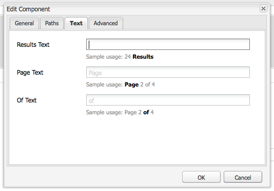
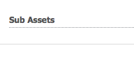

# Creación y configuración de páginas del Editor de recursos {#creating-and-configuring-asset-editor-pages}

En este documento se describe lo siguiente:

* Por qué se crean páginas personalizadas del Editor de recursos.
* Cómo crear y personalizar páginas del Editor de recursos, que son páginas WCM que permiten ver y editar metadatos, así como realizar acciones en el recurso.
* Cómo editar varios recursos simultáneamente.

>[!NOTE]
>
>Asset Share está disponible como implementación de referencia de código abierto. Consulte [Asset Share Commons](https://adobe-marketing-cloud.github.io/asset-share-commons/) . No se admite oficialmente.

## ¿Por qué crear y configurar páginas del Editor de recursos? {#why-create-and-configure-asset-editor-pages}

La administración de activos digitales se está utilizando en cada vez más escenarios. Al pasar de una solución a pequeña escala para un pequeño grupo de usuarios de formación profesional -por ejemplo, fotógrafos o taxónomos- a grupos de usuarios más grandes y diversos, por ejemplo usuarios empresariales, autores de WCM, periodistas, etc.-, la potente interfaz de usuario de [!DNL Adobe Experience Manager Assets] para usuarios profesionales puede proporcionar demasiada información y los interesados empiezan a solicitar interfaces de usuario o aplicaciones específicas para acceder a los recursos digitales que les son de importancia.

Estas aplicaciones centradas en los recursos pueden ser simples galerías de fotos en una intranet donde los empleados pueden cargar fotos de las visitas a los espectáculos comerciales o un centro de prensa en un sitio web público, como el ejemplo proporcionado con Geometrixx. Las aplicaciones centradas en recursos también pueden extenderse a soluciones completas, incluidos carros de compras, cierres de compra y procesos de verificación.

La creación de una aplicación centrada en los recursos se convierte, en gran medida, en un proceso de configuración que no requiere codificación, solo conocimiento de los grupos de usuarios y sus necesidades, así como conocimiento de los metadatos que se utilizan. Las aplicaciones centradas en recursos creadas con [!DNL Assets] son ampliables: con un esfuerzo de codificación moderado, se pueden crear componentes reutilizables para buscar, ver y modificar recursos.

Una aplicación centrada en recursos en [!DNL Experience Manager] consiste en una página del Editor de recursos, que puede utilizarse para obtener una vista detallada de un recurso específico. Una página del Editor de recursos también permite editar metadatos, siempre que el usuario que accede al recurso tenga los permisos necesarios.

## Creación y configuración de una página Uso compartido de recursos {#creating-and-configuring-an-asset-share-page}

Personalice la funcionalidad del Buscador de DAM y cree páginas que tengan toda la funcionalidad que necesite, que se denominan páginas de Uso compartido de recursos. Para crear una nueva página Uso compartido de recursos, agregue la página mediante la plantilla Uso compartido de recursos de Geometrixx y, a continuación, personalice las acciones que los usuarios pueden realizar en esa página, determine cómo ven los visualizadores los recursos y decida cómo pueden crear sus consultas los usuarios.

Estos son algunos casos de uso para crear una página de uso compartido de recursos personalizada:

* Centro de Prensa para Periodistas
* Motor de búsqueda de imágenes para usuarios empresariales internos
* Base de datos de imágenes para usuarios de sitios web
* Interfaz de etiquetado de medios para editores de metadatos

### Creación de una página Uso compartido de recursos {#creating-an-asset-share-page}

Para crear una nueva página Uso compartido de recursos, puede crearla cuando esté trabajando en sitios web o desde el administrador de recursos digitales.

>[!NOTE]
>
>De forma predeterminada, al crear una página Uso compartido de recursos desde **Nuevo** en el administrador de recursos digital, automáticamente se crea un visualizador de recursos y un editor de recursos.

Para crear una nueva página Uso compartido de recursos en la consola **Sitios web**:

1. En la pestaña **[!UICONTROL Sitios web]**, desplácese hasta el lugar donde desee crear una página de uso compartido de recursos y haga clic en **[!UICONTROL Nuevo]**.

1. Seleccione la página **[!UICONTROL Asset Share]** y haga clic en **[!UICONTROL Create]**. La nueva página se crea y la página de uso compartido de recursos se enumera en la pestaña **[!UICONTROL Sitios web]**.

La página básica creada con la plantilla Uso compartido de recursos DAM de Geometrixx tiene el siguiente aspecto:

Para personalizar la página Uso compartido de recursos, utilice elementos de la barra de tareas y también edite las propiedades del generador de consultas. La página **[!UICONTROL Centro de prensa de Geometrixx]** es una versión personalizada de una página basada en esta plantilla:

Para crear una nueva página de uso compartido de recursos a través del administrador de recursos digital:

1. En el administrador de recursos digitales, en **[!UICONTROL Nuevo]**, seleccione **[!UICONTROL Nuevo uso compartido de recursos]**.
1. En **[!UICONTROL Title]**, introduzca el nombre de la página de uso compartido de recursos. Si lo desea, escriba un nombre para la dirección URL.

   

1. Haga doble clic en la página de uso compartido de recursos para abrirla y configurarla.

   

   De forma predeterminada, al crear una página Uso compartido de recursos desde **[!UICONTROL Nuevo]**, automáticamente se crea un visualizador de recursos y un editor de recursos.

#### Personalización de acciones {#customizing-actions}

Puede determinar qué acciones pueden realizar los usuarios en los recursos digitales seleccionados a partir de una selección de acciones predefinidas.

Para agregar acciones a la página Uso compartido de recursos:

1. En la página Uso compartido de recursos que desea personalizar, haga clic en **[!UICONTROL Acciones]** en la barra de tareas.

   Las acciones disponibles son las siguientes:
   

| Acción | Descripción |
|---|---|
| [!UICONTROL Acción Eliminar] | Los usuarios pueden eliminar los recursos seleccionados. |
| [!UICONTROL Acción de descarga] | Permite a los usuarios descargar los recursos seleccionados en sus equipos. |
| [!UICONTROL Acción de Lightbox] | Guarda los recursos en un &quot;lightbox&quot;   donde puede realizar otras acciones en ellos. Esto resulta útil cuando se trabaja   con recursos en varias páginas. La caja de luz también se puede usar como un   carro de compras para activos. |
| [!UICONTROL Acción de mover] | Los usuarios pueden mover el recurso a otro   ubicación |
| [!UICONTROL Acción de etiquetas] | Permite que los usuarios agreguen etiquetas a los recursos seleccionados |
| [!UICONTROL Acción de ver recursos] | Abre el recurso en el editor de recursos para   manipulación de usuarios. |

1. Arrastre la acción adecuada al área **Actions** de la página. Al hacerlo, se crea un botón que se utiliza para ejecutar esa acción.

   

#### Determinar cómo se presentan los resultados de la búsqueda {#determining-how-search-results-are-presented}

Puede determinar cómo se muestran los resultados a partir de una lista predefinida de lentes.

Para cambiar la forma en que se ven los resultados de la búsqueda:

1. En la página Uso compartido de recursos que desea personalizar, haga clic en **[!UICONTROL Buscar]**.

   

1. Arrastre la lente adecuada al centro superior de la página. En el Centro de Prensa, las lentes ya están disponibles. Los usuarios pulsan el icono de objetivo correspondiente para mostrar los resultados de búsqueda según sus preferencias.

Las lentes disponibles son las siguientes:

| Objetivo | Descripción |
|---|---|
| **[!UICONTROL Vista de lista]** | Presenta los recursos en una lista con detalles. |
| **[!UICONTROL Vista en mosaico]** | Presenta los recursos en forma de mosaico. |

#### Vista en mosaico {#mosaic-lens}

#### Vista de lista {#list-lens}

#### Personalización del Generador de consultas {#customizing-the-query-builder}

El generador de consultas permite introducir términos de búsqueda y crear contenido para la página Uso compartido de recursos. Al editar el generador de consultas, también puede determinar cuántos resultados de búsqueda se muestran por página, qué editor de recursos se abre al hacer doble clic en un recurso, la ruta en la que la consulta busca y los tipos de nodos personalizados.

Para personalizar el generador de consultas:

1. En la página Uso compartido de recursos que desea personalizar, haga clic en **[!UICONTROL Editar]** en el Generador de consultas. De forma predeterminada, se abre la pestaña **[!UICONTROL General]**.

1. Seleccione el número de resultados por página, la ruta del editor de recursos (si tiene un editor de recursos personalizado) y el título de las acciones.

   

1. Haga clic en la pestaña **[!UICONTROL Rutas]**. Introduzca una ruta o varias rutas que se ejecutarán en la búsqueda. Estas rutas se sobrescriben si el usuario utiliza el predicado Rutas .

   

1. Introduzca otro tipo de nodo, si lo desea.

1. En el campo **[!UICONTROL Query Builder URL]** puede anular o ajustar el generador de consultas e introducir las nuevas direcciones URL del servlet con el componente existente del generador de consultas. En el campo **[!UICONTROL Feed URL]** también puede anular la URL de la fuente.

   

1. En el campo **[!UICONTROL Text]**, introduzca el texto que desea que aparezca para los resultados y los números de página de los resultados. Haga clic en **[!UICONTROL OK]** cuando termine de realizar los cambios.

   

#### Agregar predicados {#adding-predicates}

[!DNL Experience Manager Assets] incluye una serie de predicados que puede agregar a la página Uso compartido de recursos. Esto permite que los usuarios restrinjan aún más las búsquedas. En algunos casos, pueden anular un parámetro del generador de consultas (por ejemplo, el parámetro Path).

Para agregar predicados:

1. En la página Uso compartido de recursos que desea personalizar, haga clic en **[!UICONTROL Buscar]**.

   

1. Arrastre los predicados adecuados a la página Uso compartido de recursos debajo del generador de consultas. Al hacerlo, se crean los campos adecuados.

   

   Están disponibles los siguientes predicados:

| Predicado | Descripción |
|---|---|
| **[!UICONTROL Predicado de fecha]** | Permite que los usuarios busquen recursos que se modificaron antes y después de determinadas fechas. |
| **[!UICONTROL Predicado de opciones]** | El propietario del sitio puede especificar una propiedad para buscar (como en el predicado de propiedades, por ejemplo cq:tags) y un árbol de contenido desde el que rellenar las opciones (por ejemplo, el árbol de etiquetas). Al hacerlo, se genera una lista de opciones en la que los usuarios pueden seleccionar los valores (etiquetas) que debe tener la propiedad seleccionada (propiedad tag). Este predicado permite crear controles de lista como la lista de etiquetas, tipos de archivo, orientaciones de imagen, etc. Es bueno para un conjunto fijo de opciones. |
| **[!UICONTROL Predicado de ruta]** | Permite a los usuarios definir la ruta y las subcarpetas, si lo desean. |
| **[!UICONTROL Predicado de propiedades]** | El propietario del sitio especifica una propiedad que se va a buscar, por ejemplo tiff:ImageLength y el usuario puede escribir un valor, por ejemplo, 800. Esto devuelve todas las imágenes que tengan una altura de 800 píxeles. predicado útil si su propiedad puede tener valores arbitrarios. |

Para obtener más información, consulte el [predicado javadocs](https://helpx.adobe.com/experience-manager/6-4/sites/developing/using/reference-materials/javadoc/com/day/cq/search/eval/package-summary.html).

1. Para seguir configurando el predicado, haga doble clic en él. Por ejemplo, al abrir el predicado de rutas, debe asignar la ruta raíz.

   

## Crear y configurar una página del Editor de recursos {#creating-and-configuring-an-asset-editor-page}

Personalice el editor de recursos para determinar cómo pueden ver y editar los recursos digitales los usuarios. Para ello, cree una nueva página del Editor de recursos y luego personalice las vistas y las acciones que los usuarios pueden realizar en esa página.

>[!NOTE]
>
>Si desea agregar campos personalizados al editor de recursos DAM, agregue nuevos nodos cq:Widget a `/apps/dam/content/asseteditors.`

### Creación de la página Editor de recursos {#creating-the-asset-editor-page}

Al crear la página Editor de recursos, se recomienda crear la página directamente debajo de la página Uso compartido de recursos.

Para crear una página del Editor de recursos:

1. En la pestaña **[!UICONTROL Sitios web]**, desplácese hasta el lugar donde desee crear una página de editor de recursos y haga clic en **[!UICONTROL Nuevo]**.

1. Seleccione **[!UICONTROL Editor de recursos de Geometrixx]** y haga clic en **[!UICONTROL Crear]**. La nueva página se crea y la página se enumera en la pestaña **[!UICONTROL Sitios web]**.

La página básica creada con la plantilla Editor de recursos de Geometrixx tiene el siguiente aspecto:

Para personalizar la página Editor de recursos, utilice elementos de la barra de tareas. La página Editor de recursos a la que se accede desde **[!UICONTROL Centro de prensa de Geometrixx]** es una versión personalizada de una página basada en esta plantilla:

#### Definir qué editor de recursos se abre desde una página Uso compartido de recursos {#setting-which-asset-editor-opens-from-an-asset-share-page}

Después de crear la página del Editor de recursos personalizada, debe asegurarse de que, al hacer doble clic en los recursos, el recurso compartido de recursos personalizado que ha creado abra los recursos en la página Editor personalizado.

Para establecer la página Editor de recursos:

1. En la página Uso compartido de recursos, haga clic en **[!UICONTROL Editar]** junto al Generador de consultas.

   

1. Haga clic en la pestaña **[!UICONTROL General]** si no está seleccionada.

1. En el campo **[!UICONTROL Ruta del Editor de recursos]**, introduzca la ruta al editor de recursos en el que desea que se abra la página Uso compartido de recursos y haga clic en **[!UICONTROL Aceptar]**.

   

#### Agregar componentes del Editor de recursos {#adding-asset-editor-components}

Para determinar la funcionalidad de un editor de recursos, agregue componentes a la página.

Para añadir componentes del editor de recursos:

1. En la página Editor de recursos que desea personalizar, seleccione **[!UICONTROL Editor de recursos]** en la barra de tareas. Se muestran todos los componentes del editor de recursos disponibles.

   >[!NOTE]
   >
   >Lo que se puede personalizar depende de los componentes disponibles. Para activar los componentes, vaya al modo Diseño y seleccione los componentes que necesita activados.

1. Arrastre los componentes de la barra de tareas al editor de recursos y realice las modificaciones necesarias en los cuadros de diálogo de los componentes. Los componentes se describen en la tabla siguiente y se describen en las instrucciones detalladas que se indican a continuación.

   >[!NOTE]
   >
   >Al diseñar la página del editor de recursos, se crean componentes que son de solo lectura o editables. Los usuarios saben que un campo se puede editar si aparece una imagen de un lápiz en ese componente. De forma predeterminada, la mayoría de los componentes están configurados como solo lectura.

   | Componente | Descripción |
   |---|---|
   | **[!UICONTROL Campo de ] formulario y  [!UICONTROL texto de metadatos]** | Permite agregar metadatos adicionales a un recurso y realizar una acción, como enviar, en ese recurso. |
   | **[!UICONTROL Recursos secundarios]** | Permite personalizar subrecursos. |
   | **Etiquetas** | Permite a los usuarios seleccionar y agregar etiquetas a un recurso. |
   | **[!UICONTROL Miniatura]** | Muestra una miniatura del recurso, su nombre de archivo y le permite agregar un texto alternativo. Aquí también puede agregar acciones del editor de recursos. |
   | **[!UICONTROL Título]** | Muestra el título del recurso, que se puede personalizar. |

   

#### Formulario de metadatos y campo de texto: configuración del componente Ver metadatos {#metadata-form-and-text-field-configuring-the-view-metadata-component}

El formulario de metadatos es un formulario que incluye una acción de inicio y finalización. Entre medias, se especifican los campos **[!UICONTROL Text]**. Consulte [Forms](../sites-authoring/default-components.md) para obtener más información sobre cómo trabajar con formularios.

1. Cree una acción de inicio haciendo clic en **[!UICONTROL Editar]** en el área Inicio del formulario. Si lo desea, puede introducir un título de Cuadro. De forma predeterminada, el título del cuadro es **[!UICONTROL Metadata]**. Seleccione la casilla Validación del cliente si desea que se genere el código de cliente de java-script para la validación.

   

1. Cree una acción final haciendo clic en **[!UICONTROL Editar]** en el área final del formulario. Por ejemplo, es posible que desee crear un botón **[!UICONTROL Submit]** que permita a los usuarios enviar sus cambios en los metadatos. De forma opcional, puede agregar un botón **[!UICONTROL Reset]** que restablezca los metadatos a su estado original.

   

1. Entre **[!UICONTROL Inicio de formulario]** y **Fin de formulario**, arrastre Campos de texto de metadatos al formulario. Los usuarios rellenan los metadatos en estos campos de texto, en los que pueden enviar o completar otra acción.

1. Haga doble clic en el nombre del campo, por ejemplo, **Title** para abrir el campo de metadatos y realizar cambios. En la pestaña **[!UICONTROL General]** de la ventana [!UICONTROL Editar componente], se define el área de nombres y la etiqueta del campo, así como el tipo, por ejemplo, `dc:title`.

   

   Consulte [Personalización y ampliación [!DNL Assets]](extending-assets.md) para obtener información sobre cómo modificar los espacios de nombres disponibles en el formulario de metadatos.

1. Haga clic en la pestaña **[!UICONTROL Constraints]**. Aquí puede seleccionar si un campo es obligatorio y, si es necesario, agregar restricciones.

   

1. Haga clic en la pestaña **[!UICONTROL Display]**. Aquí puede introducir una nueva anchura y un número de filas para el campo de metadatos. Seleccione la casilla de verificación **Field is read only** para permitir que los usuarios editen los metadatos.

   

   A continuación se muestra un ejemplo de formulario de metadatos con varios campos:

   

En la página Editor de recursos , los usuarios pueden introducir valores en los campos de metadatos (si son editables) y realizar la acción final (por ejemplo, enviar los cambios).

#### Recursos secundarios {#sub-assets}

El componente Recursos secundarios es donde puede ver y seleccionar subrecursos. Puede determinar qué nombres aparecen en los [recursos principales](assets.md#what-are-digital-assets) y subrecursos.

Haga doble clic en el componente Recursos secundarios para abrir el cuadro de diálogo de subrecursos, donde puede cambiar los títulos del recurso principal y los subrecursos. Los valores predeterminados aparecen debajo del campo correspondiente.

A continuación se muestra un ejemplo de un componente Sub Assets rellenado:

Por ejemplo, si selecciona un subrecurso, observe cómo el componente muestra la página adecuada y cómo el título del cuadro cambia de Subrecursos a Siblings.

#### Etiquetas {#tags}

El componente Etiquetas es un componente en el que los usuarios pueden asignar etiquetas existentes a un recurso, lo que ayuda a organizarlo y recuperarlo más adelante. Puede hacer que este componente sea de solo lectura, de modo que los usuarios no puedan añadir etiquetas, sino que solo las vean.

Haga doble clic en el componente Etiquetas para abrir el cuadro de diálogo Etiquetas, donde puede cambiar el título de Etiquetas, si lo desea, y donde puede seleccionar los espacios de nombres asignados. Para que este campo se pueda editar, desactive la casilla de verificación del botón **Ocultar Editar**. De forma predeterminada, las etiquetas son editables.

Si los usuarios pueden editar etiquetas, pueden hacer clic en el lápiz para agregar etiquetas seleccionándolas en el menú desplegable Etiquetas .

El siguiente es un componente Etiquetas rellenado:

#### Miniatura    {#thumbnail}

El componente Miniatura es donde el recurso muestra la miniatura seleccionada (para muchos de los formatos la miniatura se extrae automáticamente). Además, el componente muestra el nombre de archivo y [acciones que puede modificar](assets-finder-editor.md#adding-asset-editor-actions).

Haga doble clic en el componente de miniatura para abrir el cuadro de diálogo de miniaturas donde puede cambiar el texto alternativo. De forma predeterminada, el texto alternativo de la miniatura es **[!UICONTROL Click to download]** asset.

A continuación se muestra un ejemplo de un componente Miniatura rellenado:

#### Título {#title}

El componente Título muestra el título del recurso y una descripción.

De forma predeterminada, está en modo de solo lectura, por lo que los usuarios no pueden editarlo. Para que sea editable, haga doble clic en el componente y desactive la casilla **Ocultar botón de edición**. Además, introduzca un título para varios recursos.

Si se puede editar el Título, puede agregar un título y una descripción haciendo clic en el lápiz para abrir la ventana **Propiedades del recurso**. Además, puede activar y desactivar el recurso seleccionando la fecha y la hora.

Cuando los usuarios editan el Título haciendo clic en el icono Lápiz, pueden cambiar el **Título**, **Descripción** e introducir **Tiempo de activación** y **Tiempo de desactivación** para activar y desactivar el recurso.

A continuación se muestra un ejemplo de un componente Título rellenado:

#### Agregar acciones del Editor de recursos {#adding-asset-editor-actions}

Puede determinar qué acciones pueden realizar los usuarios en los recursos digitales seleccionados a partir de una selección de acciones predefinidas.

Para agregar acciones a la página Editor de recursos:

1. En la página Editor de recursos que desea personalizar, haga clic en **[!UICONTROL Editor de recursos]** en la barra de tareas. 

   

   Las acciones disponibles son las siguientes:

   | Acción | Descripción |
   |---|---|
   | [!UICONTROL Descargar] | Permite a los usuarios descargar seleccionados   activos en sus equipos. |
   | [!UICONTROL Editores] | Permite a los usuarios editar una imagen   (edición interactiva) |
   | [!UICONTROL Lightbox] | Guarda los recursos en un   &quot;lightbox&quot; donde puede realizar otras acciones en ellos. Esto viene   muy útil cuando se trabaja con recursos en varias páginas. |
   | [!UICONTROL Bloqueo] | Permite a los usuarios bloquear recursos. Esta   la funcionalidad no está activada de forma predeterminada y debe habilitarse en la lista   de los componentes. |
   | [!UICONTROL Referencias] | Haga clic aquí para mostrar en qué páginas   el recurso se está utilizando. |
   | [!UICONTROL Versiones] | Permite crear y restaurar   versiones de un recurso. |

1. Arrastre la acción adecuada al área **Actions** de la página. Al hacerlo, se crea un botón que se utiliza para ejecutar esa acción.

## Editar varios recursos con la página Editor de recursos {#multi-editing-assets-with-the-asset-editor-page}

Con [!DNL Assets] puede realizar cambios en varios recursos a la vez. Después de haber seleccionado los recursos, puede cambiar simultáneamente sus:

* Etiquetas
* Metadatos

Para editar varios recursos con la página Editor de recursos:

1. Abra la página **[!UICONTROL Centro de prensa]** del Geometrixx en `http://localhost:4502/content/geometrixx/en/company/press.html`.
1. Seleccione los recursos:

   * en Windows: `Ctrl + click` cada recurso.
   * en Mac: `Cmd + click` cada recurso.

   Para seleccionar un rango de recursos: haga clic en el primer recurso y luego en `Shift + click` el último recurso.

1. Haga clic en **[!UICONTROL Editar metadatos]** en el campo **Actions** (parte izquierda de la página).

1. La página **[!UICONTROL Press Center Asset Editor]** se abre en una nueva pestaña. Los metadatos de los recursos se muestran de la siguiente manera:

   * Una etiqueta de , que no se aplica a todos los recursos pero solo a algunos, se muestra en cursiva.
   * Una etiqueta que se aplica a todos los recursos se muestra con una fuente normal.
   * Metadatos que no sean etiquetas: el valor del campo solo se muestra si es el mismo para todos los recursos seleccionados.

1. Haga clic en **[!UICONTROL Descargar]** para descargar un archivo ZIP que contenga las representaciones originales de los recursos.
1. Haga clic en el icono de lápiz situado junto al campo **[!UICONTROL Etiquetas]** para editar las etiquetas:

   * Una etiqueta que no se aplica a todos los recursos, pero solo a unos pocos tiene un fondo gris.
   * Una etiqueta que se aplica a todos los recursos tiene un fondo blanco.

   Puede hacer lo siguiente:

   * Haga clic en el icono `x` para eliminar la etiqueta de todos los recursos.
   * Haga clic en el icono `+` para añadir la etiqueta a todos los recursos.
   * Haga clic en `arrow` y seleccione una etiqueta para agregar una etiqueta nueva a todos los recursos.

   Haga clic en **[!UICONTROL OK]** para escribir los cambios en el formulario. La casilla junto al campo **Etiquetas** está seleccionada automáticamente.

1. Edite el campo Description . Por ejemplo, establézcalo en: `This is a common description`. Cuando se edita un campo, su valor sobrescribe los valores existentes de los recursos seleccionados cuando se envía el formulario. La casilla junto al campo se marca automáticamente cuando se edita el campo.

   `This is a common description`

   Cuando se edita un campo, su valor sobrescribe los valores existentes de los recursos seleccionados cuando se envía el formulario.

   Nota: la casilla junto al campo se marca automáticamente cuando se edita el campo.

1. Haga clic en **[!UICONTROL Actualizar metadatos]** para enviar el formulario y guardar los cambios para todos los recursos. Solo se modifican los metadatos marcados.
