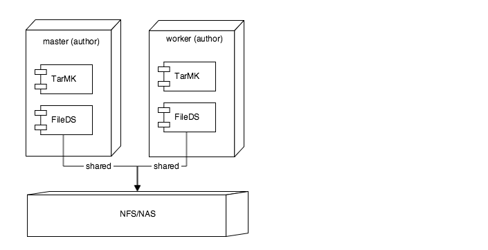

# Prácticas recomendadas de descarga de recursos {#assets-offloading-best-practices}

>[!WARNING]
>
>Esta función está en desuso AEM la versión 6.4 y se ha eliminado en la AEM 6.5. Planee en consecuencia.

La gestión de archivos de gran tamaño y flujos de trabajo en ejecución en Adobe Experience Manager (AEM) Assets pueden consumir considerables recursos de CPU, memoria y E/S. En concreto, el tamaño de los recursos, los flujos de trabajo, el número de usuarios y la frecuencia de consumo de recursos pueden afectar al rendimiento general del sistema. Las operaciones que requieren más recursos incluyen AEM consumo de recursos y flujos de trabajo de replicación. El uso intensivo de estos flujos de trabajo en una única instancia de creación de AEM puede afectar negativamente a la eficacia de la creación.

La descarga de estas tareas a instancias de trabajo dedicadas puede reducir las sobrecargas de CPU, memoria e IO. En general, la idea detrás de la descarga es distribuir tareas que consumen recursos intensivos de CPU/memoria/IO a instancias de trabajo dedicadas. Las siguientes secciones incluyen casos de uso recomendados para la descarga de recursos.

## Descarga de AEM Assets {#aem-assets-offloading}

AEM Assets implementa una extensión de flujo de trabajo nativa específica del recurso para la descarga. Se basa en la extensión de flujo de trabajo genérica que proporciona el marco de descarga, pero incluye funciones adicionales específicas de recursos en la implementación. El objetivo de la descarga de recursos es ejecutar de forma eficaz el flujo de trabajo de recursos de actualización de DAM en un recurso cargado. La descarga de recursos permite obtener un control bueno de los flujos de trabajo de ingesta.

## Componentes de descarga de AEM Assets {#aem-assets-offloading-components}

En el diagrama siguiente se muestran los componentes principales del proceso de descarga de recursos:

### Flujo de trabajo de descarga de recursos de actualización de DAM {#dam-update-asset-offloading-workflow}

El flujo de trabajo de descarga de recursos de actualización de DAM se ejecuta en el servidor principal (autor) en el que el usuario carga los recursos. Este flujo de trabajo se activa mediante un lanzador de flujo de trabajo normal. En lugar de procesar el recurso cargado, este flujo de trabajo de descarga crea un nuevo trabajo con el tema *com/adobe/granite/workflow/offloading*. El flujo de trabajo de descarga agrega el nombre del flujo de trabajo de destino: el flujo de trabajo de recursos de actualización de DAM en este caso y la ruta del recurso a la carga útil del trabajo. Después de crear el trabajo de descarga, el flujo de trabajo de descarga en la instancia principal espera hasta que se ejecute el trabajo de descarga.

### Administrador de trabajos {#job-manager}

El administrador de trabajos distribuye los nuevos trabajos a las instancias de trabajo. Al diseñar el mecanismo de distribución, es importante tener en cuenta la habilitación del tema. Los trabajos solo se pueden asignar a instancias en las que el tema del trabajo está habilitado. Deshabilite el tema `com/adobe/granite/workflow/offloading` en el primario y actívelo en el trabajador para asegurarse de que el trabajo esté asignado al trabajador.

### AEM descarga {#aem-offloading}

El marco de descarga identifica los trabajos de descarga de flujo de trabajo asignados a instancias de trabajo y utiliza la replicación para transportarlos físicamente, incluida su carga útil (por ejemplo, imágenes que se van a ingerir) a los trabajadores.

### Consumidor de trabajo de descarga de flujo de trabajo {#workflow-offloading-job-consumer}

Una vez escrito un trabajo en el trabajador, el administrador de trabajos llama al consumidor del trabajo responsable del tema *com/adobe/granite/workflow/offloading*. El consumidor del trabajo ejecuta el flujo de trabajo de recursos de actualización de DAM en el recurso.

## Topología de Sling {#sling-topology}

La topología de Sling agrupa AEM instancias y les permite estar conscientes entre sí, independientemente de la persistencia subyacente. Esta característica de la topología de Sling le permite crear topologías para escenarios no agrupados, agrupados y mixtos. Una instancia puede exponer propiedades a toda la topología. El marco proporciona llamadas de retorno para escuchar los cambios en la topología (instancias y propiedades). La topología de Sling proporciona la base para los trabajos distribuidos de Sling.

### Sling Distributed jobs {#sling-distributed-jobs}

Los trabajos distribuidos de Sling facilitan la distribución de trabajos entre un conjunto de instancias que son miembros de la topología. Los trabajos de Sling se basan en la idea de las capacidades. Un trabajo se define por su tema de trabajo. Para ejecutar un trabajo, una instancia debe proporcionar un consumidor de trabajo para un tema de trabajo específico. El tema del trabajo es el controlador principal del mecanismo de distribución.

Los trabajos solo se distribuyen a instancias que proporcionan un consumidor de trabajo para el tema. Al habilitar o deshabilitar a los consumidores de trabajos en una instancia, puede definir las capacidades de una instancia e influir en el mecanismo de distribución. Los consumidores de trabajo disponibles de una instancia se transmiten a toda la topología.

En este contexto, el término distribución significa la asignación de un trabajo a una instancia específica que proporciona un cliente de trabajo. La asignación a una instancia se almacena en el repositorio. En otras palabras, los trabajos distribuidos de Sling se pueden asignar a cualquier instancia de la topología de forma predeterminada. Sin embargo, otros trabajos solo se pueden ejecutar por instancias que comparten el mismo repositorio. Esto implica que estos trabajos solo se pueden ejecutar por instancias que formen parte del mismo clúster. Los trabajos asignados a instancias de un clúster diferente no se ejecutan.

### Marco de descarga de granito {#granite-offloading-framework}

El marco de descarga de Granite complementa la distribución de trabajos de Sling para ejecutar trabajos asignados a instancias no agrupadas. No realiza ninguna distribución (asignación de instancia). Sin embargo, identifica los trabajos de Sling que se distribuyeron a instancias no agrupadas y los transporta a la instancia de destino para su ejecución. Actualmente, la descarga utiliza la replicación para realizar este transporte de trabajo. Para ejecutar un trabajo, la descarga define la entrada y la salida, que luego se combinan con el trabajo para crear la carga útil del trabajo.

Los trabajos distribuidos de Sling proporcionan el marco de trabajo y distribución. La descarga de granito solo se ocupa del transporte para el caso especial en el que los trabajos se distribuyen a instancias no agrupadas.

Además del transporte, el marco de descarga proporciona una extensión para el motor de flujo de trabajo. Permite que el marco cree trabajos distribuidos como parte de un flujo de trabajo y espere a que se completen antes de que avance el flujo de trabajo. Se implementa mediante la API de paso externa de flujo de trabajo del motor de flujo de trabajo. Una de las extensiones facilita la distribución genérica de los flujos de trabajo. No se admite la distribución de pasos de flujo de trabajo únicos.

El marco de descarga también incluye una interfaz de usuario (UI) para visualizar y controlar la habilitación del tema del trabajo en toda la topología. La interfaz de usuario le permite configurar convenientemente el tema de habilitación de los trabajos distribuidos de Sling. También puede configurar la descarga sin la interfaz de usuario.

## Directrices generales y prácticas recomendadas para la descarga de recursos {#general-guidance-and-best-practices-for-asset-offloading}

Cada implementación es única y, como tal, no hay una configuración de descarga única. En las secciones siguientes se proporcionan directrices y prácticas recomendadas sobre la descarga de la ingesta de recursos.

La descarga de activos también impone gastos generales al sistema, incluidos los gastos generales de funcionamiento. Si se producen problemas con la carga de ingesta de recursos, Adobe recomienda mejorar primero la configuración sin descargar. Considere las siguientes opciones antes de pasar a la descarga de recursos:

* Escalar hardware
* Optimización de flujos de trabajo
* Uso de flujos de trabajo transitorios
* Limitar el número de núcleos utilizados para flujos de trabajo

Si llega a la conclusión de que la descarga de activos es un enfoque adecuado para usted, Adobe proporciona las siguientes directrices:

* Se recomienda una implementación basada en TarMK
* La descarga de recursos basados en TarMK no está diseñada para una amplia escala horizontal
* Garantizar que el rendimiento de la red entre el autor y los trabajadores sea satisfactorio

### Implementación de descarga de recursos recomendados {#recommended-assets-offloading-deployment}

Con AEM y Oak, hay varios escenarios de implementación posibles. Para la descarga de recursos, se recomienda una implementación basada en TarMK con un almacén de datos compartido. En el diagrama siguiente se describe la implementación recomendada:

Para obtener más información sobre la configuración de un almacén de datos, consulte [Configuración de almacenes de nodos y almacenes de datos en AEM](../sites-deploying/data-store-config.md).

### Desactivación de la administración automática del agente {#turning-off-automatic-agent-management}

Adobe recomienda desactivar la administración automática del agente porque no admite la replicación sin binarios y puede causar confusión al configurar una nueva topología de descarga. Además, no soporta automáticamente el flujo de replicación hacia adelante requerido por la replicación sin binarios.

1. Abra el Administrador de configuración desde la dirección URL `http://localhost:4502/system/console/configMgr`.
1. Abra la configuración para `OffloadingAgentManager` (`http://localhost:4502/system/console/configMgr/com.adobe.granite.offloading.impl.transporter.OffloadingAgentManager`).
1. Deshabilite la administración automática del agente.

### Uso de la replicación de reenvío {#using-forward-replication}

De forma predeterminada, el transporte de descarga utiliza la replicación inversa para recuperar los recursos descargados del trabajador al primario. Los agentes de replicación inversa no admiten replicación sin binario. Debe configurar la descarga para que utilice la replicación de reenvío para que los recursos descargados vuelvan del trabajador al primario.

1. Si está migrando desde la configuración predeterminada utilizando la replicación inversa, deshabilite o elimine todos los agentes llamados &quot; `offloading_outbox`&quot; y &quot; `offloading_reverse_*`&quot; en el programa primario y de trabajo, donde &amp;ast; representa el Sling id de la instancia de destino.
1. En cada trabajador, cree un nuevo agente de replicación de reenvío que apunte al primario. El procedimiento es el mismo que crear agentes de reenvío de principal a trabajador. Consulte [Creación de agentes de replicación para descarga](../sites-deploying/offloading.md#creating-replication-agents-for-offloading) para obtener instrucciones sobre la configuración de la descarga de agentes de replicación.
1. Abra la configuración para `OffloadingDefaultTransporter` (`http://localhost:4502/system/console/configMgr/com.adobe.granite.offloading.impl.transporter.OffloadingDefaultTransporter`).
1. Cambie el valor de la propiedad `default.transport.agent-to-master.prefix` de `offloading_reverse` a `offloading`.

<!-- TBD: Make updates to the configuration for allow and block list after product updates are done.
TBD: Update the property in the last step when GRANITE-30586 is fixed.
-->

### Uso del almacén de datos compartido y replicación sin binario entre el autor y los trabajadores {#using-shared-datastore-and-binary-less-replication-between-author-and-workers}

Se recomienda el uso de la replicación sin binarios para reducir la sobrecarga de transporte para la descarga de recursos. Para saber cómo configurar la replicación sin binarios para un almacén de datos compartido, consulte [Configuración de almacenes de nodos y almacenes de datos en AEM](/help/sites-deploying/data-store-config.md). El procedimiento no es diferente para la descarga de recursos, excepto que implica otros agentes de replicación. Debido a que la replicación sin binario solo funciona con agentes de replicación de reenvío, también debe utilizar la replicación de reenvío para todos los agentes de descarga.

### Desactivación de paquetes de transporte {#turning-off-transport-packages}

De forma predeterminada, la descarga crea un paquete de contenido que contiene el trabajo de descarga y la carga útil de trabajo (el recurso original) y transporta este paquete de descarga única utilizando una única solicitud de replicación. La creación de estos paquetes de descarga es contraproducente cuando se utiliza la replicación sin binario, ya que los binarios se serializan de nuevo en el paquete al crear el paquete. El uso de estos paquetes de transporte se puede desactivar, lo que hace que el trabajo de descarga y la carga útil se transporten en varias solicitudes de replicación, una para cada entrada de carga útil. De esta manera, se puede utilizar el beneficio de la replicación sin binarios.

1. Abra la configuración de componentes del componente *OffloadingDefaultTransporter* en [http://localhost:4502/system/console/configMgr/com.adobe.granite.offloading.impl.transporter.OffloadingDefaultTransporter](http://localhost:4502/system/console/configMgr/com.adobe.granite.offloading.impl.transporter.OffloadingDefaultTransporter)
1. Deshabilite la propiedad *Paquete de replicación (default.transport.contentpackage)*.

### Desactivación del transporte del modelo de flujo de trabajo {#disabling-the-transport-of-workflow-model}

De forma predeterminada, el flujo de trabajo de descarga *DAM Update Asset Offloading* agrega el modelo de flujo de trabajo para llamar al trabajador a la carga útil de trabajo. Debido a que este flujo de trabajo sigue el modelo predeterminado *DAM Update Asset* de forma predeterminada, esta carga útil adicional se puede eliminar.

Si el modelo de flujo de trabajo está desactivado en la carga útil del trabajo, asegúrese de distribuir los cambios al modelo de flujo de trabajo al que se hace referencia mediante otras herramientas, como el administrador de paquetes.

Para desactivar el transporte del modelo de flujo de trabajo, modifique el flujo de trabajo de descarga de recursos de actualización de DAM .

1. Abra la consola de flujo de trabajo en [http://localhost:4502/libs/cq/workflow/content/console.html](http://localhost:4502/libs/cq/workflow/content/console.html).
1. Abra la pestaña Modelos .
1. Abra el modelo de flujo de trabajo de descarga de recursos de actualización de DAM .
1. Abra las propiedades de los pasos para el paso Descarga del flujo de trabajo DAM.
1. Abra la pestaña Argumentos y anule la selección de las opciones Añadir modelo a entrada y Añadir modelo a salida .
1. Guarde los cambios en el modelo.

### Optimización del intervalo de sondeo {#optimizing-the-polling-interval}

La descarga del flujo de trabajo se implementa mediante un flujo de trabajo externo en el primario, que sondea la finalización del flujo de trabajo descargado en el trabajador. El intervalo de sondeo predeterminado para los procesos de flujo de trabajo externos es de cinco segundos. Adobe recomienda aumentar el intervalo de sondeo del paso de descarga de recursos a al menos 15 segundos para reducir la sobrecarga de descarga en el nivel principal.

1. Abra la consola de flujo de trabajo en [http://localhost:4502/libs/cq/workflow/content/console.html](http://localhost:4502/libs/cq/workflow/content/console.html).

1. Abra la pestaña Modelos .
1. Abra el modelo de flujo de trabajo de descarga de recursos de actualización de DAM .
1. Abra las propiedades de paso del paso Descarga del flujo de trabajo DAM .
1. Abra la pestaña Commons y ajuste el valor de la propiedad Period.
1. Guarde los cambios en el modelo.

## Más recursos {#more-resources}

Este documento se centra en la descarga de recursos. A continuación se muestra documentación adicional sobre la descarga:

* [Descarga de trabajos](/help/sites-deploying/offloading.md)
* [Descarga del flujo de trabajo de recursos](/help/sites-administering/workflow-offloader.md)

