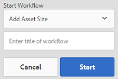

# Procesar recursos digitales {#process-assets}

>[!CAUTION]
>
>AEM 6.4 ha llegado al final de la compatibilidad ampliada y esta documentación ya no se actualiza. Para obtener más información, consulte nuestra [períodos de asistencia técnica](https://helpx.adobe.com/es/support/programs/eol-matrix.html). Buscar las versiones compatibles [here](https://experienceleague.adobe.com/docs/).

[!DNL Adobe Experience Manager Assets] le permite trabajar en sus recursos digitales de muchas maneras para permitir un procesamiento de recursos robusto. Puede utilizar los métodos de procesamiento disponibles o ampliar los métodos para garantizar la finalización completa de los procesos del negocio mediante, auditorías y cumplimiento de normas, descubrimiento y distribución, y sanidad básica de sus recursos digitales. Puede hacer todo esto mientras logra la escala y personalización necesarias.

## Explicación de los flujos de trabajo {#understand-workflows}

Para el procesamiento de recursos, [!DNL Experience Manager] utiliza flujos de trabajo. Los flujos de trabajo ayudan a automatizar la lógica empresarial o las actividades. De forma predeterminada, se proporcionan pasos granulares para realizar tareas específicas y los desarrolladores pueden crear sus propios pasos personalizados. Estos pasos se pueden combinar en un orden lógico para crear flujos de trabajo. Por ejemplo, un flujo de trabajo puede aplicar automáticamente marcas de agua en imágenes cargadas según criterios específicos como metadatos incrustados en la imagen, carpeta a la que se carga, resolución de la imagen, etc. Otro ejemplo es un flujo de trabajo configurado para marcar con agua imágenes de esta forma y que aborda simultáneamente varias necesidades de administración de recursos, como agregar metadatos, crear representaciones, agregar etiquetas inteligentes para la detección de recursos, publicar en un almacén de datos, configurar permisos para el acceso de usuarios, etc.

## Flujos de trabajo predeterminados disponibles en el Experience Manager {#default-workflows}

De forma predeterminada, todos los recursos cargados se procesan mediante [!UICONTROL Recurso de actualización DAM] flujo de trabajo. El flujo de trabajo se ejecuta para cada recurso cargado y realiza tareas básicas de administración de recursos, como la generación de representación, la reescritura de metadatos, la extracción de páginas, la extracción de medios y la transcodificación.

Para ver los distintos modelos de flujo de trabajo disponibles de forma predeterminada, consulte [!UICONTROL Herramientas > Flujo de trabajo > Modelos] en [!DNL Experience Manager].

*Figura: Algunos de los flujos de trabajo predeterminados disponibles en [!DNL Experience Manager].*

## Aplicación de flujos de trabajo a recursos {#applying-workflows-to-assets}

La aplicación de flujos de trabajo a recursos digitales es la misma que para las páginas de sitios web. Para obtener una guía completa sobre cómo crear y utilizar flujos de trabajo, consulte [iniciar flujos de trabajo](/help/sites-authoring/workflows-participating.md).

Utilice flujos de trabajo en recursos digitales para activar el recurso o crear marcas de agua. Muchos de los flujos de trabajo de los recursos se activan automáticamente. Por ejemplo, el flujo de trabajo que crea automáticamente una representación después de editar una imagen está activado automáticamente.

>[!NOTE]
>
>Si un flujo de trabajo disponible en la IU clásica no está disponible en la IU táctil, como [!UICONTROL Solicitud para activar] y [!UICONTROL Solicitud para desactivar], consulte [crear modelos de flujo de trabajo](/help/sites-developing/workflows-models.md#make-workflow-models-available-in-touchui).

## Aplicación de un flujo de trabajo a un [!DNL Experience Manager] recurso {#apply-a-workflow-to-an-aem-asset}

<!-- 
TBD: Add animated GIF for these steps instead of all these screenshots.
-->

Para aplicar un flujo de trabajo a un recurso, siga estos pasos:

1. Vaya a la ubicación del recurso para el que desea iniciar un flujo de trabajo y haga clic en el recurso para abrir la página del recurso.

1. Vaya a la ubicación del recurso para el que desea iniciar un flujo de trabajo y haga clic en el recurso para abrir la página del recurso. Select **[!UICONTROL Cronología]** en el menú para mostrar la línea de tiempo.

   

1. Haga clic en **[!UICONTROL Acciones]** en la parte inferior para abrir la lista de acciones disponibles para el recurso.

1. Haga clic en **[!UICONTROL Iniciar flujo de trabajo]** de la lista.

1. En el **[!UICONTROL Iniciar flujo de trabajo]** , seleccione un modelo de flujo de trabajo en la lista.

   

1. (Opcional) Especifique un título para el flujo de trabajo, que se puede utilizar para hacer referencia a la instancia de flujo de trabajo.

   

1. Haga clic en **[!UICONTROL Inicio]** y haga clic en **[!UICONTROL Continuar]** en el cuadro de diálogo para confirmar. Cada paso del flujo de trabajo se muestra en la cronología como un evento.

   

## Aplicación de un flujo de trabajo a varios recursos {#applying-a-workflow-to-multiple-assets}

1. Desde la consola Recursos, vaya a la ubicación de los recursos para los que desea iniciar un flujo de trabajo y seleccione los recursos. Select **[!UICONTROL Cronología]** en el menú para mostrar la línea de tiempo.

   

1. Haga clic en el **[!UICONTROL Acciones]** en la parte inferior.

1. Haga clic en **[!UICONTROL Iniciar flujo de trabajo]**. En el **[!UICONTROL Iniciar flujo de trabajo]** seleccione un modelo de flujo de trabajo en la lista.

   

1. (Opcional) Especifique un título para el flujo de trabajo, que se puede utilizar para hacer referencia a la instancia de flujo de trabajo.

1. Haga clic en **[!UICONTROL Iniciar]** y, a continuación, en **[!UICONTROL Confirmar]** en el cuadro de diálogo. El flujo de trabajo se ejecuta en todos los recursos seleccionados.

## Aplicación de un flujo de trabajo a varias carpetas {#applying-a-workflow-to-multiple-folders}

El procedimiento para aplicar un flujo de trabajo a varias carpetas es similar al procedimiento para aplicar un flujo de trabajo a varios recursos. Seleccione las carpetas en la consola Recursos y realice los pasos 2-7 del procedimiento [aplicación de un flujo de trabajo a varios recursos](assets-workflow.md#applying-a-workflow-to-multiple-assets).

## Aplicación de un flujo de trabajo a una colección {#applying-a-workflow-to-a-collection}

Para obtener más información sobre la aplicación de un flujo de trabajo a una colección, consulte [aplicación de un flujo de trabajo a una colección](managing-collections-touch-ui.md#running-a-workflow-on-a-collection).

## Inicio automático de un flujo de trabajo para procesar los recursos de forma condicional {#auto-execute-workflow-on-some-assets}

Los administradores pueden configurar el flujo de trabajo para que ejecuten y procesen automáticamente los recursos en función de condiciones predefinidas. La funcionalidad es útil para los usuarios de la línea de negocios y los especialistas en marketing, por ejemplo, para crear un flujo de trabajo personalizado en carpetas específicas. Digamos que todos los activos de la sesión fotográfica de una agencia pueden estar marcados con agua o que todos los activos cargados por un profesional independiente pueden procesarse para crear representaciones específicas.

Para un modelo de flujo de trabajo, los usuarios pueden crear un iniciador de flujo de trabajo que lo ejecute. Un iniciador de flujo de trabajo supervisa los cambios en el repositorio de contenido y ejecuta el flujo de trabajo cuando se cumplen las condiciones predefinidas. Los administradores pueden proporcionar acceso a los especialistas en marketing para crear los flujos de trabajo y configurar el lanzador. Los usuarios pueden modificar el valor predeterminado [!UICONTROL Recurso de actualización DAM] flujo de trabajo para añadir los pasos adicionales necesarios para procesar recursos específicos. El flujo de trabajo se ejecuta en todos los recursos cargados recientemente. Utilice uno de los siguientes métodos para limitar la ejecución de los pasos adicionales en recursos específicos:

* Haga una copia de [!UICONTROL Recurso de actualización DAM] y modifíquelo para que se ejecute en una jerarquía de carpetas específica. Este método es útil para algunas carpetas.
* Los pasos de procesamiento adicionales se pueden agregar utilizando un [División OR](/help/sites-developing/workflows-step-ref.md#or-split) como aplicable condicionalmente a tantas carpetas como sea necesario.

## Prácticas recomendadas y limitaciones {#best-practices-limitations-tips}

* Tenga en cuenta sus necesidades para todos los tipos de representaciones al diseñar flujos de trabajo. Si no prevé la necesidad de una representación en el futuro, elimine su paso de creación del flujo de trabajo. Las representaciones no se pueden eliminar de forma masiva posteriormente. Las variantes de representación no deseadas pueden ocupar mucho espacio de almacenamiento tras el uso prolongado de [!DNL Experience Manager]. Para recursos individuales, puede eliminar las representaciones manualmente desde la interfaz de usuario. Para varios recursos, puede personalizar [!DNL Experience Manager] para eliminar representaciones específicas o eliminar los recursos y volver a cargarlos.
* De forma predeterminada, [!UICONTROL Recurso de actualización DAM] flujo de trabajo incluye algunos pasos para crear miniaturas y representaciones web. Si se eliminan todas las representaciones predeterminadas del flujo de trabajo, la interfaz de usuario de [!DNL Assets] no se representa correctamente.

>[!MORELIKETHIS]
>
>* [Aplicar y participar en flujos de trabajo](/help/sites-authoring/workflows.md)
>* [Creación de modelos de flujo de trabajo y ampliación de la funcionalidad del flujo de trabajo](/help/sites-developing/workflows.md)
>* [Métodos para ejecutar flujos de trabajo](/help/sites-administering/workflows-starting.md)
>* [Prácticas recomendadas del flujo de trabajo](/help/sites-developing/workflows-best-practices.md)

