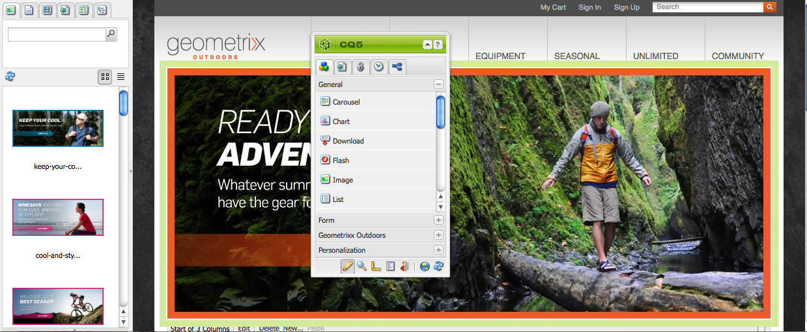

# Acerca de [!DNL Adobe Experience Manager Assets] como solución DAM {#about-assets}

>[!CAUTION]
>
>AEM 6.4 ha llegado al final de la compatibilidad ampliada y esta documentación ya no se actualiza. Para obtener más información, consulte nuestra [períodos de asistencia técnica](https://helpx.adobe.com/es/support/programs/eol-matrix.html). Buscar las versiones compatibles [here](https://experienceleague.adobe.com/docs/).

[!DNL Assets] es una herramienta de administración de recursos digitales (DAM) que forma parte integral de [!DNL Experience Manager] y permite a su empresa administrar y distribuir recursos digitales. Los usuarios de una organización pueden administrar, almacenar y acceder a muchos tipos de recursos digitales, como imágenes, vídeos, documentos, clips de audio, archivos 3D y medios enriquecidos, para utilizarlos en la web, en la impresión y para la distribución digital.

## ¿Qué es la administración de activos digitales? {#what-is-digital-asset-management}

[!DNL Assets] proporciona uso compartido y distribución en toda la empresa de los activos digitales clave de una organización. Los usuarios de una organización pueden almacenar, administrar y acceder a recursos digitales, como imágenes, gráficos, audio, vídeo y documentos, a través de una interfaz web (o una carpeta CIFS o WebDAV).

[!DNL Assets] capacidad de [!DNL Experience Manager] permite hacer lo siguiente:

* Agregue y comparta imágenes, documentos, archivos de audio y archivos de vídeo en diversos formatos de archivo.
* Administre los recursos agrupándolos por etiquetas, lightbox o estrellas (sus favoritos). Agregue anotaciones a los recursos.
* Busque recursos buscando nombres de archivo, texto completo de documentos y fechas, tipo de documento y etiquetas.
* Añada o edite información de metadatos de los recursos. Automáticamente, se genera una versión de los metadatos junto con el recurso correspondiente. Puede importar o exportar metadatos de recursos.
* Realizar funciones de edición de imágenes como escalar y agregar filtros de imagen. Importe y exporte varios recursos digitales simultáneamente mediante una carpeta WebDAV o CIFS.
* Utilice flujos de trabajo y notificaciones para permitir el procesamiento y la descarga conjuntos de cualquier conjunto de recursos y administrar los derechos de acceso a los recursos.

### [!DNL Experience Manager Assets] está integrado con [!DNL Experience Manager Sites] {#aem-assets-fully-integrated-in-cq-wcm}

[!DNL Assets] se integra completamente con [!DNL Sites] y funciona perfectamente para todos los casos de uso. Por ejemplo, al crear páginas web, la variable [!DNL Sites] los autores pueden buscar y utilizar los recursos digitales mediante el Buscador de contenido. La interfaz de usuario de [!DNL Assets] es igual que el de [!DNL Sites]. Consulte [descripción general de Sitios](/help/sites-authoring/qg-page-authoring.md) para obtener más información.

<!-- TBD: Update image for branding 

 

Assets managed within [!DNL Experience Manager] DAM can then be accessed via the content finder of WCM:

 -->

### Gestión de recursos digitales frente al componente de imagen {#digital-asset-management-versus-image-component}

Cuando determine si desea colocar una imagen en un repositorio DAM o utilizar un componente de imagen, tenga en cuenta el ciclo de vida de la imagen:

* Si la imagen tiene el mismo ciclo de vida que la página, utilice el componente Imagen .
* Si la imagen tiene un ciclo de vida independiente, por ejemplo, si utiliza la imagen dos veces o fuera de WCM, utilice [!DNL Assets].

## ¿Qué son los recursos digitales? {#what-are-digital-assets}

Un recurso es un documento digital, una imagen, un vídeo o audio (o parte del mismo) que puede tener varias representaciones y subrecursos (por ejemplo, capas en un archivo de Photoshop, diapositivas en un archivo de PowerPoint, páginas en un pdf o archivos en un ZIP).

Un recurso es esencialmente un binario más metadatos más representaciones más subrecursos. Consulte la [Guía de rendimiento de DAM](https://experienceleague.adobe.com/docs/experience-manager-64/assets/administer/performance-tuning-guidelines.html) para obtener información detallada.

>[!CAUTION]
>
>Cargar o editar un gran volumen de recursos (especialmente imágenes) puede afectar al rendimiento de su [!DNL Experience Manager] implementación.

### [!DNL Experience Manager Assets] terminología {#aem-assets-terminology}

Al trabajar con recursos digitales en [!DNL Experience Manager], debe comprender la siguiente terminología:

* **Colección**: Una colección de recursos, ya sea en función de la ubicación física (carpeta), las propiedades comunes (carpeta de búsqueda guardada) o la selección de usuarios (carpetas Lightbox).

* **Metadatos** [!DNL Assets] tengan metadatos; por ejemplo, autor, fecha de caducidad, información de DRM (Digital Rights Management), etc. Los metadatos están bajo control de acceso. [!DNL Assets] admite los siguientes esquemas comunes de metadatos predefinidos:

   * Dublin Core: incluido autor, descripción, fecha, asunto, etc.
   * IPTC: incluido evento, modelo, ubicación, etc.
   * WCM: incluidas las propiedades de página, [!UICONTROL Tiempo de activación] y [!UICONTROL Tiempo de inactividad], etc.

* **Etiquetado**: [!DNL Assets] se pueden etiquetar y clasificar. Consulte [organización de recursos](/help/assets/organize-assets.md).

* **Representaciones**: Una representación es la representación binaria de un recurso. [!DNL Assets] siempre tienen una representación principal: la del archivo cargado. Pueden tener cualquier cantidad de representaciones adicionales que se creen, por ejemplo, mediante pasos de flujo de trabajo personalizados o cuando se carga un recurso. Las representaciones pueden tener un tamaño diferente, con una resolución diferente, con una marca de agua añadida o cualquier otra característica modificada.

* **Versiones**: Al generar versiones, se crea una instantánea de los recursos digitales en un momento específico. Puede restaurar los recursos a versiones anteriores. Consulte [crear versiones en [!DNL Assets]](managing-assets-touch-ui.md#asset-versioning).

* **Subactivos**: Los subrecursos son recursos que constituyen un recurso, por ejemplo, capas de un [!DNL Adobe Photoshop] archivo o páginas en un archivo de PDF. En [!DNL Assets], puede administrar los subrecursos como lo haría con los recursos.

### Cómo trabajar con recursos digitales {#how-to-work-with-assets}

Se realiza una acción en un recurso o colección. Las acciones pueden crear o modificar recursos, colecciones y representaciones. Muchas de las acciones básicas que realiza en los recursos (cargar, eliminar, actualizar y guardar subrecursos) realizan déclencheur en flujos de trabajo preconfigurados. Se activan automáticamente [!DNL Assets] y se describen detalladamente en [!DNL Assets] controladores de medios.

Las tareas que puede realizar con estos flujos de trabajo preconfigurados:

* Guarde el recurso en el repositorio o elimínelo de él.
* Extraer y guardar metadatos del recurso; los elementos de metadatos individuales se guardan como XMP.
* Generar representaciones y miniaturas del recurso; incluido el cambio de tamaño y el recorte automáticos cuando sea necesario.
* Transcodificar el recurso donde sea necesario. Por ejemplo, el vídeo para uso en móviles y web se transcodifica con 24 fotogramas por segundo y se descarga vídeo con 30 fotogramas por segundo. El audio para uso móvil y web se transcodifica con 128 Kbps, y el audio se descarga con 192 Kbps.

Por supuesto, también puede aplicar flujos de trabajo manualmente. Consulte [Controladores de medios de recursos](media-handlers.md)para obtener una lista de flujos de trabajo predeterminados.

## [!DNL Experience Manager Assets] y [!DNL Media Library] {#cq-dam-vs-cq-medialibrary}

Consulte [Recursos y Media Library](medialibrary.md) para obtener más información sobre las diferencias.

>[!MORELIKETHIS]
>
>* [Introducción al vídeo: Experience Manager Assets as a moderna DAM](https://www.youtube.com/watch?v=PBwQqZgC-yo)

