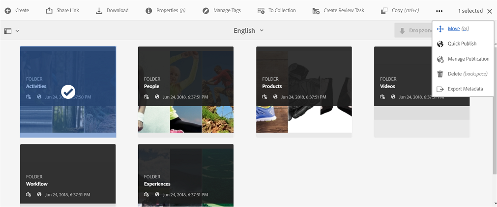

# Publicar recursos en Brand Portal {#publish-assets-to-brand-portal}

Como administrador de Adobe Experience Manager (AEM) Assets, puede publicar recursos en la instancia de AEM Assets Brand Portal (o programar el flujo de trabajo de publicación para una fecha y hora posteriores) para su organización. Sin embargo, primero debe configurar AEM Assets con Brand Portal. Para obtener más información, consulte [Configurar AEM Assets con Brand Portal](configure-aem-assets-with-brand-portal.md).

Después de publicar un recurso, estará disponible para los usuarios de Brand Portal.

Si realiza modificaciones posteriores en el recurso original en AEM Assets, los cambios no se reflejarán en Brand Portal hasta que vuelva a publicar el recurso. Esta función garantiza que los cambios en curso no estén disponibles en Brand Portal. Solo los cambios aprobados publicados por un administrador están disponibles en Brand Portal.

Después de que la replicación se realice correctamente, puede publicar recursos, carpetas y colecciones en Brand Portal. Para publicar recursos en Brand Portal, siga estos pasos:

>[!NOTE]
>
>Adobe recomienda la publicación escalonada, de preferencia durante las horas no pico, para que el autor de AEM no ocupe recursos excesivos.

1. Desde la consola Recursos, pase el ratón sobre los recursos deseados y seleccione la opción **[!UICONTROL Publicar]** en las acciones rápidas.

   También puede seleccionar los recursos que desea publicar en Brand Portal.

   

2. Para publicar los recursos en Brand Portal, hay dos opciones disponibles:
   * [Publicación inmediata de recursos](#publish-now)
   * [Publicar recursos más tarde](#publish-later)

## Publicar recursos ahora {#publish-now}

Para publicar los recursos seleccionados en Brand Portal, haga una de las acciones siguientes:

* En la barra de herramientas, seleccione **[!UICONTROL Publicación rápida]**. A continuación, en el menú, seleccione **[!UICONTROL Publicar en Brand Portal]**.

* En la barra de herramientas, seleccione **[!UICONTROL Administrar publicación]**.

   1. A continuación, en la **[!UICONTROL Acción]** seleccione **[!UICONTROL Publicar en Brand Portal]** y, en **[!UICONTROL Programación]**, seleccione **[!UICONTROL Ahora]**. Toque o haga clic **[!UICONTROL Siguiente].**

   2. Dentro de **[!UICONTROL Ámbito]**, confirme la selección y toque o haga clic en **[!UICONTROL Publicar en Brand Portal]**.

Aparece un mensaje que indica que los recursos se han puesto en cola para su publicación en Brand Portal. Inicie sesión en la interfaz de Brand Portal para ver los recursos publicados.

## Publicar recursos más tarde {#publish-later}

Para programar la publicación de recursos en Brand Portal para una fecha u hora posterior:

1. Una vez que haya seleccionado los recursos o las carpetas que desea publicar, seleccione **[!UICONTROL Administrar publicación]** en la barra de herramientas de la parte superior.
2. En la página **[!UICONTROL Administrar publicación]**, seleccione **[!UICONTROL Publicar en portal de marca]** en **[!UICONTROL Acción]** y seleccione **[!UICONTROL Más adelante]** en **[!UICONTROL Programación]**.

   

3. Seleccione una **[!UICONTROL Fecha de activación]** y especifique la hora. Toque o haga clic en **[!UICONTROL Siguiente]**.
4. Seleccione una **[!UICONTROL Fecha de activación]** y especifique la hora. Toque o haga clic en **[!UICONTROL Siguiente]**.
5. Especifique un título de flujo de trabajo en **[!UICONTROL Flujos de trabajo]**. Toque o haga clic en **[!UICONTROL Publicar posteriormente]**.

   

Ahora, inicie sesión en Brand Portal para ver si los recursos publicados están disponibles en la interfaz de Brand Portal.

