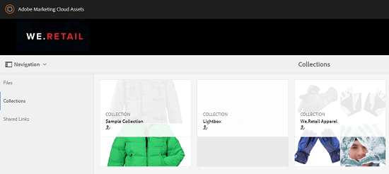

# Publicar colecciones en Brand Portal {#publish-collections-to-brand-portal}

Como administrador de Adobe Experience Manager (AEM) Assets, puede publicar colecciones en la instancia de AEM Assets Brand Portal para su organización. Sin embargo, primero debe integrar AEM Assets con Brand Portal. Para obtener más información, consulte [Configurar AEM Assets con Brand Portal](configure-aem-assets-with-brand-portal.md).

Si realiza las modificaciones posteriores a la colección original en AEM Assets, los cambios no se reflejan en Brand Portal hasta que vuelva a publicar la colección. Esta característica garantiza que los cambios en curso no estén disponibles en Brand Portal. Solo los cambios aprobados publicados por un administrador están disponibles en Brand Portal.

>[!NOTE]
>
>Los fragmentos de contenido no se pueden publicar en Brand Portal. Por lo tanto, si selecciona fragmentos de contenido en AEM Author, la acción **[Publicar en Brand Portal]** no estará disponible.
>
>Si las colecciones que contienen fragmentos de contenido se publican desde AEM Author hasta Brand Portal, todos los contenidos de la carpeta, excepto los fragmentos de contenido, se replican en la interfaz de Brand Portal.

## Publicar una colección en Brand Portal {#publish-a-collection-to-brand-portal}

1. En la interfaz de usuario de AEM Assets, toque o haga clic en el logotipo de AEM. A continuación, vaya a **[!UICONTROL Recursos > Colecciones]** desde la página **[!UICONTROL Navegación]**.
2. En la consola Colecciones, seleccione la colección que desee publicar en Brand Portal.

   

3. En la barra de herramientas, toque o haga clic en **[!UICONTROL Publicar en Brand Portal]**.

   

4. En el cuadro de diálogo de confirmación, toque o haga clic en **[!UICONTROL Publicar]**.
5. Cierre el mensaje de confirmación.
6. Inicie sesión en Brand Portal como administrador. La colección publicada está disponible en la consola Colecciones.

   

## Cancelar la publicación de colecciones {#unpublish-collections}

Puede cancelar la publicación de las colecciones que publique desde AEM Assets en Brand Portal. Una vez que haya cancelado la publicación de la colección original, su copia ya no estará disponible para los usuarios de Brand Portal.

1. En la consola Colecciones de la instancia de AEM Assets, seleccione la colección que desee cancelar la publicación.

   

2. En la barra de herramientas, toque o haga clic en el icono **[!UICONTROL Quitar de Brand Portal]**.

   

3. En el cuadro de diálogo, toque o haga clic en **[!UICONTROL Cancelar la publicación]**.
4. Cierre el mensaje de confirmación. La colección se quita de la interfaz de Brand Portal.
