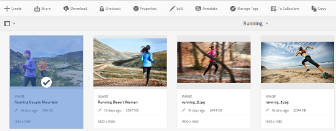
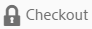

# Archivos de desprotección y desprotección en Assets {#check-in-and-check-out-files-in-assets}

>[!CAUTION]
>
>AEM 6.4 ha llegado al final de la compatibilidad ampliada y esta documentación ya no se actualiza. Para obtener más información, consulte nuestra [períodos de asistencia técnica](https://helpx.adobe.com/es/support/programs/eol-matrix.html). Buscar las versiones compatibles [here](https://experienceleague.adobe.com/docs/).

Recursos Adobe Experience Manager permite extraer recursos para editarlos y volver a protegerlos después de completar los cambios. Después de retirar un recurso, solo puede editarlo, anotarlo, publicarlo, moverlo o eliminarlo. Si se retira un recurso, este se bloquea. Otros usuarios no pueden realizar ninguna de estas operaciones en el recurso hasta que vuelva a proteger el recurso en [!DNL Experience Manager] Recursos. Sin embargo, aún pueden cambiar los metadatos del recurso bloqueado.

Para poder extraer o registrar recursos, necesita tener acceso de escritura en ellos.

Esta función ayuda a evitar que otros usuarios anulen los cambios realizados por un autor en los que varios usuarios colaboran en la edición de flujos de trabajo entre equipos.

## Extraer recursos {#checking-out-assets}

1. En la interfaz de usuario de Assets, seleccione el recurso que desea retirar. También puede seleccionar varios recursos para retirarlos.

   

1. En la barra de herramientas, toque o haga clic en el **[!UICONTROL Cierre de compra]** icono.

   

   Observe que la variable **[!UICONTROL Cierre de compra]** el icono le permite **[!UICONTROL Proteger]** con el candado abierto.

   

   Para verificar si otros usuarios pueden editar el recurso que ha desprotegido, inicie sesión como un usuario diferente. Aparece un icono de candado en la miniatura del recurso que ha extraído.

   

   Seleccione el recurso. Observe que la barra de herramientas no muestra ninguna opción que le permita editar, anotar, publicar o eliminar el recurso.

   

   Sin embargo, puede tocar o hacer clic en el **[!UICONTROL Ver propiedades]** para editar los metadatos del recurso bloqueado.

1. Pulse o haga clic en el icono Editar para abrir el recurso en modo de edición.

   

1. Edite el recurso y guarde los cambios. Por ejemplo, recorte la imagen y guárdela.

   

   También puede elegir anotar o publicar el recurso.

1. Seleccione el recurso editado en la interfaz de usuario de Assets y pulse o haga clic en el icono **[!UICONTROL Proteger]** de la barra de herramientas.

   

   El recurso modificado está registrado en [!DNL Assets] y está disponible para otros usuarios para su edición.

## Registro forzado {#forced-check-in}

Los administradores pueden proteger los recursos que han extraído otros usuarios.

1. Inicie sesión en [!DNL Assets] como administrador.
1. En la interfaz de usuario de Assets, seleccione uno o varios recursos que otros usuarios hayan extraído.

   

1. En la barra de herramientas, toque o haga clic en el **[!UICONTROL Bloqueo de la versión]** icono. El recurso se vuelve a registrar y se puede editar para otros usuarios.

   
