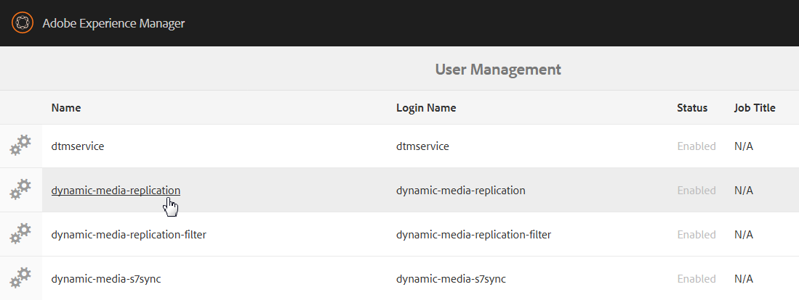
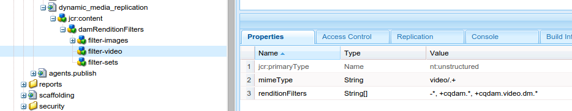

# Configuración de Dynamic Media: modo híbrido {#configuring-dynamic-media-hybrid-mode}

Dynamic Media: el híbrido debe estar habilitado y configurado para su uso. Según el caso de uso, Dynamic Media tiene varias [configuraciones admitidas](#supported-dynamic-media-configurations).

>[!NOTE]
>
>Si tiene intención de configurar y ejecutar Dynamic Media en modo de ejecución de Scene7, consulte [Configuración de Dynamic Media - modo Scene7](config-dms7.md).
>
>Si desea configurar y ejecutar Dynamic Media en modo de ejecución híbrido, siga las instrucciones de esta página.

Obtenga más información sobre cómo trabajar con [video](video.md) en Dynamic Media.

Si utiliza la configuración de Adobe Experience Manager para diferentes entornos, como uno para desarrollo, uno para ensayo y otro para producción en directo, debe configurar los Cloud Services de Dynamic Media para cada uno de esos entornos.

Si tiene problemas con la configuración de Dynamic Media, un lugar importante para buscar son los archivos de registro específicos de Dynamic Media. Se instalan automáticamente al activar Dynamic Media:

* `s7access.log`
* `ImageServing.log`

Están documentados en [Monitorización y mantenimiento de la instancia de AEM](/help/sites-deploying/monitoring-and-maintaining.md).

La publicación y entrega híbridas es una función central de la adición de Dynamic Media a Adobe Experience Manager. La publicación híbrida permite entregar recursos de Dynamic Media, como imágenes, conjuntos y vídeos, desde la nube en lugar de desde los nodos de publicación AEM.

Se seguirá ofreciendo otro contenido, como visores de Dynamic Media, páginas de sitio y contenido estático desde los nodos de publicación de AEM.

Si es cliente de Dynamic Media, debe utilizar el envío híbrido como mecanismo de envío para todo el contenido de Dynamic Media.

## Arquitectura de publicación híbrida para vídeos {#hybrid-publishing-architecture-for-videos}


## Arquitectura de publicación híbrida para imágenes {#hybrid-publishing-architecture-for-images}


## Configuraciones de Dynamic Media compatibles {#supported-dynamic-media-configurations}

Las tareas de configuración que siguen hacen referencia a los términos siguientes:

| **Término** | **Habilitado para Dynamic Media** | **Descripción** |
|---|---|---|
| nodo de creación AEM | Marca de verificación blanca en círculo verde | El nodo de creación que implementa en On-Premise o a través de Managed Services. |
| AEM nodo de publicación | &quot;X&quot; blanco en un cuadrado rojo. | El nodo de publicación que implementa en On-Premise o a través de Managed Services. |
| Nodo de publicación del servicio de imágenes | Marca de verificación blanca en un círculo verde. | El nodo de publicación que se ejecuta en los centros de datos administrados por Adobe. Hace referencia a la URL del servicio de imágenes. |

Puede optar por implementar Dynamic Media solo para imágenes, solo para vídeo o tanto para imágenes como para vídeo. Para determinar los pasos para configurar Dynamic Media para un escenario específico, consulte la siguiente tabla.

<table> 
 <tbody> 
  <tr> 
   <td><strong>Situación</strong></td> 
   <td><strong>Cómo funciona</strong></td> 
   <td><strong>Pasos de configuración</strong></td> 
  </tr> 
  <tr> 
   <td>Entregar SOLO imágenes en producción</td> 
   <td>Las imágenes se entregan a través de servidores en los centros de datos mundiales de Adobe y luego se almacenan en caché mediante una CDN para obtener un rendimiento escalable y un alcance global.</td> 
   <td> 
    <ol> 
     <li>En el nodo AEM <strong>author</strong>, <a href="#enabling-dynamic-media">habilite dynamic media</a>.</li> 
     <li>Configure imágenes en <a href="#configuring-dynamic-media-cloud-services">Cloud Services de Dynamic Media</a>.</li> 
     <li><a href="#configuring-image-replication">Configurar la replicación de imágenes</a>.</li> 
     <li><a href="#replicating-catalog-settings">Replicar la configuración del catálogo</a>.</li> 
     <li><a href="#replicating-viewer-presets">Duplique los ajustes preestablecidos de visor</a>.</li> 
     <li><a href="#using-default-asset-filters-for-replication">Utilice filtros de recursos predeterminados para la replicación</a>.</li> 
     <li><a href="#configuring-dynamic-media-image-server-settings">Configuración del servidor de imágenes de Dynamic Media</a>.</li> 
     <li><a href="#delivering-assets">Enviar recursos</a>.</li> 
    </ol> </td> 
  </tr> 
  <tr> 
   <td>Enviar SOLO imágenes en la preproducción (desarrollo, control de calidad, fase, etc.)</td> 
   <td>Las imágenes se entregan a través del nodo de publicación AEM. En esta situación, dado que el tráfico es mínimo, no es necesario enviar imágenes al centro de datos de Adobe. Una ventaja adicional es que esto permite una previsualización segura del contenido antes del inicio de la producción</td> 
   <td> 
    <ol> 
     <li>En el nodo AEM <strong>author</strong>, <a href="#enabling-dynamic-media">habilite dynamic media</a>.</li> 
     <li>En AEM nodo <strong>publish</strong>, <a href="#enabling-dynamic-media">active dynamic media</a>.</li> 
     <li><a href="#replicating-viewer-presets">Duplique los ajustes preestablecidos de visor</a>.</li> 
     <li>Configure el <a href="#setting-up-asset-filters-for-imaging-in-non-production-deployments">filtro de recursos para imágenes que no sean de producción</a>.</li> 
     <li><a href="#configuring-dynamic-media-image-server-settings">Configure Dynamic Media Image Server.</a></li> 
     <li><a href="#delivering-assets">Enviar recursos.</a></li> 
    </ol> </td> 
  </tr> 
  <tr> 
   <td>Enviar SOLO vídeo en cualquier entorno (producción, desarrollo, QE, fase, etc.)</td> 
   <td>Los vídeos son entregados y almacenados en caché por una CDN para un rendimiento escalable y alcance global. La imagen del póster de vídeo (miniatura del vídeo que se muestra antes de que se inicie la reproducción) la enviará la instancia de publicación de AEM.</td> 
   <td> 
    <ol> 
     <li>En el nodo AEM <strong>author</strong>, <a href="#enabling-dynamic-media">habilite dynamic media</a>.</li> 
     <li>En el nodo AEM <strong>publish</strong>, <a href="#enabling-dynamic-media">enable dynamic media</a> (la instancia de publicación sirve para la imagen del póster de vídeo y proporciona metadatos para la reproducción del vídeo).</li> 
     <li>Configure el vídeo en <a href="#configuring-dynamic-media-cloud-services">Cloud Services de Dynamic Media.</a></li> 
     <li><a href="#replicating-viewer-presets">Duplique los ajustes preestablecidos de visor</a>.</li> 
     <li>Configure el <a href="#setting-up-asset-filters-for-video-only-deployments">filtro de recursos para solo vídeo</a>.</li> 
     <li><a href="#delivering-assets">Enviar recursos.</a></li> 
    </ol> </td> 
  </tr> 
  <tr> 
   <td>Entregar imágenes y vídeo en producción</td> 
   <td><p>Los vídeos son entregados y almacenados en caché por una CDN para un rendimiento escalable y alcance global. Las imágenes y las imágenes de póster de vídeo se entregan a través de servidores en los centros de datos mundiales de Adobe y luego se almacenan en la caché de una CDN para lograr un rendimiento escalable y un alcance global.</p> <p>Consulte las secciones anteriores para configurar imágenes o vídeos en la preproducción. </p> </td> 
   <td> 
    <ol> 
     <li>En el nodo AEM <strong>author</strong>, <a href="#enabling-dynamic-media">habilite dynamic media</a>.</li> 
     <li>Configure el vídeo en <a href="#configuring-dynamic-media-cloud-services">Cloud Services de Dynamic Media.</a></li> 
     <li>Configure imágenes en <a href="#configuring-dynamic-media-cloud-services">Cloud Services de Dynamic Media.</a></li> 
     <li><a href="#configuring-image-replication">Configurar la replicación de imágenes</a>.</li> 
     <li><a href="#replicating-catalog-settings">Replicar la configuración del catálogo</a>.</li> 
     <li><a href="#replicating-viewer-presets">Duplique los ajustes preestablecidos de visor</a>.</li> 
     <li><a href="#using-default-asset-filters-for-replication">Utilice filtros de recursos predeterminados para la replicación.</a></li> 
     <li><a href="#configuring-dynamic-media-image-server-settings">Configure Dynamic Media Image Server.</a></li> 
     <li><a href="#delivering-assets">Enviar recursos.</a></li> 
    </ol> </td> 
  </tr> 
 </tbody> 
</table>

## Habilitación de Dynamic Media {#enabling-dynamic-media}

[Medios dinámicos ](https://www.adobe.com/solutions/web-experience-management/dynamic-media.html) desactivados de forma predeterminada. Para aprovechar las funciones de Dynamic Media, debe habilitar Dynamic Media mediante el modo de ejecución **[!UICONTROL dynamic media]** como lo haría, por ejemplo, en el modo de ejecución **[!UICONTROL publish]**. Antes de habilitarlo, asegúrese de revisar los [requisitos técnicos](/help/sites-deploying/technical-requirements.md#requirements-for-aem-dynamic-media-add-on).

>[!NOTE]
>
>Al habilitar el Dynamic Media a través del modo de ejecución, se sustituye la funcionalidad de AEM 6.1 y AEM 6.0, donde se habilitó el Dynamic Media estableciendo el indicador **[!UICONTROL dynamicMediaEnabled]** en **[!UICONTROL true]**. Este indicador no tiene funcionalidad en AEM 6.2 y posterior. Además, no es necesario reiniciar el inicio rápido para habilitar los medios dinámicos.

Al habilitar Dynamic Media, las funciones de Dynamic Media estarán disponibles en la interfaz de usuario y cada recurso de imagen cargado recibirá una `cqdam.pyramid.tiff` representación que se utilizará para el envío rápido de representaciones de imágenes dinámicas. Estos PTIFF tienen ventajas significativas incluyendo (1) la capacidad de administrar una sola imagen maestra y generar infinitas representaciones sobre la marcha sin ningún almacenamiento adicional y (2) la capacidad de usar visualización interactiva como zoom, panorámica, giro, etc.

Si desea utilizar Dynamic Media Classic en AEM, no debe habilitar Dynamic Media a menos que esté utilizando un [escenario específico](/help/sites-administering/scene7.md#aem-scene-integration-versus-dynamic-media). Dynamic Media está desactivado a menos que habilite Dynamic Media mediante el modo de ejecución.

Para habilitar Dynamic Media, debe habilitar el modo de ejecución de Dynamic Media desde la línea de comandos o desde el nombre del archivo de inicio rápido.

**Para activar Dynamic Media**:

1. En la línea de comandos, al iniciar el inicio rápido, haga lo siguiente:

   * Agregue **[!UICONTROL -r dynamicMedia]** al final de la línea de comandos al iniciar el archivo jar.

   ```shell
   java -Xmx4096m -Doak.queryLimitInMemory=500000 -Doak.queryLimitReads=500000 -jar cq-quickstart-6.4.0.jar -r dynamicmedia
   ```

   Si está publicando en s7delivery, también debe incluir los siguientes argumentos trustStore:

   ```shell
   -Djavax.net.ssl.trustStore=<absoluteFilePath>/customerTrustStoreFileName>
   
    -Djavax.net.ssl.trustStorePassword=<passwordForTrustStoreFile>
   ```

1. Solicite `http://localhost:4502/is/image` y asegúrese de que Image Server se esté ejecutando.

   >[!NOTE]
   >
   >Para solucionar problemas con Dynamic Media, consulte los siguientes registros en el directorio **[!UICONTROL crx-quickstart/logs/]**:
   >
   >* ImageServer-&lt;PortId>-&lt;yyyy>&lt;mm>&lt;dd>.log: el registro de ImageServer proporciona estadísticas e información analítica utilizada para analizar el comportamiento del proceso interno de ImageServer.

      Ejemplo de nombre de archivo de registro del servidor de imágenes: `ImageServer-57346-2019-07-25.log`
   * s7access-&lt;yyyy>&lt;mm>&lt;dd>.log: el registro de acceso s7registra cada solicitud realizada a Dynamic Media a través de `/is/image` y `/is/content`.
   Estos registros solo se utilizan cuando Dynamic Media está habilitado. No se incluyen en el paquete **Download Full** que se genera desde la página **[!UICONTROL system/console/status-Bundlelist]**; cuando llame al servicio de atención al cliente si tiene un problema con Dynamic Media, anexe ambos registros al problema.

### Si ha instalado AEM en un puerto o ruta de contexto diferente ... {#if-you-installed-aem-to-a-different-port-or-context-path}

Si está implementando [AEM en un servidor de aplicaciones](/help/sites-deploying/application-server-install.md) y tiene Dynamic Media habilitado, debe configurar el dominio **self** en el externalizador. De lo contrario, la generación de miniaturas de los recursos no funcionará correctamente en los recursos de Dynamic Media.

Además, si ejecuta inicio rápido en un puerto o ruta de contexto diferente, también debe cambiar el dominio **self**.

Cuando Dynamic Media está habilitado, las representaciones de miniaturas estáticas para los recursos de imagen se generan mediante Dynamic Media. Para que la generación de miniaturas funcione correctamente en los medios dinámicos, AEM debe realizar una solicitud de URL y conocer el número de puerto y la ruta de contexto.

En AEM:

* El dominio **self** del [externalizador](/help/sites-developing/externalizer.md) se utiliza para recuperar el número de puerto y la ruta de contexto.
* Si no hay ningún dominio **self** configurado, el número de puerto y la ruta de contexto se recuperan del servicio HTTP Jetty.

En una implementación AEM de QuickStart WAR, el número de puerto y la ruta de contexto no se pueden derivar, por lo tanto debe configurar un dominio **self**. Consulte la [documentación del externalizador](/help/sites-developing/externalizer.md) sobre cómo configurar el dominio **self**.

>[!NOTE]
En una [AEM implementación independiente de inicio rápido](/help/sites-deploying/deploy.md), generalmente no es necesario configurar un dominio **self** porque el número de puerto y la ruta de contexto se pueden configurar automáticamente. Sin embargo, si todas las interfaces de red están desactivadas, debe configurar el dominio **self**.

## Desactivación de Dynamic Media  {#disabling-dynamic-media}

Los medios dinámicos no están habilitados de forma predeterminada. Sin embargo, si ha activado medios dinámicos previamente, es posible que desee desactivarlos más adelante.

Para deshabilitar los medios dinámicos después de haberlos activado, debe quitar el indicador del modo de ejecución **[!UICONTROL -r dynamic media]**.

**Para deshabilitar Dynamic Media después de haberla habilitado**:

1. En la línea de comandos, al iniciar el inicio rápido, puede realizar una de las siguientes acciones:

   * No agregue `-r dynamicmedia` a la línea de comandos al iniciar el archivo JAR.

   ```shell
   java -Xmx4096m -Doak.queryLimitInMemory=500000 -Doak.queryLimitReads=500000 -jar cq-quickstart-6.4.0.jar
   ```

1. Solicitar `http://localhost:4502/is/image`. Recibe un mensaje que indica que Dynamic Media está deshabilitado.

   >[!NOTE]
   Una vez desactivado el modo de ejecución de Dynamic Media, el paso del flujo de trabajo que genera la representación `qdam.pyramid.tiff` se omite automáticamente. Esto también deshabilita la compatibilidad con representaciones dinámicas y otras funciones de Dynamic Media.
   Tenga en cuenta también que cuando el modo de ejecución de Dynamic Media está desactivado después de configurar el servidor de AEM, todos los recursos cargados en ese modo de ejecución no son válidos.

## (Opcional) Migración de ajustes preestablecidos y configuraciones de Dynamic Media de 6.3 a 6.4 sin downtime {#optional-migrating-dynamic-media-presets-and-configurations-from-to-zero-downtime}

Si está actualizando AEM Dynamic Media de 6.3 a 6.4, que ahora incluye la capacidad de cero tiempos de inactividad (también conocida como &quot;inclusión&quot;), es necesario ejecutar el siguiente comando curl para migrar todos sus ajustes preestablecidos y configuraciones de `/etc` a `/conf` en CRXDE Lite.

**Nota**: Si ejecuta la instancia de AEM en modo de compatibilidad, es decir, tiene la compatibilidad empaquetada instalada, no necesita ejecutar estos comandos.

Para migrar los ajustes preestablecidos y configuraciones personalizados de `/etc` a `/conf`, ejecute el siguiente comando de Linux curl:

`curl -u admin:admin http://localhost:4502/libs/settings/dam/dm/presets.migratedmcontent.json`

Para todas las actualizaciones, ya sea con o sin el paquete de compatibilidad, puede copiar los ajustes preestablecidos del visor incorporado ejecutando el siguiente comando:

`curl -u admin:admin http://localhost:4502/libs/settings/dam/dm/presets/viewer.pushviewerpresets`

## Configuración de la replicación de imágenes {#configuring-image-replication}

La entrega de imágenes de Dynamic Media funciona mediante la publicación de recursos de imagen, incluidas miniaturas de vídeo, desde AEM Author y la replicación en el servicio de replicación bajo demanda de Adobe (la URL del servicio de replicación). A continuación, los recursos se entregan mediante el servicio de entrega de imágenes bajo demanda (la URL del servicio de imágenes).

Debe hacer lo siguiente:

1. [Configure la autenticación](#setting-up-authentication).
1. [Configure el agente de replicación](#configuring-the-replication-agent).

El agente de replicación publica recursos de Dynamic Media, como imágenes, metadatos de vídeo y establece el servicio de imágenes alojado en Adobe. El agente de replicación no está habilitado de forma predeterminada.

Después de configurar el agente de replicación, debe [validar y probar que se ha configurado correctamente](#validating-the-replication-agent-for-dynamic-media). En esta sección se describen estos procedimientos.

>[!NOTE]
El límite de memoria predeterminado para la creación de PTIFF es de 3 GB en todos los flujos de trabajo. Por ejemplo, puede procesar una imagen que requiera 3 GB de memoria mientras otros flujos de trabajo están en pausa, o puede procesar 10 imágenes en paralelo que requieran 300 MB de memoria cada una.
El límite de memoria es configurable y debe ajustarse a la disponibilidad de recursos del sistema y al tipo de contenido de imagen que se está procesando. Si tiene muchos recursos muy grandes y tiene suficiente memoria en el sistema, puede aumentar este límite para garantizar que las imágenes se procesen en paralelo.
Se rechazará una imagen que requiera más del límite máximo de memoria.
Para cambiar el límite de memoria para la creación de PTIFF, vaya a **[!UICONTROL Tools > Operations > Web Console > Adobe CQ Scene7 PTiffManager]** y cambie el valor `maxMemory`.

### Configuración de la autenticación {#setting-up-authentication}

Debe configurar la autenticación de replicación en el autor para replicar imágenes en el servicio de entrega de imágenes de Dynamic Media. Para ello, obtenga un KeyStore y luego guárdelo en el usuario **[!UICONTROL dynamic-media-replication]** y configúrelo. El administrador de su empresa debe haber recibido un correo electrónico de bienvenida con el archivo KeyStore y las credenciales necesarias durante el proceso de aprovisionamiento. Si no lo ha recibido, póngase en contacto con el Servicio de atención al cliente.

**Para configurar la autenticación**:

1. Póngase en contacto con el Servicio de atención al cliente para obtener su archivo y contraseña de KeyStore si todavía no lo tiene. Esto forma parte del aprovisionamiento y asociará las claves a su cuenta.
1. En AEM, pulse el logotipo de AEM para acceder a la consola de navegación global y, a continuación, pulse **[!UICONTROL Herramientas > Seguridad > Usuarios]**.
1. En la página Administración de usuarios , vaya al usuario **[!UICONTROL dynamic-media-replication]** y, a continuación, pulse para abrir.

   

1. En la página Editar configuración de usuario para la replicación de Dynamic Media, pulse la pestaña **[!UICONTROL Almacén de claves]** y, a continuación, pulse **[!UICONTROL Crear almacén de claves]**.

   

1. Introduzca una contraseña y confirme la contraseña en el cuadro de diálogo **[!UICONTROL Establecer contraseña de acceso al almacén de claves]**.

   >[!NOTE]
   Recuerde la contraseña que ha introducido. Deberá introducirlo de nuevo cuando configure el **[!UICONTROL Agente de replicación]** más adelante.

   

1. En la página **[!UICONTROL Editar configuración de usuario para la replicación de medios dinámicos]**, expanda el área **[!UICONTROL Agregar clave privada del archivo KeyStore]** y añada lo siguiente (vea las imágenes que siguen):

   * En el campo **[!UICONTROL Nuevo alias]**, introduzca el nombre de un alias que utilizará más adelante en la configuración de replicación; por ejemplo, **replicación**.
   * Toque **[!UICONTROL Archivo KeyStore]**. Vaya al archivo KeyStore proporcionado por Adobe, selecciónelo y pulse **[!UICONTROL Abrir]**.
   * En el campo **[!UICONTROL KeyStore File Password]**, introduzca la contraseña del archivo KeyStore. Es _no_ la contraseña de KeyStore que creó en el paso 5, pero es el Adobe de contraseña del archivo KeyStore que proporciona el correo electrónico de bienvenida que se le envió durante el aprovisionamiento. Póngase en contacto con el Servicio de atención al cliente de Adobe si no recibió una contraseña para el archivo KeyStore.
   * En el campo **[!UICONTROL Private Key Password]**, introduzca la contraseña de clave privada (puede ser la misma contraseña de clave privada que se proporcionó en el paso anterior). Adobe proporciona la contraseña de clave privada en el correo electrónico de bienvenida que se le envía durante el aprovisionamiento. Póngase en contacto con el Servicio de atención al cliente de Adobe si no recibió una contraseña de clave privada.
   * En el campo **[!UICONTROL Private Key Alias]**, introduzca el alias de clave privada. Por ejemplo, `companyname-alias`. Adobe proporciona el alias de clave privada en el correo electrónico de bienvenida que se le envía durante el aprovisionamiento. Póngase en contacto con el Servicio de atención al cliente de Adobe si no recibió un alias de clave privada.

   

1. Toque **[!UICONTROL Guardar y cerrar]** para guardar los cambios en este usuario.

   A continuación, debe [configurar el agente de replicación.](#configuring-the-replication-agent)

### Configuración del Agente de replicación {#configuring-the-replication-agent}

1. En AEM, pulse el logotipo de AEM para acceder a la consola de navegación global y, a continuación, pulse **[!UICONTROL Herramientas > Implementación > Replicación > Agentes en author]**.
1. En la página Agentes del autor, pulse **[!UICONTROL Replicación de imagen híbrida de Dynamic Media (s7delivery)]**.
1. Toque **[!UICONTROL Editar]**.
1. Pulse la pestaña **[!UICONTROL Settings]** e introduzca lo siguiente:

   * **[!UICONTROL Habilitado]** : seleccione esta casilla de verificación para habilitar el agente de replicación.
   * **[!UICONTROL Región]** : configure en la región adecuada: América del Norte, Europa o Asia
   * **[!UICONTROL ID del inquilino]** : este valor es el nombre de su empresa o inquilino que está publicando en el servicio de replicación. Este valor es el ID del inquilino que proporciona el Adobe en el correo electrónico de bienvenida que se le envió durante el aprovisionamiento. Póngase en contacto con el Servicio de atención al cliente de Adobe si no lo recibió.
   * **[!UICONTROL Alias]**  del almacén de claves: Este valor es el mismo que el valor establecido de** Nuevo alias** al generar la clave en  [Configuración de autenticación](#setting-up-authentication); por ejemplo,  `replication`. (Consulte el paso 7 en [Configuración de la autenticación](#setting-up-authentication)).
   * **[!UICONTROL Contraseña de almacén de claves]** : es la contraseña de almacén de claves que se creó al pulsar  **[!UICONTROL Crear almacén de claves]**. Adobe no proporciona esta contraseña. Consulte el paso 5 de [Configuración de la autenticación](#setting-up-authentication).

   La siguiente imagen muestra el agente de replicación con datos de ejemplo:

   

1. Pulse **[!UICONTROL Aceptar]**.

### Validación del agente de replicación para Dynamic Media {#validating-the-replication-agent-for-dynamic-media}

Para validar el agente de replicación para Dynamic Media, haga lo siguiente:

Toque **[!UICONTROL Probar conexión]**. El resultado de ejemplo es el siguiente:

```shell
11.03.2016 10:57:55 - Transferring content for ReplicationAction{type=TEST, path[0]='/content/dam', time=1457722675402, userId='admin', revision='null'}
11.03.2016 10:57:55 - * Auth User: replication-receiver
11.03.2016 10:57:55 - * HTTP Version: 1.1
11.03.2016 10:57:55 - * Using OAuth 2.0 Authorization Grants
11.03.2016 10:57:55 - * OAuth 2.0 User: dynamic-media-replication
11.03.2016 10:57:55 - * OAuth 2.0 Token: '*****' initialized
11.03.2016 10:57:55 - Publishing: POST[https://replicate-na.assetsadobe.com:8580/is-publish/publish-receiver?Cmd=Test&RootId=xfpuu-6613]
11.03.2016 10:57:55 - Publish response: OK[]
11.03.2016 10:57:55 - Transfer succeeded in 141 ms for ReplicationAction{type=TEST, path[0]='/content/dam', time=1457722675402, userId='admin', revision='null'}
-------------------------------------------------------------------------------------------------------------------------------
Replication test succeeded
```

>[!NOTE]
También puede comprobarlo realizando una de las siguientes acciones:
* Compruebe los registros de replicación para asegurarse de que el recurso se replica.
* Publicar una imagen. Pulse la imagen y seleccione **[!UICONTROL Visualizadores]** en el menú desplegable. Seleccione un ajuste preestablecido de visualizador, pulse **[!UICONTROL URL]** y copie y pegue la URL en el navegador para comprobar que puede ver la imagen.


### Resolución de problemas de autenticación {#troubleshooting-authentication}

Al configurar la autenticación, estos son algunos problemas con los que puede encontrar soluciones. Antes de comprobarlos, asegúrese de haber configurado la replicación.

#### Problema: Código de estado HTTP 401 con mensaje: se requiere autorización {#problem-http-status-code-with-message-authorization-required}

Este problema puede deberse a un error al configurar KeyStore para el usuario `dynamic-media-replication`.

```shell
Replication test to s7delivery:https://s7bern.macromedia.com:8580/is-publish/
17.06.2016 18:54:43 - Transferring content for ReplicationAction{type=TEST, path[0]='/content/dam', time=1466214883309, userId='admin', revision='null'}
17.06.2016 18:54:43 - * Auth User: replication-receiver
17.06.2016 18:54:43 - * HTTP Version: 1.1
17.06.2016 18:54:43 - * Using OAuth 2.0 Authorization Grants
17.06.2016 18:54:43 - * OAuth 2.0 User: dynamic-media-replication
17.06.2016 18:54:43 - No OAuth token available. OAuth not initialized
17.06.2016 18:54:43 - * Using Client Auth SSL alias - replication-alias *
17.06.2016 18:54:43 - Publishing: POST[https://<localhost>:8580/is-publish//publish-receiver?Cmd=Test&RootId=brough]
17.06.2016 18:54:43 - Transfer failed for ReplicationAction{type=TEST, path[0]='/content/dam', time=1466214883309, userId='admin', revision='null'}. java.io.IOException: Failed to execute request
'https://<localhost>:8580/is-publish//publish-receiver?Cmd=Test&RootId=brough':
 Server returned status code 401 with message: Authorization required.
17.06.2016 18:54:43 - Error while replicating: com.day.cq.replication.ReplicationException: Transfer failed for ReplicationAction{type=TEST, path[0]='/content/dam', time=1466214883309,
 userId='admin', revision='null'}. java.io.IOException: Failed to execute request
'https://<localhost>:8580/is-publish//publish-receiver?Cmd=Test&RootId=brough':
 Server returned status code 401 with message: Authorization required.
```

**Solución**: Compruebe que  `KeyStore` se guarde en  **[!UICONTROL dynamic-media-]** replicationuser y que se proporcione con la contraseña correcta.

#### Problema: No Se Pudo Descifrar La Clave: No Se Pudieron Descifrar Los Datos {#problem-could-not-decrypt-key-could-not-decrypt-data}

```xml
Replication test to s7delivery:https://<localhost>:8580/is-publish/
17.06.2016 19:00:16 - Transferring content for ReplicationAction{type=TEST, path[0]='/content/dam', time=1466215216662, userId='admin', revision='null'}
17.06.2016 19:00:16 - * Auth User: replication-receiver
17.06.2016 19:00:16 - * HTTP Version: 1.1
17.06.2016 19:00:16 - * Using OAuth 2.0 Authorization Grants
17.06.2016 19:00:16 - * OAuth 2.0 User: dynamic-media-replication
17.06.2016 19:00:16 - No OAuth token available. OAuth not initialized
17.06.2016 19:00:16 - * Using Client Auth SSL alias - replication-alias *
17.06.2016 19:00:16 - Transfer failed for ReplicationAction{type=TEST, path[0]='/content/dam', time=1466215216662, userId='admin', revision='null'}. java.lang.SecurityException: java.security.UnrecoverableKeyException: Could not decrypt key: Could not decrypt data.
```

**Solución**: Compruebe la contraseña. La contraseña guardada en el agente de replicación no es la misma contraseña que se utilizó para crear el almacén de claves.

#### Problema: InvalidAlgorithmParameterException {#problem-invalidalgorithmparameterexception}

Este problema se debe a un error de configuración en la instancia de autor de AEM. El proceso java del autor no está obteniendo el `javax.net.ssl.trustStore` correcto. Verá este error en el registro de replicación:

```shell
14.04.2016 09:37:43 - Transfer failed for ReplicationAction{type=TEST, path[0]='/content/dam', time=1460651862089, userId='admin', revision='null'}. java.io.IOException: Failed to execute request 'https://<localhost>:8580/is-publish/publish-receiver?Cmd=Test&RootId=rbrough-osx2': java.lang.RuntimeException: Unexpected error: java.security.InvalidAlgorithmParameterException: the trustAnchors parameter must be non-empty
14.04.2016 09:37:43 - Error while replicating: com.day.cq.replication.ReplicationException: Transfer failed for ReplicationAction{type=TEST, path[0]='/content/dam', time=1460651862089, userId='admin', revision='null'}. java.io.IOException: Failed to execute request 'https://<localhost>:8580/is-publish/publish-receiver?Cmd=Test&RootId=rbrough-osx2': java.lang.RuntimeException: Unexpected error: java.security.InvalidAlgorithmParameterException: the trustAnchors parameter must be non-empty
```

O el registro de errores:

```shell
07.25.2019 12:00:59.893 *ERROR* [sling-threadpool-db2763bb-bc50-4bb5-bb64-10a09f432712-(apache-sling-job-thread-pool)-90-com_day_cq_replication_job_s7delivery(com/day/cq/replication/job/s7delivery)] com.day.cq.replication.Agent.s7delivery.queue Error during processing of replication.
 
java.io.IOException: Failed to execute request 'https://replicate-na.assetsadobe.com:8580/is-publish/publish-receiver?Cmd=Test&RootId=rbrough-osx': java.lang.RuntimeException: Unexpected error: java.security.InvalidAlgorithmParameterException: the trustAnchors parameter must be non-empty
        at com.scene7.is.catalog.service.publish.atomic.PublishingServiceHttp.executePost(PublishingServiceHttp.scala:195)
```

**Solución**: Asegúrese de que el proceso java en AEM Author tenga la propiedad del sistema  **-Djavax.net.ssl.trustStore=**  establecida en un almacén de confianza válido.

#### Problema: KeyStore no está configurado o no está inicializado {#problem-keystore-is-either-not-set-up-or-it-is-not-initialized}

Este problema puede deberse a una corrección o a un paquete de funciones que sobrescriba el nodo **[!UICONTROL dynamic-media-user]** o **[!UICONTROL keystore]**.

Ejemplo de registro de replicación:

```shell
Replication test to s7delivery:https://replicate-na.assetsadobe.com/is-publish
02.08.2016 14:37:44 - Transferring content for ReplicationAction{type=TEST, path[0]='/content/dam', time=1470173864834, userId='admin', revision='null'}
02.08.2016 14:37:44 - * Auth User: replication-receiver
02.08.2016 14:37:44 - * HTTP Version: 1.1
02.08.2016 14:37:44 - * Using OAuth 2.0 Authorization Grants
02.08.2016 14:37:44 - * OAuth 2.0 User: dynamic-media-replication
02.08.2016 14:37:44 - Transfer failed for ReplicationAction{type=TEST, path[0]='/content/dam', time=1470173864834, userId='admin', revision='null'}. com.adobe.granite.keystore.KeyStoreNotInitialisedException: Uninitialised key store for user dynamic-media-replication
```

**Solución**:

1. Vaya a la página **[!UICONTROL Administración de usuarios]**:

   `localhost:4502/libs/granite/security/content/useradmin.html`
1. En la página **[!UICONTROL Administración de usuarios]**, vaya al usuario **[!UICONTROL dynamic-media-replication]** y, a continuación, pulse para abrir.
1. Pulse la pestaña **[!UICONTROL KeyStore]**. Si aparece el botón **[!UICONTROL Create KeyStore]**, debe rehacer los pasos en [Configuración de la autenticación](#setting-up-authentication) anteriormente.
1. Si tuvo que rehacer la configuración de **[!UICONTROL KeyStore]**, es posible que tenga que [Configurar el agente de replicación](config-dynamic.md#configuring-the-replication-agent) de nuevo.

   Vuelva a configurar el agente de replicación de s7delivery.

   `localhost:4502/etc/replication/agents.author/s7delivery.html`

1. Toque **[!UICONTROL Probar conexión]** para verificar que la configuración es válida.

#### Problema: El agente de publicación utiliza SSL en lugar de OAuth {#problem-publish-agent-is-using-ssl-instead-of-oauth}

Este problema puede deberse a una corrección o a un paquete de funciones que no se instalaron correctamente o que sobrescribieron la configuración.

Ejemplo de registro de réplica:

```shell
01.08.2016 18:42:59 - Transferring content for ReplicationAction{type=TEST, path[0]='/content/dam', time=1470073379634, userId='admin', revision='null'}
01.08.2016 18:42:59 - * Auth User: replication-receiver
01.08.2016 18:42:59 - * HTTP Version: 1.1
01.08.2016 18:42:59 - * Using Client Auth SSL alias - replication-receiver *
01.08.2016 18:42:59 - Publishing: POST[https://replicate-eu.assetsadobe2.com:443/is-publish/publish-receiver?Cmd=Test&RootId=altayerstaging]
01.08.2016 18:42:59 - Transfer failed for ReplicationAction{type=TEST, path[0]='/content/dam', time=1470073379634, userId='admin', revision='null'}. java.io.IOException: Failed to execute request 'https://replicate-eu.assetsadobe2.com:443/is-publish/publish-receiver?Cmd=Test&RootId=rbroughstaging': Server returned status code 401 with message: Authorization required.
01.08.2016 18:42:59 - Error while replicating: com.day.cq.replication.ReplicationException: Transfer failed for ReplicationAction{type=TEST, path[0]='/content/dam', time=1470073379634, userId='admin', revision='null'}. java.io.IOException: Failed to execute request 'https://replicate-eu.assetsadobe2.com:443/is-publish/publish-receiver?Cmd=Test&RootId=rbroughstaging': Server returned status code 401 with message: Authorization required.
```

**Solución:**

1. En AEM, pulse **[!UICONTROL Herramientas > General > CRXDE Lite]**.

   `localhost:4502/crx/de/index.jsp`

1. Vaya al nodo **[!UICONTROL s7delivery Replication Agent]**.

   `localhost:4502/crx/de/index.jsp#/etc/replication/agents.author/s7delivery/jcr:content`

1. Agregue esta configuración al agente de replicación (booleano con el valor establecido en **[!UICONTROL True]**):

   `enableOauth=true`

1. Cerca de la esquina superior izquierda de la página, pulse **[!UICONTROL Guardar todo]**.

### Prueba de la configuración {#testing-your-configuration}

Adobe recomienda realizar una prueba de extremo a extremo de la configuración.

Asegúrese de que ya ha hecho lo siguiente antes de comenzar esta prueba:

* Se Han Agregado Ajustes Preestablecidos De Imagen.
* Configure **Configuración de Dynamic Media (Pre 6.3)** en **[!UICONTROL Cloud Services]**. La URL del servicio de imágenes es necesaria para esta prueba

Para probar la configuración:

1. Cargue un recurso de imagen. (En Assets, pulse **[!UICONTROL Crear > Archivos]** y seleccione el archivo).
1. Espere a que finalice el flujo de trabajo.
1. Publique el recurso de imagen. (Seleccione el recurso y pulse **[!UICONTROL Publicación rápida]**).
1. Vaya a las representaciones de esa imagen abriendo la imagen y tocando **[!UICONTROL Representaciones]**.

   

1. Seleccione cualquier representación dinámica.
1. Pulse **[!UICONTROL URL]** para obtener la URL de este recurso.
1. Vaya a la dirección URL seleccionada y compruebe si la imagen se comporta según lo esperado.

Otra forma de probar que los recursos se han entregado es añadir req=exists a su URL.

## Configuración de Cloud Services de Dynamic Media {#configuring-dynamic-media-cloud-services}

El servicio de nube de Dynamic Media ofrece compatibilidad con servicios en la nube, como la publicación y entrega híbridos de imágenes y vídeo, análisis de vídeo y codificación de vídeo, entre otras cosas.

Como parte de la configuración, debe introducir un ID de registro, una URL de servicio de vídeo, una URL de servicio de imágenes, una URL de servicio de replicación y configurar la autenticación. Debería haber recibido toda esta información como parte del proceso de aprovisionamiento de cuentas. Si no recibió esta información, póngase en contacto con su administrador de Adobe Experience Manager o con el servicio de asistencia técnica de Adobe para obtener la información.

>[!NOTE]
Antes de configurar los Cloud Services de Dynamic Media, asegúrese de configurar la instancia de publicación. También debe tener la replicación configurada antes de configurar los Cloud Services de Dynamic Media.

**Para configurar los servicios** de Dynamic Media Cloud:

1. En AEM, pulse el logotipo de AEM para acceder a la consola de navegación global y pulse **[!UICONTROL Herramientas > Cloud Services > Configuración de Dynamic Media (Pre-6.3)]**.
1. En la página **[!UICONTROL Explorador de configuración de Dynamic Media]**, en el panel izquierdo, seleccione **[!UICONTROL global]** y, a continuación, pulse **[!UICONTROL Crear]**.
1. En el cuadro de diálogo **[!UICONTROL Crear configuración de Dynamic Media]**, en el campo **[!UICONTROL Título]**, escriba un título.
1. Si está configurando Dynamic Media para vídeo,

   * En el campo **[!UICONTROL Registration ID]**, escriba su ID de registro.
   * En el campo **[!UICONTROL Video Service URL]**, introduzca la URL del servicio de vídeo para Dynamic Media Gateway.

1. Si está configurando Dynamic Media para imágenes, en el campo **[!UICONTROL Image Service URL]** introduzca la URL del servicio de imágenes para Dynamic Media Gateway.
1. Toque **[!UICONTROL Guardar]** para volver a la página Explorador de configuración de Dynamic Media.
1. Pulse el logotipo de AEM para acceder a la consola de navegación global.

## Configuración de informes de vídeo {#configuring-video-reporting}

Puede configurar la creación de informes de vídeo en varias instalaciones de AEM mediante el modo Dynamic Media - híbrido.

**Cuándo usar:** En el momento de configurar la configuración de  **[!UICONTROL Dynamic Media (versión anterior a la 6.3)]**, se inician numerosas funciones, incluido el sistema de informes de vídeo. La configuración crea un grupo de informes en una empresa regional de Analytics. Si configura varios nodos Autor , debe crear un grupo de informes independiente para cada uno. Como resultado, los datos de los informes son incoherentes entre las instalaciones. Además, si cada nodo Autor hace referencia al mismo servidor de publicación híbrido, la última instalación de Autor cambia el grupo de informes de destino para todos los informes de vídeo. Este problema sobrecarga el sistema de Analytics con demasiados grupos de informes.

**Introducción:** configure los informes de vídeo completando las tres tareas siguientes.

1. Cree un paquete de ajustes preestablecidos [!DNL Video Analytics] después de configurar **[!UICONTROL Configuración de Dynamic Media (Pre 6.3)]** en el primer nodo Autor. Esta tarea inicial es importante porque permite que una nueva configuración continúe usando el mismo grupo de informes.
1. Instale el paquete preestablecido [!DNL Video Analytics] en cualquier ***nuevo*** nodo ***antes*** de configurar la configuración de Dynamic Media (Pre 6.3).

1. Compruebe y depure la instalación del paquete.

### Creación de un paquete de ajustes preestablecidos [!DNL Video Analytics] después de configurar el primer nodo Autor {#creating-a-video-analytics-preset-package-after-configuring-the-first-author-node}

Cuando haya terminado esta tarea, tendrá un archivo de paquete que contiene los ajustes preestablecidos [!DNL Video Analytics]. Estos ajustes preestablecidos contienen un grupo de informes, el servidor de seguimiento, el área de nombres de seguimiento y el ID de organización de Marketing Cloud, si está disponible.

1. Si aún no lo ha hecho, configure **[!UICONTROL Configuración de Dynamic Media (Pre 6.3)]**.
1. (Opcional) Vea y copie el **[!UICONTROL ID del grupo de informes]** (debe tener acceso al JCR). Aunque no es necesario tener la **[!UICONTROL ID del grupo de informes]**, facilita la validación.
1. Cree un paquete utilizando **[!UICONTROL Package Manager]**.
1. Edite el paquete para incluir un filtro.

   En AEM: `/conf/global/settings/dam/dm/presets/analytics/jcr:content/userdata`

1. Cree el paquete.
1. Descargue o comparta el paquete preestablecido [!DNL Video Analytics] para que se pueda compartir con los nuevos nodos Autor subsiguientes.

### Instalación del paquete preestablecido [!DNL Video Analytics] antes de configurar nodos de Author adicionales {#installing-the-video-analytics-preset-package-before-you-configure-additional-author-nodes}

Asegúrese de completar esta tarea _antes_ de configurar **[!UICONTROL Configuración de Dynamic Media (Pre 6.3)]**. Si no lo hace, se crea otro grupo de informes que no se utiliza. Además, aunque los informes de vídeo seguirán funcionando correctamente, la recopilación de datos no está optimizada.

Asegúrese de que el paquete preestablecido [!DNL Video Analytics] del primer nodo Autor es accesible en el nuevo nodo Autor.

1. Cargue el paquete preestablecido [!DNL Video Analytics] que creó anteriormente en **[!UICONTROL Administrador de paquetes]**.
1. Instale el paquete preestablecido [!DNL Video Analytics].
1. Configure la **[!UICONTROL Configuración de Dynamic Media (Pre 6.3)]**.

### Verificación y depuración de la instalación del paquete {#verifying-and-debugging-the-package-installation}

1. Realice una de las siguientes acciones para verificar y, si es necesario, depurar la instalación del paquete:

   * **Compruebe el  [!DNL Video Analytics] ajuste preestablecido mediante el**
JCRTpara comprobar el  [!DNL Video Analytics] ajuste preestablecido mediante el JCR, debe tener acceso al  **[!UICONTROL CRXDE Lite]**.

      AEM - En **[!UICONTROL CRXDE Lite]**, vaya a `/conf/global/settings/dam/dm/presets/analytics/jcr:content/userdata  `

      Es `http://localhost:4502/crx/de/index.jsp#/conf/global/settings/dam/dm/presets/analytics/jcr%3Acontent/userdata`

      Si no tiene acceso a **[!UICONTROL CRXDE Lite]** en el nodo Autor, puede comprobar el ajuste preestablecido a través del servidor de publicación.

   * **Comprobación del  [!DNL Video Analytics] ajuste preestablecido a través del servidor de imágenes**

      Puede validar el ajuste preestablecido [!DNL Video Analytics] directamente realizando una solicitud `req=userdata` del servidor de imágenes.

      Por ejemplo, para ver el ajuste preestablecido [!DNL Video Analytics] en el nodo Autor, puede realizar la siguiente solicitud:

      `http://localhost:4502/is/image/conf/global/settings/dam/dm/presets/analytics?req=userdata`

      Para validar el ajuste preestablecido en los servidores de publicación, puede realizar una solicitud directa similar al servidor de publicación. Las respuestas son las mismas en los nodos Autor y Publicación . La respuesta es similar a la siguiente:

      ```
      marketingCloudOrgId=0FC4E86B573F99CC7F000101
       reportSuite=aemaem6397618-2018-05-23
       trackingNamespace=aemvideodal
       trackingServer=aemvideodal.d2.sc.omtrdc.net
      ```

   * **Compruebe el  [!DNL Video Analytics] ajuste preestablecido a través de la herramienta Informes de vídeo en AEM**

      Pulse **[!UICONTROL Herramientas > Assets > Informes de vídeo]** `http://localhost:4502/mnt/overlay/dam/gui/content/s7dam/videoreports/videoreport.html`

      Si ve el siguiente mensaje de error, el grupo de informes está disponible, pero no se rellena. Este error es correcto (y deseado) en una nueva instalación antes de que el sistema recopile datos.

      
   Para generar datos de informes, cargue y publique un vídeo. Utilice **[!UICONTROL Copiar URL]** y ejecute el vídeo al menos una vez.

   Tenga en cuenta que los datos de informes pueden tardar hasta 12 horas en rellenarse a partir del uso del visualizador de vídeo.

   Si hay un error y el grupo de informes no está configurado correctamente, se muestra la siguiente alerta.

   

   Este error también se muestra si los informes de vídeo se ejecutan antes de configurar los servicios **[!UICONTROL Configuración de Dynamic Media (Pre 6.3)]**.

### Solución de problemas de la configuración de informes de vídeo {#troubleshooting-the-video-reporting-configuration}

* Durante la instalación, a veces se agota el tiempo de espera de las conexiones al servidor de API de Analytics. La instalación vuelve a intentar la conexión 20 veces, pero sigue fallando. Cuando se produce esta situación, el archivo de registro registra varios errores. Buscar `SiteCatalystReportService`.
* Si no se instala el paquete preestablecido [!DNL Video Analytics] primero, puede crearse un nuevo grupo de informes.
* Al actualizar de AEM 6.3 a AEM 6.4 o AEM 6.4.1 y luego configurar **[!UICONTROL Configuración de Dynamic Media (Pre 6.3)]**, se seguirá creando un grupo de informes. Se sabe que este problema se solucionará durante la AEM 6.4.2.

### Acerca del ajuste preestablecido [!DNL Video Analytics] {#about-the-video-analytics-preset}

El [!DNL Video Analytics] ajuste preestablecido (a veces conocido simplemente como ajuste preestablecido de análisis) se almacena junto a los ajustes preestablecidos de visor en Dynamic Media. Básicamente es lo mismo que un ajuste preestablecido de visualizador, pero con información utilizada para configurar los informes de AppMeasurement y Video Heartbeat.

Las propiedades del ajuste preestablecido son las siguientes:

* **[!UICONTROL reportSuite]**
* **[!UICONTROL trackingServer]**
* **[!UICONTROL trackingNamespace]**
* **[!UICONTROL marketingCloudOrgId]**  (no está presente en versiones AEM anteriores)

AEM 6.4 y versiones más recientes guarden este ajuste preestablecido en `/conf/global/settings/dam/dm/presets/analytics/jcr:content/userdata`

## Duplicación de la configuración del catálogo {#replicating-catalog-settings}

Debe publicar su propia configuración de catálogo predeterminada como parte del proceso de configuración a través de JCR. Para replicar la configuración del catálogo:

1. En una ventana Terminal , ejecute lo siguiente:

   `curl -u admin:admin localhost:4502/libs/settings/dam/dm/presets/viewer.pushviewerpresets`

1. En AEM, vaya a la siguiente ubicación en **[!UICONTROL CRXDE Lite]** (requiere privilegios de administrador):

   `https://<server>:<port>/crx/de/index.jsp#/conf/global/settings/dam/dm/imageserver/`

1. Pulse la pestaña **[!UICONTROL Replication]**.
1. Toque **[!UICONTROL Replicar]**.

## Duplicación de ajustes preestablecidos de visor {#replicating-viewer-presets}

Para entregar un recurso con un ajuste preestablecido de visualizador, debe duplicar/publicar el ajuste preestablecido de visualizador. (Todos los ajustes preestablecidos de visualizador deben activarse _y_ replicarse para obtener la URL o el código incrustado de un recurso). Consulte [Ajustes preestablecidos del visualizador de publicaciones](managing-viewer-presets.md#publishing-viewer-presets) para obtener más información.

>[!NOTE]
De forma predeterminada, el sistema muestra una variedad de representaciones al seleccionar **[!UICONTROL Representaciones]** y una variedad de ajustes preestablecidos de visualizador al seleccionar **[!UICONTROL Visualizadores]** en la vista de detalles del recurso. Puede aumentar o disminuir el número de visitas. Consulte [Aumento del número de ajustes preestablecidos de imagen que se muestran](/help/assets/managing-image-presets.md#increasing-or-decreasing-the-number-of-image-presets-that-display) o [Aumento del número de ajustes preestablecidos de visor que se muestran](/help/assets/managing-viewer-presets.md#increasing-the-number-of-viewer-presets-that-display).

## Filtrado de recursos para replicación {#filtering-assets-for-replication}

En implementaciones que no son de Dynamic Media, se replican _todos_ los recursos (tanto imágenes como vídeo) desde el entorno de creación de AEM al nodo de publicación de AEM. Este flujo de trabajo es necesario porque los servidores de publicación AEM también entregan los recursos.

Sin embargo, en las implementaciones de Dynamic Media, dado que los recursos se entregan a través de la nube, no es necesario replicar esos mismos recursos en AEM nodos de publicación. Este flujo de trabajo de &quot;publicación híbrida&quot; evita costos de almacenamiento adicionales y tiempos de procesamiento más largos para replicar recursos. Otros contenidos, como los visores de Dynamic Media, las páginas del sitio y el contenido estático, se siguen ofreciendo desde los nodos de publicación de AEM.

Además de replicar los recursos, también se replican los siguientes recursos que no son de :

* Configuración de Dynamic Media Delivery: `/conf/global/settings/dam/dm/imageserver/configuration/jcr:content/settings`
* Ajustes preestablecidos de imagen: `/conf/global/settings/dam/dm/presets/macros`
* Ajustes preestablecidos de visor: `/conf/global/settings/dam/dm/presets/viewer`

Los filtros permiten excluir _los recursos_ de la replicación en el nodo de publicación AEM.

### Uso de filtros de recurso predeterminados para la replicación {#using-default-asset-filters-for-replication}

Si utiliza Dynamic Media para 1) imágenes en producción de _o_ 2) imágenes y vídeo, puede utilizar los filtros predeterminados que proporcionamos tal cual. Los siguientes filtros están activos de forma predeterminada:

<table> 
 <tbody> 
  <tr> 
   <td> </td> 
   <td><strong>Filtro</strong></td> 
   <td><strong>Tipo MIME</strong></td> 
   <td><strong>Representaciones</strong></td> 
  </tr> 
  <tr> 
   <td>Entrega de imágenes de Dynamic Media</td> 
   <td><p>filter-images</p> <p>filter-sets</p> <p> </p> </td> 
   <td><p>Comienza con <strong>image/</strong></p> <p>Contiene <strong>application/</strong> y termina con <strong>set</strong>.</p> </td> 
   <td>Las "imágenes de filtro" integradas (se aplican a recursos de imágenes únicas, incluidas imágenes interactivas) y "conjuntos de filtros" (se aplica a conjuntos de giros, conjuntos de imágenes, conjuntos de medios mixtos y conjuntos de carrusel): 
    <ul> 
     <li>Incluir imágenes y metadatos PTIFF para la replicación (cualquier representación que comience por <strong>cqdam</strong>).</li> 
     <li>Excluir de la replicación la imagen original y las representaciones de imágenes estáticas.</li> 
    </ul> </td> 
  </tr> 
  <tr> 
   <td>Entrega de vídeo de Dynamic Media</td> 
   <td>filter-video</td> 
   <td>Comienza con <strong>video/</strong></td> 
   <td>El "filtro-vídeo" listo para usar: 
    <ul> 
     <li>Incluya representaciones de vídeo proxy, imágenes de póster/miniatura de vídeo, metadatos (tanto en las representaciones de vídeo principal como en las representaciones de vídeo) para la replicación (cualquier representación que comience por <strong>cqdam</strong>).</li> 
     <li>Excluir de la replicación el vídeo original y las representaciones de miniaturas estáticas.<br /> <br /> <strong>Nota:</strong> Las representaciones de vídeo proxy no contienen binarios, sino que solo son propiedades de nodo. Por lo tanto, no hay ningún impacto en el tamaño del repositorio del editor.</li> 
    </ul> </td> 
  </tr> 
  <tr> 
   <td>Integración con Dynamic Media Classic</td> 
   <td><p>filter-images</p> <p>filter-sets</p> <p>filter-video</p> </td> 
   <td><p>Comienza con <strong>image/</strong></p> <p>Contiene <strong>application/</strong> y termina con <strong>set</strong>.</p> <p>Comienza con <strong>video/</strong></p> </td> 
   <td><p>Configure el URI de transporte para que apunte a su servidor de publicación de AEM en lugar de a la URL del servicio de replicación de Dynamic Media Cloud de Adobe. La configuración de este filtro permitirá que Dynamic Media Classic envíe recursos en lugar de la instancia de publicación AEM.</p> <p>Las "imágenes de filtro", "conjuntos de filtros" y "video de filtro" incorporados:</p> 
    <ul> 
     <li>Incluya imágenes PTIFF, representaciones de vídeo proxy y metadatos para la replicación. Sin embargo, como no existen en el JCR para los que ejecutan AEM (integración con Dynamic Media Classic), no hace nada.</li> 
     <li>Excluya de la replicación la imagen original, las representaciones de imágenes estáticas, el vídeo original y las representaciones de miniaturas estáticas. En su lugar, Dynamic Media Classic enviará recursos de imagen y vídeo.</li> 
    </ul> </td> 
  </tr> 
 </tbody> 
</table>

>[!NOTE]
Los filtros se aplican a tipos de mime y no pueden ser específicos de la ruta.

### Configuración de filtros de recursos para implementaciones solo de vídeo {#setting-up-asset-filters-for-video-only-deployments}

Si utiliza Dynamic Media solo para vídeo, siga estos pasos para configurar filtros de recursos para la replicación:

1. En AEM, pulse el logotipo de AEM para acceder a la consola de navegación global y pulse **[!UICONTROL Herramientas > Implementación > Replicación > Agentes en author]**.
1. En la página Agentes del autor, pulse **[!UICONTROL Agente predeterminado (publicar)]**.
1. Toque **[!UICONTROL Editar]**.
1. En el cuadro de diálogo **[!UICONTROL Configuración del agente]**, en la pestaña [!UICONTROL Configuración], marque **[!UICONTROL Habilitado]** para activar el agente.
1. Pulse **[!UICONTROL Aceptar]**.
1. En AEM, pulse **[!UICONTROL Herramientas > General > CRXDE Lite]**.
1. En el árbol de carpetas de la izquierda, vaya a `/etc/replication/agents.author/dynamic_media_replication/jcr:content/damRenditionFilters`
1. Busque [!UICONTROL filter-video], haga clic con el botón derecho del ratón y seleccione **[!UICONTROL Copy]**.
1. En el árbol de carpetas de la izquierda, vaya a `/etc/replication/agents.author/publish`
1. Busque [!UICONTROL jcr:content], haga clic con el botón derecho en él y seleccione **[!UICONTROL Pegar]**.

Esto configura la instancia de publicación de AEM para ofrecer la imagen del póster de vídeo, así como los metadatos de vídeo necesarios para la reproducción, mientras que el propio vídeo lo entrega el servicio en la nube de Dynamic Media. El filtro también excluirá de la replicación el vídeo original y las representaciones de miniaturas estáticas, que no son necesarias en la instancia de publicación.

### Configuración de filtros de recursos para imágenes en implementaciones que no sean de producción {#setting-up-asset-filters-for-imaging-in-non-production-deployments}

Si utiliza Dynamic Media para imágenes en implementaciones que no sean de producción, siga estos pasos para configurar filtros de recursos para la replicación:

1. En AEM, pulse el logotipo de AEM para acceder a la consola de navegación global y pulse **[!UICONTROL Herramientas > Implementación > Replicación > Agentes en author]**.
1. En la página Agentes del autor, pulse **[!UICONTROL Agente predeterminado (publicar)]**.
1. Toque **[!UICONTROL Editar]**.
1. En el cuadro de diálogo **[!UICONTROL Configuración del agente]**, en la pestaña **[!UICONTROL Configuración]**, marque **[!UICONTROL Habilitado]** para activar el agente.
1. Pulse **[!UICONTROL Aceptar]**.
1. En AEM, pulse **[!UICONTROL Herramientas > General > CRXDE Lite]**.
1. En el árbol de carpetas de la izquierda, vaya a `/etc/replication/agents.author/dynamic_media_replication/jcr:content/damRenditionFilters`

   

1. Busque **[!UICONTROL filter-images]**, haga clic con el botón derecho del ratón y seleccione **[!UICONTROL Copy]**.
1. En el árbol de carpetas de la izquierda, vaya a `/etc/replication/agents.author/publish`
1. Busque **[!UICONTROL jcr:content]**, haga clic con el botón derecho en él y seleccione **[!UICONTROL Crear > Crear nodo]**. Introduzca el nombre `damRenditionFilters` del tipo `nt:unstructured`.
1. Busque [!UICONTROL `damRenditionFilters`], haga clic con el botón derecho en él y seleccione **[!UICONTROL Pegar]**.

Esto configura la instancia de publicación de AEM para enviar las imágenes al entorno que no sea de producción. El filtro también excluirá de la replicación la imagen original y las representaciones estáticas, que no son necesarias en la instancia de publicación.

>[!NOTE]
Si hay muchos filtros diferentes en un autor, cada agente necesita que se le asigne un usuario diferente. El código de granito aplica un modelo de filtro por usuario. Tener siempre un usuario diferente para cada filtro configurado.
Si utiliza más de un filtro en un servidor (por ejemplo, un filtro para que la replicación se publique y un segundo filtro para s7delivery), debe asegurarse de que estos dos filtros tengan un **userId** diferente asignado en el nodo **[!UICONTROL jcr:content]**. Consulte la imagen siguiente:


### Personalización de filtros de recursos para replicación {#customizing-asset-filters-for-replication}

Para personalizar de forma opcional los filtros de recursos para la replicación:

1. En AEM, pulse el logotipo de AEM para acceder a la consola de navegación global y pulse **[!UICONTROL Herramientas > General > CRXDE Lite]**.
1. En el árbol de carpetas de la izquierda, vaya a `/etc/replication/agents.author/dynamic_media_replication/jcr:content/damRenditionFilters` para revisar los filtros.

   

1. Para definir el tipo de hora para el filtro, puede localizar el tipo de hora de la siguiente manera:

   En el carril izquierdo, expanda **[!UICONTROL content > dam > &lt;`locate_your_asset`> > jcr:content > metadata]** y, a continuación, en la tabla, busque `dc:format`.

   El siguiente gráfico es un ejemplo de la ruta de un recurso a `dc:format`.

   

   Observe que `dc:format` para el recurso `Fiji Red.jpg` es `image/jpeg`.

   Para que este filtro se aplique a todas las imágenes, independientemente de su formato, establezca el valor en `image/*` donde `*` es una expresión regular que se aplica a todas las imágenes de cualquier formato.

   Para que el filtro se aplique solo a imágenes del tipo JPEG, introduzca un valor de `image/jpeg`.

1. Defina qué representaciones desea incluir o excluir de la replicación.

   Los caracteres que se pueden usar para filtrar para la replicación son los siguientes:

<table> 
 <tbody> 
  <tr> 
   <td><strong>Carácter que se va a usar</strong></td> 
   <td><strong>Cómo se filtran los recursos para la replicación</strong></td> 
  </tr> 
  <tr> 
   <td>*</td> 
   <td>Carácter comodín<br /> </td> 
  </tr> 
  <tr> 
   <td>+</td> 
   <td>Incluye recursos para replicación.</td> 
  </tr> 
  <tr> 
   <td>-</td> 
   <td>Excluye los recursos de la replicación.</td> 
  </tr> 
 </tbody> 
</table>

Ir a `content/dam/<locate_your_asset>/jcr:content/renditions`.

El siguiente gráfico es un ejemplo de las representaciones de un recurso.


Con el ejemplo anterior, si solo desea replicar el PTIFF (TIFF piramidal), debe introducir `+cqdam,*` que incluye todas las representaciones que comienzan por `cqdam`. En el ejemplo, esa representación es `cqdam.pyramid.tiff`.

Si solo desea replicar el original, entonces debe introducir `+original`.

## Configuración de Dynamic Media Image Server {#configuring-dynamic-media-image-server-settings}

La configuración de Dynamic Media Image Server implica la edición del paquete Adobe CQ Scene7 ImageServer y del paquete Adobe CQ Scene7 Platform Server.

>[!NOTE]
Dynamic Media funciona de forma predeterminada [después de estar habilitado](#enabling-dynamic-media). Sin embargo, si lo desea, puede ajustar la instalación configurando Dynamic Media Image Server para que cumpla determinadas especificaciones o requisitos.

**Requisito previo**:  __ Antes de configurar Dynamic Media Image Server, asegúrese de que la VM de Windows incluya una instalación de las bibliotecas de Microsoft Visual C++. Las bibliotecas son necesarias para ejecutar Dynamic Media Image Server. Puede [descargar el paquete redistribuible de Microsoft Visual C++ 2010 (x64) aquí](https://www.microsoft.com/en-us/download/details.aspx?id=14632).

**Para configurar los ajustes** del servidor de imágenes de Dynamic Media:

1. En la esquina superior izquierda de AEM, pulse **[!UICONTROL Adobe Experience Manager]** para acceder a la consola de navegación global y, a continuación, pulse **[!UICONTROL Herramientas > Operaciones > Consola web]**.
1. En la página **[!UICONTROL Configuración de la consola web de Adobe Experience Manager]**, pulse **[!UICONTROL OSGi > Configuración]** para enumerar todos los paquetes que se están ejecutando actualmente en AEM.

   Los servidores de envío de Dynamic Media se encuentran en los nombres siguientes de la lista:

   * **[!UICONTROL Adobe CQ Scene7 ImageServer]**
   * **[!UICONTROL Adobe CQ Scene7 Platform Server]**

1. En la lista de paquetes, a la derecha de **[!UICONTROL Adobe CQ Scene7 ImageServer]**, pulse el icono **[!UICONTROL Editar]**.
1. En el cuadro de diálogo **[!UICONTROL Adobe CQ Scene7 ImageServer]**, establezca los siguientes valores de configuración:

   >[!NOTE]
   En la mayoría de los casos, no es necesario cambiar los valores predeterminados. Sin embargo, si cambia los valores predeterminados, debe reiniciar el paquete para que los cambios surtan efecto.

<table> 
 <tbody> 
  <tr> 
   <td><strong>Propiedad</strong></td> 
   <td><strong>Valor predeterminado</strong></td> 
   <td><strong>Descripción</strong></td> 
  </tr> 
  <tr> 
   <td>TcpPort.name</td> 
   <td><code><em>empty</em></code></td> 
   <td>Número de puerto que se utilizará para la comunicación con el proceso ImageServer. De forma predeterminada, el puerto libre se detecta automáticamente.</td> 
  </tr> 
  <tr> 
   <td>AllowRemoteAccess.name</td> 
   <td><code><em>empty</em></code></td> 
   <td><p>Permitir o no permitir el acceso remoto al proceso ImageServer. Si es false, el servidor de imágenes escucha solo en localhost.</p> <p>La configuración predeterminada del externalizador que señala al host local debe especificar el dominio o la dirección IP reales de la instancia de VM específica. El motivo de esto es que el localhost puede estar apuntando al sistema principal de la VM.</p> <p>Es posible que los dominios o las direcciones IP de la VM necesiten tener una entrada de archivo host para poder resolverse por sí mismos.</p> </td> 
  </tr> 
  <tr> 
   <td>MaxRenderRgnPixels</td> 
   <td>16 MPíxeles</td> 
   <td>Tamaño máximo en megapíxeles procesados.</td> 
  </tr> 
  <tr> 
   <td>MaxMessageSize</td> 
   <td>16 MBytes</td> 
   <td>Tamaño máximo del mensaje en megabytes que se entrega.</td> 
  </tr> 
  <tr> 
   <td>RandomAccessUrlTimeout</td> 
   <td>20</td> 
   <td>Valor de tiempo de espera durante cuánto tiempo en segundos el ImageServer esperará a que el JCR responda a una solicitud de mosaico ordenada.</td> 
  </tr> 
  <tr> 
   <td>Subprocesos de trabajo</td> 
   <td>10</td> 
   <td>Número de subprocesos de trabajo.</td> 
  </tr> 
 </tbody> 
</table>

1. Toque **[!UICONTROL Guardar]**.
1. En la lista de paquetes, a la derecha de **[!UICONTROL Adobe CQ Scene7 Platform Server]**, pulse el icono **[!UICONTROL Editar]**.
1. En el cuadro de diálogo **[!UICONTROL Adobe CQ Scene7 Platform Server]**, establezca las siguientes opciones de valor predeterminadas:

   >[!NOTE]
   Dynamic Media Image Server utiliza su propia caché de disco para almacenar en caché las respuestas. La caché HTTP de AEM y Dispacher no se pueden usar para almacenar en caché las respuestas del servidor de imágenes de Dynamic Media.

   | **Propiedad** | **Valor predeterminado** | **Descripción** |
   |---|---|---|
   | **[!UICONTROL Caché habilitada]** | Activados | Indica si la caché de respuestas está habilitada o no. |
   | **[!UICONTROL Raíz de caché]** | cache | Una o más rutas a las carpetas de caché de respuestas. Las rutas relativas se resuelven en la carpeta interna del paquete de imágenes s7imaging. |
   | **[!UICONTROL Tamaño máximo de caché]** | 20000000 | Tamaño máximo de la caché de respuesta en bytes. |
   | **[!UICONTROL Entradas máximas en caché]** | 100 000 | Número máximo de entradas permitidas en la caché. |

### Configuración predeterminada de manifiesto {#default-manifest-settings}

El manifiesto predeterminado permite configurar los valores predeterminados que se utilizan para generar las respuestas de entrega de Dynamic Media. Puede ajustar la calidad (calidad JPEG, resolución, modo de remuestreo), el almacenamiento en caché (caducidad) y evitar la representación de imágenes demasiado grandes (defaultpix, defaultthumbpix, maxpix).

La ubicación de la configuración de manifiesto predeterminada se toma del valor predeterminado **[!UICONTROL Catalog root]** del paquete **[!UICONTROL Adobe CQ Scene7 Platform Server]**. De forma predeterminada, este valor se encuentra en la siguiente ruta dentro de **[!UICONTROL Tools > General > CRXDE Lite]**:

`/conf/global/settings/dam/dm/imageserver/`


Puede cambiar los valores de las propiedades, como se describe en la tabla siguiente, introduciendo nuevos valores.

Cuando haya terminado de realizar cambios en el manifiesto predeterminado, en la esquina superior izquierda de la página, pulse **[!UICONTROL Guardar todo]**.

Asegúrese de pulsar la pestaña **[!UICONTROL Control de acceso]** (a la derecha de la pestaña **[!UICONTROL Propiedades]**) y luego establezca los privilegios de control de acceso en `jcr:read` para todos los usuarios y los usuarios de replicación de Dynamic Media.


Tabla de configuración de manifiesto y sus valores predeterminados:

<table> 
 <tbody> 
  <tr> 
   <td><strong>Propiedad</strong></td> 
   <td><strong>Valor predeterminado</strong></td> 
   <td><strong>Descripción</strong></td> 
  </tr> 
  <tr> 
   <td>bkgcolor</td> 
   <td>FFFFFF</td> 
   <td><p>Color de fondo predeterminado. Valor RGB utilizado para rellenar cualquier área de una imagen de respuesta que no contenga datos de imagen reales.</p> <p>Consulte también <a href="https://experienceleague.adobe.com/docs/dynamic-media-developer-resources/image-serving-api/image-serving-api/attributes/r-bkgcolor.html">BkgColor</a> en la API de servicio de imágenes.</p> </td> 
  </tr> 
  <tr> 
   <td>defaultpix</td> 
   <td>300.300</td> 
   <td><p>Tamaño de vista predeterminado. El servidor restringe el tamaño de las imágenes de respuesta a un tamaño no mayor que este ancho y alto, si la solicitud no especifica el tamaño de vista explícitamente mediante wid=, hei= o scl=.</p> <p>Se especifica como dos números enteros, 0 o más, separados por coma. Anchura y altura en píxeles. Puede que ambos valores estén establecidos en 0 para mantenerlos sin restricciones. No se aplica a solicitudes anidadas/incrustadas.</p> <p>Consulte también <a href="https://experienceleague.adobe.com/docs/dynamic-media-developer-resources/image-serving-api/image-serving-api/attributes/r-defaultpix.html">DefaultPix</a> en la API de servicio de imágenes.</p> <p>Sin embargo, normalmente se utiliza un ajuste preestablecido de visor o de imagen para entregar el recurso. Defaultpix solo se aplica a un recurso que no utiliza un ajuste preestablecido de visor o de imagen.</p> </td> 
  </tr> 
  <tr> 
   <td>defaultthumbpix</td> 
   <td>100.100</td> 
   <td><p>Tamaño de miniatura predeterminado. Se utiliza en lugar del atributo::DefaultPix para solicitudes de miniatura (req=tmb).</p> <p>El servidor restringe el tamaño de las imágenes de respuesta para que no superen esta anchura y altura si una solicitud de miniatura (req=tmb) no especifica el tamaño de vista de forma explícita mediante wid=, hei= o scl=.</p> <p>Se especifica como dos números enteros, 0 o más, separados por coma. Anchura y altura en píxeles. Puede que ambos valores estén establecidos en 0 para mantenerlos sin restricciones. </p> <p>No se aplica a solicitudes anidadas/incrustadas.</p> <p>Consulte también <a href="https://experienceleague.adobe.com/docs/dynamic-media-developer-resources/image-serving-api/image-serving-api/attributes/r-defaultthumbpix.html">DefaultThumbPix</a> en la API de servicio de imágenes. </p> </td> 
  </tr> 
  <tr> 
   <td>caducidad</td> 
   <td>3600000</td> 
   <td><p>Tiempo de vida predeterminado de la caché del cliente. Proporciona un intervalo de caducidad predeterminado en caso de que un registro de catálogo en particular no contenga un valor de catálogo válido::Expiration .</p> <p>Número real, 0 o bueno. Número de milisegundos hasta la caducidad desde que se generaron los datos de respuesta. Establézcalo en 0 para que siempre caduque la imagen de respuesta inmediatamente, lo que deshabilita efectivamente el almacenamiento en caché del cliente. De forma predeterminada, este valor se establece en 10 horas, lo que significa que si se publica una nueva imagen, tardará 10 horas en que la imagen antigua deje la caché del usuario. Póngase en contacto con el Servicio de atención al cliente si necesita que la caché se borre antes.</p> <p>Consulte también <a href="https://experienceleague.adobe.com/docs/dynamic-media-developer-resources/image-serving-api/image-serving-api/attributes/r-expiration.html">Caducidad</a> en la API de servicio de imágenes.</p> </td> 
  </tr> 
  <tr> 
   <td>jpegquality</td> 
   <td>80</td> 
   <td><p>Atributos de codificación JPEG predeterminados. Especifica los atributos predeterminados para las imágenes de respuesta JPEG.</p> <p>Número entero y marca, separados por coma. El primer valor está en el rango 1.100 y define la calidad. El segundo valor puede ser 0 para el comportamiento normal o 1 para desactivar el muestreo descendente de cromaticidad RGB que suelen utilizar los codificadores JPEG.</p> <p>Consulte también <a href="https://experienceleague.adobe.com/docs/dynamic-media-developer-resources/image-serving-api/image-serving-api/attributes/r-jpegquality.html">JpegQuality</a> en la API de servicio de imágenes.</p> </td> 
  </tr> 
  <tr> 
   <td>maxpix</td> 
   <td>2.000.2000</td> 
   <td><p>Responder límite de tamaño de imagen. Ancho y alto máximo de la imagen de respuesta que se devuelve al cliente.</p> <p>El servidor devuelve un error si una solicitud causa una imagen de respuesta cuyo ancho o alto es mayor que el atributo::MaxPix.</p> <p>Consulte también <a href="https://experienceleague.adobe.com/docs/dynamic-media-developer-resources/image-serving-api/image-serving-api/attributes/r-maxpix.html">MaxPix</a> en la API de servicio de imágenes.</p> </td> 
  </tr> 
  <tr> 
   <td>resmode</td> 
   <td>SHARP2</td> 
   <td><p>Modo de remuestreo predeterminado. Especifica los atributos de remuestreo e interpolación predeterminados que se utilizarán para escalar datos de imagen.</p> <p>Se utiliza cuando resMode= no se especifica en una solicitud.</p> <p>Los valores permitidos incluyen BILIN, BICUB o SHARP2.</p> <p>Enum. Establézcalo en 2 para bilin, 3 para bicub o 4 para modo de interpolación de agudo2. Utilice Sharp2 para obtener los mejores resultados.</p> <p>Consulte también <a href="https://experienceleague.adobe.com/docs/dynamic-media-developer-resources/image-serving-api/image-serving-api/attributes/r-is-cat-resmode.html">ResMode</a> en la API de servicio de imágenes.</p> </td> 
  </tr> 
  <tr> 
   <td>resolución</td> 
   <td>72</td> 
   <td><p>Resolución de objeto predeterminada. Proporciona una resolución de objeto predeterminada en caso de que un registro de catálogo concreto no contenga un valor de catálogo válido::Resolution .</p> <p>Número real, mayor que 0. Normalmente se expresa como píxeles por pulgada, pero también puede estar en otras unidades, como píxeles por metro.</p> <p>Consulte también <a href="https://experienceleague.adobe.com/docs/dynamic-media-developer-resources/image-serving-api/image-serving-api/attributes/r-resolution.html">Resolution</a> en la API de servicio de imágenes.</p> </td> 
  </tr> 
  <tr> 
   <td>thumbnailtime</td> 
   <td>1%,11%,21%,31%,41%,51%,61%,71%,81%,91%</td> 
   <td>Estos valores representan una instantánea del tiempo de reproducción de vídeo y se pasan a <a href="https://encoding.com/">encoding.com</a>. Consulte <a href="/help/assets/video.md#about-video-thumbnails">Acerca de las miniaturas de vídeo</a> para obtener más información.</td> 
  </tr> 
 </tbody> 
</table>

## Configuración de la administración de color de Dynamic Media {#configuring-dynamic-media-color-management}

La administración de color de Dynamic Media le permite colorear los recursos correctos para la vista previa.

Con la corrección de color, los recursos incorporados conservan su espacio de color (RGB, CMYK, Gris) y su perfil de color incrustado en la representación TIFF de la pirámide generada. Cuando se solicita una representación dinámica, el color de la imagen se corrige en el espacio de color de destino. Puede configurar el perfil de color de salida en la configuración de publicación de Dynamic Media en el JCR.

La gestión del color del Adobe utiliza perfiles ICC, un formato definido por el International Color Consortium (ICC).

Puede configurar la administración de color de Dynamic Media y configurar los ajustes preestablecidos de imagen mediante la salida CMYK, RGB o Gris. Consulte [Configuración de ajustes preestablecidos de imagen](managing-image-presets.md).

Los casos de uso avanzados podrían utilizar un modificador de configuración manual **[!UICONTROL icc=]** para seleccionar explícitamente un perfil de color de salida:

* **[!UICONTROL icc]** : perfil de color de  [salida.](https://experienceleague.adobe.com/docs/dynamic-media-developer-resources/image-serving-api/image-serving-api/http-protocol-reference/command-reference/r-icc.html)

* **[!UICONTROL iccEmbed]** :  [incrustar perfil de color.](https://experienceleague.adobe.com/docs/dynamic-media-developer-resources/image-serving-api/image-serving-api/http-protocol-reference/command-reference/r-iccembed.html)

>[!NOTE]
El conjunto estándar de perfiles de color de Adobe solo está disponible si tiene [Feature Pack 12445 de Distribución de software](https://experience.adobe.com/#/downloads/content/software-distribution/en/aem.html?package=/content/software-distribution/en/details.html/content/dam/aem/public/adobe/packages/cq630/featurepack/cq-6.3.0-featurepack-12445) instalado. Todos los paquetes de funciones y service packs están disponibles en [Distribución de software](https://experience.adobe.com/#/downloads/content/software-distribution/en/aem.html). El paquete de características 12445 proporciona perfiles de color de Adobe.

### Instalación del paquete de características 12445 {#installing-feature-pack}

Debe instalar el paquete de funciones 12445 para utilizar las funcionalidades de administración de color de Dynamic Media.

**Para instalar el paquete de características 12445**:

1. Vaya a [Software Distribution](https://experience.adobe.com/#/downloads/content/software-distribution/en/aem.html) y descargue `cq-6.3.0-featurepack-12445`.

   Consulte [Cómo trabajar con paquetes](/help/sites-administering/package-manager.md) para obtener más información sobre el uso de paquetes en [!DNL Adobe Experience Manager].

1. Instale el paquete de características.

### Configuración de los perfiles de color predeterminados {#configuring-the-default-color-profiles}

Después de instalar el paquete de funciones, debe configurar los perfiles de color predeterminados adecuados para habilitar la corrección de color al solicitar datos de imagen RGB o CMYK.

**Para configurar los perfiles** de color predeterminados:

1. En **[!UICONTROL Herramientas > General > CRXDE Lite]**, vaya a `/conf/global/settings/dam/dm/imageserver/configuration/settings` que contiene los perfiles predeterminados de Adobe Color.

   

1. Para agregar una propiedad de corrección de color, desplácese hasta la parte inferior de la pestaña **[!UICONTROL Properties]** e introduzca manualmente el nombre, el tipo y el valor de la propiedad, que se describen en las tablas siguientes. Después de introducir los valores, pulse **[!UICONTROL Add]** y **[!UICONTROL Save All]** para guardar los valores.

   Las propiedades de corrección de color se describen en la tabla **[!UICONTROL Propiedades de corrección de color]**. Los valores que se pueden asignar a las propiedades de corrección de color se encuentran en la tabla **[!UICONTROL Perfil de color]**.

   Por ejemplo, en **[!UICONTROL Name]**, añada `iccprofilecmyk`, seleccione **[!UICONTROL Type]** `String` y añada `WebCoated` como **[!UICONTROL Value]**. Pulse **[!UICONTROL Agregar]** y, a continuación, **[!UICONTROL Guardar todo]** para guardar los valores.

   

   **Tabla de propiedades de corrección de color**

   <table> 
    <tbody> 
      <tr> 
      <td><strong>Propiedad</strong></td> 
      <td><strong>Tipo</strong></td> 
      <td><strong>Predeterminado</strong></td> 
      <td><strong>Descripción</strong></td> 
      </tr> 
      <tr> 
      <td><a href="https://experienceleague.adobe.com/docs/dynamic-media-developer-resources/image-serving-api/image-serving-api/attributes/r-iccprofilergb.html">iccprofilergb</a></td> 
      <td>Cadena</td> 
      <td>&lt;empty&gt;</td> 
      <td>Nombre del perfil de color RGB predeterminado.</td> 
      </tr> 
      <tr> 
      <td><a href="https://experienceleague.adobe.com/docs/dynamic-media-developer-resources/image-serving-api/image-serving-api/attributes/r-iccprofilecmyk.html">iccprofilecmyk</a></td> 
      <td>Cadena</td> 
      <td>&lt;empty&gt;</td> 
      <td>Nombre del perfil de color CMYK predeterminado.</td> 
      </tr> 
      <tr> 
      <td><a href="https://experienceleague.adobe.com/docs/dynamic-media-developer-resources/image-serving-api/image-serving-api/attributes/r-iccprofilegray.html">iccprofilegray</a></td> 
      <td>Cadena</td> 
      <td>&lt;empty&gt;</td> 
      <td>Nombre del perfil de color gris predeterminado.</td> 
      </tr> 
      <tr> 
      <td><a href="https://experienceleague.adobe.com/docs/dynamic-media-developer-resources/image-serving-api/image-serving-api/attributes/r-iccprofilesrcrgb.html">iccprofilesrcrgb</a></td> 
      <td>Cadena</td> 
      <td>&lt;empty&gt;</td> 
      <td>Nombre del perfil de color RGB predeterminado que se utiliza para imágenes RGB que no tienen un perfil de color incrustado</td> 
      </tr> 
      <tr> 
      <td><a href="https://experienceleague.adobe.com/docs/dynamic-media-developer-resources/image-serving-api/image-serving-api/attributes/r-iccprofilesrccmyk.html">iccprofilesrccmyk</a></td> 
      <td>Cadena</td> 
      <td>&lt;empty&gt;</td> 
      <td>Nombre del perfil de color CMYK predeterminado utilizado para imágenes CMYK que no tienen un perfil de color incrustado.</td> 
      </tr> 
      <tr> 
      <td><a href="https://experienceleague.adobe.com/docs/dynamic-media-developer-resources/image-serving-api/image-serving-api/attributes/r-iccprofilesrcgray.html">iccprofilesrcgray</a></td> 
      <td>Cadena</td> 
      <td>&lt;empty&gt;</td> 
      <td>Nombre del perfil de color gris predeterminado utilizado para imágenes CMYK que no tienen un perfil de color incrustado.</td> 
      </tr> 
      <tr> 
      <td><a href="https://experienceleague.adobe.com/docs/dynamic-media-developer-resources/image-serving-api/image-serving-api/attributes/r-iccblackpointcompensation.html">iccblackpointcompensación</a></td> 
      <td>Booleano</td> 
      <td>Verdadero</td> 
      <td>Especifica si se debe realizar una compensación de punto negro durante la corrección de color. Adobe recomienda que esté activado.</td> 
      </tr> 
      <tr> 
      <td><a href="https://experienceleague.adobe.com/docs/dynamic-media-developer-resources/image-serving-api/image-serving-api/attributes/r-iccdither.html">iccdither</a></td> 
      <td>Booleano</td> 
      <td>False</td> 
      <td>Especifica si se debe realizar el vaciado durante la corrección de color.</td> 
      </tr> 
      <tr> 
      <td><a href="https://experienceleague.adobe.com/docs/dynamic-media-developer-resources/image-serving-api/image-serving-api/attributes/r-iccrenderintent.html">iccrendertry</a></td> 
      <td>Cadena</td> 
      <td>relativo</td> 
      <td><p>Especifica la interpretación. Los valores aceptables son: <strong>perceptual, relativo, saturación, absoluto. </strong><i></i>Adobe recomienda  <strong>relativo  </strong><i></i>como valor predeterminado.</p> </td> 
      </tr> 
    </tbody> 
    </table>

   >[!NOTE]
   Los nombres de propiedades distinguen entre mayúsculas y minúsculas y deben escribirse todos en minúsculas.

   **Tabla de perfil de color**

   Están instalados los siguientes perfiles de color:

   <table> 
    <tbody> 
      <tr> 
      <th><p>Nombre</p> </th> 
      <th><p>Espacio color</p> </th> 
      <th><p>Descripción</p> </th> 
      </tr> 
      <tr> 
      <td>AdobeRGB</td> 
      <td>RGB</td> 
      <td>Adobe RGB (1998)</td> 
      </tr> 
      <tr> 
      <td>AppleRGB</td> 
      <td>RGB</td> 
      <td>Apple RGB</td> 
      </tr> 
      <tr> 
      <td>CIERGB</td> 
      <td>RGB</td> 
      <td>CIE RGB</td> 
      </tr> 
      <tr> 
      <td>CoatedFogra27</td> 
      <td>CMYK</td> 
      <td>Recubierto FOGRA27 (ISO 12647-2:2004)</td> 
      </tr> 
      <tr> 
      <td>CoatedFogra39</td> 
      <td>CMYK</td> 
      <td>Recubierto FOGRA39 (ISO 12647-2:2004)</td> 
      </tr> 
      <tr> 
      <td>CoatedGraCol</td> 
      <td>CMYK</td> 
      <td>Recubierto GRACoL 2006 (ISO 12647-2:2004)</td> 
      </tr> 
      <tr> 
      <td>ColorMatchRGB</td> 
      <td>RGB</td> 
      <td>ColorMatch RGB</td> 
      </tr> 
      <tr> 
      <td>EuropeISOCoated</td> 
      <td>CMYK</td> 
      <td>Europa ISO Coated FOGRA27</td> 
      </tr> 
      <tr> 
      <td>EuroscaleCoated</td> 
      <td>CMYK</td> 
      <td>Euroscale Coated v2</td> 
      </tr> 
      <tr> 
      <td>EuroscaleUncovered</td> 
      <td>CMYK</td> 
      <td>Euroscale Uncovered v2</td> 
      </tr> 
      <tr> 
      <td>JapanColorCoated</td> 
      <td>CMYK</td> 
      <td>Color japonés 2001 recubierto</td> 
      </tr> 
      <tr> 
      <td>Diario JapanColor</td> 
      <td>CMYK</td> 
      <td>Diario Japan Color 2002</td> 
      </tr> 
      <tr> 
      <td>JapanColorUncovered</td> 
      <td>CMYK</td> 
      <td>Color japonés 2001 sin recubrir</td> 
      </tr> 
      <tr> 
      <td>JapanColorWebCoated</td> 
      <td>CMYK</td> 
      <td>Japan Color 2003 Web Coated</td> 
      </tr> 
      <tr> 
      <td>JapanWebCoated</td> 
      <td>CMYK</td> 
      <td>Japón Web Coated (anuncio)</td> 
      </tr> 
      <tr> 
      <td>NewsprintSNAP2007</td> 
      <td>CMYK</td> 
      <td>US Newsprint (SNAP 2007)</td> 
      </tr> 
      <tr> 
      <td>NTSC</td> 
      <td>RGB</td> 
      <td>NTSC (1953)</td> 
      </tr> 
      <tr> 
      <td>PAL</td> 
      <td>RGB</td> 
      <td>PAL/SECAM</td> 
      </tr> 
      <tr> 
      <td>ProPhoto</td> 
      <td>RGB</td> 
      <td>ProPhoto RGB</td> 
      </tr> 
      <tr> 
      <td>PS4Default</td> 
      <td>CMYK</td> 
      <td>CMYK predeterminado de Photoshop 4</td> 
      </tr> 
      <tr> 
      <td>PS5Default</td> 
      <td>CMYK</td> 
      <td>CMYK predeterminado de Photoshop 5</td> 
      </tr> 
      <tr> 
      <td>Coated</td> 
      <td>CMYK</td> 
      <td>U.S. Sheetfeed Coated v2</td> 
      </tr> 
      <tr> 
      <td>SheetedUncovered</td> 
      <td>CMYK</td> 
      <td>U.S. Sheetfeed Uncovered v2</td> 
      </tr> 
      <tr> 
      <td>SMPTE</td> 
      <td>RGB</td> 
      <td>SMPTE-C</td> 
      </tr> 
      <tr> 
      <td>sRGB</td> 
      <td>RGB</td> 
      <td>sRGB IEC61966-2.1</td> 
      </tr> 
      <tr> 
      <td>FograNoCubierta29</td> 
      <td>CMYK</td> 
      <td>FOGRA29 no recubierto (ISO 12647-2:2004)</td> 
      </tr> 
      <tr> 
      <td>WebCoated</td> 
      <td>CMYK</td> 
      <td>U.S. Web Coated (SWOP) v2</td> 
      </tr> 
      <tr> 
      <td>WebCoatedFogra28</td> 
      <td>CMYK</td> 
      <td>Web Coated FOGRA28 (ISO 12647-2:2004)</td> 
      </tr> 
      <tr> 
      <td>WebCoatedGrade3</td> 
      <td>CMYK</td> 
      <td>Papel Web Coated SWOP 2006 Grado 3</td> 
      </tr> 
      <tr> 
      <td>WebCoatedGrade5</td> 
      <td>CMYK</td> 
      <td>Papel Web Coated SWOP 2006 Grado 5</td> 
      </tr> 
      <tr> 
      <td>WebUncovered</td> 
      <td>CMYK</td> 
      <td>U.S. Web Uncovered v2</td> 
      </tr> 
      <tr> 
      <td>WideGamutRGB</td> 
      <td>RGB</td> 
      <td>RGB de gama amplia</td> 
      </tr> 
    </tbody> 
    </table>

1. Toque **[!UICONTROL Guardar todo]**.

Por ejemplo, puede establecer **[!UICONTROL iccprofilergb]** en `sRGB` y **[!UICONTROL iccprofilecmyk]** en `WebCoated`. Al hacerlo, se haría lo siguiente:

* Habilita la corrección de color para imágenes RGB y CMYK.
* Se supone que las imágenes RGB que no tienen un perfil de color están en el espacio de color `sRGB`.
* Se supone que las imágenes CMYK que no tienen un perfil de color están en `WebCoated` espacio de color.
* Representaciones dinámicas que devuelven la salida RGB y la devuelven en el espacio de color `sRGB`.
* Representaciones dinámicas que devuelven la salida CMYK, la devuelven en el espacio de color `WebCoated`.

## Distribución de recursos {#delivering-assets}

Después de completar todas las tareas anteriores, los recursos de Dynamic Media activados se proporcionan desde Image o Video Service. En AEM, esta capacidad se muestra en **[!UICONTROL Copiar URL de imagen]**, **[!UICONTROL Copiar URL del visor]**, **[!UICONTROL Incrustar código del visor]** y en WCM.

Consulte [Entrega de recursos de Dynamic Media](delivering-dynamic-media-assets.md).

<table> 
 <tbody> 
  <tr> 
   <td><strong>Cuando...</strong></td> 
   <td><strong>Resultado</strong></td> 
  </tr> 
  <tr> 
   <td>Copiar una URL de imagen</td> 
   <td><p>El cuadro de diálogo Copiar URL muestra una dirección URL similar a la siguiente (la dirección URL es solo para fines de demostración):</p> <p><code>https://IMAGESERVICEPUBLISHNODE/is/image/content/dam/path/to/Image.jpg?$preset$</code></p> <p>Donde <code>IMAGESERVICEPUBLISHNODE</code> hace referencia a la URL del servicio de imágenes.</p> <p>Consulte también <a href="/help/assets/delivering-dynamic-media-assets.md">Entrega de recursos de Dynamic Media</a>.</p> </td> 
  </tr> 
  <tr> 
   <td>Copiar una URL de visor</td> 
   <td><p>El cuadro de diálogo Copiar URL muestra una dirección URL similar a la siguiente (la dirección URL es solo para fines de demostración):</p> <p><code>https://PUBLISHNODE/etc/dam/viewers/s7viewers/html5/BasicZoomViewer.html?asset=/content/dam/path/to/Image.jpg&amp;config=/conf/global/settings/dam/dm/presets/viewer/Zoom_dark&amp;serverUrl=https://IMAGESERVICEPUBLISHNODE/is/image/&amp;contentRoot=%2F</code></p> <p>Donde <code>PUBLISHNODE</code> hace referencia al nodo de publicación AEM normal y <code>IMAGESERVICEPUBLISHNODE</code> hace referencia a la URL del servicio de imagen.</p> <p>Consulte también <a href="/help/assets/delivering-dynamic-media-assets.md">Entrega de recursos de Dynamic Media</a>.</p> </td> 
  </tr> 
  <tr> 
   <td>Copiar el código incrustado de un visor</td> 
   <td><p>El cuadro de diálogo Copiar código incrustado muestra un fragmento de código similar al siguiente (el ejemplo de código es solo para fines de demostración):</p> <p><code class="code">&lt;style type="text/css"&gt;
       #s7basiczoom_div.s7basiczoomviewer{
       width:100%;
       height:auto;
       }
       &lt;/style&gt;
       &lt;script
       type="text/javascript" src="https://PUBLISHNODE/etc/dam/viewers/s7viewers/html5/js/BasicZoomViewer.js"&gt;&lt;/script&gt;
       &lt;div id="s7basiczoom_div"&gt;&lt;/div&gt;
       &lt;script type="text/javascript"&gt;
       var s7basiczoomviewer = new s7viewers.BasicZoomViewer({
       "containerId" : "s7basiczoom_div",
       "params" : {
       "serverurl" : "https://IMAGESERVICEPUBLISHNODE/is/image/",
       "contenturl" : "https://PUBLISHNODE/",
       "config" : "/conf/global/settings/dam/dm/presets/viewer/Zoom_dark",
       "asset" : "/content/dam/path/to/Image.jpg" }
       }).init();
       &lt;/script&gt;</code></p> <p>Donde <code>PUBLISHNODE</code> hace referencia al nodo de publicación AEM normal y <code>IMAGESERVICEPUBLISHNODE</code> hace referencia a la URL del servicio de imagen.</p> <p>Consulte también <a href="/help/assets/delivering-dynamic-media-assets.md">Entrega de recursos de Dynamic Media</a>.</p> </td> 
  </tr> 
 </tbody> 
</table>

### WCM Dynamic Media y componentes de medios interactivos {#wcm-dynamic-media-and-interactive-media-components}

Las páginas WCM que hacen referencia a componentes de Dynamic Media y Medios interactivos hacen referencia al servicio de entrega.
