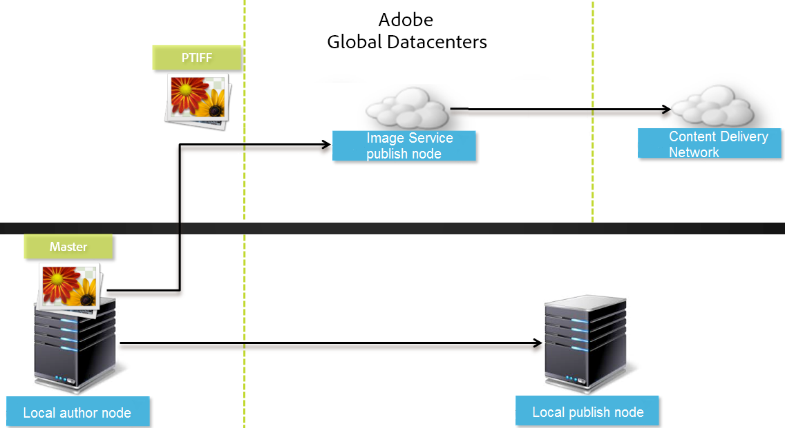
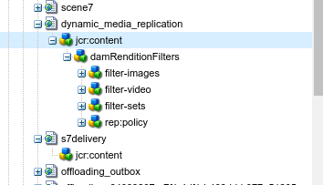

# Configuración de Dynamic Media - Modo híbrido {#configuring-dynamic-media-hybrid-mode}

Medios dinámicos: híbrido debe estar habilitado y configurado para su uso. Según el caso de uso, Dynamic Media tiene varias configuraciones [](#supported-dynamic-media-configurations)admitidas.

>[!NOTE]
>
>Si desea configurar y ejecutar Dynamic Media en el modo de ejecución de Scene7, consulte [Configuración de Dynamic Media: modo](config-dms7.md)Scene7.
>
>Si desea configurar y ejecutar Dynamic Media en modo de ejecución híbrido, siga las instrucciones de esta página.

Obtenga más información sobre el trabajo con [vídeo](video.md) en Dynamic Media.

Si utiliza la configuración de Adobe Experience Manager para distintos entornos, como uno para desarrollo, uno para ensayo y otro para producción en directo, deberá configurar Cloud Services de Dynamic Media para cada uno de esos entornos.

Si tiene problemas con la configuración de Dynamic Media, un lugar importante para ver son los archivos de registro específicos de Dynamic Media. Estos se instalan automáticamente al activar Dynamic Media:

* `s7access.log`
* `ImageServing.log`

Están documentados en [Monitoreo y mantenimiento de su instancia](/help/sites-deploying/monitoring-and-maintaining.md)de AEM.

La publicación y el envío híbridos es una característica central de la incorporación de Dynamic Media a Adobe Experience Manager. La publicación híbrida permite distribuir recursos de Dynamic Media, como imágenes, conjuntos y vídeos, desde la nube en lugar de desde los nodos de publicación AEM.

Otros contenidos, como visores de Dynamic Media, páginas del sitio y contenido estático, se seguirán ofreciendo desde los nodos de publicación de AEM.

Si es cliente de Dynamic Media, debe utilizar el envío híbrido como mecanismo de envío para todo el contenido de Dynamic Media.

## Arquitectura de publicación híbrida para vídeos {#hybrid-publishing-architecture-for-videos}


## Arquitectura de publicación híbrida para imágenes {#hybrid-publishing-architecture-for-images}



## Configuraciones de Dynamic Media admitidas {#supported-dynamic-media-configurations}

Las tareas de configuración que siguen hacen referencia a los siguientes términos:

| **Término** | **Medios dinámicos habilitados** | **Descripción** |
|---|---|---|
| Nodo de creación AEM | Marca de verificación blanca en círculo verde | El nodo de creación que implementa en On-Premise o a través de Managed Services. |
| AEM nodo de publicación | &quot;X&quot; blanca en un cuadrado rojo. | El nodo de publicación que implementa en On-Premise o a través de Managed Services. |
| Nodo de publicación de servicio de imágenes | Marca de verificación blanca en un círculo verde. | El nodo de publicación que se ejecuta en los centros de datos administrados por Adobe. Se refiere a la URL del servicio de imágenes. |

Puede optar por implementar Dynamic Media solo para imágenes, solo para vídeo o para imágenes y vídeos. Para determinar los pasos para configurar Dynamic Media para su escenario específico, consulte la siguiente tabla.

<table> 
 <tbody> 
  <tr> 
   <td><strong>Escenario</strong></td> 
   <td><strong>Cómo funciona</strong></td> 
   <td><strong>Pasos de configuración</strong></td> 
  </tr> 
  <tr> 
   <td>Entregar SOLO imágenes en producción</td> 
   <td>Las imágenes se entregan a través de servidores en los centros de datos internacionales de Adobe y luego se almacenan en caché mediante una CDN para obtener un rendimiento escalable y un alcance global.</td> 
   <td> 
    <ol> 
     <li>En el nodo de <strong>creación</strong> de AEM, <a href="#enabling-dynamic-media">habilite Dynamic Media</a>.</li> 
     <li>Configure imágenes en Cloud Services <a href="#configuring-dynamic-media-cloud-services">de medios</a>dinámicos.</li> 
     <li><a href="#configuring-image-replication">Configure la replicación</a>de imágenes.</li> 
     <li><a href="#replicating-catalog-settings">Replicar la configuración</a>del catálogo.</li> 
     <li><a href="#replicating-viewer-presets">Replicar ajustes preestablecidos</a>de visor.</li> 
     <li><a href="#using-default-asset-filters-for-replication">Utilice filtros de recursos predeterminados para la replicación</a>.</li> 
     <li><a href="#configuring-dynamic-media-image-server-settings">Configuración de los ajustes</a>del servidor de imágenes de Dynamic Media.</li> 
     <li><a href="#delivering-assets">Entregar recursos</a>.</li> 
    </ol> </td> 
  </tr> 
  <tr> 
   <td>Distribuya SÓLO imágenes en la preproducción (Dev, QE, Stage, etc.)</td> 
   <td>Las imágenes se entregan a través del nodo de publicación AEM. En este escenario, como el tráfico es mínimo, no es necesario entregar imágenes al centro de datos de Adobe. Una ventaja adicional es que esto permite una previsualización segura del contenido antes del inicio de la producción</td> 
   <td> 
    <ol> 
     <li>En el nodo de <strong>creación</strong> de AEM, <a href="#enabling-dynamic-media">habilite Dynamic Media</a>.</li> 
     <li>En AEM nodo de <strong>publicación</strong> , <a href="#enabling-dynamic-media">habilite Dynamic Media</a>.</li> 
     <li><a href="#replicating-viewer-presets">Replicar ajustes preestablecidos</a>de visor.</li> 
     <li>Configure el filtro <a href="#setting-up-asset-filters-for-imaging-in-non-production-deployments">de recursos para imágenes</a>que no sean de producción.</li> 
     <li><a href="#configuring-dynamic-media-image-server-settings">Configure el servidor de imágenes de Dynamic Media.</a></li> 
     <li><a href="#delivering-assets">Entregar recursos.</a></li> 
    </ol> </td> 
  </tr> 
  <tr> 
   <td>Entregar SÓLO vídeo en cualquier entorno (producción, desarrollo, FC, etapa, etc.)</td> 
   <td>Los vídeos son entregados y almacenados en caché por una CDN para un rendimiento escalable y un alcance global. La imagen del póster de vídeo (miniatura del vídeo que se muestra antes de que se inicie la reproducción) la proporcionará la instancia de publicación de AEM.</td> 
   <td> 
    <ol> 
     <li>En el nodo de <strong>creación</strong> de AEM, <a href="#enabling-dynamic-media">habilite Dynamic Media</a>.</li> 
     <li>En el nodo de <strong>publicación</strong> AEM, <a href="#enabling-dynamic-media">active Dynamic Media</a> (la instancia de publicación sirve la imagen del póster de vídeo y proporciona metadatos para la reproducción de vídeo).</li> 
     <li>Configuración de vídeo en Cloud Services de medios <a href="#configuring-dynamic-media-cloud-services">dinámicos.</a></li> 
     <li><a href="#replicating-viewer-presets">Replicar ajustes preestablecidos</a>de visor.</li> 
     <li>Configure el filtro <a href="#setting-up-asset-filters-for-video-only-deployments">de recursos solo</a>para vídeo.</li> 
     <li><a href="#delivering-assets">Entregar recursos.</a></li> 
    </ol> </td> 
  </tr> 
  <tr> 
   <td>Entregar imágenes y vídeos en producción</td> 
   <td><p>Los vídeos son entregados y almacenados en caché por una CDN para un rendimiento escalable y un alcance global. Las imágenes y las imágenes de póster de vídeo se entregan a través de los servidores de los centros de datos internacionales de Adobe y, a continuación, se almacenan en caché mediante una CDN para obtener un rendimiento escalable y un alcance global.</p> <p>Consulte las secciones anteriores para configurar la imagen o el vídeo en la preproducción. </p> </td> 
   <td> 
    <ol> 
     <li>En el nodo de <strong>creación</strong> de AEM, <a href="#enabling-dynamic-media">habilite Dynamic Media</a>.</li> 
     <li>Configuración de vídeo en Cloud Services de medios <a href="#configuring-dynamic-media-cloud-services">dinámicos.</a></li> 
     <li>Configure imágenes en Cloud Services de medios <a href="#configuring-dynamic-media-cloud-services">dinámicos.</a></li> 
     <li><a href="#configuring-image-replication">Configure la replicación</a>de imágenes.</li> 
     <li><a href="#replicating-catalog-settings">Replicar la configuración</a>del catálogo.</li> 
     <li><a href="#replicating-viewer-presets">Replicar ajustes preestablecidos</a>de visor.</li> 
     <li><a href="#using-default-asset-filters-for-replication">Utilice filtros de recursos predeterminados para la replicación.</a></li> 
     <li><a href="#configuring-dynamic-media-image-server-settings">Configure el servidor de imágenes de Dynamic Media.</a></li> 
     <li><a href="#delivering-assets">Entregar recursos.</a></li> 
    </ol> </td> 
  </tr> 
 </tbody> 
</table>

## Activación de Dynamic Media {#enabling-dynamic-media}

[Los medios](https://www.adobe.com/solutions/web-experience-management/dynamic-media.html) dinámicos están deshabilitados de forma predeterminada. Para aprovechar las funciones de Dynamic Media, debe habilitar los medios dinámicos utilizando el modo de ejecución **[!UICONTROL Dynamic Media]** como lo haría, por ejemplo, **[!UICONTROL publicar]** el modo de ejecución. Antes de habilitar, asegúrese de revisar los requisitos [técnicos](/help/sites-deploying/technical-requirements.md#requirements-for-aem-dynamic-media-add-on).

>[!NOTE]
>
>Al habilitar los medios dinámicos a través del modo de ejecución, se reemplaza la funcionalidad de AEM 6.1 y AEM 6.0, donde se habilita el medio dinámico estableciendo el indicador **[!UICONTROL dynamicMediaEnabled]** en **[!UICONTROL true]**. Este indicador no tiene funcionalidad en AEM 6.2 y posterior. Además, no es necesario reiniciar el inicio rápido para habilitar los medios dinámicos.

Al habilitar Dynamic Media, las funciones de Dynamic Media estarán disponibles en la interfaz de usuario y cada recurso de imagen cargado recibirá una `cqdam.pyramid.tiff` representación que se utilizará para un envío rápido de las representaciones de imágenes dinámicas. Estos PTIFF tienen ventajas significativas, como (1) la capacidad de administrar una sola imagen principal y generar infinitas representaciones sobre la marcha sin ningún almacenamiento adicional y (2) la capacidad de utilizar visualizaciones interactivas como zoom, recorrido, giro, etc.

Si desea utilizar Dynamic Media Classic (Scene7) en AEM, no debe activar Dynamic Media a menos que utilice un escenario [](/help/sites-administering/scene7.md#aem-scene-integration-versus-dynamic-media)específico. Dynamic Media está desactivado a menos que habilite Dynamic Media mediante el modo de ejecución.

Para activar Dynamic Media, debe habilitar el modo de ejecución de Dynamic Media desde la línea de comandos o desde el nombre del archivo de inicio rápido.

**Para activar Dynamic Media**:

1. En la línea de comandos, al iniciar el inicio rápido, haga lo siguiente:

   * Añada **[!UICONTROL -o dynamicmedia]** al final de la línea de comandos al iniciar el archivo jar.

   ```shell
   java -Xmx4096m -Doak.queryLimitInMemory=500000 -Doak.queryLimitReads=500000 -jar cq-quickstart-6.4.0.jar -r dynamicmedia
   ```

   Si está publicando en s7envío, también debe incluir los siguientes argumentos trustStore:

   ```
   -Djavax.net.ssl.trustStore=<absoluteFilePath>/customerTrustStoreFileName>
   
    -Djavax.net.ssl.trustStorePassword=<passwordForTrustStoreFile>
   ```

1. Solicitar `http://localhost:4502/is/image` y asegurarse de que el servidor de imágenes se está ejecutando.

   >[!NOTE]
   >
   >Para solucionar problemas con Dynamic Media, consulte los siguientes registros en el directorio **[!UICONTROL crx-quickstart/logs/]** :
   >
   >* ImageServer-&lt;PortId>-&lt;yyyy>&lt;mm>&lt;dd>.log: el registro de ImageServer proporciona estadísticas e información analítica utilizadas para analizar el comportamiento del proceso interno de ImageServer.

      Ejemplo de un nombre de archivo de registro de Image Server: `ImageServer-57346-2019-07-25.log`
   * s7access-&lt;aaaa>&lt;mm>&lt;dd>.log: el registro de acceso s7registra cada solicitud realizada a Dynamic Media a través `/is/image` y `/is/content`.
   Estos registros solo se utilizan cuando Dynamic Media está habilitado. No se incluyen en el paquete de **descarga completa** que se genera desde la página **[!UICONTROL system/console/status-Bundlelist]** ; al llamar a la asistencia al cliente si tiene un problema con Dynamic Media, anexe ambos registros al problema.

### Si ha instalado AEM en otro puerto o ruta de contexto... {#if-you-installed-aem-to-a-different-port-or-context-path}

Si va a implementar [AEM en un servidor](/help/sites-deploying/application-server-install.md) de aplicaciones y tiene Dynamic Media habilitado, debe configurar el dominio **propio** en el externalizador. De lo contrario, la generación de miniaturas para los recursos no funcionará correctamente en los recursos de medios dinámicos.

Además, si ejecuta el inicio rápido en un puerto o ruta de contexto diferente, también tiene que cambiar el dominio **propio** .

Cuando Dynamic Media está activado, las representaciones de miniaturas estáticas para los recursos de imagen se generan mediante Dynamic Media. Para que la generación de miniaturas funcione correctamente en los medios dinámicos, AEM realizar una solicitud de URL a sí misma y debe conocer tanto el número de puerto como la ruta de contexto.

En AEM:

* El dominio **propio** del [externalizador](/help/sites-developing/externalizer.md) se utiliza para recuperar el número de puerto y la ruta de contexto.
* Si no hay ningún dominio **propio** configurado, el número de puerto y la ruta de contexto se recuperan del servicio HTTP Jetty.

En una implementación de QuickStart WAR de AEM, el número de puerto y la ruta de contexto no se pueden derivar, por lo que debe configurar un dominio **propio** . Consulte la documentación [de](/help/sites-developing/externalizer.md) externalizador sobre cómo configurar el dominio **propio** .

>[!NOTE]
En una implementación [independiente](/help/sites-deploying/deploy.md)AEM de QuickStart, generalmente no es necesario configurar un dominio **propio** porque el número de puerto y la ruta de contexto se pueden configurar automáticamente. Sin embargo, si todas las interfaces de red están desactivadas, debe configurar el dominio **propio** .

## Desactivación de Dynamic Media  {#disabling-dynamic-media}

Los medios dinámicos no están activados de forma predeterminada. Sin embargo, si ha activado medios dinámicos anteriormente, puede que desee desactivarlos más adelante.

Para deshabilitar los medios dinámicos después de activarlos, debe quitar el indicador **[!UICONTROL de modo de ejecución de medios dinámicos]** -o.

**Para deshabilitar Dynamic Media después de haberla habilitado**:

1. En la línea de comandos, al iniciar el inicio rápido, puede realizar una de las siguientes acciones:

   * No agregue `-r dynamicmedia` a la línea de comandos al iniciar el archivo JAR.

   ```shell
   java -Xmx4096m -Doak.queryLimitInMemory=500000 -Doak.queryLimitReads=500000 -jar cq-quickstart-6.4.0.jar
   ```

1. Solicitar `http://localhost:4502/is/image`. Recibirá un mensaje que indica que Dynamic Media está deshabilitado.

   >[!NOTE]
   Una vez deshabilitado el modo de ejecución de Dynamic Media, el paso del flujo de trabajo que genera la `qdam.pyramid.tiff` representación se omite automáticamente. Esto también deshabilita la compatibilidad con representaciones dinámicas y otras funciones de Dynamic Media.
   Tenga en cuenta también que, cuando el modo de ejecución de Dynamic Media está desactivado después de configurar el servidor de AEM, todos los recursos cargados en ese modo de ejecución no son válidos.

## (Opcional) Migración de ajustes preestablecidos y configuraciones de Dynamic Media de 6.3 a 6.4 sin downtime {#optional-migrating-dynamic-media-presets-and-configurations-from-to-zero-downtime}

Si está actualizando AEM Dynamic Media de 6.3 a 6.4, que ahora incluye la posibilidad de cero tiempos de inactividad (también conocidos como implementaciones de &quot;inclusión&quot;), debe ejecutar el siguiente comando curl para migrar todos los ajustes preestablecidos y configuraciones de `/etc` a `/conf` CRXDE Lite.

**Nota**: Si ejecuta la instancia de AEM en modo de compatibilidad, es decir, tiene la compatibilidad empaquetada instalada, no necesita ejecutar estos comandos.

Para migrar los ajustes preestablecidos y configuraciones personalizados de `/etc` a `/conf`, ejecute el siguiente comando de curl de Linux:

`curl -u admin:admin http://localhost:4502/libs/settings/dam/dm/presets.migratedmcontent.json`

Para todas las actualizaciones, ya sea con o sin el paquete de compatibilidad, puede copiar los ajustes preestablecidos de visor integrados ejecutando el siguiente comando:

`curl -u admin:admin http://localhost:4502/libs/settings/dam/dm/presets/viewer.pushviewerpresets`

## Configuración de la replicación de imágenes {#configuring-image-replication}

El envío de imágenes de Dynamic Media funciona mediante la publicación de recursos de imagen, incluidas miniaturas de vídeo, desde AEM Author y su replicación en el servicio de replicación bajo demanda de Adobe (la URL del servicio de replicación). A continuación, los recursos se entregan mediante el servicio de envío de imágenes a petición (la URL del servicio de imágenes).

Debe hacer lo siguiente:

1. [Configure la autenticación](#setting-up-authentication).
1. [Configure el agente](#configuring-the-replication-agent)de replicación.

El Agente de replicación publica recursos de Dynamic Media como imágenes, metadatos de vídeo y conjuntos en el servicio de imágenes alojado en Adobe. El Agente de replicación no está habilitado de forma predeterminada.

Después de configurar el agente de replicación, debe [validar y probar que se ha configurado](#validating-the-replication-agent-for-dynamic-media)correctamente. En esta sección se describen estos procedimientos.

>[!NOTE]
El límite de memoria predeterminado para la creación de PTIFF es de 3 GB en todos los flujos de trabajo. Por ejemplo, puede procesar una imagen que requiera 3 GB de memoria mientras se ponen en pausa otros flujos de trabajo, o puede procesar 10 imágenes en paralelo que requieran 300 MB de memoria cada una.
El límite de memoria es configurable y debe ajustarse a la disponibilidad de recursos del sistema y al tipo de contenido de imagen que se está procesando. Si tiene muchos recursos muy grandes y tiene suficiente memoria en el sistema, puede aumentar este límite para garantizar que las imágenes se procesen en paralelo.
Se rechazará una imagen que requiera más del límite máximo de memoria.
Para cambiar el límite de memoria para la creación de PTIFF, vaya a **[!UICONTROL Herramientas > Operaciones > Consola web > Adobe CQ Scene7 PTiffManager]** y cambie el `maxMemory` valor.

### Configuración de la autenticación {#setting-up-authentication}

Debe configurar la autenticación de replicación en el autor para replicar imágenes en el servicio de envío de imágenes de Dynamic Media. Para ello, obtenga un KeyStore y luego guárdelo bajo el usuario de replicación **[!UICONTROL de medios]** dinámicos y configúrelo. El administrador de compañía debería haber recibido un correo electrónico de bienvenida con el archivo KeyStore y las credenciales necesarias durante el proceso de aprovisionamiento. Si no recibió esto, póngase en contacto con el Servicio de atención al cliente.

**Para configurar la autenticación**:

1. Póngase en contacto con el Servicio de atención al cliente para obtener el archivo y la contraseña de KeyStore si aún no lo tiene. Esto forma parte del aprovisionamiento y asociará las claves a su cuenta.
1. In AEM, tap the AEM logo to access the global navigation console, then tap **[!UICONTROL Tools > Security > Users]**.
1. En la página Administración de usuarios, navegue hasta el usuario de replicación **[!UICONTROL de medios]** dinámicos y, a continuación, toque para abrir.

   

1. En la página Editar configuración de usuario para replicación de medios dinámicos, toque la ficha **[!UICONTROL Almacén]** de claves y, a continuación, **[!UICONTROL Crear almacén de claves]**.

   

1. Introduzca una contraseña y confirme la contraseña en el cuadro de diálogo **[!UICONTROL Establecer contraseña]** de acceso a KeyStore.

   >[!NOTE]
   Recuerde la contraseña introducida. Tendrá que volver a introducirlo cuando configure el Agente **[!UICONTROL de]** replicación más tarde.

   

1. En la página **[!UICONTROL Editar configuración de usuario para la replicación]** dinámica de medios, expanda el área de archivo **** Añadir clave privada desde KeyStore y agregue lo siguiente (consulte las imágenes que se muestran a continuación):

   * En el campo **[!UICONTROL Nuevo alias]** , introduzca el nombre de un alias que utilizará posteriormente en la configuración de replicación; por ejemplo, **replicación**.
   * Toque **[!UICONTROL KeyStore File]**. Navegue hasta el archivo KeyStore que se le proporcionó por Adobe, selecciónelo y, a continuación, toque **[!UICONTROL Abrir]**.
   * En el campo Contraseña **[!UICONTROL del archivo]** KeyStore, introduzca la contraseña del archivo KeyStore. Esta _no es_ la contraseña de KeyStore que creó en el paso 5, pero es el Adobe de contraseña de KeyStore File que se proporciona en el correo electrónico de bienvenida que se le envió durante el aprovisionamiento. Póngase en contacto con el servicio de atención al cliente de Adobe si no ha recibido una contraseña para el archivo KeyStore.
   * En el campo Contraseña **[!UICONTROL de clave]** privada, introduzca la contraseña de clave privada (puede ser la misma contraseña de clave privada proporcionada en el paso anterior). Adobe proporciona la contraseña de clave privada en el correo electrónico de bienvenida que se le ha enviado durante el aprovisionamiento. Póngase en contacto con el Servicio de atención al cliente de Adobe si no ha recibido una contraseña de clave privada.
   * En el campo Alias **[!UICONTROL de clave]** privada, introduzca el alias de clave privada. Por ejemplo, `companyname-alias`. Adobe proporciona el alias de clave privada en el correo electrónico de bienvenida que se le ha enviado durante el aprovisionamiento. Póngase en contacto con el Servicio de atención al cliente de Adobe si no recibió un alias de clave privada.

   

1. Toque **[!UICONTROL Guardar y cerrar]** para guardar los cambios realizados en este usuario.

   A continuación, debe [configurar el agente de replicación.](#configuring-the-replication-agent)

### Configuración del Agente de replicación {#configuring-the-replication-agent}

1. En AEM, toque el logotipo de AEM para acceder a la consola de navegación global y, a continuación, toque **[!UICONTROL Herramientas > Implementación > Replicación > Agentes en el autor]**.
1. En la página Agentes de la página de creación, toque Replicación de imágenes híbridas de **[!UICONTROL Dynamic Media (s7envío)]**.
1. Toque **[!UICONTROL Editar]**.
1. Toque la ficha **[!UICONTROL Configuración]** y, a continuación, introduzca lo siguiente:

   * **[!UICONTROL Habilitado]** : seleccione esta casilla de verificación para habilitar el agente de replicación.
   * **[!UICONTROL Región]** : se establece en la región adecuada: Norteamérica, Europa o Asia
   * **[!UICONTROL ID]** del inquilino: este valor es el nombre de su compañía/inquilino que está publicando en el servicio de replicación. Este valor es el ID del inquilino que Adobe proporciona en el correo electrónico de bienvenida que se le envía durante el aprovisionamiento. Póngase en contacto con el Servicio de atención al cliente de Adobe si no ha recibido esto.
   * **[!UICONTROL Alias]** de almacén de claves: Este valor es el mismo que el valor** de nuevo alias** establecido al generar la clave en la [configuración de la autenticación](#setting-up-authentication); por ejemplo, `replication`. (Consulte el paso 7 en [Configuración de la autenticación](#setting-up-authentication)).
   * **[!UICONTROL Contraseña]** del almacén de claves: es la contraseña de KeyStore que se creó al tocar **[!UICONTROL Crear KeyStore]**. Adobe no proporciona esta contraseña. Consulte el paso 5 de [Configuración de la autenticación](#setting-up-authentication).

   La siguiente imagen muestra el agente de replicación con datos de ejemplo:

   

1. Tap **[!UICONTROL OK]**.

### Validating the Replication Agent for Dynamic Media {#validating-the-replication-agent-for-dynamic-media}

To validate the replication agent for dynamic media, do the following:

Tap **[!UICONTROL Test Connection]**. Example output is as follows:

```shell
11.03.2016 10:57:55 - Transferring content for ReplicationAction{type=TEST, path[0]='/content/dam', time=1457722675402, userId='admin', revision='null'}
11.03.2016 10:57:55 - * Auth User: replication-receiver
11.03.2016 10:57:55 - * HTTP Version: 1.1
11.03.2016 10:57:55 - * Using OAuth 2.0 Authorization Grants
11.03.2016 10:57:55 - * OAuth 2.0 User: dynamic-media-replication
11.03.2016 10:57:55 - * OAuth 2.0 Token: '*****' initialized
11.03.2016 10:57:55 - Publishing: POST[https://replicate-na.assetsadobe.com:8580/is-publish/publish-receiver?Cmd=Test&RootId=xfpuu-6613]
11.03.2016 10:57:55 - Publish response: OK[]
11.03.2016 10:57:55 - Transfer succeeded in 141 ms for ReplicationAction{type=TEST, path[0]='/content/dam', time=1457722675402, userId='admin', revision='null'}
-------------------------------------------------------------------------------------------------------------------------------
Replication test succeeded
```

>[!NOTE]
You can also check by doing one of the following:
* Check the replication logs to make sure the asset is replicated.
* Publish an image. Tap the image and select **[!UICONTROL Viewers]** in drop-down menu. Select a viewer preset, then tap **[!UICONTROL URL]**, and copy and paste the URL in the browser to verify that you can see the image.


### Troubleshooting Authentication {#troubleshooting-authentication}

When setting up authentication, here are some issues you may run into with their solutions. Before checking these, make sure you have set up replication.

#### Problem: HTTP Status Code 401 with Message - Authorization Required {#problem-http-status-code-with-message-authorization-required}

This issue can be caused by a failure to set up the KeyStore for `dynamic-media-replication` user.

```shell
Replication test to s7delivery:https://s7bern.macromedia.com:8580/is-publish/
17.06.2016 18:54:43 - Transferring content for ReplicationAction{type=TEST, path[0]='/content/dam', time=1466214883309, userId='admin', revision='null'}
17.06.2016 18:54:43 - * Auth User: replication-receiver
17.06.2016 18:54:43 - * HTTP Version: 1.1
17.06.2016 18:54:43 - * Using OAuth 2.0 Authorization Grants
17.06.2016 18:54:43 - * OAuth 2.0 User: dynamic-media-replication
17.06.2016 18:54:43 - No OAuth token available. OAuth not initialized
17.06.2016 18:54:43 - * Using Client Auth SSL alias - replication-alias *
17.06.2016 18:54:43 - Publishing: POST[https://<localhost>:8580/is-publish//publish-receiver?Cmd=Test&RootId=brough]
17.06.2016 18:54:43 - Transfer failed for ReplicationAction{type=TEST, path[0]='/content/dam', time=1466214883309, userId='admin', revision='null'}. java.io.IOException: Failed to execute request
'https://<localhost>:8580/is-publish//publish-receiver?Cmd=Test&RootId=brough':
 Server returned status code 401 with message: Authorization required.
17.06.2016 18:54:43 - Error while replicating: com.day.cq.replication.ReplicationException: Transfer failed for ReplicationAction{type=TEST, path[0]='/content/dam', time=1466214883309,
 userId='admin', revision='null'}. java.io.IOException: Failed to execute request
'https://<localhost>:8580/is-publish//publish-receiver?Cmd=Test&RootId=brough':
 Server returned status code 401 with message: Authorization required.
```

**Solution**: Check that the `KeyStore` is saved to **[!UICONTROL dynamic-media-replication]** user and is provided with the correct password.

#### Problem: Could Not Decrypt Key - Could Not Decrypt Data {#problem-could-not-decrypt-key-could-not-decrypt-data}

```xml
Replication test to s7delivery:https://<localhost>:8580/is-publish/
17.06.2016 19:00:16 - Transferring content for ReplicationAction{type=TEST, path[0]='/content/dam', time=1466215216662, userId='admin', revision='null'}
17.06.2016 19:00:16 - * Auth User: replication-receiver
17.06.2016 19:00:16 - * HTTP Version: 1.1
17.06.2016 19:00:16 - * Using OAuth 2.0 Authorization Grants
17.06.2016 19:00:16 - * OAuth 2.0 User: dynamic-media-replication
17.06.2016 19:00:16 - No OAuth token available. OAuth not initialized
17.06.2016 19:00:16 - * Using Client Auth SSL alias - replication-alias *
17.06.2016 19:00:16 - Transfer failed for ReplicationAction{type=TEST, path[0]='/content/dam', time=1466215216662, userId='admin', revision='null'}. java.lang.SecurityException: java.security.UnrecoverableKeyException: Could not decrypt key: Could not decrypt data.
```

**Solution**: Check the password. The password saved in the replication agent is not the same password that was used to create keystore.

#### Problem: InvalidAlgorithmParameterException {#problem-invalidalgorithmparameterexception}

This issue is caused by a configuration error in your AEM Author instance. The java process on the Author is not getting the correct `javax.net.ssl.trustStore`. You see this error in the replication log:

```shell
14.04.2016 09:37:43 - Transfer failed for ReplicationAction{type=TEST, path[0]='/content/dam', time=1460651862089, userId='admin', revision='null'}. java.io.IOException: Failed to execute request 'https://<localhost>:8580/is-publish/publish-receiver?Cmd=Test&RootId=rbrough-osx2': java.lang.RuntimeException: Unexpected error: java.security.InvalidAlgorithmParameterException: the trustAnchors parameter must be non-empty
14.04.2016 09:37:43 - Error while replicating: com.day.cq.replication.ReplicationException: Transfer failed for ReplicationAction{type=TEST, path[0]='/content/dam', time=1460651862089, userId='admin', revision='null'}. java.io.IOException: Failed to execute request 'https://<localhost>:8580/is-publish/publish-receiver?Cmd=Test&RootId=rbrough-osx2': java.lang.RuntimeException: Unexpected error: java.security.InvalidAlgorithmParameterException: the trustAnchors parameter must be non-empty
```

Or the error log:

```shell
07.25.2019 12:00:59.893 *ERROR* [sling-threadpool-db2763bb-bc50-4bb5-bb64-10a09f432712-(apache-sling-job-thread-pool)-90-com_day_cq_replication_job_s7delivery(com/day/cq/replication/job/s7delivery)] com.day.cq.replication.Agent.s7delivery.queue Error during processing of replication.
 
java.io.IOException: Failed to execute request 'https://replicate-na.assetsadobe.com:8580/is-publish/publish-receiver?Cmd=Test&RootId=rbrough-osx': java.lang.RuntimeException: Unexpected error: java.security.InvalidAlgorithmParameterException: the trustAnchors parameter must be non-empty
        at com.scene7.is.catalog.service.publish.atomic.PublishingServiceHttp.executePost(PublishingServiceHttp.scala:195)
```

**Solution**: Make sure the java process on the AEM Author has the system property **-Djavax.net.ssl.trustStore=** set to a valid truststore.

#### Problem: KeyStore is either not set up or it is not initialized {#problem-keystore-is-either-not-set-up-or-it-is-not-initialized}

Este problema puede deberse a una corrección urgente o a que un paquete de funciones sobrescriba el nodo **[!UICONTROL dynamic-media-user]** o **[!UICONTROL keystore]** .

Replication log example:

```shell
Replication test to s7delivery:https://replicate-na.assetsadobe.com/is-publish
02.08.2016 14:37:44 - Transferring content for ReplicationAction{type=TEST, path[0]='/content/dam', time=1470173864834, userId='admin', revision='null'}
02.08.2016 14:37:44 - * Auth User: replication-receiver
02.08.2016 14:37:44 - * HTTP Version: 1.1
02.08.2016 14:37:44 - * Using OAuth 2.0 Authorization Grants
02.08.2016 14:37:44 - * OAuth 2.0 User: dynamic-media-replication
02.08.2016 14:37:44 - Transfer failed for ReplicationAction{type=TEST, path[0]='/content/dam', time=1470173864834, userId='admin', revision='null'}. com.adobe.granite.keystore.KeyStoreNotInitialisedException: Uninitialised key store for user dynamic-media-replication
```

**Solución**:

1. Navigate to the **[!UICONTROL User Management]** page:

   `localhost:4502/libs/granite/security/content/useradmin.html`
1. On the **[!UICONTROL User Management]** page, navigate to the **[!UICONTROL dynamic-media-replication]** user, then tap to open.
1. Tap the **[!UICONTROL KeyStore]** tab. Si aparece el botón **[!UICONTROL Crear almacén]** de claves, debe rehacer los pasos que se encuentran en [Configuración de la autenticación](#setting-up-authentication) anteriormente.
1. If you had to redo the **[!UICONTROL KeyStore]** setup, you may need to do [Configuring the Replication Agent](config-dynamic.md#configuring-the-replication-agent) again, as well.

   Reconfigure the s7delivery Replication Agent.

   `localhost:4502/etc/replication/agents.author/s7delivery.html`

1. Tap **[!UICONTROL Test Connection]** to verify the configuration is valid.

#### Problem: Publish Agent is using SSL instead of OAuth {#problem-publish-agent-is-using-ssl-instead-of-oauth}

This issue may be caused by a hot fix or a feature pack that did not install correctly or overwrote the settings.

Ejemplo de registro de replicación:

```shell
01.08.2016 18:42:59 - Transferring content for ReplicationAction{type=TEST, path[0]='/content/dam', time=1470073379634, userId='admin', revision='null'}
01.08.2016 18:42:59 - * Auth User: replication-receiver
01.08.2016 18:42:59 - * HTTP Version: 1.1
01.08.2016 18:42:59 - * Using Client Auth SSL alias - replication-receiver *
01.08.2016 18:42:59 - Publishing: POST[https://replicate-eu.assetsadobe2.com:443/is-publish/publish-receiver?Cmd=Test&RootId=altayerstaging]
01.08.2016 18:42:59 - Transfer failed for ReplicationAction{type=TEST, path[0]='/content/dam', time=1470073379634, userId='admin', revision='null'}. java.io.IOException: Failed to execute request 'https://replicate-eu.assetsadobe2.com:443/is-publish/publish-receiver?Cmd=Test&RootId=rbroughstaging': Server returned status code 401 with message: Authorization required.
01.08.2016 18:42:59 - Error while replicating: com.day.cq.replication.ReplicationException: Transfer failed for ReplicationAction{type=TEST, path[0]='/content/dam', time=1470073379634, userId='admin', revision='null'}. java.io.IOException: Failed to execute request 'https://replicate-eu.assetsadobe2.com:443/is-publish/publish-receiver?Cmd=Test&RootId=rbroughstaging': Server returned status code 401 with message: Authorization required.
```

**Solución:**

1. En AEM, pulse **[!UICONTROL Herramientas > General > CRXDE Lite]**.

   `localhost:4502/crx/de/index.jsp`

1. Navigate to the **[!UICONTROL s7delivery Replication Agent]** node.

   `localhost:4502/crx/de/index.jsp#/etc/replication/agents.author/s7delivery/jcr:content`

1. Add this setting to the replication agent (Boolean with value set to **[!UICONTROL True]**):

   `enableOauth=true`

1. Near the upper-left corner of the page, tap **[!UICONTROL Save All]**.

### Testing your configuration {#testing-your-configuration}

Adobe recommends that you perform an end-to-end test of the configuration.

Be sure you have already done the following prior to beginning this test:

* Added Image Presets.
* Configure **Dynamic Media Configuration (Pre 6.3)** under **[!UICONTROL Cloud Services]**. The Image Service URL is required for this test

To test your configuration:

1. Upload an image asset. (In Assets, tap **[!UICONTROL Create > Files]** and select the file.)
1. Wait for the workflow to finish.
1. Publique el recurso de imagen. (Select the asset and tap **[!UICONTROL Quick Publish]**.)
1. Vaya a las representaciones de esa imagen abriendo la imagen y tocando **[!UICONTROL Representaciones]**.

   

1. Select any dynamic rendition.
1. Tap **[!UICONTROL URL]** to obtain the URL for this asset.
1. Navigate to the selected URL and check whether the image behaves as expected.

Another way to test that your assets were delivered is to append req=exists to your URL.

## Configuring Dynamic Media Cloud Services {#configuring-dynamic-media-cloud-services}

The Dynamic Media Cloud service provides support for cloud services such as hybrid publishing and delivery of images and video, video analytics, and video encoding, among other things.

As part of the configuration, you need to enter a registration ID, video service URL, image service URL, replication service URL and set up authentication. You should have received all this information as part of the account provisioning process. If you did not receive this information, contact your Adobe Experience Manager Administrator or Adobe Technical Support to obtain the information.

>[!NOTE]
Before setting up Dynamic Media Cloud Services, be sure to have your publish instance set up. You must also have replication set up before configuring Dynamic Media Cloud Services.

**To configure dynamic media cloud services**:

1. In AEM, tap the AEM logo to access the global navigation console and tap **[!UICONTROL Tools > Cloud Services > Dynamic Media Configuration (Pre-6.3)]**.
1. On the **[!UICONTROL Dynamic Media Configuration Browser]** page, in the left pane, select **[!UICONTROL global]**, then tap **[!UICONTROL Create]**.
1. In the **[!UICONTROL Create Dynamic Media Configuration]** dialog box, in the **[!UICONTROL Title]** field, type a title.
1. If you are configuring Dynamic Media for video,

   * In the **[!UICONTROL Registration ID]** field, type your registration ID.
   * En el campo URL **[!UICONTROL del servicio de]** vídeo, introduzca la URL del servicio de vídeo para Dynamic Media Gateway.

1. If you are configuring Dynamic Media for imaging, in the **[!UICONTROL Image Service URL]** field, enter the image service URL for the Dynamic Media Gateway.
1. Tap **[!UICONTROL Save]** to return to the Dynamic Media Configuration Browser page.
1. Tap the AEM logo to access the global navigation console.

## Configuring video reporting {#configuring-video-reporting}

You can configure video reporting across multiple installations of AEM using Dynamic Media – Hybrid mode.

**When to use:** At the time you configure **[!UICONTROL Dynamic Media Configuration (Pre 6.3)]**, numerous features are started including video reporting. The configuration creates a report suite in a regional Analytics company. If you configure multiple Author nodes, you create a separate report suite for each one. As a result, reporting data is inconsistent among installations. Furthermore, if each Author node refers to the same Hybrid Publish server, the last Author installation changes the destination report suite for all video reporting. This issue overloads the Analytics system with too many report suites.

**Get started:** Configure video reporting by completing the following three tasks.

1. Create a [!DNL Video Analytics] preset package after you configure **[!UICONTROL Dynamic Media Configuration (Pre 6.3)]** on the first Author node. This initial task is important because it allows a new configuration to continue using the same report suite.
1. Install the [!DNL Video Analytics] preset package to any ***new*** Author node ***before*** you configure Dynamic Media Configuration (Pre 6.3).

1. Verify and debug the package installation.

### Creating a [!DNL Video Analytics] preset package after configuring the first Author node {#creating-a-video-analytics-preset-package-after-configuring-the-first-author-node}

When you have finished this task, you will have a package file that contains the [!DNL Video Analytics] presets. These presets contain a report suite, the tracking server, the tracking namespace, and the Marketing Cloud Organization ID, if available.

1. If you have not already done so, configure **[!UICONTROL Dynamic Media Configuration (Pre 6.3)]**.
1. (Optional) View and copy the **[!UICONTROL Report Suite ID]** (you must have access to the JCR). While having the **[!UICONTROL Report Suite ID]** is not required, it makes validation easier.
1. Create a package using **[!UICONTROL Package Manager]**.
1. Edit the package to include a filter.

   In AEM: `/conf/global/settings/dam/dm/presets/analytics/jcr:content/userdata`

1. Build the package.
1. Download or share the [!DNL Video Analytics] preset package so that it can be shared with subsequent new Author nodes.

### Installing the [!DNL Video Analytics] preset package before you configure additional Author nodes {#installing-the-video-analytics-preset-package-before-you-configure-additional-author-nodes}

Be sure that you complete this task _before_ you configure **[!UICONTROL Dynamic Media Configuration (Pre 6.3)]**. Failure to do so results in the creation of another unused report suite. In addition, even though video reporting will continue to work correctly, the gathering of data is not optimized.

Asegúrese de que el paquete [!DNL Video Analytics] preestablecido del primer nodo Autor es accesible en el nuevo nodo Autor.

1. Upload the [!DNL Video Analytics] preset package that you created eariler to **[!UICONTROL Package Manager]**.
1. Install the [!DNL Video Analytics] preset package.
1. Configure **[!UICONTROL Dynamic Media Configuration (Pre 6.3)]**.

### Verifying and debugging the package installation {#verifying-and-debugging-the-package-installation}

1. Do any one of the following to verify and, if necessary, debug the package installation:

   * **Check the[!DNL Video Analytics]preset by way of the JCR**
To check the [!DNL Video Analytics] preset by way of the JCR, you must have access to **[!UICONTROL CRXDE Lite]**.

      AEM - In **[!UICONTROL CRXDE Lite]**, navigate to `/conf/global/settings/dam/dm/presets/analytics/jcr:content/userdata  `

      Esto es `http://localhost:4502/crx/de/index.jsp#/conf/global/settings/dam/dm/presets/analytics/jcr%3Acontent/userdata`

      If you do not have access to **[!UICONTROL CRXDE Lite]** on the Author node, you can check the preset through the Publish server.

   * **Check the[!DNL Video Analytics]preset through the Image Server**

      You can validate the [!DNL Video Analytics] preset directly by making an Image Server `req=userdata` request.

      For example, to see the [!DNL Video Analytics] preset on the Author node, you can make the following request:

      `http://localhost:4502/is/image/conf/global/settings/dam/dm/presets/analytics?req=userdata`

      To validate the preset on Publish servers, you can make a similar direct request to the Publish server. The responses are the same on Author and Publish nodes. La respuesta es similar a la siguiente:

      ```
      marketingCloudOrgId=0FC4E86B573F99CC7F000101
       reportSuite=aemaem6397618-2018-05-23
       trackingNamespace=aemvideodal
       trackingServer=aemvideodal.d2.sc.omtrdc.net
      ```

   * **Check the[!DNL Video Analytics]preset through the Video Reporting tool in AEM**

      Tap **[!UICONTROL Tools > Assets > Video Reporting]** `http://localhost:4502/mnt/overlay/dam/gui/content/s7dam/videoreports/videoreport.html`

      If you see the following error message, the report suite is available, but unpopulated. This error is correct--and desired--in a new installation before the system collects any data.

      
   To generate reporting data, upload and publish one video. Use **[!UICONTROL Copy URL]** and run the video at least one time.

   Be aware that it can take up to 12 hours before the reporting data is populated from Video Viewer usage.

   If there is an error and the report suite is not set correctly, the following alert is displayed.

   

   This error is also displayed if Video Reporting is run before you configure **[!UICONTROL Dynamic Media Configuration (Pre 6.3)]** services.

### Troubleshooting the video reporting configuration {#troubleshooting-the-video-reporting-configuration}

* During installation, sometimes connections to the Analytics API server times out. The installation retries the connection 20 times, but it still fails. When this situation occurs, the log file records multiple errors. Buscar `SiteCatalystReportService`.
* Not installing the [!DNL Video Analytics] preset package first can cause the creation of a new report suite.
* Upgrading from AEM 6.3 to AEM 6.4 or AEM 6.4.1, then configuring **[!UICONTROL Dynamic Media Configuration (Pre 6.3)]**, still creates a report suite. This issue is known and slated to be fixed for AEM 6.4.2.

### About the [!DNL Video Analytics] preset {#about-the-video-analytics-preset}

The [!DNL Video Analytics] preset—sometimes known simply as analytics preset--is stored next to the Viewer presets in Dynamic Media. It is basically the same as a Viewer preset but with information used to configure AppMeasurement and Video Heartbeat reporting.

The preset’s properties are the following:

* **[!UICONTROL reportSuite]**
* **[!UICONTROL trackingServer]**
* **[!UICONTROL trackingNamespace]**
* **[!UICONTROL marketingCloudOrgId]** (not present in older AEM versions)

AEM 6.4 and newer versions save this preset at `/conf/global/settings/dam/dm/presets/analytics/jcr:content/userdata`

## Replicating Catalog Settings {#replicating-catalog-settings}

You must publish your own default catalog settings as part of the setup process through the JCR. To replicate catalog settings:

1. In a Terminal window, run the following:

   `curl -u admin:admin localhost:4502/libs/settings/dam/dm/presets/viewer.pushviewerpresets`

1. In AEM, navigate to the following location in **[!UICONTROL CRXDE Lite]** (requires admin privileges):

   `https://<server>:<port>/crx/de/index.jsp#/conf/global/settings/dam/dm/imageserver/`

1. Tap the **[!UICONTROL Replication]** tab.
1. Tap **[!UICONTROL Replicate]**.

## Replicating Viewer Presets {#replicating-viewer-presets}

Para distribuir un recurso con un ajuste preestablecido de visor, debe replicar/publicar el ajuste preestablecido de visor. (All viewer presets must be activated _and_ replicated to obtain the URL or embed code for an asset.) See [Publishing Viewer Presets](managing-viewer-presets.md#publishing-viewer-presets) for more information.

>[!NOTE]
By default, the system shows a variety of renditions when you select **[!UICONTROL Renditions]** and a variety of viewer presets when you select **[!UICONTROL Viewers]** in the asset&#39;s detail view. You can increase or decrease the number seen. See [Increasing the number of image presets that display](/help/assets/managing-image-presets.md#increasing-or-decreasing-the-number-of-image-presets-that-display) or [Increasing the number of viewer presets that display](/help/assets/managing-viewer-presets.md#increasing-the-number-of-viewer-presets-that-display).

## Filtering Assets for Replication {#filtering-assets-for-replication}

In non-Dynamic Media deployments, you replicate _all_ assets (both images and video) from your AEM author environment to the AEM publish node. This workflow is necessary because the AEM publish servers also deliver the assets.

However, in Dynamic Media deployments, because assets are delivered by way of the cloud, there is no need to replicate those same assets to AEM publish nodes. Such a &quot;hybrid publishing&quot; workflow avoids extra storage costs and longer processing times to replicate assets. Other content, such as Dynamic Media viewers, Site pages, and static content continue to be served from the AEM publish nodes.

Además de replicar los recursos, también se replican los siguientes no activos:

* Dynamic Media Delivery configuration: `/conf/global/settings/dam/dm/imageserver/configuration/jcr:content/settings`
* Ajustes preestablecidos de imagen: `/conf/global/settings/dam/dm/presets/macros`
* Ajustes preestablecidos de visor: `/conf/global/settings/dam/dm/presets/viewer`

The filters provide a way for you to _exclude_ assets from being replicated to the AEM publish node.

### Using default Asset Filters for replication {#using-default-asset-filters-for-replication}

If you are using Dynamic Media for 1) imaging in production _or_ 2) imaging and video, then you can use the default filters that we provide as-is. The following filters are active by default:

<table> 
 <tbody> 
  <tr> 
   <td> </td> 
   <td><strong>Filtro</strong></td> 
   <td><strong>Tipo MIME</strong></td> 
   <td><strong>Representaciones</strong></td> 
  </tr> 
  <tr> 
   <td>Envío de imágenes de Dynamic Media</td> 
   <td><p>filter-images</p> <p>filter-sets</p> <p> </p> </td> 
   <td><p>Starts with <strong>image/</strong></p> <p>Contains <strong>application/</strong> and ends with <strong>set</strong>.</p> </td> 
   <td>The out-of-the-box "filter-images" (applies to single images assets, including interactive images) and "filter-sets" (applies to Spin Sets, Image Sets, Mixed Media Sets, and Carousel Sets) will: 
    <ul> 
     <li>Include PTIFF images and Metadata for replication (Any rendition starting with <strong>cqdam</strong>).</li> 
     <li>Exclude from replication the original image and static image renditions.</li> 
    </ul> </td> 
  </tr> 
  <tr> 
   <td>Envío de vídeo de Dynamic Media</td> 
   <td>filter-video</td> 
   <td>Starts with <strong>video/</strong></td> 
   <td>El "video-filtro" incorporado: 
    <ul> 
     <li>Include proxy video renditions, video thumbnail/poster image, metadata (both at parent video and video renditions) for replication (Any rendition starting with <strong>cqdam</strong>).</li> 
     <li>Excluya de la replicación el vídeo original y las representaciones de miniaturas estáticas.<br /> <br /> <strong>Note:</strong> The proxy video renditions do not contain binaries, but instead are just node properties. Hence, there is no impact on publisher repository size.</li> 
    </ul> </td> 
  </tr> 
  <tr> 
   <td>Dynamic Media Classic (Scene7) integration</td> 
   <td><p>filter-images</p> <p>filter-sets</p> <p>filter-video</p> </td> 
   <td><p>Starts with <strong>image/</strong></p> <p>Contains <strong>application/</strong> and ends with <strong>set</strong>.</p> <p>Starts with <strong>video/</strong></p> </td> 
   <td><p>You configure the Transport URI to point to your AEM publish server instead of the Adobe Dynamic Media Cloud Replication Service URL. Setting up this filter will allow Dynamic Media Classic to deliver assets instead of the AEM publish instance.</p> <p>The out-of-the-box "filter-images," "filter-sets," and "filter-video" will:</p> 
    <ul> 
     <li>Include PTIFF image, proxy video renditions, and metadata for replication. However, because they do not exist in the JCR-for those running AEM - Dynamic Media Classic integration-it effectively does nothing.</li> 
     <li>Exclude from replication the original image, static image renditions, original video, and static thumbnail renditions. Instead, Dynamic Media Classic will be delivering image and video assets.</li> 
    </ul> </td> 
  </tr> 
 </tbody> 
</table>

>[!NOTE]
Los Filtros se aplican a tipos de MIME y no pueden ser específicos de la ruta.

### Setting up Asset Filters for video-only deployments {#setting-up-asset-filters-for-video-only-deployments}

If you are using Dynamic Media for video-only, follow these steps to set up asset filters for replication:

1. In AEM, tap the AEM logo to access the global navigation console and tap **[!UICONTROL Tools > Deployment > Replication > Agents on author]**.
1. On the Agents on author page, tap **[!UICONTROL Default Agent (publish)]**.
1. Toque **[!UICONTROL Editar]**.
1. En el cuadro de diálogo Configuración **[!UICONTROL del]** agente, en la ficha [!UICONTROL Configuración] , marque **[!UICONTROL Habilitado]** para activar el agente.
1. Toque **[!UICONTROL Aceptar]**.
1. En AEM, pulse **[!UICONTROL Herramientas > General > CRXDE Lite]**.
1. En el árbol de carpetas izquierdo, vaya a `/etc/replication/agents.author/dynamic_media_replication/jcr:content/damRenditionFilters`
1. Busque [!UICONTROL filter-video], haga clic con el botón derecho y seleccione **[!UICONTROL Copiar]**.
1. En el árbol de carpetas izquierdo, vaya a `/etc/replication/agents.author/publish`
1. Localice [!UICONTROL jcr:content], haga clic con el botón derecho y seleccione **[!UICONTROL Pegar]**.

Esto configura la instancia de publicación de AEM para ofrecer la imagen del póster de vídeo, así como los metadatos de vídeo necesarios para la reproducción, mientras que el propio vídeo lo entrega el servicio de nube de Dynamic Media. El filtro también excluirá de la replicación el vídeo original y las representaciones de miniaturas estáticas, que no son necesarias en la instancia de publicación.

### Configuración de Filtros de recursos para imágenes en implementaciones que no son de producción {#setting-up-asset-filters-for-imaging-in-non-production-deployments}

Si utiliza Dynamic Media para la creación de imágenes en implementaciones que no son de producción, siga estos pasos para configurar filtros de recursos para la replicación:

1. En AEM, toque el logotipo de AEM para acceder a la consola de navegación global y toque **[!UICONTROL Herramientas > Implementación > Replicación > Agentes en el autor]**.
1. En la página Agentes de creación, toque Agente **[!UICONTROL predeterminado (publicación)]**.
1. Toque **[!UICONTROL Editar]**.
1. En el cuadro de diálogo Configuración **[!UICONTROL del]** agente, en la ficha **[!UICONTROL Configuración]** , marque **[!UICONTROL Habilitado]** para activar el agente.
1. Toque **[!UICONTROL Aceptar]**.
1. En AEM, pulse **[!UICONTROL Herramientas > General > CRXDE Lite]**.
1. En el árbol de carpetas izquierdo, vaya a `/etc/replication/agents.author/dynamic_media_replication/jcr:content/damRenditionFilters`

   

1. Busque imágenes **[!UICONTROL de]** filtro, haga clic con el botón derecho y seleccione **[!UICONTROL Copiar]**.
1. En el árbol de carpetas izquierdo, vaya a `/etc/replication/agents.author/publish`
1. Localice **[!UICONTROL jcr:content]**, haga clic con el botón derecho y seleccione **[!UICONTROL Crear > Crear nodo]**. Escriba el nombre `damRenditionFilters` del tipo `nt:unstructured`.
1. Localice [!UICONTROL `damRenditionFilters`], haga clic con el botón derecho y seleccione **[!UICONTROL Pegar]**.

Esto configura la instancia de publicación de AEM para entregar las imágenes a su entorno que no sea de producción. El filtro también excluirá de la replicación la imagen original y las representaciones estáticas, que no son necesarias en la instancia de publicación.

>[!NOTE]
Si hay muchos filtros diferentes en un autor, cada agente necesita un usuario diferente asignado a él. El código de granito aplica un modelo de filtro por usuario. Tener siempre un usuario diferente para cada filtro configurado.
Si está utilizando más de un filtro en un servidor (por ejemplo, un filtro para que la replicación se publique y otro para s7envío), debe asegurarse de que estos dos filtros tienen un **userId** diferente asignado en el nodo **[!UICONTROL jcr:content]** . Consulte la siguiente imagen:


### Personalización de Filtros de recursos para replicación {#customizing-asset-filters-for-replication}

Para personalizar de forma opcional los filtros de recursos para la replicación:

1. En AEM, toque el logotipo de AEM para acceder a la consola de navegación global y toque **[!UICONTROL Herramientas > General > CRXDE Lite]**.
1. En el árbol de carpetas izquierdo, vaya a para `/etc/replication/agents.author/dynamic_media_replication/jcr:content/damRenditionFilters` revisar los filtros.

   

1. Para definir el tipo de MIME para el filtro, puede localizar el tipo de MIME de la siguiente manera:

   En el carril izquierdo, expanda **[!UICONTROL contenido > dam > &lt;`locate_your_asset`> > jcr:content > metadatos]** y, a continuación, en la tabla, busque `dc:format`.

   El siguiente gráfico es un ejemplo de la ruta de acceso de un recurso a `dc:format`.

   

   Observe que el `dc:format` del recurso `Fiji Red.jpg` es `image/jpeg`.

   Para que este filtro se aplique a todas las imágenes, independientemente de su formato, establezca el valor en `image/*` donde `*` es una expresión normal que se aplica a todas las imágenes de cualquier formato.

   Para que el filtro solo se aplique a imágenes del tipo JPEG, introduzca un valor de `image/jpeg`.

1. Defina qué representaciones desea incluir o excluir de la replicación.

   Los caracteres que se pueden usar para filtrar para la replicación son los siguientes:

<table> 
 <tbody> 
  <tr> 
   <td><strong>Carácter que utilizar</strong></td> 
   <td><strong>filtros de recursos para replicación</strong></td> 
  </tr> 
  <tr> 
   <td>*</td> 
   <td>Wildcard character<br /> </td> 
  </tr> 
  <tr> 
   <td>+</td> 
   <td>Incluye recursos para replicación.</td> 
  </tr> 
  <tr> 
   <td>-</td> 
   <td>Excluye los recursos de la replicación.</td> 
  </tr> 
 </tbody> 
</table>

Ir a `content/dam/<locate_your_asset>/jcr:content/renditions`.

El siguiente gráfico es un ejemplo de las representaciones de un recurso.


Con el ejemplo anterior, si sólo desea replicar el PTIFF (Pyramid TIFF), debe introducir `+cqdam,*` que incluya todas las representaciones con las que se inicio `cqdam`. En el ejemplo, esa representación es `cqdam.pyramid.tiff`.

Si sólo quería replicar el original, entonces ingresaría `+original`.

## Configuración de los ajustes del servidor de imágenes de Dynamic Media {#configuring-dynamic-media-image-server-settings}

La configuración del servidor de imágenes de Dynamic Media implica la edición del paquete Adobe CQ Scene7 ImageServer y del paquete Adobe CQ Scene7 PlatformServer.

>[!NOTE]
Dynamic Media funciona de forma predeterminada [después de habilitarse](#enabling-dynamic-media). Sin embargo, si lo desea, puede ajustar la instalación configurando el servidor de imágenes de Dynamic Media para que cumpla determinadas especificaciones o requisitos.

**Requisito previo**: _Antes_ de configurar el servidor de imágenes de Dynamic Media, asegúrese de que la VM de Windows incluye una instalación de las bibliotecas de Microsoft Visual C++. Las bibliotecas son necesarias para ejecutar el servidor de imágenes de Dynamic Media. Puede [descargar el paquete redistribuible de Microsoft Visual C++ 2010 (x64) aquí](https://www.microsoft.com/en-us/download/details.aspx?id=14632).

**Para configurar** el servidor de imágenes de Dynamic Media:

1. En la esquina superior izquierda de AEM, toque **[!UICONTROL Adobe Experience Manager]** para acceder a la consola de navegación global y, a continuación, toque **[!UICONTROL Herramientas > Operaciones > Consola]** web.
1. En la página Configuración **[!UICONTROL de la consola web de]** Adobe Experience Manager, toque **[!UICONTROL OSGi > Configuración]** para lista de todos los paquetes que se están ejecutando en AEM.

   Los servidores de Envío de Dynamic Media se encuentran bajo los siguientes nombres en la lista:

   * **[!UICONTROL Adobe CQ Scene7 ImageServer]**
   * **[!UICONTROL Adobe CQ Scene7 PlatformServer]**

1. En la lista de paquetes, a la derecha de **[!UICONTROL Adobe CQ Scene7 ImageServer]**, toque el icono **[!UICONTROL Editar]** .
1. En el cuadro de diálogo **[!UICONTROL Adobe CQ Scene7 ImageServer]** , establezca los siguientes valores de configuración:

   >[!NOTE]
   En la mayoría de los casos, no es necesario cambiar los valores predeterminados. Sin embargo, si cambia los valores predeterminados, debe reiniciar el paquete para que los cambios se vean afectados.

<table> 
 <tbody> 
  <tr> 
   <td><strong>Propiedad</strong></td> 
   <td><strong>Valor predeterminado</strong></td> 
   <td><strong>Descripción</strong></td> 
  </tr> 
  <tr> 
   <td>TcpPort.name</td> 
   <td><code><em>empty</em></code></td> 
   <td>Número de puerto que se usará para la comunicación con el proceso de ImageServer. De forma predeterminada, el puerto libre se detecta automáticamente.</td> 
  </tr> 
  <tr> 
   <td>AllowRemoteAccess.name</td> 
   <td><code><em>empty</em></code></td> 
   <td><p>Permitir o no permitir el acceso remoto al proceso de ImageServer. Si es false, el servidor de imágenes solo escucha en localhost.</p> <p>La configuración predeterminada del externalizador que apunta al host local debe especificar el dominio o la dirección IP reales de la instancia de VM específica. El motivo de esto es que el host local puede estar apuntando al sistema principal de la VM.</p> <p>Es posible que los dominios o las direcciones IP de la VM necesiten tener una entrada de archivo host para poder resolverse por sí mismos.</p> </td> 
  </tr> 
  <tr> 
   <td>MaxRenderRgnPixels</td> 
   <td>16 MPixels</td> 
   <td>Tamaño máximo en megapíxeles que se procesa.</td> 
  </tr> 
  <tr> 
   <td>MaxMessageSize</td> 
   <td>16 MBytes</td> 
   <td>Tamaño máximo del mensaje en megabytes que se entrega.</td> 
  </tr> 
  <tr> 
   <td>RandomAccessUrlTimeout</td> 
   <td>20</td> 
   <td>Valor de tiempo de espera durante el tiempo en segundos que el ImageServer esperará a que el JCR responda a una solicitud de mosaico de rango.</td> 
  </tr> 
  <tr> 
   <td>WorkerThread</td> 
   <td>10</td> 
   <td>Número de subprocesos de trabajo.</td> 
  </tr> 
 </tbody> 
</table>

1. Toque **[!UICONTROL Guardar]**.
1. En la lista de paquetes, a la derecha de **[!UICONTROL Adobe CQ Scene7 PlatformServer]**, toque el icono **[!UICONTROL Editar]** .
1. En el cuadro de diálogo **[!UICONTROL Adobe CQ Scene7 PlatformServer]** , defina las siguientes opciones de valor predeterminadas:

   >[!NOTE]
   El servidor de imágenes de Dynamic Media utiliza su propia caché de disco para almacenar en caché las respuestas. La caché HTTP AEM y el Dispacher no se pueden usar para almacenar en caché las respuestas del servidor de imágenes de Dynamic Media.

   | **Propiedad** | **Valor predeterminado** | **Descripción** |
   |---|---|---|
   | **[!UICONTROL Caché habilitada]** | Activados | Indica si la caché de respuestas está habilitada o no. |
   | **[!UICONTROL Raíz de caché]** | caché | Una o más rutas a las carpetas de la caché de respuesta. Las rutas relativas se resuelven con la carpeta interna del paquete de imágenes s7s. |
   | **[!UICONTROL Tamaño máximo de caché]** | 200000000 | Tamaño máximo de la caché de respuesta en bytes. |
   | **[!UICONTROL Entradas máximas de caché]** | 100 000 | Número máximo de entradas permitidas en la caché. |

### Configuración predeterminada de manifiesto {#default-manifest-settings}

El manifiesto predeterminado permite configurar los valores predeterminados que se utilizan para generar las respuestas de Envío de Dynamic Media. Puede ajustar la calidad (calidad JPEG, resolución, modo de remuestreo), el almacenamiento en caché (caducidad) y evitar la representación de imágenes que son demasiado grandes (predeterminado, predeterminado, miniatura, máximo).

La ubicación de la configuración de manifiesto predeterminada se toma del valor predeterminado raíz **[!UICONTROL del]** catálogo del paquete **[!UICONTROL Adobe CQ Scene7 PlatformServer]** . De forma predeterminada, este valor se encuentra en la siguiente ruta dentro de **[!UICONTROL Herramientas > General > CRXDE Lite]**:

`/conf/global/settings/dam/dm/imageserver/`


Puede cambiar los valores de las propiedades, como se describe en la tabla siguiente, introduciendo nuevos valores.

Cuando haya terminado de realizar cambios en el manifiesto predeterminado, en la esquina superior izquierda de la página, toque **[!UICONTROL Guardar todo]**.

Asegúrese de tocar la ficha **[!UICONTROL Control de acceso]** (a la derecha de la ficha **[!UICONTROL Propiedades]** ) y, a continuación, establecer los privilegios de control de acceso en `jcr:read` para todos los usuarios y los usuarios de replicación de medios dinámicos.


Tabla de la configuración de manifiesto y sus valores predeterminados:

<table> 
 <tbody> 
  <tr> 
   <td><strong>Propiedad</strong></td> 
   <td><strong>Valor predeterminado</strong></td> 
   <td><strong>Descripción</strong></td> 
  </tr> 
  <tr> 
   <td>bkgcolor</td> 
   <td>FFFFFF</td> 
   <td><p>Color de fondo predeterminado. Valor RGB utilizado para rellenar cualquier área de una imagen de respuesta que no contenga datos de imagen reales.</p> <p>Consulte también <a href="https://docs.adobe.com/content/help/en/dynamic-media-developer-resources/image-serving-api/image-serving-api/attributes/r-bkgcolor.html">BkgColor</a> en la API de servicio de imágenes.</p> </td> 
  </tr> 
  <tr> 
   <td>defaultpix</td> 
   <td>300,300</td> 
   <td><p>Tamaño de vista predeterminado. El servidor restringe las imágenes de respuesta para que no superen este ancho y alto, si la solicitud no especifica el tamaño de vista usando explícitamente wid=, hei= o scl=.</p> <p>Se especifica como dos números enteros, 0 o más, separados por una coma. Anchura y altura en píxeles. Puede que uno o ambos valores estén establecidos en 0 para mantenerlos sin restricciones. No se aplica a solicitudes anidadas o incrustadas.</p> <p>Consulte también <a href="https://docs.adobe.com/content/help/en/dynamic-media-developer-resources/image-serving-api/image-serving-api/attributes/r-defaultpix.html">DefaultPix</a> en la API de servicio de imágenes.</p> <p>Sin embargo, normalmente se utiliza un ajuste preestablecido de visor o de imagen para distribuir el recurso. El valor predeterminado solo se aplica a un recurso que no utiliza un ajuste preestablecido de visor o de imagen.</p> </td> 
  </tr> 
  <tr> 
   <td>defaultthumbpix</td> 
   <td>100,100</td> 
   <td><p>Tamaño de miniatura predeterminado. Se utiliza en lugar de attribute::DefaultPix para solicitudes de miniatura (req=tmb).</p> <p>El servidor restringe las imágenes de respuesta para que no sean mayores que este ancho y alto, si una solicitud de miniatura (req=tmb) no especifica el tamaño explícitamente, no especifica el tamaño de vista usando explícitamente wid=, hei= o scl=.</p> <p>Se especifica como dos números enteros, 0 o más, separados por una coma. Anchura y altura en píxeles. Puede que uno o ambos valores estén establecidos en 0 para mantenerlos sin restricciones. </p> <p>No se aplica a solicitudes anidadas o incrustadas.</p> <p>Consulte también <a href="https://docs.adobe.com/content/help/en/dynamic-media-developer-resources/image-serving-api/image-serving-api/attributes/r-defaultthumbpix.html">DefaultThumbPix</a> en la API de servicio de imágenes. </p> </td> 
  </tr> 
  <tr> 
   <td>caducidad</td> 
   <td>36000000</td> 
   <td><p>Tiempo de espera predeterminado de la caché del cliente. Proporciona un intervalo de caducidad predeterminado en caso de que un registro de catálogo en particular no contenga un valor de catálogo válido::Expiration.</p> <p>Número real, 0 o bueno. Número de milisegundos hasta la caducidad desde que se generaron los datos de respuesta. Establezca el valor 0 para que la imagen de respuesta caduque siempre inmediatamente, lo que deshabilita el almacenamiento en caché del cliente. De forma predeterminada, este valor se establece en 10 horas, lo que significa que si se publica una imagen nueva, la imagen antigua tarda 10 horas en dejarse en caché para el usuario. Póngase en contacto con el Servicio de atención al cliente si necesita borrar la caché antes.</p> <p>Consulte también <a href="https://docs.adobe.com/content/help/en/dynamic-media-developer-resources/image-serving-api/image-serving-api/attributes/r-expiration.html">Caducidad</a> en la API de servicio de imágenes.</p> </td> 
  </tr> 
  <tr> 
   <td>jpegquality</td> 
   <td>80</td> 
   <td><p>Atributos de codificación JPEG predeterminados. Especifica los atributos predeterminados para las imágenes de respuesta JPEG.</p> <p>Número entero y indicador, separados por coma. El primer valor está en el rango 1.100 y define la calidad. El segundo valor puede ser 0 para el comportamiento normal, o 1 para desactivar el descenso de resolución de cromaticidad RGB que suelen utilizar los codificadores JPEG.</p> <p>Consulte también <a href="https://docs.adobe.com/content/help/en/dynamic-media-developer-resources/image-serving-api/image-serving-api/attributes/r-jpegquality.html">JpegQuality</a> en la API de servicio de imágenes.</p> </td> 
  </tr> 
  <tr> 
   <td>maxpix</td> 
   <td>2000,2000</td> 
   <td><p>Límite de tamaño de la imagen de respuesta. Ancho y altura máximos de la imagen de respuesta que se devuelve al cliente.</p> <p>El servidor devuelve un error si una solicitud genera una imagen de respuesta cuyo ancho o alto es mayor que el atributo::MaxPix.</p> <p>Consulte también <a href="https://docs.adobe.com/content/help/en/dynamic-media-developer-resources/image-serving-api/image-serving-api/attributes/r-maxpix.html">MaxPix</a> en la API de servicio de imágenes.</p> </td> 
  </tr> 
  <tr> 
   <td>resmode</td> 
   <td>SHARP2</td> 
   <td><p>Modo de remuestreo predeterminado. Especifica los atributos predeterminados de remuestreo e interpolación que se utilizarán para escalar datos de imagen.</p> <p>Se utiliza cuando resMode= no se especifica en una solicitud.</p> <p>Los valores permitidos incluyen BILIN, BICUB o SHARP2.</p> <p>Enum. Se establece en 2 para bilin, 3 para bicub o 4 para modo de interpolación sharp2. Utilice sharp2 para obtener los mejores resultados.</p> <p>Consulte también <a href="https://docs.adobe.com/content/help/en/dynamic-media-developer-resources/image-serving-api/image-serving-api/attributes/r-is-cat-resmode.html">ResMode</a> en la API de servicio de imágenes.</p> </td> 
  </tr> 
  <tr> 
   <td>resolución</td> 
   <td>72</td> 
   <td><p>Resolución de objeto predeterminada. Proporciona una resolución de objeto predeterminada en caso de que un registro de catálogo en particular no contenga un valor de catálogo válido::Resolution.</p> <p>Número real, mayor que 0. Normalmente se expresa como píxeles por pulgada, pero también puede estar en otras unidades, como píxeles por metro.</p> <p>Consulte también <a href="https://docs.adobe.com/content/help/en/dynamic-media-developer-resources/image-serving-api/image-serving-api/attributes/r-resolution.html">Resolución</a> en la API de servicio de imágenes.</p> </td> 
  </tr> 
  <tr> 
   <td>thumbnailtime</td> 
   <td>1%,11%,21%,31%,41%,51%,61%,71%,81%,91%</td> 
   <td>Estos valores representan una instantánea del tiempo de reproducción del vídeo y se pasan a <a href="https://encoding.com/">encoding.com</a>. Consulte <a href="/help/assets/video.md#about-video-thumbnails">Acerca de las miniaturas</a> de vídeo para obtener más información.</td> 
  </tr> 
 </tbody> 
</table>

## Configuración de la administración dinámica de color de medios {#configuring-dynamic-media-color-management}

La administración dinámica de color de los medios le permite colorear los recursos correctos para la vista previa.

Con la corrección de color, los recursos ingestados conservan su espacio de color (RGB, CMYK, Gris) y su perfil de color incrustado en la representación TIFF de la pirámide generada. Cuando se solicita una representación dinámica, el color de la imagen se corrige en el espacio de color del destinatario. Puede configurar el perfil de color de salida en la configuración de publicación de Dynamic Media en el JCR.

La administración de color de Adobe utiliza perfiles ICC, un formato definido por International Color Consortium (ICC).

Puede configurar la administración dinámica de color de los medios y configurar los ajustes preestablecidos de imagen mediante la salida CMYK, RGB o gris. See [Configuring Image Presets](managing-image-presets.md).

Los casos de uso avanzados podrían utilizar un modificador configure **[!UICONTROL icc=]** manual para seleccionar explícitamente un perfil de color de salida:

* **[!UICONTROL icc]** : perfil [de color de salida.](https://docs.adobe.com/content/help/en/dynamic-media-developer-resources/image-serving-api/image-serving-api/http-protocol-reference/command-reference/r-icc.html)

* **[!UICONTROL iccEmbed]** : perfil de color [incrustado.](https://docs.adobe.com/content/help/en/dynamic-media-developer-resources/image-serving-api/image-serving-api/http-protocol-reference/command-reference/r-iccembed.html)

>[!NOTE]
El conjunto estándar de perfiles de color de Adobe sólo está disponible si tiene [instalado Feature Pack 12445 de Software Distribution](https://experience.adobe.com/#/downloads/content/software-distribution/en/aem.html?package=/content/software-distribution/en/details.html/content/dam/aem/public/adobe/packages/cq630/featurepack/cq-6.3.0-featurepack-12445) . Todos los paquetes de funciones y servicios están disponibles en Distribución [de](https://experience.adobe.com/#/downloads/content/software-distribution/en/aem.html)software. Feature Pack 12445 proporciona los perfiles de color del Adobe.

### Instalación del paquete de funciones 12445 {#installing-feature-pack}

Debe instalar el paquete de funciones 12445 para utilizar las funciones de administración de color de Dynamic Media.

**Para instalar el paquete de funciones 12445**:

1. Vaya a Distribución [y descarga](https://experience.adobe.com/#/downloads/content/software-distribution/en/aem.html) de software `cq-6.3.0-featurepack-12445`.

   Consulte [Cómo trabajar con paquetes](/help/sites-administering/package-manager.md) para obtener más información sobre cómo usar paquetes en [!DNL Adobe Experience Manager].

1. Instale el paquete de funciones.

### Configuración de los perfiles de color predeterminados {#configuring-the-default-color-profiles}

Después de instalar el paquete de funciones, debe configurar los perfiles de color predeterminados adecuados para habilitar la corrección de color al solicitar datos de imagen RGB o CMYK.

**Para configurar los perfiles** de color predeterminados:

1. En **[!UICONTROL Herramientas > General > CRXDE Lite]**, navegue hasta `/conf/global/settings/dam/dm/imageserver/configuration/settings` que contenga los Perfiles predeterminados de Adobe Color.

   

1. Añada una propiedad de corrección de color desplazándose hasta la parte inferior de la ficha **[!UICONTROL Propiedades]** e introduciendo manualmente el nombre, el tipo y el valor de la propiedad, que se describen en las tablas siguientes. Después de introducir los valores, toque **[!UICONTROL Añadir]** y, a continuación, **[!UICONTROL Guardar todo]** para guardar los valores.

   Las propiedades de corrección de color se describen en la tabla Propiedades **[!UICONTROL de corrección de]** color. Los valores que se pueden asignar a las propiedades de corrección de color se encuentran en la tabla Perfil **[!UICONTROL de]** color.

   Por ejemplo, en **[!UICONTROL Nombre]**, agregue `iccprofilecmyk`, seleccione **[!UICONTROL Tipo]** `String`y agregue `WebCoated` como **[!UICONTROL Valor]**. Toque **[!UICONTROL Añadir]** y luego **[!UICONTROL Guardar todo]** para guardar los valores.

   

   **Tabla de propiedades de corrección de color**

   <table> 
    <tbody> 
      <tr> 
      <td><strong>Propiedad</strong></td> 
      <td><strong>Tipo</strong></td> 
      <td><strong>Predeterminado</strong></td> 
      <td><strong>Descripción</strong></td> 
      </tr> 
      <tr> 
      <td><a href="https://docs.adobe.com/content/help/en/dynamic-media-developer-resources/image-serving-api/image-serving-api/attributes/r-iccprofilergb.html">iccprofilergb</a></td> 
      <td>Cadena</td> 
      <td>&lt;vacío&gt;</td> 
      <td>Nombre del perfil de color RGB predeterminado.</td> 
      </tr> 
      <tr> 
      <td><a href="https://docs.adobe.com/content/help/en/dynamic-media-developer-resources/image-serving-api/image-serving-api/attributes/r-iccprofilecmyk.html">iccprofilecmyk</a></td> 
      <td>Cadena</td> 
      <td>&lt;vacío&gt;</td> 
      <td>Nombre del perfil de color CMYK predeterminado.</td> 
      </tr> 
      <tr> 
      <td><a href="https://docs.adobe.com/content/help/en/dynamic-media-developer-resources/image-serving-api/image-serving-api/attributes/r-iccprofilegray.html">iccprofilegray</a></td> 
      <td>Cadena</td> 
      <td>&lt;vacío&gt;</td> 
      <td>Nombre del perfil de color gris predeterminado.</td> 
      </tr> 
      <tr> 
      <td><a href="https://docs.adobe.com/content/help/en/dynamic-media-developer-resources/image-serving-api/image-serving-api/attributes/r-iccprofilesrcrgb.html">iccprofiles rcrgb</a></td> 
      <td>Cadena</td> 
      <td>&lt;vacío&gt;</td> 
      <td>Nombre del perfil de color RGB predeterminado utilizado para imágenes RGB que no tienen un perfil de color incrustado</td> 
      </tr> 
      <tr> 
      <td><a href="https://docs.adobe.com/content/help/en/dynamic-media-developer-resources/image-serving-api/image-serving-api/attributes/r-iccprofilesrccmyk.html">iccprofiles rccmyk</a></td> 
      <td>Cadena</td> 
      <td>&lt;vacío&gt;</td> 
      <td>Nombre del perfil de color CMYK predeterminado utilizado para imágenes CMYK que no tienen un perfil de color incrustado.</td> 
      </tr> 
      <tr> 
      <td><a href="https://docs.adobe.com/content/help/en/dynamic-media-developer-resources/image-serving-api/image-serving-api/attributes/r-iccprofilesrcgray.html">iccprofiles rcgris</a></td> 
      <td>Cadena</td> 
      <td>&lt;vacío&gt;</td> 
      <td>Nombre del perfil de color gris predeterminado utilizado para imágenes CMYK que no tienen un perfil de color incrustado.</td> 
      </tr> 
      <tr> 
      <td><a href="https://docs.adobe.com/content/help/en/dynamic-media-developer-resources/image-serving-api/image-serving-api/attributes/r-iccblackpointcompensation.html">iccblackpointcompensación</a></td> 
      <td>Booleano</td> 
      <td>Verdadero</td> 
      <td>Especifica si se debe realizar una compensación de punto negro durante la corrección de color. Adobe recomienda que esto esté activado.</td> 
      </tr> 
      <tr> 
      <td><a href="https://docs.adobe.com/content/help/en/dynamic-media-developer-resources/image-serving-api/image-serving-api/attributes/r-iccdither.html">iccdither</a></td> 
      <td>Booleano</td> 
      <td>False</td> 
      <td>Especifica si se debe realizar el tramado durante la corrección de color.</td> 
      </tr> 
      <tr> 
      <td><a href="https://docs.adobe.com/content/help/en/dynamic-media-developer-resources/image-serving-api/image-serving-api/attributes/r-iccrenderintent.html">iccrenderintent</a></td> 
      <td>Cadena</td> 
      <td>relativo</td> 
      <td><p>Especifica la interpretación. Los valores aceptables son: <strong>perceptual, relativo, saturación, absoluto. </strong><i></i>Adobe recomienda <strong>Relativo </strong><i></i>como valor predeterminado.</p> </td> 
      </tr> 
    </tbody> 
    </table>

   >[!NOTE]
   Los nombres de propiedades distinguen entre mayúsculas y minúsculas y deben escribirse en minúsculas.

   **Tabla de Perfil de color**

   Están instalados los siguientes perfiles de color:

   <table> 
    <tbody> 
      <tr> 
      <th><p>Nombre</p> </th> 
      <th><p>Espacio color</p> </th> 
      <th><p>Descripción</p> </th> 
      </tr> 
      <tr> 
      <td>AdobeRGB</td> 
      <td>RGB</td> 
      <td>Adobe RGB (1998)</td> 
      </tr> 
      <tr> 
      <td>AppleRGB</td> 
      <td>RGB</td> 
      <td>Apple RGB</td> 
      </tr> 
      <tr> 
      <td>CIERGB</td> 
      <td>RGB</td> 
      <td>CIE RGB</td> 
      </tr> 
      <tr> 
      <td>CoatedFogra27</td> 
      <td>CMYK</td> 
      <td>Coated FOGRA27 (ISO 12647-2:2004)</td> 
      </tr> 
      <tr> 
      <td>CoatedFogra39</td> 
      <td>CMYK</td> 
      <td>Coated FOGRA39 (ISO 12647-2:2004)</td> 
      </tr> 
      <tr> 
      <td>CoatedGraCol</td> 
      <td>CMYK</td> 
      <td>Coated GRACoL 2006 (ISO 12647-2:2004)</td> 
      </tr> 
      <tr> 
      <td>ColorMatchRGB</td> 
      <td>RGB</td> 
      <td>ColorMatch RGB</td> 
      </tr> 
      <tr> 
      <td>EuropeISOCoated</td> 
      <td>CMYK</td> 
      <td>Europa ISO Coated FOGRA27</td> 
      </tr> 
      <tr> 
      <td>EuroscaleCoated</td> 
      <td>CMYK</td> 
      <td>Euroscale Coated v2</td> 
      </tr> 
      <tr> 
      <td>EuroscaleUncover</td> 
      <td>CMYK</td> 
      <td>Euroscale sin revestimiento v2</td> 
      </tr> 
      <tr> 
      <td>JapanColorCoated</td> 
      <td>CMYK</td> 
      <td>Recubierto en color japonés 2001</td> 
      </tr> 
      <tr> 
      <td>JapanColorNewspaper</td> 
      <td>CMYK</td> 
      <td>Japan Color 2002 Newspaper</td> 
      </tr> 
      <tr> 
      <td>JapanColorUncover</td> 
      <td>CMYK</td> 
      <td>Japan Color 2001 sin recubrir</td> 
      </tr> 
      <tr> 
      <td>JapanColorWebCoated</td> 
      <td>CMYK</td> 
      <td>Japan Color 2003 Web Coated</td> 
      </tr> 
      <tr> 
      <td>JapanWebCoated</td> 
      <td>CMYK</td> 
      <td>Japan Web Coated (Ad)</td> 
      </tr> 
      <tr> 
      <td>NewsprintSNAP2007</td> 
      <td>CMYK</td> 
      <td>US Newsprint (SNAP 2007)</td> 
      </tr> 
      <tr> 
      <td>NTSC</td> 
      <td>RGB</td> 
      <td>NTSC (1953)</td> 
      </tr> 
      <tr> 
      <td>PAL</td> 
      <td>RGB</td> 
      <td>PAL/SECAM</td> 
      </tr> 
      <tr> 
      <td>ProPhoto</td> 
      <td>RGB</td> 
      <td>ProPhoto RGB</td> 
      </tr> 
      <tr> 
      <td>PS4Default</td> 
      <td>CMYK</td> 
      <td>CMYK predeterminado de Photoshop 4</td> 
      </tr> 
      <tr> 
      <td>PS5Default</td> 
      <td>CMYK</td> 
      <td>CMYK predeterminado de Photoshop 5</td> 
      </tr> 
      <tr> 
      <td>SheetfeedCoated</td> 
      <td>CMYK</td> 
      <td>U.S. Sheetfeed Coated v2</td> 
      </tr> 
      <tr> 
      <td>SheetfeedUncover</td> 
      <td>CMYK</td> 
      <td>U.S. Sheetfeed Uncover v2</td> 
      </tr> 
      <tr> 
      <td>SMPTE</td> 
      <td>RGB</td> 
      <td>SMPTE-C</td> 
      </tr> 
      <tr> 
      <td>sRGB</td> 
      <td>RGB</td> 
      <td>sRGB IEC61966-2.1</td> 
      </tr> 
      <tr> 
      <td>UncoatedFogra29</td> 
      <td>CMYK</td> 
      <td>FOGRA29 sin estucar (ISO 12647-2:2004)</td> 
      </tr> 
      <tr> 
      <td>WebCoated</td> 
      <td>CMYK</td> 
      <td>U.S. Web Coated (SWOP) v2</td> 
      </tr> 
      <tr> 
      <td>WebCoatedFogra28</td> 
      <td>CMYK</td> 
      <td>Web Coated FOGRA28 (ISO 12647-2:2004)</td> 
      </tr> 
      <tr> 
      <td>WebCoatedGrade3</td> 
      <td>CMYK</td> 
      <td>Papel Web Coated SWOP 2006 de grado 3</td> 
      </tr> 
      <tr> 
      <td>WebCoatedGrade5</td> 
      <td>CMYK</td> 
      <td>Papel Web Coated SWOP 2006 de grado 5</td> 
      </tr> 
      <tr> 
      <td>WebUnsquare</td> 
      <td>CMYK</td> 
      <td>U.S. Web sin estucar v2</td> 
      </tr> 
      <tr> 
      <td>WideGamutRGB</td> 
      <td>RGB</td> 
      <td>RGB de gama amplia</td> 
      </tr> 
    </tbody> 
    </table>

1. Toque **[!UICONTROL Guardar todo]**.

Por ejemplo, puede establecer **[!UICONTROL iccprofilergb]** en `sRGB`y **[!UICONTROL iccprofilecmyk]** en `WebCoated`. Al hacerlo, se haría lo siguiente:

* Activa la corrección de color para imágenes RGB y CMYK.
* Se supone que las imágenes RGB que no tienen un perfil de color están en el espacio de `sRGB` color.
* Se supone que las imágenes CMYK que no tienen un perfil de color están en el espacio `WebCoated` de color.
* Las representaciones dinámicas que devuelven una salida RGB la devuelven en el espacio de `sRGB` color.
* Las representaciones dinámicas que devuelven una salida CMYK la devuelven en el espacio de `WebCoated` color.

## Distribución de recursos {#delivering-assets}

Después de completar todas las tareas anteriores, los recursos de Dynamic Media activados se proporcionan desde el servicio de imágenes o vídeo. En AEM, esta capacidad se muestra en una URL **[!UICONTROL de]** copia de imagen, una URL **[!UICONTROL de]** copia del visor, un código **[!UICONTROL de visor]** incrustado y WCM.

See [Delivering Dynamic Media Assets](delivering-dynamic-media-assets.md).

<table> 
 <tbody> 
  <tr> 
   <td><strong>Cuando...</strong></td> 
   <td><strong>Resultado</strong></td> 
  </tr> 
  <tr> 
   <td>Copiar una dirección URL de imagen</td> 
   <td><p>El cuadro de diálogo Copiar URL muestra una URL similar a la siguiente (la URL se muestra únicamente con fines de demostración):</p> <p><code>https://IMAGESERVICEPUBLISHNODE/is/image/content/dam/path/to/Image.jpg?$preset$</code></p> <p>Donde <code>IMAGESERVICEPUBLISHNODE</code> hace referencia a la URL del servicio de imágenes.</p> <p>Consulte también <a href="/help/assets/delivering-dynamic-media-assets.md">Distribución de recursos</a>de Dynamic Media.</p> </td> 
  </tr> 
  <tr> 
   <td>Copiar una URL de visor</td> 
   <td><p>El cuadro de diálogo Copiar URL muestra una URL similar a la siguiente (la URL se muestra únicamente con fines de demostración):</p> <p><code>https://PUBLISHNODE/etc/dam/viewers/s7viewers/html5/BasicZoomViewer.html?asset=/content/dam/path/to/Image.jpg&amp;config=/conf/global/settings/dam/dm/presets/viewer/Zoom_dark&amp;serverUrl=https://IMAGESERVICEPUBLISHNODE/is/image/&amp;contentRoot=%2F</code></p> <p>Donde <code>PUBLISHNODE</code> hace referencia al nodo de publicación AEM normal y <code>IMAGESERVICEPUBLISHNODE</code> hace referencia a la URL del servicio de imágenes.</p> <p>Consulte también <a href="/help/assets/delivering-dynamic-media-assets.md">Distribución de recursos</a>de Dynamic Media.</p> </td> 
  </tr> 
  <tr> 
   <td>Copia del código incrustado de un visor</td> 
   <td><p>El cuadro de diálogo Copiar código incrustado muestra un fragmento de código similar al siguiente (el ejemplo de código se muestra únicamente con fines de demostración):</p> <p><code class="code">&lt;style type="text/css"&gt;
       #s7basiczoom_div.s7basiczoomviewer{
       width:100%;
       height:auto;
       }
       &lt;/style&gt;
       &lt;script
       type="text/javascript" src="https://PUBLISHNODE/etc/dam/viewers/s7viewers/html5/js/BasicZoomViewer.js"&gt;&lt;/script&gt;
       &lt;div id="s7basiczoom_div"&gt;&lt;/div&gt;
       &lt;script type="text/javascript"&gt;
       var s7basiczoomviewer = new s7viewers.BasicZoomViewer({
       "containerId" : "s7basiczoom_div",
       "params" : {
       "serverurl" : "https://IMAGESERVICEPUBLISHNODE/is/image/",
       "contenturl" : "https://PUBLISHNODE/",
       "config" : "/conf/global/settings/dam/dm/presets/viewer/Zoom_dark",
       "asset" : "/content/dam/path/to/Image.jpg" }
       }).init();
       &lt;/script&gt;</code></p> <p>Donde <code>PUBLISHNODE</code> hace referencia al nodo de publicación AEM normal y <code>IMAGESERVICEPUBLISHNODE</code> hace referencia a la URL del servicio de imágenes.</p> <p>Consulte también <a href="/help/assets/delivering-dynamic-media-assets.md">Distribución de recursos</a>de Dynamic Media.</p> </td> 
  </tr> 
 </tbody> 
</table>

### Componentes de medios dinámicos WCM y de medios interactivos {#wcm-dynamic-media-and-interactive-media-components}

Las páginas de WCM que hacen referencia a componentes de Dynamic Media e Interactive Media hacen referencia al servicio de envío.
