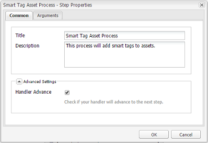

# Configuración del etiquetado de recursos mediante el servicio de contenido inteligente {#configure-asset-tagging-using-the-smart-content-service}

Puede integrar [!DNL Adobe Experience Manager] con el servicio de contenido inteligente mediante [!DNL Adobe Developer Console]. Utilice esta configuración para acceder al servicio de contenido inteligente desde [!DNL Experience Manager].

El artículo detalla las siguientes tareas clave necesarias para configurar el servicio de contenido inteligente. En el back-end, el servidor [!DNL Experience Manager] autentica las credenciales del servicio con la puerta de enlace [!DNL Adobe Developer Console] antes de reenviar la solicitud al servicio de contenido inteligente.

1. [Cree una configuración de Smart Content ](#obtain-public-certificate) Serviceconfiguration en  [!DNL Experience Manager] para generar una clave pública. [Obtenga un certificado público para la integración de OAuth.](#obtain-public-certificate)

1. [Cree una integración en Adobe Developer Console y cargue la clave pública generada.](#create-adobe-i-o-integration)

1. [Configure la ](#configure-smart-content-service) implementación utilizando la clave de API y otras credenciales de  [!DNL Adobe Developer Console].

1. [Compruebe la configuración](#validate-the-configuration).

1. De forma opcional, [habilite el etiquetado automático en la carga de recursos](#enable-smart-tagging-in-the-update-asset-workflow-optional).

## Requisitos previos {#prerequisites}

Antes de utilizar el servicio de contenido inteligente, asegúrese de lo siguiente para crear una integración en [!DNL Adobe Developer Console]:

* Cuenta de Adobe ID que tiene privilegios de administrador para la organización.

* El servicio de contenido inteligente está habilitado para su organización.

Para habilitar Etiquetas inteligentes mejoradas, además de las anteriores, instale también el último [paquete de servicio de Experience Manager](https://experienceleague.adobe.com/docs/experience-manager-release-information/aem-release-updates/aem-releases-updates.html?lang=es).

## Crear la configuración del servicio de contenido inteligente para obtener un certificado público {#obtain-public-certificate}

Un certificado público le permite autenticar su perfil en [!DNL Adobe Developer Console].

1. En la interfaz de usuario [!DNL Experience Manager], acceda a **[!UICONTROL Tools]** > **[!UICONTROL Cloud Services]** > **[!UICONTROL Legacy Cloud Services]**.

1. En la página Cloud Services, haga clic en **[!UICONTROL Configurar ahora]** en **[!UICONTROL Etiquetas inteligentes de recursos]**.

1. En el cuadro de diálogo **[!UICONTROL Crear configuración]**, especifique un título y un nombre para la configuración de etiquetas inteligentes. Haga clic en **[!UICONTROL Crear]**.

1. En el cuadro de diálogo **[!UICONTROL AEM servicio de contenido inteligente]**, utilice los siguientes valores:

   **[!UICONTROL URL de servicio]**: `https://mc.adobe.io/marketingcloud/smartcontent`

   **[!UICONTROL Servidor de autorización]**: `https://ims-na1.adobelogin.com`

   Deje los demás campos en blanco por ahora (para proporcionar más adelante). Haga clic en **[!UICONTROL Aceptar]**.

   

   *Figura: Cuadro de diálogo del servicio de contenido inteligente para proporcionar la URL del servicio de contenido*

   >[!NOTE]
   >
   >La URL proporcionada como [!UICONTROL Service URL] no es accesible a través del explorador y genera un error 404. La configuración funciona correctamente con el mismo valor del parámetro [!UICONTROL Service URL]. Para el estado general del servicio y la programación de mantenimiento, consulte [https://status.adobe.com](https://status.adobe.com).

1. Haga clic en **[!UICONTROL Descargar certificado público para la integración de OAuth]** y descargue el archivo de certificado público `AEM-SmartTags.crt`.

   

   *Figura: Configuración del servicio de etiquetado inteligente*

### Volver a configurar cuándo caduca un certificado {#certrenew}

Una vez caducado un certificado, ya no es de confianza. No puede renovar un certificado caducado. Para añadir un nuevo certificado, siga estos pasos.

1. Inicie sesión en la implementación [!DNL Experience Manager] como administrador. Haga clic en **[!UICONTROL Herramientas]** > **[!UICONTROL Seguridad]** > **[!UICONTROL Usuarios]**.

1. Busque y haga clic en el usuario **[!UICONTROL dam-update-service]**. Haga clic en la pestaña **[!UICONTROL Almacén de claves]**.

1. Elimine el almacén de claves **[!UICONTROL similaritysearch]** y el certificado caducado. Haga clic en **[!UICONTROL Guardar y cerrar]**.

   

   *Imagen: Elimine la entrada `similaritysearch` en el almacén de claves para añadir un nuevo certificado de seguridad.*

1. Vaya a **[!UICONTROL Herramientas]** > **[!UICONTROL Cloud Services]** > **[!UICONTROL Servicios de nube heredados]**. Haga clic en **[!UICONTROL Etiquetas inteligentes de recursos]** > **[!UICONTROL Mostrar configuración]** > **[!UICONTROL Configuraciones disponibles]**. Haga clic en la configuración requerida.

1. Para descargar un certificado público, haga clic en **[!UICONTROL Descargar certificado público para la integración de OAuth]**.

1. Acceda a [https://console.adobe.io](https://console.adobe.io) y vaya a los servicios de contenido inteligente existentes en la página **[!UICONTROL Integraciones]**. Cargue el nuevo certificado. Para obtener más información, consulte las instrucciones de [Creación de la integración de Adobe Developer Console](#create-adobe-i-o-integration).

## Creación de la integración de Adobe Developer Console {#create-adobe-i-o-integration}

Para utilizar las API del servicio de contenido inteligente, cree una integración en la consola del desarrollador de Adobe para obtener [!UICONTROL Clave de API] (generada en el campo [!UICONTROL CLIENT ID] de integración de la consola del desarrollador de Adobe), [!UICONTROL ID DE CUENTA TÉCNICA], [!UICONTROL ID de organización] y [!UICONTROL CLICLICLIENT SECRET] para [!UICONTROL Configuración del servicio de etiquetado inteligente de recursos] de la configuración de nube en [!DNL Experience Manager].

1. Acceda a [https://console.adobe.io](https://console.adobe.io/) en el explorador. Seleccione la cuenta adecuada y compruebe que la función de organización asociada sea administrador del sistema.

1. Cree un proyecto con el nombre que desee. Haga clic en **[!UICONTROL Añadir API]**.

1. En la página **[!UICONTROL Add an API]**, seleccione **[!UICONTROL Experience Cloud]** y, a continuación, seleccione **[!UICONTROL Contenido inteligente]**. Haga clic en **[!UICONTROL Siguiente]**. 

1. Seleccione **[!UICONTROL Cargar la clave pública]**. Proporcione el archivo de certificado descargado de [!DNL Experience Manager]. Se muestra un mensaje con las [!UICONTROL claves públicas cargadas correctamente]. Haga clic en **[!UICONTROL Siguiente]**. 

   La página [!UICONTROL Crear una nueva página de credenciales de cuenta de servicio (JWT)] muestra la clave pública de la cuenta de servicio que se acaba de configurar.

1. Haga clic en **[!UICONTROL Siguiente]**. 

1. En la página **[!UICONTROL Seleccionar perfiles de producto]**, seleccione **[!UICONTROL Servicios de contenido inteligente]**. Haga clic en **[!UICONTROL Guardar API configurada]**.

   La página muestra más información sobre la configuración. Mantenga esta página abierta para copiar y añadir estos valores en [!UICONTROL Configuración del servicio de etiquetado inteligente de recursos] de la configuración de nube en [!DNL Experience Manager] para configurar las etiquetas inteligentes.

   

   *Figura: Detalles sobre la integración en Adobe Developer Console*

## Configuración del servicio de contenido inteligente {#configure-smart-content-service}

Para configurar la integración, utilice los valores de los campos [!UICONTROL TECHNICAL ACCOUNT ID], [!UICONTROL ORGANIZATION ID], [!UICONTROL CLIENT SECRET] y [!UICONTROL CLIENT ID] de la integración de Adobe Developer Console. La creación de una configuración de nube de etiquetas inteligentes permite la autenticación de solicitudes de API desde la implementación [!DNL Experience Manager].

1. En [!DNL Experience Manager], vaya a **[!UICONTROL Herramientas > Cloud Service > Cloud Services heredados]** para abrir la consola [!UICONTROL Cloud Services].

1. En **[!UICONTROL Etiquetas inteligentes de recursos]**, abra la configuración creada anteriormente. En la página de configuración del servicio, haga clic en **[!UICONTROL Editar]**.

1. En el cuadro de diálogo **[!UICONTROL AEM Smart Content Service]**, utilice los valores predefinidos para los campos **[!UICONTROL URL de servicio]** y **[!UICONTROL Servidor de autorización]**.

1. Para los campos [!UICONTROL Api Key], [!UICONTROL Technical Account ID], [!UICONTROL Organization ID] y [!UICONTROL Client Secret], copie y utilice los siguientes valores generados en [Adobe Developer Console integration](#create-adobe-i-o-integration).

   | [!UICONTROL Configuración del servicio de etiquetado inteligente de recursos] | [!DNL Adobe Developer Console] campos de integración |
   |--- |--- |
   | [!UICONTROL Clave de API] | [!UICONTROL ID DE CLIENTE] |
   | [!UICONTROL Id. de cuenta técnica] | [!UICONTROL ID DE CUENTA TÉCNICA] |
   | [!UICONTROL Id. de organización] | [!UICONTROL ID. DE ORGANIZACIÓN] |
   | [!UICONTROL Secreto del cliente] | [!UICONTROL SECRETO DEL CLIENTE] |

## Validación de la configuración {#validate-the-configuration}

Después de completar la configuración, utilice un MBean de JMX para validarla. Para validar, siga estos pasos.

1. Acceda a su servidor [!DNL Experience Manager] en `https://[aem_server]:[port]`.

1. Vaya a **[!UICONTROL Tools > Operations > Web Console]** para abrir la consola OSGi. Haga clic en **[!UICONTROL Principal > JMX]**.

1. Haga clic en **[!UICONTROL com.day.cq.dam.similaritysearch.internal.impl]**. Abre **[!UICONTROL SimilaritySearch Tareas varias]**.

1. Haga clic en **[!UICONTROL validateConfigs()]**. En el cuadro de diálogo **[!UICONTROL Validar configuraciones]**, haga clic en **[!UICONTROL Invocar]**.

   Los resultados de validación se muestran en el mismo cuadro de diálogo.

## Habilitar el etiquetado inteligente en el flujo de trabajo de recursos de actualización de DAM (opcional) {#enable-smart-tagging-in-the-update-asset-workflow-optional}

1. En [!DNL Experience Manager], vaya a **[!UICONTROL Herramientas]** > **[!UICONTROL Flujo de trabajo]** > **[!UICONTROL Modelos]**.

1. En la página **[!UICONTROL Modelos de flujo de trabajo]**, seleccione el modelo de flujo de trabajo de **[!UICONTROL recursos de actualización de DAM]**.

1. Haga clic en **[!UICONTROL Editar]** en la barra de herramientas.

1. Expanda el panel lateral para mostrar los pasos. Arrastre el paso **[!UICONTROL Recurso de etiqueta inteligente]** que está disponible en la sección Flujo de trabajo de DAM y colóquelo después del paso **[!UICONTROL Miniaturas del proceso]**.

   

   *Imagen: Añada el paso del recurso de etiquetas inteligentes después del paso de miniaturas de proceso en el flujo de trabajo de recursos de actualización de DAM*

1. Abra el paso en modo de edición. En **[!UICONTROL Configuración avanzada]**, compruebe que la opción **[!UICONTROL Avance del controlador]** está seleccionada.

   

   *Figura: Configurar el flujo de trabajo de recursos de actualización de DAM y añadir el paso de etiquetas inteligentes*

1. En la pestaña **[!UICONTROL Argumentos]**, seleccione **[!UICONTROL Omitir errores]** si desea que el flujo de trabajo se complete aunque falle el paso de etiquetado automático.

   

   *Figura: Configurar el flujo de trabajo de recursos de actualización de DAM para añadir el paso de etiquetas inteligentes y seleccionar el avance del controlador*

   Para etiquetar recursos al cargarlos, independientemente de si el etiquetado inteligente está activado en las carpetas, seleccione **[!UICONTROL Omitir indicador de etiqueta inteligente]**.

   

   *Figura: Configure el flujo de trabajo de recursos de actualización de DAM para añadir el paso de etiquetas inteligentes y seleccione Omitir el indicador de etiqueta inteligente*

1. Haga clic en **[!UICONTROL Aceptar]** para cerrar el paso del proceso y, a continuación, guarde el flujo de trabajo.

>[!MORELIKETHIS]
>
>* [Administrar etiquetas inteligentes](managing-smart-tags.md)
* [Descripción general y formación de etiquetas inteligentes](enhanced-smart-tags.md)
* [Directrices y reglas para la formación del servicio de contenido inteligente](smart-tags-training-guidelines.md)

