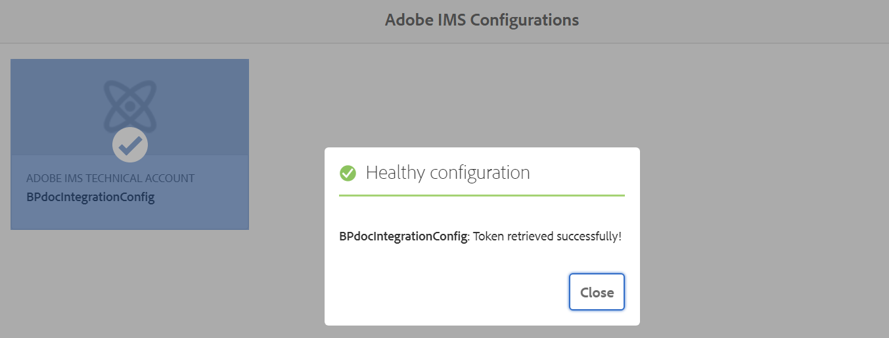
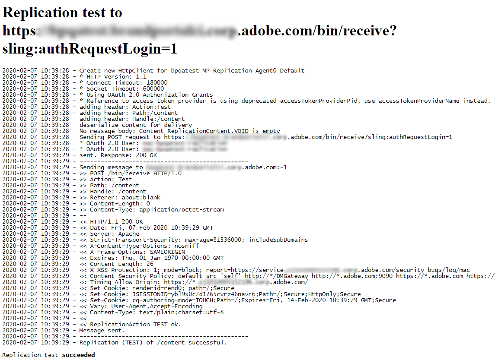
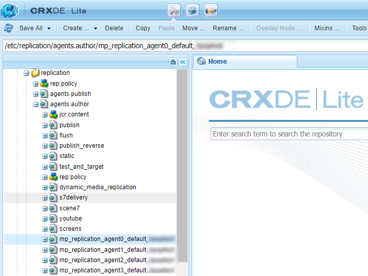

# Configurar AEM Assets con Brand Portal {#configure-integration-64}

Los recursos de Adobe Experience Manager (AEM) se configuran con Brand Portal a través de Adobe I/O, que proporciona un distintivo IMS para la autorización del inquilino de Brand Portal.

>[!NOTE]
>
>La configuración de AEM Assets con Brand Portal mediante E/S de Adobe es compatible con AEM 6.4.8.0 y versiones posteriores.
>
>Anteriormente, Brand Portal se configuraba en la IU clásica mediante OAuth Gateway heredado, que utiliza el intercambio de tokens JWT para obtener un Token de acceso IMS para la autorización.

>[!TIP]
>
>***Solo para clientes existentes***
>
>Se recomienda seguir utilizando la configuración heredada de OAuth Gateway. En caso de que surjan problemas con la configuración heredada de OAuth Gateway, elimine la configuración existente y cree una nueva configuración mediante E/S de Adobe.

Esta ayuda describe los dos casos de uso siguientes:
* [Nueva configuración](#configure-new-integration-64): Si es un usuario nuevo de Brand Portal y desea configurar la instancia de autor de AEM Assets con Brand Portal, puede crear una nueva configuración en E/S de Adobe.
* [Configuración](#upgrade-integration-64)de actualización: Si ya es usuario de Brand Portal y su instancia de autor de AEM Assets está configurada con Brand Portal en OAuth Gateway heredado, se recomienda eliminar las configuraciones existentes y crear una nueva configuración en E/S de Adobe.

La información proporcionada se basa en el supuesto de que cualquiera que lea esta Ayuda está familiarizado con las siguientes tecnologías:

* Instalación, configuración y administración de paquetes de Adobe Experience Manager y AEM

* Uso de sistemas operativos Linux y Microsoft Windows

## Requisitos previos {#prerequisites}

Para configurar AEM Assets con Brand Portal, es necesario lo siguiente:

* Una instancia de autor de AEM Assets en ejecución con el Service Pack más reciente.
* URL del inquilino de Brand Portal.
* Un usuario con privilegios de administrador del sistema en la organización IMS del inquilino de Brand Portal.

[Descargar e instalar AEM 6.4](#aemquickstart)

[Descargar e instalar AEM Service Pack más reciente](#servicepack)

### Descargar e instalar AEM 6.4 {#aemquickstart}

Se recomienda tener AEM 6.4 para configurar una instancia de autor AEM. Si no AEM en ejecución, descárguelo de las siguientes ubicaciones:

* Si ya es cliente de AEM, descargue AEM 6.4 del sitio web [de licencias de](http://licensing.adobe.com)Adobe.

* Si es socio de Adobe, utilice el Programa [de formación de socios de](https://adobe.allegiancetech.com/cgi-bin/qwebcorporate.dll?idx=82357Q) Adobe para solicitar AEM 6.4.

Después de descargar AEM, para obtener instrucciones sobre cómo configurar una instancia de AEM autor, consulte [Implementación y mantenimiento](https://helpx.adobe.com/experience-manager/6-4/sites/deploying/using/deploy.html#defaultlocalinstall).

### Descargar e instalar AEM último Service Pack {#servicepack}

Para obtener instrucciones detalladas, consulte

* [Notas de la versión de Service Pack de AEM 6.4](https://helpx.adobe.com/experience-manager/6-4/release-notes/sp-release-notes.html)

**Póngase en contacto con el Servicio de atención** al cliente si no puede encontrar el paquete de AEM o Service Pack más recientes.

## Crear configuración {#configure-new-integration-64}

Realice los siguientes pasos en la secuencia mostrada si va a configurar AEM Assets con Brand Portal por primera vez:
1. [Obtener un certificado público](#public-certificate)
1. [Crear la integración de Adobe I/O](#createnewintegration)
1. [Crear la configuración de cuenta IMS](#create-ims-account-configuration)
1. [Configurar el servicio en la nube](#configure-the-cloud-service)
1. [Probar la configuración](#test-integration)

### Crear la configuración de IMS {#create-ims-configuration}

La configuración de IMS autentica el inquilino de Brand Portal con la instancia de creación de AEM Assets.

La configuración de IMS incluye dos pasos:

* [Obtener un certificado público](#public-certificate)
* [Crear la configuración de cuenta IMS](#create-ims-account-configuration)

### Obtener un certificado público {#public-certificate}

El certificado público permite autenticar el perfil en Adobe I/O.

1. Inicie sesión en la instancia de autor de AEM AssetsDirección URL predeterminada: http:// localhost:4502/aem/start.html
1. En el panel **Herramientas** , vaya a **[!UICONTROL Seguridad]** >> Configuraciones de **[!UICONTROL Adobe IMS]**.

   

1. Se abre la página Configuraciones de IMS de Adobe.

   Haga clic en **[!UICONTROL Crear]**.

   Esto lo llevará a la página **[!UICONTROL Configuración de cuenta técnica de Adobe IMS]**.

1. De forma predeterminada, se abre la pestaña **Certificado** .

   En **Cloud Solution**, seleccione **[!UICONTROL Adobe Brand Portal]**.

1. Marque la casilla de verificación **[!UICONTROL Crear nuevo certificado]** y especifique un **alias** para el certificado. El alias sirve como nombre del cuadro de diálogo.

1. Haga clic en **[!UICONTROL Crear certificado]**. Aparece un cuadro de diálogo. Haga clic en **[!UICONTROL Aceptar]** para generar el certificado público.

   

1. Haga clic en **[!UICONTROL Descargar clave pública]** y guarde el archivo de certificado *AEM-Adobe-IMS.crt* en el equipo. El archivo de certificado se utiliza para [crear la integración](#createnewintegration) de Adobe I/O.

   

1. Haga clic en **[!UICONTROL Siguiente]**. 

   En la pestaña **Cuenta**, cree la cuenta de Adobe IMS, pero para ello necesitará los detalles de integración. Mantenga esta página abierta por ahora.

   Open a new tab and [Create Adobe I/O integration](#createnewintegration) to get the integration details for IMS Account configurations.

### Crear la integración de Adobe I/O {#createnewintegration}

La integración de Adobe I/O genera la clave de API, el secreto del cliente y la carga útil (JWT), que es necesaria para configurar las configuraciones de cuenta de IMS.

1. Inicie sesión en la consola de Adobe I/O con privilegios de administrador del sistema en la organización IMS del inquilino de Brand Portal.

   Dirección URL predeterminada: [https://console.adobe.io/](https://console.adobe.io/)

1. Haga clic en **[!UICONTROL Crear integración]**.

1. Seleccione **[!UICONTROL Acceso a una API]** y haga clic en **[!UICONTROL Continuar]**.

   

1. Se abre una nueva página de integración.

   Seleccione su organización en la lista desplegable.

   En **[!UICONTROL Experience Cloud]**, seleccione **[!UICONTROL AEM Brand Portal]** y haga clic en **[!UICONTROL Continuar]**.

   Si la opción de Brand Portal está deshabilitada para usted, asegúrese de que ha seleccionado la organización correcta en el cuadro desplegable situado encima de la opción Servicios **[!UICONTROL de]** Adobe. Si no conoce su organización, póngase en contacto con su administrador.

   

1. Especifique un nombre y una descripción para la integración. Haga clic en **[!UICONTROL Seleccionar un archivo del equipo]** y cargue el `AEM-Adobe-IMS.crt` archivo descargado en la sección [Obtener certificados públicos](#public-certificate).

1. Seleccione el perfil de su organización.

   O bien, seleccione el perfil predeterminado **[!UICONTROL Assets Brand Portal]** y haga clic en **[!UICONTROL Crear integración]**. Se crea la integración.

1. Haga clic en **[!UICONTROL Continuar a los detalles de la integración]** para visualizar la información de integración.

   Copiar la **[!UICONTROL clave de API]**

   Haga clic en **[!UICONTROL Recuperar secreto del cliente]** y copie la clave del Secreto del cliente.

   

1. Vaya a la pestaña **[!UICONTROL JWT]** y copie la carga útil **[!UICONTROL JWT]**.

   La clave de API, la clave secreta del cliente y la información de carga útil de JWT se utilizarán para crear la configuración de la cuenta de IMS.

### Crear la configuración de cuenta IMS {#create-ims-account-configuration}

Asegúrese de haber realizado los siguientes pasos:

* [Obtener un certificado público](#public-certificate)
* [Crear la integración de Adobe I/O](#createnewintegration)

**Pasos para crear la configuración de cuenta de IMS:**

1. Abra la página Configuración de IMS, pestaña **[!UICONTROL Cuentas]** . La página se ha mantenido abierta al final de la sección, [Obtener un certificado público](#public-certificate).

1. Especifique un **[!UICONTROL Título]** para la cuenta de IMS.

   En **[!UICONTROL Servidor de autorización]**, introduzca la dirección URL: [https://ims-na1.adobelogin.com/](https://ims-na1.adobelogin.com/)

   Pegue la clave de API, el Secreto del cliente y la carga útil JWT que ha copiado al final de [Crear integración de Adobe I/O](#createnewintegration).

   Haga clic en **[!UICONTROL Crear]**.

   Se crea la integración.

   

1. Seleccione la configuración de IMS y haga clic en **[!UICONTROL Comprobar estado]**. Aparecerá un cuadro de diálogo.

   Haga clic en **[!UICONTROL Comprobar]**. Cuando la conexión se realiza correctamente, aparece el mensaje *Token recuperado correctamente* .

   

>[!CAUTION]
>
>Sólo debe tener una configuración de IMS. No cree varias configuraciones de IMS.
>
>Asegúrese de que la configuración de IMS pase la comprobación de estado. Si la configuración no pasa la comprobación de estado, no es válida. Debe eliminarla y crear una configuración nueva y válida.

### Configurar el servicio en la nube {#configure-the-cloud-service}

Siga estos pasos para crear la configuración del servicio en la nube de Brand Portal:

1. Inicie sesión en su instancia de autor de AEM Assets

   Dirección URL predeterminada: http:// localhost:4502/aem/start.html
1. En el panel **Herramientas** , vaya a **[!UICONTROL Cloud Services >> AEM Brand Portal]**.

   Se abre la página Configuraciones de Brand Portal.

1. Haga clic en **[!UICONTROL Crear]**.

1. Especifique un **[!UICONTROL Título]** para la configuración.

   Seleccione la configuración de IMS que creó en el paso, [cree la configuración](#create-ims-account-configuration) de la cuenta de IMS.

   En la URL **** del servicio, introduzca la URL del inquilino de Brand Portal.

   

1. Haga clic en **[!UICONTROL Guardar y cerrar]**. Se crea la configuración de nube. Su instancia de autor de AEM Assets ahora está integrada con el inquilino de Brand Portal.

### Probar la configuración{#test-integration}

1. Inicie sesión en su instancia de autor de AEM Assets

   Dirección URL predeterminada: http:// localhost:4502/aem/start.html

1. From **Tools**  panel, navigate to **[!UICONTROL Deployment >> Replication]**.

   

1. Se abre la página Replicación.

   Haga clic en **[!UICONTROL Agentes en el autor]**.

   

1. Se crean cuatro agentes de replicación para cada inquilino.

   Busque los agentes de replicación del inquilino de Brand Portal.

   Haga clic en la dirección URL del agente de replicación.

   

   >[!NOTE]
   >
   >Los agentes de replicación trabajan en paralelo y comparten la distribución del trabajo por igual, aumentando así la velocidad de publicación en cuatro veces la velocidad original. Una vez configurado el servicio en la nube, no se requiere una configuración adicional para habilitar los agentes de replicación activados de forma predeterminada para habilitar la publicación en paralelo de varios recursos.

   >[!NOTE]
   >
   >Evite desactivar cualquiera de los agentes de replicación, ya que puede provocar errores en la replicación de algunos de los recursos.

1. To verify the connection between AEM Assets author and Brand Portal, click **[!UICONTROL Test Connection]**.

   

1. Observe la parte inferior de los resultados de la prueba para verificar que la replicación se realizó correctamente.

   

   >[!NOTE]
   >
   >Los agentes de replicación trabajan en paralelo y comparten la distribución del trabajo por igual, aumentando así la velocidad de publicación en cuatro veces la velocidad original. Una vez configurado el servicio en la nube, no se requiere una configuración adicional para habilitar los agentes de replicación activados de forma predeterminada para habilitar la publicación en paralelo de varios recursos.

1. Compruebe los resultados de la prueba en los cuatro agentes de replicación uno por uno.

   >[!NOTE]
   >
   >Evite desactivar cualquiera de los agentes de replicación, ya que puede provocar errores en la replicación de algunos de los recursos.

Brand Portal se ha configurado correctamente con su instancia de autor de AEM Assets. Ahora puede:

* [Publicar recursos desde AEM Assets en Brand Portal](../assets/brand-portal-publish-assets.md)
* [Publicar carpetas desde AEM Assets en Brand Portal](../assets/brand-portal-publish-folder.md)
* [Publicar colecciones desde AEM Assets en Brand Portal](../assets/brand-portal-publish-collection.md)
* [Configure la fuente](https://docs.adobe.com/content/help/es-ES/experience-manager-brand-portal/using/asset-sourcing-in-brand-portal/brand-portal-asset-sourcing.html) de recursos para permitir que los usuarios de Brand Portal contribuyan y publiquen recursos en AEM Assets.

## Configuración de actualización {#upgrade-integration-64}

Realice los siguientes pasos en la secuencia indicada para actualizar las configuraciones existentes:
1. [Verificar trabajos en ejecución](#verify-jobs)
1. [Eliminar configuraciones existentes](#delete-existing-configuration)
1. [Crear configuración](#configure-new-integration-64)

### Verificar trabajos en ejecución {#verify-jobs}

Asegúrese de que no se esté ejecutando ningún trabajo de publicación en la instancia de creación de AEM Assets antes de realizar ninguna modificación. Para ello, puede verificar los cuatro agentes de replicación y asegurarse de que la cola sea ideal o esté vacía.

1. Inicie sesión en su instancia de autor de AEM Assets

   Dirección URL predeterminada: http:// localhost:4502/aem/start.html

1. From **Tools**  panel, navigate to **[!UICONTROL Deployment >> Replication]**.

1. Se abre la página Replicación.

   Haga clic en **[!UICONTROL Agentes en el autor]**.

   

1. Busque los agentes de replicación del inquilino de Brand Portal.

   Asegúrese de que la **cola esté inactiva** para todos los agentes de replicación y de que no haya ningún trabajo de publicación activo.

   

### Eliminar configuraciones existentes {#delete-existing-configuration}

Debe ejecutar la siguiente lista de comprobación al eliminar la configuración existente.
* Eliminar los cuatro agentes de replicación
* Eliminar servicio de nube
* Eliminar usuario de MAC

Realice los siguientes pasos para eliminar la configuración existente:

1. Inicie sesión en su instancia de autor de AEM Assets y abra CRX Lite como administrador.

   Dirección URL predeterminada: http:// localhost:4502/crx/de/index.jsp

1. Navegue hasta los cuatro agentes de replicación del inquilino de Brand Portal `/etc/replications/agents.author` y elimínelos.

   

1. Vaya a la configuración `/etc/cloudservices/mediaportal` del **Cloud Service y elimínela**.

   

1. Navegue hasta `/home/users/mac` y elimine el usuario **** MAC del inquilino de Brand Portal.

   

Ahora puede [crear la configuración](#configure-new-integration-64) en la instancia de creación de AEM 6.4 en E/S de Adobe.

<!--
   Comment Type: draft

   <li> </li>
   -->

<!--
   Comment Type: draft

   <li>Step text</li>
   -->

Después de que la replicación se realice correctamente, puede publicar recursos, carpetas y colecciones en Brand Portal. Para obtener más información, consulte:

* [Publicar recursos en Brand Portal](brand-portal-publish-assets.md)
* [Publicación de recursos y carpetas en Brand Portal](brand-portal-publish-folder.md)
* [Publicar colecciones en Brand Portal](brand-portal-publish-collection.md)

