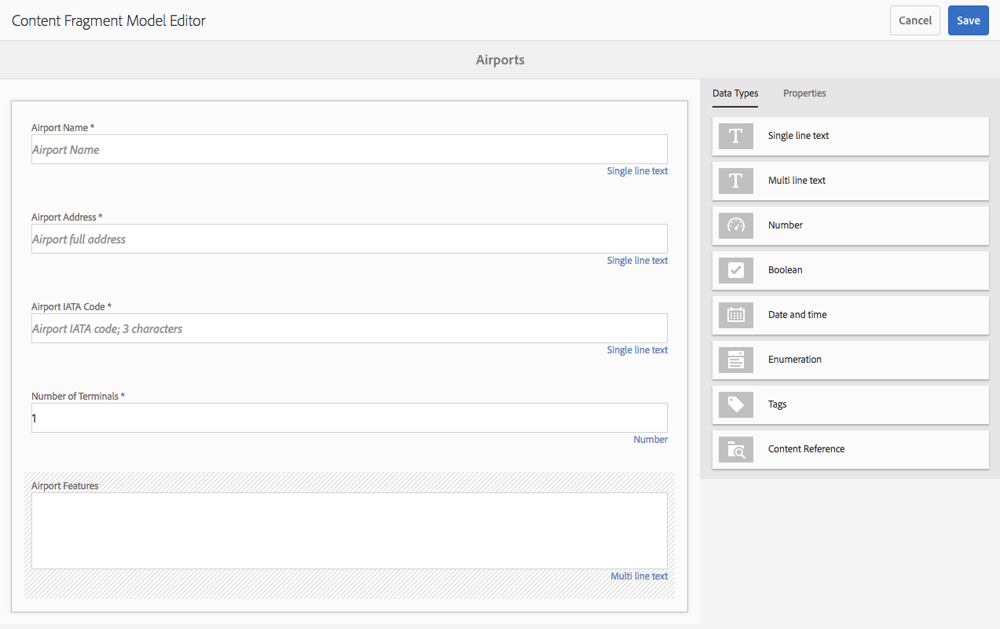

# Modelos de fragmento de contenido {#content-fragment-models}

>[!CAUTION]
>
>Algunas funciones de fragmento de contenido requieren la aplicación de [AEM 6.4 Service Pack 2 (6.4.2.0) o posterior](../release-notes/sp-release-notes.md).

Los modelos de fragmentos de contenido definen la estructura del contenido para los fragmentos [de](content-fragments.md)contenido.

## Enable Content Fragment Models {#enable-content-fragment-models}

>[!CAUTION]
>
>Si no activa Modelos **[!UICONTROL de fragmento de]** contenido, la opción **[!UICONTROL Crear]** no estará disponible para crear nuevos modelos.

Para habilitar los modelos de fragmentos de contenido debe:

* Habilitar el uso de modelos de fragmentos de contenido en el administrador de configuración
* Aplicar la configuración a la carpeta Assets

### Habilitar modelos de fragmento de contenido en Configuration Manager {#enable-content-fragment-models-in-configuration-manager}

Para [crear un nuevo modelo](#creating-a-content-fragment-model) de fragmento de contenido, primero **debe** activarlo con Configuration Manager:

1. Vaya a **[!UICONTROL Herramientas]**, **[!UICONTROL General]**, luego abra el **[!UICONTROL Explorador de configuración]**.
1. Seleccione la ubicación adecuada para el sitio web.
1. Utilice **[!UICONTROL Crear]** para abrir el cuadro de diálogo, donde:

   1. Especifique un **[!UICONTROL título]**.
   1. Seleccione Modelos **[!UICONTROL de fragmento de contenido]** para habilitar su uso.

   

1. Seleccione **[!UICONTROL Crear]** para guardar la definición.

### Aplicar la configuración a la carpeta de recursos {#apply-the-configuration-to-your-assets-folder}

Cuando la configuración **[!UICONTROL global]** está habilitada para modelos de fragmentos de contenido, cualquier modelo que creen los usuarios se puede utilizar en cualquier carpeta de recursos.

Para utilizar otras configuraciones (es decir, excluyendo global) con una carpeta de Assets comparable, debe definir la conexión. Esto se realiza mediante **[!UICONTROL Configuración]** en la pestaña **[!UICONTROL Cloud Services]** de las **[!UICONTROL Propiedades de la carpeta]** correspondiente.

## Creación de un modelo de fragmento de contenido {#creating-a-content-fragment-model}

1. Vaya a **[!UICONTROL Herramientas]**, **[!UICONTROL Recursos]** y, a continuación, abra Modelos **[!UICONTROL de fragmento de contenido]**.
1. Vaya a la carpeta correspondiente a su [configuración](#enable-content-fragment-models).
1. Utilice **[!UICONTROL Crear]** para abrir el asistente.

   >[!CAUTION]
   >
   >Si no se ha habilitado [el](#enable-content-fragment-models)uso de modelos de fragmentos de contenido, la opción **Crear** no estará disponible.

1. Especifique el **[!UICONTROL Título del modelo]**. También puede agregar una **[!UICONTROL descripción]** si fuera necesario.

   

1. Utilice **[!UICONTROL Crear]** para guardar el modelo vacío. Un mensaje indicará el éxito de la acción, puede seleccionar **[!UICONTROL Abrir]** para editar inmediatamente el modelo o **[!UICONTROL Listo]** para volver a la consola.

## Definición del modelo de fragmento de contenido {#defining-your-content-fragment-model}

El modelo de fragmento de contenido define eficazmente la estructura de los fragmentos de contenido resultantes. Con el editor de modelos puede agregar y configurar los campos obligatorios:

>[!CAUTION]
>
>La edición de un modelo de fragmento de contenido existente puede afectar a los fragmentos dependientes.

1. Vaya a **[!UICONTROL Herramientas]**, **[!UICONTROL Recursos]** y, a continuación, abra Modelos **[!UICONTROL de fragmento de contenido]**.

1. Vaya a la carpeta que contiene el modelo de fragmentos de contenido.
1. Abra el modelo requerido para **[!UICONTROL Editar]**; utilice la acción rápida o seleccione el modelo y, a continuación, la acción de la barra de herramientas.

   Una vez abierto, el editor de modelos muestra:

   * left: campos ya definidos
   * right: **[!UICONTROL Tipos de datos]** disponibles para crear campos (y **[!UICONTROL Propiedades]** para su uso una vez creados los campos)

   >[!NOTE]
   >
   >When a field is **Required**, the **Label** indicated in the left pane will be marked with an asterix (**&amp;ast;**).

   

1. **Para Añadir un campo**

   * Arrastre un tipo de datos requerido a la ubicación requerida para un campo:

   

   * Una vez agregado el campo al modelo, el panel derecho mostrará las **propiedades** que se pueden definir para ese tipo de datos en particular. Aquí puede definir lo que se necesita para ese campo. Por ejemplo:

   

1. **Quitar un campo**

   Seleccione el campo requerido y toque o haga clic en el icono de papelera. Se le solicitará que confirme la acción.

   

1. Después de agregar todos los campos obligatorios y definir las propiedades, utilice **[!UICONTROL Guardar]** para mantener la definición. Por ejemplo:

   

## Eliminación de un modelo de fragmento de contenido {#deleting-a-content-fragment-model}

>[!CAUTION]
>
>La eliminación de un modelo de fragmento de contenido puede afectar a los fragmentos dependientes.

Para eliminar un modelo de fragmento de contenido:

1. Vaya a **[!UICONTROL Herramientas]**, **[!UICONTROL Recursos]** y, a continuación, abra Modelos **[!UICONTROL de fragmento de contenido]**.

1. Vaya a la carpeta que contiene el modelo de fragmentos de contenido.
1. Seleccione el modelo, seguido de **[!UICONTROL Eliminar]** de la barra de herramientas.

   >[!NOTE]
   >
   >Si se hace referencia al modelo, se mostrará una advertencia. Tome las medidas adecuadas.

## Publicación de un modelo de fragmento de contenido {#publishing-a-content-fragment-model}

Los modelos de fragmentos de contenido deben publicarse cuando se publiquen fragmentos de contenido dependientes o antes de hacerlo.

Para publicar un modelo de fragmento de contenido:

1. Vaya a **[!UICONTROL Herramientas]**, **[!UICONTROL Recursos]** y, a continuación, abra Modelos **[!UICONTROL de fragmento de contenido]**.

1. Vaya a la carpeta que contiene el modelo de fragmentos de contenido.
1. Seleccione el modelo, seguido de **[!UICONTROL Publicar]** en la barra de herramientas.

   >[!NOTE]
   >
   >Si publica un fragmento de contenido para el que el modelo aún no se ha publicado, una lista de selección lo indicará y el modelo se publicará con el fragmento.

