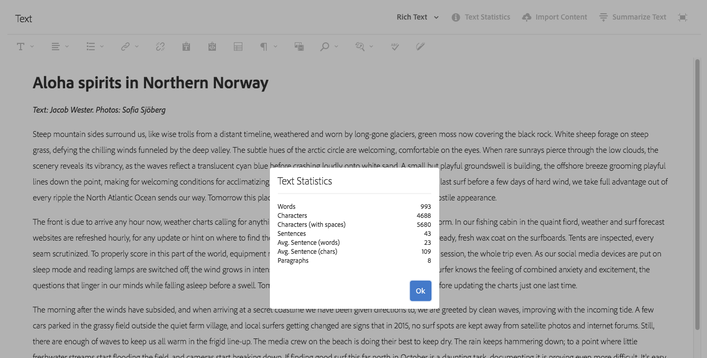
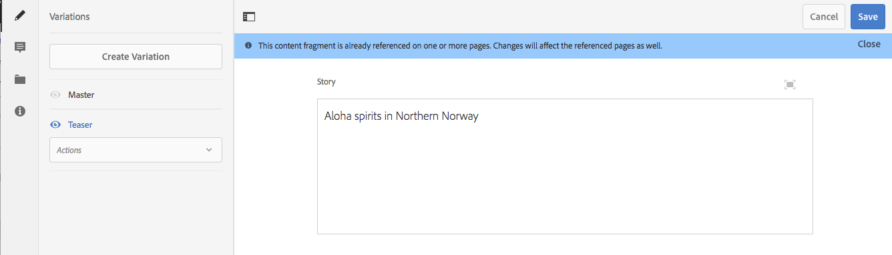

# Variaciones: Crear contenido de fragmentos {#variations-authoring-fragment-content}

>[!CAUTION]
>
>AEM 6.4 ha llegado al final de la compatibilidad ampliada y esta documentación ya no se actualiza. Para obtener más información, consulte nuestra [períodos de asistencia técnica](https://helpx.adobe.com/es/support/programs/eol-matrix.html). Buscar las versiones compatibles [here](https://experienceleague.adobe.com/docs/).

>[!CAUTION]
>
>Algunas funciones de fragmento de contenido requieren la aplicación de [AEM 6.4 Service Pack 2 (6.4.2.0) o posterior](../release-notes/sp-release-notes.md).

[Variaciones](content-fragments.md#constituent-parts-of-a-content-fragment) son una característica importante de los fragmentos de contenido, ya que permiten crear y editar copias del contenido principal para su uso en canales o escenarios específicos.

En la pestaña **Variaciones** puede hacer lo siguiente:

* [Introducir el contenido](#authoring-your-content) para el fragmento
* [Crear y administrar variaciones](#managing-variations) del contenido **Principal**

Realizar una serie de otras acciones en función del tipo de datos que se esté editando; por ejemplo:

* [Insertar recursos visuales en el fragmento](#inserting-assets-into-your-fragment) (imágenes)
* Seleccionar entre [Texto enriquecido](#rich-text), [Texto sin formato](#plain-text) y [Markdown](#markdown) para editar

* [Cargar contenido](#uploading-content)

* [Ver estadísticas clave](#viewing-key-statistics) (acerca del texto multilínea)
* [Resumir texto](#summarizing-text)

* [Sincronizar variaciones con contenido principal](#synchronizing-with-master)

>[!CAUTION]
>
>Después de publicar un fragmento o de hacer referencia a él, AEM mostrará una advertencia cuando un autor abra el fragmento para editarlo de nuevo. Esto sirve para advertir que los cambios en el fragmento también afectarán a las páginas a las que se hace referencia.

## Creación de contenido {#authoring-your-content}

Cuando abra el fragmento de contenido para editarlo, la pestaña **Variaciones** se abrirá de forma predeterminada. Aquí puede crear el contenido, para Principal o cualquier variación que tenga. Puede hacer lo siguiente:

* realice ediciones directamente en la pestaña **Variaciones** 
* abra el [editor de pantalla completa](#full-screen-editor) a:

   * seleccione el [Formato](#formats)
   * consulte más opciones de edición (para formato de [Texto enriquecido](#rich-text))
   * acceder a una amplia gama de [acciones](#actions)

Por ejemplo:

* Edición de un fragmento simple

   Un fragmento simple consta de un campo de texto multilínea (los recursos visuales se pueden agregar desde el editor de pantalla completa).

   

* Edición de un fragmento con contenido estructurado

   Un fragmento estructurado contiene varios campos, de varios tipos de datos, que se definieron en el modelo de contenido. Para cualquier campo multilínea, la variable [editor de pantalla completa](#full-screen-editor) está disponible.

   

### Editor de pantalla completa {#full-screen-editor}

Al editar un campo de texto multilínea, puede abrir el editor de pantalla completa:

El editor de pantalla completa proporciona:

* Acceso a varias [acciones](#actions)
* Según el [formato](#formats), opciones de formato adicionales ([Texto enriquecido](#rich-text))

### Acciones {#actions}

También están disponibles las siguientes acciones (para todas los [formatos](#formats)) cuando el editor de pantalla completa (es decir, texto multilínea) está abierto:

* Seleccione el [format](#formats) ([Texto enriquecido](#rich-text), [Texto sin formato](#plain-text), [Markdown](#markdown))
* [Mostrar estadísticas de texto](#viewing-key-statistics)
* [Cargar contenido](#uploading-content)
* [Sincronizar con Principal](#synchronizing-with-master) (al editar una variación)
* [Resumir texto](#summarizing-text)
* [Anotar](content-fragments-variations.md#annotating-a-content-fragment) su texto

* [Insertar recursos visuales en el fragmento](#inserting-assets-into-your-fragment) (imágenes)

### Formatos {#formats}

Las opciones para editar texto multilínea dependen del formato seleccionado:

* [Texto enriquecido](#rich-text)
* [Texto sin formato](#plain-text)
* [Markdown](#markdown)

El formato se puede seleccionar cuando se usa el editor de pantalla completa.

### Texto enriquecido {#rich-text}

La edición de texto enriquecido le permite dar formato:

* Negrita
* Cursiva
* Subrayado
* Alineación: izquierda, centro, derecha
* Lista con viñetas
* Lista numerada
* Sangría: aumentar, disminuir
* Crear/romper hipervínculos
* Abra el editor de pantalla completa, donde están disponibles las siguientes opciones de formato:

   * Pegar texto/desde Word
   * Insertar una tabla
   * Estilo de párrafo: Párrafo, Encabezado 1/2/3
   * [Insertar recursos visuales](#inserting-assets-into-your-fragment)
   * Búsqueda
   * Buscar/Reemplazar
   * Corrector ortográfico
   * [Anotaciones](content-fragments-variations.md#annotating-a-content-fragment)

Las [acciones](#actions) también son accesibles desde el editor de pantalla completa.

### Texto sin formato {#plain-text}

El texto sin formato permite introducir rápidamente el contenido sin aplicar formato ni marcar la información. También puede abrir el editor de pantalla completa para obtener más [acciones](#actions).

>[!CAUTION]
>
>Si selecciona **Texto sin formato**, puede perder cualquier formato, marca o recurso que haya insertado en **Texto enriquecido** o **Marcado**.

### Markdown {#markdown}

>[!NOTE]
>
>Para obtener información completa, consulte la documentación [Markdown](content-fragments-markdown.md).

Esto le permite dar formato al texto mediante markdown. Puede definir lo siguiente:

* Encabezados
* Párrafos y saltos de línea
* Vínculos
* Imágenes
* Comillas de bloque
* Listas
* Énfasis
* Bloques de código
* Secuencias de escape de barra invertida

También puede abrir el editor de pantalla completa para obtener más [acciones](#actions).

>[!CAUTION]
>
>Si cambia entre **Texto enriquecido** y **Markdown**, puede que se produzcan efectos inesperados con Comillas de bloque y Bloques de código, ya que estos dos formatos pueden tener diferencias en la forma en que se gestionan.

### Visualización de estadísticas clave {#viewing-key-statistics}

Cuando el editor de pantalla completa está abierto, la acción **Estadísticas de texto** mostrará un rango de información sobre el texto. Por ejemplo:

### Carga de contenido {#uploading-content}

Para facilitar el proceso de creación de fragmentos de contenido, puede cargar texto preparado en un editor externo y añadirlo directamente al fragmento.

### Texto de resumen {#summarizing-text}

El texto de resumen está diseñado para ayudar a los usuarios a reducir la longitud de su texto a un número predefinido de palabras, manteniendo al mismo tiempo los puntos clave y el significado general.

>[!NOTE]
>
>A un nivel más técnico, el sistema mantiene las frases que califica como que proporcionan la *mejor relación entre densidad y singularidad de la información* según algoritmos específicos.

>[!CAUTION]
>
>El fragmento de contenido debe tener una carpeta de idioma válida como antecesor; se utiliza para determinar el modelo de idioma que se va a utilizar.
>
>Por ejemplo, `en/` como en la siguiente ruta:
>
>`/content/dam/my-brand/en/path-down/my-content-fragment`

>[!CAUTION]
>
>El inglés está disponible de forma predeterminada.
>
>Otros idiomas están disponibles como Paquetes de modelo de idioma desde Distribución de software:
>
>* [Francés (fr) de distribución de software](https://experience.adobe.com/#/downloads/content/software-distribution/en/aem.html?package=/content/software-distribution/en/details.html/content/dam/aem/public/adobe/packages/cq630/product/smartcontent-model-fr)
>* [Alemán (de) de distribución de software](https://experience.adobe.com/#/downloads/content/software-distribution/en/aem.html?package=/content/software-distribution/en/details.html/content/dam/aem/public/adobe/packages/cq630/product/smartcontent-model-de)
>* [Italiano (it) de distribución de software](https://experience.adobe.com/#/downloads/content/software-distribution/en/aem.html?package=/content/software-distribution/en/details.html/content/dam/aem/public/adobe/packages/cq630/product/smartcontent-model-it)
>* [Español (es) de distribución de software](https://experience.adobe.com/#/downloads/content/software-distribution/en/aem.html?package=/content/software-distribution/en/details.html/content/dam/aem/public/adobe/packages/cq630/product/smartcontent-model-es)
>

1. Seleccione **[!UICONTROL Principal]** o la variación requerida.
1. Abra el editor de pantalla completa.

1. Seleccione **[!UICONTROL Resumir texto]** en la barra de herramientas.

   

1. Especifique el número de palabras objetivo y seleccione **[!UICONTROL Inicio]**:
1. El texto original se muestra en paralelo con el resumen propuesto:

   * Las frases que se eliminen se resaltan en rojo y se tachan.
   * Haga clic en cualquier frase resaltada para mantenerla en el contenido resumido.
   * Haga clic en cualquier frase no resaltada para que la eliminen.

   

1. Seleccione **[!UICONTROL Resumen]** para confirmar los cambios.

### Anotación de un fragmento de contenido {#annotating-a-content-fragment}

Para realizar anotaciones en un fragmento:

1. Seleccione **[!UICONTROL Principal]** o la variación requerida.
1. Abra el editor de pantalla completa.
1. Seleccione texto. La variable **[!UICONTROL Anotar]** está disponible.

   

1. Se abrirá un cuadro de diálogo: Aquí puede introducir la anotación.

1. Cierre el editor de pantalla completa y **[!UICONTROL Guardar]** el fragmento.

### Visualización, Edición, Eliminación de anotaciones {#viewing-editing-deleting-annotations}

Anotaciones:

* Se indican mediante el resaltado en el texto, tanto en pantalla completa como en modo normal del editor. Los detalles completos de una anotación se pueden ver, editar o eliminar haciendo clic en el texto resaltado, que reabrirá el cuadro de diálogo.

   >[!NOTE]
   >
   >Se proporciona un selector desplegable si se han aplicado varias anotaciones a un texto.

* Cuando se elimina todo el texto al que se aplicó la anotación, también se elimina la anotación.

* Se puede enumerar y eliminar seleccionando la pestaña **[!UICONTROL Anotaciones]** en el editor de fragmentos.

   

* Se puede ver y eliminar en [Cronología](https://helpx.adobe.com/experience-manager/6-3/assets/using/content-fragments-managing.html#timeline-for-content-fragments) para el fragmento seleccionado.

### Inserción de recursos en el fragmento {#inserting-assets-into-your-fragment}

Para facilitar el proceso de creación de fragmentos de contenido, puede agregar [Recursos](managing-assets-touch-ui.md) (imágenes) directamente al fragmento.

Se agregarán a la secuencia de párrafo del fragmento sin ningún formato; el formato se puede realizar cuando [se utiliza/se hace referencia al fragmento en una página](/help/sites-authoring/content-fragments.md).

>[!CAUTION]
>
>Estos recursos no se pueden mover ni eliminar en una página de referencia; esto debe hacerse en el editor de fragmentos.
>
>Sin embargo, el formato del recurso (p. ej., su tamaño) debe realizarse en el [editor de páginas](/help/sites-authoring/content-fragments.md). La representación del recurso en el editor de fragmentos se realiza exclusivamente para crear el flujo de contenido.

>[!NOTE]
>
>Hay varios métodos para agregar [imágenes](content-fragments.md#fragments-with-visual-assets) al fragmento o página.

1. Coloque el cursor en la posición en la que desee agregar la imagen.
1. Utilice el icono **[!UICONTROL Insertar recurso]** para abrir el cuadro de diálogo de búsqueda.

   

1. En el cuadro de diálogo puede hacer lo siguiente:

   * vaya al recurso necesario en DAM
   * buscar el recurso en DAM

   Una vez localizado, seleccione el recurso necesario haciendo clic en la miniatura.

1. Utilice **[!UICONTROL Seleccionar]** para agregar el recurso al sistema de párrafos del fragmento de contenido en la ubicación actual.

   >[!CAUTION]
   >
   >Si, después de agregar un recurso, cambia el formato a:
   >
   >* **Texto sin formato**: El recurso se perderá completamente del fragmento.
   >* **Marcado**: El recurso no estará visible, pero permanecerá allí cuando vuelva a **Texto enriquecido**.

## Administración de variaciones {#managing-variations}

### Creación de una variación {#creating-a-variation}

Las variaciones le permiten tomar el contenido **principal** y variar según el propósito (si es necesario).

Para crear una nueva variación, haga lo siguiente:

1. Abra el fragmento y asegúrese de que el panel lateral esté visible.
1. Seleccione **[!UICONTROL Variaciones]** en la barra de iconos del panel lateral.
1. Seleccione **[!UICONTROL Crear variación]**.
1. Se abrirá un cuadro de diálogo, especifique el **[!UICONTROL Título]** y la **[!UICONTROL Descripción]** de la nueva variación.
1. Seleccione **[!UICONTROL Agregar]**; el fragmento **[!UICONTROL principal]** se copiará en la nueva variación, que ahora estará abierta para [edición](#editing-a-variation).

   >[!NOTE]
   >
   >Al crear una variación nueva, siempre es **Principal** que se copia, no la variación que está abierta actualmente.

### Edición de una variación {#editing-a-variation}

Puede realizar cambios en el contenido de la variación después de lo siguiente:

* [Creación de la variación](#creating-a-variation).
* Abra un fragmento existente y, a continuación, seleccione la variación necesaria en el panel lateral.

### Cambio del nombre de una variación {#renaming-a-variation}

Para cambiar el nombre de una variación existente:

1. Abra el fragmento y seleccione **[!UICONTROL Variaciones]** en el panel lateral.
1. Seleccione la variación requerida.
1. Seleccione **[!UICONTROL Cambiar nombre]** del menú desplegable **[!UICONTROL Acciones]**.

1. Introduzca el nuevo **[!UICONTROL Título]** o **[!UICONTROL Descripción]** en el cuadro de diálogo resultante.

1. Confirme la acción **[!UICONTROL Cambiar nombre]**.

>[!NOTE]
>
>Esto solo afecta a la variación **Título**.

### Eliminación de una variación {#deleting-a-variation}

Para eliminar una variación existente, haga esto:

1. Abra el fragmento y seleccione **[!UICONTROL Variaciones]** en el panel lateral.
1. Seleccione la variación requerida.
1. Seleccione **[!UICONTROL Eliminar]** del menú desplegable **[!UICONTROL Acciones]**.

1. Confirme la acción **[!UICONTROL Eliminar]** en el cuadro de diálogo.

>[!NOTE]
>
>No puede eliminar **Principal**.

### Sincronización con Principal {#synchronizing-with-master}

**Principal** es una parte integral de un fragmento de contenido y por definición contiene la copia principal del contenido, mientras que las variaciones contienen versiones individuales actualizadas y adaptadas de ese contenido. Cuando Master se actualiza, es posible que estos cambios también sean relevantes para las variaciones y, por lo tanto, deban propagarse a ellas.

Al editar una variación, tiene acceso a la acción para sincronizar el elemento actual de la variación con Principal. Esto le permite copiar automáticamente los cambios realizados en Principal en la variación requerida.

>[!CAUTION]
>
>La sincronización solo está disponible para copiar cambios *de **Principal**a la variación*.
>
>Solo se sincronizará el elemento actual de la variación.
>
>La sincronización solo funciona en el tipo de datos de **texto de varias líneas**.
>
>No está disponible como opción la transferencia de cambios *de una variación **a Principal***.

1. Abra el fragmento de contenido en el editor de fragmentos. Asegúrese de que **Principal** se ha editado.
2. Seleccione una variación específica y, a continuación, la acción de sincronización adecuada desde:

   * el selector desplegable **Acciones**, **Sincronizar elemento actual con principal**
   * la barra de herramientas del editor de pantalla completa: **Sincronizar con principal**

3. Principal y la variación se mostrarán en paralelo:

   * verde indica el contenido añadido (a la variación)
   * rojo indica que el contenido se ha eliminado (de la variación)

   

4. Seleccione **[!UICONTROL Sincronizar]**, la variación se actualiza y se muestra.
