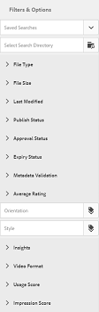
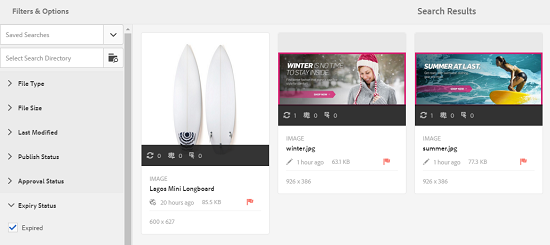
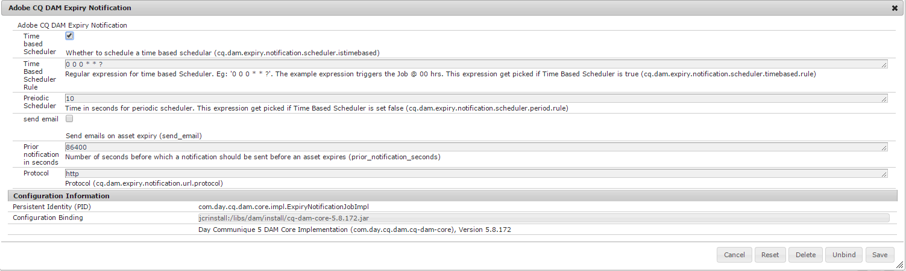
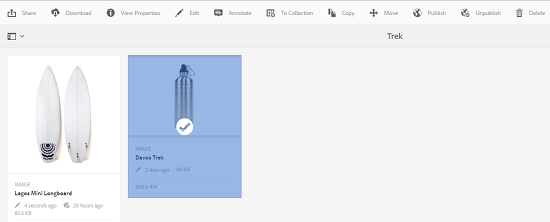

# Digital Rights Management para recursos {#digital-rights-management-in-assets}

>[!CAUTION]
>
>AEM 6.4 ha llegado al final de la compatibilidad ampliada y esta documentación ya no se actualiza. Para obtener más información, consulte nuestra [períodos de asistencia técnica](https://helpx.adobe.com/es/support/programs/eol-matrix.html). Buscar las versiones compatibles [here](https://experienceleague.adobe.com/docs/).

Los recursos digitales suelen estar asociados a una licencia que especifica los términos y la duración del uso. Porque [!DNL Adobe Experience Manager Assets] está totalmente integrado con el [!DNL Experience Manager] , puede administrar de forma eficaz la información de caducidad de los recursos y los estados de los recursos. También puede asociar información de licencias con recursos.

## Caducidad del recurso {#asset-expiration}

La caducidad de los activos es una forma eficaz de hacer cumplir los requisitos de licencia de los activos. Garantiza que el recurso publicado se cancele cuando caduque, lo que evita la posibilidad de que se produzca cualquier infracción de licencia. Un usuario sin permisos de administrador no puede editar, copiar, mover, publicar ni descargar un recurso caducado.

Puede ver el estado de caducidad de un recurso en la [!DNL Assets] en las vistas de tarjeta y lista.

*Figura: En la vista de tarjeta, un indicador de la tarjeta indica que el recurso ha caducado.*

*Figura: En la vista de lista, la variable [!UICONTROL Estado] muestra la columna [!UICONTROL Caducado] banner.*

Puede ver el estado de caducidad de un recurso en la [!UICONTROL Cronología] en el carril izquierdo.

>[!NOTE]
>
>La fecha de caducidad de un recurso se muestra de forma diferente para los usuarios de diferentes zonas horarias.

También puede ver el estado de caducidad de los recursos en la **[!UICONTROL Referencias]** carril. Administra los estados de caducidad de los recursos y las relaciones entre los recursos compuestos y los subrecursos, colecciones y proyectos a los que se hace referencia.

1. Desplácese al recurso para el que desea ver las páginas web de referencia y los recursos compuestos.
1. Seleccione el recurso y haga clic en el [!DNL Experience Manager] logotipo.

   

1. Choose **[!UICONTROL Referencias]** del menú .

   

   Para los recursos caducados, el carril Referencias muestra el estado de caducidad **[!UICONTROL El recurso ha caducado]** en la parte superior.

   

   Si el recurso tiene subrecursos caducados, el carril Referencias muestra el estado **[!UICONTROL El recurso tiene subrecursos caducados]**.

   

### Buscar recursos caducados {#search-expired-assets}

Puede buscar recursos caducados, incluidos subrecursos caducados, en el panel Buscar .

1. En el [!DNL Assets] de la consola, haga clic en **[!UICONTROL Buscar]** en la barra de herramientas para mostrar el cuadro Omnisearch .

   

1. Con el cursor en el cuadro Omnisearch , presione la tecla Intro para mostrar la página de resultados de la búsqueda.

   

1. Haga clic en [!DNL Experience Manager] para mostrar el panel de búsqueda.

   

1. Haga clic en el **[!UICONTROL Estado de caducidad]** para expandirla.

   

1. Choose **[!UICONTROL Caducado]**. Los recursos caducados se muestran en los resultados de la búsqueda.

   

Al elegir el **[!UICONTROL Caducado]** , la opción [!DNL Assets] la consola solo muestra los recursos y subrecursos caducados a los que hacen referencia los recursos compuestos. Los recursos compuestos que hacen referencia a subrecursos caducados no se muestran inmediatamente después de que caduquen los subrecursos. En su lugar, se muestran después de [!DNL Experience Manager] detecta que hacen referencia a subrecursos caducados la próxima vez que se ejecute el planificador.

Si modifica la fecha de caducidad de un recurso publicado a una fecha anterior al ciclo del planificador actual, la programación seguirá detectando este recurso como activo caducado la próxima vez que se ejecute y reflejará su estado en consecuencia.

Además, si un fallo o error impide que el planificador detecte activos caducados en el ciclo actual, el planificador vuelve a examinar estos activos en el siguiente ciclo y detecta su estado caducado.

Para habilitar la variable [!DNL Assets] para mostrar los recursos compuestos de referencia junto con los subrecursos caducados, configure una **[!UICONTROL Notificación de caducidad de Adobe CQ DAM]** flujo de trabajo en [!DNL Experience Manager] Administrador de configuración.

1. Apertura [!DNL Experience Manager] Administrador de configuración.
1. Choose **[!UICONTROL Notificación de caducidad de Adobe CQ DAM]**. De forma predeterminada, **[!UICONTROL Programador basado en tiempo]** está seleccionada, lo que programa un trabajo para comprobar en un momento específico si un recurso tiene subactivos caducados. Una vez finalizado el trabajo, los recursos que tienen subrecursos caducados y recursos a los que se hace referencia se muestran como caducados en los resultados de la búsqueda.

   

1. Para ejecutar el trabajo periódicamente, desactive el campo **[!UICONTROL Regla de planificador basada en tiempo]** y modifique el tiempo en segundos en el campo **[!UICONTROL Programador periódico]**. Por ejemplo, la expresión &#39;0 0 0 &amp;ast; &amp;ast; ?&#39; activa el trabajo a las 00 horas.
1. Select **[!UICONTROL enviar correo electrónico]** para recibir correos electrónicos cuando caduque un recurso.

   >[!NOTE]
   >
   >Solo el creador de recursos (la persona que carga un recurso en particular en [!DNL Assets]) recibe un correo electrónico cuando caduca el recurso. Consulte [configuración de la notificación por correo electrónico](/help/sites-administering/notification.md) para obtener más información sobre la configuración de las notificaciones por correo electrónico en el [!DNL Experience Manager] nivel.

1. En el **[!UICONTROL Notificación previa en segundos]** especifique el tiempo en segundos antes de que caduque un recurso cuando desee recibir una notificación sobre su caducidad. Si es un administrador o el creador de recursos, recibirá un mensaje antes de que caduque el recurso y se le notificará que el recurso está a punto de caducar pasado el tiempo especificado.

   Una vez que el recurso caduca, recibe otra notificación que confirma la caducidad. Además, los recursos caducados se desactivan.

1. Haga clic en **[!UICONTROL Guardar]**.

## Estados de los recursos {#asset-states}

La variable [!DNL Assets] La consola puede mostrar varios estados para los recursos. En función del estado actual de un recurso concreto, su vista de tarjeta muestra una etiqueta que describe su estado, por ejemplo, Caducado, Publicado, Aprobado, Rechazado, etc.

1. En el [!DNL Assets] interfaz de usuario, seleccione un recurso.

   

1. Haga clic en **[!UICONTROL Publicación]** en la barra de herramientas. Si no ve **Publicación** en la barra de herramientas, haga clic en **[!UICONTROL Más]** en la barra de herramientas y busque **[!UICONTROL Publicación]** .

   

1. Choose **[!UICONTROL Publicación]** en el menú y, a continuación, cierre el cuadro de diálogo de confirmación.
1. Salga del modo de selección. El estado de publicación del recurso aparece en la parte inferior de la miniatura del recurso en la vista de tarjeta. En la vista de lista, la columna Publicado muestra la hora en que se publicó el recurso.

   

1. Para mostrar la página de detalles del recurso, en la sección [!DNL Assets] interfaz, seleccione un recurso y haga clic en **[!UICONTROL Propiedades]**.

   

1. En la pestaña Avanzado , establezca una fecha de caducidad para el recurso desde la **[!UICONTROL Caduca]** campo .

   

   *Figura: [!UICONTROL Avanzadas] pestaña en el recurso [!UICONTROL Propiedades] para establecer la caducidad del recurso.*

1. Haga clic en **[!UICONTROL Guardar]** y haga clic en **[!UICONTROL Cerrar]** para mostrar la consola de recursos.
1. El estado de publicación del recurso indica un estado caducado en la parte inferior de la miniatura del recurso en la vista de tarjeta. En la vista de lista, el estado del recurso se muestra como **[!UICONTROL Caducado]**.

   

1. En el [!DNL Assets] , seleccione una carpeta y cree una tarea de revisión en la carpeta .
1. Revise y apruebe/rechace los recursos en la tarea de revisión y haga clic en **[!UICONTROL Completar]**.
1. Vaya a la carpeta para la que creó la tarea de revisión. El estado de los recursos que ha aprobado o rechazado se muestra en la parte inferior de la vista de tarjeta. En la vista de lista, los estados de aprobación y caducidad se muestran en las columnas correspondientes.

   

1. Para buscar recursos en función de su estado, haga clic en **[!UICONTROL Buscar]** para mostrar la barra Omnisearch.

   

1. Pulse return y haga clic en [!DNL Experience Manager] para mostrar el panel de búsqueda.
1. En el panel de búsqueda, haga clic en **[!UICONTROL Estado de publicación]** y seleccione **[!UICONTROL Publicado]** para buscar recursos publicados en [!DNL Assets].

   

1. Haga clic en **[!UICONTROL Estado de aprobación]** y haga clic en la opción correspondiente para buscar recursos aprobados o rechazados.

   

1. Para buscar recursos en función de su estado de caducidad, seleccione **[!UICONTROL Estado de caducidad]** en el panel Buscar y elija la opción adecuada.

   

1. También puede buscar recursos en función de una combinación de estados en varias facetas de búsqueda. Por ejemplo, puede buscar recursos publicados que se hayan aprobado en una tarea de revisión y que aún no hayan caducado seleccionando las opciones adecuadas en las facetas de búsqueda.

   

## Digital Rights Management en [!DNL Assets] {#digital-rights-management-in-assets-1}

Esta función exige la aceptación del acuerdo de licencia antes de poder descargar un recurso con licencia desde [!DNL Adobe Experience Manager Assets].

Si selecciona un recurso protegido y hace clic en **[!UICONTROL Descargar]**, se le redirige a una página de licencia para aceptar el acuerdo de licencia. Si no acepta el acuerdo de licencia, la variable **[!UICONTROL Descargar]** no está disponible.

Si la selección contiene varios recursos protegidos, seleccione un recurso a la vez, acepte el acuerdo de licencia y continúe descargando el recurso.

Un recurso se considera protegido si se cumple cualquiera de estas condiciones:

* La propiedad de metadatos del recurso `xmpRights:WebStatement` apunta a la ruta de la página que contiene el acuerdo de licencia para el recurso.
* El valor de la propiedad de metadatos del recurso `adobe_dam:restrictions` es un HTML sin procesar que especifica el acuerdo de licencia.

>[!NOTE]
>
>La ubicación `/etc/dam/drm/licenses` utilizado para almacenar licencias en versiones anteriores de [!DNL Experience Manager] está en desuso.
>
>Si crea o modifica páginas de licencia, o las transfiere desde páginas anteriores [!DNL Experience Manager] versiones, Adobe recomienda almacenarlas en `/apps/settings/dam/drm/licenses` o `/conf/&ast;/settings/dam/drm/licenses`.

### Descargar recursos protegidos por DRM {#downloading-drm-assets}

1. En la vista de tarjeta, seleccione los recursos que desee descargar y haga clic en **[!UICONTROL Descargar]**.
1. En la página **[!UICONTROL Administración de derechos de autor]**, seleccione el recurso que desee descargar de la lista.
1. En el [!UICONTROL Licencia] panel, elija **[!UICONTROL Aceptar]**. Aparece una marca de verificación junto al recurso. Haga clic en el **[!UICONTROL Descargar]** .

   >[!NOTE]
   >
   >La variable **[!UICONTROL Descargar]** solo está activada si decide aceptar el contrato de licencia de un recurso protegido. Sin embargo, si la selección incluye recursos protegidos y no protegidos, solo los recursos protegidos aparecen en el panel y en el **[!UICONTROL Descargar]** está activada para descargar los recursos no protegidos. Para aceptar simultáneamente acuerdos de licencia para varios recursos protegidos, seleccione los recursos de la lista y, a continuación, elija **[!UICONTROL Aceptar]**.

   

1. En el cuadro de diálogo, haga clic en **[!UICONTROL Descargar]** para descargar el recurso o sus representaciones.
