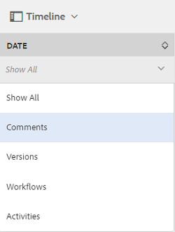

# Se mejoró la clasificación de los recursos en AEM {#enhanced-sorting-of-assets-in-aem}

Descubra cómo AEM Assets implementa la ordenación del lado del servidor para ordenar los recursos de las carpetas o una consulta de búsqueda de una sola vez en lugar de ordenarlos por lotes en el lado del cliente.

La capacidad de búsqueda de Recursos Adobe Experience Manager (AEM) se ha mejorado para ordenar de forma eficaz un gran número de recursos en las páginas de resultados de búsqueda y vista de listas de carpetas. También puede ordenar las entradas de línea de tiempo.

AEM Assets implementa la ordenación del lado del servidor para ordenar el conjunto completo de recursos (por grande que sea) dentro de una carpeta o una consulta de búsqueda a la vez, en lugar de ordenarlos por lotes en el lado del cliente. De este modo, los resultados recuperados previamente se pueden mostrar rápidamente en la interfaz de usuario, lo que hace que la operación de ordenación sea más receptiva y dinámica.

## Ordenar recursos en la vista de Lista {#sorting-assets-in-list-view}

AEM Assets permite ordenar los recursos de carpetas en función de los campos siguientes:

* Conf. regional
* Estado
* Tipo
* Tamaño
* Clasificación
* Fecha de modificación
* Fecha de publicación
* Uso
* Clics
* Impresiones
* Extraído

1. Vaya a una carpeta que contenga un gran número de recursos.
1. Toque o haga clic en el icono Diseño y vaya a la vista de lista.

   

1. Toque o haga clic en el icono Ordenar situado junto al encabezado de cualquier columna de la lista de recursos.

   

   La lista de los recursos se ordena en función de los valores de los campos.

   

>[!NOTE]
>
>Para ordenar los valores en las columnas `Name` o `Title`, superponga `/libs/dam/gui/content/commons/availablecolumns` y cambie el valor de `sortable` a `True`.

## Ordenar recursos en los resultados de búsqueda {#sorting-assets-in-search-results}

Puede ordenar los resultados de búsqueda en función de los campos siguientes:

* Título
* Estado
* Tipo
* Tamaño
* Fecha de modificación
* Fecha de publicación

1. En el cuadro OmniSearch, busque recursos en función de los criterios deseados.

   

1. Toque o haga clic en el icono Diseño y vaya a la vista de lista. Si los resultados de la búsqueda ya se muestran en la vista de lista, omita este paso.
1. Toque o haga clic en el icono Ordenar situado junto al encabezado de cualquier columna de la lista de recursos. La lista de los recursos se ordena en función de los valores de los campos.

   

## Clasificación de recursos en la línea de tiempo {#sorting-assets-in-timeline}

AEM Assets permite ordenar cronológicamente las entradas de la línea de tiempo, como anotaciones, versiones, flujos de trabajo y actividades.

1. En la interfaz de usuario de Recursos, seleccione un recurso para el que desee mostrar la línea de tiempo.
1. Toque o haga clic en el icono de GlobalNav y seleccione **[!UICONTROL Línea de tiempo]**.

   

1. En la línea de tiempo, seleccione una entrada de la lista. Por ejemplo, seleccione **[!UICONTROL Comentarios]** para mostrar la lista de anotaciones asociadas al recurso.

   

1. Toque o haga clic en el icono **[!UICONTROL Ordenar]** junto a la etiqueta **[!UICONTROL Fecha]**. Según su selección, las anotaciones se enumeran en el orden cronológico cronológico o inverso en el que se agregaron al recurso.

   

