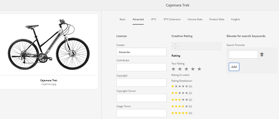

# Búsqueda de texto completo de GQL {#gql-full-text-search}

Explore la función de búsqueda de texto completo GQL en AEM Assets. Utilícelo para buscar recursos en función de metadatos específicos, como título, descripción y nombre del autor.

La función de búsqueda de texto completo de GQL permite buscar recursos en función de metadatos específicos, como título, descripción, autor, etc.

Para buscar un recurso en función de sus metadatos, por ejemplo el título, especifique la palabra clave de metadatos seguida de su valor en el panel de búsqueda. La función de búsqueda de texto completo de GQL buscará solo aquellos recursos cuyos metadatos coincidan exactamente con el valor correspondiente que introduzca.

Por ejemplo, para buscar recursos con el título &quot;Destinatario&quot;, siga estos pasos:

## Búsqueda de recursos {#searching-assets}

1. En la barra de herramientas de la interfaz de usuario Recursos, toque o haga clic en el icono **[!UICONTROL Buscar]** para mostrar el cuadro Omniture Search.

   

1. Con el cursor en el cuadro Omniture search, presione Intro.
1. Toque o haga clic en el icono de GlobalNav para mostrar el panel **[!UICONTROL Filtros]** .
1. En el cuadro Búsqueda de Omni, especifique el valor &quot;Destinatario&quot;. Para limitar la búsqueda a una carpeta específica, toque o haga clic en el icono Examinar del panel Filtros y seleccione la carpeta. En este caso, la coincidencia solo se busca dentro de la carpeta y en las subcarpetas debajo de ella.

   >[!NOTE]
   >
   >También puede realizar búsquedas de texto completo en una carpeta. En este caso, debe especificar un término de búsqueda de texto completo que no esté vacío.

   

1. Press **[!UICONTROL Enter]**. La interfaz de usuario de AEM Assets solo muestra los recursos cuyo título coincide exactamente con &quot;Destinatario&quot;.

La función de búsqueda de texto completo de GQL permite buscar recursos en función de lo siguiente:

* consulta compleja creada mediante la combinación mediante una operación Y, los valores especificados para varios campos de metadatos (propiedades)
* Varios valores para un solo campo de metadatos
* Coincidencias de subcadena

La función de búsqueda de texto completo de GQL permite buscar recursos en función de las siguientes propiedades de metadatos. Los nombres de las propiedades (por ejemplo, autor, título, etc.) y los valores distinguen entre mayúsculas y minúsculas.

>[!NOTE]
>
>La búsqueda de texto completo de GQL solo funciona para predicados de texto completo.

| Propiedad | Formato de búsqueda (valor de faceta) |
|---|---|
| [!UICONTROL Título] | title:John |
| [!UICONTROL Creador] | creador:John |
| [!UICONTROL Colaborador] | colaborador:John |
| [!UICONTROL Ubicación] | ubicación:India |
| [!UICONTROL Descripción] | description:&quot;Imagen de muestra&quot; |
| [!UICONTROL Herramienta Creador] | creatortool:&quot;Adobe Photoshop 7.0&quot; |
| [!UICONTROL Propietario del copyright] | copyrightower:&quot;Adobe Systems&quot; |
| [!UICONTROL Colaborador] | colaborador:John |
| [!UICONTROL Condiciones de uso] | usageterms:&quot;CopyRights Reserved&quot; |
| [!UICONTROL Creado] | creado:AAAA-MM-DDTHH:MM:SS.000+05:30..AAAA-MM-DDTHH:MM:SS.000+05:30 |
| [!UICONTROL Caduca la fecha] | expires:AAAA-MM-DDTHH:MM:SS.000+05:30..AAAA-MM-DDTHH:MM:SS.000+05:30 |
| [!UICONTROL A tiempo] | ontime:AAAA-MM-DDTHH:MM:SS.000+05:30..AAAA-MM-DDTHH:MM:SS.000+05:30 |
| [!UICONTROL Tiempo de inactividad] | offtime:AAAA-MM-DDTHH:MM:SS.000+05:30..AAAA-MM-DDTHH:MM:SS.000+05:30 |
| [!UICONTROL Intervalo de tiempo] (caduca dateontime, offtime) | campo faceta: límite inferior..upperbound |
| [!UICONTROL Ruta] | /content/dam/&lt;nombre de carpeta> |
| [!UICONTROL Título del PDF] | pdftitle:&quot;Documento de Adobe&quot; |
| [!UICONTROL Asunto] | asunto: &quot;Formación&quot; |
| [!UICONTROL Etiquetas] | etiquetas: &quot;Ubicación y viaje&quot; |
| [!UICONTROL Tipo] | type:&quot;image\png&quot; |
| [!UICONTROL Anchura de la imagen] | anchura:límite inferior..upperbound |
| [!UICONTROL Altura de la imagen] | altura:límite inferior..upperbound |
| [!UICONTROL Person] | persona:John |

Estos son algunos ejemplos de formatos de búsqueda para consultas complejas:

* Para mostrar todos los recursos con varios campos de facetas (por ejemplo: title=John Doe y la herramienta de creación = Adobe Photoshop):

tiltle: Herramienta de creación &quot;John Doe&quot; : Adobe&amp;ast;

* Para mostrar todos los recursos cuando el valor de facetas no es una sola palabra sino una frase (por ejemplo: title=Scott Reynolds)

título: &quot;Scott Reynolds&quot;

* Para mostrar recursos con varios valores de una sola propiedad (por ejemplo: title=Scott Reynolds o John Doe)

title:&quot;Scott Reynolds&quot; O &quot;John Doe&quot;

* Para mostrar recursos con valores de propiedad que empiecen por una cadena específica (por ejemplo: el título es Scott Reynolds)

title:&quot;Scott&quot;

* Para mostrar recursos con valores de propiedad que finalizan con una cadena específica (por ejemplo: el título es Scott Reynolds)

title:&quot;Reynolds&quot;

* Para mostrar recursos con un valor de propiedad que contenga una cadena específica (por ejemplo: título = Sala de reuniones de Basilea)

title:&quot;Reunión&quot;;

* Para mostrar los recursos que contienen una cadena concreta y tienen un valor de propiedad específico (por ejemplo: buscar Adobe de cadena en recursos con título=John Doe)

&amp;ast;Adobe&amp;ast; title:&quot;John Doe &quot;OR title:&quot;John Doe&quot; &amp;ast;Adobe&amp;ast;

>[!NOTE]
>
>Las propiedades path, limit, size y order by no se pueden ordenar con ninguna otra propiedad.
>
>La palabra clave para una propiedad generada por el usuario es su etiqueta de campo en el editor de propiedades en minúsculas, con espacios eliminados.

>[!NOTE]
>
>Si escribe una consulta JCR para buscar solo subrecursos, también se muestran los recursos a los que se hace referencia coincidentes junto con los subrecursos coincidentes.

La búsqueda de texto completo también admite operadores como -, ^, etc. Para buscar estas letras como literales de cadena, encierre la expresión de búsqueda entre comillas de doble. Por ejemplo, utilice &quot;Portátil - Belleza&quot; en lugar de Portátil - Belleza.

## Ampliación de la búsqueda {#boosting-search}

Puede mejorar la relevancia de las palabras clave para los recursos en particular a fin de mejorar las búsquedas basadas en las palabras clave. En otras palabras, las imágenes para las que promociona palabras clave específicas aparecen en la parte superior de los resultados de búsqueda cuando realiza una búsqueda en base a estas palabras clave.

1. En la interfaz de usuario de Recursos, abra la página de propiedades del recurso para el que desea promocionar una palabra clave.
1. Cambie a la ficha **[!UICONTROL Avanzadas]** y toque o haga clic en **[!UICONTROL Añadir]** en **[!UICONTROL Elevar para palabras clave]** de búsqueda.

   

1. En el cuadro **[!UICONTROL Buscar promoción]** , especifique una palabra clave para la que desee aumentar la búsqueda de la imagen y, a continuación, toque o haga clic en **[!UICONTROL Añadir]**. En caso necesario, especifique varias palabras clave de la misma manera.

   

1. Click/tap **[!UICONTROL Save &amp; Close]**.
1. Busque la palabra clave utilizando el cuadro Omniture. El recurso para el que promocionó esta palabra clave aparece entre los resultados de búsqueda más importantes.