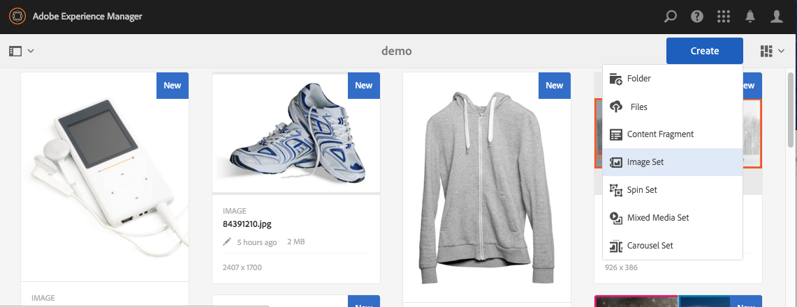

# Conjuntos de imágenes {#image-sets}

Los conjuntos de imágenes proporcionan a los usuarios una experiencia de visualización integrada, en la que pueden ver distintas vistas de un elemento haciendo clic en una imagen en miniatura. Los conjuntos de imágenes permiten presentar vistas alternativas de un elemento y las herramientas de zoom de las ofertas del visor permiten examinar las imágenes con mayor detenimiento.

Image Sets are designated by a banner with the word **[!UICONTROL IMAGESET]**. Además, si se publica el conjunto de imágenes, se muestra la fecha de publicación, indicada por el icono **[!UICONTROL Mundo]**, junto con la fecha de la última modificación, indicada por el icono **[!UICONTROL Lápiz]**.

Dentro del conjunto de imágenes, también puede crear muestras creando un conjunto de imágenes y agregando miniaturas.

Esta aplicación resulta especialmente útil para cuando desea mostrar un elemento con un color, un motivo o un acabado diferentes. Para crear un conjunto de imágenes con muestras de color, necesita una imagen para cada color, motivo o acabado diferente que desee presentar a los usuarios. También necesita una muestra de color, motivo o acabado para cada color, motivo o acabado.

Por ejemplo, supongamos que desea presentar imágenes de gorras con diferentes listas de colores; las facturas son rojas, verdes y azules. En este caso, se necesitan tres tomas de la misma tapa. Se necesita un tiro con un rojo, uno con un verde y otro con un billete azul. También necesita una muestra de color rojo, verde y azul. Las muestras de color sirven como miniaturas en las que los usuarios hacen clic en el visor de conjuntos de muestras para ver el gorro de facturación roja, verde o azul.

>[!NOTE]
>
>Para obtener información sobre la interfaz de usuario de Recursos, consulte [Gestión de recursos con la IU](managing-assets-touch-ui.md)táctil.

## Inicio rápido: Conjuntos de imágenes {#quick-start-image-sets}

Para ayudarle a ponerse en marcha rápidamente:

1. [Cargue las imágenes principales para varias vistas.](#uploading-assets-in-image-sets)

   Inicio cargando las imágenes para los conjuntos de imágenes. Dado que los usuarios pueden aplicar zoom a las imágenes en el visor de conjuntos de imágenes, tenga en cuenta el zoom al elegir las imágenes. Asegúrese de que las imágenes tengan al menos 2000 píxeles en la dimensión más grande para obtener un detalle de zoom óptimo. Dynamic Media puede procesar imágenes de hasta 25 megapíxeles cada una. Por ejemplo, puede usar una imagen de 5000 x 5000 megapíxeles o cualquier otra combinación de tamaño de hasta 25 megapíxeles.

   AEM Assets admite muchos formatos de archivo de imagen, pero se recomiendan las imágenes TIFF, PNG y EPS sin pérdida.

1. [Crear conjuntos de imágenes.](#creating-image-sets)

   En los conjuntos de imágenes, los usuarios hacen clic en las imágenes en miniatura en el visor de conjuntos de imágenes.

   Para crear un conjunto de imágenes en Recursos, toque **[!UICONTROL Crear > Conjuntos]** de imágenes. A continuación, agregue imágenes y toque **[!UICONTROL Guardar]**.

   You can also create image sets automatically through [batch set presets](/help/assets/config-dms7.md#creating-batch-set-presets-to-auto-generate-image-sets-and-spin-sets).

   **Importante** : Los conjuntos de lotes son creados por IPS (Image Production System) como parte de la ingesta de recursos y solo están disponibles en el modo Dynamic Media - Scene7.

   Consulte [Preparación de recursos de conjuntos de imágenes para cargar y Carga de archivos](#uploading-assets-in-image-sets).

   See [Working with Selectors.](working-with-selectors.md)

1. Añada los ajustes preestablecidos [del visor de conjuntos de](managing-viewer-presets.md)imágenes según sea necesario.

   Administrators can create or modify Image **[!UICONTROL Set Viewer Presets]**. To see your image set with a viewer preset, select the image set, and in the left-rail drop-down menu, select **[!UICONTROL Viewers]**.

   Consulte **[!UICONTROL Herramientas > Recursos > Ajustes preestablecidos]** de visor para crear o editar ajustes preestablecidos de visor.

1. (Opcional) [Visualización de conjuntos](image-sets.md#viewing-image-sets) de imágenes creados mediante ajustes preestablecidos de conjunto por lotes.
1. [Conjuntos de imágenes de Previsualización.](previewing-assets.md)

   Seleccione el conjunto de imágenes y puede previsualización. Toque los iconos en miniatura para examinar el conjunto de imágenes en el visor seleccionado. Puede elegir diferentes visores en el menú **[!UICONTROL Visores]** , disponible en el menú desplegable del carril izquierdo.

1. [Publicar conjuntos de imágenes.](publishing-dynamicmedia-assets.md)

   Al publicar un conjunto de imágenes, se activa la URL y la cadena Incrustar. Además, debe [publicar cualquier ajuste preestablecido](managing-viewer-presets.md) de visor personalizado que haya creado. Los ajustes preestablecidos de visor predeterminados ya están publicados.

1. [Vincule las direcciones URL a la Aplicación web](linking-urls-to-yourwebapplication.md) o [incruste el visor](embed-code.md)de vídeo o de imágenes.

   AEM Assets crea llamadas mediante URL para conjuntos de imágenes y los activa después de publicar los conjuntos de imágenes. Puede copiar estas direcciones URL cuando previsualización recursos. Como alternativa, puede incrustarlos en su sitio Web.

   Seleccione el conjunto de imágenes y, a continuación, en el menú desplegable del carril izquierdo, seleccione **[!UICONTROL Visualizadores]**.

   Consulte [Vinculación de un conjunto de imágenes a una página web](linking-urls-to-yourwebapplication.md) e [Incrustación del visualizador de imágenes o vídeos](embed-code.md).

Para editar conjuntos de imágenes, consulte [Edición de conjuntos de imágenes.](#editing-image-sets) Además, puede realizar vistas y editar las propiedades [del conjunto](managing-assets-touch-ui.md#editing-properties)de imágenes.

Si tiene problemas al crear conjuntos, consulte Imágenes y conjuntos en [Resolución de problemas de medios dinámicos: modo](troubleshoot-dms7.md#images-and-sets)Scene7.

## Carga de recursos en conjuntos de imágenes {#uploading-assets-in-image-sets}

Inicio cargando las imágenes para los conjuntos de imágenes. Dado que los usuarios pueden aplicar zoom a las imágenes en el visor de conjuntos de imágenes, tenga en cuenta el zoom al elegir las imágenes. Compruebe que las imágenes tengan al menos 2000 píxeles en la dimensión más grande. Los conjuntos de imágenes admiten muchos formatos de archivo de imagen, pero se recomiendan las imágenes TIFF, PNG y EPS sin pérdida.

Puede cargar imágenes para los conjuntos de imágenes como lo haría con cualquier otro [recurso en Recursos](managing-assets-touch-ui.md#uploading-assets).

### Preparación de recursos de conjuntos de imágenes para la carga {#preparing-image-set-assets-for-upload}

Antes de crear conjuntos de imágenes, asegúrese de que las imágenes tienen el tamaño y el formato adecuados.

Para crear un conjunto de imágenes de varias vistas, necesita imágenes que muestren un elemento de diferentes puntos de vista o que muestren diferentes aspectos del mismo elemento. El objetivo es resaltar las características importantes de un elemento para que los usuarios tengan una imagen completa de su aspecto o funcionamiento.

Dado que los usuarios pueden aplicar zoom a las imágenes en los conjuntos de imágenes, asegúrese de que las imágenes tengan al menos 2000 píxeles en la dimensión más grande. Assets admite muchos formatos de archivo de imagen, pero se recomiendan las imágenes TIFF, PNG y EPS sin pérdida.

>[!NOTE]
>
>Además, si utiliza miniaturas para indicar muestras de productos, debe hacer lo siguiente:
>
>Necesita viñetas o tomas diferentes de la misma imagen que la muestren en colores, patrones o acabados diferentes. También necesita archivos de miniaturas que se correspondan con los diferentes colores, patrones o acabados. Por ejemplo, para presentar miniaturas con un conjunto de imágenes que muestre la misma chaqueta en negro, marrón y verde, necesitará:
>
>* Toma negra, marrón y verde de la misma chaqueta.
>* Miniatura de color negro, marrón y verde.

>

## Creación de conjuntos de imágenes {#creating-image-sets}

Puede crear conjuntos de imágenes a través de la interfaz de usuario o mediante la API. En esta sección se describe cómo crear conjuntos de imágenes en la interfaz de usuario.

>[!NOTE]
>
>You can also create image sets automatically through [batch set presets](/help/assets/config-dms7.md#creating-batch-set-presets-to-auto-generate-image-sets-and-spin-sets).

**Importante:** Los conjuntos de lotes son creados por IPS (Image Production System) como parte de la ingesta de recursos y solo están disponibles en el modo Dynamic Media - Scene7.

Cuando se agregan recursos al conjunto, se añaden automáticamente en orden alfanumérico. Puede volver a ordenar o ordenar manualmente los recursos después de agregarlos.

>[!NOTE]
>
>Los conjuntos de imágenes no son compatibles con los recursos con `,` (coma) en el nombre del archivo.

**Para crear un conjunto** de imágenes:

1. In **Assets**, navigate to where you want to create an image set, tap **[!UICONTROL Create]**, and select **[!UICONTROL Image Set]**. También puede crear el conjunto desde una carpeta que contenga los recursos.

   

1. En la página Editor de conjuntos de imágenes, en el campo **[!UICONTROL Título]** , introduzca un nombre para el conjunto de imágenes. El nombre aparece en la pancarta del conjunto de imágenes. De forma opcional, introduzca una descripción.

   

   >[!NOTE]
   >
   >Al crear el conjunto de imágenes, puede cambiar la miniatura del conjunto de imágenes o permitir que AEM seleccione la miniatura automáticamente en función de los recursos del conjunto de imágenes. Para seleccionar una miniatura, toque **[!UICONTROL Cambiar miniatura]** y seleccione cualquier imagen (también puede desplazarse a otras carpetas para buscar imágenes). Si ha seleccionado una miniatura y, a continuación, decide que sea AEM quien genere una del conjunto de imágenes, seleccione **[!UICONTROL Cambiar a Miniatura automática]**.

1. Realice una de las siguientes acciones:

   * Cerca de la esquina superior izquierda de la página Editor **[!UICONTROL de conjuntos de]** imágenes, toque **[!UICONTROL Añadir recurso]**.
   * Cerca del centro de la página Editor **[!UICONTROL de conjuntos de]** imágenes, toque **[!UICONTROL Tocar para abrir el Selector]** de recursos.

   Toque para seleccionar los recursos que desea incluir en el conjunto de imágenes. Los recursos seleccionados tienen un icono de marca de verificación sobre ellos. When you are finished, near the upper-right corner of the page, tap **[!UICONTROL Select]**.

   Con el Selector de recursos, puede buscar recursos escribiendo una palabra clave y pulsando **[!UICONTROL Retorno]**. También puede aplicar filtros para restringir los resultados de búsqueda. Puede filtrar por ruta, colección, tipo de archivo y etiqueta. Seleccione el filtro y, a continuación, pulse el icono **[!UICONTROL Filtro]** en la barra de herramientas. Change the view by tapping the **[!UICONTROL View]** icon and selecting **[!UICONTROL Column View]**, **[!UICONTROL Card View]**, or **[!UICONTROL List View]**.

   See [Working with Selectors.](working-with-selectors.md)

   

1. Cuando se agregan recursos al conjunto, se añaden automáticamente en orden alfanumérico. Después de agregarlos, puede reordenar o ordenar manualmente los recursos.

   Si es necesario, arrastre el icono **[!UICONTROL Reordenar]** de un recurso a la derecha del nombre de archivo del recurso para reordenar las imágenes hacia arriba o hacia abajo en la lista establecida.

   

   If you want to change a thumbnail or swatch, tap the **[!UICONTROL Thumbnail]** icon next to the image and navigate to the thumbnail or swatch you want. When done selecting all the images tap **[!UICONTROL Save]**.

1. (Opcional) Realice cualquiera de las siguientes acciones:

   * Para eliminar una imagen, selecciónela y toque **[!UICONTROL Eliminar recurso]**.
   * To apply a preset, near the upper-right corner of the page, tap **[!UICONTROL Preset]**, then select a preset to apply to all the assets at once.

1. Toque **[!UICONTROL Guardar]**. El conjunto de imágenes recién creado aparece en la carpeta en la que lo creó.

## Visualización de conjuntos de imágenes {#viewing-image-sets}

Puede crear conjuntos de imágenes en la interfaz de usuario o automáticamente mediante ajustes preestablecidos [de conjunto de](/help/assets/config-dms7.md#creating-batch-set-presets-to-auto-generate-image-sets-and-spin-sets)lotes.

**Importante** : Los conjuntos de lotes son creados por IPS [Image Production System] como parte de la ingesta de recursos y solo están disponibles en Dynamic Media (modo Scene7).

Sin embargo, los conjuntos creados con ajustes preestablecidos de conjunto de lotes *no aparecen* en la interfaz de usuario. Puede realizar la vista de estos conjuntos de tres formas diferentes. (Estos métodos están disponibles aunque haya creado los conjuntos de imágenes en la interfaz de usuario).

* Al abrir las propiedades de un recurso individual. Las propiedades indican los conjuntos de los que es miembro el recurso seleccionado (en **[!UICONTROL Miembro de conjuntos]**). Toque el nombre del conjunto para ver el conjunto completo.

   

* Desde una imagen de miembro de cualquier conjunto. Select the **[!UICONTROL Sets]** menu to display the sets that the asset is a member of.

   

* From search, you can select **[!UICONTROL Filters]**, then expand **[!UICONTROL Dynamic Media]** and select **[!UICONTROL Sets]**.

   La búsqueda devuelve conjuntos coincidentes creados manualmente en la interfaz de usuario o creados automáticamente mediante ajustes preestablecidos de conjunto por lotes. Para los conjuntos automatizados, la consulta de búsqueda se lleva a cabo utilizando criterios de búsqueda &quot;Inicios con&quot; que son diferentes de AEM búsqueda basada en el uso de criterios de búsqueda &quot;Contiene&quot;. Definir el filtro en **[!UICONTROL Conjuntos]** es la única manera de buscar conjuntos automatizados.

   

>[!NOTE]
>
>Los conjuntos de vistas se pueden realizar mediante la interfaz de usuario, tal como se describe en [Edición de conjuntos](#editing-image-sets)de imágenes.

## Edición de conjuntos de imágenes {#editing-image-sets}

Puede realizar varias tareas de edición en los conjuntos de imágenes, como las siguientes:

* Añada imágenes al conjunto de imágenes.
* Vuelva a ordenar las imágenes en el conjunto de imágenes.
* Elimine recursos del conjunto de imágenes.
* Aplicación de ajustes preestablecidos de visor.
* Elimine el conjunto de imágenes.

**Para editar conjuntos** de imágenes:

1. Realice una de las siguientes acciones:

   * Pase el ratón sobre un recurso de conjunto de imágenes y, a continuación, toque **[!UICONTROL Editar]** (icono de lápiz).
   * Pase el ratón sobre un recurso de conjunto de imágenes, toque **[!UICONTROL Seleccionar]** (icono de marca de verificación) y, a continuación, toque **[!UICONTROL Editar]** en la barra de herramientas.
   * Toque en un recurso de conjunto de imágenes y, a continuación, toque **[!UICONTROL Editar]** (icono de lápiz) en la barra de herramientas.

1. Para editar las imágenes en el conjunto de imágenes, realice una de las siguientes acciones:

   * Para reordenar recursos, arrastre una imagen a una nueva ubicación (seleccione el icono de reordenar para mover elementos).
   * Para ordenar los elementos en orden ascendente o descendente, toque el encabezado de la columna.
   * Para agregar un recurso o actualizar un recurso existente, toque **[!UICONTROL Añadir recurso]**. Vaya a un recurso, selecciónelo y, a continuación, toque **[!UICONTROL Seleccionar]** cerca de la esquina superior derecha de la página.

   >[!NOTE]
   >Si elimina la imagen que AEM utiliza para la miniatura reemplazándola por otra imagen, el recurso original seguirá mostrándose.

   * Para eliminar un recurso, selecciónelo y, a continuación, toque **[!UICONTROL Eliminar recurso]**.
   * To apply a preset, near the upper-right corner of the page, tap **[!UICONTROL Preset]**, then select a viewer preset.
   * Para añadir o cambiar una miniatura, seleccione el icono de miniatura situado junto a la derecha del recurso. Vaya al nuevo recurso de miniatura o muestra, selecciónelo y toque **[!UICONTROL Seleccionar]**.
   * Para eliminar un conjunto de imágenes completo, desplácese hasta el conjunto de imágenes, selecciónelo y toque **[!UICONTROL Eliminar]**.

   >[!NOTE]
   >
   >Para editar las imágenes de un conjunto de imágenes, vaya al conjunto, pulse **[!UICONTROL Establecer miembros]** en el carril izquierdo y, a continuación, seleccione el icono Lápiz en un recurso individual para abrir la ventana de edición.****

1. Toque **[!UICONTROL Guardar]** cuando haya terminado de editar.

## Vista previa de conjuntos de imágenes {#previewing-image-sets}

Consulte [Vista previa de recursos](previewing-assets.md).

## Publicación de conjuntos de imágenes {#publishing-image-sets}

Consulte [Publicación de recursos](publishing-dynamicmedia-assets.md).
