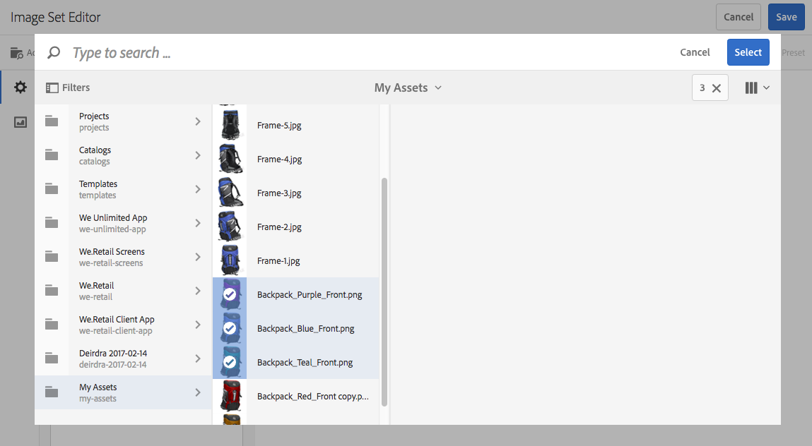

# Conjuntos de imágenes {#image-sets}

Los conjuntos de imágenes proporcionan a los usuarios una experiencia de visualización integrada, en la que los usuarios pueden ver distintas vistas de un elemento haciendo clic en una imagen en miniatura. Los conjuntos de imágenes permiten presentar vistas alternativas de un elemento y el visor ofrece herramientas de zoom para examinar las imágenes con mayor detenimiento.

Los conjuntos de imágenes se designan mediante un banner con la palabra **[!UICONTROL IMAGESET]**. Además, si se publica el conjunto de imágenes, se muestra la fecha de publicación, indicada por el icono **[!UICONTROL Mundo]**, junto con la fecha de la última modificación, indicada por el icono **[!UICONTROL Lápiz]**.

Dentro del conjunto de imágenes, también puede crear muestras creando un conjunto de imágenes y agregando miniaturas.

Esta aplicación es especialmente útil para cuando desea mostrar un elemento en un color, patrón o acabado diferentes. Para crear un conjunto de imágenes con muestras de color, necesita una imagen para cada color, patrón o acabado diferente que desee presentar a los usuarios. También necesita una muestra de color, patrón o fin para cada color, patrón o acabado.

Por ejemplo, supongamos que desea presentar imágenes de mayúsculas con diferentes listas de colores; los billetes son rojo, verde y azul. En este caso, se necesitan tres tomas de la misma tapa. Necesitas un tiro con un rojo, uno con un verde y otro con un billete azul. También necesita una muestra de color rojo, verde y azul. Las muestras de color sirven como miniaturas en las que los usuarios hacen clic en el Visor de conjuntos de muestras para ver el gorro de facturación roja, verde o azul.

>[!NOTE]
>
>Para obtener información sobre la interfaz de usuario de Assets, consulte [Administración de recursos con la interfaz de usuario táctil](managing-assets-touch-ui.md).

Al crear un conjunto de imágenes, Adobe recomienda las siguientes prácticas recomendadas y aplica los límites siguientes:

| Recurso: tipo de límite | Práctica recomendada | Límite implementado | Cambios en el límite 31 de diciembre de 2022 |
| --- | --- | --- | --- |
| **Conjunto de imágenes** - Número de activos duplicados por conjunto | Sin duplicados | 100 | 20 |
| **Conjunto de imágenes** - Número máximo de imágenes por conjunto | 5 a 10 imágenes por conjunto | 1000 |

Consulte también [Limitaciones de Dynamic Media](/help/assets/limitations.md).

## Inicio rápido: Conjuntos de imágenes {#quick-start-image-sets}

Para ponerle en marcha rápidamente:

1. [Cargue las imágenes principales para varias vistas.](#uploading-assets-in-image-sets)

   Comience por cargar las imágenes de los conjuntos de imágenes. Dado que los usuarios pueden hacer zoom en las imágenes en el visualizador de conjuntos de imágenes, tenga en cuenta el zoom al elegir las imágenes. Asegúrese de que las imágenes tengan al menos 2000 píxeles en la dimensión más grande para obtener un detalle de zoom óptimo. Dynamic Media puede procesar imágenes de hasta 25 megapíxeles cada una. Por ejemplo, puede utilizar una imagen de 5000 x 5000 megapíxeles o cualquier otra combinación de tamaño de hasta 25 megapíxeles.

   AEM Assets admite muchos formatos de archivo de imagen, pero se recomiendan las imágenes TIFF, PNG y EPS sin pérdida.

1. [Crear conjuntos de imágenes.](#creating-image-sets)

   En los conjuntos de imágenes, los usuarios hacen clic en las imágenes en miniatura en el visor de conjuntos de imágenes.

   Para crear un conjunto de imágenes en Assets, pulse **[!UICONTROL Crear > Conjuntos de imágenes]**. A continuación, añada imágenes y toque **[!UICONTROL Guardar]**.

   También puede crear conjuntos de imágenes automáticamente mediante [ajustes preestablecidos de conjuntos de lotes](/help/assets/config-dms7.md#creating-batch-set-presets-to-auto-generate-image-sets-and-spin-sets).

   **Importante** — IPS (Image Production System) crea los conjuntos de lotes como parte de la ingesta de recursos y solo están disponibles en el modo Dynamic Media - Scene7.

   Consulte [Preparación de recursos de conjuntos de imágenes para cargarlos y carga de archivos](#uploading-assets-in-image-sets).

   Consulte [Uso de selectores.](working-with-selectors.md)

1. Agregar [Ajustes preestablecidos del visualizador de conjuntos de imágenes](managing-viewer-presets.md), según sea necesario.

   Los administradores pueden crear o modificar imágenes **[!UICONTROL Definir ajustes preestablecidos de visor]**. Para ver el conjunto de imágenes con un ajuste preestablecido de visualizador, seleccione el conjunto de imágenes y, en el menú desplegable del carril izquierdo, seleccione **[!UICONTROL Visualizadores]**.

   Consulte **[!UICONTROL Herramientas > Assets > Ajustes preestablecidos de visor]** para crear o editar ajustes preestablecidos de visualizador.

1. (Opcional) [Visualización de conjuntos de imágenes](image-sets.md#viewing-image-sets) que se crearon mediante ajustes preestablecidos de conjuntos de lotes.
1. [Vista previa de conjuntos de imágenes.](previewing-assets.md)

   Seleccione el conjunto de imágenes y podrá previsualizarlo. Pulse los iconos en miniatura para examinar el conjunto de imágenes en el visor seleccionado. Puede elegir diferentes visualizadores del **[!UICONTROL Visualizadores]** , disponible en el menú desplegable del carril izquierdo.

1. [Publicar conjuntos de imágenes.](publishing-dynamicmedia-assets.md)

   Al publicar un conjunto de imágenes, se activa la dirección URL y la cadena de incrustación. Además, debe [publicar cualquier ajuste preestablecido de visor personalizado](managing-viewer-presets.md) que haya creado. Ya se han publicado los ajustes preestablecidos del visor integrado.

1. [Vincular URL a la aplicación web](linking-urls-to-yourwebapplication.md) o [Incrustar el visualizador de imágenes o vídeos](embed-code.md).

   AEM Assets crea llamadas de URL para conjuntos de imágenes y los activa después de publicar los conjuntos de imágenes. Puede copiar estas direcciones URL cuando obtiene una vista previa de los recursos. También puede incrustarlos en el sitio web.

   Seleccione el conjunto de imágenes y, a continuación, en el menú desplegable del carril izquierdo, seleccione **[!UICONTROL Visualizadores]**.

   Consulte [Vinculación de un conjunto de imágenes a una página web](linking-urls-to-yourwebapplication.md) e [Incrustación del visualizador de imágenes o vídeos](embed-code.md).

Para editar los conjuntos de imágenes, consulte [editar conjuntos de imágenes.](#editing-image-sets) Además, puede ver y editar [Propiedades del conjunto de imágenes](managing-assets-touch-ui.md#editing-properties).

Si tiene problemas para crear conjuntos, consulte Imágenes y conjuntos en [Solución de problemas de Dynamic Media: modo Scene7](troubleshoot-dms7.md#images-and-sets).

## Carga de recursos en conjuntos de imágenes {#uploading-assets-in-image-sets}

Comience por cargar las imágenes de los conjuntos de imágenes. Dado que los usuarios pueden hacer zoom en las imágenes en el visualizador de conjuntos de imágenes, tenga en cuenta el zoom al elegir las imágenes. Compruebe que las imágenes tengan al menos 2000 píxeles en la dimensión más grande. Los conjuntos de imágenes admiten muchos formatos de archivo de imagen, pero se recomiendan las imágenes TIFF, PNG y EPS sin pérdida.

Puede cargar imágenes para conjuntos de imágenes del modo que lo haría [cargar cualquier otro recurso en Assets](managing-assets-touch-ui.md#uploading-assets).

### Preparación de recursos de conjuntos de imágenes para la carga {#preparing-image-set-assets-for-upload}

Antes de crear conjuntos de imágenes, asegúrese de que las imágenes tengan el tamaño y el formato adecuados.

Para crear un conjunto de imágenes de varias vistas, necesita imágenes que muestren un elemento desde diferentes puntos de vista o que muestren diferentes aspectos del mismo elemento. El objetivo es resaltar las características importantes de un elemento para que los espectadores tengan una imagen completa de cómo se ve o hace.

Dado que los usuarios pueden hacer zoom en las imágenes en los conjuntos de imágenes, asegúrese de que las imágenes tengan al menos 2000 píxeles en la dimensión más grande. Assets admite muchos formatos de archivo de imagen, pero se recomiendan las imágenes sin pérdida de TIFF, PNG y EPS.

>[!NOTE]
>
>Además, si está utilizando miniaturas para indicar muestras de productos, debe hacer lo siguiente:
>
>Se necesitan viñetas o tomas diferentes de la misma imagen que se muestre en colores, patrones o acabados diferentes. También necesita archivos en miniatura que correspondan a los diferentes colores, patrones o acabados. Por ejemplo, para presentar miniaturas con un conjunto de imágenes que muestre la misma chaqueta en negro, marrón y verde, necesitará:
>
>* Un tiro negro, marrón y verde de la misma chaqueta.
>* Miniatura de color negro, marrón y verde.
>

## Creación de conjuntos de imágenes {#creating-image-sets}

Puede crear conjuntos de imágenes a través de la interfaz de usuario o mediante la API. En esta sección se describe cómo crear conjuntos de imágenes en la interfaz de usuario.

>[!NOTE]
>
>También puede crear conjuntos de imágenes automáticamente mediante [ajustes preestablecidos de conjuntos de lotes](/help/assets/config-dms7.md#creating-batch-set-presets-to-auto-generate-image-sets-and-spin-sets).

**Importante:** IPS (Image Production System) crea los conjuntos de lotes como parte de la ingesta de recursos y solo están disponibles en el modo Dynamic Media - Scene7.

Cuando se añaden recursos al conjunto, estos se añaden automáticamente en orden alfanumérico. Puede volver a ordenar u ordenar manualmente los recursos una vez añadidos.

>[!NOTE]
>
>Los conjuntos de imágenes no son compatibles con los recursos con `,` (coma) en el nombre del archivo.

Al crear un conjunto de imágenes, Adobe recomienda las siguientes prácticas recomendadas y aplica los límites siguientes:

| Recurso: tipo de límite | Práctica recomendada | Límite implementado | Cambios en el límite 31 de diciembre de 2022 |
| --- | --- | --- | --- |
| **Conjunto de imágenes** - Número de activos duplicados por conjunto | Sin duplicados | 100 | 20 |
| **Conjunto de imágenes** - Número máximo de imágenes por conjunto | 5 a 10 imágenes por conjunto | 1000 |

Consulte también [Limitaciones de Dynamic Media](/help/assets/limitations.md).

**Para crear un conjunto de imágenes**:

1. En **Recursos**, navegue hasta donde desee crear un conjunto de imágenes, pulse **[!UICONTROL Crear]** y seleccione **[!UICONTROL Conjunto de imágenes]**. También puede crear el conjunto desde una carpeta que contenga los recursos.

   

1. En la página Editor de conjuntos de imágenes, en la sección **[!UICONTROL Título]** , introduzca un nombre para el conjunto de imágenes. El nombre aparece en el banner del conjunto de imágenes. De forma opcional, introduzca una descripción.

   

   >[!NOTE]
   >
   >Al crear el conjunto de imágenes, puede cambiar la miniatura del conjunto de imágenes o permitir que AEM seleccione la miniatura automáticamente en función de los recursos del conjunto de imágenes. Para seleccionar una miniatura, pulse **[!UICONTROL Cambiar miniatura]** y seleccione cualquier imagen (puede navegar también a otras carpetas para buscar imágenes). Si ha seleccionado una miniatura y, a continuación, decide que sea AEM quien genere una del conjunto de imágenes, seleccione **[!UICONTROL Cambiar a Miniatura automática]**.

1. Realice una de las siguientes acciones:

   * Cerca de la esquina superior izquierda del **[!UICONTROL Editor de conjuntos de imágenes]** página, toque **[!UICONTROL Agregar recurso]**.
   * Cerca de la mitad del **[!UICONTROL Editor de conjuntos de imágenes]** página, toque **[!UICONTROL Toque para abrir el Selector de recursos]**.

   Toque para seleccionar los recursos que desea incluir en el conjunto de imágenes. Los recursos seleccionados tienen un icono de marca de verificación sobre ellos. Cuando haya terminado, pulse en , cerca de la esquina superior derecha de la página **[!UICONTROL Select]**.

   Con el Selector de recursos, puede buscar recursos escribiendo una palabra clave y pulsando **[!UICONTROL Retorno]**. También puede aplicar filtros para restringir los resultados de búsqueda. Puede filtrar por ruta, colección, tipo de archivo y etiqueta. Seleccione el filtro y, a continuación, pulse el icono **[!UICONTROL Filtro]** en la barra de herramientas. Para cambiar la vista, pulse el botón **[!UICONTROL Ver]** icono y seleccionar **[!UICONTROL Vista de columna]**, **[!UICONTROL Vista de tarjeta]** o **[!UICONTROL Vista de lista]**.

   Consulte [Uso de selectores.](working-with-selectors.md)

   

1. Cuando se añaden recursos al conjunto, estos se añaden automáticamente en orden alfanumérico. Después de agregarlos, puede volver a ordenar u ordenar los recursos manualmente.

   Si es necesario, arrastre el **[!UICONTROL Reordenar]** a la derecha del nombre del archivo del recurso para reordenar las imágenes hacia arriba o hacia abajo en la lista de conjunto.

   

   Si desea cambiar una miniatura o muestra, toque la variable **[!UICONTROL Miniatura]** junto a la imagen y vaya a la miniatura o muestra que desee. Cuando termine de seleccionar todas las imágenes, toque **[!UICONTROL Guardar]**.

1. (Opcional) Realice cualquiera de las siguientes acciones:

   * Para eliminar una imagen, selecciónela y, a continuación, pulse **[!UICONTROL Eliminar recurso]**.
   * Para aplicar un ajuste preestablecido, cerca de la esquina superior derecha de la página, pulse **[!UICONTROL Ajuste preestablecido]** y, a continuación, seleccione un ajuste preestablecido para aplicarlo a todos los recursos a la vez.

1. Toque **[!UICONTROL Guardar]**. El conjunto de imágenes recién creado aparece en la carpeta en la que lo creó.

## Visualización de conjuntos de imágenes {#viewing-image-sets}

Puede crear conjuntos de imágenes en la interfaz de usuario o automáticamente mediante [ajustes preestablecidos de conjuntos de lotes](/help/assets/config-dms7.md#creating-batch-set-presets-to-auto-generate-image-sets-and-spin-sets).

**Importante** — IPS crea los conjuntos de lotes [Sistema de producción de imágenes] como parte de la ingesta de recursos y solo están disponibles en el modo Dynamic Media - Scene7).

Sin embargo, los conjuntos creados con ajustes preestablecidos de conjuntos de lotes, *not* aparece en la interfaz de usuario. Puede ver estos conjuntos de tres formas diferentes. (Estos métodos están disponibles aunque haya creado los conjuntos de imágenes en la interfaz de usuario).

* Al abrir las propiedades de un recurso individual. Las propiedades indican los conjuntos de los que es miembro el recurso seleccionado (en **[!UICONTROL Miembro de conjuntos]**). Pulse el nombre del conjunto para ver todo el conjunto.

   

* Desde una imagen de miembro de cualquier conjunto. Seleccione el **[!UICONTROL Conjuntos]** para mostrar los conjuntos de los que es miembro el recurso.

   

* Desde la búsqueda, puede seleccionar **[!UICONTROL Filtros]** y, a continuación, expanda **[!UICONTROL Dynamic Media]** y seleccione **[!UICONTROL Conjuntos]**.

   La búsqueda devuelve conjuntos coincidentes creados manualmente en la interfaz de usuario o creados automáticamente mediante ajustes preestablecidos de conjuntos de lotes. Para los conjuntos automatizados, la consulta de búsqueda se realiza utilizando criterios de búsqueda &quot;Comienza con&quot; que son diferentes de AEM búsqueda que se basa en el uso de criterios de búsqueda &quot;Contiene&quot;. Configuración del filtro en **[!UICONTROL Conjuntos]** es la única forma de buscar conjuntos automatizados.

   

>[!NOTE]
>
>Puede ver los conjuntos mediante la interfaz de usuario, tal como se describe en [Edición de conjuntos de imágenes](#editing-image-sets).

## Edición de conjuntos de imágenes {#editing-image-sets}

Puede realizar diversas tareas de edición en conjuntos de imágenes, como las siguientes:

* Agregue imágenes al conjunto de imágenes.
* Vuelva a ordenar las imágenes en el conjunto de imágenes.
* Eliminar recursos del conjunto de imágenes.
* Aplicar ajustes preestablecidos de visor.
* Eliminar el conjunto de imágenes.

**Para editar conjuntos de imágenes**:

1. Realice una de las siguientes acciones:

   * Pase el ratón sobre un recurso de conjunto de imágenes y, a continuación, pulse **[!UICONTROL Editar]** (icono de lápiz).
   * Pase el ratón sobre un recurso de conjunto de imágenes y pulse **[!UICONTROL Select]** (icono de marca de verificación) y, a continuación, pulse **[!UICONTROL Editar]** en la barra de herramientas.
   * Pulse en un recurso de conjunto de imágenes y, a continuación, pulse **[!UICONTROL Editar]** (icono de lápiz) en la barra de herramientas.

1. Para editar las imágenes del conjunto de imágenes, realice una de las acciones siguientes:

   * Para reordenar los recursos, arrastre una imagen a una nueva ubicación (seleccione el icono de reordenar para mover elementos).
   * Para ordenar los elementos en orden ascendente o descendente, pulse el encabezado de la columna.
   * Para añadir un recurso o actualizar un recurso existente, pulse el botón **[!UICONTROL Agregar recurso]**. Vaya a un recurso, selecciónelo y pulse **[!UICONTROL Select]** cerca de la esquina superior derecha de la página.

   >[!NOTE]
   >Si elimina la imagen que AEM usa para la miniatura reemplazándola por otra imagen, el recurso original seguirá apareciendo.

   * Para eliminar un recurso, selecciónelo y pulse **[!UICONTROL Eliminar recurso]**.
   * Para aplicar un ajuste preestablecido, cerca de la esquina superior derecha de la página, pulse **[!UICONTROL Ajuste preestablecido]** y, a continuación, seleccione un ajuste preestablecido de visualizador.
   * Para añadir o cambiar una miniatura, seleccione el icono de miniatura situado a la derecha del recurso. Vaya al nuevo recurso de muestra o miniatura, selecciónelo y pulse **[!UICONTROL Select]**.
   * Para eliminar un conjunto de imágenes completo, vaya al conjunto de imágenes, selecciónelo y pulse **[!UICONTROL Eliminar]**.

   >[!NOTE]
   >
   >Para editar las imágenes de un conjunto de imágenes, vaya al conjunto, pulse **[!UICONTROL Establecer miembros]** en el carril izquierdo y, a continuación, seleccione el icono Lápiz en un recurso individual para abrir la ventana de edición.****

1. Toque **[!UICONTROL Guardar]** cuando haya terminado de editar.

## Vista previa de conjuntos de imágenes {#previewing-image-sets}

Consulte [Vista previa de recursos](previewing-assets.md).

## Publicar conjuntos de imágenes {#publishing-image-sets}

Consulte [Publicación de recursos](publishing-dynamicmedia-assets.md).
