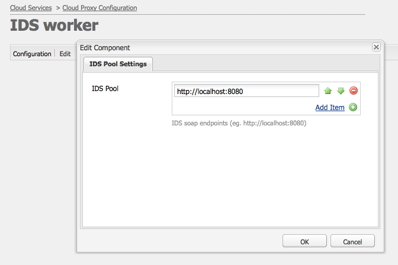

# Integrar AEM Assets con Adobe InDesign Server {#integrating-aem-assets-with-indesign-server}

Adobe Experience Manager (AEM) Assets utiliza:

* Un proxy para distribuir la carga de determinadas tareas de procesamiento. Un proxy es una instancia AEM que se comunica con un trabajador proxy para cumplir una tarea específica y otras instancias AEM para ofrecer los resultados.
* Trabajador proxy para definir y administrar una tarea específica.

Pueden abarcar una amplia variedad de tareas; por ejemplo, usar un Adobe InDesign Server para procesar archivos.

Para cargar completamente archivos a AEM Assets que haya creado con Adobe InDesign, se utiliza un proxy. Esto utiliza un programa de trabajo proxy para comunicarse con el Adobe InDesign Server, donde se ejecutan [scripts](https://www.adobe.com/devnet/indesign/documentation.html#idscripting) para extraer metadatos y generar varias representaciones para AEM Assets. El programa de trabajo del proxy habilita la comunicación bidireccional entre el InDesign Server y las instancias de AEM en una configuración de nube.

>[!NOTE]
>
>Adobe InDesign viene como dos productos:
>
>* [InDesign](https://www.adobe.com/products/indesign.html)\
   >  Esto le permite diseñar diseños de página para impresión y/o distribución digital.
   >
   >
* [InDesign Server](https://www.adobe.com/products/indesignserver.html)\
   >  Este motor le permite crear documentos automatizados mediante programación en función de lo que haya creado con InDesign. Funciona como un servicio que ofrece una interfaz a su motor [ExtendScript](https://www.adobe.com/devnet/scripting.html) .\
   >  Las secuencias de comandos se escriben en ExtendScript, que es similar a javascript. Para obtener información sobre las secuencias de comandos de Indesign, consulte [https://www.adobe.com/devnet/indesign/documentation.html#idscripting](https://www.adobe.com/devnet/indesign/documentation.html#idscripting).

>

## Funcionamiento de la Extracción {#how-the-extraction-works}

El InDesign Server se puede integrar con AEM Assets para que los archivos creados con InDesign ( `.indd`) se puedan cargar, generar representaciones, extraer *todos* los medios (por ejemplo, vídeo) y almacenarlos como recursos:

>[!NOTE]
>
>Las versiones anteriores de AEM fueron capaces de extraer XMP y la miniatura, ahora todos los medios se pueden extraer.

1. Cargue el `.indd` archivo a AEM Assets.
1. Una estructura envía secuencias de comandos al InDesign Server mediante SOAP (Simple Object Access Protocol).

   Esta secuencia de comandos de comando:

   * Recupere el `.indd` archivo.
   * Ejecutar comandos de InDesign Server:

      * Se extraen la estructura, el texto y los archivos multimedia.
      * Se generan representaciones PDF y JPG.
      * Se generan representaciones HTML e IDML.
   * Anuncie los archivos resultantes en AEM Assets.

   >[!NOTE]
   >
   >IDML es un formato basado en XML que procesa *todo* el archivo InDesign. Se almacena como un paquete comprimido usando la compresión [Zip](https://www.techterms.com/definition/zip) .
   >
   >Consulte [Adobe InDesign Interchange Formats INX e IDML](http://www.peachpit.com/articles/article.aspx?p=1381880&amp;seqNum=8) para obtener más información.

   >[!CAUTION]
   >
   >Si el InDesign Server no está instalado o no está configurado, puede cargar un `.indd` archivo en AEM. Sin embargo, las representaciones generadas se limitarán a `png` y `jpeg`, no podrá generar `html`ni las representaciones de páginas `idml` .

1. Después de la generación de extracción y representación:

   * La estructura se replica en un `cq:Page` (tipo de representación).
   * El texto y los archivos extraídos se almacenan en AEM Assets.
   * Todas las representaciones se almacenan en AEM Assets, en el propio recurso.

## Integración del InDesign Server con AEM {#integrating-the-indesign-server-with-aem}

Para integrar el InDesign Server para utilizarlo con AEM Assets y después de configurar el proxy, debe:

1. [Instale el InDesign Server](#installing-the-indesign-server).
1. Si es necesario, [configure el flujo de trabajo](#configuring-the-aem-assets-workflow)de AEM Assets.

   Esto solo es necesario si los valores predeterminados no son adecuados para la instancia.

1. Configure un programa de trabajo [proxy para el InDesign Server](#configuring-the-proxy-worker-for-indesign-server).

### Instalación del InDesign Server {#installing-the-indesign-server}

Para instalar y inicio el InDesign Server para su uso con AEM:

1. Descargue e instale el Adobe InDesign Server.

   >[!NOTE]
   >
   >InDesign Server (CS6 y versiones posteriores).

1. Si es necesario, puede personalizar la configuración de la instancia de InDesign Server.

1. Desde la línea de comandos, inicio el servidor:

   `<*ids-installation-dir*>/InDesignServer.com -port 8080`

   Esto inicio el servidor con la escucha del complemento SOAP en el puerto 8080. Todos los mensajes y resultados de registro se escriben directamente en la ventana de comandos.

   >[!NOTE]
   >
   >Si desea guardar los mensajes de salida en un archivo, utilice la redirección; por ejemplo, en Windows:
   >
   >`<ids-installation-dir>/InDesignServer.com -port 8080 > ~/temp/INDD-logfile.txt 2>&1`

### Configuración del flujo de trabajo de AEM Assets {#configuring-the-aem-assets-workflow}

AEM Assets has a pre-configured workflow **DAM Update Asset**, that has several process steps specifically for InDesign:

* [Extracción de medios](#media-extraction)
* [Extracción de páginas](#page-extraction)

Este flujo de trabajo está configurado con valores predeterminados que se pueden adaptar para su configuración en las distintas instancias de creación (es un flujo de trabajo estándar, por lo que hay más información disponible en [Edición de un flujo de trabajo](/help/sites-developing/workflows-models.md#configuring-a-workflow-step)). Si está utilizando los valores predeterminados (incluido el puerto SOAP), no es necesaria ninguna configuración.

Tras la configuración, la carga de archivos InDesign en AEM Assets (por cualquiera de los métodos habituales) activará el flujo de trabajo necesario para procesar el recurso y preparar las distintas representaciones. Pruebe la configuración cargando un `.indd` archivo en AEM Assets para confirmar que ve las distintas representaciones creadas por IDS en `<*your_asset*>.indd/Renditions`

#### Extracción de medios {#media-extraction}

Este paso controla la extracción de medios desde el `.indd` archivo.

Para personalizar, puede editar la pestaña **[!UICONTROL Argumentos]** del paso **[!UICONTROL Extracción de medios]**.

Argumentos de extracción de medios y rutas de secuencias de comandos

* **Biblioteca** de ExtendScript: Se trata de una sencilla biblioteca de métodos http get/post, que requieren los demás scripts.

* **Ampliar secuencias de comandos**: Aquí puede especificar diferentes combinaciones de scripts. Si desea que sus propias secuencias de comandos se ejecuten en el InDesign Server, guarde las secuencias de comandos en `/apps/settings/dam/indesign/scripts`.

   Para obtener información sobre las secuencias de comandos de Indesign, consulte [https://www.adobe.com/devnet/indesign/documentation.html#idscripting](https://www.adobe.com/devnet/indesign/documentation.html#idscripting).

>[!CAUTION]
>
>No cambie la biblioteca ExtendScript. La biblioteca proporciona la funcionalidad HTTP necesaria para comunicarse con Sling. Esta configuración especifica la biblioteca que se enviará al Adobe InDesign Server para su uso allí.

La secuencia `ThumbnailExport.jsx` de comandos ejecutada por el paso del flujo de trabajo de Media Extracción genera una representación en miniatura en formato .jpg. Esta representación se utiliza en el paso del flujo de trabajo Miniaturas de proceso para generar las representaciones estáticas que necesita AEM.

Puede configurar el paso del flujo de trabajo Miniaturas de proceso para generar representaciones estáticas de diferentes tamaños. Asegúrese de que no elimina los valores predeterminados, ya que son obligatorios para la interfaz de usuario de AEM Assets. Por último, el paso del flujo de trabajo Eliminar representación de Previsualización de imagen elimina la representación en miniatura .jpg, ya que ya no es necesaria.

#### Extracción de páginas {#page-extraction}

Esto crea una página AEM a partir de los elementos extraídos. Se utiliza un controlador de extracción para extraer datos de una representación (actualmente HTML o IDML). Estos datos se utilizan para crear una página con PageBuilder.

Para personalizar, puede editar la pestaña **[!UICONTROL Argumentos]** del paso **Extracción de página**.

* **Controlador** de Extracción de página: En la lista desplegable, seleccione el controlador que desee utilizar. Un controlador de extracción funciona en una representación específica, elegida por un elemento relacionado `RenditionPicker` (consulte la API `ExtractionHandler`).
De forma predeterminada, el controlador de Extracción de exportación IDML está disponible. Funciona en la `IDML` representación generada en el paso MediaExtract.

* **Nombre** de página: Especifique el nombre que desea asignar a la página resultante. Si se deja en blanco, el nombre es &quot;page&quot; (o una derivativa si &quot;page&quot; ya existe).

* **Título** de página: Especifique el título que desea asignar a la página resultante.

* **Ruta** raíz de página: Ruta a la ubicación raíz de la página resultante. Si se deja en blanco, se utiliza el nodo que contiene las representaciones del recurso.

* **Plantilla** de página: Plantilla que se utilizará al generar la página resultante.

* **Diseño** de página: El diseño de página que se utilizará al generar la página resultante.

### Configuración del trabajo proxy para InDesign Server {#configuring-the-proxy-worker-for-indesign-server}

>[!NOTE]
>
>El programa de trabajo reside en la instancia de proxy.

1. En la consola Herramientas, expanda Configuraciones **[!UICONTROL de]** Cloud Services en el panel izquierdo. A continuación, expanda Configuración **[!UICONTROL de proxy de]** nube.

1. Haga doble clic en el programa de **[!UICONTROL IDS de trabajo]** para abrirlo y configurarlo.

1. Haga clic en **[!UICONTROL Editar]** para abrir el cuadro de diálogo de configuración y definir la configuración necesaria:

   

   * **Grupo** IDS: Extremos SOAP que se utilizarán para la comunicación con el InDesign Server. Puede agregar, quitar y ordenar los elementos que sean necesarios.

1. Haga clic en **[!UICONTROL Aceptar]** para guardar.

### Configuración de Day CQ Link Externalizer  {#configuring-day-cq-link-externalizer}

Si el servidor de InDesign y AEM se ejecutan en diferentes hosts o en cualquiera de estas aplicaciones o en ambas no se ejecutan en puertos predeterminados, configure **Day CQ Link Externalizer** para establecer el nombre de host, el puerto y la ruta de contenido para el servidor de InDesign.

1. Acceda a Configuration Manager en la dirección URL `https://[AEM_server]:[port]/system/console/configMgr`.
1. Busque la configuración **[!UICONTROL Externalizador de vínculos de CQ de día]** y haga clic en el icono **[!UICONTROL Editar]** para abrirlo.
1. Especifique el nombre de host y la ruta de contexto para el servidor de Indesign y haga clic en **[!UICONTROL Guardar]**.

   

### Activación del procesamiento de trabajos paralelos para InDesigns Server {#enabling-parallel-job-processing-for-indesign-server-s}

Ahora puede habilitar el procesamiento de trabajos paralelos para IDS.

Primero debe determinar el número máximo de trabajos paralelos ( `x`) que un InDesign Server puede procesar:

* En un solo equipo multiprocesador, el número máximo de trabajos paralelos (x) que un InDesign Server puede procesar es uno menor que el número de procesadores que ejecutan IDS.
* Cuando ejecuta IDS en varios equipos, debe contar el número total de procesadores disponibles (es decir, en todos los equipos) y luego restar el número total de equipos.

Para configurar el número de trabajos de IDS paralelos:

1. Abra la ficha **[!UICONTROL Configuraciones]** de la consola Félix; por ejemplo:

   `http://localhost:4502/system/console/configMgr`

1. Seleccione la cola de procesamiento de IDS en:

   `Apache Sling Job Queue Configuration`

1. Configurar:

   * **[!UICONTROL Tipo]** - `Parallel`
   * **[!UICONTROL Trabajos]** paralelos máximos: `<*x*>` (como se calculó arriba)

1. Guarde estos cambios.
1. Para activar la compatibilidad con varias sesiones para Adobe CS6 y versiones posteriores, marque la casilla de verificación situada debajo de la `enable.multisession.name` casilla de verificación debajo de `com.day.cq.dam.ids.impl.IDSJobProcessor.name configuration`.
1. Cree un [grupo de &lt; `*x*>` trabajadores IDS agregando extremos SOAP a la configuración](#configuring-the-proxy-worker-for-indesign-server)IDS Worker.

   Si hay varios equipos que ejecutan InDesigns Server, agregue extremos SOAP (número de procesadores por máquina -1) para cada equipo.

   >[!NOTE]
   >
   >Al trabajar con un grupo de trabajadores, puede habilitar la lista de bloqueados de los trabajadores de IDS.
   >
   >Para ello, habilite la casilla &quot;enable.reintento.name&quot;, en la configuración, que permite la recuperación de trabajos de IDS. `com.day.cq.dam.ids.impl.IDSJobProcessor.name`
   >
   >Además, en la configuración `com.day.cq.dam.ids.impl.IDSPoolImpl.name` , establezca un valor positivo para `max.errors.to.blacklist` el parámetro que determina el número de recuperaciones de trabajos antes de excluir un ID de la lista de controladores de trabajos
   >
   >De forma predeterminada, después del (`retry.interval.to.whitelist.name`) tiempo configurable en minutos, se vuelve a validar el programa de trabajo de IDS. Si el trabajador se encuentra en línea, se elimina de la lista de bloqueados.

<!-- TBD: Make updates to configurations for allow and block list after product updates are done. See CQ-4298427.
-->

## Habilitar compatibilidad con Adobe InDesign Server 10.0 o posterior {#enabling-support-for-indesign-server-or-higher}

Para InDesign Server 10.0 o superior, realice los siguientes pasos para habilitar la compatibilidad con varias sesiones.

1. Abra Configuration Manager desde su [!DNL Assets] instancia `https://[aem_server]:[port]/system/console/configMgr`.
1. Edite la configuración `com.day.cq.dam.ids.impl.IDSJobProcessor.name`.
1. Seleccione la opción **[!UICONTROL ids.cc.enable]** y haga clic en **[!UICONTROL Guardar]**.

>[!NOTE]
>
>Para [!DNL InDesign Server] la integración con [!DNL Assets], utilice un procesador multi-core porque la función de soporte de sesión necesaria para la integración no es compatible con sistemas de un solo núcleo.

## Configuración de las credenciales de Experience Manager {#configure-aem-credentials}

Puede cambiar las credenciales de administrador predeterminadas (nombre de usuario y contraseña) para acceder al servidor de InDesign desde la instancia de AEM sin interrumpir la integración con el servidor de Adobe InDesign.

1. Ir a `/etc/cloudservices/proxy.html`.
1. En el cuadro de diálogo, especifique el nombre de usuario y la contraseña nuevos.
1. Guarde las credenciales.
