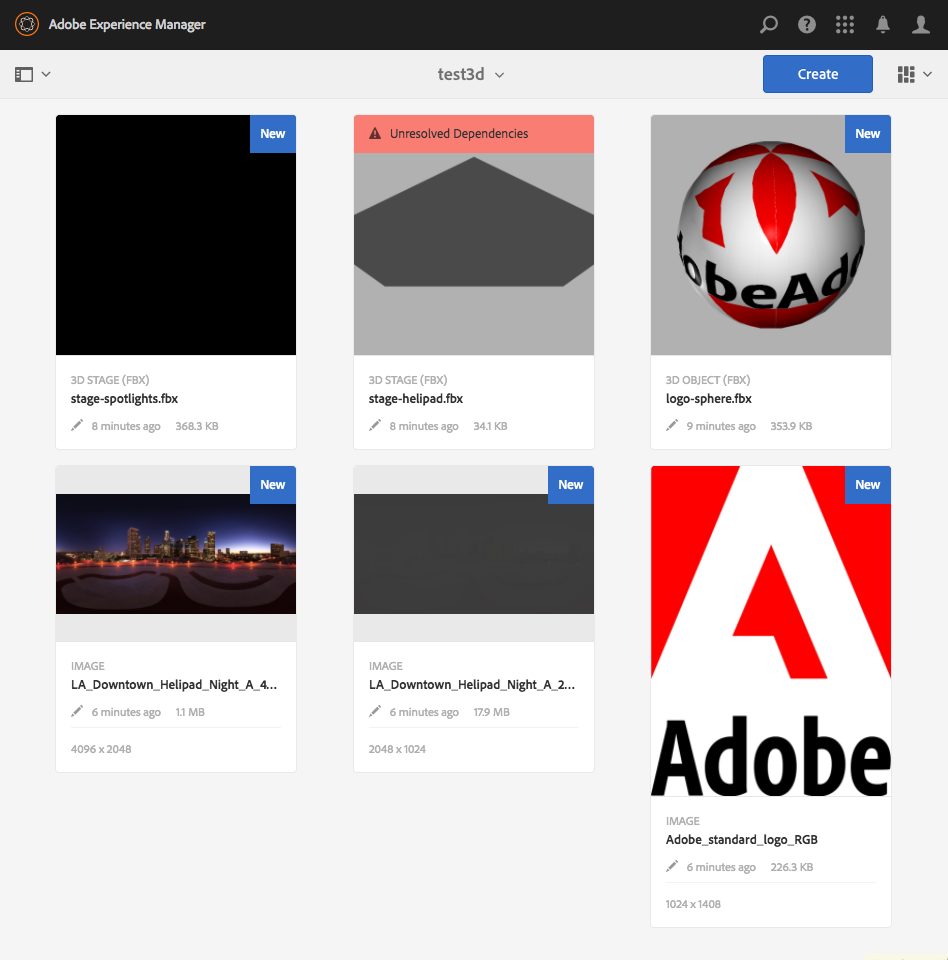

# Instalación y configuración de AEM 3D {#installing-and-configuring-aem-d}

>[!IMPORTANT]
>
>Ya no se admite AEM 3D en AEM 6.4. Adobe recomienda utilizar la función de recursos 3D en [AEM como Cloud Service](https://docs.adobe.com/content/help/en/experience-manager-cloud-service/assets/dynamicmedia/assets-3d.html) o [AEM 6.5.3 o superior.](https://docs.adobe.com/content/help/en/experience-manager-65/assets/dynamic/assets-3d.html)

La instalación y configuración de AEM 3D (versión 3.0) implica lo siguiente:

1. Instalación de la biblioteca del SDK de Autodesk® FBX®.
1. Descarga e instalación del paquete de código 3D nativo.
1. Configuración del flujo de trabajo de ingestión de recursos 3D y reinicio de AEM.
1. Validando la configuración de AEM 3D.

Consulte también [Uso de recursos](assets-3d.md)3D.

Consulte también [AEM notas](/help/release-notes/aem3d-release-notes.md) de la versión de Recursos 3D para conocer los requisitos previos, los navegadores admitidos y otra información importante de la versión.

Consulte también [Uso del componente](using-the-3d-sites-component.md)Sitios 3D.

>[!NOTE]
>
>Antes de descargar e instalar el paquete 3D, asegúrese de haber instalado correctamente todos los paquetes AEM requisitos previos. See the [AEM 3D Release Notes.](install-config-3d.md)

## Instalación de la biblioteca del SDK de Autodesk FBX {#installing-the-autodesk-fbx-sdk-library}

El código 3D nativo de AEM requiere que la biblioteca FBX de Autodesk admita el formato de archivo FBX. (Actualmente, Adobe no puede redistribuir esta biblioteca).

Consulte también Configuración [avanzada](advanced-config-3d.md).

1. Inicie sesión en el host en el que está instalado AEM.

   * Si se trata de una implementación de Windows Server, inicie sesión en el servidor como Administrador.
   * Si se trata de un equipo de escritorio MAC o Windows, asegúrese de tener privilegios de administrador.

1. Utilice el vínculo adecuado para que el sistema operativo descargue el SDK de **FBX versión 2016.1.2**

   * **Windows**

      [https://download.autodesk.com/us/fbx_release_older/2016.1.2/fbx20161_2_fbxsdk_vs2010_win.exe](https://download.autodesk.com/us/fbx_release_older/2016.1.2/fbx20161_2_fbxsdk_vs2010_win.exe)

   * **OS X**

      [https://download.autodesk.com/us/fbx_release_older/2016.1.2/fbx20161_2_fbxsdk_clang_mac.pkg.tgz](https://download.autodesk.com/us/fbx_release_older/2016.1.2/fbx20161_2_fbxsdk_clang_mac.pkg.tgz)

   * **Linux**

      [https://download.autodesk.com/us/fbx_release_older/2016.1.2/fbx20161_2_fbxsdk_linux.tar.gz](https://download.autodesk.com/us/fbx_release_older/2016.1.2/fbx20161_2_fbxsdk_linux.tar.gz)

1. Instale el SDK de FBX:

   * Windows. Instale en la misma unidad donde se encuentra AEM.
   * Mac. Instale en la misma partición donde se encuentra AEM.
   * Linux. Extraiga el paquete descargado y siga las instrucciones de la `<yourFBXSDKpath>/Install_FbxFileSdk.txt`. Instale el SDK en `/usr`.

## Descarga e instalación del paquete de código 3D nativo {#downloading-and-installing-the-native-d-code-package}

>[!NOTE]
>
>Antes de continuar con la instalación y configuración de AEM 3D, Adobe recomienda implementar todos los Service Packs aplicables y otros paquetes de funciones relacionados. See [AEM 3D Release Notes](/help/release-notes/aem3d-release-notes.md).

Consulte también Configuración [avanzada](advanced-config-3d.md).

**Para instalar el paquete** de código 3D nativo:

1. Realice una de las acciones siguientes:

   * Si se trata de una implementación de Windows Server, inicie sesión en el servidor como Administrador.
   * Si se trata de un escritorio de Mac o Windows, asegúrese de tener privilegios de administrador.

1. Asegúrese de que dispone de un navegador compatible para acceder a AEM.

   Consulte Requisitos [del sistema](/help/release-notes/aem3d-release-notes.md#system-requirements).

1. Acceda al portal [de distribución de software](https://experience.adobe.com/#/downloads/content/software-distribution/en/aem.html). Busque la versión 3.0.1 del paquete de `AEM-6.4-DynamicMedia-3D` funciones y descárguelo.

1. En AEM, haga clic en **[!UICONTROL Herramientas > Administración > Implementación > Administrador]** de paquetes.

1. Cargue el paquete de funciones descargado en AEM. Localícela y haga clic en **[!UICONTROL Instalar]**.

1. En el cuadro de diálogo **[!UICONTROL Instalar paquete]** , expanda Configuración **** avanzada y, a continuación, defina Gestión **[!UICONTROL de]** Controles de acceso en **Combinar**.
1. Haga clic en **[!UICONTROL Instalar]** para iniciar la instalación del paquete.

   El archivo `sample-3D-content.zip` se coloca en la carpeta raíz de **[!UICONTROL Recursos]** . Consulte [Validación de la configuración de AEM 3D](#validating-the-setup-of-aem-d) para obtener más información.

## Configuración del flujo de trabajo de ingestión de recursos 3D y reinicio del AEM {#configuring-the-d-asset-ingestion-workflow-and-restarting-aem}

**Para configurar el flujo de trabajo** de ingestión de recursos 3D:

1. En AEM, haga clic en el logotipo AEM para acceder a la consola de navegación global y, a continuación, haga clic en el icono **[!UICONTROL Herramientas]** y vaya a **[!UICONTROL Flujo de trabajo > Modelos]**.
1. En la página Modelos **[!UICONTROL de]** flujo de trabajo, pase el ratón por encima del flujo de trabajo de recursos **[!UICONTROL de actualización de]** DAM y, cuando aparezca la marca de verificación, selecciónela.

1. En la barra de herramientas, haga clic en **[!UICONTROL Editar]**.
1. En la pantalla **[!UICONTROL DAM Update Asset]** , en el panel flotante AEM, haga clic en el icono **[!UICONTROL Plus]** situado a la derecha de Workflow para expandir la lista. Seleccione **[!UICONTROL Paso]** de proceso en la lista.
1. Arrastre el paso **** Proceso y colóquelo en el flujo de trabajo justo antes de que **[!UICONTROL DAM Update Asset Workflow se haya completado]** cerca del final del flujo de trabajo.

   

1. Haga clic con el doble en el paso del proceso recientemente agregado.
1. En el cuadro de diálogo Propiedades **[!UICONTROL del]** paso, en la ficha **[!UICONTROL Común]** , en el campo **[!UICONTROL Título]** , introduzca una descripción adecuada para el proceso como, por ejemplo, `Process 3D content`.
1. Click the **[!UICONTROL Process]** tab.

1. En el menú desplegable **[!UICONTROL Proceso]** , seleccione Servicio **[!UICONTROL de objetos]** geométricos 3D y, a continuación, active la casilla de verificación **[!UICONTROL Avanzada]** del controlador.

   

1. Cerca de la esquina superior derecha del cuadro de diálogo, haga clic en el icono de marca de verificación para volver a la página Recurso de actualización de DAM.
1. Cerca de la esquina superior derecha de la página Recurso **[!UICONTROL de actualización de]** DAM, haga clic en **[!UICONTROL Sincronizar]** para guardar el modelo de flujo de trabajo editado.
1. Reinicie AEM.

   Después del reinicio, ya puede cargar contenido 3D y AEM procesarlo.

   Continúe con la [Validación de la configuración de AEM 3D](#validating-the-setup-of-aem-d).

## Validación de la configuración de AEM 3D {#validating-the-setup-of-aem-d}

1. En AEM, haga clic en **[!UICONTROL Herramientas > Recursos]**, descargue `sample-3D-content.zip`y expanda el archivo descargado. (Ahora puede eliminar `sample-3D-content.zip` en AEM).

   Asegúrese de que se encuentra en la Vista **[!UICONTROL de]** tarjetas para cargar vistas y procesar comentarios en los pasos restantes.

1. Cree una carpeta con el nombre `test3d` para recibir contenido de prueba.
1. Cargue todos los archivos desde `sample-3D-content/images` a la `test3d` carpeta.
1. Espere a que se complete la carga y el procesamiento. Es posible que deba actualizar el explorador.

   Cargue los tres `.fbx` archivos de `sample-3D-content/` la `test3d` carpeta.

   Aún no cargue los archivos del modelo .ma.

1. En la Vista Tarjeta, observe los letreros de mensaje que se muestran en las tarjetas de recursos 3D.

   Cada recurso se procesa mediante varios pasos. Cuando la Previsualización **[!UICONTROL Creando...]** el paso de procesamiento finaliza y la tarjeta se actualiza con una imagen en miniatura. Una vez finalizado el procesamiento final, la pancarta se sustituye por el indicador **[!UICONTROL NUEVO]** .

   >[!NOTE]
   >
   >Se espera una utilización muy alta de la CPU mientras el procesamiento 3D está en curso. Dependiendo de la capacidad de CPU disponible, puede tomar una cantidad sustancial de tiempo completar todo el procesamiento.

   

1. Ahora aprenderá a resolver las dependencias de archivos.

   En la pancarta Dependencias **** sin resolver de la `stage-helipad.fbx` tarjeta, haga clic en el icono **[!UICONTROL Exclamación]** para desplazarse a las propiedades del recurso y abrir la ficha **Dependencias** .

   

1. Haga clic en el icono **[!UICONTROL Carpeta/lupa]** a la derecha del nombre del archivo para abrir el navegador de recursos y resolver las dependencias de la siguiente manera:

   

1. Haga clic en **[!UICONTROL Guardar]** y **[!UICONTROL Cerrar]** para finalizar el procesamiento del recurso y volver a la Vista **[!UICONTROL de]** tarjeta, respectivamente.
1. Una vez completado el procesamiento, verá lo siguiente en la Vista **** de tarjetas:

   

1. En la página test3d, haga clic en la `logo-sphere.fbx` tarjeta para abrir el modelo en la Vista **[!UICONTROL de]** detalles.

   Cerca de la esquina superior derecha de la página logo-esfera.fbx, haga clic en el icono de Elementos destacados del escenario para expandir el menú desplegable y, a continuación, seleccione `stage-spotlights.fbx`.

   

1. En la lista desplegable **[!UICONTROL Elementos destacados]** del escenario, seleccione `stage-helipad.fbx`.

   Uso del botón izquierdo del ratón para ajustar la vista. La iluminación del fondo y del modelo cambia para reflejar la nueva selección del escenario.

   

## Configuración de la compatibilidad con los recursos de Adobe Dimension {#configuring-support-for-adobe-dimension-assets}

>[!NOTE]
>
>Esta tarea de configuración es opcional.

Opcionalmente, puede configurar la compatibilidad con AEM 3D para los recursos de Adobe Dimension.

Debe configurar un servicio de conversión externo para permitir la ingestión, previsualización y publicación de recursos Adobe Dimension 3D en AEM. El servicio convierte del formato Adobe Dimension (`.dn`) propietario a una variante de glTF (formateada como `.glb` archivo) que se guarda con el recurso Dn como una representación. La `.glb` representación se utiliza para la visualización basada en web del recurso 3D en AEM Assets, Sitios y Pantallas, y también se puede descargar para su uso con aplicaciones de terceros.

>[!NOTE]
>
>Adobe aloja el servicio de conversión en Amazon AWS. Después de configurar correctamente el servicio, `.dn` los archivos cargados en AEM se copian de forma segura en el servicio de conversión mediante almacenamientos temporales en Amazon S3. El resultado de la conversión se transfiere de nuevo a AEM mediante el almacenamiento temporal S3. Todas las transferencias y los almacenamientos están garantizados. Además, el contenido persiste en S3 y el servicio de conversión solo se mantiene brevemente (normalmente no más de unos minutos).

**Para configurar la compatibilidad con los recursos** de Adobe Dimension:

1. Póngase en contacto con el administrador de cuentas de Adobe AEM, el experto de aprovisionamiento o el representante de asistencia técnica para solicitar las credenciales de los servicios **AEM3D**.

   >[!NOTE]
   >
   >Solo se requiere un conjunto de credenciales para cada organización, independientemente del número de instancias de AEM en las que se instalan las credenciales.

1. Compruebe que ha recibido la siguiente información:

   * accountId
   * customerId
   * password
   * identityPoolId
   * userPoolId
   * clientId

1. Como administrador, inicie sesión en la instancia de creación de AEM donde desee instalar las credenciales y, a continuación, abra **[!UICONTROL CRXDE Lite]**.
1. Configure la nueva información de las credenciales haciendo lo siguiente en CRXDE Lite:

   1. Vaya a `/libs/settings/dam/v3D/services/dncr` y establezca la `clientId` propiedad en el nuevo valor.
   1. Vaya a `/libs/settings/dam/v3D/services/aws` los nuevos valores y establezca las propiedades `accountId`, `customerId`, `identityPoolId`y `userPoolId` .
   1. Cargue el nuevo valor de contraseña en la `encryptedPassword` propiedad. Este valor se cifra automáticamente al tocar **[!UICONTROL Guardar todo]**.
   1. Toque **[!UICONTROL Guardar todo]**, vuelva a cargar la página y compruebe que la `encryptedPassword` propiedad muestra una cadena diferente entre llaves. Este aspecto indica que la contraseña está cifrada y protegida correctamente.

1. Especifique el formato de la representación de `.glb` conversión haciendo lo siguiente en el **[!UICONTROL CRXDE Lite]**:

   1. Vaya a `/libs/settings/dam/v3D/services/dncr` en el **[!UICONTROL CRXDE Lite]**.
   1. Establezca la `outputFormat` propiedad en `Dn` o `generic`.

      Cuando se configura en `Dn`, la `.glb` conversión incluye extensiones específicas del Adobe, como la iluminación IBL, para obtener la mejor calidad al ver los recursos Dn en AEM. Sin embargo, es posible que la representación .glb convertida no se represente correctamente en aplicaciones de terceros.

      Cuando se establece en `generic`, la `.glb` representación es genérica sin extensiones específicas del Adobe. Esta configuración permite usarla en aplicaciones de terceros, mientras que la visualización con el visor 3D AEM será visualmente subóptima.

1. Habilite el formato de archivo Dn haciendo lo siguiente en el **[!UICONTROL CRXDE Lite]**:

   1. Ir a `/libs/settings/dam/v3D/assetTypes/Dn`.
   1. Establezca la `Enabled` propiedad en true.

1. Valide la configuración haciendo lo siguiente:

   1. Abra AEM Assets.
   1. Cargar `logo_sphere.dn` en la `test3d` carpeta. El archivo se encuentra en `sample-3D-content/models`.

      Tenga en cuenta que `sample-3D-content.zip` se ha descargado anteriormente para validar la funcionalidad 3D básica.
   1. Vuelva a la Vista **[!UICONTROL de]** tarjeta y observe la pancarta del mensaje que se muestra en el recurso cargado. El formato de **[!UICONTROL conversión...]** la pancarta se muestra mientras el proceso de conversión está en curso.
   1. Una vez completado el procesamiento, abra el recurso en la Vista **[!UICONTROL de]** detalles para comprobar que el recurso convertido se muestra correctamente y que los controles de navegación del visor se pueden utilizar.

   

   Si aparece un &quot;Error de procesamiento&quot; en el recurso Dn en la Vista **[!UICONTROL de]** tarjeta después de 10-15 minutos, se producirá un error en la conversión.

   En ese caso, puede solucionar los problemas de la conversión haciendo lo siguiente:

   * Elimine el recurso y vuelva a cargarlo.
   * Asegúrese de que ha establecido correctamente todos los parámetros de configuración en el **[!UICONTROL CRXDE Lite]**.
   * Compruebe que ningún servidor de seguridad está bloqueando el acceso al servicio de conversión y a los extremos de AWS.
