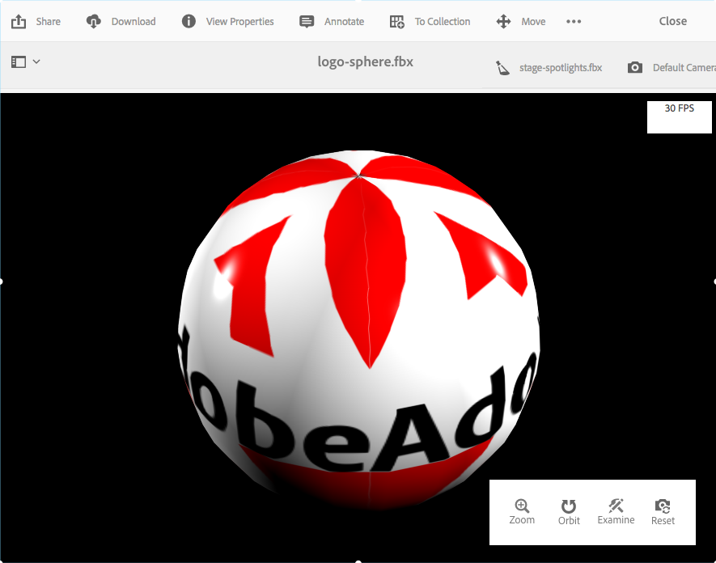

# Instalación y configuración de AEM 3D {#installing-and-configuring-aem-d}

>[!IMPORTANT]
>
>AEM 3D en AEM 6.4 ya no es compatible. Adobe recomienda utilizar la función de recursos 3D en [AEM como Cloud Service](https://experienceleague.adobe.com/docs/experience-manager-cloud-service/assets/dynamicmedia/assets-3d.html#dynamicmedia) o [AEM 6.5.3 o superior.](https://experienceleague.adobe.com/docs/experience-manager-65/assets/dynamic/assets-3d.html#dynamic)

La instalación y configuración de AEM 3D (versión 3.0) implica lo siguiente:

1. Instalación de la biblioteca del SDK de Autodesk® FBX®.
1. Descarga e instalación del paquete de código 3D nativo.
1. Configuración del flujo de trabajo de ingesta de recursos 3D y reinicio del AEM.
1. Validando la configuración de AEM 3D.

Consulte también [Uso de recursos 3D](assets-3d.md).

Consulte también las [AEM notas de la versión de los recursos 3D](/help/release-notes/aem3d-release-notes.md) para conocer los requisitos previos, los navegadores compatibles y otra información importante sobre la versión.

Consulte también [Uso del componente Sitios 3D](using-the-3d-sites-component.md).

>[!NOTE]
>
>Antes de descargar e instalar el paquete 3D, asegúrese de haber instalado correctamente todos los paquetes AEM requisitos previos. Consulte las [AEM notas de la versión 3D.](install-config-3d.md)

## Instalación de la biblioteca del SDK de FBX de Autodesk {#installing-the-autodesk-fbx-sdk-library}

El código 3D AEM nativo requiere la biblioteca FBX de Autodesk para admitir el formato de archivo FBX. (Actualmente, Adobe no puede redistribuir esta biblioteca).

Consulte también [Configuración avanzada](advanced-config-3d.md).

1. Inicie sesión en el host donde AEM está instalado.

   * Si se trata de una implementación de Windows Server, inicie sesión en el servidor como Administrador.
   * Si se trata de un escritorio MAC o Windows, asegúrese de tener privilegios de administrador.

1. Utilice el enlace apropiado para que su sistema operativo descargue **FBX SDK versión 2016.1.2**

   * **Windows**

      [https://download.autodesk.com/us/fbx_release_older/2016.1.2/fbx20161_2_fbxsdk_vs2010_win.exe](https://download.autodesk.com/us/fbx_release_older/2016.1.2/fbx20161_2_fbxsdk_vs2010_win.exe)

   * **OS X**

      [https://download.autodesk.com/us/fbx_release_older/2016.1.2/fbx20161_2_fbxsdk_clang_mac.pkg.tgz](https://download.autodesk.com/us/fbx_release_older/2016.1.2/fbx20161_2_fbxsdk_clang_mac.pkg.tgz)

   * **Linux**

      [https://download.autodesk.com/us/fbx_release_older/2016.1.2/fbx20161_2_fbxsdk_linux.tar.gz](https://download.autodesk.com/us/fbx_release_older/2016.1.2/fbx20161_2_fbxsdk_linux.tar.gz)

1. Instale el SDK de FBX:

   * Windows. Instale en la misma unidad donde se encuentra AEM.
   * Mac. Instale en la misma partición donde se encuentra AEM.
   * Linux. Extraiga el paquete descargado y siga las instrucciones de `<yourFBXSDKpath>/Install_FbxFileSdk.txt`. Instale el SDK en `/usr`.

## Descarga e instalación del paquete de código 3D nativo {#downloading-and-installing-the-native-d-code-package}

>[!NOTE]
>
>Antes de continuar con la instalación y configuración de AEM 3D, Adobe recomienda implementar todos los service packs aplicables y otros feature packs relacionados. Consulte [AEM Notas de la versión 3D](/help/release-notes/aem3d-release-notes.md).

Consulte también [Configuración avanzada](advanced-config-3d.md).

**Para instalar el paquete** de código 3D nativo:

1. Realice una de las acciones siguientes:

   * Si se trata de una implementación de Windows Server, inicie sesión en el servidor como Administrador.
   * Si se trata de un escritorio de Mac o Windows, asegúrese de tener privilegios de administrador.

1. Asegúrese de tener un explorador compatible disponible para acceder a AEM.

   Consulte [Requisitos del sistema](/help/release-notes/aem3d-release-notes.md#system-requirements).

1. Acceda al [Portal de distribución de software](https://experience.adobe.com/#/downloads/content/software-distribution/en/aem.html). Busque la versión 3.0.1 del paquete de características `AEM-6.4-DynamicMedia-3D` y descárguelo.

1. En AEM, haga clic en **[!UICONTROL Herramientas > Administración > Implementación > Administrador de paquetes]**.

1. Cargue el paquete de funciones descargado en AEM. Localícelo y haga clic en **[!UICONTROL Instalar]**.

1. En el cuadro de diálogo **[!UICONTROL Instalar paquete]**, expanda **Configuración avanzada** y, a continuación, establezca **[!UICONTROL Control de acceso]** en **Combinar**.
1. Haga clic en **[!UICONTROL Install]** para comenzar la instalación del paquete.

   El archivo `sample-3D-content.zip` se coloca en la carpeta raíz **[!UICONTROL Assets]**. Consulte [Validación de la configuración de AEM 3D](#validating-the-setup-of-aem-d) para obtener información adicional.

## Configuración del flujo de trabajo de ingesta de recursos 3D y reinicio de AEM {#configuring-the-d-asset-ingestion-workflow-and-restarting-aem}

**Para configurar el flujo de trabajo** de ingesta de recursos 3D:

1. En AEM, haga clic en el logotipo de AEM para acceder a la consola de navegación global y, a continuación, haga clic en el icono **[!UICONTROL Tools]** y vaya a **[!UICONTROL Workflow > Models]**.
1. En la página **[!UICONTROL Modelos de flujo de trabajo]**, pase el ratón sobre el flujo de trabajo **[!UICONTROL Recurso de actualización de DAM]** y, cuando aparezca la marca de verificación, selecciónela.

1. En la barra de herramientas, haga clic en **[!UICONTROL Editar]**.
1. En la pantalla **[!UICONTROL DAM Update Asset]**, en el panel flotante AEM, haga clic en el icono **[!UICONTROL Plus]** a la derecha del flujo de trabajo para expandir la lista. Seleccione **[!UICONTROL Paso de proceso]** en la lista.
1. Arrastre **[!UICONTROL Paso de proceso]** y suéltelo en el flujo de trabajo justo antes del componente **[!UICONTROL Flujo de trabajo de recursos de actualización de DAM completado]** cerca del final del flujo de trabajo.

   

1. Haga doble clic en el paso de proceso recién agregado.
1. En el cuadro de diálogo **[!UICONTROL Propiedades del paso]**, en la pestaña **[!UICONTROL Común]**, en el campo **[!UICONTROL Título]**, introduzca una descripción adecuada para el proceso como `Process 3D content`.
1. Haga clic en la pestaña **[!UICONTROL Process]**.

1. En el menú desplegable **[!UICONTROL Process]**, seleccione **[!UICONTROL Geometric 3D Object Service]** y, a continuación, active la casilla **[!UICONTROL Handler Advance]**.

   

1. Cerca de la esquina superior derecha del cuadro de diálogo, haga clic en el icono de marca de verificación para volver a la página Recurso de actualización de DAM .
1. Cerca de la esquina superior derecha de la página **[!UICONTROL Recurso de actualización de DAM]**, haga clic en **[!UICONTROL Sincronizar]** para guardar el modelo de flujo de trabajo editado.
1. Reinicie AEM.

   Después del reinicio, está listo para cargar contenido 3D y AEM procesarlo.

   Continúe con [Validando la configuración de AEM 3D](#validating-the-setup-of-aem-d).

## Validación de la configuración de AEM 3D {#validating-the-setup-of-aem-d}

1. En AEM, haga clic en **[!UICONTROL Herramientas > Assets]**, descargue `sample-3D-content.zip` y expanda el archivo descargado. (Ahora puede eliminar `sample-3D-content.zip` en AEM.)

   Asegúrese de que está en **[!UICONTROL Vista de tarjeta]** para ver los comentarios de carga y procesamiento en los pasos restantes.

1. Cree una carpeta denominada `test3d` para recibir el contenido de la prueba.
1. Cargue todos los archivos de `sample-3D-content/images` a la carpeta `test3d`.
1. Espere a que se complete la carga y el procesamiento. Es posible que deba actualizar el explorador.

   Cargue los tres archivos `.fbx` de `sample-3D-content/` a la carpeta `test3d`.

   No cargue todavía los archivos del modelo .ma.

1. En la vista de tarjeta, observe los banners de mensaje que se muestran en las tarjetas de recursos 3d.

   Cada recurso lleva a cabo varios pasos de procesamiento. Cuando **[!UICONTROL Creando vista previa...El paso de procesamiento]** finaliza y la tarjeta se actualiza con una imagen en miniatura. Una vez completado el procesamiento final, el banner se sustituye por el indicador **[!UICONTROL NEW]**.

   >[!NOTE]
   >
   >Se espera una utilización muy alta de la CPU mientras el procesamiento 3D está en curso. Dependiendo de la capacidad de CPU disponible, puede tomar una cantidad sustancial de tiempo completar todo el procesamiento.

   

1. Ahora aprenderá a resolver dependencias de archivo.

   En el banner **[!UICONTROL Unresolve Dependencies]** de la tarjeta `stage-helipad.fbx`, haga clic en el icono **[!UICONTROL Exclamation Point]** para desplazarse hasta las propiedades del recurso y abrir la pestaña **Dependencies**.

   

1. Haga clic en el icono **[!UICONTROL Folder/Magnifying Glass]** a la derecha del nombre del archivo para abrir el navegador de recursos y resolver las dependencias de la siguiente manera:

   

1. Haga clic en **[!UICONTROL Guardar]** y **[!UICONTROL Cerrar]** para finalizar el procesamiento del recurso y volver a la **[!UICONTROL Vista de tarjeta]**, respectivamente.
1. Cuando se haya completado el procesamiento, verá lo siguiente en **[!UICONTROL Vista de tarjeta]**:

   

1. En la página test3d , haga clic en la tarjeta `logo-sphere.fbx` para abrir el modelo en **[!UICONTROL Vista de detalles]**.

   Cerca de la esquina superior derecha de la página logo-sphere.fbx, haga clic en el icono de Elementos destacados del escenario para expandir el menú desplegable y, a continuación, seleccione `stage-spotlights.fbx`.

   

1. En la lista desplegable **[!UICONTROL Stage Spotlight]**, seleccione `stage-helipad.fbx`.

   Uso del botón izquierdo del ratón para ajustar la vista. La iluminación del fondo y del modelo cambia para reflejar la nueva selección de escenario.

   

## Configuración de la compatibilidad con los recursos de Adobe Dimension {#configuring-support-for-adobe-dimension-assets}

>[!NOTE]
>
>Esta tarea de configuración es opcional.

Si lo desea, puede configurar la compatibilidad en AEM 3D para los recursos de Adobe Dimension.

Debe configurar un servicio de conversión externo para permitir la ingesta, previsualización y publicación de recursos 3D de Adobe Dimension en AEM. El servicio convierte del formato Adobe Dimension propietario (`.dn`) a una variante de glTF (formateado como archivo `.glb`) que se guarda con el recurso Dn como representación. La representación `.glb` se utiliza para la visualización basada en web del recurso 3D en AEM Assets, Sites y Screens, y también está disponible para su descarga para su uso con aplicaciones de terceros.

>[!NOTE]
>
>El servicio de conversión está alojado por Adobe en Amazon AWS. Después de configurar correctamente el servicio, los `.dn` archivos cargados en AEM se copian de forma segura en el servicio de conversión mediante almacenamiento temporal en Amazon S3. El resultado de la conversión se transfiere de nuevo a AEM mediante el almacenamiento temporal S3. Todas las transferencias y el almacenamiento están protegidos. Además, el contenido persiste en S3 y el servicio de conversión solo se mantiene brevemente (normalmente no más de unos minutos).

**Para configurar la compatibilidad con los recursos** de Adobe Dimension:

1. Póngase en contacto con el administrador de cuentas de Adobe AEM, el experto en aprovisionamiento o el representante de asistencia técnica para solicitar las credenciales de **AEM3D Services**.

   >[!NOTE]
   >
   >Solo se requiere un conjunto de credenciales para cada organización, independientemente del número de instancias de AEM en las que estén instaladas las credenciales.

1. Compruebe que ha recibido la siguiente información:

   * accountId
   * customerId
   * password
   * identityPoolId
   * userPoolId
   * clientId

1. Como administrador, inicie sesión en la instancia de autor de AEM donde desee instalar las credenciales y, a continuación, abra **[!UICONTROL CRXDE Lite]**.
1. Configure la nueva información de credenciales haciendo lo siguiente en CRXDE Lite:

   1. Vaya a `/libs/settings/dam/v3D/services/dncr` y establezca la propiedad `clientId` en el nuevo valor.
   1. Vaya a `/libs/settings/dam/v3D/services/aws` y establezca las propiedades `accountId`, `customerId`, `identityPoolId` y `userPoolId` en los nuevos valores.
   1. Cargue el nuevo valor de contraseña en la propiedad `encryptedPassword`. Este valor se cifra automáticamente al pulsar **[!UICONTROL Guardar todo]**.
   1. Toque **[!UICONTROL Guardar todo]**, vuelva a cargar la página y compruebe que la propiedad `encryptedPassword` muestra una cadena diferente entre llaves. Este aspecto indica que la contraseña está cifrada correctamente y es segura.

1. Especifique el formato de la `.glb` representación de conversión haciendo lo siguiente en **[!UICONTROL CRXDE Lite]**:

   1. Vaya a `/libs/settings/dam/v3D/services/dncr` en **[!UICONTROL CRXDE Lite]**.
   1. Establezca la propiedad `outputFormat` en `Dn` o `generic`.

      Cuando se establece en `Dn`, la conversión `.glb` incluye extensiones específicas del Adobe, como la iluminación de IBL, para obtener la mejor calidad al ver los recursos Dn en AEM. Sin embargo, es posible que la representación .glb convertida no se represente correctamente en aplicaciones de terceros.

      Cuando se establece en `generic`, la representación `.glb` es genérica sin extensiones específicas del Adobe. Este ajuste permite utilizarlo en aplicaciones de terceros, mientras que la visualización con el visor 3D de AEM será visualmente subóptima.

1. Habilite el formato de archivo Dn haciendo lo siguiente en **[!UICONTROL CRXDE Lite]**:

   1. Ir a `/libs/settings/dam/v3D/assetTypes/Dn`.
   1. Establezca la propiedad `Enabled` en true.

1. Valide la configuración haciendo lo siguiente:

   1. Abra AEM Assets.
   1. Cargue `logo_sphere.dn` en la carpeta `test3d`. El archivo se encuentra en `sample-3D-content/models`.

      Tenga en cuenta que `sample-3D-content.zip` se ha descargado anteriormente para validar la funcionalidad 3D básica.
   1. Vuelva a la **[!UICONTROL Vista de tarjeta]** y observe el banner del mensaje que se muestra en el recurso cargado. El **[!UICONTROL formato de conversión...El banner]** se muestra mientras el proceso de conversión está en curso.
   1. Una vez completado todo el procesamiento, abra el recurso en **[!UICONTROL Vista de detalles]** para comprobar que el recurso convertido se muestra correctamente y que se pueden utilizar los controles de navegación del visor.

   

   Si aparece un &quot;Error de procesamiento&quot; en el recurso Dn en la **[!UICONTROL Vista de tarjeta]** después de 10-15 minutos, la conversión falla.

   En ese caso, puede solucionar los problemas de la conversión haciendo lo siguiente:

   * Elimine el recurso y, a continuación, cárguelo de nuevo.
   * Asegúrese de que ha configurado correctamente todos los parámetros de configuración en **[!UICONTROL CRXDE Lite]**.
   * Compruebe que ningún firewall está bloqueando el acceso al servicio de conversión y a los extremos de AWS.
