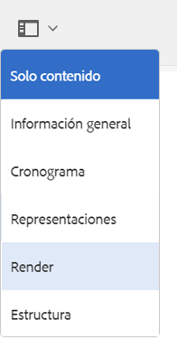

# Integración de AEM 3D con Autodesk Maya {#integrating-aem-d-with-autodesk-maya}

>[!NOTE]
>
>Esta tarea es opcional y se aplica solo a Windows.

Opcionalmente, puede integrar AEM 3D con el software Autodesk® Maya® para permitir la compatibilidad con archivos Maya nativos (`.MA` y `.MB`) y para permitirle procesar recursos 3D en AEM con cualquier procesador Maya disponible.

*Esta integración es solo* para Windows.

Al integrarse con Autodesk Maya, debe instalar y configurar Autodesk Maya, agregar la ruta a la carpeta ejecutable Maya, habilitar Maya para la ingestión y el procesamiento, y probar la integración.

Consulte Configuración [avanzada](advanced-config-3d.md).

Consulte también [Integración de AEM 3D con AutoDesk 3ds Max](integrating-aem-3d-with-autodesk-3ds-max.md).

**Para integrar AEM 3D con Autodesk Maya**:

1. Instale el software Autodesk Maya 2016 en los mismos servidores donde se aloja AEM.

   Después de la instalación, compruebe que puede abrir y utilizar Maya y que no hay problemas con las licencias.

   >[!NOTE]
   >
   >AEM utiliza únicamente la herramienta de procesamiento de línea de comandos Maya (`render.exe`). Una única licencia de red Maya permite que hasta cinco servidores procesen o procesen contenido Maya simultáneamente.

1. En Maya, habilite el Complemento Autodesk FBX®.
1. Instale el complemento de procesamiento de MentalRay u otro procesador que desee.

   Después de la instalación, verifique que MentalRay esté disponible en Maya.

1. Añada la ruta a la carpeta ejecutable Maya en la variable de entorno de Windows PATH.

   Por ejemplo, en Windows Server 2012, toque **[!UICONTROL Inicio]>[!UICONTROL Panel de control de Campaign]>[!UICONTROL Sistema y seguridad]>[!UICONTROL Sistema]> Configuración** avanzada del sistema > Variables de Entorno. Anexe la ruta completa a la `Maya2016\bin` carpeta a la variable `Path`del sistema.

   

1. Para habilitar Maya para la ingestión y el procesamiento, abra el **[!UICONTROL CRXDE Lite]** , navegue hasta `/libs/settings/dam/v3D/assetTypes/maya` y defina la propiedad **[!UICONTROL Enabled]** en `true`.

   

1. Para activar el formato de archivo JT (Siemens PLM Open CAD), navegue hasta `/libs/settings/dam/v3D/assetTypes/jt` y defina la propiedad **[!UICONTROL Enabled]** en `true`.
1. En AEM, habilite Maya como procesador. Para comenzar, vaya a **[!UICONTROL Herramientas > General > CRXDE Lite]**.
1. Desde la página **[!UICONTROL CRXDE Lite]** , en el panel de la izquierda, vaya a lo siguiente:

   `/libs/settings/dam/v3D/renderers/maya`

   

1. Establezca la propiedad **[!UICONTROL Enabled]** en `true`.

1. Cerca de la esquina superior izquierda de la página **[!UICONTROL CRXDE Lite]** , toque **[!UICONTROL Guardar todo]**.

   Maya está ahora habilitado como procesador.

## Prueba de la integración de AEM 3D con Autodesk Maya {#testing-the-integration-of-aem-d-with-autodesk-maya}

1. Abra AEM Assets y, a continuación, cargue los `.MA` archivos ubicados en `sample-3D-content/models` la `test3d` carpeta.

   Tenga en cuenta que `sample-3D-content.zip` se ha descargado anteriormente para validar la funcionalidad 3D básica.

1. Vuelva a la vista **[!UICONTROL Tarjeta]** y observe los letreros de mensaje que se muestran en los recursos cargados.

   La pancarta Formato de conversión se muestra mientras Maya está convirtiendo el `.MA` formato nativo a `.FBX`.

1. Una vez finalizado el procesamiento, abra el `logo-sphere.ma` recurso y seleccione la `stage-helipad.ma` etapa.

   La experiencia de Previsualización es la misma que con `logo_sphere.fbx` y `stage-helipad.fbx`.

1. Near the upper-left corner of the page, tap or click the drop-down list and then select **[!UICONTROL CRender]**.

   

1. En la lista desplegable **[!UICONTROL Procesador]** , seleccione **[!UICONTROL Autodesk Maya]** y, a continuación, toque Procesar **[!UICONTROL Inicio]**.
1. Cerca de la esquina superior derecha de la página, toque o haga clic en **[!UICONTROL Cerrar]** para volver a la vista de la **[!UICONTROL tarjeta]** .

   Observe la pancarta del mensaje en el recurso de imagen que se está procesando (`logo-sphere`, a menos que se especifique un nombre de imagen diferente). Una barra de progreso en la pancarta muestra el progreso del procesamiento.

   >[!NOTE]
   >
   >El procesamiento requiere una gran cantidad de CPU y puede tardar varios minutos en completarse

1. Una vez finalizado el procesamiento, abra el recurso de imagen procesado.

   Compruebe que la imagen representada coincide razonablemente con la imagen que estaba viendo en el momento en que hizo clic en **[!UICONTROL Representar ahora]**.

## Activación De Formatos Adicionales Admitidos Por Maya {#enabling-additional-formats-supported-by-maya}

(Opcional) Maya admite varios formatos de entrada 3D, cualquiera de los cuales puede habilitarse para que AEM reconozca el tipo de archivo. Cuando está habilitado, AEM envía el archivo a Maya para convertirlo a un formato intermedio que pueda ser ingerido directamente por AEM.

Según el formato, la compatibilidad con las funciones puede ser limitada (por ejemplo, es posible que los materiales no se pasen) y la calidad/fidelidad puede ser limitada (por ejemplo, caras invertidas). Adobe solo admite el mecanismo general, pero no cualquier conversión de formato específica.

Consulte Formatos de importación de datos [admitidos | Maya](https://knowledge.autodesk.com/support/maya/learn-explore/caas/CloudHelp/cloudhelp/2016/ENU/Maya/files/GUID-69BC066D-D4D8-4B12-900C-CF42E798A5D6-htm.html) para obtener información sobre los formatos soportados por Maya.

**Para habilitar formatos adicionales admitidos por AEM**:

1. Con **[!UICONTROL CRXDE Lite]**, vaya a `/libs/settings/dam/v3D/assetTypes`.
1. Haga una copia del nodo **[!UICONTROL jt]** . Haga clic con el botón derecho en el nodo **[!UICONTROL jt]** y seleccione **[!UICONTROL Copiar]**. A continuación, haga clic con el botón derecho en la carpeta **[!UICONTROL assetTypes]** y seleccione **[!UICONTROL Pegar]**. Esto debería producir un nuevo nodo `/apps/cq-scene7-v3D/config/assetTypes/Copy of jt`.
1. Cambie el nombre del nuevo nodo para darle un nombre único que represente el tipo de archivo que se va a agregar. El sufijo de archivo puede utilizarse o cualquier otro identificador único.

1. Establezca la propiedad **[!UICONTROL Enabled]** del nuevo nodo en `true`.

1. Establezca la propiedad **[!UICONTROL Extension]** de la nueva nota en el sufijo de archivo o la extensión del formato que se va a agregar.
1. Defina la propiedad **[!UICONTROL MimeType]** en un valor adecuado. `application/x-` seguido del valor de la propiedad **[!UICONTROL Extension]** debe funcionar para la mayoría de los tipos de archivo.
1. Asegúrese de que la propiedad **[!UICONTROL Conversion]** está establecida en `fbx` y **[!UICONTROL IngestRegime]** en `Maya`.
1. Haga clic en **[!UICONTROL Guardar todo]** cerca de la parte superior izquierda de la página.

La siguiente captura de pantalla ilustra un formato de archivo agregado, usando el DAE de COLLADA como ejemplo:

