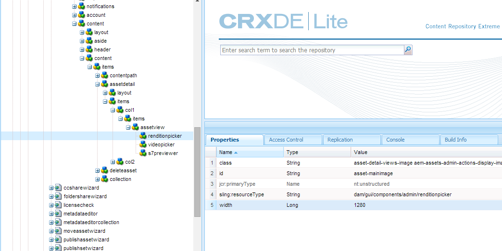
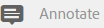
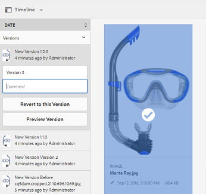

# Administrar los recursos digitales {#managing-assets-with-the-touch-optimized-ui}

Obtenga información sobre las distintas tareas de administración y edición de recursos que puede realizar mediante la interfaz de usuario de AEM Assets táctil.

En este artículo se describe cómo administrar y editar recursos mediante la interfaz de usuario táctil de Adobe Experience Manager (AEM) Assets. Para obtener información básica sobre la interfaz de usuario, consulte [Gestión básica de la IU táctil](/help/sites-authoring/basic-handling.md). Para administrar los fragmentos de contenido, consulte [Administración de fragmentos de contenido](content-fragments-managing.md) recursos.

## Crear carpetas {#create-folders}

Al organizar una colección de recursos, por ejemplo, todas las imágenes `Nature`, puede crear carpetas para mantenerlas juntas. Puede utilizar carpetas para categorizar y organizar los recursos. AEM Assets no requiere que organice los recursos en carpetas para que funcionen mejor.

>[!NOTE]
>
>* No se admite el uso compartido de una carpeta de recursos del tipo `sling:OrderedFolder` al compartirla en el Marketing Cloud. Si desea compartir una carpeta, no seleccione Pedido al crear una carpeta.
>* El Experience Manager no permite usar la palabra `subassets` como nombre de una carpeta. Es una palabra clave reservada para el nodo que contiene subrecursos para los recursos compuestos.

1. Vaya al lugar de la carpeta de recursos digitales donde desee crear una carpeta nueva.
1. En el menú, haga clic en **[!UICONTROL Crear]**. Seleccione **[!UICONTROL Nueva carpeta]**.
1. En el campo **[!UICONTROL Title]**, proporcione un nombre de carpeta. De forma predeterminada, DAM utiliza el título que ha proporcionado como nombre de carpeta. Una vez creada la carpeta, puede anular el valor predeterminado y especificar otro nombre de carpeta.
1. Haga clic en **[!UICONTROL Crear]**. La carpeta se muestra en la carpeta de recursos digitales.

No se admiten los siguientes caracteres (lista de) separados por espacios:

* el nombre del archivo de recursos no debe contener `* / : [ \ \ ] | # % { } ? &`
* el nombre de la carpeta de activos no debe contener `* / : [ \ \ ] | # % { } ? \" . ^ ; + & \t`

## Cargar recursos {#uploading-assets}

Puede cargar varios tipos de recursos (incluidas imágenes, archivos PDF, archivos RAW, etc.) desde la carpeta local o una unidad de red a AEM Assets.

>[!NOTE]
>
>En el modo Dynamic Media - Scene7, solo puede cargar recursos cuyo tamaño de archivo sea de 2 GB o menos.

Puede elegir cargar recursos a carpetas que tengan o no un perfil de procesamiento asignado a ellas.

Para las carpetas que tienen asignado un perfil de procesamiento, el nombre del perfil aparece en la miniatura de la vista de tarjeta. En la vista de lista, el nombre del perfil aparece en la columna **[!UICONTROL Perfil de procesamiento]**. Consulte [Perfiles de procesamiento](processing-profiles.md).

Antes de cargar un recurso, asegúrese de que tiene un [formato admitido](assets-formats.md).

**Para cargar recursos**:

1. En la interfaz web de Assets, vaya a la ubicación en la que desea añadir recursos digitales.
1. Para cargar los recursos, siga uno de estos procedimientos:

   * En la barra de herramientas, pulse el icono **[!UICONTROL Crear]**. A continuación, en el menú, pulse **[!UICONTROL Archivos]**. Si es necesario, puede cambiar el nombre del archivo en el cuadro de diálogo presentado.
   * En un explorador compatible con HTML5, arrastre los recursos directamente en la interfaz. No se muestra el cuadro de diálogo para cambiar el nombre del archivo.

   

   Para seleccionar varios archivos, pulse la tecla Ctrl/Comando y seleccione los recursos en el cuadro de diálogo del selector de archivos. Desde un iPad, solo puede seleccionar un archivo a la vez.

   Puede pausar la carga de recursos grandes (buenos de 500 MB) y reanudarla más tarde desde la misma página. Pulse el icono **[!UICONTROL Pausar]** junto a la barra de progreso que aparece al iniciarse la carga.

   

   El tamaño por encima del cual un recurso se considera un recurso grande se puede configurar. Por ejemplo, puede configurar el sistema para que considere los recursos superiores a 1000 MB (en lugar de 500 MB) como recursos grandes. En este caso, el botón **[!UICONTROL Pause]** de la barra de progreso aparece cuando se cargan recursos de tamaño bueno a más de 1000 MB.

   El botón **[!UICONTROL Pausar]** no muestra si un archivo bueno de más de 1000 MB se carga con un archivo inferior a 1000 MB. Sin embargo, si cancela la carga de menos de 1000 MB, aparece el botón **[!UICONTROL Pausar]**.

   Para modificar el límite de tamaño, configure la propiedad `chunkUploadMinFileSize` del nodo `fileupload`en el repositorio CRX.

   Al hacer clic en el icono **[!UICONTROL Pausar]**, se desplaza a un icono **[!UICONTROL Reproducir]**. Para reanudar la carga, haga clic en el icono **[!UICONTROL Play]**.

   

   Para cancelar una carga continua, haga clic en el botón `X` situado junto a la barra de progreso. Al cancelar la operación de carga, AEM Assets elimina la parte parcialmente cargada del recurso.

   La capacidad de reanudar la carga es especialmente útil en escenarios de bajo ancho de banda y en problemas de red, donde la carga de un recurso grande tarda mucho tiempo. Puede pausar la operación de carga y continuar más tarde cuando mejore la situación. Cuando se reanuda, la carga comienza desde el punto en el que se detuvo.

   Durante la operación de carga, AEM guarda las partes del recurso que se están cargando como fragmentos de datos en el repositorio CRX. Cuando la carga termina, AEM consolida estos fragmentos en un solo bloque de datos en el repositorio.

   Para configurar la tarea de limpieza para los trabajos de carga de bloques no finalizados, vaya a `https://[aem_server]:[port]/system/console/configMgr/org.apache.sling.servlets.post.impl.helper.ChunkCleanUpTask`.

   Si carga un recurso con el mismo nombre que el de un recurso ya disponible en la ubicación donde está cargando el recurso, aparece un cuadro de diálogo de advertencia.

   Puede reemplazar un recurso existente, crear otra versión o conservar ambas cambiando el nombre del nuevo recurso que se carga. Si reemplaza un recurso existente, se eliminarán los metadatos del recurso y cualquier modificación o historial anterior (por ejemplo, anotaciones, cultivos, etc.). Si decide conservar ambos recursos, se cambiará el nombre del nuevo recurso.

   

   >[!NOTE]
   >
   >Cuando selecciona **[!UICONTROL Reemplazar]** en el cuadro de diálogo **[!UICONTROL Conflicto de nombres]**, el ID de recurso se regenera para el nuevo recurso. Este ID es diferente del ID del recurso anterior.
   >
   >Si **[!UICONTROL Asset Insights]** está habilitado para rastrear impresiones/clics con Adobe Analytics, este ID de recurso regenerado invalida los datos capturados para el recurso en Adobe Analytics.

   Si el recurso que carga existe en AEM Assets, el cuadro de diálogo **[!UICONTROL Duplicados detectados]** advierte que está intentando cargar un recurso duplicado. El cuadro de diálogo solo aparece si el valor de suma de comprobación SHA 1 del binario del recurso existente coincide con el valor de suma de comprobación del recurso que se carga. En este caso, los nombres de los activos son insignificantes. En otras palabras, el cuadro de diálogo puede incluso aparecer para recursos que tengan nombres diferentes si los valores SHA 1 para sus binarios son los mismos.

   >[!NOTE]
   >
   >El cuadro de diálogo **[!UICONTROL Duplicados detectados]** solo aparece cuando la función **[!UICONTROL Detección de duplicados]** está habilitada. Para habilitar la función **[!UICONTROL Detección de duplicados]**, consulte [Activación de la detección de duplicados](duplicate-detection.md).

   

   Pulse **[!UICONTROL Mantener]** para conservar el recurso duplicado en AEM Assets. Toque **[!UICONTROL Eliminar]** para eliminar el recurso duplicado que ha cargado.

   AEM Assets impide que se carguen recursos con caracteres prohibidos en sus nombres de archivo. Si intenta cargar un recurso que incluya los caracteres no permitidos, AEM Assets mostrará un mensaje de advertencia con respecto a la presencia de caracteres prohibidos en el nombre del archivo y detendrá la carga hasta que quite estos caracteres o cargue con un nombre permitido.

   Para adaptarla a las convenciones específicas de nomenclatura de archivos de su organización, el cuadro de diálogo **[!UICONTROL Cargar recursos]** le permite especificar nombres largos para los archivos que carga.

   

   Sin embargo, no se admiten los siguientes caracteres (lista de) separados por espacios:
   * el nombre del archivo de recursos no debe contener `* / : [ \ \ ] | # % { } ? &`
   * el nombre de la carpeta de activos no debe contener `* / : [ \ \ ] | # % { } ? \" . ^ ; + & \t`

   Además, la interfaz Recursos muestra el recurso más reciente que se carga o la carpeta que se crea primero en todas las vistas (**[!UICONTROL Vista de tarjeta]**, **[!UICONTROL Vista de lista]** y **[!UICONTROL Vista de columna]**).

   A menudo, mientras se cargan recursos de gran tamaño o varios recursos simultáneamente, los indicadores visuales permiten evaluar el progreso. El cuadro de diálogo **[!UICONTROL Progreso de carga]** muestra el recuento de los archivos cargados correctamente y los archivos que no se cargaron.

   

   Si cancela la operación de carga antes de que se carguen los archivos, AEM Assets deja de cargar el archivo actual y actualiza el contenido. Sin embargo, los archivos que ya se han cargado no se eliminan.

### Cargas serie {#serial-uploads}

La carga masiva de numerosos recursos consume importantes recursos del sistema, lo que puede afectar negativamente al rendimiento de la implementación de AEM. Los posibles cuellos de botella pueden ser la conexión a Internet, las operaciones de lectura y escritura en disco, las limitaciones del explorador web en el número de solicitudes de POST al cargar recursos simultáneamente. La operación de carga masiva puede fallar o finalizar prematuramente. En otras palabras, AEM recursos pueden perder algunos archivos al ingerir un conjunto de archivos o no pueden ingerir ningún archivo.

Para superar esta situación, AEM Assets ingesta un recurso a la vez (carga serie) durante una operación de carga masiva, en lugar de ingerir simultáneamente todos los recursos.

La carga serie de recursos está activada de forma predeterminada. Para desactivar la función y permitir la carga simultánea, superponga el nodo `fileupload` en CRXDe y establezca el valor de la propiedad `parallelUploads` en `true`.

### Carga de recursos mediante FTP {#uploading-assets-using-ftp}

Dynamic Media permite la carga por lotes de recursos mediante el servidor FTP. Si tiene intención de cargar recursos de gran tamaño (>1 GB) o carpetas y subcarpetas enteras, debe usar FTP. Incluso puede configurar la carga FTP para que se produzca de forma programada y recurrente.

>[!NOTE]
>
>En el modo Dynamic Media - Scene7, solo puede cargar recursos cuyo tamaño de archivo sea de 2 GB o menos.

>[!NOTE]
>
>Para cargar recursos mediante FTP en Dynamic Media: modo Scene7, instale feature pack (FP) 18912 en AEM autor. Póngase en contacto con el Servicio de atención al cliente de Adobe para obtener acceso a FP-18912 y completar la configuración de su cuenta de FTP. Consulte [Instalación del paquete de características 18912 para la migración masiva de recursos](/help/assets/bulk-ingest-migrate.md).
>
>Si utiliza FTP para cargar recursos, se ignorará la configuración de carga especificada en AEM. En su lugar, se utilizan las reglas de procesamiento de archivos, tal como se definen en Dynamic Media Classic.

**Para cargar recursos mediante FTP**

1. Con el cliente FTP que elija, inicie sesión en el servidor FTP con el nombre de usuario y la contraseña de FTP que recibió del correo electrónico de aprovisionamiento. En el cliente FTP, cargue archivos o carpetas en el servidor FTP.
1. Abra la [aplicación de escritorio de Dynamic Media Classic](https://experienceleague.adobe.com/docs/dynamic-media-classic/using/getting-started/signing-out.html#getting-started) e inicie sesión en su cuenta con las credenciales recibidas del correo electrónico de aprovisionamiento.
1. En la barra de navegación global, pulse **[!UICONTROL Cargar]**.
1. En la página **[!UICONTROL Upload]**, cerca de la esquina superior izquierda, pulse la pestaña **[!UICONTROL Via FTP]**.
1. En la parte izquierda de la página, seleccione una carpeta FTP desde la que cargar los archivos. a la derecha de la página, elija una carpeta de destino.
1. Cerca de la esquina inferior derecha de la página, pulse **[!UICONTROL Opciones de trabajo]** y, a continuación, defina las opciones que desee en función de los recursos de la carpeta seleccionada.

   Consulte [Cargar opciones de trabajo](#upload-job-options).

   >[!NOTE]
   >
   >Al cargar recursos mediante FTP, las opciones de trabajo de carga que defina en Dynamic Media Classic prevalecerán sobre los parámetros de procesamiento de recursos establecidos en AEM.

1. En la esquina inferior derecha del cuadro de diálogo **[!UICONTROL Opciones de carga de trabajo]**, pulse **[!UICONTROL Guardar]**.
1. En la esquina inferior derecha de la página **[!UICONTROL Cargar]**, pulse **[!UICONTROL Enviar carga]**.

   Para ver el progreso de la carga, en la barra de navegación global, pulse **[!UICONTROL Trabajos]**. La página **[!UICONTROL Trabajos]** muestra el progreso de la carga. Puede continuar trabajando en AEM y volver a la página Trabajos de Dynamic Media Classic en cualquier momento para revisar un trabajo en curso.

   Para cancelar un trabajo de carga en curso, pulse **[!UICONTROL Cancelar]** junto al tiempo **[!UICONTROL Duración]**.

#### Cargar opciones de trabajo {#upload-job-options}

| Opción Cargar | Subopción | Descripción |
|---|---|---|
| Nombre del trabajo |  | El nombre predeterminado que se rellena previamente en el campo de texto incluye la parte introducida por el usuario del nombre y la marca de fecha y hora. Puede utilizar el nombre predeterminado o introducir un nombre de su propia creación para este trabajo de carga.  El trabajo y otros trabajos de carga y publicación se registran en la página Trabajos, donde puede comprobar el estado de los trabajos. |
| Publicar después de la carga |  | Publica automáticamente los recursos que se cargan. |
| Sobrescribir en cualquier carpeta, el mismo nombre de recurso base independientemente de la extensión |  | Seleccione esta opción si desea que los archivos cargados reemplacen los archivos existentes con los mismos nombres. El nombre de esta opción puede ser diferente, dependiendo de la configuración en **[!UICONTROL Configuración de la aplicación]** > **[!UICONTROL Configuración general]** > **[!UICONTROL Cargar a la aplicación]** > **[!UICONTROL Sobrescribir imágenes]**. |
| Descomprima archivos ZIP o TAR al cargar |  |  |
| Opciones de trabajo |  | Toque o haga clic en **[!UICONTROL Opciones de trabajo]** para abrir el cuadro de diálogo [!UICONTROL Opciones de carga de trabajo] y elegir las opciones que afectan a todo el trabajo de carga. Estas opciones son las mismas para todos los tipos de archivo. Puede elegir las opciones predeterminadas para cargar archivos que comiencen en la página Configuración general de la aplicación . Para abrir esta página, seleccione **[!UICONTROL Configuración]** > **[!UICONTROL Configuración de la aplicación]**. Pulse el botón **[!UICONTROL Opciones de carga predeterminadas]** para abrir el cuadro de diálogo [!UICONTROL Opciones de carga de trabajo]. |
|  | Cuando | Seleccione Único o Recurrente. Para configurar un trabajo recurrente, elija una opción de repetición (Diario, Semanal, Mensual o Personalizado) para especificar cuándo desea que se repita el trabajo de carga de FTP. A continuación, especifique las opciones de programación según sea necesario. |
|  | Incluir subcarpetas | Cargue todas las subcarpetas dentro de la carpeta que desee cargar. Los nombres de la carpeta y sus subcarpetas que cargue se introducen automáticamente en AEM Assets. |
|  | Opciones de recorte | Para recortar manualmente desde los lados de una imagen, seleccione el menú Recortar y elija Manual. A continuación, introduzca el número de píxeles que desea recortar desde cualquier lado o cada lado de la imagen. La cantidad de imagen recortada depende de la configuración de ppi (píxeles por pulgada) en el archivo de imagen. Por ejemplo, si la imagen muestra 150 ppp y especifica 75 en los cuadros de texto Superior, Derecha, Inferior e Izquierda, se recortará media pulgada de cada lado.  Para recortar automáticamente píxeles de espacio en blanco de una imagen, abra el menú Recortar, seleccione Manual e introduzca medidas de píxeles en los campos Superior, Derecha, Inferior e Izquierda para recortar desde los lados. También puede elegir Recortar en el menú Recortar y elegir estas opciones:  **Separar en función de** <ul><li>**Color** : elija la opción Color. A continuación, seleccione el menú Esquina y elija la esquina de la imagen con el color que mejor represente el color de espacio en blanco que desea recortar.</li><li>**Transparencia** : elija la opción Transparencia.  **Tolerancia** : arrastre el control deslizante para especificar una tolerancia de 0 a 1. Para recortar en función del color, especifique 0 para recortar píxeles solo si coinciden exactamente con el color seleccionado en la esquina de la imagen. Los números más cercanos a 1 permiten una mayor diferencia de color. Para recortar en función de la transparencia, especifique 0 para recortar píxeles solo si son transparentes. Los números más cercanos a 1 permiten una mayor transparencia.</li></ul> Tenga en cuenta que estas opciones de recorte no son destructivas. |
|  | Opciones de perfil de color | Elija una conversión de color cuando cree archivos optimizados que se utilicen para la entrega:<ul><li>Conservación de color predeterminada: Mantiene los colores de la imagen de origen siempre que las imágenes contienen información de espacio de color; no hay conversión de color. Casi todas las imágenes de hoy tienen el perfil de color adecuado ya incrustado. Sin embargo, si una imagen de origen CMYK no contiene un perfil de color incrustado, los colores se convierten en espacios de color sRGB (azul verde rojo estándar). sRGB es el espacio de color recomendado para mostrar imágenes en páginas web.</li><li>Mantener espacio de color original: Conserva los colores originales sin ninguna conversión de color en el punto. En el caso de las imágenes sin un perfil de color incrustado, cualquier conversión de color se realiza mediante los perfiles de color predeterminados configurados en la configuración de publicación. Es posible que los perfiles de color no estén alineados con el color de los archivos creados con esta opción. Por lo tanto, se le recomienda utilizar la opción Conservación de color predeterminada.</li><li>Personalizar de > A  Abre los menús para que pueda elegir un espacio de color Convertir de y Convertir en . Esta opción avanzada anula cualquier información de color incrustada en el archivo de origen. Seleccione esta opción cuando todas las imágenes que envía contienen datos de perfil de color incorrectos o que faltan.</li></ul> |
|  | Opciones de edición de imágenes | Puede conservar las máscaras de recorte en las imágenes y elegir un perfil de color.  Consulte  [Configuración de las opciones de edición de imágenes al cargar](#setting-image-editing-options-at-upload). |
|  | Opciones de Postscript | Puede rasterizar archivos de PostScript®, recortar archivos, mantener fondos transparentes, elegir una resolución y elegir un espacio de color.  Consulte  [Configuración de las opciones de carga de PostScript y Illustrator](#setting-postscript-and-illustrator-upload-options). |
|  | Opciones de Photoshop | Puede crear plantillas a partir de archivos Photoshop® de Adobe®, mantener las capas, especificar el nombre de las capas, extraer texto y especificar cómo se anclan las imágenes en las plantillas.  Tenga en cuenta que las plantillas no son compatibles con AEM.  Consulte  [Configuración de las opciones de carga de Photoshop](#setting-photoshop-upload-options). |
|  | Opciones de PDF | Puede rasterizar los archivos, extraer palabras de búsqueda y vínculos, generar automáticamente un catálogo electrónico, establecer la resolución y elegir un espacio de color.  Tenga en cuenta que los catálogos electrónicos no son compatibles con AEM.   Consulte  [Configuración de opciones de carga de PDF](#setting-pdf-upload-options). |
|  | Opciones de Illustrator | Puede rasterizar archivos Adobe Illustrator®, mantener fondos transparentes, elegir una resolución y elegir un espacio de color.  Consulte  [Configuración de las opciones de carga de PostScript y Illustrator](#setting-postscript-and-illustrator-upload-options). |
|  | Opciones de eVideo | Puede transcodificar un archivo de vídeo eligiendo un ajuste preestablecido de vídeo.  Consulte  [Configuración de las opciones de carga de eVideo](#setting-evideo-upload-options). |
|  | Valores preestablecidos de conjunto por lotes | Para crear un conjunto de imágenes o un conjunto de giros a partir de los archivos cargados, haga clic en la columna Activo del ajuste preestablecido que desee utilizar. Puede seleccionar más de un ajuste preestablecido. Los ajustes preestablecidos se crean en la página Ajustes de aplicación/Ajustes preestablecidos de conjunto de lotes de Dynamic Media Classic.  Consulte  [Configuración de ajustes preestablecidos de conjuntos de lotes para generar automáticamente conjuntos de imágenes y conjuntos de giros ](config-dms7.md#creating-batch-set-presets-to-auto-generate-image-sets-and-spin-sets) para obtener más información sobre la creación de ajustes preestablecidos de conjuntos de lotes.  Consulte  [Configuración de ajustes preestablecidos de conjuntos de lotes al cargar](#setting-batch-set-presets-at-upload). |

#### Definir opciones de edición de imágenes al cargar {#setting-image-editing-options-at-upload}

Al cargar archivos de imagen, incluidos archivos AI, EPS y PSD, puede realizar las siguientes acciones de edición en el cuadro de diálogo **[!UICONTROL Opciones de carga de trabajo]**:

* Recorte los espacios en blanco desde el borde de las imágenes (consulte la descripción en la tabla anterior).
* Recortar manualmente desde los lados de las imágenes (consulte la descripción en la tabla anterior).
* Elija un perfil de color (consulte la descripción de la opción en la tabla anterior).
* Cree una máscara a partir de una ruta de recorte.
* Enfoque de imágenes con opciones de máscara de enfoque
* Contexto

| Opción | Subopción | Descripción |
|---|---|---|
| Crear máscara a partir de la ruta de recorte |  | Cree una máscara para la imagen en función de su información de ruta de recorte. Esta opción se aplica a las imágenes creadas con aplicaciones de edición de imágenes en las que se creó una ruta de recorte. |
| Enmascaramiento de enfoque |  | Permite ajustar un efecto de filtro de enfoque en la imagen final con disminución de resolución, controlando la intensidad del efecto, el radio del efecto (medido en píxeles) y un umbral de contraste que se ignora.  Este efecto utiliza las mismas opciones que el filtro Máscara de enfoque de Photoshop. Contrariamente a lo que sugiere el nombre, Máscara de enfoque es un filtro de enfoque. En Enmascaramiento de enfoque, defina las opciones que desee. Las opciones de configuración se describen en lo siguiente: |
|  | Cantidad | Controla la cantidad de contraste que se aplica a los píxeles de borde.  Piensen en ello como la intensidad del efecto. La principal diferencia entre los valores de cantidad de Máscara de enfoque en Dynamic Media y los valores de cantidad en Adobe Photoshop es que Photoshop tiene un rango de cantidad de 1% a 500%. Considerando que, en Dynamic Media, el intervalo de valores es de 0,0 a 5,0. Un valor de 5,0 es el equivalente aproximado del 500 % en Photoshop; un valor de 0,9 es el equivalente a 90 %, etc. |
|  | Radio | Controla el radio del efecto. El rango de valores es 0-250.  El efecto se ejecuta en todos los píxeles de una imagen y se irradia desde todos los píxeles en todas las direcciones. El radio se mide en píxeles. Por ejemplo, para obtener un efecto de nitidez similar para una imagen de 2000 x 2000 píxeles y una imagen de 500 x 500 píxeles, establecería un radio de dos píxeles en la imagen de 2000 x 2000 píxeles y un valor de radio de un píxel en la imagen de 500 x 500 píxeles. Se utiliza un valor mayor para una imagen que tiene más píxeles. |
|  | Umbral | El umbral es un intervalo de contraste que se ignora cuando se aplica el filtro Máscara de enfoque. Es importante para que no se introduzca ningún &quot;ruido&quot; en una imagen cuando se utilice este filtro. El rango de valores es 0-255, que es el número de pasos de brillo en una imagen en escala de grises. 0=negro, 128=50% gris y 255=blanco.  Por ejemplo, un valor de umbral de 12 ignora las ligeras variaciones en el brillo del tono de la piel para evitar agregar ruido, pero aun así agrega contraste de borde a áreas de contraste como donde las pestañas tocan la piel.  Por ejemplo, si tiene una foto de la cara de alguien, la máscara de enfoque afecta a las partes de contraste de la imagen, como cuando las pestañas y la piel se encuentran para crear un área obvia de contraste, y la piel suave en sí. Incluso la piel más suave presenta cambios sutiles en los valores de brillo. Si no utiliza un valor de umbral, el filtro acentúa estos cambios sutiles en los píxeles de la piel. A su vez, se crea una reacción ruidosa e indeseable mientras que aumenta el contraste en las pestañas, mejorando la nitidez.  Para evitar este problema, se introduce un valor de umbral que indica al filtro que ignore los píxeles que no cambian el contraste de forma drástica, como la piel suave.  En el gráfico de cierre mostrado anteriormente, observe la textura junto a los tapones. El ruido de la imagen se muestra porque los valores de umbral eran demasiado bajos para suprimir el ruido. |
|  | Monocromo | Seleccione para aplicar máscara de enfoque al brillo (intensidad) de la imagen.  Anule la selección para desenmascarar cada componente de color por separado. |
| Contexto |  | Elimina automáticamente el fondo de una imagen al cargarla. Esta técnica es útil para llamar la atención sobre un objeto concreto y hacer que destaque desde un fondo ocupado. Seleccione para activar o desactivar la función Fondo de Knockout y las siguientes subopciones: |
|  | Esquina | Requerido.  Esquina de la imagen que se utiliza para definir el color de fondo para la knockout.  Puede elegir entre  **Superior izquierda**,  **Inferior izquierda**,  **Superior derecha** o  **Inferior derecha**. |
|  | Método de relleno | Requerido.  Controla la transparencia de píxeles desde la ubicación Esquina que haya establecido.  Puede elegir entre los siguientes métodos de relleno: <ul><li>**Relleno de Flood** : hace que todos los píxeles sean transparentes y coincidan con la Esquina que haya especificado y estén conectados a ella.</li><li>**Hacer coincidir píxel** : hace que todos los píxeles coincidentes sean transparentes, independientemente de su ubicación en la imagen.</li></ul> |
|  | Tolerancia | Opcional.  Controla la cantidad permitida de variación en la coincidencia de color de píxeles en función de la ubicación de Esquina que haya establecido.  Utilice un valor de 0,0 para que coincidan exactamente con los colores de los píxeles, o utilice un valor de 1,0 para permitir la variación buena. |

#### Establecer las opciones de carga de PostScript y Illustrator {#setting-postscript-and-illustrator-upload-options}

Al cargar archivos de imagen PostScript (EPS) o Illustrator (AI), puede aplicarles formato de varias formas. Puede rasterizar los archivos, mantener el fondo transparente, elegir una resolución y elegir un espacio de color. Las opciones para dar formato a archivos PostScript y Illustrator están disponibles en el cuadro de diálogo Opciones de carga de trabajo en Opciones de PostScript y Opciones de Illustrator.

| Opción | Subopción | Descripción |
|---|---|---|
| Procesando |  | Elija **[!UICONTROL Rasterizar]** para convertir los gráficos vectoriales del archivo al formato de mapa de bits. |
| Mantener fondo transparente en imagen representada |  | Mantener la transparencia en segundo plano del archivo. |
| Resolución |  | Determina la configuración de resolución. Esta configuración determina cuántos píxeles se muestran por pulgada en el archivo. |
| Espacio color |  | Seleccione el menú Espacio de color y elija entre las siguientes opciones de espacio de color: |
|  | Detectar automáticamente | Conserva el espacio de color del archivo. |
|  | Forzar como RGB | Se convierte al espacio de color RGB. |
|  | Forzar como CMYK | Se convierte al espacio de color CMYK. |
|  | Forzar como escala de grises | Se convierte al espacio de color de escala de grises. |

#### Definir las opciones de carga de Photoshop {#setting-photoshop-upload-options}

Los archivos PSD (documento de Photoshop) se utilizan habitualmente para crear plantillas de imagen. Al cargar un archivo PSD, puede crear una plantilla de imagen automáticamente a partir del archivo (seleccione la opción Crear plantilla en la pantalla Cargar ).

Dynamic Media crea varias imágenes a partir de un archivo PSD con capas si utiliza el archivo para crear una plantilla; crea una imagen para cada capa.

Utilice las **[!UICONTROL Opciones de recorte]** y **[!UICONTROL Opciones de perfil de color]** descritas anteriormente con las opciones de carga de Photoshop.

>[!NOTE]
>
>Las plantillas no son compatibles con AEM.

| Opción | Subopción | Descripción |
|---|---|---|
| Mantener capas |  | Extrae las capas del PSD, si las hay, en recursos individuales. Las capas de recursos permanecen asociadas al PSD. Puede verlos abriendo el archivo PSD en la vista de detalles y seleccionando el panel de capa. |
| Crear plantilla |  | Crea una plantilla a partir de las capas del archivo PSD. |
| Extraer texto |  | Extrae el texto para que los usuarios puedan buscar texto en un visualizador. |
| Ampliación de las capas al tamaño de fondo |  | Amplía el tamaño de las capas de imagen recortadas al tamaño de la capa de fondo. |
| Asignación de nombres a capas |  | Las capas del archivo PSD se cargan como imágenes independientes. |
|  | Nombre de capa | Nombra las imágenes según sus nombres de capa en el archivo PSD. Por ejemplo, una capa denominada Etiqueta de precio en el archivo PSD original se convierte en una imagen denominada Etiqueta de precio. Sin embargo, si los nombres de capa del archivo PSD son nombres de capa predeterminados de Photoshop (Fondo, Capa 1, Capa 2, etc.), las imágenes reciben el nombre de sus números de capa en el archivo PSD, no de sus nombres de capa predeterminados. |
|  | Photoshop y número de capa | Nombra las imágenes según sus números de capa en el archivo PSD, ignorando los nombres de capa originales. Las imágenes reciben el nombre del archivo Photoshop y un número de capa anexado. Por ejemplo, la segunda capa de un archivo llamado Spring Ad.psd se llama Spring Ad_2 aunque tenga un nombre no predeterminado en Photoshop. |
|  | Photoshop y nombre de capa | Nombra las imágenes después del archivo PSD seguido del nombre de la capa o el número de capa. El número de capa se utiliza si los nombres de capa del archivo PSD son nombres de capa predeterminados de Photoshop. Por ejemplo, una capa denominada Price Tag en un archivo PSD llamado SpringAd se llama Spring Ad_Price Tag. Una capa con el nombre predeterminado Capa 2 se llama Anuncio de primavera_2. |
| Ancla |  | Especifique cómo se anclan las imágenes en plantillas generadas a partir de la composición en capas producida a partir del archivo PSD. De forma predeterminada, el anclaje es el centro. Un anclaje central permite que las imágenes de reemplazo ocupen el mismo espacio, independientemente de la proporción de aspecto de la imagen de reemplazo. Las imágenes con un aspecto diferente que reemplazan a esta imagen, al hacer referencia a la plantilla y utilizar la sustitución de parámetros, ocupan efectivamente el mismo espacio. Cambie a una configuración diferente si la aplicación requiere que las imágenes de reemplazo rellenen el espacio asignado en la plantilla. |

#### Definir opciones de carga de PDF {#setting-pdf-upload-options}

Al cargar un archivo PDF, puede aplicarle formato de varias formas. Recorte sus páginas, extraiga palabras de búsqueda, introduzca una resolución de píxeles por pulgada y elija un espacio de color. Los archivos PDF suelen contener un margen de recorte, marcas de recorte, marcas de registro y otras marcas de impresora. Puede recortar estas marcas desde los lados de las páginas a medida que carga un archivo PDF.

>[!NOTE]
>
>Los catálogos electrónicos no son compatibles con AEM.

Elija entre las siguientes opciones:

| Opción | Subopción | Descripción |
|---|---|---|
| Procesando | Rasterizar | (Predeterminado) Extrae las páginas del archivo PDF y convierte los gráficos vectoriales en imágenes de mapa de bits. Elija esta opción para crear un catálogo electrónico. |
| Extraer | Palabras de búsqueda | Extrae palabras del archivo PDF para que el archivo se pueda buscar por palabra clave en un visor de catálogos electrónicos. |
|  | Vínculos | Extrae vínculos de los archivos PDF y los convierte en mapas de imágenes que se utilizan en un visor de catálogos electrónicos. |
| Generación automática de catálogos electrónicos a partir de PDF de varias páginas |  | Crea automáticamente un catálogo electrónico a partir del archivo PDF. El Catálogo electrónico recibe el nombre del archivo PDF que ha cargado. (Esta opción solo está disponible si rasteriza el archivo PDF al cargarlo). |
| Resolución |  | Determina la configuración de resolución. Esta configuración determina cuántos píxeles se muestran por pulgada en el archivo PDF. El valor predeterminado es 150. |
| Espacio color |  | Seleccione el menú Espacio de color y elija un espacio de color para el archivo PDF. La mayoría de los archivos PDF tienen imágenes en color RGB y CMYK. El espacio de color RGB es preferible para la visualización en línea. |
|  | Detectar automáticamente | Conserva el espacio de color del archivo PDF. |
|  | Forzar como RGB | Se convierte al espacio de color RGB. |
|  | Forzar como CMYK | Se convierte al espacio de color CMYK. |
|  | Forzar como escala de grises | Se convierte al espacio de color de escala de grises. |

#### Definir las opciones de carga de eVideo {#setting-evideo-upload-options}

Puede transcodificar un archivo de vídeo eligiendo entre varios ajustes preestablecidos de vídeo.

| Opción | Subopción | Descripción |
|---|---|---|
| Vídeo adaptable |  | Un ajuste preestablecido de codificación único que funciona con cualquier proporción de aspecto para crear vídeos para su envío a dispositivos móviles, tabletas y equipos de escritorio. Los vídeos de origen cargados que se codifican con este ajuste preestablecido se configuran con una altura fija. Sin embargo, la anchura se escala automáticamente para conservar la proporción de aspecto del vídeo.  Una práctica recomendada es utilizar la codificación de vídeo adaptable. |
| Ajustes preestablecidos de codificación única | Ordenar ajustes preestablecidos de codificación | Seleccione Nombre o Tamaño para ordenar los ajustes preestablecidos de codificación enumerados en Escritorio, Móvil y Tablet por nombre o por tamaño de resolución. |
|  | Escritorio | Cree un archivo MP4 para ofrecer una experiencia de vídeo progresivo o de flujo continuo a los equipos de escritorio. Seleccione una o varias relaciones de aspecto con el tamaño de resolución y la velocidad de datos de destino que desee. |
|  | Móvil | Cree un archivo MP4 para enviarlo a dispositivos móviles iPhone o Android. Seleccione una o varias relaciones de aspecto con el tamaño de resolución y la velocidad de datos de destino que desee. |
|  | Tablet | Cree un archivo MP4 para enviarlo a dispositivos iPad o tableta Android. Seleccione una o varias relaciones de aspecto con el tamaño de resolución y la velocidad de datos de destino que desee. |

#### Definir ajustes preestablecidos de conjuntos de lotes al cargar {#setting-batch-set-presets-at-upload}

Si desea crear automáticamente un conjunto de imágenes o un conjunto de giros a partir de imágenes cargadas, haga clic en la columna **[!UICONTROL Activo]** del ajuste preestablecido que desee utilizar. Puede seleccionar más de un ajuste preestablecido.

Consulte [Configuración de ajustes preestablecidos de conjuntos de lotes para generar automáticamente conjuntos de imágenes y conjuntos de giros](config-dms7.md#creating-batch-set-presets-to-auto-generate-image-sets-and-spin-sets) para obtener más información sobre la creación de ajustes preestablecidos de conjuntos de lotes.

### Cargas por transmisión {#streamed-uploads}

Si carga numerosos recursos, las llamadas de E/S al servidor de AEM aumentan drásticamente, lo que reduce la eficacia de la carga e incluso puede hacer que se agote el tiempo de espera. AEM Assets admite la carga por secuencias de recursos. La carga por secuencias reduce la E/S de disco durante la operación de carga al evitar el almacenamiento de recursos en una carpeta temporal del servidor antes de copiarlo en el repositorio. En su lugar, los datos se transfieren directamente al repositorio. De este modo, se reduce el tiempo de carga de recursos grandes y la posibilidad de tiempos de espera. La carga de flujo continuo está habilitada de forma predeterminada en AEM Assets.

La carga de transmisión está deshabilitada para AEM que se ejecuta en el servidor JEE con una versión de servlet-api inferior a 3.1.

### Extraer archivo ZIP que contiene recursos {#extract-zip-archive-containing-assets}

Puede cargar archivos ZIP como cualquier otro recurso admitido. Las mismas reglas de nombre de archivo se aplican a los archivos ZIP. AEM permite extraer un archivo ZIP a una ubicación DAM.

Seleccione un archivo ZIP a la vez, haga clic en **[!UICONTROL Extraer archivo]** y seleccione una carpeta de destino. Seleccione una opción para gestionar conflictos, si los hay. Si los recursos del archivo ZIP ya existen en la carpeta de destino, puede seleccionar una de estas opciones: omita la extracción, reemplace los archivos existentes, mantenga ambos recursos cambiando el nombre o cree una nueva versión.

Una vez finalizada la extracción, AEM le notifica en el área de notificación. Mientras AEM extrae el ZIP, puede volver al trabajo sin interrumpir la extracción.

Algunas limitaciones de la función son:

* Si existe una carpeta con el mismo nombre en el destino, los recursos del archivo ZIP se extraen en la carpeta existente.

* Si cancela la extracción, los recursos ya extraídos no se eliminarán.

* No puede seleccionar dos archivos ZIP al mismo tiempo y extraerlos. Solo puede extraer un archivo ZIP a la vez.

## Vista previa de recursos {#previewing-assets}

**Para previsualizar recursos**:

1. En la interfaz de usuario de Assets, vaya a la ubicación del recurso cuya vista previa desee ver.
1. Puntee en el recurso que desee para abrirlo.

1. En el modo de vista previa, las opciones de zoom están disponibles para [tipos de imagen admitidos](assets-formats.md#supported-raster-image-formats) (con edición interactiva).

   Para acercar un recurso, pulse **[!UICONTROL +]** (o pulse la lupa del recurso). Para reducir, pulse **[!UICONTROL -]**. Al acercar el zoom, puede observar de cerca cualquier área de la imagen mediante la panorámica. La flecha **[!UICONTROL Restablecer zoom]** le devuelve a la vista original.

   

   Pulse el botón **[!UICONTROL Reset]** para restablecer la vista al tamaño original.

   

>[!MORELIKETHIS]
>
>* [Vista previa de Dynamic Media Assets](/help/assets/previewing-assets.md).
>* [Ver subrecursos](managing-linked-subassets.md#viewing-subassets).

## Editar propiedades {#editing-properties}

1. Navegue a la ubicación del recurso cuyos metadatos desee editar.

1. Seleccione el recurso y pulse **[!UICONTROL Propiedades]** en la barra de herramientas para ver las propiedades del recurso. Como alternativa, seleccione la acción rápida **[!UICONTROL Properties]** en la tarjeta del recurso.

   

1. En la página **[!UICONTROL Propiedades]**, edite las propiedades de los metadatos en varias pestañas. Por ejemplo, en la ficha **[!UICONTROL Básico]**, edite el título, la descripción, etc.

   El diseño de la página **[!UICONTROL Properties]** y las propiedades de metadatos disponibles dependen del esquema de metadatos subyacente. Para obtener información sobre cómo modificar el diseño de la página **[!UICONTROL Properties]**, consulte [Esquemas de metadatos](metadata-schemas.md).

1. Para programar una fecha y hora determinada para la activación del recurso, utilice el selector de fechas situado junto al campo **[!UICONTROL Tiempo de activación]**.

   

1. Para desactivar el recurso después de una duración determinada, seleccione la fecha y la hora de desactivación del selector de fechas situado junto al campo **[!UICONTROL Tiempo de desactivación]**.

   La fecha de desactivación debe ser posterior a la fecha de activación de un recurso. Después del [!UICONTROL Tiempo de inactividad], un recurso y sus representaciones no están disponibles a través de la interfaz web de Assets o a través de la API HTTP.

   

1. En el campo **[!UICONTROL Etiquetas]**, seleccione una o varias etiquetas. Para agregar una etiqueta personalizada, escriba el nombre de la etiqueta en el cuadro y presione **[!UICONTROL Enter]**. La nueva etiqueta se guarda en AEM.

   YouTube requiere que las etiquetas se publiquen y que tengan un vínculo a YouTube (si se encuentra un vínculo adecuado).
Para crear etiquetas, necesita permiso de escritura para `/content/cq:tags/default` en el repositorio CRX.

1. Para clasificar el recurso, pulse la pestaña **[!UICONTROL Avanzado]** y, a continuación, pulse la estrella en la posición adecuada para asignar la clasificación deseada.

   

   La puntuación de clasificación que asigna al recurso se muestra en **[!UICONTROL Sus clasificaciones]**. La puntuación de clasificación promedio que el recurso recibió de los usuarios que calificaron el recurso se muestra en **[!UICONTROL Clasificación]**. Además, el desglose de las puntuaciones de clasificación que contribuyen a la puntuación de clasificación promedio se muestra en **[!UICONTROL Desglose de clasificación]**. Puede buscar recursos en función de puntuaciones de clasificación promedio.

1. Para ver las estadísticas de uso del recurso, pulse la pestaña **[!UICONTROL Insights]**.

   Las estadísticas de uso incluyen lo siguiente:

   * Número de veces que se ha visto o descargado el recurso.
   * Canales/dispositivos a través de los cuales se utilizó el recurso.
   * Soluciones creativas en las que se ha utilizado recientemente el recurso.

   Para obtener más información, consulte [Assets Insights](touch-ui-asset-insights.md).

1. Toque **[!UICONTROL Guardar y cerrar]**.
1. Vaya a la interfaz de usuario de Assets. Las propiedades de metadatos editadas, como el título, la descripción, las clasificaciones, etc., se muestran en la tarjeta de recursos de la vista de tarjeta y en las columnas relevantes de la vista de lista.

## Copiar recursos {#copying-assets}

Al copiar un recurso o una carpeta, se copia todo el recurso o la carpeta, junto con su estructura de contenido. Un recurso copiado o una carpeta se duplica en la ubicación de destino. El recurso en la ubicación de origen no se modifica.

No se arrastran algunos atributos que son exclusivos de una copia concreta de un recurso. Algunos ejemplos son:

* ID del recurso, fecha y hora de creación, versiones e historial de versiones. Algunas de estas propiedades están indicadas por las propiedades `jcr:uuid`, `jcr:created` y `cq:name`.

* El tiempo de creación y las rutas a las que se hace referencia son únicos para cada recurso y cada una de sus representaciones.

La información de otras propiedades y metadatos se conserva. No se crea una copia parcial al copiar un recurso.

1. En la interfaz de usuario de Assets, seleccione uno o varios recursos y, a continuación, pulse el icono **[!UICONTROL Copiar]** en la barra de herramientas. Como alternativa, seleccione la acción rápida **[!UICONTROL Copiar]** en la tarjeta del recurso.

   

   >[!NOTE]
   >
   >Si utiliza la acción rápida **[!UICONTROL Copy]**, solo puede copiar un recurso a la vez.

1. Desplácese a la ubicación en la que desee copiar los recursos.

   >[!NOTE]
   >
   >Si copia un recurso en la misma ubicación, AEM genera automáticamente una variación del nombre. Por ejemplo, si copia un recurso llamado Cuadrado, AEM genera automáticamente el título de su copia como Cuadrado1.

1. Pulse el icono de recurso **[!UICONTROL Pegar]** de la barra de herramientas:

   

   Los recursos se copian en esta ubicación.

   >[!NOTE]
   >
   >El icono **[!UICONTROL Pegar]** está disponible en la barra de herramientas hasta que se complete la operación de pegado.

## Mover y cambiar el nombre de los recursos {#moving-or-renaming-assets}

Cuando se mueven recursos (o carpetas) a otra ubicación, los recursos (o carpetas) no se duplican, a diferencia de lo que sucede con la copia del recurso. Los recursos (o las carpetas) se colocan en la ubicación de destino y se eliminan de la ubicación de origen. También puede cambiar el nombre del recurso al moverlo a la nueva ubicación. Si está moviendo un recurso publicado a una ubicación diferente, tiene la opción de volver a publicar el recurso. De forma predeterminada, la operación de movimiento en un recurso publicado anula la publicación automáticamente. El recurso movido se vuelve a publicar si el autor selecciona la opción [!UICONTROL Volver a publicar] al mover el recurso.

Para mover recursos o carpetas:

1. Navegue a la ubicación del recurso que desee mover.

Para mover recursos o carpetas:

1. Navegue a la ubicación del recurso que desee mover.

1. Seleccione el recurso y haga clic en la opción **[!UICONTROL Mover]** en la barra de herramientas.
   

1. En el asistente [!UICONTROL Mover recursos], realice una de las siguientes acciones:

   * Especifique el nombre del recurso cuando se haya desplazado. A continuación, haga clic en **[!UICONTROL Siguiente]** para continuar.

   * Haga clic en **[!UICONTROL Cancelar]** para detener el proceso.
   >[!NOTE]
   >
   >* Puede especificar el mismo nombre para el recurso si no hay ningún recurso con ese nombre en la nueva ubicación. Sin embargo, debe utilizar un nombre diferente si mueve el recurso a una ubicación donde exista un recurso con el mismo nombre. Si utiliza el mismo nombre, el sistema genera automáticamente una variación del nombre. Por ejemplo, si el recurso tiene el nombre Cuadrado, el sistema genera el nombre Cuadrado1 para su copia.
   >* Al cambiar el nombre, no se permiten espacios en blanco en el nombre del archivo.

1. En el cuadro de diálogo **[!UICONTROL Seleccionar destino]**, realice una de las siguientes acciones:

   * Vaya a la nueva ubicación de los recursos y, a continuación, haga clic en **[!UICONTROL Siguiente]** para continuar.

   * Haga clic en **[!UICONTROL Back]** para volver a la pantalla **[!UICONTROL Cambiar nombre]**.

1. Si los recursos que se mueven tienen páginas, recursos o colecciones de referencia, la pestaña **[!UICONTROL Ajustar referencias]** aparece junto a la pestaña **[!UICONTROL Seleccionar destino]**.

   Realice una de las siguientes acciones en la pantalla **[!UICONTROL Ajustar referencias]**:

   * Especifique las referencias que desea ajustar en función de los nuevos detalles y haga clic en **[!UICONTROL Mover]** para continuar.

   * En la columna **[!UICONTROL Ajustar]**, seleccione o anule la selección de referencias a los recursos.
   * Haga clic en **[!UICONTROL Back]** para volver a la pantalla **[!UICONTROL Select Destination]**.

   * Haga clic en **[!UICONTROL Cancel]** para detener la operación de movimiento.

   Si no actualiza las referencias, seguirán apuntando a la ruta anterior del recurso. Si ajusta las referencias, se actualizan a la nueva ruta de recursos.

### Mover recursos mediante la operación de arrastrar {#move-using-drag}

Puede mover recursos (o carpetas) a una carpeta del mismo nivel arrastrándolos a la ubicación de destino, en lugar de utilizar la opción [!UICONTROL Mover] en la interfaz de usuario. Sin embargo, esta operación solo es posible en la vista de lista.

Al mover recursos arrastrándolos, no se abre el asistente [!UICONTROL Mover recurso] y, por lo tanto, no se obtiene la opción de cambiar el nombre de los recursos al moverlos. Además, los recursos ya publicados se vuelven a publicar al moverlos arrastrando, sin solicitar la aprobación del usuario para volver a publicar.

## Administrar representaciones {#managing-renditions}

1. Puede añadir o eliminar representaciones para un recurso, excepto el original. Desplácese a la ubicación del recurso para el que desee agregar o quitar representaciones.

1. Pulse el recurso para abrir su página de recursos.

   

1. Pulse el icono **[!UICONTROL Navegación global]** y seleccione **[!UICONTROL Representaciones]** en la lista.

   

1. En el panel **[!UICONTROL Representaciones]**, consulte la lista de representaciones generadas para el recurso.

   

   >[!NOTE]
   >
   >De forma predeterminada, AEM Assets no muestra la representación original del recurso en el modo de vista previa. Si es administrador, puede utilizar superposiciones para configurar AEM Assets de modo que muestre las representaciones originales en el modo de vista previa.

1. Seleccione una representación para verla o eliminarla.

   **Eliminar una representación**

   Seleccione una representación en el panel **[!UICONTROL Representaciones]** y, a continuación, pulse el icono **[!UICONTROL Eliminar representación]** en la [barra de herramientas](/help/sites-authoring/basic-handling.md). Las representaciones no se pueden eliminar de forma masiva una vez finalizado el procesamiento de recursos. Para recursos individuales, puede eliminar las representaciones manualmente desde la interfaz de usuario. Para varios recursos, puede personalizar el Experience Manager para que elimine representaciones específicas o elimine los recursos y vuelva a cargar los recursos eliminados.

   

   **Cargar una nueva representación**

   Vaya a la página de detalles del recurso y pulse el icono **[!UICONTROL Añadir representación]** en la barra de herramientas para cargar una nueva representación para el recurso.

   

   >[!NOTE]
   >
   >Si selecciona una representación en el panel **[!UICONTROL Representaciones]**, la barra de herramientas cambia de contexto y muestra solo las acciones que son relevantes para la representación. Las opciones, como el icono **[!UICONTROL Upload Rendition]**, no se muestran. Para ver estas opciones en la barra de herramientas, vaya a la página de detalles del recurso.

   Puede configurar las dimensiones de la representación que desea que se muestren en la página de detalles de una imagen o un recurso de vídeo. En función de las dimensiones que especifique, AEM Assets muestra la representación con las dimensiones exactas o más cercanas.

   Para configurar las dimensiones de representación de una imagen en el nivel de detalle del recurso, superponga el nodo **[!UICONTROL renditionpicker]** `libs/dam/gui/content/assets/assetpage/jcr:content/body/content/content/items/assetdetail/items/col1/items/assetview/renditionpicker` y configure el valor de la propiedad de anchura. Configure el **[!UICONTROL tamaño de la propiedad (Long) en KB]** en lugar de la anchura para personalizar la representación en la página de detalles del recurso según el tamaño de la imagen. En el caso de la personalización basada en el tamaño, la propiedad **[!UICONTROL PreferencesOriginal]** asigna preferencia al original si el tamaño de la representación coincidente es bueno al del original.

   Del mismo modo, puede personalizar la imagen de página **[!UICONTROL Anotación]** superponiendo `libs/dam/gui/content/assets/annotate/jcr:content/body/content/content/items/content/renditionpicker`.

   

   Para configurar las dimensiones de representación de un recurso de vídeo, vaya al nodo **[!UICONTROL videopicker]** en el repositorio CRX en la ubicación `/libs/dam/gui/content/assets/assetpage/jcr:content/body/content/content/items/assetdetail/items/col1/items/assetview/videopicker`, superponga el nodo y, a continuación, edite la propiedad correspondiente.

   >[!NOTE]
   >
   >Las anotaciones de vídeo solo se admiten en navegadores con formatos de vídeo compatibles con HTML5. Además, según el navegador, se admiten diferentes formatos de vídeo.

Para obtener información sobre los subrecursos, consulte [administrar subrecursos](managing-linked-subassets.md).

## Eliminar recursos {#deleting-assets}

Para resolver o eliminar las referencias entrantes de otras páginas, actualice las referencias relevantes antes de eliminar un recurso.

Además, desactive el botón de forzar eliminación mediante una superposición para impedir que los usuarios eliminen los recursos a los que se hace referencia y dejen los vínculos rotos.

Necesita permisos de eliminación en dam/asset para poder eliminar un recurso. Si solo tiene permisos de modificación, solo puede editar los metadatos del recurso y añadir anotaciones al recurso. Sin embargo, no puede eliminar el recurso o sus metadatos.

**Para eliminar recursos**:

1. Navegue a la ubicación de los recursos que desee eliminar.

1. Seleccione el recurso y pulse el icono **[!UICONTROL Eliminar]** en la barra de herramientas.

   

1. En el cuadro de diálogo de confirmación, pulse:

   * **** Cancelación para detener la acción
   * **** Elimine para confirmar la acción en función de lo siguiente:

      * Si el recurso no tiene referencias, se eliminará.
      * Si el recurso tiene referencias, un mensaje de error le informa de que **[!UICONTROL Se hace referencia a uno o más recursos]**. Puede seleccionar **[!UICONTROL Forzar eliminación]** o **[!UICONTROL Cancelar]**.

   >[!NOTE]
   >
   >Para resolver o eliminar las referencias entrantes de otras páginas, actualice las referencias relevantes antes de eliminar un recurso.
   >
   >Además, desactive el botón **[!UICONTROL Forzar eliminación]** mediante una superposición para impedir que los usuarios eliminen los activos a los que se hace referencia y dejen los vínculos rotos.

## Descargar recursos {#downloading-assets}

Consulte [Descargar recursos de AEM](download-assets-from-aem.md)

## Publicar y cancelar la publicación de recursos {#publish-assets}

Después de cargar, procesar o editar los recursos en [!DNL Experience Manager] autor, publica el recurso en el servidor de publicación. La publicación hace que el recurso esté disponible públicamente. La acción de cancelación de publicación eliminó el recurso del servidor de publicación, pero no del servidor de creación.

Para obtener información específica de [!DNL Dynamic Media], consulte [publicación [!DNL Dynamic Media] assets](publishing-dynamicmedia-assets.md).

1. Vaya a la ubicación del recurso o de la carpeta de recursos que desea publicar o que desea eliminar del entorno de publicación (cancelar la publicación).

1. Seleccione el recurso o la carpeta que desea cancelar la publicación y haga clic en la opción **[!UICONTROL Administrar publicación]**  en la barra de herramientas. Como alternativa, para publicar rápidamente, seleccione la opción **[!UICONTROL Publicación rápida]** en la barra de herramientas. Si la carpeta que desea publicar incluye una carpeta vacía, la carpeta vacía no se publica.

1. Seleccione la opción **[!UICONTROL Publicar]** o **[!UICONTROL Cancelar publicación]** según sea necesario.

   
   *Figura: Publicar y cancelar la publicación y la opción de programación.*

1. Seleccione **[!UICONTROL Now]** para actuar sobre el recurso de inmediato o seleccione **[!UICONTROL Later]** para programar la acción. Seleccione una fecha y una hora si elige la opción **[!UICONTROL Later]** . Haga clic en **[!UICONTROL Siguiente]**. 

1. Al publicar, si un recurso hace referencia a otros recursos, sus referencias se enumeran en el asistente. Solo se muestran las referencias que se han cancelado la publicación o se han modificado desde la última publicación. Elija las referencias que desea publicar.

1. Al cancelar la publicación, si un recurso hace referencia a otros recursos, elija las referencias que desea cancelar la publicación. Haga clic en **[!UICONTROL Cancelar publicación]**. En el cuadro de diálogo de confirmación, haga clic en **[!UICONTROL Cancelar]** para detener la acción o haga clic en **[!UICONTROL Cancelar publicación]** para confirmar que los recursos se cancelarán en la fecha especificada.

Comprenda las siguientes limitaciones y sugerencias relacionadas con la publicación o cancelación de la publicación de recursos o carpetas:

* La opción [!UICONTROL Administrar publicación] solo está disponible para las cuentas de usuario que tienen permisos de replicación.
* Al cancelar la publicación de un recurso complejo, cancela la publicación únicamente del recurso. Evite cancelar la publicación de las referencias porque otros recursos publicados pueden hacer referencia a ellas.
* Las carpetas vacías no se publican.
* Si publica recursos que se están procesando, solo se publicará el contenido original. Faltan las representaciones. Espere a que se complete el procesamiento y, a continuación, publique o vuelva a publicar el recurso una vez finalizado el procesamiento.

## Crear un grupo de usuarios cerrado {#closed-user-group}

Un CUG (grupo de usuarios cerrado) se utiliza para limitar el acceso a carpetas de recursos específicas publicadas desde AEM. Si crea un CUG para una carpeta, el acceso a la carpeta (incluidos los recursos de la carpeta y las subcarpetas) está restringido solo a los miembros o grupos asignados. Para acceder a la carpeta, deben iniciar sesión con sus credenciales de seguridad.

Los CUG son una forma adicional de restringir el acceso a sus recursos. También puede configurar una página de inicio de sesión para la carpeta.

**Para crear un grupo** de usuarios cerrado:

1. Seleccione una carpeta en la interfaz de usuario de Assets y pulse el icono **[!UICONTROL Propiedades]** en la barra de herramientas para mostrar la página de propiedades.
1. En la pestaña **[!UICONTROL Permisos]**, agregue miembros o grupos en **[!UICONTROL Grupo de usuarios cerrado]**.

   

1. Para mostrar una pantalla de inicio de sesión cuando los usuarios acceden a la carpeta, seleccione la opción **[!UICONTROL Enable]**. A continuación, seleccione la ruta a una página de inicio de sesión en AEM y guarde los cambios.

   

   Si no especifica la ruta a una página de inicio de sesión, AEM muestra la página de inicio de sesión predeterminada en la instancia de publicación.

1. Publique la carpeta e intente acceder a ella desde la instancia de publicación. Se muestra una pantalla de inicio de sesión.
1. Si es miembro de CUG, introduzca sus credenciales de seguridad. La carpeta se muestra después de AEM se autentica.

## Buscar recursos {#searching-assets}

La búsqueda básica se detalla en la sección [Buscar y filtrar](/help/sites-authoring/search.md#search-and-filter). Utilice el panel **[!UICONTROL Buscar]** para buscar recursos, etiquetas y metadatos. Puede buscar partes de una cadena utilizando el asterisco comodín. Además, puede personalizar el panel **[!UICONTROL Buscar]** utilizando [Facetas de búsqueda](search-facets.md).

En el caso de los recursos cargados recientemente, sus metadatos (incluidos títulos, etiquetas, etc.) no están disponibles de forma inmediata en la lista de sugerencias que aparecen al escribir en el cuadro Omnisearch.

Esto se debe a que AEM Assets espera hasta la caducidad de un tiempo de espera (1 hora de forma predeterminada) antes de ejecutar un trabajo en segundo plano para indexar los metadatos de todos los recursos cargados/actualizados y agregarlos a la lista de sugerencias.

## Uso de las acciones rápidas {#quick-actions}

Los iconos de acción rápida están disponibles para un único recurso a la vez. En función del dispositivo, realice las siguientes acciones para mostrar los iconos de acción rápida:

* Dispositivos táctiles: Toque y sostenga. Por ejemplo, en un iPad, puede pulsar y mantener presionado un recurso para que se muestren las acciones rápidas.
* Dispositivos no táctiles: Puntero al pasar el ratón. Por ejemplo, en un dispositivo de escritorio, se muestra la barra de acciones rápidas si pasa el puntero sobre la miniatura del recurso.

### Navegar a recursos y seleccionarlos {#navigating-and-selecting-assets}

Puede ver, navegar y seleccionar recursos con cualquiera de las vistas disponibles (tarjeta, columna, lista) mediante el icono **[!UICONTROL Seleccionar]**. **** Seleccionar aparece como una acción rápida en la vista de tarjeta.

En la vista de lista, **[!UICONTROL Select]** aparece al pasar el icono del ratón sobre la miniatura antes de los nombres de los recursos o la carpeta de la lista.

Al igual que la vista de lista, **[!UICONTROL Seleccionar]** aparece al pasar el icono del ratón por encima de la miniatura antes de los nombres de los recursos o la carpeta en la vista de columna.

Para obtener más información, consulte [Visualización y selección de los recursos](/help/sites-authoring/basic-handling.md#viewing-and-selecting-resources).

## Editar imágenes {#editing-images}

Las herramientas de edición de la interfaz de AEM Assets permiten realizar pequeños trabajos de edición en recursos de imagen. Puede recortar, rotar, voltear y realizar otros trabajos de edición en imágenes. También puede añadir mapas de imagen a los recursos.

La edición de imágenes es compatible con archivos que tengan los siguientes formatos:

* BMP
* GIF
* PNG
* JPEG

Para algunos componentes, el modo **[!UICONTROL Pantalla completa]** tiene opciones adicionales disponibles.

Para editar un archivo TXT, establezca **[!UICONTROL Day CQ Link Externalizer]** desde Configuration Manager.

También puede agregar mapas de imagen mediante el editor de imágenes. Para obtener más información, consulte [Adición de mapas de imagen](image-maps.md).

**Para editar imágenes**:

1. Realice una de las siguientes acciones para abrir un recurso en modo de edición:

   * Seleccione el recurso y, a continuación, haga clic en el icono **[!UICONTROL Edit]** de la barra de herramientas.
   * Pulse la opción **[!UICONTROL Editar]** que aparece en un recurso en la vista de tarjeta.
   * En la página de recursos, pulse el icono **[!UICONTROL Editar]** en la barra de herramientas.

   

1. Para recortar la imagen, pulse **[!UICONTROL Recortar]**.

   

1. Seleccione la opción que desee en la lista. El área de recorte aparece en la imagen según la opción elegida. La opción **[!UICONTROL Mano libre]** permite recortar la imagen sin restricciones de proporción de aspecto.

   

1. Seleccione el área que desea recortar y cambie el tamaño o la posición en la imagen.
1. Utilice la opción **[!UICONTROL Finish]** en la esquina superior derecha para recortar la imagen. Al pulsar **[!UICONTROL Finish]** también se déclencheur la regeneración de las representaciones.

   

1. Utilice los iconos **[!UICONTROL Deshacer]** y **[!UICONTROL Rehacer]** de la parte superior derecha para revertir a la imagen sin recortar o conservar la imagen recortada, respectivamente.

   

1. Pulse el icono **[!UICONTROL Rotar]** correspondiente para girar la imagen en el sentido de las agujas del reloj o en el sentido contrario.

   

1. Pulse el icono **[!UICONTROL Girar]** correspondiente para girar la imagen horizontal o verticalmente.

   

1. Pulse el icono **[!UICONTROL Finish]** para guardar los cambios.

   

## Usar la línea de tiempo {#timeline}

La **[!UICONTROL Línea de tiempo]** permite ver varios eventos de un elemento seleccionado, como flujos de trabajo activos para un recurso, comentarios, anotaciones, registros de actividades y versiones.

En la [Consola de colecciones](managing-collections-touch-ui.md#navigating-the-collections-console), la lista **[!UICONTROL Mostrar todo]** proporciona opciones para ver solo comentarios y flujos de trabajo. Además, la línea de tiempo solo se muestra para las colecciones de nivel superior que aparecen en la consola. No se muestra si se desplaza dentro de ninguna de las colecciones.

**** La línea de tiempo contiene varias  [opciones específicas de los fragmentos de contenido](content-fragments-managing.md#timeline-for-content-fragments); esta funcionalidad requiere  [AEM 6.4 Service Pack 2 (6.4.2.0)](/help/release-notes/sp-release-notes.md)  o posterior.

**Para usar la línea de tiempo**:

1. Abra la página de recursos de un recurso o selecciónela en la interfaz de usuario de Assets.
1. Pulse el icono **[!UICONTROL Navegación global]** y elija **[Línea de tiempo]** en la lista.

   

1. En la lista que aparece, utilice la lista **[!UICONTROL Mostrar todo]** para filtrar los resultados en función de comentarios, versiones, flujos de trabajo y actividades.

   

## Añadir anotaciones {#annotating}

Las anotaciones son comentarios o notas explicativas añadidas a imágenes o vídeos. Las anotaciones permiten a los especialistas en marketing colaborar y dejar comentarios sobre los recursos.

Las anotaciones de vídeo solo se admiten en navegadores con formatos de vídeo compatibles con HTML5. Los formatos de vídeo compatibles con AEM Assets dependen del explorador.

Para los fragmentos de contenido, [las anotaciones se crean en el editor](content-fragments-variations.md#annotating-a-content-fragment); esta funcionalidad requiere [AEM 6.4 Service Pack 2 (6.4.2.0)](/help/release-notes/sp-release-notes.md) o posterior.

Puede agregar varias anotaciones antes de guardarlas.

Puede añadir anotaciones a los recursos de vídeo. Al anotar vídeos, el reproductor se detiene para permitirle realizar anotaciones en un marco. Para obtener más información, consulte [administración de recursos de vídeo](managing-video-assets.md).

También puede agregar anotaciones a una colección. Sin embargo, si una colección contiene colecciones secundarias, solo puede agregar anotaciones o comentarios a la colección principal. La opción **[!UICONTROL Anotar]** no está disponible para colecciones secundarias.

**Para agregar anotaciones**:

1. Navegue a la ubicación del recurso al que desee agregar anotaciones.
1. Pulse el icono **[!UICONTROL Anotar]** de una de las siguientes opciones:

   * [Acciones rápidas](managing-assets-touch-ui.md#quick-actions)
   * En la barra de herramientas después de seleccionar el recurso o de desplazarse a la página de recursos

   

1. Agregue un comentario en el cuadro **[!UICONTROL Comentario]** de la parte inferior de la cronología. También puede marcar un área de la imagen y agregar una anotación en el cuadro de diálogo **[!UICONTROL Agregar anotación]**.

   

1. Para notificar a un usuario sobre una anotación, especifique la dirección de correo electrónico del usuario y añada el comentario. Por ejemplo, para notificar a Aaron McDonald sobre una anotación, escriba @aa. Las sugerencias para todos los usuarios coincidentes se muestran en una lista. Seleccione la dirección de correo electrónico de Aaron de la lista para etiquetarlo con el comentario. Del mismo modo, puede etiquetar a más usuarios en cualquier lugar dentro de la anotación o antes o después de ella.

   >[!NOTE]
   >
   >Para un usuario que no es administrador, las sugerencias aparecen solo si el usuario tiene permisos de lectura en `/home` en CRXDE.

   

1. Después de agregar la anotación, pulse **[!UICONTROL Agregar]** para guardarla. Se envía una notificación para la anotación a Aaron.

   

1. Pulse **[!UICONTROL Cerrar]** para salir del modo **[!UICONTROL Anotación]**.
1. Para ver la notificación, inicie sesión en AEM Assets con las credenciales de Aaron MacDonald y pulse el icono **[!UICONTROL Notifications]** para ver la notificación.

1. Para elegir un color diferente y poder diferenciar entre los usuarios, pulse el icono **[!UICONTROL Perfil]** y pulse **[!UICONTROL Mis preferencias]**.

   

1. Especifique el color que desee en el cuadro **[!UICONTROL Color de anotación]** y, a continuación, pulse **[!UICONTROL Aceptar]**.

   

### Ver anotaciones guardadas {#viewing-saved-annotations}

Solo puede ver una anotación a la vez.

>[!NOTE]
>
>Si selecciona varias anotaciones, la anotación más reciente estará visible en la interfaz de usuario.
>
>La selección múltiple solo es compatible para imprimir el recurso anotado como PDF.

1. Para ver las anotaciones guardadas para un recurso, vaya a la ubicación del recurso y abra la página del recurso.

1. Pulse el icono **[!UICONTROL Navegación global]** y pulse **[!UICONTROL Línea de tiempo]** en la lista.

   

1. En la lista **[!UICONTROL Mostrar todo]** de la cronología, seleccione **[!UICONTROL Comentarios]** para filtrar los resultados según las anotaciones.

   

1. Pulse un comentario en el panel **[!UICONTROL Línea de tiempo]** para ver la anotación correspondiente en la imagen.

   

1. Toque **[!UICONTROL Eliminar]** para eliminar un comentario en particular.

### Imprimir anotaciones {#printing-annotations}

Si un recurso tiene anotaciones o se ha sometido a un flujo de trabajo de revisión, puede imprimir el recurso junto con anotaciones y revisar el estado como archivo PDF para su revisión sin conexión.

También puede elegir imprimir solo las anotaciones o el estado de revisión.

>[!NOTE]
>
>Puede seleccionar varias anotaciones al imprimir el recurso anotado como PDF.

Es posible que las anotaciones largas no se representen correctamente en el archivo PDF. Para una representación óptima, Adobe recomienda limitar las anotaciones a 50 palabras.

Para imprimir las anotaciones y revisar el estado, pulse el icono **[!UICONTROL Imprimir]** y siga las instrucciones del asistente. El icono **[!UICONTROL Imprimir]** aparece en la barra de herramientas solo cuando el recurso tiene asignado al menos una anotación o un estado de revisión.

1. En la interfaz de usuario de Assets, abra la página de vista previa de un recurso.
1. Realice una de las acciones siguientes:

   * Para imprimir todas las anotaciones y el estado de revisión, vaya al paso 4.
   * Para imprimir anotaciones específicas y revisar el estado, abra la [Línea de tiempo](managing-assets-touch-ui.md#timeline) y continúe con el paso 3.

1. Para imprimir anotaciones específicas, seleccione las anotaciones en la **[!UICONTROL Línea de tiempo]**.

   

   Para imprimir solo el estado de revisión, selecciónelo en la **[!UICONTROL Línea de tiempo]**.

   

1. En la barra de herramientas, pulse el icono **[!UICONTROL Imprimir]**.

   

1. En el cuadro de diálogo **[!UICONTROL Imprimir]**, elija la posición en la que desea que se muestren las anotaciones o el estado de revisión en el PDF. Por ejemplo, si desea que las anotaciones o el estado se impriman en la parte superior derecha de la página que contiene la imagen impresa, utilice la configuración **[!UICONTROL Superior izquierda]** (predeterminada).

   

   Puede elegir otros ajustes en función de la posición en la que desee que aparezcan las anotaciones o el estado en el PDF impreso. Si desea que las anotaciones o el estado aparezcan en una página independiente del recurso impreso, elija **[!UICONTROL Página siguiente]**.

1. Toque **[!UICONTROL Imprimir]**. Según la opción elegida en el paso 2, el PDF generado muestra las anotaciones o el estado en la posición especificada. Por ejemplo, si elige imprimir las anotaciones y el estado de la revisión mediante la configuración **[!UICONTROL Superior izquierda]**, la salida generada se parece al archivo PDF que se muestra aquí.

   

1. Descargue o imprima el PDF con las opciones de la parte superior derecha.

   

   >[!NOTE]
   >
   >Si el recurso tiene subrecursos, puede imprimir todos los subrecursos junto con sus anotaciones específicas en el sentido de la página.

   Para modificar el aspecto del archivo PDF procesado, por ejemplo el color de fuente, el tamaño y el estilo, el color de fondo de los comentarios y estados, abra la **[!UICONTROL configuración de PDF de anotación]** desde **[!UICONTROL Configuration Manager]** y modifique las opciones deseadas. Por ejemplo, para cambiar el color de visualización del estado aprobado, modifique el código de color en el campo correspondiente. Para obtener información sobre cómo cambiar el color de fuente de las anotaciones, consulte [Anotación](managing-assets-touch-ui.md#annotating).

   

   Vuelva al archivo PDF procesado y actualícelo. El PDF actualizado refleja los cambios realizados.

**Para imprimir anotaciones en idiomas** extranjeros: Si un recurso incluye anotaciones en idiomas extranjeros (especialmente en idiomas que no sean latinos), primero debe configurar el servicio CQ-DAM-Handler-Gibson Font Manager en el servidor AEM para poder imprimir estas anotaciones. Al configurar el servicio CQ-DAM-Handler-Gibson Font Manager, proporcione la ruta donde se encuentran las fuentes para los idiomas deseados.

1. Abra la página de configuración **[!UICONTROL CQ-DAM-Handler-Gibson Font Manager Service]** en la dirección URL [https://&lt;server>:&lt;port>/system/console/configMgr/com.day.cq.dam.handler.gibson.fontmanager.impl.FontManagerServiceImpl](http://localhost:4502/system/console/configMgr/com.day.cq.dam.handler.gibson.fontmanager.impl.FontManagerServiceImpl).
1. Para configurar **[!UICONTROL CQ-DAM-Handler-Gibson Font Manager Service]**, realice una de las siguientes acciones:

   * En la opción de directorio **[!UICONTROL Fuentes del sistema]**, especifique la ruta completa al directorio de fuentes del sistema. Por ejemplo, si es un usuario de Mac, puede especificar la ruta como `/Library/Fonts` en la opción de directorio **[!UICONTROL Fuentes del sistema]**. AEM recupera las fuentes de este directorio.
   * Cree un directorio llamado **fonts** dentro de la carpeta **[!UICONTROL crx-quickstart]**. **[!UICONTROL CQ-DAM-Handler-Gibson Font Manager Service]** recupera automáticamente las fuentes en la ubicación  `crx-quickstart/fonts`. Puede anular esta ruta predeterminada desde la opción de directorio **[!UICONTROL Adobe Server Fonts]**.
   * Cree una nueva carpeta para las fuentes del sistema y almacene las fuentes deseadas en la carpeta . A continuación, especifique la ruta completa a esa carpeta en la opción de directorio **[!UICONTROL Fuentes del cliente]**.

1. Acceda a la configuración **[!UICONTROL PDF de anotación]** desde la dirección URL [https://&lt;server>:&lt;port>/system/console/configMgr/com.day.cq.dam.core.impl.anottation.pdf.AnNotationPdfConfig](http://localhost:4502/system/console/configMgr/com.day.cq.dam.core.impl.annotation.pdf.AnnotationPdfConfig).
1. Configure el **[!UICONTROL PDF de anotación]** con el conjunto correcto de familia de fuentes de la siguiente manera:

   * Incluya la cadena `<font_family_name_of_custom_font, sans-serif>` dentro de la opción de la familia de fuentes. Por ejemplo, si desea imprimir anotaciones en CJK (chino, japonés y coreano), incluya la cadena `Arial Unicode MS, Noto Sans, Noto Sans CJK JP, sans-serif` en la opción de la familia de fuentes. Si desea imprimir anotaciones en hindi, descargue la fuente apropiada y configure la familia de fuentes como Arial Unicode MS, Noto Sans, Noto Sans CJK JP, Noto Sans Devanagari, sans-serif.

1. Reinicie la instancia de AEM.

A continuación se muestra un ejemplo de cómo configurar AEM para imprimir anotaciones en CJK (chino, japonés y coreano):

1. Descargue fuentes de Google Noto CJK de los siguientes vínculos y guárdelas en el directorio de fuentes configurado en el servicio de Font Manager.

   * Fuente Super CJK todo en uno: [https://www.google.com/get/noto/help/cjk/](https://www.google.com/get/noto/help/cjk/)
   * Noto Sans (para lenguas europeas): [https://www.google.com/get/noto/](https://www.google.com/get/noto/)
   * No fuentes para un idioma de su elección: [https://www.google.com/get/noto/](https://www.google.com/get/noto/)

1. Configure el archivo PDF de anotación estableciendo el parámetro de familia de fuentes en `Arial Unicode MS, Noto Sans, Noto Sans CJK JP, sans-serif`. Esta configuración está disponible de forma predeterminada y funciona para todos los idiomas europeos y CJK.
1. Si el idioma de su elección es diferente de los idiomas mencionados en el paso 2, añada una entrada adecuada (separada por comas) a la familia de fuentes predeterminada.

## Crear versiones de recursos {#asset-versioning}

Al generar una versión se crea una instantánea de activos digitales en un punto específico en el tiempo. El control de versiones ayuda a restaurar los recursos a un estado anterior en un momento posterior. Por ejemplo, si desea deshacer un cambio realizado en un recurso, restaure la versión sin editar del recurso.

A continuación se indican las situaciones en las que se crean versiones:

* Puede modificar una imagen en una aplicación diferente y cargarla en AEM Assets. Se crea una versión de la imagen para que la imagen original no se sobrescriba.
* Los metadatos de un recurso se editan.
* Utilice AEM aplicación de escritorio para desproteger un recurso existente y guardar los cambios. Se crea una nueva versión cada vez que se guarda el recurso.

También puede habilitar el control automático de versiones mediante un flujo de trabajo. Al crear una versión para un recurso, los metadatos y las representaciones se guardan junto con la versión. Las representaciones son alternativas representativas de las mismas imágenes, por ejemplo, una representación PNG de un archivo JPEG cargado.

La funcionalidad de versiones le permite hacer lo siguiente:

* Cree una versión de un recurso.
* Ver la revisión actual de un recurso.
* Restaurar el recurso a una versión anterior.

**Para crear versiones de recursos**:

1. Vaya a la ubicación del recurso para el que desea crear una versión y haga clic en él para abrir su página de recursos.

1. Haga clic en el icono **[!UICONTROL Navegación global]** y seleccione **[!UICONTROL Línea de tiempo]** en el menú.

   

1. Haga clic en **[!UICONTROL Acciones]** en la parte inferior para ver las acciones disponibles que puede realizar en el recurso.

1. Haga clic en **[!UICONTROL Guardar como versión]** para crear una versión para el recurso.

   

1. Agregue una etiqueta y un comentario y, a continuación, haga clic en **[!UICONTROL Crear]** para crear una versión. Como alternativa, pulse **[!UICONTROL Cancelar]** para salir de la operación.

   

1. Para ver la nueva versión, abra la lista **[!UICONTROL Mostrar todo]** en la cronología desde la página de detalles del recurso o la interfaz [!DNL Assets] y elija **[!UICONTROL Versiones]**.

   

1. Seleccione una versión específica del recurso para previsualizarlo o habilite su aparición en la interfaz de usuario de Assets.

   

   >[!NOTE]
   >
   >También puede seleccionar el recurso en la [Vista de lista](/help/sites-authoring/basic-handling.md#viewing-and-selecting-resources) o en la [Vista de columna](/help/sites-authoring/basic-handling.md#viewing-and-selecting-resources).

1. Agregue una etiqueta y un comentario para que la versión vuelva a la versión concreta de la interfaz de usuario de Assets.

   

1. Para generar una vista previa de la versión, haga clic en **[!UICONTROL Vista previa de la versión]**.
1. Para mostrar esta versión en la interfaz de usuario de Assets, seleccione **[!UICONTROL Revertir a esta versión]**.
1. Para comparar entre dos versiones, vaya a la página de recursos del recurso y haga clic en la versión que desee comparar con la versión actual.

   

1. En la cronología, seleccione la versión que desee comparar y arrastre el control deslizante a la izquierda para superponer esta versión sobre la versión actual y comparar.

   

### Inicio de un flujo de trabajo en un recurso {#starting-a-workflow-on-an-asset}

Consulte [aplicar un flujo de trabajo a un recurso AEM](/help/assets/assets-workflow.md#apply-a-workflow-to-an-aem-asset).

## Acerca de las colecciones {#collections}

Una colección es un conjunto ordenado de recursos. Utilice las colecciones para compartir recursos entre los usuarios.

* Una colección puede incluir recursos de distintas ubicaciones porque solo contienen referencias a estos recursos. Cada colección mantiene la integridad referencial de los recursos.
* Puede compartir colecciones con varios usuarios con diferentes niveles de privilegios, como editar, ver, etc.

Un usuario puede tener acceso a varias colecciones. Las colecciones son de los siguientes tipos, según la forma en que recopilan los recursos:

* Una colección con una **lista de referencia estática** de recursos, carpetas y otras colecciones.

* Colección que utiliza un **criterio de búsqueda** y que rellena los recursos de forma dinámica en función de los criterios. Esto se denomina **Colección inteligente**.

Consulte [Administrar colecciones](managing-collections-touch-ui.md) para obtener más información sobre la administración de colecciones.

>[!NOTE]
>
>Se necesitan los derechos de acceso adecuados para que la cuenta pueda crear o editar recursos.
