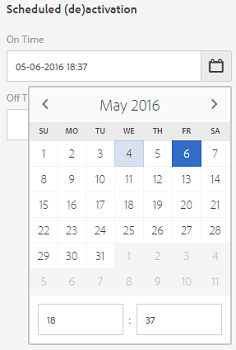
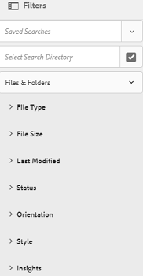

# Administrar sus recursos digitales {#managing-assets-with-the-touch-optimized-ui}

Obtenga información sobre varias tareas de administración y edición de recursos que puede realizar mediante la interfaz de usuario táctil de AEM Assets.

En este artículo se describe cómo administrar y editar recursos mediante la interfaz de usuario táctil de Adobe Experience Manager (AEM) Assets. Para obtener información básica sobre la interfaz de usuario, consulte Gestión [básica de la IU](/help/sites-authoring/basic-handling.md)táctil. Para administrar fragmentos de contenido, consulte [Administración de fragmentos](content-fragments-managing.md) de contenido.

## Crear carpetas {#create-folders}

Al organizar una colección de recursos, por ejemplo, todas `Nature` las imágenes, puede crear carpetas para mantenerlas juntas. Puede utilizar carpetas para categorizar y organizar los recursos. AEM Assets no requiere que organice los recursos en carpetas para que funcionen mejor.

>[!NOTE]
>
>* No se puede compartir una carpeta de recursos del tipo `sling:OrderedFolder` al compartirla en Marketing Cloud. Si desea compartir una carpeta, no seleccione Pedido al crear una carpeta.
>* Experience Manager no permite usar `subassets` palabra como nombre de una carpeta. Es una palabra clave reservada para el nodo que contiene subrecursos para los recursos compuestos.

1. Vaya al lugar de la carpeta de recursos digitales en el que desea crear una nueva carpeta.
1. En el menú, haga clic en **[!UICONTROL Crear]**. Seleccione **[!UICONTROL Nueva carpeta]**.
1. En el campo **[!UICONTROL Título]** , especifique un nombre de carpeta. De forma predeterminada, DAM utiliza el título que ha proporcionado como nombre de carpeta. Una vez creada la carpeta, puede anular el valor predeterminado y especificar otro nombre de carpeta.
1. Haga clic en **[!UICONTROL Crear]**. La carpeta se muestra en la carpeta de recursos digitales.

No se admiten los siguientes caracteres (lista separada por espacios):

* el nombre del archivo de recurso no debe contener  `* / : [ \ \ ] | # % { } ? &`
* el nombre de la carpeta de recursos no debe contener  `* / : [ \ \ ] | # % { } ? \" . ^ ; + & \t`

## Upload assets {#uploading-assets}

Puede cargar varios tipos de recursos (como imágenes, archivos PDF, archivos RAW, etc.) desde la carpeta local o desde una unidad de red a AEM Assets.

>[!NOTE]
>
>En el modo Dynamic Media: Scene7, solo puede cargar recursos cuyo tamaño de archivo sea de 2 GB o inferior.

Puede elegir cargar recursos en carpetas con o sin un perfil de procesamiento asignado a ellas.

Para las carpetas que tienen asignado un perfil de procesamiento, el nombre del perfil aparece en la miniatura de la vista de tarjeta. En la vista de lista, el nombre del perfil aparece en la columna Perfil **[!UICONTROL de]** procesamiento. Consulte Perfiles [de procesamiento](processing-profiles.md).

Antes de cargar un recurso, asegúrese de que tiene un formato admitido.

**Para cargar recursos**:

1. En la interfaz web Recursos, navegue hasta la ubicación en la que desee agregar recursos digitales.
1. Para cargar los recursos, realice una de las siguientes acciones:

   * En la barra de herramientas, toque el icono **[!UICONTROL Crear]** . A continuación, en el menú, toque **[!UICONTROL Archivos]**. Si es necesario, puede cambiar el nombre del archivo en el cuadro de diálogo presentado.
   * En un navegador compatible con HTML5, arrastre los recursos directamente en la interfaz. No se muestra el cuadro de diálogo para cambiar el nombre del archivo.

   

   Para seleccionar varios archivos, pulse la tecla Ctrl/Comando y seleccione los recursos en el cuadro de diálogo del selector de archivos. Desde un iPad, solo puede seleccionar un archivo a la vez.

   Puede pausar la carga de recursos grandes (buenos de 500 MB) y reanudarla más tarde desde la misma página. Puntee en el icono **[!UICONTROL Pausa]** situado junto a la barra de progreso que aparece cuando se cargan los inicios.

   

   Se puede configurar el tamaño por encima del cual un recurso se considera un recurso grande. Por ejemplo, puede configurar el sistema para que considere los recursos superiores a 1000 MB (en lugar de 500 MB) como recursos grandes. En este caso, el botón **[!UICONTROL Pausa]** de la barra de progreso aparece cuando se cargan recursos de tamaño bueno superior a 1000 MB.

   El botón **[!UICONTROL Pausa]** no muestra si un archivo bueno de más de 1000 MB se carga con un archivo de menos de 1000 MB. Sin embargo, si cancela la carga de archivos de menos de 1000 MB, aparece el botón **[!UICONTROL Pausa]** .

   Para modificar el límite de tamaño, configure la `chunkUploadMinFileSize` propiedad del `fileupload`nodo en el repositorio de CRX.

   Al hacer clic en el icono **[!UICONTROL Pausa]** , se desplaza al icono **[!UICONTROL Reproducir]** . Para reanudar la carga, haga clic en el icono **[!UICONTROL Reproducir]** .

   

   Para cancelar una carga en curso, haga clic en el `X` botón situado junto a la barra de progreso. Al cancelar la operación de carga, AEM Assets elimina la parte parcialmente cargada del recurso.

   La capacidad de reanudar la carga resulta especialmente útil en situaciones de bajo ancho de banda y problemas de red, donde la carga de un recurso de gran tamaño tarda mucho tiempo. Puede pausar la operación de carga y continuar más tarde cuando mejore la situación. Cuando se reanuda, se cargan inicios desde el punto en el que se detuvo.

   Durante la operación de carga, AEM guarda las partes del recurso que se cargan como fragmentos de datos en el repositorio de CRX. Cuando se completa la carga, AEM consolida estos fragmentos en un solo bloque de datos en el repositorio.

   Para configurar la tarea de limpieza para los trabajos de carga de fragmentos no finalizados, vaya a `https://[aem_server]:[port]/system/console/configMgr/org.apache.sling.servlets.post.impl.helper.ChunkCleanUpTask`.

   Si carga un recurso con el mismo nombre que el de un recurso ya disponible en la ubicación donde está cargando el recurso, se muestra un cuadro de diálogo de advertencia.

   Puede elegir reemplazar un recurso existente, crear otra versión o mantener ambos cambiando el nombre del nuevo recurso que se carga. Si sustituye un recurso existente, se eliminarán los metadatos del recurso y cualquier modificación e historial anteriores (por ejemplo, anotaciones, recortes, etc.). Si decide conservar ambos recursos, se cambiará el nombre del nuevo recurso.

   

   >[!NOTE]
   >
   >Al seleccionar **[!UICONTROL Reemplazar]** en el cuadro de diálogo Conflicto **[!UICONTROL de]** nombres, el ID de recurso se regenera para el nuevo recurso. Este ID es diferente del ID del recurso anterior.
   >
   >Si **[!UICONTROL Asset Insights]** está habilitado para rastrear impresiones/clics con Adobe Analytics, este ID de recurso regenerado invalida los datos capturados para el recurso en Adobe Analytics.

   Si el recurso cargado existe en AEM Assets, el cuadro de diálogo **[!UICONTROL Duplicados detectados]** advierte que está intentando cargar un recurso de duplicado. El cuadro de diálogo solo aparece si el valor de suma de comprobación SHA 1 del binario del recurso existente coincide con el valor de suma de comprobación del recurso que se carga. En este caso, los nombres de los activos no son importantes. En otras palabras, el cuadro de diálogo puede incluso aparecer para recursos con nombres diferentes si los valores SHA 1 de sus binarios son los mismos.

   >[!NOTE]
   >
   >El cuadro de diálogo **[!UICONTROL Duplicados detectados]** solo aparece cuando la función de detección **[!UICONTROL de]** Duplicados está activada. Para habilitar la función de detección **[!UICONTROL de]** Duplicado, consulte [Activación de la detección](duplicate-detection.md)de Duplicados.

   

   Toque **[!UICONTROL Mantener]** para conservar el recurso de duplicado en AEM Assets. Toque **[!UICONTROL Eliminar]** para eliminar el recurso de duplicado que ha cargado.

   AEM Assets evita que se carguen recursos con caracteres prohibidos en sus nombres de archivo. Si intenta cargar un recurso que incluye los caracteres no permitidos, AEM Assets muestra un mensaje de advertencia sobre la presencia de caracteres prohibidos en el nombre del archivo y detiene la carga hasta que se eliminen estos caracteres o se cargue con un nombre permitido.

   Para adaptarse a las convenciones de nombres de archivo específicas de su organización, el cuadro de diálogo **[!UICONTROL Cargar recursos]** permite especificar nombres largos para los archivos que cargue.

   

   Sin embargo, no se admiten los siguientes caracteres (lista separada por espacios):
   * el nombre del archivo de recurso no debe contener  `* / : [ \ \ ] | # % { } ? &`
   * el nombre de la carpeta de recursos no debe contener  `* / : [ \ \ ] | # % { } ? \" . ^ ; + & \t`

   Además, la interfaz de Recursos muestra el recurso más reciente que se ha cargado o la carpeta que se ha creado primero en todas las vistas (vista **[!UICONTROL de]** tarjetas, vista **[!UICONTROL de]** Lista y vista **[!UICONTROL de]** columnas).

   A menudo, mientras se cargan recursos grandes o múltiples simultáneamente, los indicadores visuales le permiten evaluar el progreso. El cuadro de diálogo Progreso **[!UICONTROL de la]** carga muestra el número de archivos cargados correctamente y los archivos que no se han podido cargar.

   

   Si cancela la operación de carga antes de que se carguen los archivos, AEM Assets deja de cargar el archivo actual y actualiza el contenido. Sin embargo, los archivos que ya se han cargado no se eliminan.

### Cargas serie {#serial-uploads}

La carga masiva de numerosos recursos consume importantes recursos del sistema, lo que puede afectar negativamente al rendimiento de la implementación de AEM. Los posibles cuellos de botella pueden ser la conexión a Internet, las operaciones de lectura y escritura en el disco y las limitaciones del explorador Web en el número de solicitudes de POST al cargar recursos simultáneamente. La operación de carga masiva puede fallar o finalizar prematuramente. En otras palabras, AEM recursos pueden perder algunos archivos al ingerirlos o no ingerirlos por completo.

Para superar esta situación, AEM Assets ingesta un recurso a la vez (carga en serie) durante una operación de carga masiva, en lugar de ingestar todos los recursos al mismo tiempo.

La carga en serie de recursos está activada de forma predeterminada. Para desactivar la función y permitir la carga simultánea, superponga el `fileupload` nodo en CRXDe y defina el valor de la `parallelUploads` propiedad en `true`.

### Carga de recursos mediante FTP {#uploading-assets-using-ftp}

Dynamic Media permite la carga por lotes de recursos mediante el servidor FTP. Si desea cargar recursos de gran tamaño (>1 GB) o carpetas y subcarpetas enteras, debe utilizar FTP. Incluso puede configurar la carga mediante FTP para que se produzca de forma recurrente y programada.

>[!NOTE]
>
>En el modo Dynamic Media: Scene7, solo puede cargar recursos cuyo tamaño de archivo sea de 2 GB o inferior.

>[!NOTE]
>
>Para cargar recursos mediante FTP en Dynamic Media: modo Scene7, instale el paquete de funciones (FP) 18912 en AEM autor. Póngase en contacto con el Servicio de atención al cliente de Adobe para obtener acceso al FP-18912 y completar la configuración de su cuenta de FTP. Consulte [Instalación del paquete de funciones 18912 para la migración](/help/assets/bulk-ingest-migrate.md)masiva de recursos.
Si se utiliza FTP para cargar recursos, se ignora la configuración de carga especificada en AEM. En su lugar, se utilizan las reglas de procesamiento de archivos, tal como se definen en Dynamic Media Classic.

**Para cargar recursos mediante FTP**

1. Con el cliente FTP que elija, inicie sesión en el servidor FTP con el nombre de usuario y la contraseña de FTP que recibió del correo electrónico de aprovisionamiento. En el cliente FTP, cargue archivos o carpetas en el servidor FTP.
1. [Inicie sesión en Dynamic Media Classic](https://www.adobe.com/marketing-cloud/experience-manager/scene7-login.html) con las credenciales recibidas del correo electrónico de aprovisionamiento. En la barra de navegación global, toque **[!UICONTROL Cargar]**.

1. En la página **[!UICONTROL Cargar]** , cerca de la esquina superior izquierda, toque la ficha **[!UICONTROL Por medio de FTP]** .
1. En la parte izquierda de la página, elija una carpeta FTP desde la que cargar los archivos; a la derecha de la página, elija una carpeta de destino.
1. Cerca de la esquina inferior derecha de la página, toque Opciones **[!UICONTROL de]** trabajo y, a continuación, defina las opciones que desee en función de los recursos de la carpeta seleccionada.

   Consulte Opciones [de trabajo de carga](#upload-job-options).

   >[!NOTE]
   >
   >Al cargar recursos mediante FTP, las opciones de trabajo de carga que defina en Dynamic Media Classic (Scene7) prevalecen sobre los parámetros de procesamiento de recursos establecidos en AEM.

1. En la esquina inferior derecha del cuadro de diálogo Opciones **[!UICONTROL de trabajo de]** carga, toque **[!UICONTROL Guardar]**.
1. En la esquina inferior derecha de la página **[!UICONTROL Cargar]** , toque **[!UICONTROL Enviar carga]**.

   Para vista del progreso de la carga, en la barra de navegación global, toque **[!UICONTROL Trabajos]**. La página **[!UICONTROL Trabajos]** muestra el progreso de la carga. Puede continuar trabajando en AEM y volver a la página Trabajos de Dynamic Media Classic en cualquier momento para revisar un trabajo en curso.

   Para cancelar un trabajo de carga en curso, toque **[!UICONTROL Cancelar]** junto al tiempo de **[!UICONTROL duración]** .

#### Opciones de trabajo de carga {#upload-job-options}

| Opción de carga | Subopción | Descripción |
|---|---|---|
| Nombre del trabajo |  | El nombre predeterminado que se rellena previamente en el campo de texto incluye la parte introducida por el usuario del nombre y la marca de fecha y hora. Puede usar el nombre predeterminado o escribir un nombre de su propia creación para este trabajo de carga.  El trabajo y otros trabajos de carga y publicación se registran en la página Trabajos, donde puede comprobar el estado de los trabajos. |
| Publicar tras la carga |  | Publica automáticamente los recursos que se cargan. |
| Sobrescribir en cualquier carpeta, el mismo nombre de recurso base independientemente de la extensión |  | Seleccione esta opción si desea que los archivos que cargue sustituyan los archivos existentes con los mismos nombres. El nombre de esta opción puede ser diferente, según la configuración de Ajustes **[!UICONTROL de]** aplicación > Configuración **** general > **[!UICONTROL Cargar a la aplicación]** > **[!UICONTROL Sobrescribir imágenes]**. |
| Descomprimir archivos ZIP o TAR durante la carga |  |  |
| Opciones de trabajo |  | Toque o haga clic en Opciones **[!UICONTROL de]** trabajo para abrir el cuadro de diálogo Opciones [!UICONTROL de trabajo de] carga y elija las opciones que afectan a todo el trabajo de carga. Estas opciones son las mismas para todos los tipos de archivo. Puede elegir las opciones predeterminadas para cargar archivos empezando por la página Configuración general de la aplicación. Para abrir esta página, seleccione **[!UICONTROL Ajustes]** > Ajustes **[!UICONTROL de aplicación]**. Toque el botón Opciones **[!UICONTROL de carga]** predeterminadas para abrir el cuadro de diálogo Opciones [!UICONTROL de trabajo de] carga. |
|  | Cuando | Seleccione Una vez o Recurrente. Para configurar un trabajo recurrente, elija una opción de repetición (diaria, semanal, mensual o personalizada) para especificar cuándo desea que se repita el trabajo de carga de FTP. A continuación, especifique las opciones de programación según sea necesario. |
|  | Incluir subcarpetas | Cargue todas las subcarpetas de la carpeta que desee cargar. Los nombres de la carpeta y de las subcarpetas que cargue se introducirán automáticamente en AEM Assets. |
|  | Opciones de recorte | Para recortar manualmente de los lados de una imagen, seleccione el menú Recortar y elija Manual. A continuación, introduzca el número de píxeles que desea recortar de cualquier lado o de cada lado de la imagen. La cantidad de imagen que se recorta depende de la configuración de ppp (píxeles por pulgada) en el archivo de imagen. Por ejemplo, si la imagen muestra 150 ppp y se introduce 75 en los cuadros de texto Superior, Derecha, Inferior e Izquierda, se recortará media pulgada de cada lado.  Para recortar automáticamente píxeles de espacio en blanco de una imagen, abra el menú Recortar, elija Manual e introduzca las medidas en píxeles en los campos Superior, Derecha, Inferior e Izquierda para recortar desde los lados. También puede elegir Recortar en el menú Recortar y elegir estas opciones:  **Recortar según** <ul><li>**Color** : elija la opción Color. A continuación, seleccione el menú Esquina y elija la esquina de la imagen con el color que mejor represente el color de espacio en blanco que desea recortar.</li><li>**Transparencia** : elija la opción Transparencia.  **Tolerancia** : arrastre el control deslizante para especificar una tolerancia de 0 a 1.Para recortar según el color, especifique 0 para recortar píxeles solo si coinciden exactamente con el color seleccionado en la esquina de la imagen. Los números más cercanos a 1 permiten una mayor diferencia de color. Para recortar según la transparencia, especifique 0 para recortar píxeles solo si son transparentes. Los números más cercanos a 1 permiten una mayor transparencia.</li></ul> Tenga en cuenta que estas opciones de recorte no son destructivas. |
|  | Opciones de Perfil de color | Elija una conversión de color cuando cree archivos optimizados que se utilicen para envío:<ul><li>Conservación de color predeterminada: Mantiene los colores de la imagen de origen siempre que las imágenes contengan información de espacio de color; no hay conversión de color. Casi todas las imágenes de hoy ya tienen el perfil de color adecuado incrustado. Sin embargo, si una imagen de origen CMYK no contiene un perfil de color incrustado, los colores se convierten en espacio de color sRGB (estándar rojo verde azul). sRGB es el espacio de color recomendado para mostrar imágenes en páginas web.</li><li>Mantener espacio de color original: Conserva los colores originales sin ninguna conversión de color en el punto. Para las imágenes sin un perfil de color incrustado, cualquier conversión de color se realiza utilizando los perfiles de color predeterminados configurados en la configuración de publicación. Es posible que los perfiles de color no se alineen con el color de los archivos creados con esta opción. Por lo tanto, se le recomienda utilizar la opción Conservación de color predeterminada.</li><li>Personalizado de > Para  abre los menús para que pueda elegir un espacio de color Convertir de y Convertir en. Esta opción avanzada anula toda la información de color incrustada en el archivo de origen. Seleccione esta opción cuando todas las imágenes que va a enviar contengan datos de perfil de color incorrectos o falten.</li></ul> |
|  | Opciones de edición de imágenes | Puede conservar las máscaras de recorte en las imágenes y elegir un perfil de color.  Consulte [Configuración de las opciones de edición de imágenes durante la carga](#setting-image-editing-options-at-upload). |
|  | Opciones de Postscript | Puede rasterizar archivos PostScript®, recortar archivos, mantener fondos transparentes, elegir una resolución y elegir un espacio de color.  Consulte [Configuración de las opciones](#setting-postscript-and-illustrator-upload-options)de carga de PostScript y Illustrator. |
|  | Opciones de Photoshop | Puede crear plantillas a partir de archivos Adobe® Photoshop®, mantener las capas, especificar cómo se llaman las capas, extraer texto y especificar cómo se anclan las imágenes en las plantillas.  Tenga en cuenta que las plantillas no son compatibles con AEM.  Consulte [Configuración de las opciones](#setting-photoshop-upload-options)de carga de Photoshop. |
|  | Opciones de PDF | Puede rasterizar los archivos, extraer palabras de búsqueda y vínculos, generar automáticamente un catálogo electrónico, definir la resolución y elegir un espacio de color.  Tenga en cuenta que los catálogos electrónicos no son compatibles con AEM.   Consulte [Configuración de opciones](#setting-pdf-upload-options)de carga de PDF. |
|  | Opciones de Illustrator | Puede rasterizar archivos Adobe Illustrator®, mantener fondos transparentes, elegir una resolución y elegir un espacio de color.  Consulte [Configuración de las opciones](#setting-postscript-and-illustrator-upload-options)de carga de PostScript y Illustrator. |
|  | Opciones de eVideo | Puede transcodificar un archivo de vídeo seleccionando un ajuste preestablecido de vídeo.  Consulte [Configuración de las opciones](#setting-evideo-upload-options)de carga de eVideo. |
|  | Valores preestablecidos de conjunto de lotes | Para crear un conjunto de imágenes o un conjunto de giros a partir de los archivos cargados, haga clic en la columna Activo del ajuste preestablecido que desee utilizar. Puede seleccionar más de un ajuste preestablecido. Los ajustes preestablecidos se crean en la página Ajustes de aplicación/Valores preestablecidos de conjunto por lotes de Dynamic Media Classic.  Consulte [Configuración de ajustes preestablecidos de conjuntos de lotes para generar automáticamente conjuntos de imágenes y conjuntos](config-dms7.md#creating-batch-set-presets-to-auto-generate-image-sets-and-spin-sets) de giros para obtener más información sobre la creación de ajustes preestablecidos de conjuntos de lotes.  Consulte [Configuración de ajustes preestablecidos de conjunto por lotes al cargar](#setting-batch-set-presets-at-upload). |

#### Establecer las opciones de edición de imágenes al cargar {#setting-image-editing-options-at-upload}

Al cargar archivos de imagen, incluidos archivos AI, EPS y PSD, puede realizar las siguientes acciones de edición en el cuadro de diálogo Opciones **[!UICONTROL de trabajo de]** carga:

* Recorte los espacios en blanco desde el borde de las imágenes (consulte la descripción en la tabla anterior).
* Recortar manualmente desde los lados de las imágenes (consulte la descripción en la tabla anterior).
* Elija un perfil de color (consulte la descripción de la opción en la tabla anterior).
* Crear una máscara a partir de un trazado de recorte.
* Enfocar imágenes con opciones de máscara de enfoque
* Fondo de cobertura

| Opción | Subopción | Descripción |
|---|---|---|
| Crear máscara a partir de ruta de recorte |  | Cree una máscara para la imagen en función de la información de ruta de recorte. Esta opción se aplica a las imágenes creadas con aplicaciones de edición de imágenes en las que se ha creado una ruta de recorte. |
| Máscara de enfoque |  | Permite ajustar un efecto de filtro de enfoque en la imagen final con disminución de resolución, controlando la intensidad del efecto, el radio del efecto (medido en píxeles) y un umbral de contraste que se ignora.  Este efecto utiliza las mismas opciones que el filtro Máscara de enfoque de Photoshop. Contrariamente a lo que indica el nombre, Máscara de enfoque es un filtro de enfoque. En Máscara de enfoque, defina las opciones que desee. Las opciones de configuración se describen a continuación: |
|  | Cantidad | Controla la cantidad de contraste que se aplica a los píxeles del borde.  Piensen en ello como la intensidad del efecto. La diferencia principal entre los valores de cantidad de Máscara de enfoque en Medios dinámicos y los valores de cantidad en Adobe Photoshop es que Photoshop tiene un rango de cantidad del 1% al 500%. Mientras que, en Dynamic Media, el rango de valores es de 0,0 a 5,0. Un valor de 5,0 es el equivalente aproximado del 500 % en Photoshop; un valor de 0,9 es el equivalente al 90 %, y así sucesivamente. |
|  | Radio | Controla el radio del efecto. El intervalo de valores es 0-250.  El efecto se ejecuta en todos los píxeles de una imagen e irradia desde todos los píxeles en todas las direcciones. El radio se mide en píxeles. Por ejemplo, para obtener un efecto de enfoque similar para una imagen de 2000 x 2000 píxeles y una imagen de 500 x 500 píxeles, debe establecer un radio de dos píxeles en la imagen de 2000 x 2000 píxeles y un valor de radio de un píxel en la imagen de 500 x 500 píxeles. Se utiliza un valor mayor para una imagen que tiene más píxeles. |
|  | Umbral | Umbral es un rango de contraste que se ignora cuando se aplica el filtro Máscara de enfoque. Es importante que no se introduzca ningún &quot;ruido&quot; en una imagen cuando se utilice este filtro. El rango de valores es 0-255, que es el número de pasos de brillo de una imagen en escala de grises. 0=negro, 128=50% gris y 255=blanco.  Por ejemplo, un valor de umbral de 12 ignora las ligeras variaciones en el brillo del tono de la piel para evitar agregar ruido, pero agrega contraste al borde a áreas de contraste como, por ejemplo, donde las pestañas tocan la piel.  Por ejemplo, si tiene una fotografía de la cara de alguien, la máscara de enfoque afecta a las partes contrastantes de la imagen, como por ejemplo dónde se tocan las pestañas y la piel para crear un área obvia de contraste y la piel lisa en sí. Incluso la piel más suave presenta cambios sutiles en los valores de brillo. Si no utiliza un valor de umbral, el filtro acentúa estos cambios sutiles en píxeles de piel. A su vez, se crea un efecto ruidoso e indeseable mientras que el contraste en las pestañas aumenta, lo que mejora el enfoque.  Para evitar este problema, se introduce un valor de umbral que indica al filtro que ignore los píxeles que no cambian el contraste de forma drástica, como la piel lisa.  En el gráfico de cremallera mostrado anteriormente, observe la textura junto a los cremalleras. Se muestra ruido de imagen porque los valores de umbral eran demasiado bajos para suprimir el ruido. |
|  | Monocromo | Seleccione esta opción para aplicar máscara de enfoque al brillo (intensidad) de la imagen.  Anule la selección para aplicar máscara de enfoque a cada componente de color por separado. |
| Fondo de cobertura |  | Elimina automáticamente el fondo de una imagen al cargarla. Esta técnica resulta útil para llamar la atención sobre un objeto concreto y para que destaque desde un fondo muy ocupado. Seleccione esta opción para activar o &quot;activar&quot; la función Fondo de cobertura y las siguientes subopciones: |
|  | Esquina | Requerido.  Esquina de la imagen que se utiliza para definir el color de fondo de la cobertura.  Puede elegir entre **Superior izquierda**, **Inferior izquierda**, **Superior derecha** o **Inferior derecha**. |
|  | Método de relleno | Requerido.  Controla la transparencia de píxeles desde la ubicación Esquina que haya definido.  Puede elegir entre los siguientes métodos de relleno: <ul><li>**Relleno** de Flood: hace que todos los píxeles sean transparentes y coincidan con la esquina especificada y que estén conectados a ella.</li><li>**Coincidir con píxeles** : hace que todos los píxeles coincidentes sean transparentes, independientemente de su ubicación en la imagen.</li></ul> |
|  | Tolerancia | Opcional.  Controla la cantidad de variación permitida en la coincidencia de color de píxeles según la ubicación de esquina que haya definido.  Utilice un valor de 0,0 para coincidir exactamente con los colores de píxeles o utilice un valor de 1,0 para permitir la variación buena. |

#### Definición de las opciones de carga de PostScript y Illustrator {#setting-postscript-and-illustrator-upload-options}

Al cargar archivos de imagen PostScript (EPS) o Illustrator (AI), puede darles formato de varias formas. Puede rasterizar los archivos, mantener el fondo transparente, elegir una resolución y elegir un espacio de color. Las opciones para dar formato a archivos PostScript y Illustrator están disponibles en el cuadro de diálogo Opciones de trabajo de carga, en Opciones de PostScript y Opciones de Illustrator.

| Opción | Subopción | Descripción |
|---|---|---|
| Procesando |  | Elija **[!UICONTROL Rasterizar]** para convertir los gráficos vectoriales del archivo al formato de mapa de bits. |
| Mantener fondo transparente en imagen procesada |  | Mantener la transparencia de fondo del archivo. |
| Resolución |  | Determina la configuración de resolución. Esta configuración determina cuántos píxeles se muestran por pulgada en el archivo. |
| Espacio color |  | Seleccione el menú Espacio de color y elija entre las siguientes opciones de espacio de color: |
|  | Detectar automáticamente | Conserva el espacio de color del archivo. |
|  | Forzar RGB | Convierte al espacio de color RGB. |
|  | Forzar CMYK | Convierte al espacio de color CMYK. |
|  | Forzar escala de grises | Convierte al espacio de color de escala de grises. |

#### Definición de las opciones de carga de Photoshop {#setting-photoshop-upload-options}

Los archivos PSD (Photoshop Documento) se utilizan con mayor frecuencia para crear plantillas de imagen. Al cargar un archivo PSD, puede crear una plantilla de imagen automáticamente a partir del archivo (seleccione la opción Crear plantilla en la pantalla Cargar).

Dynamic Media crea varias imágenes a partir de un archivo PSD con capas si se utiliza el archivo para crear una plantilla; crea una imagen para cada capa.

Utilice las opciones **[!UICONTROL de recorte]** y de Perfil **[!UICONTROL de color descritas anteriormente con las opciones]** de carga de Photoshop.

>[!NOTE]
>
>Las plantillas no son compatibles con AEM.

| Opción | Subopción | Descripción |
|---|---|---|
| Mantener capas |  | Extrae las capas del PSD, si las hay, en recursos individuales. Las capas de recursos permanecen asociadas al PSD. Puede realizar la vista abriendo el archivo PSD en la vista de detalles y seleccionando el panel de capas. |
| Crear plantilla |  | Crea una plantilla a partir de las capas del archivo PSD. |
| Extraer texto |  | Extrae el texto para que los usuarios puedan buscar texto en un visor. |
| Extender las capas al tamaño de fondo |  | Extiende el tamaño de las capas de imagen extraídas al tamaño de la capa de fondo. |
| Nombres de capas |  | Las capas del archivo PSD se cargan como imágenes independientes. |
|  | Nombre de la capa | Asigna a las imágenes los nombres de sus capas en el archivo PSD. Por ejemplo, una capa denominada Etiqueta de precio en el archivo PSD original se convierte en una imagen denominada Etiqueta de precio. Sin embargo, si los nombres de capa del archivo PSD son nombres de capa predeterminados de Photoshop (Fondo, Capa 1, Capa 2, etc.), las imágenes recibirán el nombre de sus números de capa en el archivo PSD, no de sus nombres de capa predeterminados. |
|  | Photoshop y número de capa | Asigna a las imágenes los nombres de sus capas en el archivo PSD, sin tener en cuenta los nombres de las capas originales. Las imágenes reciben el nombre del archivo de Photoshop y un número de capa anexado. Por ejemplo, la segunda capa de un archivo llamado Anuncio primavera.psd se denomina Anuncio primavera_2 aunque tenga un nombre no predeterminado en Photoshop. |
|  | Photoshop y nombre de capa | Nombra las imágenes después del archivo PSD seguido del nombre o el número de capa. El número de capa se utiliza si los nombres de capa del archivo PSD son nombres de capa predeterminados de Photoshop. Por ejemplo, una capa denominada Etiqueta de precio en un archivo PSD llamado Anuncio primavera se denomina Anuncio primavera_Etiqueta de precio. Una capa con el nombre predeterminado Capa 2 se denomina Anuncio primavera_2. |
| Ancla |  | Especifique cómo se anclan las imágenes en plantillas que se generan a partir de la composición en capas producida a partir del archivo PSD. De forma predeterminada, el anclaje es el centro. Un anclaje central permite que las imágenes de reemplazo ocupen mejor el mismo espacio, independientemente de la proporción de aspecto de la imagen de reemplazo. Las imágenes con un aspecto diferente que reemplazan a esta imagen, al hacer referencia a la plantilla y utilizar la sustitución de parámetros, ocupan efectivamente el mismo espacio. Cambie a una configuración diferente si la aplicación requiere que las imágenes de reemplazo ocupen el espacio asignado en la plantilla. |

#### Establecer opciones de carga de PDF {#setting-pdf-upload-options}

Al cargar un archivo PDF, puede darle formato de varias formas. Puede recortar sus páginas, extraer palabras de búsqueda, introducir una resolución de píxeles por pulgada y elegir un espacio de color. Los archivos PDF suelen contener un margen de corte, marcas de recorte, marcas de registro y otras marcas de impresora. Puede recortar estas marcas de los lados de las páginas al cargar un archivo PDF.

>[!NOTE]
>
>Los catálogos electrónicos no son compatibles con AEM.

Elija entre las siguientes opciones:

| Opción | Subopción | Descripción |
|---|---|---|
| Procesando | Rasterizar | (Predeterminado) Extrae las páginas del archivo PDF y convierte los gráficos vectoriales en imágenes de mapa de bits. Elija esta opción para crear un catálogo electrónico. |
| Extraer | Palabras de búsqueda | Extrae palabras del archivo PDF para que el archivo se pueda buscar por palabra clave en un visor de catálogos electrónicos. |
|  | Vínculos | Extrae vínculos de los archivos PDF y los convierte en mapas de imagen que se utilizan en un visor de catálogos electrónicos. |
| Generar catálogo electrónico automáticamente a partir de PDF de varias páginas |  | Crea automáticamente un catálogo electrónico a partir del archivo PDF. El catálogo electrónico recibe el nombre del archivo PDF que ha cargado. (Esta opción solo está disponible si rasteriza el archivo PDF al cargarlo). |
| Resolución |  | Determina la configuración de resolución. Esta configuración determina cuántos píxeles se muestran por pulgada en el archivo PDF. El valor predeterminado es 150. |
| Espacio color |  | Seleccione el menú Espacio de color y elija un espacio de color para el archivo PDF. La mayoría de los archivos PDF tienen imágenes en color RGB y CMYK. El espacio de color RGB es preferible para la visualización en línea. |
|  | Detectar automáticamente | Conserva el espacio de color del archivo PDF. |
|  | Forzar RGB | Convierte al espacio de color RGB. |
|  | Forzar CMYK | Convierte al espacio de color CMYK. |
|  | Forzar como escala de grises | Convierte al espacio de color de escala de grises. |

#### Definición de las opciones de carga de eVideo {#setting-evideo-upload-options}

Puede transcodificar un archivo de vídeo eligiendo entre varios ajustes preestablecidos de vídeo.

| Opción | Subopción | Descripción |
|---|---|---|
| Vídeo adaptable |  | Un ajuste preestablecido de codificación único que funciona con cualquier proporción de aspecto para crear vídeos de envío a móvil, tablet y escritorio. Los vídeos de origen cargados que se codifican con este ajuste preestablecido se definen con una altura fija. Sin embargo, la anchura se escala automáticamente para conservar la proporción de aspecto del vídeo.  Se recomienda utilizar la codificación de vídeo adaptable. |
| Ajustes preestablecidos de codificación única | Ordenar ajustes preestablecidos de codificación | Seleccione Nombre o Tamaño para ordenar los ajustes preestablecidos de codificación en Escritorio, Móvil y Tablet por nombre o por tamaño de resolución. |
|  | Escritorio | Cree un archivo MP4 para ofrecer una experiencia de vídeo progresivo o de flujo continuo a equipos de escritorio.Seleccione una o varias relaciones de aspecto con el tamaño de resolución y la velocidad de datos de destinatario que desee. |
|  | Móvil | Cree un archivo MP4 para envío en dispositivos móviles iPhone o Android.Seleccione una o varias relaciones de aspecto con el tamaño de resolución y la velocidad de datos de destinatario que desee. |
|  | Tablet | Cree un archivo MP4 para envío en dispositivos iPad o tablet Android.Seleccione una o varias relaciones de aspecto con el tamaño de resolución y la velocidad de datos de destinatario que desee. |

#### Definir ajustes preestablecidos de conjunto por lotes al cargar {#setting-batch-set-presets-at-upload}

Si desea crear automáticamente un conjunto de imágenes o de giros a partir de imágenes cargadas, haga clic en la columna **[!UICONTROL Activo]** del ajuste preestablecido que desee utilizar. Puede seleccionar más de un ajuste preestablecido.

Consulte [Configuración de ajustes preestablecidos de conjuntos de lotes para generar automáticamente conjuntos de imágenes y conjuntos](config-dms7.md#creating-batch-set-presets-to-auto-generate-image-sets-and-spin-sets) de giros para obtener más información sobre la creación de ajustes preestablecidos de conjuntos de lotes.

### Cargas de flujo continuo {#streamed-uploads}

Si carga numerosos recursos, las llamadas de E/S al servidor de AEM aumentan drásticamente, lo que reduce la eficacia de la carga e incluso puede hacer que se agote el tiempo de espera. AEM Assets admite la carga de recursos por flujo continuo. La carga por flujo continuo reduce la E/S de disco durante la operación de carga, ya que evita el almacenamiento de recursos en una carpeta temporal del servidor antes de copiarla en el repositorio. En su lugar, los datos se transfieren directamente al repositorio. De este modo, se reduce el tiempo de carga de recursos de gran tamaño y la posibilidad de tiempos de espera. La carga de flujo está habilitada de forma predeterminada en AEM Assets.

La carga de flujo está deshabilitada para AEM que se ejecuta en el servidor JEE con versión servlet-api menor que 3.1.

### Extraer archivo ZIP que contiene recursos {#extract-zip-archive-containing-assets}

Puede cargar archivos ZIP como cualquier otro recurso admitido. Las mismas reglas de nombre de archivo se aplican a los archivos ZIP. AEM le permite extraer un archivo ZIP en una ubicación DAM.

Seleccione un archivo ZIP a la vez, haga clic en **[!UICONTROL Extraer archivo]** y seleccione una carpeta de destino. Seleccione una opción para controlar los conflictos, si los hay. Si los recursos del archivo ZIP ya existen en la carpeta de destino, puede seleccionar una de estas opciones: omita la extracción, reemplace los archivos existentes, mantenga ambos recursos cambiando el nombre o cree una nueva versión.

Una vez finalizada la extracción, AEM le notifica en el área de notificación. Mientras AEM extrae el ZIP, puede volver a su trabajo sin interrumpir la extracción.

Algunas limitaciones de la función son:

* Si existe una carpeta con el mismo nombre en el destino, los recursos del archivo ZIP se extraen en la carpeta existente.

* Si cancela la extracción, los recursos ya extraídos no se eliminarán.

* No puede seleccionar dos archivos ZIP al mismo tiempo y extraerlos. Sólo puede extraer un archivo ZIP a la vez.

## Recursos de previsualización {#previewing-assets}

**Para previsualización de recursos**:

1. En la interfaz de usuario de Recursos, desplácese hasta la ubicación del recurso que desee previsualización.
1. Toque el recurso que desee para abrirlo.

1. En el modo de previsualización, las opciones de zoom están disponibles para los tipos [de imagen](assets-formats.md#supported-raster-image-formats) admitidos (con edición interactiva).

   Para acercar un recurso, toque **[!UICONTROL +]** (o toque la lupa del recurso). Para alejar, toque **[!UICONTROL -]**. Al acercar, puede ver con detenimiento cualquier área de la imagen. La flecha **[!UICONTROL Restablecer zoom]** le lleva de nuevo a la vista original.

   

   Toque el botón **[!UICONTROL Restablecer]** para restablecer la vista al tamaño original.

   

>[!MORELIKETHIS]
>
>* [Previsualización de recursos](/help/assets/previewing-assets.md)de medios dinámicos.
>* [Subrecursos](managing-linked-subassets.md#viewing-subassets)de vista.

## Editar propiedades {#editing-properties}

1. Navegue a la ubicación del recurso cuyos metadatos desee editar.

1. Seleccione el recurso y toque **[!UICONTROL Propiedades]** en la barra de herramientas para vista de propiedades de recurso. También puede seleccionar la acción rápida **[!UICONTROL Propiedades]** en la tarjeta de recursos.

   

1. En la página **[!UICONTROL Propiedades]** , edite las propiedades de metadatos en varias fichas. Por ejemplo, en la ficha **[!UICONTROL Básico]** , edite el título, la descripción, etc.

   La presentación de la página **[!UICONTROL Propiedades]** y las propiedades de metadatos disponibles dependen del esquema de metadatos subyacente. Para obtener información sobre cómo modificar la presentación de la página **[!UICONTROL Propiedades]** , consulte Esquemas de metadatos.

1. Para programar una fecha y hora determinada para la activación del recurso, utilice el selector de fechas situado junto al campo **[!UICONTROL Tiempo de activación]**.

   

1. Para desactivar el recurso después de una duración determinada, elija la fecha y hora de desactivación en el selector de fechas situado junto al campo Tiempo de **[!UICONTROL desactivación]** .

   La fecha de desactivación debe ser posterior a la fecha de activación de un recurso. Después del tiempo de [!UICONTROL inactividad], un recurso y sus representaciones no están disponibles ni a través de la interfaz web de Recursos ni a través de la API HTTP.

   

1. En el campo **[!UICONTROL Etiquetas]** , seleccione una o varias etiquetas. Para agregar una etiqueta personalizada, escriba el nombre de la etiqueta en el cuadro y pulse **[!UICONTROL Intro]**. La nueva etiqueta se guarda en AEM.

   YouTube requiere que las etiquetas publiquen y tengan un vínculo a YouTube (si se encuentra un vínculo adecuado).
Para crear etiquetas, necesita permiso de escritura para `/content/cq:tags/default` en el repositorio de CRX.

1. To provide a rating to the asset, tap the **[!UICONTROL Advanced]** tab and then tap the star at the appropriate position to assign the desired rating.

   

   La puntuación de clasificación que asigne al recurso se muestra en **[!UICONTROL Sus clasificaciones]**. La puntuación media de clasificación que el recurso recibió de los usuarios que clasificaron el recurso se muestra en **[!UICONTROL Clasificación]**. Además, el desglose de las puntuaciones de clasificación que contribuyen a la puntuación de clasificación promedio se muestra en Desglose de **[!UICONTROL clasificación]**. Puede buscar recursos en función de las puntuaciones de clasificación promedio.

1. Para vista de las estadísticas de uso del recurso, toque la ficha **[!UICONTROL Perspectivas]** .

   Las estadísticas de uso incluyen lo siguiente:

   * Número de veces que se ha visualizado o descargado el recurso.
   * Canales/dispositivos a través de los cuales se utilizó el recurso.
   * Soluciones creativas en las que el recurso se ha utilizado recientemente.

   Para obtener más información, consulte Perspectivas [de recursos](touch-ui-asset-insights.md).

1. Toque **[!UICONTROL Guardar y cerrar]**.
1. Vaya a la interfaz de usuario de Recursos. Las propiedades de metadatos editadas, como título, descripción, clasificaciones, etc., se muestran en la tarjeta del recurso en la vista de la tarjeta y en las columnas relevantes de la vista de lista.

## Copiar recursos {#copying-assets}

Al copiar un recurso o una carpeta, se copia todo el recurso o la carpeta, junto con su estructura de contenido. Un recurso copiado o una carpeta se duplica en la ubicación del destinatario. El recurso en la ubicación de origen no se modifica.

Algunos atributos que son exclusivos de una copia concreta de un activo no se arrastran. Algunos ejemplos son:

* ID del recurso, fecha y hora de creación, y versiones e historial de versiones. Algunas de estas propiedades están indicadas por las propiedades `jcr:uuid`, `jcr:created`y `cq:name`.

* El tiempo de creación y las rutas a las que se hace referencia son únicos para cada recurso y cada una de sus representaciones.

El resto de las propiedades y la información de metadatos se conservan. No se crea una copia parcial al copiar un recurso.

1. En la interfaz de usuario de Recursos, seleccione uno o varios recursos y, a continuación, toque el icono **[!UICONTROL Copiar]** de la barra de herramientas. Como alternativa, elija la acción rápida **[!UICONTROL Copiar]** en la tarjeta de recursos.

   

   >[!NOTE]
   >
   >Si utiliza la acción rápida **[!UICONTROL Copiar]** , solo puede copiar un recurso a la vez.

1. Vaya a la ubicación en la que desea copiar los recursos.

   >[!NOTE]
   >
   >Si copia un recurso en la misma ubicación, AEM genera automáticamente una variación del nombre. Por ejemplo, si copia un recurso llamado Cuadrado, AEM automáticamente genera el título de su copia como Cuadrado1.

1. Puntee en el icono **[!UICONTROL Pegar]** recurso de la barra de herramientas:

   

   Los recursos se copian en esta ubicación.

   >[!NOTE]
   >
   >El icono **[!UICONTROL Pegar]** está disponible en la barra de herramientas hasta que se complete la operación de pegado.

### Mover o cambiar el nombre de los recursos {#moving-or-renaming-assets}

Al mover recursos (o carpetas) a otra ubicación, los recursos (o carpetas) no se duplican, a diferencia de lo que ocurre al copiar el recurso. Los recursos (o las carpetas) se colocan en la ubicación del destinatario y se eliminan de la ubicación de origen. También puede cambiar el nombre del recurso al moverlo a la nueva ubicación. Si va a mover un recurso publicado a una ubicación diferente, tiene la opción de volver a publicarlo. De forma predeterminada, la operación de movimiento en un recurso publicado la cancela automáticamente. El recurso movido se vuelve a publicar si el autor selecciona la opción [!UICONTROL Volver a publicar] al mover el recurso.

Para mover recursos o carpetas:

1. Navegue hasta la ubicación del recurso que desee mover.

1. Select the asset, and tap the **[!UICONTROL Move]** icon from the toolbar.

   

1. En el asistente para **[!UICONTROL mover recursos]** , realice una de las siguientes acciones:

   * Especifique el nombre del recurso después de moverlo. A continuación, toque **[!UICONTROL Siguiente]** para continuar.
   * Toque **[!UICONTROL Cancelar]** para detener el proceso.

   >[!NOTE]
   >
   >Puede especificar el mismo nombre para el recurso si no hay ningún recurso con ese nombre en la nueva ubicación. Sin embargo, debe utilizar un nombre diferente si mueve el recurso a una ubicación en la que exista un recurso con el mismo nombre. Si utiliza el mismo nombre, el sistema genera automáticamente una variación del nombre. Por ejemplo, si el recurso tiene el nombre Cuadrado, el sistema genera el nombre Cuadrado1 para su copia.

   >[!NOTE]
   >
   >No se admiten los siguientes caracteres (lista separada por espacios):
   >* el nombre del archivo de recurso no debe contener  `* / : [ \ \ ] | # % { } ? &`
   >* el nombre de la carpeta de recursos no debe contener  `* / : [ \ \ ] | # % { } ? \" . ^ ; + & \t`

1. En la página **[!UICONTROL Seleccionar destino]** , realice una de las siguientes acciones:

   * Navigate to the new location for the assets, and then tap **[!UICONTROL Next]** to proceed.
   * Toque **[!UICONTROL Atrás]** para volver a la página **[!UICONTROL Cambiar nombre]** .

1. Si los recursos que se mueven tienen páginas, recursos o colecciones de referencia, la ficha **[!UICONTROL Ajustar referencias]** aparece junto a la ficha **[!UICONTROL Seleccionar destino]** .

   Realice una de las siguientes acciones en la página **[!UICONTROL Ajustar referencias]** :

   * Especifique las referencias que se van a ajustar en función de los nuevos detalles y, a continuación, toque **[!UICONTROL Mover]** para continuar.
   * En la columna **[!UICONTROL Ajustar]** , seleccione o anule la selección de referencias a los recursos.
   * Puntee **[!UICONTROL Atrás]** para volver a la página **[!UICONTROL Seleccionar destino]** .
   * Toque **[!UICONTROL Cancelar]** para detener la operación de movimiento.

   Si no actualiza las referencias, éstas seguirán apuntando a la ruta anterior del recurso. Si ajusta las referencias, se actualizan a la nueva ruta de acceso del recurso.

### Mover recursos mediante la operación de arrastrar {#move-using-drag}

Puede mover recursos (o carpetas) a una carpeta del mismo nivel arrastrándolos a la ubicación del destinatario, en lugar de utilizar la opción [!UICONTROL Mover] de la interfaz de usuario. Sin embargo, esta operación solo es posible en la vista de lista.

Al mover recursos arrastrándolos, no se abre el asistente para [!UICONTROL mover recursos] , por lo que no se puede cambiar el nombre de los recursos al moverlos. Además, los recursos ya publicados se vuelven a publicar al moverlos arrastrándolos, sin necesidad de obtener la aprobación del usuario para volver a publicarlos.

## Administrar representaciones {#managing-renditions}

1. Puede agregar o quitar representaciones de un recurso, excepto el original. Vaya a la ubicación del recurso para el que desea agregar o quitar representaciones.

1. Toque el recurso para abrir su página de recursos.

   

1. Toque el icono Navegación **** global y seleccione **[!UICONTROL Representaciones]** en la lista.

   

1. En el panel **[!UICONTROL Representaciones]** , vista la lista de las representaciones generadas para el recurso.

   

   >[!NOTE]
   >
   >De forma predeterminada, AEM Assets no muestra la representación original del recurso en el modo de previsualización. Si es administrador, puede utilizar las superposiciones para configurar AEM Assets para que muestre las representaciones originales en el modo de previsualización.

1. Seleccione una representación para vista o eliminarla.

   **Eliminar una representación**

   Seleccione una representación en el panel **[!UICONTROL Representaciones]** y, a continuación, toque el icono **[!UICONTROL Eliminar representación]** en la [barra de herramientas](/help/sites-authoring/basic-handling.md). Las representaciones no se pueden eliminar de forma masiva una vez que se haya completado el procesamiento de recursos. Para recursos individuales, puede quitar las representaciones manualmente de la interfaz de usuario. Para varios recursos, puede personalizar el Experience Manager para que elimine representaciones específicas o elimine los recursos y vuelva a cargar los recursos eliminados.

   

   **Cargar una nueva representación**

   Navigate to the asset details page for the asset, and tap the **[!UICONTROL Add Rendition]** icon in the toolbar to upload a new rendition for the asset.

   

   >[!NOTE]
   >
   >Si selecciona una representación en el panel **[!UICONTROL Representaciones]**, la barra de herramientas cambia de contexto y muestra solo las acciones que son relevantes para la representación. Options, such as the **[!UICONTROL Upload Rendition]** icon is not displayed. Para ver estas opciones en la barra de herramientas, vaya a la página de detalles del recurso.

   Puede configurar las dimensiones de la representación que desee mostrar en la página de detalles de un recurso de vídeo o imagen. En función de las dimensiones que especifique, AEM Assets muestra la representación con las dimensiones exactas o más cercanas.

   To configure rendition dimensions of an image at the asset detail level, overlay the **[!UICONTROL renditionpicker]** node `libs/dam/gui/content/assets/assetpage/jcr:content/body/content/content/items/assetdetail/items/col1/items/assetview/renditionpicker` and configure the value of the width property. Configure el **[!UICONTROL tamaño de la propiedad (Long) en KB]** en lugar de la anchura para personalizar la representación en la página de detalles del recurso según el tamaño de la imagen. For size-based customization, the property **[!UICONTROL preferOriginal]** assigns preference to the original if the size of the matched rendition is greater than the original.

   Del mismo modo, puede personalizar la imagen de la página **[!UICONTROL Anotación]** superponiendo `libs/dam/gui/content/assets/annotate/jcr:content/body/content/content/items/content/renditionpicker`.

   

   Para configurar las dimensiones de representación de un recurso de vídeo, navegue hasta el nodo **[!UICONTROL videopicker]** del repositorio de CRX en la ubicación `/libs/dam/gui/content/assets/assetpage/jcr:content/body/content/content/items/assetdetail/items/col1/items/assetview/videopicker`, superponga el nodo y, a continuación, edite la propiedad correspondiente.

   >[!NOTE]
   >
   >Las anotaciones de vídeo solo se admiten en navegadores con formatos de vídeo compatibles con HTML5. Además, según el navegador, se admiten diferentes formatos de vídeo.

Para obtener información sobre los subrecursos, consulte [Gestión de subrecursos](managing-linked-subassets.md).

## Delete assets {#deleting-assets}

Para resolver o eliminar las referencias entrantes de otras páginas, actualice las referencias relevantes antes de eliminar un recurso.

Asimismo, desactive el botón de forzar eliminación mediante una superposición para impedir que los usuarios eliminen los recursos a los que se hace referencia y dejen vínculos rotos.

Para poder eliminar un recurso, es necesario disponer de permisos de eliminación en la represa o el recurso. Si solo tiene permisos de modificación, solo puede editar los metadatos del recurso y agregar anotaciones al recurso. Sin embargo, no puede eliminar el recurso ni sus metadatos.

**Para eliminar recursos**:

1. Navegue a la ubicación de los recursos que desee eliminar.

1. Select the asset, and tap the **[!UICONTROL Delete]** icon from the toolbar.

   

1. En el cuadro de diálogo de confirmación, toque:

   * **[!UICONTROL Cancelar]** para detener la acción
   * **[!UICONTROL Elimine]** para confirmar la acción según lo siguiente:

      * Si el recurso no tiene referencias, se elimina.
      * Si el recurso tiene referencias, un mensaje de error le informa de que se hace referencia **[!UICONTROL a]** uno o varios recursos. Puede seleccionar **[!UICONTROL Forzar eliminación]** o **[!UICONTROL Cancelar]**.

   >[!NOTE]
   >
   >Para resolver o eliminar las referencias entrantes de otras páginas, actualice las referencias relevantes antes de eliminar un recurso.
   >
   >Asimismo, desactive el botón **[!UICONTROL Forzar eliminación]** mediante una superposición para impedir que los usuarios eliminen los recursos a los que se hace referencia y dejen vínculos rotos.

## Descargar recursos {#downloading-assets}

See [Download assets from AEM](download-assets-from-aem.md)

## Publish assets {#publishing-assets}

Si publica recursos que se están procesando, solo se publicará el contenido original. Faltan las representaciones. Espere a que se complete el procesamiento y, a continuación, publique o vuelva a publicar el recurso una vez finalizado el procesamiento.

Si la carpeta que desea publicar incluye una carpeta vacía, la carpeta vacía no se publicará.

Para obtener más información específica sobre Dynamic Media, consulte [Publicación de recursos](publishing-dynamicmedia-assets.md)de Dynamic Media.

**Para publicar recursos**:

1. Navegue a la ubicación de los recursos o la carpeta que desee publicar

1. Either select the **[!UICONTROL Publish]** quick action from the asset card, or select the asset and tap the **[!UICONTROL Quick Publish]** icon from the toolbar.
1. Si el recurso hace referencia a otros recursos, sus referencias se enumeran en el asistente. Solo se muestran las referencias que no se han publicado o que se han modificado desde la última vez que se publicaron o no. Elija las referencias que desee publicar.

   

1. Toque **[!UICONTROL Publicar]** para confirmar la activación de los recursos.

## Cancelar la publicación de recursos {#unpublishing-assets}

Al cancelar la publicación de un recurso complejo, solo debe cancelar la publicación del recurso. Evite cancelar la publicación de las referencias porque otros recursos publicados pueden hacer referencia a ellas.

**Para cancelar la publicación de recursos**:

1. Vaya a la ubicación del recurso o de la carpeta de recursos que desea eliminar del entorno de publicación (cancelar la publicación).

1. Seleccione el recurso o la carpeta que desea cancelar la publicación y toque el icono **[!UICONTROL Administrar publicación]** de la barra de herramientas.

   

1. Seleccione la acción **[!UICONTROL Cancelar publicación]** en la lista.

   

1. Para cancelar la publicación del recurso posteriormente, seleccione **[!UICONTROL Cancelar publicación posteriormente]** y, a continuación, seleccione una fecha para cancelar la publicación del recurso.
1. Programe una fecha para que el recurso no esté disponible desde el entorno de publicación.
1. Si el recurso hace referencia a otros recursos, elija las referencias que desee cancelar la publicación. Toque **[!UICONTROL Cancelar publicación]**.
1. En el cuadro de diálogo de confirmación, realice una de las siguientes acciones:

   * Toque **[!UICONTROL Cancelar]** para detener la acción
   * Toque **[!UICONTROL Cancelar la publicación]** para confirmar que los recursos se han cancelado de publicar (ya no están disponibles en el entorno de publicación) en la fecha especificada.

## Crear un grupo de usuarios cerrado {#closed-user-group}

Un CUG (Grupo de usuarios cerrado) se utiliza para limitar el acceso a carpetas de recursos específicas publicadas desde AEM. Si crea un CUG para una carpeta, el acceso a la carpeta (incluidos los recursos de carpetas y las subcarpetas) se restringirá únicamente a los miembros o grupos asignados. Para acceder a la carpeta, deben iniciar sesión con sus credenciales de seguridad.

Los CUG son una forma adicional de restringir el acceso a los recursos. También puede configurar una página de inicio de sesión para la carpeta.

**Para crear un grupo** de usuarios cerrado:

1. Seleccione una carpeta en la interfaz de usuario de Recursos y toque el icono **[!UICONTROL Propiedades]** de la barra de herramientas para mostrar la página de propiedades.
1. En la ficha **[!UICONTROL Permisos]** , agregue miembros o grupos en Grupo **[!UICONTROL de usuarios]** cerrado.

   

1. Para mostrar una pantalla de inicio de sesión cuando los usuarios acceden a la carpeta, seleccione la opción **[!UICONTROL Activar]** . A continuación, seleccione la ruta a una página de inicio de sesión en AEM y guarde los cambios.

   

   Si no especifica la ruta a una página de inicio de sesión, AEM muestra la página de inicio de sesión predeterminada en la instancia de publicación.

1. Publique la carpeta e intente acceder a ella desde la instancia de publicación. Aparece una pantalla de inicio de sesión.
1. Si es miembro de CUG, introduzca sus credenciales de seguridad. La carpeta se muestra después de que AEM autenticado.

## Buscar recursos {#searching-assets}

La búsqueda básica se detalla en la sección [Buscar y filtrar](/help/sites-authoring/search.md#search-and-filter) . Utilice el panel **[!UICONTROL Buscar]** para buscar recursos, etiquetas y metadatos. Puede buscar partes de una cadena con el asterisco comodín. Además, puede personalizar el panel **[!UICONTROL Buscar]** mediante facetas [de búsqueda](search-facets.md).

En el caso de los recursos cargados recientemente, sus metadatos (incluidos títulos, etiquetas, etc.) no están disponibles de inmediato en la lista de sugerencias que aparecen al escribir en el cuadro Omniture.

Esto se debe a que AEM Assets espera hasta la expiración de un período de tiempo de espera (1 hora de forma predeterminada) antes de ejecutar un trabajo en segundo plano para indexar los metadatos de todos los recursos recién cargados o actualizados y agregarlos a la lista de sugerencias.

## Usar acciones rápidas {#quick-actions}

Los iconos de acción rápida están disponibles para un único recurso a la vez. Según el dispositivo, realice las siguientes acciones para mostrar los iconos de acción rápida:

* Dispositivos táctiles: Tocar y aguantar. Por ejemplo, en un iPad, puede mantener pulsado un recurso para que se muestren las acciones rápidas.
* Dispositivos no táctiles: Pase el ratón por encima. Por ejemplo, en un dispositivo de escritorio, se muestra la barra de acciones rápidas si pasa el puntero sobre la miniatura del recurso.

### Navegación y selección de recursos {#navigating-and-selecting-assets}

Puede realizar la vista, navegar y seleccionar recursos con cualquiera de las vistas disponibles (tarjeta, columna o lista) mediante el icono **[!UICONTROL Seleccionar]** . **[!UICONTROL Seleccionar]** aparece como una acción rápida en la vista de la tarjeta.

En la vista de lista, **[!UICONTROL Seleccionar]** aparece cuando pasa el icono del ratón sobre la miniatura antes de los nombres de los recursos o la carpeta de la lista.

De forma similar a la vista de lista, **[!UICONTROL Seleccionar]** aparece cuando pasa el icono del ratón sobre la miniatura antes de los nombres de los recursos o la carpeta en la vista de columnas.

Para obtener más información, consulte [Visualización y selección de recursos](/help/sites-authoring/basic-handling.md#viewing-and-selecting-resources).

## Edición de imágenes {#editing-images}

Las herramientas de edición de la interfaz de AEM Assets le permiten realizar pequeños trabajos de edición en recursos de imagen. Puede recortar, rotar, voltear y realizar otros trabajos de edición en imágenes. También puede añadir mapas de imagen a los recursos.

La edición de imágenes es compatible con archivos con los siguientes formatos:

* BMP
* GIF
* PNG
* JPEG

Para algunos componentes, el modo de pantalla **[!UICONTROL completa]** tiene opciones adicionales disponibles.

Para editar un archivo TXT, configure **[!UICONTROL Day CQ Link Externalizer]** desde Configuration Manager.

También puede agregar mapas de imagen mediante el editor de imágenes. Para obtener más información, consulte [Añadir mapas](image-maps.md)de imagen.

**Para editar imágenes**:

1. Realice una de las siguientes acciones para abrir un recurso en modo de edición:

   * Seleccione el recurso y, a continuación, haga clic en el icono **[!UICONTROL Editar]** de la barra de herramientas.
   * Puntee en la opción **[!UICONTROL Editar]** que se muestra en un recurso de la vista de tarjeta.
   * En la página de recursos, toque el icono **[!UICONTROL Editar]** de la barra de herramientas.

   

1. Para recortar la imagen, toque **[!UICONTROL Recortar]**.

   

1. Seleccione la opción que desee en la lista. El área de recorte aparece en la imagen según la opción elegida. La opción **[!UICONTROL Mano libre]** permite recortar la imagen sin restricciones de proporción de aspecto.

   

1. Seleccione el área que desea recortar y cambie su tamaño o posición en la imagen.
1. Utilice la opción **[!UICONTROL Finalizar]** de la esquina superior derecha para recortar la imagen. Al tocar **[!UICONTROL Finalizar]** también se desencadena la regeneración de las representaciones.

   

1. Use the **[!UICONTROL Undo]** and **[!UICONTROL Redo]** icons on the top right to revert to the un-cropped image or retain the cropped image, respectively.

   

1. Toque el icono **[!UICONTROL Girar]** correspondiente para rotar la imagen en el sentido de las agujas del reloj o en el sentido contrario.

   

1. Toque el icono **[!UICONTROL Voltear]** correspondiente para voltear la imagen horizontal o verticalmente.

   

1. Tap the **[!UICONTROL Finish]** icon to save the changes.

   

## Usar la línea de tiempo {#timeline}

La **[!UICONTROL línea de tiempo]** permite la vista de varios eventos para un elemento seleccionado, como flujos de trabajo activos para un recurso, comentarios, anotaciones, registros de actividades y versiones.

En la consola Colecciones, la lista **[!UICONTROL Mostrar todo]** proporciona opciones solo para flujos de trabajo y comentarios de vista. Además, la línea de tiempo solo se muestra para las colecciones de nivel superior que aparecen en la consola. No se muestra si se desplaza por alguna de las colecciones.

**[!UICONTROL La línea de tiempo]** contiene varias [opciones específicas de los fragmentos](content-fragments-managing.md#timeline-for-content-fragments)de contenido; esta funcionalidad requiere [AEM 6.4 Service Pack 2 (6.4.2.0)](/help/release-notes/sp-release-notes.md) o posterior.

**Para utilizar la línea de tiempo**:

1. Abra la página de recursos de un recurso o selecciónela en la interfaz de usuario de Recursos.
1. Toque el icono Navegación **** global y elija **[Línea de tiempo]** en la lista.

   

1. En la lista que aparece, utilice la lista **[!UICONTROL Mostrar todo]** para filtrar los resultados en función de comentarios, versiones, flujos de trabajo y actividades.

   

## Añadir anotaciones {#annotating}

Las anotaciones son comentarios o notas explicativas añadidas a imágenes o vídeos. Las anotaciones proporcionan a los especialistas en marketing la posibilidad de colaborar y dejar comentarios sobre los recursos.

Las anotaciones de vídeo solo se admiten en navegadores con formatos de vídeo compatibles con HTML5. Los formatos de vídeo compatibles con AEM Assets dependen del explorador.

En Fragmentos de contenido, [las anotaciones se crean en el editor](content-fragments-variations.md#annotating-a-content-fragment); esta funcionalidad requiere [AEM 6.4 Service Pack 2 (6.4.2.0)](/help/release-notes/sp-release-notes.md) o posterior.

Puede agregar varias anotaciones antes de guardarlas.

Puede agregar anotaciones a recursos de vídeo. Al realizar anotaciones en vídeos, el reproductor se pausa para permitirle realizar anotaciones en un marco. Para obtener más información, consulte [Gestión de recursos](managing-video-assets.md)de vídeo.

También puede agregar anotaciones a una colección. Sin embargo, si una colección contiene colecciones secundarias, solo puede agregar anotaciones o comentarios a la colección principal. La opción **[!UICONTROL Anotar]** no está disponible para colecciones secundarias.

**Para agregar anotaciones**:

1. Navegue hasta la ubicación del recurso al que desee agregar anotaciones.
1. Toque el icono **[!UICONTROL Anotar]** de una de las siguientes opciones:

   * [Acciones rápidas](managing-assets-touch-ui.md#quick-actions)
   * Desde la barra de herramientas después de seleccionar el recurso o de desplazarse a la página de recursos

   

1. Agregue un comentario en el cuadro **[!UICONTROL Comentario]** de la parte inferior de la cronología. Alternatively, mark up an area on the image and add an annotation in the **[!UICONTROL Add Annotation]** dialog box.

   

1. Para notificar a un usuario sobre una anotación, especifique la dirección de correo electrónico del usuario y agregue el comentario. Por ejemplo, para notificar a Aaron McDonald sobre una anotación, ingrese a @aa. Las sugerencias para todos los usuarios coincidentes se muestran en una lista. Seleccione la dirección de correo electrónico de Aaron en la lista para etiquetarlo con el comentario. Del mismo modo, puede etiquetar a más usuarios en cualquier lugar dentro de la anotación o antes o después de ella.

   >[!NOTE]
   >
   >Para un usuario que no es administrador, las sugerencias solo aparecen si el usuario tiene permisos de lectura `/home` en CRXDE.

   

1. Después de agregar la anotación, toque **[!UICONTROL Añadir]** para guardarla. Se envía una notificación para la anotación a Aaron.

   

1. Toque **[!UICONTROL Cerrar]** para salir del modo **[!UICONTROL Anotación]** .
1. Para vista de la notificación, inicie sesión en AEM Assets con las credenciales de Aaron MacDonald&#39;s y toque el icono **[!UICONTROL Notificaciones]** para vista de la notificación.

1. Para elegir un color diferente y diferenciarlo de los usuarios, toque el icono de **[!UICONTROL Perfil]** y **[!UICONTROL Mis preferencias]**.

   

1. Specify the desired color in the **[!UICONTROL Annotation Color]** box, then tap **[!UICONTROL Accept]**.

   

### Anotaciones guardadas en la vista {#viewing-saved-annotations}

1. Para vista de anotaciones guardadas para un recurso, vaya a la ubicación del recurso y abra la página del recurso.

1. Toque el icono Navegación **** global y **[!UICONTROL Línea de tiempo]** desde la lista.

   

1. En la lista **[!UICONTROL Mostrar todo]** de la cronología, seleccione **[!UICONTROL Comentarios]** para filtrar los resultados según las anotaciones.

   

1. Toque un comentario en el panel **[!UICONTROL Línea de tiempo]** para vista de la anotación correspondiente en la imagen.

   

1. Toque **[!UICONTROL Eliminar]** para eliminar un comentario concreto.

### Imprimir anotaciones {#printing-annotations}

Si un recurso tiene anotaciones o se ha sometido a un flujo de trabajo de revisión, puede imprimir el recurso junto con anotaciones y revisar el estado como archivo PDF para su revisión sin conexión.

También puede imprimir solo las anotaciones o el estado de la revisión.

Es posible que las anotaciones largas no se representen correctamente en el archivo PDF. Para una representación óptima, Adobe recomienda limitar las anotaciones a 50 palabras.

Para imprimir las anotaciones y revisar el estado, toque el icono **[!UICONTROL Imprimir]** y siga las instrucciones del asistente. El icono **[!UICONTROL Imprimir]** aparece en la barra de herramientas solo cuando el recurso tiene al menos una anotación o estado de revisión asignado.

1. En la interfaz de usuario de Recursos, abra la página de previsualización de un recurso.
1. Realice una de las acciones siguientes:

   * Para imprimir todas las anotaciones y el estado de la revisión, vaya al paso 4.
   * Para imprimir anotaciones específicas y revisar el estado, abra la [línea de tiempo](managing-assets-touch-ui.md#timeline) y continúe con el paso 3.

1. Para imprimir anotaciones específicas, seleccione las anotaciones en la **[!UICONTROL línea de tiempo]**.

   

   Para imprimir solo el estado de la revisión, selecciónelo en la **[!UICONTROL línea de tiempo]**.

   

1. En la barra de herramientas, toque el icono **[!UICONTROL Imprimir]** .

   

1. En el cuadro de diálogo **[!UICONTROL Imprimir]** , elija la posición en la que desea que se muestren las anotaciones o el estado de la revisión en el PDF. Por ejemplo, si desea que las anotaciones o el estado se impriman en la parte superior derecha de la página que contiene la imagen impresa, utilice la configuración **[!UICONTROL Superior izquierda]** (predeterminada).

   

   Puede elegir otros ajustes en función de la posición en la que desea que aparezcan las anotaciones o el estado en el PDF impreso. If you want the annotations or status to appear in a page that is separate from the printed asset, choose **[!UICONTROL Next Page]**.

1. Toque **[!UICONTROL Imprimir]**. Según la opción elegida en el paso 2, el PDF generado muestra las anotaciones o el estado en la posición especificada. Por ejemplo, si elige imprimir las anotaciones y el estado de la revisión mediante la configuración **[!UICONTROL Superior izquierda]**, la salida generada se parece al archivo PDF que se muestra aquí.

   

1. Descargue o imprima el PDF con las opciones de la parte superior derecha.

   

   >[!NOTE]
   >
   >Si el recurso tiene subrecursos, puede imprimir todos los subrecursos junto con sus anotaciones específicas por página.

   Para modificar el aspecto del archivo PDF procesado, por ejemplo, el color de fuente, el tamaño y el estilo, el color de fondo de los comentarios y estados, abra la configuración **[!UICONTROL de PDF de]** anotación desde **[!UICONTROL Configuration Manager]** y modifique las opciones deseadas. Por ejemplo, para cambiar el color de visualización del estado aprobado, modifique el código de color en el campo correspondiente. Para obtener información sobre cómo cambiar el color de fuente de las anotaciones, consulte [Anotación](managing-assets-touch-ui.md#annotating).

   

   Vuelva al archivo PDF procesado y actualícelo. El PDF actualizado refleja los cambios realizados.

**Para imprimir anotaciones en idiomas**extranjeros:
Si un recurso incluye anotaciones en idiomas extranjeros (especialmente en idiomas no latinos), primero debe configurar el servicio CQ-DAM-Handler-Gibson Font Manager en el servidor de AEM para poder imprimir estas anotaciones. Al configurar el servicio CQ-DAM-Handler-Gibson Font Manager, proporcione la ruta donde se encuentran las fuentes para los idiomas deseados.

1. Abra la página de configuración del servicio **[!UICONTROL CQ-DAM-Handler-Gibson Font Manager desde la dirección URL]** https://&lt;server>:&lt;port>/system/console/configMgr/com.day.cq.dam.handler.gibson.fontmanager.impl.FontManagerServiceImpl .
1. Para configurar el servicio **** CQ-DAM-Handler-Gibson Font Manager, realice una de las siguientes acciones:

   * En la opción **[!UICONTROL System Fonts (Fuentes]** del sistema), especifique la ruta completa al directorio de fuentes del sistema. Por ejemplo, si es un usuario de Mac, puede especificar la ruta de acceso como `/Library/Fonts` en la opción de directorio Fuentes **[!UICONTROL del]** sistema. AEM las fuentes de este directorio.
   * Cree un directorio denominado **fuentes** dentro de la carpeta **[!UICONTROL crx-quickstart]** . **[!UICONTROL CQ-DAM-Handler-Gibson Font Manager Service]** obtiene automáticamente las fuentes en la ubicación `crx-quickstart/fonts`. Puede anular esta ruta predeterminada desde la opción de directorio de fuentes **[!UICONTROL de]** Adobe Server.
   * Cree una nueva carpeta para las fuentes del sistema y almacene las fuentes deseadas en la carpeta. A continuación, especifique la ruta completa de esa carpeta en la opción de directorio **[!UICONTROL Fuentes]** del cliente.

1. Acceda a la configuración del PDF **[!UICONTROL de]** anotación desde la dirección URL [https://&lt;server>:&lt;port>/system/console/configMgr/com.day.cq.dam.core.impl.anottation.pdf.AnNotationPdfConfig](http://localhost:4502/system/console/configMgr/com.day.cq.dam.core.impl.annotation.pdf.AnnotationPdfConfig).
1. Configure el PDF **[!UICONTROL de]** anotación con el conjunto correcto de familia de fuentes de la siguiente manera:

   * Incluya la cadena `<font_family_name_of_custom_font, sans-serif>` dentro de la opción font-family. Por ejemplo, si desea imprimir anotaciones en CJK (chino, japonés y coreano), incluya la cadena `Arial Unicode MS, Noto Sans, Noto Sans CJK JP, sans-serif` en la opción font-family. Si desea imprimir anotaciones en hindi, descargue la fuente adecuada y configure la familia de fuentes como Arial Unicode MS, Noto Sans, Noto Sans CJK JP, Noto Sans Devanagari, sans-serif.

1. Reinicie la instancia de AEM.

A continuación se muestra un ejemplo de cómo configurar AEM para imprimir anotaciones en CJK (chino, japonés y coreano):

1. Descargue las fuentes CJK de Google Noto de los siguientes vínculos y guárdelas en el directorio de fuentes configurado en el servicio Font Manager.

   * Todas en una fuente Super CJK: [https://www.google.com/get/noto/help/cjk/](https://www.google.com/get/noto/help/cjk/)
   * Noto Sans (para idiomas europeos): [https://www.google.com/get/noto/](https://www.google.com/get/noto/)
   * No hay fuentes para un idioma de su elección: [https://www.google.com/get/noto/](https://www.google.com/get/noto/)

1. Configure el archivo PDF de anotación estableciendo el parámetro font-family en `Arial Unicode MS, Noto Sans, Noto Sans CJK JP, sans-serif`. Esta configuración está disponible de forma predeterminada y funciona para todos los idiomas europeos y CJK.
1. Si el idioma de su elección es distinto de los idiomas mencionados en el paso 2, anexe una entrada adecuada (separada por comas) a la familia de fuentes predeterminada.

## Creación de versiones de recursos {#asset-versioning}

Al generar una versión se crea una instantánea de activos digitales en un punto específico en el tiempo. La creación de versiones ayuda a restaurar los recursos a un estado anterior posteriormente. Por ejemplo, si desea deshacer un cambio realizado en un recurso, restaure la versión sin editar del recurso.

A continuación se muestran los escenarios en los que se crean versiones:

* Puede modificar una imagen en una aplicación diferente y cargarla en AEM Assets. Se crea una versión de la imagen para que no se sobrescriba la imagen original.
* Los metadatos de un recurso se editan.
* Utilice AEM aplicación de escritorio para retirar un recurso existente y guardar los cambios. Se crea una nueva versión cada vez que se guarda el recurso.

También puede activar el control automático de versiones mediante un flujo de trabajo. Al crear una versión para un recurso, los metadatos y las representaciones se guardan junto con la versión. Las representaciones son alternativas representadas de las mismas imágenes, por ejemplo, una representación PNG de un archivo JPEG cargado.

La funcionalidad de versiones le permite hacer lo siguiente:

* Cree una versión de un recurso.
* Vista de la revisión actual de un recurso.
* Restaure el recurso a una versión anterior.

**Para crear versiones** de recursos:

1. Vaya a la ubicación del recurso para el que desea crear una versión y haga clic en él para abrir su página de recursos.

1. Haga clic en el icono Navegación **** global y elija **[!UICONTROL Línea de tiempo]** en el menú.

   

1. Haga clic en **[!UICONTROL Acciones]** en la parte inferior para vista de las acciones disponibles que puede realizar en el recurso.

1. Haga clic en **[!UICONTROL Guardar como versión]** para crear una versión para el recurso.

   

1. Añada una etiqueta y un comentario y, a continuación, haga clic en **[!UICONTROL Crear]** para crear una versión. También puede tocar **[!UICONTROL Cancelar]** para salir de la operación.

   

1. To view the new version, open the **[!UICONTROL Show All]** list in the timeline from the asset details page or the [!DNL Assets] interface, and choose **[!UICONTROL Versions]**.

   

1. Seleccione una versión específica para el recurso para realizar la previsualización o habilite su aparición en la interfaz de usuario de Recursos.

   

   >[!NOTE]
   >
   >También puede seleccionar el recurso en la vista [de](/help/sites-authoring/basic-handling.md#viewing-and-selecting-resources) Lista o en la vista Columna.

1. Añada una etiqueta y un comentario para que la versión vuelva a la versión concreta de la interfaz de usuario de Recursos.

   

1. To generate a preview for the version, click **[!UICONTROL Preview Version]**.
1. Para mostrar esta versión en la interfaz de usuario de Recursos, seleccione **[!UICONTROL Revertir a esta versión]**.
1. Para comparar dos versiones, vaya a la página de recursos del recurso y haga clic en la versión que desee comparar con la versión actual.

   

1. En la línea de tiempo, seleccione la versión que desee comparar y arrastre el deslizador hacia la izquierda para superponer esta versión sobre la versión actual y comparar.

   

### Inicio de un flujo de trabajo en un recurso {#starting-a-workflow-on-an-asset}

Consulte [Aplicación de un flujo de trabajo a un recurso](/help/assets/assets-workflow.md#apply-a-workflow-to-an-aem-asset)AEM.

## Acerca de las colecciones {#collections}

Una colección es un conjunto ordenado de recursos. Utilice colecciones para compartir recursos entre usuarios.

* Una colección puede incluir recursos de distintas ubicaciones porque solo contienen referencias a estos recursos. Cada colección mantiene la integridad referencial de los recursos.
* Puede compartir colecciones con varios usuarios con diferentes niveles de privilegios, como edición, visualización, etc.

Un usuario puede tener acceso a varias colecciones. Las colecciones son de los siguientes tipos, según la forma en que recopilan los recursos:

* Colección con una lista **de referencia** estática de recursos, carpetas y otras colecciones.

* Colección que utiliza criterios **de** búsqueda y que rellena recursos de forma dinámica en función de los criterios. Esto se denomina colección **inteligente**.

Consulte [Administrar colecciones](managing-collections-touch-ui.md) para obtener más información sobre la administración de colecciones.

>[!NOTE]
>
>Se requieren derechos de acceso adecuados para que la cuenta pueda crear o editar recursos.
