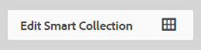

# Administrar colecciones {#managing-collections}

Una colección es un conjunto de recursos de Adobe Experience Manager Assets. Utilice colecciones para compartir recursos entre usuarios. El conjunto puede ser una colección estática o una colección dinámica basada en los resultados de la búsqueda.

A diferencia de las carpetas, una colección puede incluir recursos de distintas ubicaciones. Puede compartir colecciones con varios usuarios a los que se han asignado diferentes niveles de privilegios, como ver, editar, etc.

Puede compartir varias colecciones con un usuario. Cada colección contiene referencias a recursos. La integridad referencial de los recursos se mantiene en todas las colecciones.

Las colecciones son de los siguientes tipos, según la forma en que recopilan los recursos:

* Colección que contiene una lista de referencia estática de recursos, carpetas y otras colecciones.
* Colección inteligente que incluye de forma dinámica recursos basados en criterios de búsqueda.

## Acceda a la consola de colecciones {#navigating-the-collections-console}

Para abrir las **[!UICONTROL colecciones]**, toque o haga clic en el logotipo del Experience Manager. En la página de navegación, vaya a **[!UICONTROL Recursos]** > **[!UICONTROL Colecciones]**.

## Crear una colección {#creating-a-collection}

Puede crear una colección con [referencias estáticas](#creating-a-collection-with-static-references) o basadas en un [filtro basado en criterios de búsqueda](#creating-a-smart-collection). También puede crear una colección a partir de una caja de iluminación.

### Crear una colección con referencias estáticas {#creating-a-collection-with-static-references}

Puede crear una colección con referencias estáticas, por ejemplo, una colección con referencias a recursos, carpetas, colecciones, conjuntos de giros y conjuntos de imágenes.

1. Vaya a la consola **[!UICONTROL Colecciones]**.
1. En la barra de herramientas, toque o haga clic en **[!UICONTROL Crear]**.
1. En la página **[!UICONTROL Crear colección]**, escriba un título y una descripción opcional para la colección.
1. Agregue miembros a la colección y asigne los permisos correspondientes. Como alternativa, seleccione **[!UICONTROL Colección pública]** para permitir que todos los usuarios tengan acceso a la colección.

   >[!NOTE]
   >
   >Para permitir que los miembros compartan colecciones con otros usuarios, proporcione los `dam-users` permisos de lectura del grupo en la ruta `home/users`. Otorgue permiso a los usuarios en la ubicación `/content/dam/collections` para permitir que los usuarios realicen la vista de las colecciones en listas emergentes. También puede hacer que el usuario forme parte del grupo `dam-users`.

1. (Opcional) Añada una imagen en miniatura para la colección.
1. Toque o haga clic en **[!UICONTROL Crear]** y, a continuación, pulse o haga clic en **[!UICONTROL Aceptar]** para cerrar el cuadro de diálogo. En la consola Colecciones se abre una colección con el título y las propiedades especificados.

   >[!NOTE]
   >
   >Recursos Experience Manager permite crear tareas de revisión para una colección de forma similar a como se crean tareas de revisión para una carpeta de recursos.

   Para añadir recursos a la colección, vaya a la interfaz de usuario de Recursos. Para obtener más información, consulte [Añadir recursos a una colección](/help/assets/managing-collections-touch-ui.md#adding-assets-to-a-collection).

### Crear colecciones con dropzone {#create-collections-using-dropzone}

Puede arrastrar recursos de la interfaz de usuario de Recursos a una colección. También puede crear una copia de una colección y arrastrar los recursos allí.

1. En la interfaz de usuario de Recursos, seleccione los recursos que desee agregar a una colección.
1. Arrastre los recursos a la zona **[!UICONTROL Colocar en colección]**.

   

   Suelte el botón del ratón cuando Dropzone se active y su etiqueta cambie a **[!UICONTROL Colocar para Añadir]**.

   

   También puede tocar o hacer clic en el icono **[!UICONTROL Colección]** de la barra de herramientas.

   

1. En la página **[!UICONTROL Agregar a la colección]**, pulse o haga clic en el icono **[!UICONTROL Crear colección]** de la barra de herramientas.

   Si desea agregar los recursos a una colección existente, selecciónela en la página y pulse o haga clic en **[!UICONTROL Agregar]**. De forma predeterminada, se selecciona la colección con la fecha de actualización más reciente.

1. En el cuadro de diálogo **[!UICONTROL Crear nueva colección]**, indique un nombre para la colección. Si desea que todos los usuarios tengan acceso a la colección, seleccione **[!UICONTROL Colección pública]**.
1. Toque o haga clic en **[!UICONTROL Continuar]** para crear la colección.

### Crear una colección inteligente {#creating-a-smart-collection}

Una colección inteligente utiliza criterios de búsqueda para rellenar recursos de forma dinámica. Puede crear una colección inteligente utilizando solo archivos y no carpetas o archivos y carpetas.

Para crear una colección inteligente, siga los pasos:

1. Vaya a la interfaz de usuario de Recursos y toque o haga clic en el icono de búsqueda.

1. Escriba la palabra clave de búsqueda en el cuadro Omniture y pulse Intro. Abra el panel Filtros y aplique un filtro de búsqueda.

1. En la lista **[!UICONTROL Files &amp; Folders]**, seleccione **[!UICONTROL Files]**.

   

1. Toque o haga clic en **[!UICONTROL Guardar colección inteligente]**.
1. Especifique un nombre para la colección. Seleccione **[!UICONTROL Público]** para agregar el grupo Usuarios de DAM con la función Visor a la colección inteligente.

   

   >[!NOTE]
   >
   >Si selecciona **[!UICONTROL Público]**, la colección inteligente estará disponible para todos los usuarios con la función de propietario después de crearla. Si anula la selección de la opción **[!UICONTROL Público]**, el grupo de usuarios DAM ya no se asocia a la colección inteligente.

1. Pulse o haga clic en **[!UICONTROL Guardar]** para crear la colección inteligente y, a continuación, cierre el cuadro de mensaje para completar el proceso.

   La nueva colección inteligente también se agrega a la lista **[!UICONTROL Búsquedas guardadas]**.

   

   La etiqueta del botón **[!UICONTROL Crear selección inteligente]** cambia a **[!UICONTROL Editar selección inteligente]**. Para editar la configuración de la colección inteligente, seleccione **[!UICONTROL Archivos]** en la lista **[!UICONTROL Archivos y carpetas]**. A continuación, pulse o haga clic en el botón **[!UICONTROL Editar selección inteligente]**.

   

## Añadir recursos a una colección {#adding-assets-to-a-collection}

Puede agregar recursos a una colección que contenga una lista de los recursos o carpetas a los que se hace referencia. Las colecciones inteligentes utilizan una consulta de búsqueda para rellenar los recursos. Por lo tanto, las referencias estáticas a recursos y carpetas no son aplicables a ellos.

1. En la interfaz de usuario de Recursos, seleccione el recurso y toque o haga clic en el icono **[!UICONTROL Colección]** de la barra de herramientas.

   

   También puede arrastrar el recurso al área **[!UICONTROL Colocar en colección]** de la interfaz. Añada los recursos cuando la etiqueta de la región cambie a **[!UICONTROL Colocar para Añadir]**.

1. En la página **[!UICONTROL Añadir a la colección]**, seleccione la colección a la que desea agregar el recurso.

1. Toque o haga clic **[!UICONTROL Añada]** y cierre el mensaje de confirmación. El recurso se agrega a la colección.

## Editar una colección inteligente {#editing-a-smart-collection}

Las colecciones inteligentes se crean al guardar una búsqueda para que pueda modificar su contenido modificando los parámetros de búsqueda de la [búsqueda guardada](#editing-saved-searches).

1. En la interfaz de usuario de Recursos, toque o haga clic en el icono de búsqueda de la barra de herramientas.

   

1. Con el cursor en el cuadro Omniture search, presione la tecla Retorno.

1. Toque o haga clic en el icono de GlobalNav para mostrar el panel Filtros.

1. En la lista **[!UICONTROL Búsquedas guardadas]**, seleccione la colección inteligente que desee modificar. El panel Buscar aparecen los filtros configurados para la búsqueda guardada.

   

1. En la lista **[!UICONTROL Files &amp; Folders]**, seleccione **[!UICONTROL Files]**.

1. Modifique uno o varios filtros, según sea necesario. Toque o haga clic **[!UICONTROL Editar colección inteligente]**.

   También puede editar el nombre de la colección inteligente.

   

1. Toque o haga clic en **[!UICONTROL Guardar]**. Aparece el cuadro de diálogo **[!UICONTROL Editar colección inteligente]**.

1. Toque o haga clic **[!UICONTROL Sobrescribir]** para reemplazar la colección inteligente original por la colección editada. También puede seleccionar **[!UICONTROL Guardar como]** para guardar la colección editada por separado.

1. En el cuadro de diálogo de confirmación, toque o haga clic **[!UICONTROL Guardar]** para completar el proceso.

## Vista y edición de metadatos de recopilación {#viewing-and-editing-collection-metadata}

Los metadatos de la colección incluyen datos sobre la colección, incluidas las etiquetas que se agreguen.

1. En la consola Colecciones, seleccione una colección y toque o haga clic en el icono **[!UICONTROL Propiedades]** de la barra de herramientas.
1. En la página **[!UICONTROL Metadatos de la colección]**, consulte los metadatos de la colección desde las pestañas **[!UICONTROL Básico]** y **[!UICONTROL Avanzado]**.
1. Modifique los metadatos, según sea necesario, y toque o haga clic **[!UICONTROL Guardar y cerrar]** en la barra de herramientas para guardar los cambios.

### Editar metadatos de varias colecciones de forma masiva {#editing-collection-metadata-in-bulk}

Puede editar los metadatos de varias colecciones simultáneamente. Esta funcionalidad le ayuda a replicar rápidamente metadatos comunes en varias colecciones.

1. En la consola Colecciones, seleccione dos o más colecciones para las que desee editar los metadatos.
1. En la barra de herramientas, toque o haga clic en **[!UICONTROL Propiedades]**.
1. En la página **[!UICONTROL Metadatos de la colección]**, edite los metadatos en las pestañas **[!UICONTROL Básico]** y **[!UICONTROL Avanzado]**, según sea necesario.
1. Para vista de las propiedades de metadatos de una colección específica, anule la selección de las colecciones restantes de la lista de colecciones. Los campos del editor de metadatos se rellenan con los metadatos de la colección en particular.

   >[!NOTE]
   >
   >* En la página de propiedades de la colección, puede quitar colecciones de la lista de colecciones anulándolas. La lista de colecciones tiene todas las colecciones seleccionadas de forma predeterminada. Los metadatos de las colecciones que elimine no se actualizarán.
   >* En la parte superior de la lista, active la casilla de verificación situada cerca de **[!UICONTROL Título]** para alternar entre seleccionar las colecciones y borrar la lista.

1. Toque o haga clic **[!UICONTROL Guardar y cerrar]** desde la barra de herramientas y, a continuación, cierre el cuadro de diálogo de confirmación para completar el proceso.
1. Para anexar los nuevos metadatos con los metadatos existentes, seleccione **[!UICONTROL Modo de anexado]**. Si no selecciona esta opción, los metadatos nuevos sustituirán a los metadatos existentes en los campos. Pulse o haga clic en **[!UICONTROL Enviar]**.

   >[!NOTE]
   >
   >Los metadatos que se agregan para las colecciones seleccionadas sobrescriben los metadatos anteriores para estas colecciones. Utilice el [!UICONTROL modo Anexar] para agregar nuevos valores a los metadatos existentes en los campos que pueden contener varios valores. Los campos de un solo valor siempre se sobrescriben. Las etiquetas que agregue en el campo [!UICONTROL Etiquetas] se anexan a la lista existente de etiquetas en los metadatos.

Para personalizar la página [!UICONTROL Propiedades] de metadatos, incluida la adición, modificación y eliminación de propiedades de metadatos, utilice el editor de Esquema.

>[!TIP]
>
>El método de edición masiva funciona para los recursos disponibles en una colección. En el caso de los recursos disponibles en todas las carpetas o que cumplen un criterio común, es posible actualizar de forma masiva los metadatos después de buscar en estos recursos.

## Buscar colecciones {#searching-collections}

Puede buscar colecciones desde la consola Colecciones. Al buscar palabras clave en el cuadro Omniture, AEM Assets busca los nombres de las colecciones, los metadatos y las etiquetas agregadas a las colecciones.

Si busca colecciones desde el nivel superior, solo se devuelven colecciones individuales en los resultados de búsqueda. Se excluyen los recursos o las carpetas de las colecciones. En todos los demás casos (por ejemplo, dentro de una colección individual o en una jerarquía de carpetas), se devuelven todos los recursos, carpetas y colecciones relevantes.

## Buscar dentro de las colecciones {#searching-within-collections}

En la consola Colecciones, toque o haga clic en una colección para abrirla.

Dentro de una colección, AEM búsqueda de recursos está restringida a los recursos (y sus etiquetas y metadatos) dentro de la colección que está viendo. Al buscar dentro de una carpeta, se devuelven todos los recursos y las carpetas secundarias que coinciden con la carpeta actual. Al buscar dentro de una colección, solo se devuelven los recursos, las carpetas y otras colecciones que coinciden con los miembros directos de la colección.

## Editar la configuración de la colección {#editing-collection-settings}

Puede editar la configuración de la colección, como título y descripción, o bien añadir miembros a una colección.

1. Seleccione una colección y toque o haga clic en el icono **[!UICONTROL Configuración]** de la barra de herramientas. También puede utilizar la acción rápida **[!UICONTROL Settings]** de la miniatura de la colección.
1. Modifique la configuración de la colección en la página **[!UICONTROL Configuración de la colección]**. Por ejemplo, modifique el título de la colección, las descripciones, los miembros y los permisos como se explica en [Añadir colecciones](#creating-a-collection).

1. Para guardar los cambios, toque o haga clic en **[!UICONTROL Guardar]**.

## Eliminar una colección {#deleting-a-collection}

1. En la consola Colecciones, seleccione una o varias colecciones y toque o haga clic en el icono Eliminar de la barra de herramientas.

1. En el cuadro de diálogo, toque o haga clic en **[!UICONTROL Eliminar]** para confirmar la acción de eliminar.

   >[!NOTE]
   >
   >También puede eliminar colecciones inteligentes [eliminando las búsquedas guardadas](#deleting-saved-searches).

## Descargar una colección {#downloading-a-collection}

Al descargar una colección, se descarga toda la jerarquía de recursos de la colección, incluidas las carpetas y las colecciones secundarias.

1. En la consola Colecciones, seleccione una o varias colecciones para descargar.
1. En la barra de herramientas, toque o haga clic en el icono de descarga.
1. En el cuadro de diálogo **[!UICONTROL Descargar]**, toque o haga clic en **[!UICONTROL Descargar]**. Si desea descargar las representaciones de los recursos de la colección, seleccione **[!UICONTROL Representaciones]**. Seleccione la opción **[!UICONTROL Correo electrónico]** para enviar una notificación por correo electrónico al propietario de la colección.

   Cuando selecciona una colección para descargar, se descarga la jerarquía completa de carpetas bajo la colección. Para incluir cada colección que descargue (incluidos los recursos de las colecciones secundarias anidadas en la colección principal) en una carpeta individual, seleccione **[!UICONTROL Crear una carpeta independiente para cada recurso]**.

## Crear colecciones anidadas {#creating-nested-collections}

Puede agregar una colección a otra colección, creando así una colección anidada.

1. En la consola Colecciones, seleccione la colección o el grupo de colecciones que desee y toque o haga clic en el icono **[!UICONTROL Para colección]** de la barra de herramientas.

   

1. En la página **[!UICONTROL Añadir a colección]**, seleccione la colección en la que desea agregar la colección.

   >[!NOTE]
   >
   >La colección actualizada más recientemente está seleccionada de forma predeterminada en la página **[!UICONTROL Añadir a colección]**.

1. Toque o haga clic **[!UICONTROL Añadir]**. Un mensaje confirma que la colección se agrega a la colección de destinatarios en la página **[!UICONTROL Seleccionar destino]**. Cierre el mensaje para completar el proceso.

>[!NOTE]
>
>Las colecciones inteligentes no se pueden anidar. En otras palabras, las colecciones inteligentes no pueden contener ninguna otra colección.

## Búsquedas guardadas {#saved-searches}

En la interfaz de usuario de Assets, puede buscar o filtrar recursos en función de determinadas reglas, criterios de búsqueda o facetas de búsqueda personalizadas. Si los guarda como **[!UICONTROL Búsquedas guardadas]**, puede acceder a ellos más adelante desde la lista **[!UICONTROL Búsquedas guardadas]** del panel Filtro. Al crear una búsqueda guardada también se crea una colección inteligente.

### Crear búsquedas guardadas {#creating-saved-searches}

Las búsquedas guardadas se crean al crear una colección inteligente. Las colecciones inteligentes se agregan automáticamente a la lista **[!UICONTROL Búsquedas guardadas]**. La consulta Búsquedas guardadas para la colección se guarda en la propiedad `dam:query` en crxde en la ubicación relativa `/content/dam/collections/`. No hay límites para las búsquedas que puede guardar ni para las búsquedas guardadas que se muestran en la lista.

>[!NOTE]
>
>Puede compartir colecciones inteligentes del mismo modo que comparte colecciones estáticas.

### Editar búsquedas guardadas {#editing-saved-searches}

Editar búsquedas guardadas es lo mismo que editar colecciones inteligentes. Para obtener más información, consulte [Edición de una colección inteligente](/help/assets/managing-collections-touch-ui.md#editing-a-smart-collection).

### Eliminar búsquedas guardadas {#deleting-saved-searches}

1. En la interfaz de usuario de Recursos, toque o haga clic en el icono de búsqueda de la barra de herramientas.

   

1. Con el cursor en el campo Omniture search, presione la tecla Intro.

1. Toque o haga clic en el icono de GlobalNav para mostrar el panel Filtros.

1. En la lista **[!UICONTROL Búsquedas guardadas]**, toque o haga clic en el icono Eliminar situado junto a la colección inteligente que desee eliminar.

   

1. En el cuadro de diálogo, toque o haga clic en **[!UICONTROL Eliminar]** para eliminar la búsqueda guardada.

## Ejecutar un flujo de trabajo en una colección {#running-a-workflow-on-a-collection}

Puede ejecutar un flujo de trabajo para los recursos de una colección. Si la colección contiene colecciones anidadas, el flujo de trabajo también se ejecuta en los recursos de las colecciones anidadas. Sin embargo, si la colección y la colección anidada contienen recursos de duplicado, el flujo de trabajo solo se ejecuta una vez para dichos recursos.

1. En la consola Colecciones, seleccione una colección en la que desee ejecutar un flujo de trabajo.
1. Toque o haga clic en el icono de GlobalNav y elija **[!UICONTROL Línea de tiempo]** en la lista.
1. En la cronología, pulse o haga clic en el icono del circunflejo invertido en la parte inferior y, a continuación, pulse o haga clic en **[!UICONTROL Iniciar flujo de trabajo]**.

   

1. En la sección **[!UICONTROL Iniciar flujo de trabajo]**, seleccione un modelo de flujo de trabajo de la lista. Por ejemplo, seleccione el modelo **[!UICONTROL Recurso de actualización DAM]**.
1. Escriba un título para el flujo de trabajo y toque o haga clic en **[!UICONTROL Inicio]**.
1. En el cuadro de diálogo, toque o haga clic **[!UICONTROL Continuar]**. El flujo de trabajo se ejecuta en todos los recursos de la colección.

>[!MORELIKETHIS]
>
>* [Configuración de las notificaciones por correo electrónico de Recursos Experience Manager](/help/sites-administering/notification.md#assetsconfig)
>* [Crear una tarea de revisión para colecciones](bulk-approval.md)

