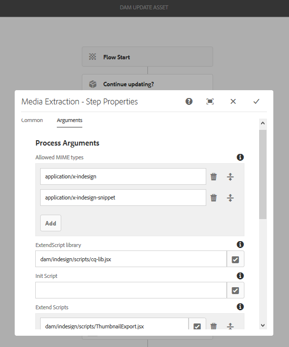
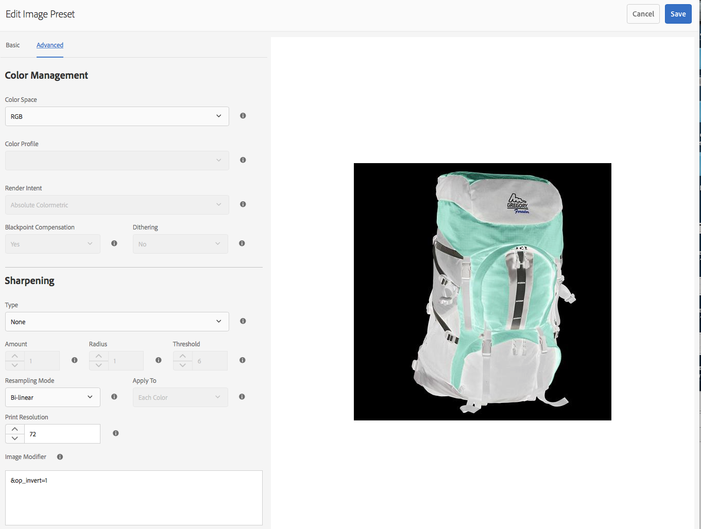
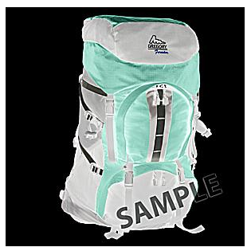
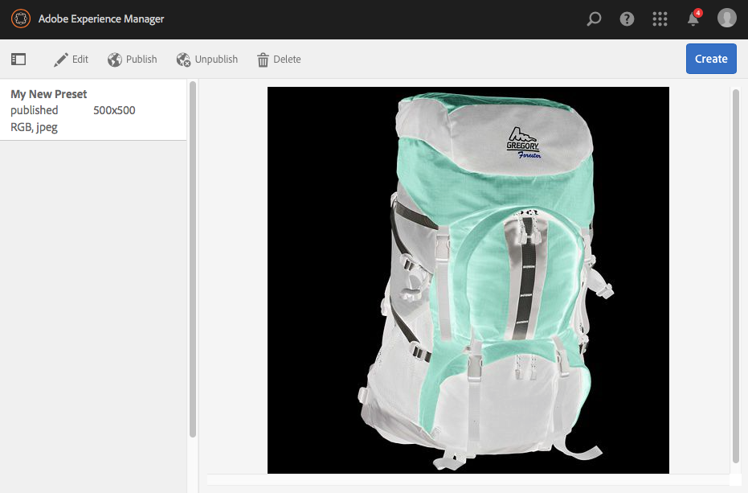

# Administración de ajustes preestablecidos de imagen de Dynamic Media {#managing-image-presets}

>[!CAUTION]
>
>AEM 6.4 ha llegado al final de la compatibilidad ampliada y esta documentación ya no se actualiza. Para obtener más información, consulte nuestra [períodos de asistencia técnica](https://helpx.adobe.com/es/support/programs/eol-matrix.html). Buscar las versiones compatibles [here](https://experienceleague.adobe.com/docs/).

Los ajustes preestablecidos de imagen permiten a AEM Assets entregar de forma dinámica imágenes con tamaños diferentes, en formatos diferentes o con otras propiedades de imagen generadas de forma dinámica. Cada ajuste preestablecido de imagen representa una colección predefinida de comandos de tamaño y formato para mostrar imágenes. Al crear un ajuste preestablecido de imagen, se elige un tamaño para la entrega de imágenes. También puede elegir los comandos de formato para que el aspecto de la imagen se optimice cuando la imagen se entregue para su visualización.

Los administradores pueden crear ajustes preestablecidos para exportar recursos. Los usuarios pueden elegir un ajuste preestablecido cuando exportan imágenes, lo que también les permite cambiar el formato de las imágenes según las especificaciones del administrador.

También puede crear ajustes preestablecidos de imagen que sean interactivos. Si aplica un ajuste preestablecido de imagen adaptable a sus recursos, estos cambian según el dispositivo o el tamaño de pantalla en el que se vean. Puede configurar ajustes preestablecidos de imagen para que utilicen CMYK en el espacio de color, además de RGB o gris.

En esta sección se describe cómo crear, modificar y administrar los ajustes preestablecidos de imagen en general. Puede aplicar un ajuste preestablecido de imagen a una imagen cada vez que la previsualice. Consulte [Aplicación de ajustes preestablecidos de imagen](image-presets.md).

>[!NOTE]
>
>Las imágenes inteligentes funcionan con los ajustes preestablecidos de imagen existentes y utilizan la inteligencia en el último milisegundo de envío para reducir aún más el tamaño del archivo de imagen en función de la velocidad de conexión de red o del explorador. Consulte [Imágenes inteligentes](imaging-faq.md) para obtener más información.

## Explicación de los ajustes preestablecidos de imagen de Dynamic Media {#understanding-image-presets}

Al igual que una macro de software, un ajuste preestablecido de imagen es una colección predefinida de comandos de tamaño y formato guardados con un nombre. Para comprender cómo funcionan los ajustes preestablecidos de imagen, supongamos que el sitio web requiere que cada imagen de producto aparezca en diferentes tamaños, formatos diferentes y tasas de compresión para la entrega por equipos de escritorio y dispositivos móviles.

Puede crear dos ajustes preestablecidos de imagen: uno con 500 x 500 píxeles para la versión de escritorio y 150 x 150 píxeles para la versión móvil. Se crean dos ajustes preestablecidos de imagen, uno llamado *Ampliar* para mostrar imágenes a 500 x 500 píxeles y una llamada *Miniatura* para mostrar las imágenes a 150 x 150 píxeles. Para ofrecer imágenes con el tamaño Ampliar y Miniatura, AEM busca la definición del ajuste preestablecido Ampliar imagen y el ajuste preestablecido de imagen en miniatura. A continuación, AEM genera dinámicamente una imagen con las especificaciones de tamaño y formato de cada ajuste preestablecido de imagen.

Las imágenes con un tamaño reducido cuando se entregan de forma dinámica pueden perder nitidez y detalle. Por este motivo, cada ajuste preestablecido de imagen contiene controles de formato para optimizar una imagen cuando se entrega a un tamaño concreto. Estos controles garantizan que las imágenes sean nítidas y claras cuando se envían al sitio web o a la aplicación.

Los administradores pueden crear ajustes preestablecidos de imagen. Para crear un ajuste preestablecido de imagen, puede empezar desde cero o desde uno existente y guardarlo con un nuevo nombre.

## Administración de ajustes preestablecidos de imagen de Dynamic Media {#managing-image-presets-1}

Para administrar los ajustes preestablecidos de imagen en AEM, pulse el logotipo de AEM para acceder a la consola de navegación global, pulse el icono Herramientas y navegue hasta **[!UICONTROL Assets > Ajustes preestablecidos de imagen]**.


>[!NOTE]
>
>Los ajustes preestablecidos de imagen que cree también estarán disponibles como representaciones dinámicas cuando realice la vista previa o el envío de recursos.
>
>En *Dynamic Media: modo Scene7*, usted *not* es necesario publicar ajustes preestablecidos de imagen, ya que los ajustes preestablecidos de imagen se publican automáticamente.
>
>En *Dynamic Media: modo híbrido*, es necesario publicar manualmente los ajustes preestablecidos de imagen.
>
>Consulte [Publicar ajustes preestablecidos de imagen.](#publishing-image-presets)

>[!NOTE]
>
>El sistema muestra una variedad de representaciones al seleccionar **[!UICONTROL Representaciones]** en un recurso **[!UICONTROL Detalle]** Ver. Puede aumentar o disminuir el número de ajustes preestablecidos de imagen que se muestran. Consulte [Aumento del número de ajustes preestablecidos de imagen que se muestran](#increasing-or-decreasing-the-number-of-image-presets-that-display).

### Formatos de archivo Adobe Illustrator (AI), Postscript (EPS) y PDF {#adobe-illustrator-ai-postscript-eps-and-pdf-file-formats}

Si tiene intención de admitir la ingesta de archivos AI, EPS y PDF para poder generar representaciones dinámicas de estos formatos de archivo, es posible que desee revisar la siguiente información antes de crear ajustes preestablecidos de imagen.

El formato de archivo de Adobe Illustrator es una variante de PDF. Las principales diferencias, en el contexto de AEM Assets, son las siguientes:

* Los documentos de Adobe Illustrator constan de una sola página con varias capas. Cada capa se extrae como un subrecurso PNG bajo el recurso principal de Illustrator.
* Los documentos del PDF constan de una o más páginas. Cada página se extrae como un subrecurso de PDF de página única en el documento principal de PDF de varias páginas.

Los subrecursos se crean mediante la variable `Create Sub Asset process` dentro del `DAM Update Asset` flujo de trabajo. Para ver este componente de proceso en el flujo de trabajo, pulse **[!UICONTROL Herramientas > Flujo de trabajo > Modelos > Recurso de actualización DAM > Editar]**.

Consulte también [Visualización de páginas de un archivo de varias páginas](/help/assets/managing-linked-subassets.md#view-pages-of-a-multi-page-file).

Puede ver los subrecursos o las páginas al abrir el recurso, pulsar el menú Contenido y seleccionar **[!UICONTROL Subrecursos]** o **[!UICONTROL Páginas]**. Los subactivos son activos reales. Es decir, las páginas del PDF se extraen mediante la variable `Create Sub Asset` componente de flujo de trabajo. A continuación, se almacenan como `page1.pdf`, `page2.pdf`, etc. debajo del recurso principal. Una vez almacenados, la variable **[!UICONTROL Recurso de actualización DAM]** flujo de trabajo los procesa.

Para utilizar Dynamic Media para obtener una vista previa y generar representaciones dinámicas para archivos AI, EPS o PDF, se requieren los siguientes pasos de procesamiento:

1. En el **[!UICONTROL Recurso de actualización DAM]** flujo de trabajo, la variable **[!UICONTROL Rasterizar representación de PDF/vista previa de imagen de IA]** componente de proceso rasteriza la primera página del recurso original mediante la resolución configurada en un `cqdam.preview.png` representación.

1. La variable `cqdam.preview.png` a continuación, la representación se optimiza en un PTIFF mediante la función **[!UICONTROL Recursos de imagen de proceso de Dynamic Media]** componente de proceso dentro del flujo de trabajo.

>[!NOTE]
>
>En el **[!UICONTROL Recurso de actualización DAM]** flujo de trabajo, la variable **[!UICONTROL Miniaturas de EPS]** genera miniaturas para los archivos EPS.

### Propiedades de metadatos de recursos de PDF/IA/EPS {#pdf-ai-eps-asset-metadata-properties}

| **Propiedad Metadata** | **Descripción** |
|---|---|
| dam:Physicalwidthinpulgadas | Ancho del documento en pulgadas. |
| dam:Physicalheightinpulgadas | Altura del documento en pulgadas. |

Puede acceder a **[!UICONTROL Rasterizar representación de PDF/vista previa de imagen de IA]** opciones de componentes de proceso mediante **[!UICONTROL Recurso de actualización DAM]** flujo de trabajo.

Toque en Adobe Experience Manager, en la esquina superior izquierda, vaya a **[!UICONTROL Herramientas > Flujo de trabajo > Modelos]**. En el **[!UICONTROL Modelos de flujo de trabajo]** página, seleccione **[!UICONTROL Recurso de actualización DAM]** y, a continuación, en la barra de herramientas, pulse **[!UICONTROL Editar]**. En el **[!UICONTROL Flujo de trabajo de recursos de actualización de DAM]** , toque dos veces el botón **[!UICONTROL Rasterizar representación de PDF/vista previa de imagen de IA]** procesar componente para abrir su **[!UICONTROL Propiedades de los pasos]** para abrir el Navegador.

### Rasterizar opciones de representación de vista previa de imágenes de PDF/AI {#rasterize-pdf-ai-image-preview-rendition-options}


**Argumentos para rasterizar el PDF o el flujo de trabajo de IA**

<table> 
 <tbody> 
  <tr> 
   <td><strong>Argumento de proceso</strong></td>
   <td><strong>Configuración predeterminada</strong></td>
   <td><strong>Descripción</strong></td>
  </tr> 
  <tr> 
   <td>Tipos MIME</td>
   <td><p>application/pdf</p> <p>application/postscript</p> <p>aplicación/ilustrador<br/> </p> </td>
   <td>Lista de tipos de mime de documento que se consideran documentos PDF o Illustrator.<br/> </td>
  </tr> 
  <tr> 
   <td>Anchura máxima</td>
   <td>2048</td>
   <td>Ancho máximo de la representación de vista previa generada, en píxeles.<br/> </td>
  </tr> 
  <tr> 
   <td>Altura máxima</td>
   <td>2048</td>
   <td>Altura máxima de la representación de vista previa generada, en píxeles.<br/> </td>
  </tr> 
  <tr> 
   <td>Resolución</td>
   <td>72</td>
   <td>Resolución para rasterizar la primera página, en ppi (píxeles por pulgada).</td>
  </tr>
 </tbody>
</table>

Con los argumentos de proceso predeterminados, la primera página de un documento PDF/AI se rasteriza a 72 ppi y la imagen de vista previa generada tiene un tamaño de 2048 x 2048 píxeles. Para una implementación típica, es posible que desee aumentar la resolución a un mínimo de 150 ppi o más. Por ejemplo, un documento de tamaño de letra de EE. UU. a 300 ppi requiere una anchura y una altura máximas de 2550 x 3300 píxeles, respectivamente.

**[!UICONTROL Ancho máximo]** y **[!UICONTROL Altura máxima]** limitar la resolución a la que se debe rasterizar. Por ejemplo, si los máximos no cambian y la resolución se establece en 300 ppi, se rasteriza un documento de carta de EE. UU. a 186 ppi. Es decir, el documento es de 1581 x 2046 píxeles.

La variable **[!UICONTROL Rasterizar representación de PDF/vista previa de imagen de IA]** el componente de proceso tiene un máximo definido para garantizar que no cree imágenes demasiado grandes en la memoria. Estas imágenes grandes pueden desbordarse la memoria proporcionada a la JVM (máquina virtual Java). Se debe tener cuidado de proporcionar a la JVM suficiente memoria para administrar el número configurado de flujos de trabajo paralelos, con cada uno con el potencial de crear una imagen al tamaño máximo configurado.

### Formato del archivo InDesign (INDD) {#indesign-indd-file-format}

Si tiene intención de admitir la ingesta de archivos INDD para poder generar una representación dinámica de este formato de archivo, es posible que desee revisar la siguiente información antes de crear ajustes preestablecidos de imagen.

Para los archivos de InDesign, los subrecursos se extraen solo si el servidor de Adobe InDesign está integrado con AEM. Los recursos a los que se hace referencia están vinculados según sus metadatos. No se requiere InDesign Server para la vinculación. Sin embargo, los recursos a los que se hace referencia deben estar presentes en AEM antes de que se procesen los archivos de InDesign para que se creen los vínculos entre los archivos de InDesign y los recursos a los que se hace referencia.

Consulte [Integración de AEM Assets con InDesign Server](indesign.md).

El componente de proceso Extracción de medios en la variable **[!UICONTROL Recurso de actualización DAM]** el flujo de trabajo ejecuta varias **[!UICONTROL Ampliar secuencias de comandos]** para procesar archivos de InDesign.



La variable **[!UICONTROL Extensión de secuencia de comandos]** rutas en los argumentos de **[!UICONTROL Extracción de medios]** componente de proceso en el **[!UICONTROL Recurso de actualización DAM]** flujo de trabajo.

La integración de Dynamic Media utiliza las siguientes secuencias de comandos:

<table> 
 <tbody> 
  <tr> 
   <td><strong>Ampliar nombre de script</strong></td>
   <td><strong>Predeterminado</strong></td>
   <td><strong>Descripción</strong></td>
  </tr> 
  <tr> 
   <td>ThumbnailExport.jsx</td>
   <td>Sí</td>
   <td>Genera una ppi de 300 <code>thumbnail.jpg</code> representación optimizada y convertida en una representación PTIFF por <code>Dynamic Media Process Image Assets</code> componente de proceso.<br/> </td>
  </tr> 
  <tr> 
   <td>JPEGPagesExport.jsx</td> 
   <td>Sí</td> 
   <td>Genera un subrecurso de JPEG de 300 ppi para cada página. El subrecurso JPEG es un recurso real almacenado en el recurso InDesign. También está optimizado y se convierte en un PTIFF mediante la función <code>DAM Update Asset</code> flujo de trabajo.<br/> </td>
  </tr> 
  <tr> 
   <td>PDFPagesExport.jsx</td>
   <td>No</td>
   <td>Genera un subrecurso de PDF para cada página. El subrecurso del PDF se procesa como se describió anteriormente. Como el PDF solo contiene una página, no se generan subrecursos.<br/> </td>
  </tr> 
 </tbody> 
</table>

## Configuración del tamaño de la miniatura de imagen {#configuring-image-thumbnail-size}

Puede configurar el tamaño de las miniaturas configurando esos ajustes en la variable **[!UICONTROL Recurso de actualización DAM]** flujo de trabajo. Hay dos pasos en el flujo de trabajo donde puede configurar el tamaño de las miniaturas de los recursos de imagen. Aunque uno (**[!UICONTROL Recursos de imagen de proceso de Dynamic Media]**) se utiliza para los recursos de imagen dinámica y el otro (**[!UICONTROL Miniaturas de proceso]**) para la generación de miniaturas estáticas o cuando todos los demás procesos no pueden generar miniaturas, *both* debe tener la misma configuración.

Con el paso **[!UICONTROL Recursos de imagen de proceso de Dynamic Media]**, el servidor de imágenes genera miniaturas y esta configuración es independiente de la configuración aplicada al paso **[!UICONTROL Procesar miniaturas]**. La generación de miniaturas a través del paso **[!UICONTROL Miniaturas de proceso]** es la forma más lenta y con mayor consumo de memoria para crear miniaturas.

El tamaño de las miniaturas se define en el siguiente formato: **width:height:center**, por ejemplo *80:80:false*. La anchura y la altura determinan el tamaño en píxeles de la miniatura; el valor central es false o true y, si se establece en true, indica que la imagen en miniatura tiene exactamente el tamaño indicado en la configuración. Si la imagen cambiada de tamaño es más pequeña, se centrará dentro de la miniatura.

>[!NOTE]
>
>* El tamaño de las miniaturas de los archivos EPS se configura en el paso de **[!UICONTROL miniaturas EPS]**, en la pestaña **[!UICONTROL Argumentos]****[!UICONTROL , en Miniaturas]**.
>
>* El tamaño de las miniaturas de los vídeos se configura en el paso **[!UICONTROL Miniaturas FFmpeg]**, en la pestaña **[!UICONTROL Proceso]**, en **[!UICONTROL Argumentos]**.
>


**Para configurar el tamaño de las miniaturas**:

1. Toque **[!UICONTROL Herramientas > Flujo de trabajo > Modelos > Recurso de actualización DAM > Editar]**.
1. Toque . **[!UICONTROL Recursos de imagen de proceso de Dynamic Media]** a continuación, pulse el botón **[!UICONTROL Miniaturas]** pestaña . Cambie el tamaño de la miniatura, según sea necesario, y pulse **[!UICONTROL Aceptar]**.

   

1. Pulse el paso **[!UICONTROL Procesar miniaturas]** y, a continuación, pulse la pestaña **[!UICONTROL Miniaturas]**. Cambie el tamaño de la miniatura, según sea necesario, y toque **[!UICONTROL OK]**.

   >[!NOTE]
   >
   >Los valores del argumento de miniaturas del paso **[!UICONTROL Miniaturas de proceso]** deben coincidir con el argumento de miniaturas del paso **[!UICONTROL Recursos de imagen de proceso de Dynamic Media]**.

1. Toque **[!UICONTROL Guardar]** para guardar los cambios en el flujo de trabajo.

### Aumento o disminución del número de ajustes preestablecidos de imagen de Dynamic Media que se muestran {#increasing-or-decreasing-the-number-of-image-presets-that-display}

Los ajustes preestablecidos de imagen que cree estarán disponibles como representaciones dinámicas cuando se previsualizan los recursos. AEM muestra una variedad de representaciones dinámicas al ver un recurso desde **[!UICONTROL Vista de detalles > Representaciones]**. Puede aumentar o reducir el límite de representaciones que se muestran.

**Para aumentar o reducir el número de ajustes preestablecidos de imagen de Dynamic Media mostrados**:

1. Vaya a **[!UICONTROL CRXDE Lite]** ([http://localhost:4502/crx/de](http://localhost:4502/crx/de)).
1. Vaya al nodo de lista de ajustes preestablecidos de imagen en `/libs/dam/gui/coral/content/commons/sidepanels/imagepresetsdetail/imgagepresetslist`

   

1. En el **[!UICONTROL límite]** propiedad, cambie la variable **[!UICONTROL value]**, que se establece en 15 de forma predeterminada, con el número deseado.
1. Vaya a la fuente de datos del ajuste preestablecido de imagen en `/libs/dam/gui/coral/content/commons/sidepanels/imagepresetsdetail/imgagepresetslist/datasource`

   

1. En la propiedad limit , cambie el número por el número deseado, por ejemplo `{empty requestPathInfo.selectors[1] ? "20" : requestPathInfo.selectors[1]}`
1. Toque **[!UICONTROL Guardar todo]**.

### Creación de ajustes preestablecidos de imagen de Dynamic Media {#creating-image-presets}

La creación de un ajuste preestablecido de imagen de Dynamic Media permite aplicar esta configuración a cualquier imagen al obtener una vista previa o publicar.

>[!NOTE]
>
>Si utiliza Internet Explorer 9, la creación de un ajuste preestablecido no aparece en la lista de ajustes preestablecidos inmediatamente después de guardarlo. Para solucionar este problema, deshabilite la caché para IE9.

Si tiene intención de admitir la ingesta de archivos AI, PDF y EPS para poder generar una representación dinámica de estos formatos de archivo, es posible que desee revisar la siguiente información antes de crear ajustes preestablecidos de imagen.\
Consulte [Formatos de archivo Adobe Illustrator (AI), Postscript (EPS) y PDF](#adobe-illustrator-ai-postscript-eps-and-pdf-file-formats).

Si tiene intención de admitir la ingesta de archivos INDD para poder generar una representación dinámica de este formato de archivo, es posible que desee revisar la siguiente información antes de crear ajustes preestablecidos de imagen.  Consulte [Formato del archivo InDesign (INDD)](#indesign-indd-file-format).

>[!NOTE]
>
>Para crear ajustes preestablecidos de imagen de Dynamic Media, debe tener privilegios de administrador como administrador AEM o administrador de Admin Console.

**Para crear un ajuste preestablecido de imagen de Dynamic Media**:

1. En AEM, pulse el logotipo de AEM para acceder a la consola de navegación global.
1. Toque . **[!UICONTROL Herramientas]** y, a continuación, vaya a **[!UICONTROL Assets > Ajustes preestablecidos de imagen]**.
1. Pulse **[!UICONTROL Crear]**.

   

   >[!NOTE]
   >
   >Para que este ajuste preestablecido de imagen sea interactivo, borre los valores de los campos de **[!UICONTROL anchura]** y **[!UICONTROL altura]** y déjelos en blanco.

1. En el **[!UICONTROL Editar ajuste preestablecido de imagen]** , introduzca valores en la variable **[!UICONTROL Básico]** y **[!UICONTROL Avanzadas]** , incluido un nombre. Las opciones se describen en [Opciones de ajustes preestablecidos de imagen](#image-preset-options). Los ajustes preestablecidos aparecen en el panel izquierdo y se pueden utilizar sobre la marcha con otros recursos.

   

1. Haga clic en **[!UICONTROL Guardar]**.

### Creación de un ajuste preestablecido de imagen interactivo {#creating-a-responsive-image-preset}

Para crear un ajuste preestablecido de imagen interactivo, realice los pasos indicados en [Creación de ajustes preestablecidos de imagen](#creating-image-presets). Al introducir la altura y la anchura en la variable **[!UICONTROL Editar ajuste preestablecido de imagen]** , borre los valores y déjelos en blanco.

Dejarlos en blanco indica AEM que este ajuste preestablecido de imagen es interactivo. Puede ajustar los demás valores según corresponda.


>[!NOTE]
>
>Para ver la **[!UICONTROL URL]** y **[!UICONTROL RESS]** al aplicar un ajuste preestablecido de imagen a un recurso, este debe publicarse.
>
>En el modo Dynamic Media - Scene7, los ajustes preestablecidos de imagen y los recursos de imagen se publican automáticamente.
>
>En Dynamic Media: modo híbrido, debe publicar manualmente ajustes preestablecidos de imagen y recursos de imagen.

### Opciones de ajustes preestablecidos de imagen {#image-preset-options}

Cuando crea o edita ajustes preestablecidos de imagen, tiene las opciones descritas en esta sección. Además, el Adobe recomienda las tres siguientes *prácticas recomendadas* opciones para comenzar:

* **[!UICONTROL Formato]** (**[!UICONTROL Básico]** pestaña) - Seleccionar **[!UICONTROL JPEG]** u otro formato que cumpla con sus necesidades. Todos los navegadores web admiten el formato de imagen JPEG; ofrece un buen equilibrio entre los tamaños de archivos pequeños y la calidad de imagen. Sin embargo, las imágenes en formato JPEG utilizan un esquema de compresión con pérdidas que puede introducir artefactos de imagen no deseados si el ajuste de compresión es demasiado bajo. Por este motivo, Adobe recomienda establecer la calidad de compresión en 75. Este ajuste ofrece un buen equilibrio entre la calidad de imagen y el tamaño de archivo pequeño.
* **[!UICONTROL Activar enfoque simple]** - No seleccione **[!UICONTROL Activar enfoque simple]** (este filtro de enfoque ofrece menos control que la configuración de máscara de enfoque).
* **[!UICONTROL Enfoque: Modo de remuestreo]** - Seleccionar **[!UICONTROL Sharp2]**.

#### Opciones de ficha básicas {#basic-tab-options}

<table> 
 <tbody> 
  <tr> 
   <td><strong>Campo</strong></td>
   <td><strong>Descripción</strong></td>
  </tr> 
  <tr> 
   <td><strong>Nombre</strong></td>
   <td>Introduzca un nombre descriptivo sin espacios en blanco. Incluya la especificación de tamaño de imagen en el nombre para ayudar a los usuarios a identificar este ajuste preestablecido de imagen.</td>
  </tr>
  <tr> 
   <td><strong>Anchura y altura</strong></td>
   <td>Introduzca en píxeles el tamaño con el que se entrega la imagen. La anchura y la altura deben ser superiores a 0 píxeles. Si alguno de los valores es 0, no se crea ningún ajuste preestablecido. Si ambos valores están en blanco, se crea un ajuste preestablecido de imagen interactivo.</td>
  </tr> 
  <tr> 
   <td><strong>Formato</strong></td>
   <td><p>Elija un formato en el menú .</p> <p>Elección <strong>JPEG</strong> ofrece las siguientes opciones adicionales:</p>
    <ul> 
     <li><strong>Calidad</strong> - Controla el nivel de compresión del JPEG. Esta configuración afecta tanto al tamaño del archivo como a la calidad de la imagen. La escala de calidad del JPEG es de 1 a 100. La escala está visible al arrastrar el control deslizante.</li> 
     <li><strong>Habilitar disminución de resolución de crominancia del JPG</strong> - Como el ojo es menos sensible a la información de color de alta frecuencia que la luminancia de alta frecuencia, las imágenes JPEG dividen la información de la imagen en componentes de luminancia y color. Cuando se comprime una imagen de JPEG, el componente de luminancia se deja a resolución completa, mientras que los componentes de color se reducen al obtener una media de los grupos de píxeles. La disminución de la resolución de muestreo reduce el volumen de datos en una mitad o un tercio, sin afectar casi a la calidad percibida. La disminución de resolución no es aplicable a las imágenes en escala de grises. Esta técnica reduce la cantidad de compresión útil para imágenes con alto contraste (por ejemplo, imágenes con texto superpuesto).</li>
    </ul>
    <div>
      Elección
     <strong>GIF</strong> o
     <strong>GIF con alfa</strong> proporciona estos
     <strong>Cuantificación de color del GIF</strong> opciones:
    </div>
    <ul> 
     <li><strong>Tipo </strong>- Seleccionar <strong>Adaptable</strong> (predeterminado), <strong>Web</strong>o <strong>Macintosh</strong>. Si selecciona <strong>GIF con alfa</strong>, la opción Macintosh no está disponible.</li>
     <li><strong>Diámetro</strong> - Seleccionar <strong>Difusión</strong> o <strong>Off</strong>.</li>
     <li><strong>Número de colores </strong>- Escriba un número entre 2 y 256.</li>
     <li><strong>Lista de colores</strong> - Introduzca una lista separada por comas. Por ejemplo, para blanco, gris y negro, escriba 000000,88888,ffff.</li>
    </ul> 
    <div>
      Elección
     <strong>PDF</strong>,
     <strong>TIFF</strong>o
     <strong>TIFF con alfa</strong> proporciona esta opción adicional:
    </div>
    <ul>
     <li><strong>Compresión</strong> - Seleccione un algoritmo de compresión. Las opciones de algoritmo para el PDF son <strong>Ninguna</strong>, <strong>Zip</strong>y <strong>Jpeg</strong>; para TIFF <strong>Ninguna</strong>, <strong>LZW</strong>, <strong>Jpeg</strong>y <strong>Zip</strong>; y para el TIFF con Alpha son <strong>Ninguna</strong>, <strong>LZW</strong>y <strong>Zip</strong>.</li>
    </ul> <p>Elección <strong>PNG</strong>, <strong>PNG con Alpha,</strong> o <strong>EPS</strong> no proporciona opciones adicionales.</p> </td>
  </tr>
  <tr>
   <td><strong>Enfoque</strong></td>
   <td>Seleccione el <strong>Activar enfoque simple</strong> para aplicar un filtro de enfoque básico a la imagen después de que se haya realizado todo el escalado. El enfoque puede ayudar a compensar el desenfoque que puede producirse al mostrar una imagen con un tamaño diferente. </td>
  </tr>
 </tbody>
</table>

#### Opciones de ficha avanzadas {#advanced-tab-options}

<table>
 <tbody>
  <tr>
   <td><strong>Campo</strong></td>
   <td><strong>Descripción</strong></td>
  </tr>
  <tr>
   <td><strong>Espacio de color</strong></td>
   <td>Select <strong>RGB, CMYK,</strong> o <strong>Escala de grises</strong> para el espacio de color.</td>
  </tr>
  <tr>
   <td><strong>Perfil de color</strong></td>
   <td>Seleccione el perfil de espacio de color de salida al que debe convertirse el recurso si es diferente al perfil de trabajo.</td>
  </tr>
  <tr>
   <td><strong>Procesar intención</strong></td>
   <td>Puede anular la interpretación predeterminada. Las intenciones de renderización determinan lo que sucede con los colores que no se pueden reproducir en el perfil de color de destino (fuera de gama). Se ignora la interpretación de intenciones si no es compatible con el perfil ICC.
    <ul> 
     <li>Select <strong>Percepción</strong> para comprimir la gama total de un espacio de color en otro espacio de color cuando uno o más colores de la imagen original están fuera de la gama del espacio de color de destino.</li>
     <li>Select <strong>Colorimétrico relativo</strong> cuando un color del espacio de color actual está fuera de la gama en el espacio de color de destino y desea asignarlo al color más cercano posible dentro de la gama del espacio de color de destino sin afectar a ningún otro color. </li>
     <li>Select <strong>Saturación</strong> para reproducir la saturación de color de la imagen original al convertirla en el espacio de color de destino. </li>
     <li>Select <strong>Colorimétrico absoluto</strong> para hacer coincidir colores exactamente sin ajuste de punto blanco o punto negro que pueda alterar el brillo de la imagen.</li>
    </ul> </td>
  </tr>
  <tr>
   <td><strong>Compensación de punto negro</strong></td>
   <td>Seleccione esta opción si el perfil de salida es compatible con esta función. La compensación de puntos negros se ignora si no es compatible con el perfil ICC especificado.</td>
  </tr>
  <tr>
   <td><strong>Distorsión</strong></td>
   <td>Seleccione esta opción para evitar o reducir los artefactos de bandas de color. </td>
  </tr>
  <tr>
   <td><strong>Tipo de perfeccionamiento</strong></td>
   <td><p>Select <strong>Ninguna</strong>, <strong>Enfoque</strong>o <strong>Máscara de enfoque</strong>. </p>
    <ul>
     <li>Select <strong>Ninguna</strong> para desactivar el enfoque.</li>
     <li>Select <strong>Enfoque </strong>para aplicar un filtro de enfoque básico a la imagen después de que se haya realizado todo el escalado. El enfoque puede ayudar a compensar el desenfoque que puede producirse al mostrar una imagen con un tamaño diferente. </li>
     <li>Select<strong> Máscara de enfoque</strong> para ajustar un efecto de filtro de enfoque en la imagen final con disminución de resolución. Puede controlar la intensidad del efecto, el radio del efecto (medido en píxeles) y un umbral de contraste que se omitirá. Este efecto utiliza las mismas opciones que el filtro “Máscara de enfoque” de Photoshop.</li>
    </ul> <p>En <strong>Máscara de enfoque</strong>, tiene las siguientes opciones:</p>
    <ul> 
     <li><strong>Importe</strong> - Controla la cantidad de contraste aplicada a los píxeles de borde. El valor de número real predeterminado es 1,0. Para imágenes de alta resolución, puede aumentarlo hasta 5,0. Piense en Cantidad como una medida de la intensidad del filtro.</li>
     <li><strong>Radio</strong> - Determina el número de píxeles que rodean los píxeles de borde que afectan al enfoque. Para imágenes de alta resolución, introduzca un número real de 1 a 2. Un valor bajo afilará solo los píxeles de borde; un valor alto afila una banda más amplia de píxeles. El valor correcto depende del tamaño de la imagen.</li>
     <li><strong>Umbral</strong> - Determina el rango de contraste que se debe ignorar cuando se aplica el filtro de máscara de enfoque. En otras palabras, esta opción determina la diferencia entre los píxeles enfocados y el área circundante antes de que se consideren píxeles de borde y se agranden. Para evitar introducir ruido, experimente con valores enteros entre 2 y 20. </li>
     <li><strong>Aplicar a</strong> - Determina si el desenfoque se aplica a cada color o brillo.</li>
    </ul>
    <div>
      El enfoque se describe en  
     <a href="https://experienceleague.adobe.com/docs/experience-manager-64/assets/sharpening_images.pdf">Mejores prácticas de calidad de imagen y perfeccionamiento de Adobe Dynamic Media Classic</a>.
    </div> </td>
  </tr>
  <tr>
   <td><strong>Modo de remuestreo</strong></td>
   <td>Seleccione un <strong>Modo de remuestreo</strong> . Estas opciones afinan la imagen cuando se reduce su resolución:
    <ul>
     <li><strong>Bi-Lineal</strong> - El método de remuestreo más rápido. Se pueden apreciar algunos artefactos de aliasing.</li>
     <li><strong>Bi-cúbico</strong> - Aumenta el uso de la CPU pero produce imágenes más nítidas con artefactos de alias menos visibles.</li>
     <li><strong>Sharp2</strong> - Puede producir resultados ligeramente más nítidos que el Bi-Cubic, pero a un costo de CPU aún mayor.</li>
     <li><strong>Bi-Sharp</strong> - Selecciona el reampliador predeterminado de Photoshop para reducir el tamaño de la imagen, que se denomina <strong>parachoques bicúbicos</strong> en Adobe Photoshop.</li>
     <li><strong>Cada color</strong> y <strong>Brillo</strong> - cada método puede basarse en el color o el brillo. De forma predeterminada <strong>Cada color</strong> está seleccionado.</li>
    </ul> </td>
  </tr>
  <tr>
   <td><strong>Resolución de impresión</strong></td>
   <td>Seleccione una resolución para imprimir esta imagen; El valor predeterminado es 72 píxeles.</td>
  </tr>
  <tr>
   <td><strong>Modificador de imagen</strong></td>
   <td><p>Más allá de la configuración de imagen común disponible en la interfaz de usuario, Dynamic Media admite numerosas modificaciones de imagen avanzadas que se pueden especificar en la <strong>Modificadores de imagen</strong> campo . Estos parámetros se definen en la variable <a href="https://experienceleague.adobe.com/docs/dynamic-media-developer-resources/image-serving-api/image-serving-api/http-protocol-reference/command-reference/c-command-reference.html">Referencia de comandos del protocolo de servidor de imágenes</a>.</p> <p>Importante: No se admite la siguiente funcionalidad enumerada en la API:</p>
    <ul>
     <li>Plantillas básicas y comandos de renderización de texto: <code>text= textAngle= textAttr= textFlowPath= textFlowXPath= textPath=</code> y <code>textPs=</code></li>
     <li>Comandos de localización: <code>locale=</code> y <code>req=xlate</code></li>
     <li><code>req=set</code> no está disponible para uso general.</li>
     <li><code>req=mbrset</code></li>
     <li><code>req=saveToFile</code></li>
     <li><code>req=targets</code></li>
     <li><code>template=</code></li>
     <li>Servicios Dynamic Media no principales: SVG, procesamiento de imágenes e impresión virtual</li>
    </ul> </td>
  </tr>
 </tbody>
</table>

## Definición de opciones de ajustes preestablecidos de imagen con modificadores de imagen {#defining-image-preset-options-with-image-modifiers}

Además de las opciones disponibles en la **[!UICONTROL Básico]** y **[!UICONTROL Avanzadas]** , puede definir modificadores de imagen para ofrecerle más opciones al definir ajustes preestablecidos de imagen. El procesamiento de imágenes se basa en la API de procesamiento de imágenes de Dynamic Media. La API se define en detalle en la sección [Referencia de protocolo HTTP](https://experienceleague.adobe.com/docs/dynamic-media-developer-resources/image-serving-api/image-serving-api/http-protocol-reference/c-http-protocol-reference.html).

A continuación se presentan algunos ejemplos básicos de lo que puede hacer con los modificadores de imagen.

>[!NOTE]
>
>Algunos modificadores de imagen [no se puede usar en AEM](#advanced-tab-options).

* [op_invert](https://experienceleague.adobe.com/docs/dynamic-media-developer-resources/image-serving-api/image-serving-api/http-protocol-reference/command-reference/r-op-invert.html) - Invierte cada componente de color para un efecto de imagen negativo.

   ```xml
   &op_invert=1
   ```

   

* [op_blur](https://experienceleague.adobe.com/docs/dynamic-media-developer-resources/image-serving-api/image-serving-api/http-protocol-reference/command-reference/r-op-blur.html) - Aplica un filtro de desenfoque a la imagen.

   ```xml
   &op_blur=25
   ```

   

* Comandos combinados: op_blur y op-invert

   ```xml
   &op_invert=1&op_blur=25
   ```

   

* [op_bright](https://experienceleague.adobe.com/docs/dynamic-media-developer-resources/image-serving-api/image-serving-api/http-protocol-reference/command-reference/r-op-brightness.html) - Reduce o aumenta el brillo.

   ```xml
   &op_brightness=75
   ```

   

* [opac](https://experienceleague.adobe.com/docs/dynamic-media-developer-resources/image-serving-api/image-serving-api/http-protocol-reference/command-reference/r-opac.html) - Ajusta la opacidad de la imagen. Permite reducir la opacidad en primer plano.

   ```xml
   opac=50
   ```

   

## Edición de ajustes preestablecidos de imagen {#modifying-image-presets}

**Para editar ajustes preestablecidos de imagen**:

1. En AEM, pulse el logotipo de AEM para acceder a la consola de navegación global.
1. Toque . **[!UICONTROL Herramientas]** y, a continuación, vaya a **[!UICONTROL Assets > Ajustes preestablecidos de imagen]**.

   

1. Seleccione un ajuste preestablecido y, a continuación, pulse **[!UICONTROL Editar]**.
1. En el **[!UICONTROL Editar ajustes preestablecidos de imagen]** , realice los cambios que desee y, a continuación, pulse **[!UICONTROL Guardar]**.

## Publicación de ajustes preestablecidos de imagen de Dynamic Media {#publishing-image-presets}

Si está ejecutando Dynamic Media en modo híbrido, debe publicar manualmente los ajustes preestablecidos de imagen.

Si está ejecutando Dynamic Media en modo Scene7, los ajustes preestablecidos de imagen se publican automáticamente; no es necesario que complete estos pasos.

**Publicar ajustes preestablecidos de imagen en Dynamic Media: modo híbrido**:

1. En AEM, pulse el logotipo de AEM para acceder a la consola de navegación global.
1. Toque . **[!UICONTROL Herramientas]** y, a continuación, vaya a **[!UICONTROL Assets > Ajustes preestablecidos de imagen]**.
1. Seleccione el ajuste preestablecido de imagen o varios ajustes preestablecidos de imagen de la lista de ajustes preestablecidos de imagen y, a continuación, pulse **[!UICONTROL Publicación]**.
1. Una vez publicado el ajuste preestablecido de imagen, el estado cambia de no publicado a publicado.

   

## Eliminación de ajustes preestablecidos de imagen de Dynamic Media {#deleting-image-presets}

1. En AEM, pulse el logotipo de AEM para acceder a la consola de navegación global.
1. Toque . **[!UICONTROL Herramientas]** y, a continuación, vaya a **[!UICONTROL Assets > Ajustes preestablecidos de imagen]**.
1. Seleccione un ajuste preestablecido y, a continuación, pulse **[!UICONTROL Eliminar]**. Dynamic Media confirma que desea eliminarlo. Pulse **[!UICONTROL Eliminar]**.
