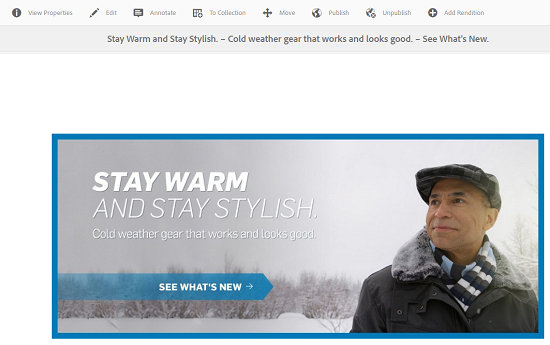

# Administrar recursos compuestos con subrecursos {#managing-compound-assets}

Adobe Experience Manager Assets puede identificar si un archivo cargado contiene referencias a recursos que ya existen en el repositorio. Esta función solo está disponible para formatos de archivo compatibles. Si el recurso cargado contiene referencias a [!DNL Experience Manager] recursos, se crea un vínculo bidireccional entre los recursos cargados y los referenciados.

Además de eliminar la redundancia, hacer referencia a [!DNL Experience Manager] activos en las aplicaciones de Adobe Creative Cloud mejora la colaboración y aumenta la eficacia y la productividad de los usuarios.

[!DNL Experience Manager] Assets admite referencias  **bidireccionales**. Puede encontrar los recursos a los que se hace referencia en la página de detalles del recurso del archivo cargado. Además, puede ver los archivos de referencia de los activos [!DNL Experience Manager] en la página de detalles del recurso del recurso al que se hace referencia.

Las referencias se resuelven en función de la ruta, el ID del documento y el ID de instancia de los recursos a los que se hace referencia.

## Adobe Illustrator: Agregar recursos como referencias {#refai}

Puede hacer referencia a recursos existentes [!DNL Experience Manager] desde un archivo Adobe Illustrator.

1. Con la [[!DNL Experience Manager] aplicación de escritorio](https://experienceleague.adobe.com/docs/experience-manager-desktop-app/using/using.html?lang=es), monte el repositorio de [!DNL Experience Manager] recursos como una unidad en el equipo local. Dentro de la unidad montada, vaya a la ubicación del recurso al que desea hacer referencia.
1. Arrastre el recurso desde la unidad montada hasta el archivo Illustrator.
1. Guarde el archivo Illustrator en la unidad montada o [cargue](managing-assets-touch-ui.md#uploading-assets) en el repositorio [!DNL Experience Manager].
1. Una vez finalizado el flujo de trabajo, vaya a la página de detalles del recurso para el recurso. Las referencias a los activos existentes [!DNL Experience Manager] se enumeran en **[!UICONTROL Dependencias]** en la columna **[!UICONTROL Referencias]**.

   

1. Los recursos a los que se hace referencia y que aparecen en **[!UICONTROL Dependencies]** también se pueden consultar en archivos que no sean el actual. Para ver una lista de archivos de referencia para un recurso, haga clic en el recurso en **[!UICONTROL Dependencias]**.

   

1. Haga clic en el icono **[!UICONTROL Ver propiedades]** de la barra de herramientas. En la página de propiedades, la lista de archivos que hacen referencia al recurso actual aparece en la columna **[!UICONTROL Referencias]** de la pestaña **[!UICONTROL Básico]**.

   

## Adobe InDesign: Agregar recursos como referencias {#add-aem-assets-as-references-in-adobe-indesign}

Para hacer referencia a [!DNL Experience Manager] recursos desde un archivo de InDesign, arrastre [!DNL Experience Manager] recursos al archivo de InDesign o exporte el archivo de InDesign como archivo ZIP.

Los recursos a los que se hace referencia ya existen en [!DNL Experience Manager] Assets. Puede extraer subrecursos [configurar el servidor de InDesign](indesign.md). Los recursos incrustados en un archivo de InDesign se extraen como subrecursos.

>[!NOTE]
>
>Si el servidor de InDesign es proxy, la vista previa de los archivos de InDesign se incrusta en sus metadatos XMP. En este caso, la extracción de miniaturas no es explícitamente necesaria. Sin embargo, si el servidor de InDesign no se procesa como proxy, las miniaturas deben extraerse explícitamente para los archivos de InDesign.

Cuando se carga un archivo INDD, las referencias se recuperan consultando los recursos que tienen propiedades `xmpMM:InstanceID` y `xmpMM:DocumentID` en el repositorio.

### Crear referencias arrastrando recursos {#create-references-by-dragging-aem-assets}

Este procedimiento es similar a [Add assets as References in Adobe Illustrator](#refai).

### Crear referencias a recursos exportando un archivo ZIP {#create-references-to-aem-assets-by-exporting-a-zip-file}

1. Siga los pasos en [Creación de modelos de flujo de trabajo](/help/sites-developing/workflows-models.md) para crear un nuevo flujo de trabajo.
1. Utilice la función [Package de Adobe InDesign](https://helpx.adobe.com/indesign/how-to/indesign-package-files-for-handoff.html) para exportar el documento. Adobe InDesign puede exportar un documento y los recursos vinculados como un paquete. En este caso, la carpeta exportada contiene una carpeta `Links` que contiene subrecursos en el archivo de InDesign. La carpeta `Links` está presente en la misma carpeta que el archivo INDD.
1. Cree un archivo ZIP y cárguelo en el repositorio [!DNL Experience Manager].
1. Inicie el flujo de trabajo de Unarchiver.
1. Cuando se completa el flujo de trabajo, se hace referencia automáticamente a las referencias de la carpeta Links como subactivos. Para ver una lista de los recursos referidos, vaya a la página de detalles del recurso de InDesign y cierre el [carril](/help/sites-authoring/basic-handling.md#rail-selector).

## Adobe Photoshop: Agregar recursos como referencias {#refps}

1. Con un cliente WebDav, monte [!DNL Experience Manager] Assets como unidad.
1. Para crear referencias a [!DNL Experience Manager] recursos en un archivo Photoshop, vaya a los recursos correspondientes en la unidad montada utilizando la función Colocar vinculada en Photoshop.

   

1. Guarde en el archivo Photoshop en la unidad montada o [cargue](managing-assets-touch-ui.md#uploading-assets) en el repositorio [!DNL Experience Manager].
1. Una vez finalizado el flujo de trabajo, las referencias a los recursos existentes [!DNL Experience Manager] se enumeran en la página de detalles del recurso.

   Para ver los recursos a los que se hace referencia, cierre [Carril](/help/sites-authoring/basic-handling.md#rail-selector) en la página de detalles del recurso.

1. Los recursos a los que se hace referencia también contienen la lista de recursos desde los que se hace referencia. Para ver una lista de los recursos a los que se hace referencia, vaya a la página de detalles del recurso y cierre el [carril](/help/sites-authoring/basic-handling.md#rail-selector).

>[!NOTE]
>
>También se puede hacer referencia a los recursos incluidos en los recursos compuestos en función de su ID de documento y su ID de instancia. Esta funcionalidad solo está disponible con las versiones Adobe Illustrator y Adobe Photoshop. Para otros, la referencia se realiza sobre la base de la ruta relativa de los recursos vinculados en el activo compuesto principal, como se hace en versiones anteriores de AEM.

## Crear subrecursos {#generate-subassets}

Para los recursos admitidos con formatos de varias páginas (archivos PDF, archivos AI, archivos Keynote de Microsoft PowerPoint y Apple y archivos Adobe InDesign) [!DNL Experience Manager] puede generar subrecursos que correspondan a cada página individual del recurso original. Estos subrecursos están vinculados al recurso *principal* y facilitan la vista de varias páginas. Para todos los demás fines, los subactivos se tratan como activos normales en AEM.

La generación de subconjuntos está deshabilitada de forma predeterminada. Para habilitar la generación de subrecursos, siga estos pasos:

1. Inicie sesión en Experience Manager como administrador. Acceda a **[!UICONTROL Herramientas > Flujo de trabajo > Modelos]**.
1. Seleccione **[!UICONTROL DAM Update Asset]** flujo de trabajo y haga clic en **[!UICONTROL Editar]**.
1. Haga clic en **[!UICONTROL Alternar panel lateral]** y busque el paso **[!UICONTROL Crear subrecurso]**. Añada el paso al flujo de trabajo. Haga clic en **[!UICONTROL Sincronizar]**.

Para generar los subrecursos, realice una de las siguientes acciones:

* Nuevos recursos: El flujo de trabajo [!UICONTROL DAM Update Assets] se ejecuta en cualquier nuevo recurso que se cargue en AEM. Los subrecursos se generan automáticamente para los nuevos recursos de varias páginas.
* Recursos existentes de varias páginas: Ejecute manualmente el flujo de trabajo [!UICONTROL DAM Update Assets] siguiendo cualquiera de los pasos:

   * Seleccione un recurso y haga clic en [!UICONTROL Línea de tiempo] para abrir el panel izquierdo. Alternativamente, utilice el atajo de teclado `alt + 3`. Haga clic en [!UICONTROL Iniciar flujo de trabajo], seleccione [!UICONTROL Activo de actualización de DAM], haga clic en [!UICONTROL Inicio] y haga clic en [!UICONTROL Continuar].
   * Seleccione un recurso y haga clic en [!UICONTROL Crear > Flujo de trabajo] en la barra de herramientas. En el cuadro de diálogo emergente, seleccione el flujo de trabajo [!UICONTROL Activo de actualización de DAM], haga clic en [!UICONTROL Inicio] y haga clic en [!UICONTROL Continuar].

Específicamente para documentos de Microsoft Word, ejecute el flujo de trabajo **[!UICONTROL DAM Parse Word Documents]**. Genera un componente `cq:Page` a partir del contenido del documento de Microsoft Word. Se hace referencia a las imágenes extraídas del documento desde el componente `cq:Page`. Estas imágenes se extraen incluso si la generación de subrecursos está deshabilitada.

## Ver subrecursos {#viewing-subassets}

Los subrecursos solo se muestran si se generan los subrecursos y están disponibles para el recurso de varias páginas seleccionado. Para ver los subrecursos generados, abra el recurso de varias páginas. En el área superior izquierda de la página, haga clic en  y haga clic en **[!UICONTROL Subrecursos]** en la lista. Al seleccionar **[!UICONTROL Subrecursos]** en la lista. Alternativamente, utilice el atajo de teclado `alt + 5`.

## Ver páginas de un archivo de varias páginas {#view-pages-of-a-multi-page-file}

Puede ver un archivo de varias páginas, como PDF, INDD, PPT, PPTX y AI, mediante la función Visualizador de páginas de [!DNL Experience Manager] Assets. Abra un recurso de varias páginas y haga clic en **[!UICONTROL Ver páginas]** en la esquina superior izquierda de la página. El Visor de páginas que se abre muestra las páginas del recurso y los controles para examinar y ampliar cada página.

Para el InDesign, puede extraer páginas mediante el servidor de InDesign. Si las vistas previas de las páginas se guardan durante la creación del archivo de InDesign, no es necesario el InDesign Server para la extracción de páginas.

Las siguientes opciones están disponibles en la barra de herramientas, en el carril izquierdo y en los controles Visualizador de páginas :

* **[!UICONTROL Acciones de escritorio]** para abrir o mostrar un subrecurso específico mediante la aplicación de  [!DNL Experience Manager] escritorio. Consulte cómo [configurar acciones de escritorio](https://experienceleague.adobe.com/docs/experience-manager-desktop-app/using/using.html#desktopactions-v2) si utiliza la aplicación de escritorio [!DNL Experience Manager].

* **** La opción Propiedades abre la   página Propiedades del subrecurso específico.

* **** La opción Anotar permite anotar el subrecurso específico. Las anotaciones que utilice en subrecursos independientes se recopilan y se muestran juntas cuando se abre para su visualización el recurso principal.

* **[!UICONTROL La]** opción Información general de página muestra todos los subrecursos simultáneamente.

* **** La opción de línea de tiempo del carril izquierdo después de hacer clic en el icono del carril   muestra el flujo de actividad del archivo.

## Prácticas recomendadas y limitación {#best-practice-limitation-tips}

* La generación de subconjuntos puede requerir muchos recursos en cualquier implementación de Experience Manager. Si está generando subrecursos cuando se cargan recursos complejos, agregue el paso en el flujo de trabajo de recursos de actualización de DAM . Si está generando subrecursos bajo demanda, cree un flujo de trabajo independiente para generar subrecursos. Un flujo de trabajo dedicado le permite omitir los demás pasos del flujo de trabajo de recursos de actualización de DAM y guardar recursos de computación.

>[!MORELIKETHIS]
>
>* [Uso de la aplicación de escritorio de Adobe Experience Manager](https://experienceleague.adobe.com/docs/experience-manager-desktop-app/using/using.html)

