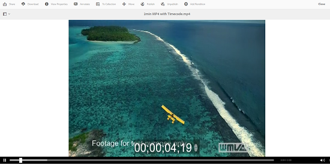

# Administrar recursos de vídeo {#managing-video-assets}

Obtenga información sobre cómo administrar y editar los recursos de vídeo en Recursos Adobe Experience Manager (AEM). Además, si tiene licencia para usar Dynamic Media, consulte la [documentación de Dynamic Media Video](video.md).

## Carga y previsualización de recursos de vídeo {#uploading-and-previewing-video-assets}

AEM Assets genera previsualizaciones para recursos de vídeo con la extensión MP4. Si el formato del recurso no es MP4, instale el paquete FFmpeg para generar una previsualización. FFmpeg crea representaciones de vídeo de tipo OGG y MP4. Puede realizar la previsualización de estas representaciones en la interfaz de usuario de AEM Assets.

1. En la carpeta o subcarpetas de recursos digitales, navegue a la ubicación donde desee agregar recursos digitales.
1. Para cargar el recurso, toque o haga clic en **[!UICONTROL Crear]** en la barra de herramientas y elija **[!UICONTROL Archivos]**. Como alternativa, suéltela directamente en el área de recursos. Consulte [Carga de recursos](managing-assets-touch-ui.md#uploading-assets) para obtener más información sobre la operación de carga.
1. Para previsualización de un vídeo en la vista de tarjeta, toque el botón **[!UICONTROL Reproducir]** del recurso de vídeo.

   

   Puede pausar o reproducir vídeo únicamente en la vista **[!UICONTROL Card]**. El botón Reproducir/Pausa no está disponible en la vista **[!UICONTROL Lista]**.

1. Toque el icono **[!UICONTROL Editar]** en la tarjeta para previsualización del vídeo en la vista **[!UICONTROL Detalles]**.

   El vídeo se reproduce en el reproductor de vídeo nativo del navegador. Puede reproducir, pausar, controlar el volumen y aplicar zoom en el vídeo a pantalla completa.

   

## Configuración para cargar recursos de más de 2 GB {#configuration-to-upload-video-assets-that-are-larger-than-gb}

De forma predeterminada, AEM Assets no permite cargar recursos que superen los 2 GB debido a un límite de tamaño de archivo. Sin embargo, puede sobrescribir este límite si ingresa al CRXDE Lite y crea un nodo en el directorio `/apps`. El nodo debe tener el mismo nombre de nodo, estructura de directorio y propiedades de nodo comparables de order.

Además de la configuración de AEM Assets, cambie las configuraciones siguientes para cargar recursos de gran tamaño:

* Aumente el tiempo de caducidad del token. Consulte [!UICONTROL Adobe Granite CSRF Servlet] en la Consola Web en `https://[aem_server]:[port]/system/console/configMgr`. Para obtener más información, consulte [Protección de CSRF](/help/sites-developing/csrf-protection.md).
* Aumente el `receiveTimeout` en la configuración de Dispatcher. Para obtener más información, consulte [Configuración del despachante de Experience Manager](https://docs.adobe.com/content/help/en/experience-manager-dispatcher/using/configuring/dispatcher-configuration.html#renders-options).

>[!NOTE]
>
>La interfaz de usuario de AEM Classic no tiene una restricción de tamaño de archivo de dos gigabytes. Además, el flujo de trabajo de extremo a extremo para vídeos de gran tamaño no es totalmente compatible.

Para configurar un límite de tamaño de archivo mayor, realice los siguientes pasos en el directorio `/apps`.

1. En AEM, pulse **[!UICONTROL Herramientas > General > CRXDE Lite]**.
1. En la página **[!UICONTROL CRXDE Lite]**, en la ventana del directorio de la izquierda, navegue a `/libs/dam/gui/content/assets/jcr:content/actions/secondary/create/items/fileupload`. Para ver la ventana del directorio, toque el icono `>>`.
1. En la barra de herramientas, toque **[!UICONTROL Overlay Node]**. También puede seleccionar **[!UICONTROL Nodo de superposición]** en el menú contextual.
1. En el cuadro de diálogo **[!UICONTROL Nodo de superposición]**, pulse **[!UICONTROL Aceptar]**.

   

1. Actualice el explorador. El nodo de superposición `/apps/dam/gui/content/assets/jcr:content/actions/secondary/create/items/fileupload` está seleccionado.
1. En la ficha **[!UICONTROL Propiedades]**, introduzca el valor apropiado en bytes para aumentar el límite de tamaño al tamaño deseado. Por ejemplo, escriba `32212254720` valor para aumentar el límite de tamaño a 30 GB.

1. En la barra de herramientas, toque **[!UICONTROL Guardar todo]**.
1. En AEM, pulse **[!UICONTROL Herramientas > Operaciones > Consola web]**.
1. En la página **[!UICONTROL Paquetes de consola web de Adobe Experience Manager]**, en la columna **[!UICONTROL Nombre]** de la tabla, busque y toque **[!UICONTROL Controlador de trabajo de proceso externo de granito de Adobe]**.
1. En la página **[!UICONTROL Controlador de trabajo de proceso externo de granito de Adobe]**, establezca los segundos para los campos **[!UICONTROL Tiempo de espera predeterminado]** y **[!UICONTROL Tiempo de espera máximo]** en `18000` (cinco horas).
1. Toque **[!UICONTROL Guardar]**.
1. En AEM, toque **[!UICONTROL Herramientas > Flujo de trabajo > Modelos]**.
1. En la página **[!UICONTROL Modelos de flujo de trabajo]**, seleccione **[!UICONTROL Dynamic Media Encode Video]** y luego toque **[!UICONTROL Editar]**.
1. En la página **[!UICONTROL Workflow]**, toque con el doble el componente **[!UICONTROL Proceso del servicio de vídeo de Dynamic Media]**.
1. En el cuadro de diálogo **[!UICONTROL Propiedades del paso]**, en la pestaña **[!UICONTROL Común]**, expanda **[!UICONTROL Configuración avanzada]**.
1. En el campo **[!UICONTROL Tiempo de espera]**, especifique un valor de `18000` y, a continuación, pulse **[!UICONTROL Aceptar]** para volver a la página de flujo de trabajo de **[!UICONTROL codificación de vídeo de Dynamic Media]**.
1. Cerca de la parte superior de la página, debajo del título de la página **[!UICONTROL Dynamic Media Encode Video]**, toque **[!UICONTROL Guardar]**.

## Publicación de recursos de vídeo {#publishing-video-assets}

Una vez publicados los recursos de vídeo, estarán disponibles para incluirlos en una página web mediante una URL o incrustarlos en una página web. Consulte [Publicación de recursos](publishing-dynamicmedia-assets.md).

## Anotar recursos de vídeo {#annotating-video-assets}

1. Desde la consola Recursos, toque el icono **[!UICONTROL Editar]** de la tarjeta de recursos para mostrar la página de detalles de recursos.
1. Toque el icono **[!UICONTROL Previsualización]** para reproducir el vídeo.
1. Para realizar anotaciones en el vídeo, toque el botón **[!UICONTROL Anotar]**. Se agrega una anotación en el punto de tiempo (fotograma) concreto del vídeo.

   Al realizar anotaciones, puede dibujar en el lienzo e incluir un comentario con el dibujo. Los comentarios se guardan automáticamente en Adobe Experience Manager Assets.

   

   Para salir del asistente para anotaciones, toque **[!UICONTROL Cerrar]**.

1. Para saltar a un punto específico del vídeo, especifique el tiempo en segundos en el campo de texto y haga clic en **[!UICONTROL Saltar]**. Por ejemplo, para omitir los primeros 20 segundos de vídeo, escriba `20` en el campo de texto.

   

1. Haga clic en una anotación para vista en la línea de tiempo. Toque **[!UICONTROL Eliminar]** para eliminar la anotación de la línea de tiempo.

   
