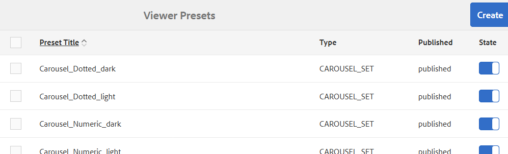

# Administración de ajustes preestablecidos de visor de Dynamic Media {#managing-viewer-presets}

Un ajuste preestablecido de visor de Dynamic Media es una colección de ajustes que determinan la forma en que los usuarios vista los recursos de medios enriquecidos en las pantallas de sus equipos y en los dispositivos móviles. Si es un administrador, puede crear ajustes preestablecidos de visor. Los ajustes están disponibles para una matriz de opciones de configuración del visor. Por ejemplo, puede cambiar el tamaño de visualización del visor o el comportamiento de zoom.

Para obtener instrucciones sobre cómo crear y personalizar sus propios ajustes preestablecidos de visor HTML5, consulte el *SDK de visor HTML5 de Adobe Scene7*. El SDK está disponible en el servidor de publicación IS incrustado en el propio SDK. Cada versión de biblioteca tiene su propia documentación de SDK incluida.

Ruta: `<scene7_domain>/s7sdk/<library_version>/docs/jsdocs/index.html`.\
Por ejemplo, SDK 3.5: [https://s7d1.scene7.com/s7sdk/3.5/docs/jsdoc/index.html](https://s7d1.scene7.com/s7sdk/3.5/docs/jsdoc/index.html)

Consulte también la [Guía de referencia de visores de Adobe](https://docs.adobe.com/content/help/en/dynamic-media-developer-resources/library/home.html).

En esta sección se describe cómo crear, editar y administrar ajustes preestablecidos de visor. Puede aplicar un ajuste preestablecido de visor a un recurso cada vez que lo previsualización. Consulte [Aplicación de ajustes preestablecidos de visor](viewer-presets.md).

>[!NOTE]
>
>Tenga en cuenta que la edición de cualquier ajuste preestablecido de visor *predefinido y listo para usar* no es un escenario compatible. Si intenta editar un ajuste preestablecido de visor incorporado, se le pedirá que guarde el ajuste preestablecido de visor con un nombre nuevo.

## Accesibilidad del teclado para visores {#keyboard-accessibility-for-viewers}

Todos los visores integrados admiten la accesibilidad del teclado.

Consulte también [Accesibilidad y navegación del teclado](https://docs.adobe.com/content/help/en/dynamic-media-developer-resources/library/c-keyboard-accessibility.html).

## Administración de ajustes preestablecidos de visor de Dynamic Media {#managing-presets}

Puede agregar, editar, eliminar, publicar, cancelar la publicación y AEM ajustes preestablecidos de visor de previsualización tocando **[!UICONTROL Herramientas > Recursos > Ajustes preestablecidos de visor]**.

>[!NOTE]
>
>De forma predeterminada, el sistema muestra 15 ajustes preestablecidos de visor al seleccionar Visores en la vista de detalles de un recurso. Puede aumentar este límite. Consulte [Aumento del número de ajustes preestablecidos de visor que se muestran](#increasing-the-number-of-viewer-presets-that-display).

## Compatibilidad del visor con páginas Web diseñadas para responder {#viewer-support-for-responsive-designed-web-pages}

Las diferentes páginas Web tienen diferentes necesidades. Por ejemplo, a veces se desea una página web que proporcione un vínculo que abra el visor HTML5 en una ventana separada del navegador. En otros casos, puede ser necesario incrustar el visor HTML5 directamente en la página de alojamiento. En este último caso, la página web puede tener un diseño estático. O bien, puede *responder* y mostrarse de forma diferente en diferentes dispositivos o en diferentes tamaños de ventana del explorador. Para satisfacer estas necesidades, todos los visores HTML5 predefinidos y listos para usar que vienen con Dynamic Media admiten páginas web estáticas y páginas web diseñadas con capacidad de respuesta.

Consulte [Biblioteca de imágenes interactivas](https://docs.adobe.com/content/help/en/dynamic-media-developer-resources/image-serving-api/image-serving-api/responsive-static-image-library/c-about-responsive-static-image-library.html) en la *Ayuda de la API de servicio de imágenes* para obtener más información sobre cómo incrustar visores interactivos en sus páginas Web.

>[!NOTE]
>
>Tenga en cuenta que debe publicar todos los visores integrados antes de usarlos por primera vez.\
>Consulte [Ajustes preestablecidos de visor de publicaciones.](#publishing-viewer-presets)

## Compatibilidad del sistema con ajustes preestablecidos de visor {#viewer-preset-system-compatibility}

Todos los ajustes preestablecidos de visor integrados con Dynamic Media son totalmente compatibles con los siguientes sistemas:

* Equipos de escritorio
* Apple iPhone
* Apple iPad
* Smartphone Android
* Tablet Android
* Para vídeo, se proporciona compatibilidad adicional con la reproducción de MP4 para [Blackberry](https://developer.blackberry.com/devzone/develop/supported_media/bb_media_support_at_a_glance.html#kba1328730952678) y [Windows Phone 8](https://msdn.microsoft.com/library/windows/apps/ff462087%28v=vs.105%29.aspx).

### Tipos de medios enriquecidos para ajustes preestablecidos de visor {#rich-media-types-for-viewer-presets}

Los administradores pueden añadir y personalizar los siguientes tipos de medios enriquecidos al crear nuevos ajustes preestablecidos de visor.

| Tipos de medios enriquecidos | Descripción |
|:---|:---|
| **Conjunto de carrusel** | Las zonas interactivas, los mapas de imagen o ambos se agregan a una serie de dos o más imágenes. Un cliente puede recorrer las imágenes a la izquierda o a la derecha y, a continuación, hacer clic en un punto interactivo de una imagen para obtener más información o para realizar compras directamente desde la categoría, la página principal o las páginas de aterrizaje de un sitio web. |
| **Zoom flotante** | Muestra una segunda imagen del área ampliada junto a la imagen original. No hay controles que usar: los usuarios mueven la selección sobre el área que desean vista. |
|  | Al determinar el uso completo del ancho de banda para este visor, tenga en cuenta que tanto la imagen principal como la imagen flotante se muestran en el visor. El tamaño de la imagen principal (anchura y altura del escenario) y el factor de zoom determinan el tamaño de la imagen flotante. Para evitar que el tamaño del archivo flotante sea demasiado grande, equilibre estos dos valores: si tiene un tamaño de imagen principal grande, reduzca el valor de Factor de zoom. (La anchura flotante y la altura flotante determinan el tamaño de la ventana flotante, pero no el tamaño de la imagen flotante que se muestra en el visor). |
|  | Por ejemplo, si el tamaño de la imagen principal es de 350 x 350 píxeles, con un factor de zoom de 3, la imagen flotante resultante será de 1050 x 1050 píxeles. Si el tamaño de la imagen principal es de 300 x 300 píxeles, con un factor de zoom de 4, la imagen flotante es de 1200 x 1200 píxeles. Según la configuración de calidad JPEG (la configuración recomendada es entre 80 y 90), puede reducir el tamaño del archivo de forma significativa. Los factores de zoom recomendados son de 2,5 a 4, según el tamaño de la imagen principal. |
| **Zoom en línea** | Muestra una imagen del área ampliada dentro del visor original. No hay controles que usar. Es decir, los usuarios mueven la selección sobre el área que desean vista. |
| **Conjunto de imágenes** | En el visor de conjuntos de imágenes, los usuarios pueden ver diferentes vistas o variaciones de color de un elemento haciendo clic en una imagen en miniatura. Este visor también oferta las herramientas de zoom para examinar las imágenes de cerca. |
| **Imagen interactiva** | Las zonas interactivas se agregan a partes de una imagen en las que un cliente puede hacer clic para obtener más detalles o para realizar compras directamente desde la categoría, la casa o las páginas de aterrizaje de un sitio web. |
| **Vídeo interactivo** | Las miniaturas se agregan a los segmentos de línea de tiempo en un vídeo en el que un cliente puede hacer clic para obtener más detalles o para realizar compras directamente desde la categoría, la página principal o las páginas de aterrizaje de un sitio web. |
| **Medios mixtos** | Muestra diferentes tipos de medios en un visor. Puede incluir conjuntos de giros, conjuntos de imágenes, imágenes y vídeos. |
| **Imagen panorámica** | Los visores Panoramic Image y PanoramicVR representan imágenes panorámicas esféricas para sumergir a los usuarios en una experiencia de visualización de 360° de una habitación, propiedad, ubicación o paisaje. |
|  | Para que una imagen cargada se considere panorámica esférica, debe tener una o ambas de las opciones siguientes: <ul><li>Proporción de aspecto de 2:1.</li><li>Etiquetado con las palabras clave equirectangulares, esféricas y panorámicas, esféricas y panorámicas. Consulte [Uso de etiquetas](../sites-authoring/tags.md).</li></ul> |
|  | Tanto la proporción de aspecto como los criterios de palabra clave se aplican a los recursos panorámicos para la página de detalles de recursos y el componente WCM &quot;Panoramic Media&quot;. |
|  | Importante: Este visor solo está disponible en el modo Dynamic Media - Scene7. |
| **Conjunto de giros** | Proporciona varias vistas de una imagen para que los usuarios puedan girar el objeto para examinar los diferentes lados y ángulos. |
| **Vídeo** | Reproduce vídeo mediante flujo continuo de velocidad de bits progresiva o adaptable. El flujo de velocidad de bits adaptable realiza automáticamente la detección de ancho de banda y dispositivos para ofrecer el vídeo de calidad adecuada en el formato correcto. |
| **Zoom vertical** | El visor de zoom vertical le permite maximizar una experiencia de visualización de imágenes de producto para ofrecer a los usuarios la mejor representación de un producto. La ubicación vertical de las muestras hace lo siguiente: <ul><li>Garantiza que las muestras estén por encima del pliegue. Con las muestras horizontales, en función del tamaño de la pantalla ’ escritorio del usuario, las muestras no eran visibles hasta que el usuario se desplazaba por la página. Al colocar las muestras verticalmente en el visor, garantiza que sean visibles independientemente del tamaño de pantalla del usuario.</li><li>Maximiza el tamaño de la imagen principal. Con las muestras horizontales, es necesario reservar espacio en la página para asegurarse de que son visibles. Esta posición redujo el tamaño de la imagen principal. Sin embargo, con un diseño de muestra vertical, no es necesario asignar este espacio. Como tal, puede maximizar el tamaño de la imagen principal.</li></ul> |
| **Zoom** | Permite a los usuarios acercarse al área haciendo clic en ella. Los usuarios pueden hacer clic en los controles para acercar, alejar y restablecer la imagen a su tamaño predeterminado. |

## Lista de ajustes preestablecidos de visor listos para usar {#list-of-out-of-the-box-viewer-presets}

La siguiente tabla identifica todos los ajustes preestablecidos de visor predefinidos y listos para usar que se incluyen con Dynamic Media.

Consulte también [Demostraciones en directo](https://landing.adobe.com/en/na/dynamic-media/ctir-2755/live-demos.html).

Para obtener información sobre las versiones compatibles del navegador web y del sistema operativo para visores, consulte las Notas de la versión de los visores.

Consulte *Notas de la versión de los visores* en la tabla de contenido de la [Guía de referencia de visores](https://docs.adobe.com/content/help/en/dynamic-media-developer-resources/library/home.html).

>[!NOTE]
>
>Todos los ajustes preestablecidos de visor integrados en Dynamic Media ya están activados (activados), pero debe publicarlos.\
>Consulte [Ajustes preestablecidos de visor de publicaciones](#publishing-viewer-presets).
>
>Todos los ajustes preestablecidos de visor nuevos que cree y agregue deben activarse *y* publicarse.\
>Consulte [Activación o desactivación de ajustes preestablecidos de visor](#activating-or-deactivating-viewer-presets) y [Ajustes preestablecidos de visor de publicación](#publishing-viewer-presets).

| Título de ajuste preestablecido de visor | Tipo | Nombre de archivo CSS |
|:---|:---|:---|
| Carousel_Dotted_dark | Carousel_Set | html5_carouselviewer_dotted_dark.css |
| Carousel_Dotted_light | Carousel_Set | html5_carouselviewer_dotted_light.css |
| Carousel_Numeric_dark | Carousel_Set | html5_carouselviewer_numeric_dark.css |
| Carousel_Numeric_light | Carousel_Set | html5_carouselviewer_numeric_light.css |
| Flotante | Flyout_Zoom | html5_flyoutviewer.css |
| ImageSet_dark | Conjunto de imágenes | html5_zoomviewer_dark.css |
| ImageSet_light | Conjunto de imágenes | html5_zoomviewer_light.css |
| InlineMixedMedia_dark | Mixed_Media | html5_inlinemixedmediaviewer_dark.css |
| InlineMixedMedia_light | Mixed_Media | html5_inlinemixedmediaviewer_light.css |
| InlineZoom | Flyout_Zoom | html5_inlinezoomviewer.css |
| MixedMedia_dark | Mixed_Media | html5_mixedmediaviewer_dark.css |
| MixedMedia_light | Mixed_Media | html5_mixedmediaviewer_light.css |
| PanoramicImage | Panoramic_Image | html5_panoramicimage.css |
| PanoramicImageVR | Panoramic_Image | html5_panoramicimage.css |
| Shoppable_Banner | Interactive_Image | html5_interactiveimage.css |
| Shoppable_Video_dark | Interactive_Video | html5_interactivevideoviewer_dark.css |
| Shoppable_Video_light | Interactive_Video | html5_interactivevideover_light.css |
| SpinSet_dark | Spin_Set | html5_spinviewer_dark.css |
| SpinSet_light | Spin_Set | html5_spinviewer_light.css |
| Vídeo (incluye compatibilidad con subtítulos opcionales) | Vídeo | html5_videoviewer.css |
| Video_social (incluye compatibilidad con subtítulos opcionales y medios sociales) | Vídeo | html5_videoviewersocial.css |
| Zoom_dark | Zoom | html5_basiczoomviewer_dark.css |
| Zoom_light | Zoom | html5_basiczoomviewer_light.css |
| ZoomVertical_dark | Vertical_Zoom | html5_zoomverticalviewer_dark.css |
| ZoomVertical_light | Vertical_Zoom | html5_zoomverticalviewer_light.css |

### Matriz de gestos de visores móviles admitida {#supported-mobile-viewers-gestures-matrix}

La siguiente tabla identifica los gestos del visor móvil que se admiten en dispositivos iOS, Android 2.x y Android 3.x.

| Gesto | Zoom flotante  | Zoom | Giro |
|---|---|---|---|
| **Arrastrar** | Panorámicas | Panorámicas | Panorámicas |
| **Tocar** | Muestra la ventana flotante | Muestra u oculta la interfaz de usuario | Muestra u oculta la interfaz de usuario |
| **Tocar doble** | No se aplica | Acerca o restablece | Acerca o restablece |
| **Pellizcar para abrir** | No se aplica | Acerca (solo iOS y Android 3x) | Acerca (solo iOS y Android 3x) |
| **Pellizcar cerca** | No se aplica | Aleja (solo iOS y Android 3x) | Aleja (solo iOS y Android 3x) |
| **Deslizar** | Desplaza la barra de muestras | Desplaza imágenes | Gira |
| **Flick** | Desplaza la barra de muestras | Desplaza imágenes | Gira |

## Aumento del número de ajustes preestablecidos de visor de Dynamic Media que muestran {#increasing-the-number-of-viewer-presets-that-display}

AEM muestra una amplia variedad de ajustes preestablecidos de visor al ver un recurso desde **[!UICONTROL Vista de detalles > Visores]**. Puede aumentar o disminuir el número de visores que se muestran.

**Para aumentar el número de ajustes preestablecidos de visor de Dynamic Media que se muestran**:

1. Vaya a **[!UICONTROL CRXDE Lite]** ([http://localhost:4502/crx/de](http://localhost:4502/crx/de)).
1. Vaya al nodo de lista de ajustes preestablecidos de visor en `/libs/dam/gui/coral/content/commons/sidepanels/viewerpresets/viewerpresetslist`

   

1. En la propiedad **[!UICONTROL limit]**, cambie el **[!UICONTROL valor]**, que se establece en 15 de forma predeterminada, por el número deseado.
1. Vaya al origen de datos del ajuste preestablecido de visor en `/libs/dam/gui/coral/content/commons/sidepanels/viewerpresets/viewerpresetslist/datasource`

   

1. En la propiedad **[!UICONTROL limit]**, cambie el número por el número deseado, por ejemplo `{empty requestPathInfo.selectors[1] ? "20" : requestPathInfo.selectors[1]}`
1. Toque **[!UICONTROL Guardar todo]**.

## Creación de un nuevo ajuste preestablecido de visor de Dynamic Media {#creating-a-new-viewer-preset}

La creación de ajustes preestablecidos de visor permite aplicar varios ajustes a la vista e interactuar con los recursos. Sin embargo, no es necesario crear nuevos ajustes preestablecidos de visor. Si lo prefiere, puede utilizar los ajustes preestablecidos de visor predeterminados y listos para usar que ya vienen con AEM Assets.

Si decide crear un nuevo ajuste preestablecido de visor, después de guardarlo, el estado del visor se activa automáticamente (definido como **Activado**) en la página **[!UICONTROL Ajustes preestablecidos de visor]**. Este estado significa que está visible en el componente **[!UICONTROL Dynamic Media]** y en el componente **[!UICONTROL Medios interactivos]** y siempre que se previsualización una imagen o un vídeo.

Algunos ajustes preestablecidos de visor tienen una configuración exclusiva que puede afectar al uso y al comportamiento general del visor. Según el ajuste preestablecido de visor que esté creando, es posible que desee tener en cuenta estas consideraciones especiales.

Consulte [Consideraciones especiales para crear un ajuste preestablecido de visor interactivo](#special-considerations-for-creating-an-interactive-viewer-preset).

Consulte [Consideraciones especiales para crear un ajuste preestablecido de visor de letreros carrusel](#special-considerations-for-creating-a-carousel-banner-viewer-preset).

**Para crear un nuevo ajuste preestablecido** de visor de Dynamic Media:

1. En la esquina superior izquierda de AEM, toque el logotipo de AEM y, a continuación, en el carril izquierdo, toque **[!UICONTROL Herramientas > Recursos > Ajustes preestablecidos de visor]**.

   

1. En la página **[!UICONTROL Ajustes preestablecidos de visor]**, en la barra de herramientas, toque **[!UICONTROL Crear]**.
1. En el cuadro de diálogo **[!UICONTROL Nuevo ajuste preestablecido de visor]**, en el campo **[!UICONTROL Nombre de ajuste preestablecido]**, introduzca el nombre del nuevo ajuste preestablecido. Elija un nombre con cuidado; no se pueden editar después de tocar **[!UICONTROL Crear]**.

   Cuando guarde el ajuste preestablecido más adelante en estos pasos, el nombre aparecerá en la página Ajustes preestablecidos de visor en el encabezado de columna **[!UICONTROL Título preestablecido]**.

1. En el menú desplegable **[!UICONTROL Tipo de medio enriquecido]**, seleccione el tipo de ajuste preestablecido de visor que desee crear y, en la esquina superior derecha de la página, toque **[!UICONTROL Crear]**.

   Consulte [Tipos de medios enriquecidos para ajustes preestablecidos de visor](#rich-media-types-for-viewer-presets).

1. En la página **Editar ajuste preestablecido de visor**, toque la ficha **[!UICONTROL Aspecto]**.
1. Realice una de las acciones siguientes:

   * En el menú desplegable **[!UICONTROL Tipo seleccionado]**, seleccione un componente cuyo diseño visual desee personalizar. Como alternativa, puede tocar cualquier elemento visual del visor para seleccionarlo y configurarlo.

      El editor visual permite ver el efecto que una propiedad determinada tiene en un estilo. Simplemente configure o ajuste cualquier propiedad para ver instantáneamente el efecto que tiene en el visor con la muestra a la izquierda del editor.

      Las propiedades de estilo CSS de cada tipo de ajuste preestablecido de visor se describen en el tema de ayuda &quot;Personalización del *&lt;nombre_visor>* visor&quot; de la [Guía de referencia de visores](https://docs.adobe.com/content/help/en/dynamic-media-developer-resources/library/home.html).

      Por ejemplo, si está creando un ajuste preestablecido de visor de tipo `Mixed_Media`, consulte [Personalización de visor de medios mixtos](https://docs.adobe.com/content/help/en/dynamic-media-developer-resources/library/viewers-aem-assets-dmc/mixed-media/customing-mixed-media/c-html5-mixedmedia-viewer-customizingviewer.html) para obtener una lista y una descripción de cada propiedad.

   * Si ha definido la configuración de estilo en un archivo CSS independiente, puede cargar el archivo CSS a AEM Assets. Toque **[!UICONTROL Importar CSS]** debajo del menú desplegable **[!UICONTROL Tipo seleccionado]** (puede que necesite desplazar el editor visual hacia arriba para verlo) para encontrar el archivo CSS cargado y asociarlo al ajuste preestablecido del visor.

      Al importar un archivo CSS, el editor visual comprueba si el CSS utiliza los marcadores de visor correctos. Por ejemplo, si está creando un visor de zoom, todas las reglas CSS importadas deben definirse con el nombre de clase de visor `.s7mixedmediaviewer` definido en un elemento de visor principal.

      Puede importar CSS arbitrario hecho a mano siempre y cuando defina correctamente los marcadores CSS de un visor determinado. (Los marcadores CSS se describen en cualquier tema de ayuda &quot;Personalización del *&lt;nombre del visor>* visor&quot; de la [Guía de referencia de visores](https://docs.adobe.com/content/help/en/dynamic-media-developer-resources/library/home.html). Por ejemplo, si desea leer sobre los marcadores de CSS para el visor de zoom, consulte [Personalización del visor de zoom](https://docs.adobe.com/content/help/en/dynamic-media-developer-resources/library/viewers-aem-assets-dmc/zoom/customizing-zoom/c-html5-20-zoom-viewer-customizingviewer.html)). Sin embargo, es posible que el editor visual no entienda algunos valores de CSS. En estos casos, el editor visual intenta anular los errores para que el CSS pueda seguir funcionando.
   >[!NOTE]
   >
   >Si prefiere editar la CSS directamente en su formulario sin procesar, pulse **[!UICONTROL Mostrar/Ocultar CSS]** debajo del menú desplegable Tipo seleccionado (puede que necesite desplazar el editor visual hacia arriba para verlo).****
   >
   >Al igual que el editor visual, cuando realiza un cambio en una propiedad directamente en el CSS, puede ver instantáneamente el efecto que tiene en la muestra del visor. Y esa misma propiedad se actualiza automáticamente al mismo tiempo en el editor visual. Como tal, puede utilizar el editor de CSS sin procesar o el editor visual, o ambos de forma intercambiable.

   >[!NOTE]
   >
   >Para las ilustraciones de botón, elija la imagen 2x y cargue las ilustraciones de alta resolución. Al trabajar con imágenes interactivas y pancartas de ventas, también puede seleccionar entre una variedad de botones de puntos interactivos integrados.

1. (Opcional) Cerca de la parte superior de la página **[!UICONTROL Editar ajuste preestablecido de visor]**, toque **[!UICONTROL Escritorio]**, **[!UICONTROL Tablet]** o **[!UICONTROL Teléfono]** para definir de forma exclusiva estilos visuales para distintos tipos de dispositivo y pantalla.
1. En la página **[!UICONTROL Editar ajuste preestablecido de visor]**, toque la ficha **Comportamiento**. Como alternativa, puede tocar o hacer clic en cualquier elemento visual del visualizador y seleccionarlo para su configuración.
1. En el menú desplegable **[!UICONTROL Tipo seleccionado]**, seleccione un componente cuyos comportamientos desee cambiar.

   Muchos componentes del editor visual tienen una descripción detallada asociada. Estas descripciones aparecen en cuadros azules cuando se expande un componente para mostrar sus parámetros asociados.

   Algunos tipos de visualizador tienen componentes que permiten especificar comandos del servicio de imágenes en un campo de texto **Comando IS**. Para obtener una lista de los comandos que puede utilizar, consulte la [Referencia de API del servicio de imágenes](https://docs.adobe.com/content/help/en/dynamic-media-developer-resources/image-serving-api/image-serving-api/c-is-home.html).

   >[!NOTE]
   >
   >**Si utiliza un dispositivo táctil, como un teléfono o una tableta...**
   >
   >Después de escribir un valor en el campo de texto, toque en cualquier parte de la interfaz de usuario para enviar el cambio y cerrar el teclado virtual. Si toca **[!UICONTROL Intro]**, no se produce ninguna acción.

1. Cerca de la esquina superior derecha de la página, toque **[!UICONTROL Guardar]**.
1. Publique el nuevo ajuste preestablecido de visor. Debe publicar el ajuste preestablecido para poder utilizarlo en el sitio web.

   Consulte [Ajustes preestablecidos de visor de publicaciones](#publishing-viewer-presets).

## Consideraciones especiales para crear un ajuste preestablecido de visor interactivo {#special-considerations-for-creating-an-interactive-viewer-preset}

**Acerca de los modos de visualización de las miniaturas de imagen en el panel**

Al crear o editar un ajuste preestablecido de visor de vídeo interactivo, puede elegir qué **[!UICONTROL modo de visualización]** ajuste utilizar al seleccionar `InteractiveSwatches` en el menú desplegable **[!UICONTROL Componente seleccionado]** en la ficha **[!UICONTROL Comportamiento]**. El modo de visualización que elija afecta a cómo y cuándo aparecerán las miniaturas mientras se reproduce el vídeo. Puede elegir un modo de visualización `segment`(predeterminado) o `continuous`.

| Modo de visualización | Descripción |
|---|---|
| [!UICONTROL Segmento] |  Segmenes es el modo de visualización predeterminado para los ajustes preestablecidos de visor de vídeo interactivo preestablecidos Shoppable_Video_light y Shoppable_Video_dark y cualquier ajuste preestablecido de visor de vídeo interactivo que cree usted mismo. |
|  | En este modo, cuando hay menos miniaturas asignadas a un segmento de vídeo que el número de puntos visibles en el panel de visualización, las miniaturas de los subsegmentos siguiente o anterior no se arrastran para rellenar ninguna zona vacía del panel. Es decir, conserva la visualización de muestras asignadas al segmento de vídeo en particular. |
| [!UICONTROL Continua] | En el modo de visualización [!UICONTROL Continua], si el número de miniaturas de un segmento es menor que el número visible en el panel, el visor incluye automáticamente la visualización de miniaturas del siguiente segmento, o del segmento anterior, en los casos en que se muestre la última miniatura. |

**Comportamiento del desplazamiento automático en el visor de vídeos interactivo**

El comportamiento de desplazamiento automático de las miniaturas en el visor de vídeo interactivo funciona independientemente del modo de visualización que elija.

Al crear o editar un ajuste preestablecido de visor de vídeo interactivo, se accede a **[!UICONTROL Desplazamiento automático]** desde la ficha **[!UICONTROL Comportamiento]**. En la pestaña Comportamiento, en el menú desplegable **[!UICONTROL Componentes seleccionados]**, pulse **[!UICONTROL Muestras interactivas]**. La casilla de verificación **[!UICONTROL Desplazamiento automático]** aparece debajo del campo de texto Comando IS.

Si desactiva el **[!UICONTROL desplazamiento automático]** (desactive la casilla de verificación) en el ajuste preestablecido de visualizador, durante la reproducción del vídeo por parte del usuario, el panel solo muestra la primera imagen en miniatura durante toda la duración del vídeo. Sin embargo, un usuario puede desplazarse manualmente por las miniaturas utilizando los iconos de flecha arriba y abajo, si lo desea.

Al activar (seleccionar) **[!UICONTROL Desplazamiento automático]** en el ajuste preestablecido de visualizador, durante la reproducción de vídeo, las imágenes en miniatura asignadas a un segmento de vídeo se desplazan hasta la vista al principio de un segmento. Sin embargo, hay instancias en las que ciertas miniaturas de un segmento se muestran el doble de tiempo que otras miniaturas antes o después de este segmento. Este comportamiento se produce porque el número de miniaturas de un segmento es mayor que el número visible en el panel y no se puede dividir de manera uniforme.

Por ejemplo, supongamos que tiene un segmento de vídeo de 30 segundos. Y, hay un total de nueve miniaturas para mostrar durante los 30 segundos. El tamaño del navegador es tal que hay cuatro posiciones de miniatura visibles en el panel de visualización. El segmento de tiempo de vídeo de 30 segundos se divide en tres subsegmentos. La siguiente tabla muestra el desglose de las miniaturas que se muestran en un subsegmento de tiempo determinado:

| **Subsegmento de vídeo** | **Tiempo del subsegmento en segundos** | **Miniaturas visibles en el panel** |
|---|---|---|
| 1 | 0-10 | 1, 2, 3, 4 |
| 2 | 10-20 | 4, 5, 6, 7 |
| 3 | 20-30 | 6, 7, 8, 9 |

El subsegmento de vídeo 3 no se extiende más allá de las miniaturas asignadas. También observe que las miniaturas 4, 6 y 7 son visibles en el panel el doble que las demás miniaturas.

La lógica que utiliza el visor para la cantidad de miniaturas que se muestran en el panel en función del número de posiciones disponibles es la siguiente:

* Número de subsegmentos = redondear al subsegmento siguiente (número de miniaturas / número de ranuras visibles en el panel de miniaturas, según el tamaño de la ventana del navegador).

   Utilizando el ejemplo de la tabla anterior, 9 miniaturas / 4 ranuras = 2,25; la lógica del visor lo redondea a un máximo de 3 subsegmentos.

* Número de miniaturas = redondear a la siguiente miniatura (número de miniaturas / número de subsegmentos de vídeo).

   Utilizando el ejemplo de la tabla anterior, 9 miniaturas / 3 subsegmentos de vídeo = 3 miniaturas.

* Duración del subsegmento = duración total del vídeo / número de subsegmentos de vídeo.

   Utilizando el ejemplo de la tabla anterior, 30 segundos / 3 subsegmentos de vídeo = 10 segundos de visualización de cada subsegmento de vídeo.

### Consideraciones especiales para crear un ajuste preestablecido de visor de pancarta de carrusel {#special-considerations-for-creating-a-carousel-banner-viewer-preset}

Al crear ajustes preestablecidos de visor de pancartas carrusel, se puede acceder a cambiar el estilo de las zonas interactivas de la siguiente manera:

|  | **Descripción** | **Acciones** |
|---|---|---|
| **Icono de puntos interactivos** | Cambiar el icono utilizado para la zona interactiva | Para cambiar la imagen del icono de zona interactiva, en la ficha **[!UICONTROL Aspecto]**, en **[!UICONTROL Componente seleccionado]**, toque **[!UICONTROL EfectoMapaDeImagen]**. En **[!UICONTROL Icono]**, seleccione **[!UICONTROL Fondo]** y, en el campo **[!UICONTROL Imagen]**, vaya a la imagen de fondo que desee. |

## Activación o desactivación de ajustes preestablecidos de visor de Dynamic Media {#activating-or-deactivating-viewer-presets}

Los ajustes preestablecidos de visor disponibles en la interfaz de usuario dependen de los que estén activos en el modo de autor. De forma predeterminada, un ajuste preestablecido de visor es *Activado* después de crearlo. Si desactiva el ajuste preestablecido, no lo verá en modo Autor. Si se publica el ajuste preestablecido. siempre se publicará independientemente de si está activado o desactivado. Es posible que desee desactivar los ajustes preestablecidos de visor si la lista se vuelve demasiado complicada o no desea que un ajuste preestablecido de visor esté disponible para su uso.

**Para activar o desactivar ajustes preestablecidos** de visor de Dynamic Media:

1. En la esquina superior izquierda de AEM, toque el logotipo de AEM y, a continuación, en el carril izquierdo, toque **[!UICONTROL Herramientas > Recursos > Ajustes preestablecidos de visor]**.
1. En la página **[!UICONTROL Ajuste preestablecido de visor]**, en el encabezado de columna **[!UICONTROL Estado]**, toque el botón de alternancia para activar o desactivar un ajuste preestablecido de visor.

   Los ajustes preestablecidos de visor activados tienen la opción de alternar a la derecha, dentro de un cuadro azul; los ajustes preestablecidos de visor desactivados tienen la opción de alternar a la izquierda, dentro de un cuadro gris claro.

## Publicación de ajustes preestablecidos de visor de Dynamic Media {#publishing-viewer-presets}

Al activar (o activar *On*) el estado de un ajuste preestablecido de visor, se hace visible en el componente de Dynamic Media, el componente de medios interactivos y siempre que se vista un recurso.

Sin embargo, para distribuir un recurso con un ajuste preestablecido de visor, también se debe publicar el ajuste preestablecido de visor. Todos los ajustes preestablecidos de visor deben activarse *y* publicarse para obtener la URL o el código incrustado de un recurso. Debe activar y publicar todos los ajustes preestablecidos de visualizador integrados que se incluyen con Dynamic Media. Los ajustes preestablecidos de visualizador personalizado que cree y agregue se activan automáticamente, pero también se deben publicar.

Consulte [Activación o desactivación de ajustes preestablecidos de visor](#activating-or-deactivating-viewer-presets).

Consulte también [Vista previa de recursos](previewing-assets.md).

**Para publicar ajustes preestablecidos** de visor de Dynamic Media:

1. En la esquina superior izquierda de AEM, toque el logotipo de AEM y, a continuación, en el carril izquierdo, toque **[!UICONTROL Herramientas > Recursos > Ajustes preestablecidos de visor]**.
1. Seleccione uno o varios ajustes preestablecidos de visor que desee publicar.
1. En la barra de herramientas, toque el icono **[!UICONTROL Publicar]**.

## Ordenación de ajustes preestablecidos de visor de Dynamic Media {#sorting-viewer-presets}

**Para ordenar los ajustes preestablecidos** de visor de Dynamic Media:

1. En la esquina superior izquierda de AEM, pulse el logotipo de AEM y, a continuación, en el carril izquierdo, pulse **Herramientas** (icono de martillo) **[!UICONTROL > Assets > Ajustes preestablecidos de visualizador]**.
1. Haga clic en **[!UICONTROL Título preestablecido]**, **[!UICONTROL Tipo]**, **[!UICONTROL Publicado]** o **[!UICONTROL Estado]** para ordenar por ese encabezado de la columna. Por ejemplo, haga clic en **[!UICONTROL Tipo]** para ordenar los tipos de ajustes preestablecidos de visualizador en orden alfabético o alfabético inverso.

## Edición de ajustes preestablecidos de visor de Dynamic Media {#editing-viewer-presets}

Tenga en cuenta que la edición de cualquier ajuste preestablecido de visor *predefinido y listo para usar* no es un escenario compatible. Si edita un ajuste preestablecido de visor incorporado, se le pedirá que lo guarde con un nuevo nombre.

**Para editar ajustes preestablecidos** de visor de Dynamic Media:

1. En la esquina superior izquierda de AEM, toque el logotipo de AEM y, a continuación, en el carril izquierdo, toque **[!UICONTROL Herramientas > Recursos > Ajustes preestablecidos de visor]**.
1. Seleccione un ajuste preestablecido marcando la casilla a la izquierda del título del ajuste preestablecido de visor.
1. En la barra de herramientas, toque **[!UICONTROL Editar]**.
1. En la página **[!UICONTROL Editar ajuste preestablecido de visor]** realice los cambios que desee en el ajuste preestablecido de visor.
1. Realice una de las acciones siguientes:

   * Toque **[!UICONTROL Guardar]** para guardar los cambios y volver a la página **[!UICONTROL Ajuste preestablecido de visor]**.
   * Toque **[!UICONTROL Cancelar]** para anular los cambios realizados y volver a la página **[!UICONTROL Ajuste preestablecido de visor]**.

## Eliminación de ajustes preestablecidos de visor de Dynamic Media personalizados {#deleting-custom-viewer-presets}

Puede eliminar los ajustes preestablecidos de visor que haya creado y agregado a Dynamic Media.

**Para eliminar ajustes preestablecidos** de visor de Dynamic Media personalizados:

1. En la esquina superior izquierda de AEM, toque el logotipo de AEM y, a continuación, en el carril izquierdo, toque **[!UICONTROL Herramientas > Recursos > Ajustes preestablecidos de visor]**.
1. En la página **[!UICONTROL Ajustes preestablecidos de visor]**, marque un **[!UICONTROL Título preestablecido]** y, a continuación, toque el icono **[!UICONTROL Papelera]**.
1. Toque **[!UICONTROL Eliminar]**.

## Aplicación de un ajuste preestablecido de visor de Dynamic Media a un recurso {#applying-a-viewer-preset-to-an-asset}

Si ya ha publicado el recurso y el visualizador seleccionado, los botones **[!UICONTROL URL]** e **[!UICONTROL Incrustar]** aparecerán después de seleccionar un ajuste preestablecido de visualizador.

**Para aplicar un ajuste preestablecido de visor de Dynamic Media a un recurso**:

1. Abra el recurso y, cerca de la esquina superior izquierda de la página, toque el menú desplegable y, a continuación, seleccione **[!UICONTROL Visores]**.

   >[!NOTE]
   >
   >Si ya ha publicado el recurso y el visualizador seleccionado, los botones **[!UICONTROL URL]** e **[!UICONTROL Incrustar]** aparecerán después de seleccionar un ajuste preestablecido de visualizador.

1. Seleccione un ajuste preestablecido de visor en el panel izquierdo para aplicarlo al recurso.

   Puede [copiar la dirección URL para compartir](linking-urls-to-yourwebapplication.md) con otros usuarios.

## Distribución de recursos con ajustes preestablecidos de visor de Dynamic Media {#delivering-assets-with-viewer-presets}

Para obtener las direcciones URL de los ajustes preestablecidos de visor, consulte [Vinculación de direcciones URL a su Aplicación web](linking-urls-to-yourwebapplication.md). Consulte también [Incrustación del visor de vídeos en una página Web](embed-code.md).

Si utiliza AEM como WCM, puede añadir recursos con los ajustes preestablecidos de visor directamente en la página. Consulte [Añadir recursos de Dynamic Media a páginas](adding-dynamic-media-assets-to-pages.md).
