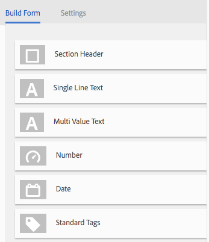

# Perfiles de metadatos {#metadata-profiles}

Un perfil de metadatos permite aplicar metadatos predeterminados a los recursos de una carpeta. Crear un perfil de metadatos y aplicarlo a una carpeta. Cualquier recurso que cargue posteriormente en la carpeta heredará los metadatos predeterminados que haya configurado en el perfil de metadatos.

## Añadir un perfil de metadatos {#adding-a-metadata-profile}

1. Toque o haga clic en el logotipo [!DNL Experience Manager], vaya a **[!UICONTROL Herramientas > Assets > Perfiles de metadatos]** y, a continuación, pulse **[!UICONTROL Crear]**.
1. Introduzca un título para el perfil de metadatos, por ejemplo Metadatos de muestra, y haga clic en **[!UICONTROL Enviar]**. Se muestra **[!UICONTROL Editar formulario]** para el perfil de metadatos.

   

1. Haga clic en un componente y configure sus propiedades en la pestaña **[!UICONTROL Settings]**. Por ejemplo, haga clic en el componente **[!UICONTROL Description]** y edite sus propiedades.

   

   Edite las siguientes propiedades para el componente **[!UICONTROL Description]**:

   * **[!UICONTROL Etiqueta]** de campo: Nombre para mostrar de la propiedad metadata. Solo es para referencia del usuario.
   * **[!UICONTROL Asignar a propiedad]**: El valor de esta propiedad proporciona la ruta/nombre relativos al nodo del recurso donde se guarda en el repositorio. El valor siempre debe comenzar por `./` porque indica que la ruta está bajo el nodo del recurso.

   

   El valor que especifique para **[!UICONTROL Asignar a la propiedad]** se almacena como una propiedad en el nodo de metadatos del recurso. Por ejemplo, si especifica `/jcr:content/metadata/dc:desc` como nombre de  **[!UICONTROL Asignar a propiedad]**,  [!DNL Experience Manager] Assets almacena el valor  `dc:desc` en el nodo de metadatos del recurso.

   * **[!UICONTROL Valor]** predeterminado: Utilice esta propiedad para añadir un valor predeterminado para el componente de metadatos. Por ejemplo, si especifica &quot;Mi descripción&quot;, este valor se asigna a la propiedad `dc:desc` en el nodo de metadatos del recurso.

   

   >[!NOTE]
   >
   >Adición de un valor predeterminado a una nueva propiedad de metadatos (que no existe ya en . `/jcr:content/metadata` ) no muestra la propiedad y su valor en la página  **** Propiedades del recurso de forma predeterminada. Para ver la nueva propiedad en la página [!UICONTROL Properties] del recurso, modifique el formulario de esquema correspondiente.

1. (Opcional) Agregue más componentes a **[!UICONTROL Editar formulario]** desde la pestaña **[!UICONTROL Generar formulario]** y configure sus propiedades en la pestaña **[!UICONTROL Configuración]**. Las siguientes propiedades están disponibles en la pestaña **[!UICONTROL Generar formulario]**:

| Componente | Propiedades |
|---|---|
| [!UICONTROL Sección de encabezado] | Etiqueta de campo,   Descripción |
| [!UICONTROL Texto de una sola línea] | Etiqueta de campo,   Asignar a propiedad,   Valor predeterminado |
| [!UICONTROL Texto con varios valores] | Etiqueta de campo,   Asignar a propiedad,   Valor predeterminado |
| [!UICONTROL Número] | Etiqueta de campo,   Asignar a propiedad,   Valor predeterminado |
| [!UICONTROL Fecha] | Etiqueta de campo,   Asignar a propiedad,   Valor predeterminado |
| [!UICONTROL Etiquetas estándar] | Etiqueta de campo,   Asignar a propiedad,   Valor predeterminado,   Descripción |

1. Haga clic en **[!UICONTROL Listo]**. El perfil de metadatos se agrega a la lista de perfiles de la página **[!UICONTROL Perfiles de metadatos]**.

   

## Copiar un perfil de metadatos {#copying-a-metadata-profile}

1. En la página **[!UICONTROL Perfiles de metadatos]**, seleccione un perfil para realizar una copia de él.

   

1. Haga clic en **[!UICONTROL Copiar]** en la barra de herramientas.
1. En el cuadro de diálogo **[!UICONTROL Copiar perfil de metadatos]**, introduzca un título para la nueva copia del perfil.
1. Haga clic en **[!UICONTROL Copiar]**. En la lista de perfiles de la página **[!UICONTROL Perfiles de metadatos]** aparece una copia del perfil.

   

## Eliminación de un perfil de metadatos {#deleting-a-metadata-profile}

1. En la página **[!UICONTROL Perfiles de metadatos]**, seleccione un perfil que desee eliminar.

   

1. Haga clic en **[!UICONTROL Eliminar perfiles de metadatos]** en la barra de herramientas.
1. En el cuadro de diálogo, haga clic en **[!UICONTROL Delete]** para confirmar la operación de eliminación. El perfil de metadatos se elimina de la lista.

## Aplicar un perfil de metadatos a las carpetas {#applying-a-metadata-profile-to-folders}

Al asignar un perfil de metadatos a una carpeta, las subcarpetas heredan automáticamente el perfil de su carpeta principal. Esto significa que solo puede asignar un perfil de metadatos a una carpeta. Como tal, considere detenidamente la estructura de carpetas en la que carga, almacena, utiliza y archiva recursos.

Si ha asignado un perfil de metadatos diferente a una carpeta, el nuevo perfil anula el perfil anterior. Los recursos de carpeta existentes no cambian. El nuevo perfil se aplica a los recursos que se agregan a la carpeta más adelante.

Las carpetas que tienen un perfil asignado se indican en la interfaz de usuario por el nombre del perfil que aparece en el nombre de la tarjeta.

Puede aplicar perfiles de metadatos a carpetas específicas o globalmente a todos los recursos.

### Aplicación de perfiles de metadatos a carpetas específicas {#applying-metadata-profiles-to-specific-folders}

Puede aplicar un perfil de metadatos a una carpeta desde el menú **[!UICONTROL Herramientas]** o si está en la carpeta, desde **[!UICONTROL Propiedades]**. En esta sección se describe cómo aplicar perfiles de metadatos a las carpetas de ambos modos.

Las carpetas que ya tienen un perfil asignado se indican mediante la visualización del nombre del perfil directamente debajo del nombre de la carpeta.

#### Aplicación de perfiles de metadatos a carpetas desde la interfaz de usuario Perfiles {#applying-metadata-profiles-to-folders-from-profiles-user-interface}

1. Pulse el logotipo [!DNL Experience Manager] y vaya a **[!UICONTROL Tools > Assets > Metadata Profiles]**.
1. Seleccione el perfil de metadatos que desea aplicar a una o varias carpetas.

   

1. Pulse **[!UICONTROL Aplicar perfil de metadatos a las carpetas]**, seleccione la carpeta o carpetas que desee utilizar para recibir los recursos cargados recientemente y pulse **[!UICONTROL Listo]**. Las carpetas que ya tienen un perfil asignado se indican mediante la visualización del nombre del perfil directamente debajo del nombre de la carpeta.

#### Aplicación de perfiles de metadatos a carpetas desde Propiedades {#applying-metadata-profiles-to-folders-from-properties}

1. En el carril izquierdo, pulse **[!UICONTROL Assets]** y vaya a la carpeta a la que desee aplicar un perfil de metadatos.
1. En la carpeta, pulse la marca de verificación para seleccionarla y, a continuación, pulse **[!UICONTROL Propiedades]**.

1. Seleccione la pestaña **[!UICONTROL Metadata Profiles]** , seleccione el perfil en el menú desplegable y haga clic en **[!UICONTROL Save]**.

   

   Las carpetas que ya tienen un perfil asignado se indican mediante la visualización del nombre del perfil directamente debajo del nombre de la carpeta.

### Aplicar un perfil de metadatos globalmente {#applying-a-metadata-profile-globally}

Además de aplicar un perfil a una carpeta, también puede aplicarlo de forma global para que cualquier contenido cargado en [!DNL Experience Manager] recursos en cualquier carpeta tenga aplicado el perfil seleccionado. Para aplicar un perfil de metadatos globalmente, siga estos pasos:

1. Realice una de las acciones siguientes:

   * Vaya a `https://[aem_server]:[port]/mnt/overlay/dam/gui/content/assets/foldersharewizard.html/content/dam` y aplique el perfil adecuado y toque o haga clic en **[!UICONTROL Guardar]**.

      

   * Vaya al CRXDE Lite al nodo siguiente: `/content/dam/jcr:content`. Agregue la propiedad `metadataProfile:/etc/dam/metadata/dynamicmedia/<name_of_metadata_profile>` y pulse **[!UICONTROL Guardar todo]**.

      

## Eliminación de perfiles de metadatos de carpetas {#removing-a-metadata-profile-from-folders}

Al quitar un perfil de metadatos de una carpeta, las subcarpetas heredan automáticamente la eliminación del perfil de su carpeta principal. Sin embargo, cualquier procesamiento de archivos que se haya producido dentro de las carpetas permanece intacto.

Puede quitar un perfil de metadatos de una carpeta desde el menú **[!UICONTROL Herramientas]** o, si está en la carpeta, desde **[!UICONTROL Propiedades]**. En esta sección se describe cómo quitar perfiles de metadatos de las carpetas de ambos modos.

### Eliminación de perfiles de metadatos de carpetas a través de la interfaz de usuario Perfiles {#removing-metadata-profiles-from-folders-via-profiles-user-interface}

Para eliminar un perfil de metadatos de carpetas a través de la interfaz de usuario de Perfiles, siga estos pasos:

1. Pulse el logotipo [!DNL Experience Manager] y vaya a **[!UICONTROL Tools > Assets > Metadata Profiles]**.
1. Seleccione el perfil de metadatos que desea eliminar de una carpeta o varias carpetas.
1. Pulse **[!UICONTROL Quitar perfil de metadatos de las carpetas]** y seleccione la carpeta o carpetas que desee usar para quitar un perfil. A continuación, pulse **[!UICONTROL Listo]**.

   Puede confirmar que el perfil de metadatos ya no se aplica a una carpeta porque el nombre ya no aparece debajo del nombre de la carpeta.

### Eliminación de perfiles de metadatos de carpetas mediante Propiedades {#removing-metadata-profiles-from-folders-via-properties}

1. Pulse el logotipo [!DNL Experience Manager], navegue **[!UICONTROL Assets]** y, a continuación, hasta la carpeta desde la que desea eliminar un perfil de metadatos.
1. En la carpeta, pulse la marca de verificación para seleccionarla y, a continuación, pulse **[!UICONTROL Propiedades]**.
1. Seleccione la pestaña **[!UICONTROL Perfiles de metadatos]** y, a continuación, seleccione **[!UICONTROL Ninguno]** en el menú desplegable. Toque **[!UICONTROL Guardar]**.

Las carpetas que ya tienen un perfil asignado se indican mediante la visualización del nombre del perfil directamente debajo del nombre de la carpeta.
