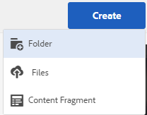

# Preparación de recursos para la traducción {#preparing-assets-for-translation}

Recursos multilingües significa recursos con binarios, metadatos y etiquetas en varios idiomas. Por lo general, los binarios, los metadatos y las etiquetas de los recursos existen en un idioma, y luego se traducen a otros idiomas para su uso en proyectos multilingües.

En Adobe Experience Manager (AEM) Assets, los recursos multilingües se incluyen en las carpetas, donde cada carpeta contiene los recursos en un idioma diferente.

Cada carpeta de idioma se denomina copia de idioma. La carpeta raíz de una copia de idioma, conocida como raíz de idioma, identifica el idioma del contenido en la copia de idioma. Por ejemplo, */content/dam/it* es la raíz de idioma italiano para la copia en idioma italiano. Las copias de idioma deben utilizar una [raíz de idioma configurada correctamente](preparing-assets-for-translation.md#creating-a-language-root) para que se oriente al idioma correcto cuando se realicen traducciones de recursos de origen.

La copia de idioma para la que se agregaron recursos originalmente es el idioma principal. El idioma principal es la fuente que se traduce a otros idiomas.

La jerarquía de carpetas de ejemplo incluye varias raíces de idioma:

```java
/content
    /- dam
             |- en
             |- fr
             |- de
             |- es
             |- it
             |- ja
             |- zh
```

Siga estos pasos para preparar los recursos para la traducción:

1. Cree la raíz de idioma de la principal del idioma. Por ejemplo, la raíz de idioma de la copia en inglés en la jerarquía de carpetas de ejemplo es `/content/dam/en`. Asegúrese de que la raíz del idioma esté configurada correctamente según la información de [Creación de una raíz del idioma](preparing-assets-for-translation.md#creating-a-language-root).

1. Añada recursos al idioma principal.
1. Cree la raíz de idioma de cada idioma de destino para el que necesite una copia de idioma.

## Creación de una raíz de idioma {#creating-a-language-root}

Para crear la raíz del idioma, cree una carpeta y utilice un código de idioma ISO como valor de la propiedad Name . Después de crear la raíz del idioma, puede crear una copia del idioma en cualquier nivel dentro de la raíz del idioma.

Por ejemplo, la página raíz de la copia en idioma italiano de la jerarquía de ejemplo tiene `it` como propiedad Name . La propiedad Name se utiliza como nombre del nodo de recursos en el repositorio y, por lo tanto, determina la ruta de los recursos. (`https://[AEM_server]:[port]/assets.html/content/dam/it/*`)

1. En la consola de Assets, pulse o haga clic en **[!UICONTROL Crear]** y seleccione **[!UICONTROL Carpeta]** en el menú.

   

1. En el campo Nombre , escriba el código de país con el formato `<language-code>`.

   

1. Haga clic o pulse **[!UICONTROL Crear]**. La raíz del idioma se crea en la consola Recursos.

## Visualización de raíces de idioma {#viewing-language-roots}

La IU táctil proporciona un panel Referencias que muestra una lista de las raíces de idioma que se han creado en AEM Assets.

1. En la consola Assets, seleccione el idioma principal para el que desea crear copias de idioma.
1. Toque o haga clic en el icono de navegación global y elija **[!UICONTROL Referencias]** para abrir el panel Referencia.

   

1. En el panel Referencias, pulse o haga clic en **[!UICONTROL Textos en idiomas]**. El panel Textos en idiomas muestra las copias de idioma de los recursos.

   

