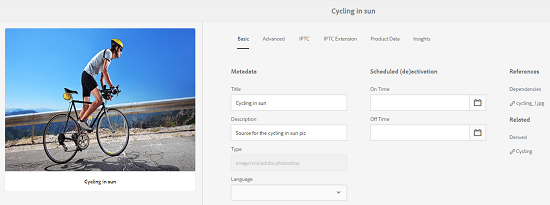

# Activos relacionados {#related-assets}

>[!CAUTION]
>
>AEM 6.4 ha llegado al final de la compatibilidad ampliada y esta documentación ya no se actualiza. Para obtener más información, consulte nuestra [períodos de asistencia técnica](https://helpx.adobe.com/es/support/programs/eol-matrix.html). Buscar las versiones compatibles [here](https://experienceleague.adobe.com/docs/).

Adobe Experience Manager Assets permite relacionar recursos manualmente en función de las necesidades de la organización mediante la función Recursos relacionados . Por ejemplo, puede relacionar un archivo de licencia con un recurso o una imagen/vídeo en un tema similar. Puede relacionar recursos que comparten ciertos atributos comunes. También puede utilizar la función para crear relaciones de origen/derivadas entre recursos. Por ejemplo, si tiene un archivo PDF generado a partir de un archivo INDD, puede relacionar el archivo PDF con su archivo INDD de origen.

De este modo, tiene la flexibilidad de compartir un archivo de baja resolución (por ejemplo, PDF/JPG) con proveedores/agencias y poner a disposición el archivo de alta resolución (por ejemplo, INDD) únicamente si lo solicita.

## Relación de recursos {#relating-assets}

1. En la interfaz de Assets, abra la página de propiedades de un recurso que desee relacionar.

   

   También puede seleccionar el recurso en la vista de lista.

   

   También puede seleccionar el recurso de una colección.

   

1. Para relacionar otro recurso con el recurso seleccionado, toque o haga clic en el **[!UICONTROL Relate]** de la barra de herramientas.

   

1. Realice una de las siguientes acciones:

   * Para relacionar el archivo de origen del recurso, seleccione **[!UICONTROL Fuente]** de la lista.
   * Para relacionar un archivo derivado, seleccione **[!UICONTROL Derivado]** de la lista.
   * Para crear una relación bidireccional entre los recursos, seleccione **[!UICONTROL Otros]** de la lista.

   

1. En el **[!UICONTROL Seleccionar recurso]** , vaya a la ubicación del recurso que desea relacionar y selecciónelo.

   

1. Toque o haga clic en **[!UICONTROL Confirmar]** icono.
1. Toque o haga clic **[!UICONTROL OK]** para cerrar el cuadro de diálogo. Según su elección de relación en el paso 3, el activo relacionado se enumera en una categoría adecuada dentro de la categoría **[!UICONTROL Relacionado]** para obtener más información. Por ejemplo, si el recurso que ha relacionado es el archivo de origen del recurso actual, aparece debajo de **[!UICONTROL Fuente]**.

   

1. Para desrelacionar un recurso, toque o haga clic en el botón **[!UICONTROL Sin relación]** de la barra de herramientas.

   

1. Seleccione los recursos que desea desrelacionar de la **[!UICONTROL Quitar relaciones]** y pulse o haga clic en **[!UICONTROL Sin relación]**.

   

1. Pulsación **[!UICONTROL OK]** para cerrar el cuadro de diálogo. Los recursos para los que ha eliminado relaciones se eliminan de la lista de recursos relacionados en la sección **[!UICONTROL Relacionado]** para obtener más información.

## Traducción de recursos relacionados {#translating-related-assets}

La creación de relaciones de origen/derivadas entre recursos mediante la función Recursos relacionados también es útil en los flujos de trabajo de traducción. Cuando se ejecuta un flujo de trabajo de traducción en un recurso derivado, [!DNL Experience Manager] Assets recupera automáticamente cualquier recurso al que haga referencia el archivo de origen y lo incluye para su traducción. De este modo, el recurso al que hace referencia el recurso de origen se traduce junto con el origen y los recursos derivados. Por ejemplo, imaginemos un escenario en el que la copia en inglés incluye un recurso derivado y su archivo de origen, como se muestra a continuación.

Si el archivo de origen está relacionado con otro recurso, [!DNL Experience Manager] Assets recupera el recurso referenciado y lo incluye para su traducción.

1. Traduzca los recursos de la carpeta de origen a un idioma de destino siguiendo los pasos indicados en [Crear un nuevo proyecto de traducción](translation-projects.md#create-a-new-translation-project). Por ejemplo, en este caso, traduzca los recursos al francés.
1. En la página Proyectos , abra la carpeta de traducción.

   

1. Toque o haga clic en el mosaico del proyecto para abrir la página de detalles.

   

1. Pulse o haga clic en los puntos suspensivos situados debajo de la tarjeta Trabajo de traducción para ver el estado de la traducción.

   

1. Seleccione el recurso y, a continuación, toque o haga clic en **[!UICONTROL Mostrar en Assets]** en la barra de herramientas para ver el estado de traducción del recurso.

   

1. Para comprobar si se han traducido los recursos relacionados con el origen, toque o haga clic en el recurso de origen.

   

1. Seleccione el recurso relacionado con el origen y, a continuación, toque o haga clic en **[!UICONTROL Mostrar en Assets]**. Se muestra el recurso relacionado traducido.

   
