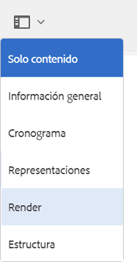

# Procesar recursos 3D {#rendering-d-assets}

Puede procesar los recursos 3D que haya manipulado y guardado en AEM para crear imágenes 2D que se usarán en las páginas de contenido web.

Consulte [Edición del contenido de la página](/help/sites-authoring/qg-page-authoring.md#editing-your-page-content).

## Consideraciones de rendimiento al procesar los recursos 3D {#performance-considerations-when-rendering-d-assets}

El procesamiento de contenido 3D consume importantes recursos del servidor, como la CPU y la memoria. Como tal, el procesamiento puede llevar a menudo una gran cantidad de tiempo. El procesamiento de horas varía sustancialmente según diversos factores, incluyendo además el tamaño de modelo y el hardware de servidor obvios:

* **Selección de procesador**.

    El procesador Rapid Refine™ predeterminado en AEM 3D baja un poco el nivel de calidad para conseguir tiempos de procesamiento más breves. Sin embargo, produce resultados de alta calidad en muchas aplicaciones. Los procesadores que proporcionan las aplicaciones de terceros (por ejemplo, V-Ray™ o NVIDIA® Mental Ray® que se implementan en Autodesk® Maya® o Autodesk® 3ds Max®) son extremadamente configurables y la compensación entre el rendimiento y la calidad se realiza cuando se ha diseñado el escenario.

* **IBL frente a la iluminación tradicional**.

   Si bien este factor es de menor importancia en lo referente al procesador predeterminado Rapid Refine, los procesadores de terceros como Mental Ray son sustancialmente más lentos a la hora de realizar operaciones de procesamiento si usan etapas IBL que cuando utilizan puntos tradicionales o luces focales.

El procesador de Rapid Refine suele tardar unos minutos en procesar imágenes más grandes. Sin embargo, los procesadores de terceros a menudo tardan varios minutos, horas incluso, cuando están configurados para la máxima calidad.

Los procesos para convertir, procesar y representar trabajos se ponen en cola en el servidor según sea necesario para evitar la sobrecarga del servidor. El mensaje &quot;Esperando procesamiento…&quot; se muestra en recursos cargados recientemente en la vista de tarjetas. Este estado indica que otras tareas de procesamiento deben terminar antes de que el trabajo actual de procesamiento pueda comenzar.

>[!NOTE]
>
>Un recurso 3D siempre se procesa con los materiales originales, independientemente de qué materiales se muestran en la vista interactiva de AEM 3D. Esta funcionalidad se aplica al procesador integrado Rapid Refine y a todos los procesadores nativos.

**Para procesar los recursos 3D**:

1. Abra un recurso 3D para ver el contenido.

   Consulte [Ver recursos 3D](viewing-3d-assets.md).

1. En Adobe Experience Manager, en la página **[!UICONTROL Navegación]**, pulse **[!UICONTROL Recursos]**.
1. Near the upper-right corner of the page, from the **[!UICONTROL View]** drop-down list, tap **[!UICONTROL Card View]**.
1. Busque el objeto 3D que desea procesar.
1. Pulse la tarjeta del objeto 3D para abrirlo en la página de detalles del recurso.
1. Cerca de la esquina superior izquierda de la página, pulse la lista desplegable y, a continuación, seleccione **[!UICONTROL Procesar]**.

   

1. Near the upper-right corner of the asset details page, tap the **[!UICONTROL Stage Selector]** icon (spotlight), then select a stage name with the background and lighting that you want to apply to the 3D object.

   Consulte [Información acerca del uso de escenarios en AEM 3D](about-the-use-of-stages-in-aem-3d.md).

   

   **[!UICONTROL Icono del selector de escenario]**

1. On the **[!UICONTROL Render]** drop-down list on the left side of the asset details page, select a renderer.

   El procesador predeterminado **Rapid Refine** siempre está disponible. Si el escenario que ha seleccionado es un formato nativo, el procesador de terceros correspondiente también estará disponible en la lista que seleccione.

   Consulte [Información acerca del uso de escenarios en AEM 3D](about-the-use-of-stages-in-aem-3d.md).

1. Haga lo siguiente:

   * In the **[!UICONTROL Width]** and **[!UICONTROL Height]** fields, enter the pixel width and height that you want your image rendered.
   * In the **[!UICONTROL Image Name]** field, enter the name of the rendered image.
   * In the **[!UICONTROL Export Path]** field, enter the path where you want the rendered image stored. Or, tap the **[!UICONTROL Browse]** icon and navigate to a location.
   * (Optional) Select or deselect the **[!UICONTROL Overwrite existing imag]e **check box.

1. Near the upper-right corner of the asset details page, tap the **[!UICONTROL Camera Selector]** icon. Seleccione la vista de cámara que desea aplicar a la imagen procesada.

   Las barras de la izquierda y la derecha o las barras superiores e inferiores son un indicador visual con respecto al cual las partes de la vista se procesarán. Cuando el escenario seleccionado proporciona la cámara, puede seleccionar una cámara predefinida.

   

   **[!UICONTROL Icono del selector de cámara]**

1. Pulse **[!UICONTROL Iniciar procesamiento]** para iniciar el procesamiento.

   Se muestra un mensaje temporalmente para indicar que el procesamiento se ha iniciado. Para su comodidad, este mensaje también incluye un vínculo a la carpeta de salida seleccionada para que pueda acceder a ella directamente.

