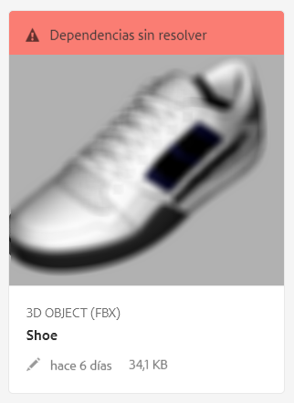
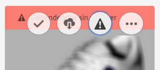

# Resolución de dependencias de archivo {#resolving-file-dependencies}

Las dependencias principales de archivo de modelo 3D, como archivos de mapa de textura, se resuelven automáticamente en la medida de lo posible. Para conseguir esta funcionalidad, AEM debe buscar en carpetas de Assets cercanas archivos con los mismos nombres que los que se encuentran en el archivo 3D. If one or more dependencies are unresolvable during the Creating preview processing stage, the asset&#39;s card displays the following red banner message in the **[!UICONTROL Card View]**:

**Para resolver dependencias de archivo**:

1. In the **[!UICONTROL Card View]**, hover the pointer over the **[!UICONTROL Unresolved Dependencies]** banner message on the card, then tap the **[!UICONTROL Exclamation Point]** icon.

   

1. On the **[!UICONTROL Metadata Properties]** page, tap the **[!UICONTROL Dependencies]** tab.

   The files that AEM could not auto-resolve are listed under the **[!UICONTROL Original Paths]** column, in red.

1. Realice una o varias de las acciones siguientes:

   * **Busque y seleccione las dependencias**. (Esta opción da por hecho que ya ha cargado los archivos de dependencia).

      1. Tap the **[!UICONTROL File Browse]** icon to the left of the red path.
      1. On the **[!UICONTROL Select Content]** page, navigate to the missing file, then tap on the file&#39;s card to select it.
      1. In the upper-left corner of the **[!UICONTROL Select Content]** page, tap **[!UICONTROL Close]** (X icon) to return to the **[!UICONTROL View Properties]** page.
   * **Cargue las dependencias**. (Esta opción da por hecho que todavía no ha cargado los archivos no disponibles).

      1. Tenga en cuenta las rutas de acceso y los nombres de archivo no disponibles.
      1. Cerca de la esquina superior derecha de la página Propiedades, toque **[!UICONTROL Cerrar]**.

   After the files are uploaded return to **[!UICONTROL View Properties > Dependencies]** page. El recurso recién cargado se muestra ahora correctamente como recurso al que se hace referencia.

   * **Ignore las dependencias**.

      If a missing dependency is no longer needed, under the **[!UICONTROL Referenced Asset]** column, in the text field to the left of the missing file, type `n/a` so that AEM 3D ignores the file.

1. Near the upper-right corner of the **[!UICONTROL View Properties]** page, tap **[!UICONTROL Save]**.
1. Toque **[!UICONTROL Cerrar]****[!UICONTROL para volver a la vista de tarjeta]**.

   El recurso se vuelve a procesar automáticamente con las dependencias recién resueltas.

