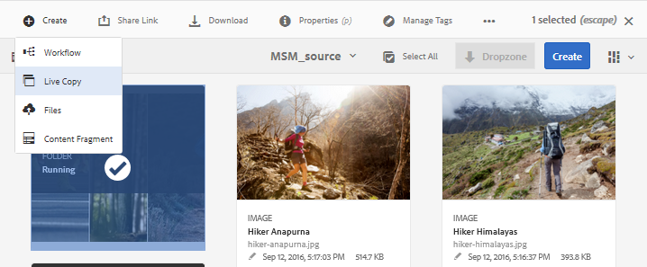

# Reutilizar recursos con MSM para [!DNL Assets] {#reuse-assets-using-msm-for-assets}

La funcionalidad de Multi Site Manager (MSM) en [!DNL Adobe Experience Manager] permite a los usuarios reutilizar contenido creado una vez y reutilizado en varias ubicaciones web. Lo mismo está disponible para los recursos digitales que MSM para la funcionalidad [!DNL Assets]. Con MSM para [!DNL Assets], puede:

* Cree recursos una vez y, a continuación, haga copias de estos recursos para reutilizarlos en otras áreas del sitio.
* Mantenga varias copias en sincronización y actualice la copia principal original una vez para insertar los cambios en las copias secundarias.
* Realice cambios locales suspendiendo temporal o permanentemente la vinculación entre recursos principales y secundarios.

## Requisitos previos {#msm-prerequisites}

Para usar MSM para [!DNL Assets], instale al menos [!DNL Experience Manager] 6.4 Service Pack 5. Para obtener más información, consulte [las notas de la versión del Service Pack más reciente](/help/release-notes/sp-release-notes.md).

## Comprender los beneficios y los conceptos {#understand-benefits-concepts}

### Cómo funciona y los beneficios {#how-it-works-the-benefits}

Para comprender los escenarios de uso para reutilizar el mismo contenido (texto y recursos) en varias ubicaciones web, consulte [posibles escenarios de MSM](/help/sites-administering/msm.md). [!DNL Experience Manager] mantiene un vínculo entre el recurso original y sus copias vinculadas, denominadas Live Copies (LC). La vinculación mantenida permite insertar cambios centralizados en muchas Live Copies. Esto permite realizar actualizaciones más rápidas mientras se eliminan las limitaciones de la administración de copias duplicadas. La propagación de los cambios está libre de errores y centralizada. La funcionalidad permite disponer de espacio para actualizaciones que se limitan a copias en vivo seleccionadas. Los usuarios pueden desasociar la vinculación, es decir, interrumpir la herencia, y realizar ediciones locales que no se sobrescriban la próxima vez que se actualice la copia principal y se implementen los cambios. La desvinculación se puede realizar para unos pocos campos de metadatos seleccionados o para todo un recurso. Permite flexibilidad para actualizar localmente los recursos que se heredan originalmente de una copia principal.

MSM mantiene una relación activa entre el recurso de origen y sus Live Copies, de modo que:

* Los cambios en los recursos de origen se aplican (se implementan) también a las Live Copies, es decir, las Live Copies se sincronizan con el origen.

* Puede actualizar las Live Copies suspendiendo la relación activa o eliminando la herencia de algunos campos limitados. Las modificaciones al origen ya no se aplican a la Live Copy.

### Glosario de MSM para términos {#glossary-msm-for-assets} de Assets

* **Fuente:** Los recursos o carpetas originales. Copia principal de la que provienen las Live Copies.

* **Live Copy:** la copia de los recursos o carpetas de origen que están en sincronización con su origen. Las Live Copies pueden ser una fuente de más Live Copies. Consulte [cómo crear LC](#create-live-copy-asset).

* **Herencia:** un vínculo/referencia entre un recurso o carpeta de Live Copy y su origen que el sistema utiliza para recordar dónde enviar las actualizaciones. La herencia existe a nivel granular para los campos de metadatos. La herencia se puede eliminar para campos de metadatos selectivos, preservando al mismo tiempo la relación activa entre el origen y su Live Copy.

* **Despliegue**: Acción que impulsa las modificaciones realizadas en el flujo descendente de origen a sus Live Copies. Es posible actualizar una o más Live Copies en una misma vez mediante la acción de despliegue. Consulte [despliegue](#rollout-action).

* **Configuración de lanzamiento:**  reglas que determinan qué propiedades se sincronizan, cómo y cuándo. Estas configuraciones se aplican al crear Live Copies; se puede editar más adelante; y un elemento secundario puede heredar la configuración de lanzamiento de su recurso principal. Para MSM para [!DNL Assets], utilice solamente la configuración de lanzamiento estándar. Las demás configuraciones de lanzamiento no están disponibles para MSM para [!DNL Assets].

* **Sincronizar:** otra acción, además de la implementación, que ofrece paridad entre la fuente y su Live Copy al enviar las actualizaciones de la fuente a las Live Copies. Se inicia una sincronización para una Live Copy concreta y la acción extrae los cambios del origen. Con esta acción, solo es posible actualizar una de las Live Copies. Consulte [sincronizar acción](#about-synchronize-action).

* **Suspender:** elimine temporalmente la relación activa entre una Live Copy y su recurso o carpeta de origen. Puede reanudar la relación. Consulte [acción de suspensión](#suspend-and-resume-relationship).

* **Reanudar:** reanude la relación activa para que una copia activa vuelva a empezar a recibir las actualizaciones del origen. Consulte [acción de reanudación](#suspend-and-resume-relationship).

* **Restablecer:** la acción Restablecer hace que la Live Copy vuelva a ser una réplica del origen sobrescribiendo los cambios locales. También elimina las cancelaciones de herencia y restablece la herencia en todos los campos de metadatos. Para realizar modificaciones locales en el futuro, debe cancelar de nuevo la herencia de campos específicos. Consulte [modificaciones locales a LC](#make-local-modifications-to-live-copy).

* **Separar:** elimine irrevocablemente la relación activa de una carpeta o un recurso de Live Copy. Después de la acción de desasociar, las Live Copies nunca pueden recibir actualizaciones del origen y deja de ser una Live Copy. Consulte [quitar relación](#remove-live-relationship).

## Crear una Live Copy de un recurso {#create-live-copy-asset}

Para crear Live Copy desde uno o varios recursos o carpetas de origen, siga uno de los siguientes pasos:

* **Método 1**: Seleccione los recursos de origen y haga clic en  **[!UICONTROL Crear]**  >  **[!UICONTROL Copia activa]** en la barra de herramientas de la parte superior.
* **Método 2**: En AEM interfaz de usuario, haga clic en  **[!UICONTROL Crear > Live]** Copy en la esquina superior derecha de la interfaz.

Puede crear Live Copies de un recurso o de una carpeta de a una. Puede crear Live Copies que se deriven de un recurso o de una carpeta que sea una Live Copy en sí.

Los fragmentos de contenido (CF) no son compatibles con el caso de uso. Al intentar crear sus Live Copies, los CF se copian tal cual sin ninguna relación. Los CF copiados son una instantánea a tiempo y no se actualizan cuando se actualizan los CF originales.

Para crear Live Copies con el primer método, siga estos pasos:

1. Seleccione los recursos o carpetas de origen. En la barra de herramientas, haga clic en **[!UICONTROL Crear > Live Copy]**.
   
1. Seleccione la carpeta o el recurso de origen. Haga clic en **[!UICONTROL Siguiente]**. 
1. Proporcione título y nombre. Los activos no tienen elementos secundarios. Al crear una Live Copy de carpetas, puede elegir incluir o excluir elementos secundarios.
1. Seleccione una configuración de lanzamiento. Haga clic en **[!UICONTROL Crear]**.

Para crear Live Copies con el segundo método, siga estos pasos:

1. En AEM interfaz, en la esquina superior derecha, haga clic en **[!UICONTROL Crear > Live Copy]**.
   
1. Seleccione la carpeta o el recurso de origen. Haga clic en **[!UICONTROL Siguiente]**. 
1. Seleccione la carpeta de destino. Haga clic en **[!UICONTROL Siguiente]**. 
1. Proporcione título y nombre. Los activos no tienen elementos secundarios. Al crear una Live Copy de carpetas, puede elegir incluir o excluir elementos secundarios.
1. Seleccione una configuración de lanzamiento. Haga clic en **[!UICONTROL Crear]**.

>[!NOTE]
>
>Cuando se mueve un origen o una Live Copy, las relaciones se conservan. Cuando se elimina una Live Copy, se eliminan las relaciones.

## Ver varias propiedades y estados del origen y la Live Copy {#view-properties-statuses-source-and-lc}

Puede ver la información y los estados relacionados con MSM de Live Copy, como la relación, la sincronización, los lanzamientos, etc., desde las distintas áreas de la interfaz de usuario de AEM. Los dos métodos siguientes funcionan para los recursos y las carpetas:

* Seleccione un recurso de Live Copy y busque la información en su página **[!UICONTROL Propiedades]**.
* Seleccione la carpeta de origen y busque la información detallada de cada Live Copy desde la **[!UICONTROL Consola Live Copy]**.

>[!TIP]
>
>Para comprobar el estado de algunas Live Copies independientes, utilice el primer método para comprobar la página **[!UICONTROL Properties]**. Para comprobar los estados de muchas Live Copies, utilice el segundo método para marcar la página **[!UICONTROL Estado de relación]**.

### Información y estado de una Live Copy {#information-status-of-one-lc}

Para comprobar la información y los estados de un recurso de Live Copy o de una carpeta, siga estos pasos.

1. Seleccione un recurso de Live Copy o una carpeta. Haga clic en **[!UICONTROL Properties]** en la barra de herramientas. También puede utilizar el atajo de teclado `p`.
1. Haga clic en **[!UICONTROL Live Copy]**. Puede comprobar la ruta del origen, el estado de la suspensión, el estado de la sincronización, la última fecha de lanzamiento y el usuario que realizó la última implementación.
   
1. Puede habilitar o deshabilitar si los recursos secundarios piden prestado la configuración de Live Copy.
1. Puede elegir la opción de la Live Copy para heredar la configuración de lanzamiento del elemento principal o cambiar la configuración.

### Información y estados de todas las Live Copies de una carpeta {#information-status-of-all-lcs-of-folder}

[!DNL Experience Manager] proporciona una consola para comprobar los estados de todas las Live Copies de una carpeta de origen. Esta consola muestra el estado de todos los recursos secundarios.

1. Seleccione una carpeta de origen. Haga clic en **[!UICONTROL Properties]** en la barra de herramientas. También puede utilizar el atajo de teclado `p`.
1. Haga clic en **[!UICONTROL Origen de Live Copy]**. Para abrir la consola, haga clic en **[!UICONTROL Descripción general de Live Copy]**. Este tablero proporciona un estado de nivel superior de todos los recursos secundarios.
   
1. Para ver la información detallada sobre cada recurso en la carpeta Live Copy, seleccione un recurso y haga clic en **[!UICONTROL Estado de relación]** en la barra de herramientas.
   

>[!TIP]
>
>Puede ver rápidamente los estados de las Live Copies de otras carpetas sin tener que examinar demasiado. Cambie la carpeta desde la parte superior central de la interfaz **[!UICONTROL Información general de Live Copy]**.

### Acciones rápidas del carril Referencias para el origen {#quick-actions-from-references-rail-for-source}

Para un recurso o carpeta de origen, puede ver la siguiente información y realizar las siguientes acciones directamente desde el carril Referencias:

* Consulte las rutas de las Live Copies.
* Abra o muestre una Live Copy específica en la interfaz de usuario [!DNL Experience Manager].
* Sincronice las actualizaciones con una Live Copy específica.
* Suspenda la relación o cambie la configuración de lanzamiento para una Live Copy específica.
* Acceda a la consola de información general de Live Copy.

Seleccione la carpeta o el recurso de origen, abra el carril izquierdo y haga clic en **[!UICONTROL Referencias]**. También puede seleccionar un recurso o una carpeta y utilizar la combinación de teclas `Alt + 4`. 

Para una Live Copy específica, haga clic en **[!UICONTROL Editar Live Copy]** para suspender la relación o cambiar la configuración de lanzamiento.

### Acciones rápidas del carril Referencias para la Live Copy {#quick-actions-from-references-rail-for-live-copy}

Para una carpeta o un recurso de Live Copy, puede ver la siguiente información y realizar las siguientes acciones directamente desde el carril Referencias:

* Consulte la ruta de su origen.
* Abra o muestre una Live Copy específica en la interfaz de usuario [!DNL Experience Manager].
* Despliegue las actualizaciones.

Seleccione una carpeta o un recurso de Live Copy, abra el carril izquierdo y haga clic en **[!UICONTROL Referencias]**. También puede seleccionar un recurso o una carpeta y utilizar la combinación de teclas `Alt + 4`. 

## Propagación de modificaciones del origen a las Live Copies {#propagate-modifications-from-source-to-live-copies}

Una vez modificado el origen, los cambios se pueden propagar a las Live Copies mediante una acción de sincronización o de despliegue. Para comprender la diferencia entre ambas acciones, consulte [glosario](#glossary-msm-for-assets).

### Desplegar acción {#rollout-action}

Puede iniciar una acción de despliegue desde el recurso de origen y actualizar todas o algunas Live Copies seleccionadas.

1. Seleccione un recurso de Live Copy o una carpeta. Haga clic en **[!UICONTROL Properties]** en la barra de herramientas. También puede utilizar el atajo de teclado `p`.
1. Haga clic en **[!UICONTROL Origen de Live Copy]**. Haga clic en **[!UICONTROL Despliegue]** en la barra de herramientas.
1. Seleccione las Live Copies que desee actualizar. Haga clic en **[!UICONTROL Despliegue]**.
1. Para desplegar las actualizaciones realizadas en los recursos secundarios, seleccione **[!UICONTROL Origen de lanzamiento y todos los elementos secundarios]**.
   

>[!NOTE]
>
>Las modificaciones realizadas en un recurso de origen solo se implementan en las Live Copies directamente relacionadas. Si una Live Copy se deriva de otra Live Copy, las modificaciones no se implementan en la Live Copy derivada.

Como alternativa, puede iniciar una acción de despliegue desde el carril [!UICONTROL References] después de seleccionar una Live Copy específica. Para obtener más información, consulte [Acciones rápidas del carril Referencias para Live Copy](#quick-actions-from-references-rail-for-live-copy). En este método de implementación, solo se actualizan la Live Copy seleccionada y, opcionalmente, sus elementos secundarios.

### Acerca de la acción de sincronización {#about-synchronize-action}

Una acción de sincronización extrae las modificaciones de un origen solo a la Live Copy seleccionada. La acción de sincronización respeta y mantiene las modificaciones locales realizadas después de cancelar la herencia. Las modificaciones locales no se sobrescriben y la herencia cancelada no se restablece. Puede iniciar una acción de sincronización de tres formas.

| Dónde en la interfaz [!DNL Experience Manager] | Cuándo y por qué utilizar | Utilización |
|---|---|---|
|  Carril de referencia | Sincronice rápidamente cuando ya tenga seleccionado el origen. | Consulte [Acciones rápidas del carril Referencias para el origen](#quick-actions-from-references-rail-for-source) |
| Barra de herramientas de la página [!UICONTROL Propiedades] | Inicie una sincronización cuando ya tenga abiertas las propiedades de Live Copy. | Consulte [Sincronizar una Live Copy](#synchronize-live-copy) |
| [!UICONTROL Live Copy ] Overviewconsole | Sincronice rápidamente varios recursos (no necesariamente todos) cuando la carpeta de origen esté seleccionada o la consola [!UICONTROL Información general de Live Copy] ya esté abierta. La acción de sincronización se inicia para un recurso a la vez, pero es una forma más rápida de sincronizar varios recursos de una sola vez. | Consulte [Acciones sobre muchos recursos en una carpeta de Live Copy](#take-actions-on-many-assets-in-lcfolder) |

### Sincronizar una Live Copy {#synchronize-live-copy}

Para iniciar una acción de sincronización, abra la página **[!UICONTROL Propiedades]** de una Live Copy, haga clic en **[!UICONTROL Live Copy]** y, a continuación, seleccione la acción que desee en la barra de herramientas.

Para ver los estados y la información relacionados con una acción de sincronización, consulte [Información y estados de todas las Live Copies de una carpeta](#information-status-of-all-lcs-of-folder).

>[!NOTE]
>
>Si la relación está suspendida, la acción de sincronización no está disponible en la barra de herramientas. Mientras que la acción de sincronización está disponible en el carril [!UICONTROL References] , las modificaciones no se propagan ni siquiera tras una implementación correcta.

## Suspender y reanudar la relación {#suspend-and-resume-relationship}

Puede suspender temporalmente la relación para evitar que una Live Copy reciba las modificaciones realizadas en la carpeta o el recurso de origen. La relación también se puede reanudar para que Live Copy empiece a recibir las modificaciones del origen.

Para suspender o reanudar, abra la página **[!UICONTROL Propiedades]** de una Live Copy, haga clic en **[!UICONTROL Live Copy]** y seleccione la acción que desee en la barra de herramientas.

También puede suspender o reanudar rápidamente las relaciones de varios recursos en una carpeta de Live Copy desde la consola **[!UICONTROL Información general de Live Copy]**. Consulte [Realizar acciones en varios recursos de las carpetas de Live Copy](#take-actions-on-many-assets-in-lcfolder).

## Realizar modificaciones locales en una Live Copy {#make-local-modifications-to-live-copy}

Una Live Copy es una réplica del origen original cuando se crea. Los valores de metadatos de una Live Copy se heredan del origen. Los campos de metadatos mantienen individualmente la herencia con los respectivos campos del recurso de origen.

Sin embargo, tiene la flexibilidad de realizar modificaciones locales en una Live Copy para cambiar algunas propiedades seleccionadas. Para realizar modificaciones locales, cancele la herencia de la propiedad deseada. Cuando se cancela la herencia de uno o varios campos de metadatos, se conserva la relación activa del recurso y la herencia de los demás campos de metadatos. Cualquier sincronización o implementación no sobrescribe las modificaciones locales. Para ello, abra la página **[!UICONTROL Properties]** de un recurso de Live Copy y haga clic en la opción **[!UICONTROL cancel herencia]** situada junto a un campo de metadatos.

Puede deshacer todas las modificaciones locales y revertir el recurso al estado de su origen. La acción Restablecer anula de forma irrevocable e instantánea todas las modificaciones locales y restablece la herencia en todos los campos de metadatos. Para revertir, en la página **[!UICONTROL Properties]** de un recurso de Live Copy, haga clic en **[!UICONTROL Reset]** en la barra de herramientas.

## Quitar relación activa {#remove-live-relationship}

Puede eliminar completamente la relación entre un origen y una Live Copy mediante la acción Separar. La Live Copy se convierte en un recurso independiente o en una carpeta después de separarse. Se muestra como un nuevo recurso en AEM interfaz, inmediatamente después de la desconexión. Para separar una Live Copy de su origen, siga estos pasos.

1. Seleccione una carpeta o un recurso de Live Copy. Haga clic en **[!UICONTROL Properties]** en la barra de herramientas. También puede utilizar el atajo de teclado `p`.
1. Haga clic en **[!UICONTROL Live Copy]**. Haga clic en **[!UICONTROL Desasociar]** en la barra de herramientas. Haga clic en **[!UICONTROL Desasociar]** del cuadro de diálogo presentado.
   

>[!CAUTION]
>
>La relación se elimina inmediatamente al hacer clic en [!UICONTROL Desasociar] del cuadro de diálogo. No puede deshacer la acción haciendo clic en [!UICONTROL Cancelar] en la página Propiedades.

Como alternativa, puede separar rápidamente varios recursos en una carpeta de Live Copy desde la consola **[!UICONTROL Información general de Live Copy]**. Consulte [Realizar acciones en varios recursos de las carpetas de Live Copy](#take-actions-on-many-assets-in-lcfolder).

## Realice acciones en muchos recursos de una carpeta de Live Copy {#take-actions-on-many-assets-in-lcfolder}

Si tiene varios recursos en una carpeta de Live Copy, iniciar acciones en cada recurso puede ser tedioso. Puede iniciar rápidamente las acciones básicas en muchos recursos desde la consola Live Copy. Los métodos anteriores siguen funcionando con recursos individuales.

1. Seleccione una carpeta de origen. Haga clic en **[!UICONTROL Properties]** en la barra de herramientas. También puede utilizar el atajo de teclado p.
1. Haga clic en Origen de Live Copy. Para abrir la consola, haga clic en **[!UICONTROL Descripción general de Live Copy]**.
1. En este tablero, seleccione un recurso de Live Copy de una carpeta de Live Copy. Haga clic en las acciones que desee en la barra de herramientas. Las acciones disponibles son **[!UICONTROL Edit]**, **[!UICONTROL Synchronize]**, **[!UICONTROL Reset]**, **[!UICONTROL Suspend]** y **[!UICONTROL Detach]**. Puede iniciar rápidamente estas acciones en cualquier recurso en cualquier número de carpetas de Live Copy que estén en relación activa con la carpeta de origen seleccionada.
   

## Ampliar MSM para recursos {#extend-msm-for-assets}

AEM le permite ampliar la funcionalidad mediante las API de Java de MSM. Para los recursos, la extensión funciona igual que con MSM para el sitio. Para obtener más información, consulte [Ampliación de MSM](../sites-developing/extending-msm.md) y las secciones siguientes para obtener información sobre tareas específicas:

* [Información general sobre las API](../sites-developing/extending-msm.md#overview-of-the-java-api)
* [Crear una nueva acción de sincronización](../sites-developing/extending-msm.md#creating-a-new-synchronization-action)
* [Crear una nueva configuración de lanzamiento](../sites-developing/extending-msm.md#creating-a-new-rollout-configuration)
* [Cree y utilice una sencilla clase LiveActionFactory](../sites-developing/extending-msm.md#creating-and-using-a-simple-liveactionfactory-class)

>[!NOTE]
>
>* El modelo en MSM para el sitio se denomina fuente de Live Copy en MSM para los recursos.
>* MSM para Assets no admite la eliminación del paso capítulos en el asistente de creación de sitios.
>* La configuración de bloqueos MSM en propiedades de página (IU táctil) no es compatible con MSM para Assets.

## Impacto de las tareas de administración de recursos en Live Copies {#impact-of-asset-management-tasks-on-live-copies}

Las Live Copies y los orígenes son recursos o carpetas que se pueden administrar, en cierta medida, como recursos digitales. Algunas tareas de administración de recursos en AEM tienen un impacto específico en las Live Copies.

* Al copiar una Live Copy, se crea un recurso de Live Copy con el mismo origen que la primera Live Copy.
* Al mover un origen o su Live Copy, se conserva la relación activa.
* La acción Editar no funciona para los recursos de Live Copy.
* La acción de desprotección no está disponible para los recursos de Live Copy.
* Para la carpeta de origen, está disponible la opción para crear tareas de revisión.
* Al ver el listado de recursos en la vista de lista y la vista de columna, un recurso de Live Copy o una carpeta muestra &quot;Live Copy&quot; en su contra. Esto le ayuda a identificar fácilmente las Live Copies en una carpeta.

## Comparar MSM para recursos y sitios {#compare-msm-for-assets-and-sites}

En más escenarios, MSM para recursos coincide con el comportamiento de la funcionalidad de MSM para sitios . Algunas diferencias clave a tener en cuenta son:

* En Sites, puede comparar un modelo y su Live Copy, pero en Assets no es posible comparar una fuente con su Live Copy.
* Los sitios suelen tener elementos secundarios, pero los recursos no. La opción para incluir o excluir elementos secundarios no está presente al crear copias activas de recursos individuales.
* MSM para Assets no admite la eliminación del paso capítulos en el asistente de creación de sitios.
* La configuración de bloqueos MSM en propiedades de página (IU táctil) no es compatible con MSM para Assets.
* Para MSM para Assets, utilice solo la configuración de lanzamiento estándar. Las demás configuraciones de lanzamiento no están disponibles para MSM para Assets.

## Limitaciones de MSM para Assets {#limitations-of-msm-for-assets}

A continuación se muestra la limitación con MSM para Assets.

* Los fragmentos de contenido (CF) no son compatibles con el caso de uso. Al intentar crear sus Live Copies, los CF se copian tal cual sin ninguna relación. Los CF copiados son una instantánea a tiempo y no se actualizan cuando se actualizan los CF originales.

* MSM no funciona con la reescritura de metadatos habilitada. Al reescribir, la herencia se rompe.
