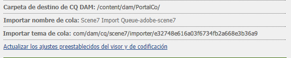
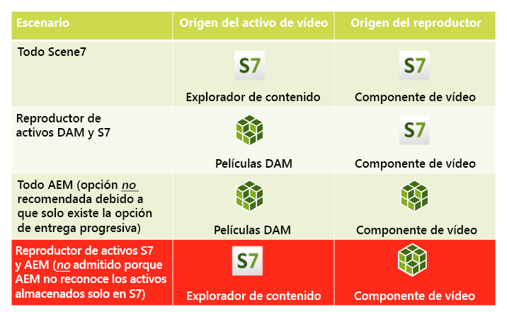
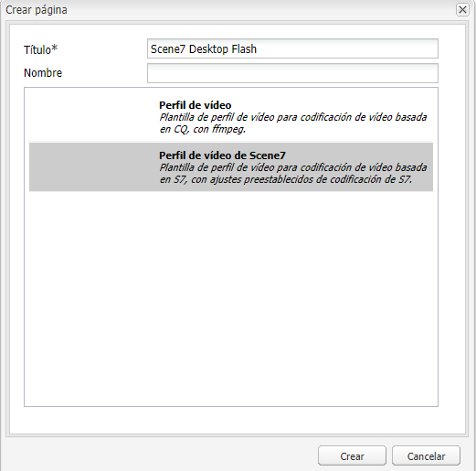
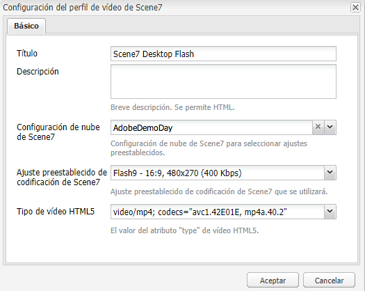

# Vídeo {#video}

Los recursos permiten la administración centralizada de recursos de vídeo, donde puede cargar vídeos directamente en Assets para la codificación automática en Dynamic Media Classic. También puede acceder a los vídeos de Dynamic Media Classic directamente desde Assets para la creación de páginas.

La integración de vídeo de Dynamic Media Classic amplía el alcance del vídeo optimizado a todas las pantallas (detección automática de dispositivos y ancho de banda).

El componente **[!UICONTROL Scene7 Video]** realiza automáticamente la detección de dispositivos y ancho de banda para reproducir el formato y la calidad de vídeo correctos en equipos de escritorio, tabletas y dispositivos móviles.

Puede incluir conjuntos de vídeos adaptables en lugar de solo recursos de vídeo únicos. Un conjunto de vídeos adaptables es un contenedor para todas las representaciones de vídeo necesarias para reproducir vídeo sin problemas en varias pantallas. Un conjunto de vídeos adaptables agrupa versiones del mismo vídeo codificadas con diferentes velocidades de bits y formatos. Por ejemplo, 400 kbps, 800 kbps y 1000 kbps. Se utiliza un conjunto de vídeos adaptables, junto con el componente de vídeo S7, para el flujo de vídeo adaptable en varios tipos de pantalla. Por ejemplo, dispositivos móviles de escritorio, iOS, Android, BlackBerry y Windows.

Consulte la [documentación de Dynamic Media Classic sobre los conjuntos de vídeos adaptables para obtener más información](https://experienceleague.adobe.com/docs/experience-manager-cloud-service/assets/dynamicmedia/video-profiles.html#dynamicmedia).

## Acerca de FFMPEG y Dynamic Media Classic {#about-ffmpeg-and-scene}

El proceso de codificación de vídeo predeterminado se basa en el uso de la integración basada en FFMPEG con los perfiles de vídeo. Por lo tanto, el flujo de trabajo de ingesta de DAM incorporado contiene los dos pasos siguientes de flujo de trabajo basados en FFMP:

* Miniaturas de FFMPEG
* Codificación de FFMPEG

Al habilitar y configurar la integración de Dynamic Media Classic, no se eliminan ni se desactivan automáticamente estos dos pasos de flujo de trabajo del flujo de trabajo de ingesta de DAM integrado. Si ya utiliza codificación de vídeo basada en FFMPEG en el Experience Manager, es probable que tenga FFMPEG instalado en los entornos de creación. En este caso, un nuevo vídeo ingestado con DAM se codificaría dos veces: una desde el codificador FFMPEG y otra desde la integración con Dynamic Media Classic.

Si tiene instalada la codificación de vídeo basada en FFMPEG en AEM y FFMPEG, puede eliminar los dos flujos de trabajo FFMPEG de los flujos de trabajo de ingesta de DAM.

## Formatos admitidos {#supported-formats}

Los formatos siguientes se admiten para el componente de vídeo de Scene7:

* F4V H.264
* MP4 H.264

## Decidir dónde cargar el vídeo {#deciding-where-to-upload-your-video}

Decidir dónde cargar los recursos de vídeo depende de las acciones siguientes:

* ¿Necesita un flujo de trabajo para el recurso de vídeo?
* ¿Necesita un control de versión para el recurso de vídeo?

Si la respuesta es “sí” a una o ambas preguntas, cargue el vídeo directamente en Adobe DAM. Si la respuesta a ambas preguntas es &quot;no&quot;, cargue el vídeo directamente en Dynamic Media Classic. El flujo de trabajo de cada escenario se describe en las secciones siguientes.

### Si está cargando el vídeo directamente en Adobe DAM {#if-you-are-uploading-your-video-directly-to-adobe-dam}

Si necesita un flujo de trabajo o crear versiones de los recursos, primero cargue en Adobe DAM . El flujo de trabajo siguiente es el recomendado:

1. Cargue el recurso de vídeo en DAM de Adobe y codifique y publique automáticamente en Dynamic Media Classic.
1. En el Experience Manager, acceda a los recursos de vídeo de WCM en la pestaña **[!UICONTROL Películas]** del Buscador de contenido.
1. Autor con **[!UICONTROL Scene7 Video]** o componente **[!UICONTROL Foundation Video]**.

### Si está cargando el vídeo en Scene7 {#if-you-are-uploading-your-video-to-scene}

Si no necesita un flujo de trabajo o crear versiones de los recursos, cárguelos a Scene7. El flujo de trabajo siguiente es el recomendado:

1. En Dynamic Media Classic, [configure una carga y codificación de FTP programada en Scene7 (sistema automatizado)](https://experienceleague.adobe.com/docs/dynamic-media-classic/using/upload-publish/uploading-files.html#preparing-your-assets-and-folders-for-uploading).
1. En el Experience Manager, acceda a los recursos de vídeo de WCM en la pestaña **[!UICONTROL Scene7]** del Buscador de contenido.
1. Autor con el componente **[!UICONTROL Scene7 Video]**.

## Configuración de la integración con vídeo de Scene7 {#configuring-integration-with-scene-video}

Para configurar los ajustes preestablecidos universales:

1. En **[!UICONTROL Servicios de nube]**, vaya a la configuración de **[!UICONTROL Scene7]** y haga clic en **[!UICONTROL Editar]**.
1. Seleccione la pestaña **[!UICONTROL Vídeo]**.

   

   >[!NOTE]
   >
   >La pestaña **[!UICONTROL Vídeo]** no aparece si la página no tiene una configuración de nube.

1. Seleccione el perfil de codificación de vídeo adaptable, un perfil de codificación de vídeo único listo para usar o un perfil de codificación de vídeo personalizado.

   >[!NOTE]
   >
   >Para obtener más información sobre el significado de los ajustes preestablecidos de vídeo, consulte la [documentación de Dynamic Media Classic](https://experienceleague.adobe.com/docs/dynamic-media-classic/using/setup/application-setup.html#video-presets-for-encoding-video-files).
   >
   >Adobe recomienda que seleccione ambos conjuntos de vídeos adaptables al configurar los ajustes preestablecidos universales o que seleccione la opción **[!UICONTROL Codificación de vídeo adaptable]**.

1. Los perfiles de codificación seleccionados se aplican automáticamente a todos los vídeos cargados en la carpeta de destino de CQ DAM que ha configurado para esta configuración de nube de Scene7. Puede establecer diversas configuraciones de nube de Scene7 con diferentes carpetas de destino para aplicar distintos perfiles de codificación según sea necesario.

## Actualizar los ajustes preestablecidos del visor y de codificación  {#updating-viewer-and-encoding-presets}

Es necesario actualizar los ajustes preestablecidos de visor y codificación para vídeo en Experience Manager si los ajustes preestablecidos se actualizaron en Scene7. En estos casos, vaya a la configuración de Scene7 en la configuración de nube y haga clic en **[!UICONTROL Actualizar los ajustes preestablecidos de visor y codificación]**.

## Carga del vídeo maestro en Scene7 desde el Adobe DAM {#uploading-your-master-video}

1. Vaya a la carpeta de destino de CQ DAM en que ha establecido la configuración de nube con perfiles de codificación de Scene7.
1. Haga clic en **[!UICONTROL Cargar]** para cargar el vídeo maestro. La carga y codificación de vídeo se completan una vez finalizado el flujo de trabajo de recursos de actualización de DAM y **[!UICONTROL Publicar en Scene7]** tiene una marca de verificación.

   >[!NOTE]
   >
   >Las miniaturas de vídeo tardan algún tiempo en generarse.

   Al arrastrar el vídeo maestro de DAM al componente de vídeo, se accede a *all* las representaciones proxy codificadas de Scene7 para su envío.

## Componente de vídeo base frente al componente de vídeo de Scene7 {#foundation-video-component-versus-scene-video-component}

Al utilizar Experience Manager, tiene acceso al componente Vídeo disponible en Sitios y al componente de vídeo de Scene7. Dichos componentes no son intercambiables.

El componente de vídeo de Scene7 solo funciona para los vídeos de Scene7. El componente base funciona con vídeos almacenados desde el Experience Manager (mediante ffmpeg) y vídeos de Scene7.

La siguiente matriz explica cuándo utilizar cada componente:

>[!NOTE]
>
>De serie, el componente de vídeo S7 utiliza el perfil de vídeo universal. Sin embargo, puede obtener el reproductor de vídeo basado en HTML5 en Experience Manager. Copie el código incrustado del reproductor de vídeo HTML5 listo para usar y colóquelo en la página Experience Manager.

## Componente de vídeo de Experience Manager {#aem-video-component}

Incluso si se recomienda utilizar el componente de vídeo de Scene7 para ver vídeos de Scene7, utilice vídeos de Scene7 con el componente de vídeo base para que sea más completo.

### Comparación de vídeo de Experience Manager y vídeo de Scene7 {#aem-video-and-scene-video-comparison}

La siguiente tabla ofrece una comparación de alto nivel de las funciones admitidas entre el componente de vídeo base de Experience Manager y el componente de vídeo de Scene7:

|  | Vídeo de base de Experience Manager | Vídeo de Scene7 |
|---|---|---|
| Enfoque | Primer enfoque de HTML5. Flash solo se utiliza para la alternativa no HTML5. | Flash en la mayoría de los equipos de escritorio. HTML5 se utiliza para móviles y tabletas. |
| Entrega | Progresivo | Transmisión adaptable |
| Seguimiento | Sí | Sí |
| Capacidad de ampliación | Sí | Sí (con [documentación de la API del SDK del visor HTML5](https://s7d1.scene7.com/s7sdk/3.10/docs/jsdoc/index.html)) |
| Vídeo móvil | Sí | Sí |

### Configuración  {#setting-up}

#### Creación de perfiles de vídeo {#creating-video-profiles}

Las distintas codificaciones de vídeo se crean según los ajustes preestablecidos de codificación de Scene7 seleccionados en la configuración de nube de Scene7. Para que el componente Vídeo base los utilice, se debe crear un perfil de vídeo para cada ajuste preestablecido de codificación de Scene7 seleccionado. Este método permite que el componente de vídeo seleccione las representaciones de DAM según corresponda.

>[!NOTE]
>
>Los perfiles de vídeo nuevos, así como los cambios que se realicen en ellos, deben activarse para publicarse.

1. En el Experience Manager, pulse **[!UICONTROL Herramientas] > [!UICONTROL Consola de configuración]**.
1. Desde la **[!UICONTROL Consola de configuración]** vaya a **[!UICONTROL Herramientas > DAM > Perfiles de vídeo]** en el árbol de navegación.
1. Crear un perfil de vídeo de Scene7. En **[!UICONTROL Nuevo...]**, seleccione **[!UICONTROL Crear página]** y, a continuación, seleccione la plantilla Perfil de vídeo de Scene7. Asigne un nombre a la página nueva del perfil de vídeo y haga clic en **[!UICONTROL Crear]**.

   

1. Edite el nuevo perfil de vídeo. Seleccione primero la configuración de nube. A continuación, seleccione el mismo ajuste preestablecido de codificación que el que se ha seleccionado en la configuración de nube.

   

   | Propiedad | Descripción |
   |---|---|
   | Configuración de nube de Scene7 | La configuración de nube que se utilizará para los ajustes preestablecidos de codificación. |
   | Ajuste preestablecido de codificación de Scene7 | El ajuste preestablecido de codificación con el que asignar este perfil de vídeo. |
   | Tipo de vídeo HTML5 | Esta propiedad permite establecer el valor de la propiedad type del elemento de origen de vídeo HTML5. Los ajustes preestablecidos de codificación de S7 no proporcionan esta información, pero es necesaria para procesar correctamente los vídeos mediante el elemento de vídeo HTML5. Se proporciona una lista de los formatos comunes, pero se pueden sobrescribir por otros formatos. |

   Repita este paso para todos los ajustes preestablecidos de codificación seleccionados en la configuración de nube que desea utilizar en el componente de vídeo.

#### Configuración del diseño {#configuring-design}

El componente **[!UICONTROL Vídeo base]** debe saber qué perfiles de vídeo utilizar para crear la lista de fuentes de vídeo. Abra el cuadro de diálogo de diseño de componentes de vídeo y configure el diseño de componentes para utilizar los nuevos perfiles de vídeo.

>[!NOTE]
>
>Si utiliza el componente **[!UICONTROL Vídeo base]** en una página móvil, repita estos pasos en el diseño de la página móvil.

>[!NOTE]
>
>Los cambios realizados en el diseño requieren la activación del diseño para que tengan efecto en la publicación.

1. Abra el cuadro de diálogo de diseño del componente **[!UICONTROL Vídeo base]** y cambie a la pestaña **[!UICONTROL Perfiles]**. A continuación, elimine los perfiles predeterminados y añada los nuevos perfiles de vídeo de S7. El orden de la lista de perfiles en el cuadro de diálogo de diseño define el orden del elemento de orígenes de vídeo al realizar la representación.
1. En los exploradores que no admiten HTML5, el componente de vídeo permite configurar una alternativa de Flash. Abra el cuadro de diálogo de diseño de componentes de vídeo y cambie a la pestaña **[!UICONTROL Flash]**. Configure los ajustes del Flash Player y asigne un perfil de reserva para el Flash Player.

#### Lista de comprobación {#checklist}

1. Crear una configuración de nube de S7. Asegúrese de que los ajustes preestablecidos de codificación de vídeo estén configurados y de que el importador se esté ejecutando.
1. Cree un perfil de vídeo de S7 para cada ajuste preestablecido de codificación de vídeo seleccionado en la configuración de nube.
1. Los perfiles de vídeo deben estar activados.
1. Configure el diseño del componente **[!UICONTROL Vídeo base]** en la página.
1. Active el diseño cuando haya terminado con los cambios de diseño.
