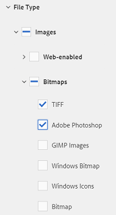
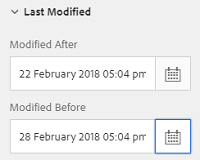

# Buscar recursos en AEM {#search-assets-in-aem}

Obtenga información sobre cómo encontrar los recursos necesarios en AEM mediante el panel Filtros y cómo utilizar los recursos que aparecen en la búsqueda.

Utilice el panel Filtros para buscar recursos, carpetas, etiquetas y metadatos. Puede buscar partes de una cadena con el asterisco comodín.

El panel Filtros ofrece varias opciones para buscar recursos y carpetas de varias formas en lugar de hacerlo en un orden taxonómico genérico.

Puede realizar búsquedas en función de las siguientes opciones (predicados):

* Tipo de archivo
* Tamaño de archivo
* Nombre del campo
* Fecha de última modificación
* Estado
* Orientación
* Estilo
* Perspectivas

<!-- TBD keystroke 65 article and port applicable changes here. This content goes. -->

Puede personalizar el panel Filtros y agregar o eliminar predicados de búsqueda mediante [facetas de búsqueda](search-facets.md). Para mostrar el panel Filtros, lleve a cabo estos pasos:

1. En la interfaz de usuario de Recursos, toque o haga clic  en la barra de herramientas para mostrar el cuadro de búsqueda de Omniture.
1. Escriba el término de búsqueda y pulse Intro. Como alternativa, simplemente pulse Intro sin introducir ningún término de búsqueda. No introduzca ningún espacio de interlineado, de lo contrario la búsqueda no funcionará.

1. Toque o haga clic en el icono de GlobalNav. Se muestra el panel Filtros.

   

   Según el tipo de elementos que busque, el número de coincidencias se indica en la parte superior de los resultados de búsqueda.

   

## Buscar tipos de archivo {#search-for-file-types}

El panel Filtros ayuda a agregar más granularidad a la experiencia de búsqueda y hace que la funcionalidad de búsqueda sea más versátil. Puede desplazarse fácilmente hasta el nivel de detalle deseado.

Por ejemplo, si busca una imagen, utilice el predicado **[!UICONTROL Tipo de archivo]** para elegir si desea una imagen de mapa de bits o una imagen vectorial.

Puede reducir aún más el alcance de la búsqueda especificando el tipo MIME para la imagen.

Del mismo modo, al buscar documentos, puede especificar el formato, por ejemplo PDF o MS Word.

## Búsqueda basada en el tamaño de archivo {#search-based-on-file-size}

Utilice el predicado **Tamaño de archivo** para buscar recursos en función de su tamaño. Puede especificar los límites inferior y superior del intervalo de tamaño para reducir la búsqueda. También puede especificar la unidad de medida, por ejemplo Kilobytes, Megabytes, etc.

## Buscar en función de cuándo se modificaron por última vez los recursos {#search-based-on-when-assets-are-last-modified}

Si está administrando recursos en curso o supervisando un flujo de trabajo de revisión, puede buscar cuándo se modificó un recurso por última vez en función de marcas de hora precisas. Por ejemplo, especifique las fechas antes o después de las cuales se modificaron los recursos.

También puede utilizar las siguientes opciones para lograr un nivel de granularidad más alto en la búsqueda:

## Búsqueda basada en el estado {#search-based-on-status}

Use el predicado **Estado** para buscar recursos en función de diversos tipos de estado, como Publicar, Aprobación, Cierre de compra y Caducidad.

Por ejemplo, al supervisar la publicación de recursos, puede utilizar la opción adecuada para buscar qué recursos se han publicado.

Cuando supervise el estado de revisión de los recursos, utilice la opción adecuada para encontrar los recursos aprobados o los que están pendientes de aprobación.

## Búsqueda basada en datos de perspectivas {#search-based-on-insights-data}

Use el predicado **Perspectivas** para buscar recursos en función de las estadísticas de uso obtenidas de varias aplicaciones de Creative. Los datos de uso se agrupan en las siguientes categorías:

* Puntuación de uso
* Impresiones
* Clics
* Canales de medios en los que aparecen los recursos

