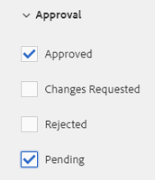

# Búsqueda de recursos en [!DNL Experience Manager] {#search-assets-in-aem}

>[!CAUTION]
>
>AEM 6.4 ha llegado al final de la compatibilidad ampliada y esta documentación ya no se actualiza. Para obtener más información, consulte nuestra [períodos de asistencia técnica](https://helpx.adobe.com/es/support/programs/eol-matrix.html). Buscar las versiones compatibles [here](https://experienceleague.adobe.com/docs/).

Obtenga información sobre cómo encontrar los recursos necesarios en [!DNL Experience Manager] mediante el panel Filtros y cómo utilizar los recursos que aparecen en la búsqueda.

Utilice el panel Filtros para buscar recursos, carpetas, etiquetas y metadatos. Puede buscar partes de una cadena utilizando el asterisco comodín.

El panel Filtros ofrece varias opciones para buscar recursos y carpetas de varias formas en lugar de hacerlo en un orden taxonómico genérico.

Puede buscar en función de las siguientes opciones (predicados):

* Tipo de archivo
* Tamaño del archivo
* Nombre del campo
* Fecha de última modificación
* Estado
* Orientación
* Estilo
* Perspectivas

<!-- TBD keystroke 65 article and port applicable changes here. This content goes. -->

Puede personalizar el panel Filtros y añadir o eliminar predicados de búsqueda mediante [facetas de búsqueda](search-facets.md). Para mostrar el panel Filtros , realice estos pasos:

1. En la interfaz de usuario de Assets, toque o haga clic en  en la barra de herramientas para mostrar el cuadro Omnisearch .
1. Escriba el término de búsqueda y pulse Intro. Como alternativa, simplemente pulse Intro sin introducir ningún término de búsqueda. No introduzca ningún espacio inicial, de lo contrario la búsqueda no funcionará.

1. Toque o haga clic en el icono de navegación global. Se muestra el panel Filtros .

   

   Según el tipo de elementos que busque, el número de coincidencias se indica en la parte superior de los resultados de búsqueda.

   

## Buscar tipos de archivo {#search-for-file-types}

El panel Filtros ayuda a añadir más granularidad a la experiencia de búsqueda y hace que la funcionalidad de búsqueda sea más versátil. Puede desplazarse fácilmente hasta el nivel de detalle deseado.

Por ejemplo, si está buscando una imagen, utilice la variable **[!UICONTROL Tipo de archivo]** predicado para elegir si desea una imagen de mapa de bits o una imagen vectorial.

Puede reducir aún más el ámbito de búsqueda especificando el tipo MIME de la imagen.

Del mismo modo, al buscar documentos, puede especificar el formato, por ejemplo PDF o MS Word.

## Buscar según el tamaño del archivo {#search-based-on-file-size}

Utilice la variable **Tamaño del archivo** predicar para buscar recursos en función de su tamaño. Puede especificar los límites inferior y superior del intervalo de tamaño para limitar la búsqueda. También puede especificar la unidad de medida, por ejemplo Kilobytes, Megabytes, etc.

## Buscar en función de la última modificación de los recursos {#search-based-on-when-assets-are-last-modified}

Si administra recursos en curso o supervisa un flujo de trabajo de revisión, puede buscar cuándo se modificó un recurso por última vez en función de marcas de hora precisas. Por ejemplo, especifique las fechas antes o después de las cuales se modificaron los recursos.

También puede utilizar las siguientes opciones para lograr un nivel de granularidad más alto en la búsqueda:

## Búsqueda basada en el estado {#search-based-on-status}

Utilice la variable **Estado** predicado para buscar recursos en función de varios tipos de estado, como Publicar, Aprobación, Cierre de compra y Caducidad.

Por ejemplo, al supervisar la publicación de recursos, puede utilizar la opción adecuada para buscar qué recursos se publican.

Cuando supervise el estado de revisión de los activos, utilice la opción adecuada para encontrar qué activos están aprobados o qué activos están pendientes de aprobación.

## Búsqueda basada en datos de perspectivas {#search-based-on-insights-data}

Utilice la variable **Perspectivas** predicado para buscar recursos en función de sus estadísticas de uso obtenidas de varias aplicaciones de Creative. Los datos de uso se agrupan en las siguientes categorías:

* Puntuación de uso
* Impresiones
* Clics
* Canales de medios en los que aparecen los recursos

