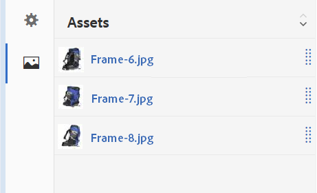

# Conjuntos de giros {#spin-sets}

Un conjunto de giros simula el acto real de girar un objeto para examinarlo. Los conjuntos de giros permiten la vista de elementos desde cualquier ángulo, obteniendo los detalles visuales clave desde cualquier ángulo.

Un conjunto de giros simula una experiencia de visualización de 360 grados. Medios dinámicos oferta conjuntos de giros de un solo eje en los que los visores pueden rotar un elemento. Además, los usuarios pueden aplicar zoom &quot;de forma libre&quot; y desplazarse por cualquiera de las vistas con unos pocos clics simples del ratón. De este modo, los usuarios pueden examinar un elemento más de cerca desde un punto de vista concreto.

Spin Sets are designated by a banner with the word **[!UICONTROL SPINSET]**. In addition, if the Spin Set is published, then the publish date, indicated by the **[!UICONTROL World]** icon is on the banner along with the last modification date, indicated by the **[!UICONTROL Pencil]** icon displays.

>[!NOTE]
>
>Para obtener información sobre la interfaz de usuario de Recursos, consulte [Gestión de recursos con la IU](managing-assets-touch-ui.md)táctil.

## Inicio rápido: Conjuntos de giros {#quick-start-spin-sets}

Para ayudarle en el uso inicial de los conjuntos de giros, siga este flujo de trabajo:

1. [Cargue las imágenes para varias vistas.](#uploading-assets-for-spin-sets)

   Como mínimo, necesitará entre 8 y 12 tomas de un elemento para un conjunto de giros unidimensional y entre 16 y 24 para un conjunto de giros bidimensional. Las tomas deben realizarse a intervalos regulares para dar la impresión de que el elemento está rotando y volteando. Por ejemplo, si un conjunto de giros unidimensional incluye 12 tomas, gire el elemento 30 grados (360/12) para cada toma.

1. [Crear conjuntos de giros.](#creating-spin-sets)

   Para crear un conjunto de giros, seleccione **[!UICONTROL Crear > Conjunto]** de giros y, a continuación, asigne un nombre al conjunto, elija los recursos y, a continuación, ordene las imágenes en el orden en que aparecerán.

   See [Working with Selectors](working-with-selectors.md).

   >[!NOTE]
   >
   >You can also create Spin Sets automatically through [batch set presets](/help/assets/config-dms7.md#creating-batch-set-presets-to-auto-generate-image-sets-and-spin-sets).
   *Los conjuntos de lotes son creados por IPS (Image Production System) como parte de la ingesta de recursos y solo están disponibles en el modo* Dynamic Media - Scene7.

1. Configure los ajustes preestablecidos [del visor de conjuntos de](managing-viewer-presets.md)giros según sea necesario.

   Los administradores pueden crear o modificar ajustes preestablecidos del visor de conjuntos de giros. To see your Spin Set with a Viewer preset, select the Spin Set, and in the left-rail drop-down menu, select **[!UICONTROL Viewers]**.

   Consulte **[!UICONTROL Herramientas > Recursos > Ajustes preestablecidos]** de visor para crear o editar ajustes preestablecidos de visor.

   Consulte [Añadir y editar ajustes preestablecidos de visor.](managing-viewer-presets.md)

1. [Visualización de conjuntos](#viewing-spin-sets)de giros.

   Puede vista y acceder a los conjuntos creados mediante ajustes preestablecidos de conjunto de lotes de tres formas diferentes. (Los conjuntos creados con ajustes preestablecidos de conjunto de lotes *no aparecen* en la interfaz de usuario).

1. [Conjuntos de giros de Previsualización.](previewing-assets.md)

   Seleccione el conjunto de giros y puede previsualización. Girar el conjunto de giros. Puede elegir diferentes visores en el menú **[!UICONTROL Visores]** , disponible en el menú desplegable del carril izquierdo.

1. [Publicar conjuntos de giros.](publishing-dynamicmedia-assets.md)

   Al publicar un conjunto de giros, se activa el orden en que aparecen las imágenes en un conjunto de giros. Asegúrese de ordenarlos para que el giro sea una vista suave de 360 grados.**[!UICONTROL URL]** y cadena **[!UICONTROL de incrustación]** . In addition, you must [publish the viewer preset](managing-viewer-presets.md).

1. [Vincule las direcciones URL a la Aplicación web](linking-urls-to-yourwebapplication.md) o [incruste el visor](embed-code.md)de vídeo o de imágenes.

   AEM Assets crea llamadas mediante URL para conjuntos de giros y los activa después de publicar los conjuntos de giros. Puede copiar estas direcciones URL cuando previsualización recursos. Como alternativa, puede incrustarlos en su sitio Web.

   Seleccione el conjunto de giros y, a continuación, en el menú desplegable del carril izquierdo, seleccione **[!UICONTROL Visualizadores]**.

   Consulte [Vinculación de un conjunto de giros a una página web](linking-urls-to-yourwebapplication.md) e [Incrustación del visualizador de imágenes o vídeos](embed-code.md).

Si lo necesita, puede [editar los conjuntos](#editing-spin-sets)de giros. Además, puede realizar vistas y editar las propiedades [del conjunto](managing-assets-touch-ui.md#editing-properties)de giros.

## Carga de recursos para conjuntos de giros {#uploading-assets-for-spin-sets}

Como mínimo, necesitará entre 8 y 12 tomas de un elemento para un conjunto de giros unidimensional y entre 16 y 24 para un conjunto de giros bidimensional. Las tomas deben realizarse a intervalos regulares para dar la impresión de que el elemento está rotando y volteando. Por ejemplo, si un conjunto de giros unidimensional incluye 12 tomas, gire el elemento 30 grados (360/12) para cada toma.

Puede cargar imágenes para los conjuntos de giros como lo haría con cualquier otro [recurso en AEM Assets](managing-assets-touch-ui.md).

### Pautas para grabar imágenes de conjuntos de giros {#guidelines-for-shooting-spin-set-images}

A continuación se indican algunas prácticas recomendadas en relación con las imágenes de conjuntos de giros. En general, cuantas más imágenes haya en un conjunto de giros, mejor será el efecto de giro de la imagen. However, including many images in the set also increases the amount of time it takes for the images to load. AEM recommends these guidelines for shooting images for use in Spin Sets:

* Como mínimo, utilice entre 8 y 12 imágenes en un conjunto de giros unidimensional y entre 16 y 24 imágenes en un conjunto de giros bidimensional. A minimum of 8 images is necessary to be able to turn 360 degrees. One-dimensional Spin Sets are more common as creating two-dimensional Spin Sets is labor intensive.
* Use a lossless format; TIFF and PNG are recommended.
* Mask all images so the item appears on a pure white or other high-contrast background. Optionally, add shadows.
* Asegúrese de que los detalles del producto están bien iluminados y enfocados.
* Tome imágenes de giro para ropa de moda con un maniquí o modelo. A menudo, el maniquí está completamente enmascarado (con un maniquí de vidrio) o se muestra en la imagen un maniquí o una forma de vestir estilizada. Puede crear un conjunto de giros en modelo definiendo el número de ángulos. Marque cada ángulo con cinta en el suelo para guiar al modelo hacia el paso y mirar en la dirección de cada toma.

## Creación de conjuntos de giros {#creating-spin-sets}

El orden en que aparecen las imágenes en un conjunto de giros es importante. Asegúrese de ordenarlos para que el giro sea una vista suave de 360 grados.

>[!NOTE]
>
>También puede crear conjuntos de giros automáticamente mediante los [ajustes preestablecidos de conjuntos de lotes](/help/assets/config-dms7.md#creating-batch-set-presets-to-auto-generate-image-sets-and-spin-sets).
Los conjuntos de lotes son creados por IPS (Image Production System) como parte de la ingesta de recursos y solo están disponibles en el modo Dynamic Media - Scene7.
>
>Consulte &quot;Creación de ajustes preestablecidos de conjunto de lotes para generar automáticamente conjuntos de imágenes y conjuntos de giros&quot; en [Configuración de medios dinámicos: modo](/help/assets/config-dms7.md#creating-batch-set-presets-to-auto-generate-image-sets-and-spin-sets)Scene7.

**Para crear conjuntos de giros:**

1. In Assets, navigate to where you want to create a spin set, tap **[!UICONTROL Create]**, and select **[!UICONTROL Spin Set**. También puede crear el conjunto desde una carpeta que contenga los recursos.

   

1. En la página Editor **[!UICONTROL de conjuntos de]** giros, en el campo **[!UICONTROL Título]** , introduzca un nombre para el conjunto de giros. El nombre aparece en la pancarta del conjunto de giros. De forma opcional, introduzca una descripción.

   

   Al crear el conjunto de giros, puede cambiar la miniatura del conjunto de giros o permitir que AEM seleccione la miniatura automáticamente en función de los recursos del conjunto de giros. Para seleccionar una miniatura, toque **[!UICONTROL Cambiar miniatura]**. Seleccione cualquier imagen (puede desplazarse a otras carpetas para buscar imágenes también). If you have selected a thumbnail and then decide that you want AEM to generate one from the spin set, select **[!UICONTROL Switch to Automatic thumbnail]**.

1. Realice una de las siguientes acciones:

   * Cerca de la esquina superior izquierda de la página Editor **[!UICONTROL de conjuntos de]** giros, toque **[!UICONTROL Añadir recurso]**.
   * Near the middle of the **[!UICONTROL Spin Set Editor]** page, tap **[!UICONTROL Tap to open Asset Selector]**.

   Tap to select assets that you want to include in your Spin Set. Los recursos seleccionados tienen un icono de marca de verificación sobre ellos. When you are finished, near the upper-right corner of the page, tap **[!UICONTROL Select]**.

   Con el Selector de recursos, puede buscar recursos escribiendo una palabra clave y pulsando **[!UICONTROL Retorno]**. También puede aplicar filtros para restringir los resultados de búsqueda. Puede filtrar por ruta, colección, tipo de archivo y etiqueta. Seleccione el filtro y, a continuación, pulse el icono **[!UICONTROL Filtro]** en la barra de herramientas. To change the view, near the upper-right corner of the page, tap the **[!UICONTROL View]** icon then tap **[!UICONTROL Column View]**, **[!UICONTROL Card View]**, or **[!UICONTROL List View]**.

   See [Working with Selectors](working-with-selectors.md).

   

1. Cuando se agregan recursos al conjunto, se añaden automáticamente en orden alfanumérico. Después de agregarlos, puede reordenar o ordenar manualmente los recursos. Si es necesario, arrastre el icono **[!UICONTROL Reordenar]** de un recurso a la derecha del nombre de archivo del recurso para reordenar las imágenes hacia arriba o hacia abajo en la lista establecida.

   

1. (Opcional) Realice cualquiera de las siguientes acciones:

   * Para eliminar una imagen, selecciónela y toque **[!UICONTROL Eliminar recurso]**.
   * To apply a preset, near the upper-right corner of the page, tap **[!UICONTROL Preset]**, then select a preset to apply to all the assets at once.

1. Toque **[!UICONTROL Guardar]**. El conjunto de giros recién creado aparece en la carpeta en la que lo creó.

## Visualización de conjuntos de giros {#viewing-spin-sets}

Puede crear conjuntos de giros en la interfaz de usuario o automáticamente mediante ajustes preestablecidos [de conjunto de](/help/assets/config-dms7.md#creating-batch-set-presets-to-auto-generate-image-sets-and-spin-sets)lotes. Sin embargo, los conjuntos creados con ajustes preestablecidos de conjunto de lotes *no aparecen* en la interfaz de usuario. Puede acceder a los conjuntos creados mediante ajustes preestablecidos de conjuntos de lotes de tres formas diferentes. (Estos métodos están disponibles aunque haya creado los conjuntos de giros en la interfaz de usuario).

También puede realizar vistas de conjuntos mediante la interfaz de usuario, tal como se describe en [Edición de conjuntos](#editing-spin-sets)de giros.

**Para vista de conjuntos de giros:**

1. Al abrir las propiedades de un recurso individual. Properties indicate what sets the selected asset is a member of (under **[!UICONTROL Member of Sets]**). Toque el nombre del conjunto para ver el conjunto completo.

   

1. Desde una imagen de miembro de cualquier conjunto. Select the **[!UICONTROL Sets]** menu to display the sets that the asset is a member of.

   

1. From search, you can select **[!UICONTROL Filters]**, then expand **[!UICONTROL Dynamic Media]** and select **[!UICONTROL Sets]**.

   La búsqueda devuelve conjuntos coincidentes creados manualmente en la interfaz de usuario o creados automáticamente mediante ajustes preestablecidos de conjunto de lotes. Para los conjuntos automatizados, la consulta de búsqueda se realiza utilizando **[!UICONTROL Inicios con]** criterios de búsqueda diferentes de AEM búsqueda que se basa en el uso de criterios de búsqueda **[!UICONTROL Contiene]** . Definir el filtro en **[!UICONTROL Conjuntos]** es la única manera de buscar conjuntos automatizados.

   

## Edición de conjuntos de giros {#editing-spin-sets}

Puede realizar varias tareas de edición en los conjuntos de giros, como las siguientes:

* Añada imágenes al conjunto de giros.
* Vuelva a ordenar las imágenes en el conjunto de giros.
* Eliminar recursos del conjunto de giros.
* Aplicación de ajustes preestablecidos de visor.
* Elimine el conjunto de giros.

**Para editar un conjunto de giros:**

1. Realice una de las siguientes acciones:

   * Pase el ratón sobre un recurso de conjunto de giros y, a continuación, toque **[!UICONTROL Editar]** (icono de lápiz).
   * Hover over a Spin Set asset, tap **[!UICONTROL Select]** (checkmark icon), then tap **[!UICONTROL Edit]** on the toolbar.
   * Puntee en un recurso de conjunto de giros y, a continuación, toque **[!UICONTROL Editar]** (icono de lápiz) en la barra de herramientas.

1. Para editar el conjunto de giros, realice una de las siguientes acciones:

   * Para reordenar imágenes, arrastre una imagen a una nueva ubicación (seleccione el icono de reordenar para mover elementos).
   * To sort items in ascending or descending order, tap the column heading.
   * Para agregar un recurso o actualizar un recurso existente, toque **[!UICONTROL Añadir recurso]**. Vaya a un recurso, selecciónelo y, a continuación, toque **[!UICONTROL Seleccionar]** cerca de la esquina superior derecha.
Si elimina la imagen que AEM utiliza para la miniatura reemplazándola por otra imagen, el recurso original seguirá mostrándose.
   * Para eliminar un recurso, selecciónelo y toque **[!UICONTROL Eliminar recurso]**.
   * Para aplicar un ajuste preestablecido, toque el icono **[!UICONTROL Ajuste preestablecido]** y seleccione un ajuste preestablecido.
   * Para eliminar un conjunto de giros completo, desplácese hasta el conjunto de giros, selecciónelo y seleccione **[!UICONTROL Eliminar]**

      >[!NOTE]
      >* You can edit the images in a Spin Set by navigating to the set, tap **[!UICONTROL Set Members]** in the left rail, and then tap the **[!UICONTROL Edit]** (pencil icon) on an individual asset to open the editing window.

1. Haga clic en **[!UICONTROL Guardar]** cuando termine de editar.

## Vista previa de conjuntos de giros {#previewing-spin-sets}

Consulte [Vista previa de recursos](previewing-assets.md).

## Publicación de conjuntos de giros {#publishing-spin-sets}

Consulte [Publicación de recursos](publishing-dynamicmedia-assets.md).
