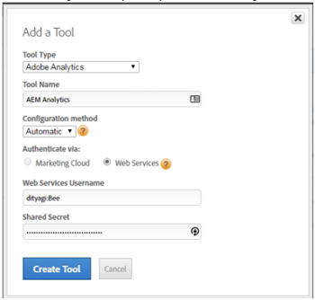

# Activación de Assets Insights a través de DTM {#enabling-asset-insights-through-dtm}

>[!CAUTION]
>
>AEM 6.4 ha llegado al final de la compatibilidad ampliada y esta documentación ya no se actualiza. Para obtener más información, consulte nuestra [períodos de asistencia técnica](https://helpx.adobe.com/es/support/programs/eol-matrix.html). Buscar las versiones compatibles [here](https://experienceleague.adobe.com/docs/).

Adobe Dynamic Tag Management es una herramienta que activa las herramientas de marketing digital. Se proporciona de forma gratuita a los clientes de Adobe Analytics. Puede personalizar el código de seguimiento para permitir que las soluciones de CMS de terceros utilicen Assets Insights o puede utilizar DTM para insertar etiquetas de Assets Insights. Las perspectivas solo se admiten y se proporcionan para imágenes.

>[!CAUTION]
>
>Adobe DTM está en desuso en favor de [!DNL Adobe Experience Platform] y pronto llegará [fin de vida útil](https://medium.com/launch-by-adobe/dtm-plans-for-a-sunset-3c6aab003a6f). Adobe recomienda que [use [!DNL Adobe Experience Platform] para información sobre recursos](https://experienceleague.adobe.com/docs/experience-manager-learn/assets/advanced/asset-insights-launch-tutorial.html).

Siga estos pasos para habilitar Assets Insights mediante DTM:

1. Toque o haga clic en el botón [!DNL Experience Manager] y vaya a **[!UICONTROL Herramientas]** > **[!UICONTROL Recursos]** > **[!UICONTROL Configuración de perspectivas]**.
1. [Configurar [!DNL Experience Manager] instancia con el Cloud Service de DTM](../sites-administering/dtm.md)

   El token de API debe estar disponible una vez que inicie sesión en [https://dtm.adobe.com](https://dtm.adobe.com/) y visita **[!UICONTROL Configuración de la cuenta]** del icono Perfil . Este paso no es necesario desde el punto de vista de Assets Insights, ya que la integración de [!DNL Experience Manager Sites] con Assets Insights aún está en funcionamiento.

1. Inicie sesión en [https://dtm.adobe.com](https://dtm.adobe.com/)y seleccione una empresa, según corresponda.
1. Crear/abrir una propiedad web existente

   * Seleccione el **[!UICONTROL Propiedades web]** y, a continuación, toque o haga clic en **[!UICONTROL Agregar propiedad]**.
   * Actualice los campos según corresponda y toque o haga clic en **[!UICONTROL Crear propiedad]** (consulte [documentación](https://helpx.adobe.com/experience-manager/using/dtm.html)).

   

1. En el **[!UICONTROL Reglas]** , seleccione **[!UICONTROL Reglas de carga de página]** en el panel de navegación y pulse o haga clic en **[!UICONTROL Crear nueva regla]**.

   

1. Expandir **[!UICONTROL Etiquetas Javascript/De Terceros]**. A continuación, toque o haga clic **[!UICONTROL Agregar nuevo script]** en el **[!UICONTROL HTML secuencial]** para abrir el cuadro de diálogo Script.

   

1. Toque o haga clic en el botón [!DNL Experience Manager] y vaya a **[!UICONTROL Herramientas > Assets]**.
1. Toque o haga clic **[!UICONTROL Rastreador de páginas de perspectivas]**, copie el código del rastreador y, a continuación, péguelo en el cuadro de diálogo Script que abrió en el paso 6. Guarde los cambios.

   >[!NOTE]
   >
   >* `AppMeasurement.js` se ha eliminado. Se espera que esté disponible a través de la herramienta Adobe Analytics de DTM.
   >* La llamada a `assetAnalytics.dispatcher.init()` se elimina. Se espera que se llame a la función una vez que la herramienta Adobe Analytics de DTM termine de cargarse.
   >* Según el lugar en el que esté alojado el rastreador de páginas de Assets Insights (por ejemplo, AEM, CDN, etc.), el origen de la secuencia de comandos puede requerir cambios.
   >* Para el rastreador de páginas alojado en AEM, el origen debe apuntar a una instancia de publicación utilizando el nombre de host de la instancia de Dispatcher.


1. Apertura [https://dtm.adobe.com](https://dtm.adobe.com). Haga clic en Información general en la propiedad web y haga clic en Agregar herramienta o abra una herramienta Adobe Analytics existente. Al crear la herramienta, puede establecer Método de configuración en Automático.

   

   Seleccione los grupos de informes Ensayo/Producción, según corresponda.

1. Expandir **[!UICONTROL Administración de biblioteca]** y asegúrese de que **[!UICONTROL Cargar biblioteca en]** está configurado como **[!UICONTROL Principio de página]**.

   

1. Expandir **[!UICONTROL Personalizar código de página]** y toque o haga clic en **[!UICONTROL Abrir editor]**.

   

1. Pegue el siguiente código en la ventana :

   ```java
   var sObj;
   
   if (arguments.length > 0) {
     sObj = arguments[0];
   } else {
     sObj = _satellite.getToolsByType('sc')[0].getS();
   }
   _satellite.notify('in assetAnalytics customInit');
   (function initializeAssetAnalytics() {
     if ((!!window.assetAnalytics) && (!!assetAnalytics.dispatcher)) {
       _satellite.notify('assetAnalytics ready');
       /** NOTE:
           Copy over the call to 'assetAnalytics.dispatcher.init()' from Assets Pagetracker
           Be mindful about changing the AppMeasurement object as retrieved above.
       */
       assetAnalytics.dispatcher.init(
             "",  /** RSID to send tracking-call to */
             "",  /** Tracking Server to send tracking-call to */
             "",  /** Visitor Namespace to send tracking-call to */
             "",  /** listVar to put comma-separated-list of Asset IDs for Asset Impression Events in tracking-call, e.g. 'listVar1' */
             "",  /** eVar to put Asset ID for Asset Click Events in, e.g. 'eVar3' */
             "",  /** event to include in tracking-calls for Asset Impression Events, e.g. 'event8' */
             "",  /** event to include in tracking-calls for Asset Click Events, e.g. 'event7' */
             sObj  /** [OPTIONAL] if the webpage already has an AppMeasurement object, please include the object here. If unspecified, Pagetracker Core shall create its own AppMeasurement object */
             );
       sObj.usePlugins = true;
       sObj.doPlugins = assetAnalytics.core.updateContextData;
       assetAnalytics.core.optimizedAssetInsights();
     }
     else {
       _satellite.notify('assetAnalytics not available. Consider updating the Custom Page Code', 4);
     }
   })();
   ```

   * La regla de carga de página en la DTM solo incluye el código pagetracker.js. Cualquiera `assetAnalytics` los campos se consideran anulaciones para los valores predeterminados. No son obligatorios de forma predeterminada.
   * El código llama a `assetAnalytics.dispatcher.init()` después de asegurarse de que `_satellite.getToolsByType('sc')[0].getS()` se inicializa y `assetAnalytics,dispatcher.init` está disponible. Por lo tanto, puede omitir agregarla en el paso 11.
   * Como se indica en los comentarios dentro del código Rastreador de páginas de perspectivas (**[!UICONTROL Herramientas > Assets > Rastreador de páginas de perspectivas]**), cuando el rastreador de páginas no crea un `AppMeasurement` , los tres primeros argumentos (RSID, Servidor de seguimiento y Espacio de nombres de visitante) son irrelevantes. Se pasan cadenas vacías en su lugar para resaltarlo.

      Los argumentos restantes corresponden a lo que está configurado en la página Configuración de perspectivas (**[!UICONTROL Herramientas > Assets > Configuración de perspectivas]**).

   * El objeto AppMeasurement se recupera consultando `satelliteLib` para todos los motores de SiteCatalyst disponibles. Si hay varias etiquetas configuradas, cambie el índice del selector de matriz de la forma adecuada. Las entradas de la matriz se ordenan según las herramientas de SiteCatalyst disponibles en la interfaz de DTM.

1. Guarde y cierre la ventana Editor de código y, a continuación, guarde los cambios en la configuración de la herramienta.
1. En el **[!UICONTROL Aprobaciones]** apruebe ambas aprobaciones pendientes. La etiqueta DTM está lista para su inserción en la página web. Para obtener más información sobre cómo insertar etiquetas de DTM en páginas web, consulte la página archivada acerca de [integración de DTM en plantillas de página personalizadas](https://web.archive.org/web/20180816221834/https://blogs.adobe.com/experiencedelivers/experience-management/integrating-dtm-custom-aem6-page-template).
