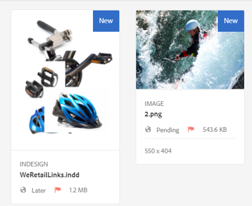

# Mejoras de la experiencia del usuario en los recursos {#user-experience-enhancements-in-assets}

AEM 6.4 Assets incluye varias mejoras de uso que proporcionan una experiencia de usuario sin problemas y mejoran la productividad. El aumento en la velocidad con la que puede crear/administrar su contenido de lanzamiento al mercado mejora la velocidad de contenido del negocio.

La interfaz es más receptiva, lo que le ayuda a administrar de forma eficaz una gran cartera de activos. Puede buscar, mostrar, ordenar y desplazar rápidamente una larga lista de elementos.

Puede personalizar las distintas vistas: vistas de tarjetas, Listas y columnas. Por ejemplo, puede configurar el tamaño de las miniaturas que desea que se muestren en la vista de tarjetas. Para la vista de Lista, puede configurar el nivel de detalle que desea mostrar para los recursos de la lista. AEM 6.4 Assets incluye una nueva vista de árbol que le permite navegar cómodamente por el repositorio de recursos y encontrar los recursos.

## Carga diferida {#lazy-loading}

Al buscar recursos en Recursos AEM 6.4, se muestran hasta 200 recursos a la vez. Puede desplazarse por los resultados más rápido, lo que resulta especialmente útil cuando explora una larga lista de resultados. Dado que un número significativo de recursos se cargan a la vez, la experiencia de navegación es fluida.

Si toca o hace clic en un recurso para revisar su página de detalles, puede volver a la página de resultados simplemente tocando o haciendo clic en el botón Atrás de la barra de herramientas.

## Mejoras en la vista de tarjetas {#card-view-improvements}

Según el dispositivo que utilice y la cantidad de detalles que necesite, puede cambiar el tamaño de las miniaturas de los recursos en la vista de tarjetas. De este modo, puede personalizar su vista y controlar el número de miniaturas que se muestran.

Para cambiar el tamaño de las miniaturas en la vista de tarjetas, lleve a cabo estos pasos:

1. Toque o haga clic en el icono Diseño de la barra de herramientas y, a continuación, elija la opción Configuración **[!UICONTROL de]** Vista.

   

1. En el cuadro de diálogo Configuración **[!UICONTROL de]** Vista, seleccione el tamaño de miniatura deseado y, a continuación, toque o haga clic en **[!UICONTROL Actualizar]**.

   

1. Revise las miniaturas que se muestran en el tamaño seleccionado.

   

El mosaico de la vista de tarjetas ahora muestra información adicional, como el estado de publicación.

## Mejoras en la vista de Listas {#list-view-improvements}

En la vista de Lista, la primera columna ahora muestra los nombres de archivo de los recursos de forma predeterminada. También se muestra información adicional, como el estado de publicación y procesamiento y la configuración regional.

Puede configurar la cantidad de detalles que desea mostrar. Toque o haga clic en el icono Diseño, elija la opción Configuración **[!UICONTROL de]** Vista y especifique las columnas que desea que se muestren en el cuadro de diálogo Configuración **[!UICONTROL de]** Vista.

## Mejoras en la vista de columnas {#column-view-improvements}

Además de las vistas de tarjetas y Listas, ahora puede desplazarse a la página de detalles de un recurso desde la vista Columna. Seleccione un recurso en la vista Columna y, a continuación, toque o haga clic en **[!UICONTROL Más detalles]** en la instantánea del recurso.

## vista de árbol {#tree-view}

Recursos AEM 6.4 incluye una vista de árbol que le permite explorar cómodamente la jerarquía de recursos y desplazarse hasta el recurso o la carpeta que desee.

Para abrir la vista de árbol, toque o haga clic en el icono de GlobalNav en el `Assets UI`menú y elija el árbol **** de contenido en el menú.

Desde la jerarquía de contenido, desplácese hasta el recurso deseado.

## Navegación por los detalles de recursos {#navigating-asset-details}

La página de detalles del recurso ahora incluye los botones Anterior y Siguiente en la barra de herramientas para que pueda vista sucesivas de todas las imágenes de una carpeta.

En función del dispositivo, también puede realizar un barrido o utilizar las teclas de flecha del teclado para moverse entre las imágenes.

Según el diseño seleccionado, puede abrir la página de detalles de un recurso de las siguientes formas:

| **Ver** | **Cómo abrir la página de detalles de recursos** |
|---|---|
| [!UICONTROL Vista de tarjeta] | Toque o haga clic en el mosaico del recurso. |
| [!UICONTROL Vista de lista  ] | Toque o haga clic en la entrada de fila del recurso en la lista. |
| [!UICONTROL Vista de columna] | Toque o haga clic en el botón **[!UICONTROL Más detalles]** de la instantánea del recurso. |

Utilice los botones Anterior/Siguiente para desplazarse hacia adelante y hacia atrás entre los recursos.

