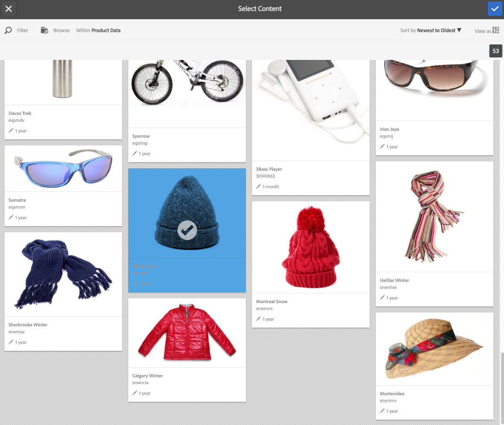

# Trabajar con selectores {#working-with-selectors}

>[!CAUTION]
>
>AEM 6.4 ha llegado al final de la compatibilidad ampliada y esta documentación ya no se actualiza. Para obtener más información, consulte nuestra [períodos de asistencia técnica](https://helpx.adobe.com/es/support/programs/eol-matrix.html). Buscar las versiones compatibles [here](https://experienceleague.adobe.com/docs/).

Al trabajar con una imagen interactiva, un vídeo interactivo o un titular de carrusel, se seleccionan los recursos y los sitios y productos para las zonas interactivas y los mapas de imágenes a los que se va a vincular. Al trabajar con conjuntos de imágenes, conjuntos de giros y conjuntos multimedia, también puede seleccionar recursos con el Selector de recursos.

En este tema se explica cómo utilizar los selectores de producto, sitio y recurso, incluida la capacidad de examinar, filtrar y ordenar dentro de los selectores.

Puede acceder a los selectores al crear conjuntos de carrusel, agregar zonas interactivas y mapas de imágenes, crear vídeos e imágenes interactivos.

Por ejemplo, en este titular de carrusel, utilice el selector de productos si está vinculando un punto interactivo o un mapa de imagen a una página de vista rápida; utilice el selector de sitio si está vinculando un punto interactivo o un mapa de imagen a un hipervínculo; utilice el selector de recursos cuando esté creando una diapositiva nueva.

Cuando selecciona (en lugar de introducir manualmente) a dónde se dirigen los puntos interactivos o los mapas de imagen, está utilizando el selector. El selector de sitio solo funciona si es cliente de AEM Sites. El selector de productos también requiere AEM comercio.

## Selección de productos {#selecting-products}

Utilice el selector de productos para elegir un producto cuando desee que un punto interactivo o un mapa de imagen proporcionen una vista rápida a un producto específico de su catálogo de productos.

1. Vaya al conjunto de carrusel, la imagen interactiva o el vídeo interactivo y pulse la pestaña **[!UICONTROL Acciones]** (solo disponible si ha definido un punto interactivo o un mapa de imagen).

   El selector de productos se encuentra en la variable **[!UICONTROL Tipo de acción]** .

   

1. Toque . **[!UICONTROL Selector de productos]** (lupa) y vaya a un producto del catálogo.

   

   También puede filtrar por palabra clave o etiqueta tocando **[!UICONTROL Filtro]** e introduciendo palabras clave, o seleccionando etiquetas, o ambas.

   

   Puede cambiar el lugar donde AEM exploran los datos del producto tocando **[!UICONTROL Examinar]** y navegando a otra carpeta.

   

   Toque **[!UICONTROL Ordenar]** por para cambiar si los AEM se ordenan de más reciente a más antiguo o de más antiguo a más reciente.

   

   Puntee en **[!UICONTROL Ver como]** para cambiar la forma en que ve los productos, ya sea en **[!UICONTROL Vista de lista]** o en **[!UICONTROL Vista de tarjeta]**.

   

1. Una vez seleccionado el producto, el campo se rellena con la miniatura y el nombre del producto.

   

1. Cuando **[!UICONTROL Vista previa]** , puede tocar la zona interactiva o el mapa de imagen y ver el aspecto de la vista rápida.

   

## Selección de sitios {#selecting-sites}

Utilice el selector del sitio para elegir una página web cuando desee que un punto interactivo o mapa de imagen vincule a una página web que se administra dentro de AEM sitios.

1. Vaya al conjunto de carrusel, la imagen interactiva o el vídeo interactivo y pulse la pestaña **[!UICONTROL Acciones]** (solo disponible si ha definido un punto interactivo o un mapa de imagen).

   El Selector de sitio se encuentra en el área **[!UICONTROL Tipo de acción]**.

   

1. Pulse el icono **[!UICONTROL Selector de sitio]** (carpeta con lupa) y navegue a una página de AEM Sites a la que desee vincular el punto interactivo o el mapa de imagen.

   

1. Una vez seleccionado el sitio, el campo se rellena con la ruta.

   

1. Cuando **[!UICONTROL Vista previa]** Si toca la zona interactiva o el mapa de imagen, navegará hasta la página del sitio AEM que especificó.

## Selección de recursos {#selecting-assets}

Utilice este selector para elegir imágenes que se utilizarán en un titular de carrusel, un vídeo interactivo, conjuntos de imágenes, conjuntos de medios mixtos y conjuntos de giros. En vídeo interactivo, el selector de recursos está disponible al pulsar **[!UICONTROL Seleccionar recursos]** en el **[!UICONTROL Contenido]** pestaña . En Conjuntos de carrusel, el selector de recursos está disponible al crear una nueva diapositiva. En Conjuntos de imágenes, Conjuntos de medios mixtos y Conjuntos de giros, el selector de recursos está disponible al crear un nuevo conjunto de imágenes, conjunto de medios mixtos o conjunto de giros, respectivamente.

Consulte también [Selector de recursos](asset-selector.md) para obtener más información.

1. Vaya al conjunto de carrusel y cree una nueva diapositiva. O bien, vaya al vídeo interactivo, vaya a la **[!UICONTROL Contenido]** y seleccione recursos. O bien, cree un conjunto de medios mixtos, un conjunto de imágenes o un conjunto de giros.
1. Pulse el icono **[!UICONTROL Selector de recursos]** (carpeta con lupa) y navegue hasta un recurso.

   

   También puede filtrar por palabra clave o etiqueta tocando **[!UICONTROL Filtro]** e introduciendo palabras clave, o agregando criterios, o ambas cosas.

   

   Puede cambiar el lugar en el que AEM explorar los recursos navegando a otra carpeta en la **[!UICONTROL Ruta]** campo .

   Toque **[!UICONTROL Colección]** para buscar solo recursos dentro de colecciones.

   

   Pulse **[!UICONTROL Ver como]** para cambiar la forma en que ve los productos: **[!UICONTROL vista de lista]**, **[!UICONTROL vista de columna]** o **[!UICONTROL vista de tarjeta]**.

   

1. Pulse la marca de verificación para seleccionar el recurso. Se muestra el recurso.

   
