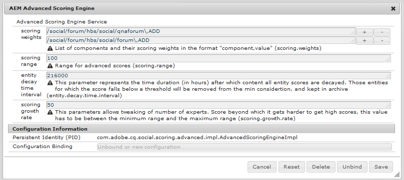

# Puntuación avanzada y distintivos {#advanced-scoring-and-badges}

## Información general {#overview}

La puntuación avanzada permite la concesión de insignias para identificar a los miembros como expertos. La puntuación avanzada asigna puntos en función de la calidad de cantidad *y* del contenido creado por un miembro, mientras que la puntuación básica asigna puntos simplemente en función de la cantidad de contenido creado.

Esta diferencia se debe al motor de puntuación utilizado para calcular las puntuaciones. El motor de puntuación básico aplica matemáticas sencillas. El motor de puntuación avanzado es un algoritmo adaptable que recompensa a los miembros activos que contribuyen con contenido valioso y relevante, deducido a través del procesamiento del lenguaje natural (PNL) de un tema.

Además de la relevancia del contenido, los algoritmos de puntuación tienen en cuenta las actividades de los miembros, como la votación y el porcentaje de respuestas. Aunque la puntuación básica los incluye cuantitativamente, la puntuación avanzada los utiliza algorítmicamente.

Por lo tanto, el motor de puntuación avanzado requiere datos suficientes para que la análisis tenga sentido. El umbral de logro para convertirse en un experto se reevalúa constantemente a medida que el algoritmo se ajusta continuamente al volumen y la calidad del contenido creado. También existe un concepto de *decadencia* de las publicaciones anteriores de un miembro. Si un miembro experto deja de participar en el asunto en el que obtuvo la condición de experto, en algún punto predeterminado (véase [configuración del motor de puntuación](#configurable-scoring-engine)) podría perder su condición de experto.

Configurar la puntuación avanzada es prácticamente lo mismo que la puntuación básica:

* Las reglas de puntuación y de identificación básicas y avanzadas se [aplican al contenido](implementing-scoring.md#apply-rules-to-content) de la misma manera
   * Las reglas de puntuación y de identificación básicas y avanzadas pueden aplicarse al mismo contenido
* [Habilitar distintivos para ](implementing-scoring.md#enable-badges-for-component) componentes genéricos

Las diferencias en la configuración de las reglas de puntuación y de identificación son:

* Motor de puntuación avanzado configurable
* Reglas de puntuación avanzadas:
   * `scoringType` configurado en  **[!UICONTROL avanzado]**
   * Requiere palabras clave

* Reglas de distintivo avanzadas:
   * `badgingType` configurado en  **[!UICONTROL avanzado]**
   * `badgingLevels` se establece en el número de niveles de expertos que se adjudicarán
   * Requiere una matriz `badgingPaths` de distintivos en lugar de umbrales de asignación de arreglos de discos a los distintivos

>[!NOTE]
>
>Para utilizar las capacidades avanzadas de puntuación e identificación, instale el [paquete de identificación de expertos](https://www.adobeaemcloud.com/content/marketplace/marketplaceProxy.html?packagePath=/content/companies/public/adobe/packages/cq640/social/cq-social-expert-identification-pkg).

## Motor de puntuación configurable {#configurable-scoring-engine}

El motor de puntuación avanzado proporciona una configuración OSGi con parámetros que afectan al algoritmo de puntuación avanzado.

* **[!UICONTROL Puntuación de]**
ponderacionesPara un tema, especifique el verbo al que se debe dar la prioridad más alta al calcular la puntuación. Se pueden escribir uno o más temas, pero limitados a **un verbo por tema**. Consulte [Temas y verbos](implementing-scoring.md#topics-and-verbs).

   Se introduce como `topic,verb` con la coma de escape. Por ejemplo:

   `/social/forum/hbs/social/forum\,ADD`

   El valor predeterminado se establece en el verbo AÑADIR para los componentes QnA y forum.

* **[!UICONTROL Rango de puntuación]**

   El rango de las puntuaciones avanzadas se define por este valor (puntuación máxima posible) y 0 (puntuación más baja posible).

   El valor predeterminado es 100, por lo que el intervalo de puntuación es 0-100.

* **[!UICONTROL Intervalo de tiempo de decadencia de entidad]**

   Este parámetro representa el número de horas después de las cuales todas las puntuaciones de entidad están desactivadas. Esto es necesario para no incluir contenido antiguo en las puntuaciones de un sitio de comunidad.

   El valor predeterminado es 216000 horas (~24 años).

* **[!UICONTROL Tasa de crecimiento de puntaje]**

   Esto especifica la puntuación. entre 0 y el rango de puntuación, más allá del cual el crecimiento se desacelera para limitar el número de expertos.

   El valor predeterminado es 50.

## Reglas de puntuación avanzadas {#advanced-scoring-rules}

En la puntuación básica, se conoce la cantidad necesaria para obtener una insignia.

En la puntuación avanzada, la cantidad necesaria se ajusta constantemente en función de la cantidad de datos de calidad dentro del sistema. La puntuación se calcula continuamente de forma similar a una curva de campana.

Si un miembro obtuvo una insignia de experto en un tema que ya no está activo, existe la posibilidad de que pierda su insignia debido a la decadencia a lo largo del tiempo.

### ScoringType {#scoringtype}

Una regla de puntuación es un conjunto de subreglas de puntuación, cada una de las cuales declara el `scoringType`.

Para invocar el motor de puntuación avanzado, el `scoringType`debe establecerse en `advanced`.

Consulte [Subreglas de puntuación](implementing-scoring.md#scoring-sub-rules).

### Palabras clave {#stopwords}

El paquete de puntuación avanzada instala una carpeta de configuración que contiene un archivo de palabras clave:

* `/etc/community/scoring/configuration/stopwords`

El algoritmo de puntuación avanzada utiliza la lista de palabras contenidas en el archivo de palabras clave para identificar las palabras comunes en inglés que se omiten durante el procesamiento del contenido.

No se espera que este archivo se modifique.

Si falta el archivo de palabras clave, el motor de puntuación avanzado generará un error.

## Reglas de distintivo avanzadas {#advanced-badging-rules}

Las propiedades avanzadas de la regla de identificación difieren de las [propiedades básicas de la regla de identificación](implementing-scoring.md#badging-rules).

En lugar de asociar puntos con una imagen de insignia, solo es necesario identificar el número de expertos permitidos y la imagen de insignia que se va a otorgar.

| **Propiedad** | **Tipo** | **Descripción del valor** |
|---------------|----------|--------------------------------------------------------------------------------------------------------------------------------------------------------------------------------------------------------------------------------------------------------------------------------------------------------------------------------------------------------------------------------|
| badgingPath | Cadena[] | (Requerido) Una cadena de varios valores de imágenes de distintivo hasta el número de badgingLevels. Las rutas de imagen de la insignia deben solicitarse para que la primera se conceda al experto más alto. Si hay menos distintivos de los indicados por badgingLevels, el último distintivo de la matriz rellena el resto de la matriz. Ejemplo de entrada:/etc/community/badging/images/Expert-badge/jcr:content/expert.png |
| badgingLevels | Largo | (Opcional) Especifica los niveles de experiencia que se van a otorgar. Por ejemplo, si debe haber un experto y un experto casi (dos insignias), el valor debe establecerse en 2. El badgingLevel debe coincidir con el número de imágenes de distintivo relacionadas con expertos que se muestran para la propiedad badgingPath. El valor predeterminado es 1. |
| badgingType | Cadena | (Requerido) Identifica el motor de puntuación como &quot;básico&quot; o &quot;avanzado&quot;. Establecido en &quot;avanzado&quot;, de lo contrario el valor predeterminado es &quot;básico&quot;. |
| scoringRules | Cadena[] | (Opcional) Una cadena de varios valores para restringir la regla de identificación a los eventos de puntuación identificados por las reglas de puntuación enumeradas.Ejemplo de entrada:/etc/community/scoring/rules/adv-comments-scoringDefault no es una restricción. |

## Reglas y distintivo incluidos {#included-rules-and-badge}

### Distintivo incluido {#included-badge}

En esta versión beta se incluye una insignia de experto basada en premios:

* experto

   `/etc/community/badging/images/expert-badge/jcr:content/expert.png`

Para que la insignia de experto aparezca como una recompensa por la actividad, hay dos cosas que deben suceder:

* `badges` debe estar habilitado para la función, como un foro o un componente QnA
* las reglas avanzadas de puntuación y marca deben aplicarse a la página (o antecesor) en la que se coloca el componente

Consulte la información básica para:

* [Activación de la marca para un componente](implementing-scoring.md#enable-badges-for-component)
* [Aplicación de reglas](implementing-scoring.md#apply-rules-to-content)

### Se incluyeron reglas de puntuación y subreglas {#included-scoring-rules-and-sub-rules}

La versión beta incluye dos reglas de puntuación avanzadas para la [función de foro](functions.md#forum-function) (una para los componentes de foro y comentarios de la función de foro):

1. /etc/community/scoring/rules/adv-comments-scoring

   * `subRules[]` =

      /etc/community/scoring/rules/sub-rules/adv-comments-rule

      /etc/community/scoring/rules/sub-rules/adv-vote-rule-owner

      /etc/community/scoring/rules/sub-rules/adv-vote-rule

2. /etc/community/scoring/rules/adv-forums-scoring

   * `subRules[]` =

      /etc/community/scoring/rules/sub-rules/adv-forums-rule

      /etc/community/scoring/rules/sub-rules/adv-comments-rule

      /etc/community/scoring/rules/sub-rules/adv-vote-rule-owner

**Notas:**

* Los nodos `rules`y `sub-rules` son de tipo `cq:Page`
* `subRules` es un atributo de tipo [] Cadena en el  `jcr:content` nodo de la regla
* `sub-rules` pueden compartirse entre varias reglas de puntuación
* `rules` debe ubicarse en una ubicación de repositorio con permiso de lectura para todos
   * los nombres de las reglas deben ser únicos independientemente de la ubicación

### Reglas de identificación incluidas {#included-badging-rules}

En la versión se incluyen dos reglas de identificación avanzadas que corresponden a los [foros avanzados y a las reglas de puntuación de comentarios](#included-scoring-rules-and-sub-rules).

* /etc/community/badging/rules/adv-comments-badging
* /etc/community/badging/rules/adv-forums-badging

**Notas:**

* `rules` los nodos son de tipo  `cq:Page`
* `rules`debe ubicarse en una ubicación de repositorio con permiso de lectura para todos
   * los nombres de las reglas deben ser únicos independientemente de la ubicación
