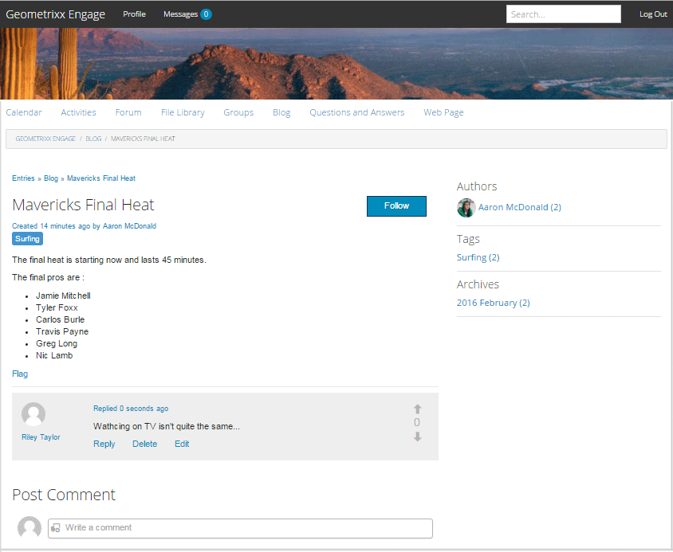

# Función del blog {#blog-feature}

>[!CAUTION]
>
>AEM 6.4 ha llegado al final de la compatibilidad ampliada y esta documentación ya no se actualiza. Para obtener más información, consulte nuestra [períodos de asistencia técnica](https://helpx.adobe.com/es/support/programs/eol-matrix.html). Buscar las versiones compatibles [here](https://experienceleague.adobe.com/docs/).

## Introducción {#introduction}

La función de blog de AEM Communities se ha transformado de una actividad de creación a una verdadera actividad de comunidad que se lleva a cabo en el entorno de publicación.

La función de blog permite proporcionar información de la comunidad en formato de diario. Las entradas de blog las realizan los miembros autorizados en el entorno de publicación (registrados, usuarios con sesión iniciada).

La función de blog proporciona:

* Creación en el lado de publicación de artículos de blog y comentarios
* Edición de texto enriquecido
* Imágenes en línea (con compatibilidad para arrastrar y soltar)
* Contenido incrustado de redes sociales ([Compatibilidad con oEmbed](blog-developer-basics.md#allowing-rich-media))
* Modo borrador
* Publicación programada
* Componer en nombre (a [miembro privilegiado](users.md#privileged-members-group) puede crear contenido en nombre de otro miembro de la comunidad)
* [Moderación en contexto y masiva](moderate-ugc.md) de artículos de blog y comentarios

Esta sección de la documentación describe

* Adición de la función de blog a un sitio AEM
* Ajustes de configuración para componentes de blog

>[!NOTE]
>
>Los componentes `Journal`y `Journal Sidebar` tienen título `Blog` y `Blog Sidebar`.
>
>La función de blog que se encuentra en AEM 6.0 y versiones anteriores ya se ha eliminado. Se basaba en una plantilla y solo permitía a los autores crear contenido en el entorno de creación.

## Adición de componentes de blog a una página {#adding-blog-components-to-a-page}

Si desea añadir un blog a una página en modo de autor, utilice el navegador de componentes para localizar

* `Communities / Blog`
* `Communities / Blog Sidebar`

Y arrástrelos a su lugar en una página donde el blog debería aparecer.

Para obtener la información necesaria, visite [Conceptos básicos de los componentes de Communities](basics.md).

Cuando la variable [bibliotecas requeridas del lado del cliente](blog-developer-basics.md#essentials-for-client-side) se incluyen, así es como se muestra la variable `Blog`aparecerá el componente:

Y cómo `Blog Sidebar` aparecerán:

### Configuración del blog {#configuring-blog}

Seleccione la colocación `Blog` para acceder y seleccionar el componente `Configure` que abre el cuadro de diálogo de edición.

 

#### Ficha Configuración {#settings-tab}

En el **[!UICONTROL Configuración]** especifique las características básicas del blog:

* **[!UICONTROL Permitir miniatura de datos adjuntos]**
Si se selecciona, se crea una miniatura de la imagen adjunta.

* **[!UICONTROL Adjuntar tamaño máximo de miniaturas]**
Tamaño máximo (en píxeles) de la imagen en miniatura del archivo adjunto. El valor predeterminado es 800 x 800.

* **[!UICONTROL Tamaño mínimo de la imagen para la miniatura]**
Tamaño mínimo (en bytes) de la imagen para generar miniaturas para imágenes en línea. El valor predeterminado es 100000 bytes (100 kb).

* **[!UICONTROL Tamaño máximo de miniatura]**
Tamaño máximo (en píxeles) de la imagen en miniatura para la imagen en línea. El valor predeterminado es 800 x 800.

* **[!UICONTROL Permitir miembros privilegiados]**
Si está marcada esta opción, solo los miembros privilegiados pueden crear contenido.

* **[!UICONTROL Miembros privilegiados permitidos]**
Añada los miembros privilegiados a los que se permite crear contenido.

* **[!UICONTROL Bloquear contenido generado por el usuario en modo de edición de autor]**
Si está habilitado, bloquea el contenido generado por el usuario mientras edita en modo Autor.

* **[!UICONTROL Título del diario]**
El título del blog que se mostrará en la página.
   >Nota:
   >El Título de diario se utiliza para crear automáticamente la URL para el blog. Se utilizan un máximo de 50 caracteres (con 5 caracteres adicionales para la exclusividad) del título del diario que especifique aquí para crear una URL para el blog.

* **[!UICONTROL Descripción del diario]**
La descripción del blog.

* **[!UICONTROL Temas por página]**

   Define el número de entradas/comentarios de blog que se muestran por página. El valor predeterminado es 10.

* **[!UICONTROL Moderado]**

   Si se selecciona, la publicación de entradas y comentarios de blog debe aprobarse antes de que aparezcan en un sitio de publicación. El valor predeterminado no está seleccionado.

* **[!UICONTROL Cerrado]**

   Si se selecciona, el blog está cerrado a nuevas entradas y comentarios de blog. El valor predeterminado no está seleccionado.

* **[!UICONTROL Editor de texto enriquecido]**

   Si se selecciona, las entradas de blog y los comentarios pueden introducirse con marcado. El valor predeterminado está marcado.

* **[!UICONTROL Permitir etiquetado]**

   Si está activada, permita que los miembros agreguen etiquetas a su publicación (consulte **[!UICONTROL Campo de etiqueta]** ). El valor predeterminado no está seleccionado.

* **[!UICONTROL Permitir cargas de archivos]**

   Si está activada, permita que los archivos adjuntos se agreguen a una entrada de blog o a un comentario. El valor predeterminado no está seleccionado.

* **[!UICONTROL Tamaño máximo de archivo]**

   Solo relevante si `Allow File Uploads` está activada. Este campo limita el tamaño (en bytes) de un archivo cargado. El valor predeterminado es 104857600 (10 Mb).

* **[!UICONTROL Tipos de archivo permitidos]**

   Solo relevante si `Allow File Uploads` está activada. Lista de extensiones de archivo separados por coma con el separador &quot;punto&quot;. Por ejemplo: .jpg, .jpeg, .png, .doc, .docx, .pdf. Si se especifica algún tipo de archivo, no se permitirá cargar aquellos que no se especifiquen. El valor predeterminado no se especifica de forma que se permitan todos los tipos de archivo.

* **[!UICONTROL Tamaño máximo de archivo de imagen adjunto]**

   Solo es relevante si está marcada la opción Permitir cargas de archivos . Número máximo de bytes que puede tener un archivo de imagen cargado. El valor predeterminado es 2097152 (2 Mb).

* **[!UICONTROL Permitir respuestas]**

   Si está marcada esta opción, permita que se respondan a los comentarios publicados en la entrada de blog. El valor predeterminado no está seleccionado.

* **[!UICONTROL Permitir que los usuarios eliminen comentarios y temas]**

   Si está marcada esta opción, permita que los miembros eliminen los comentarios y las entradas de blog que publicaron. El valor predeterminado no está seleccionado.

* **[!UICONTROL Permitir seguimiento]**

   Si está marcada esta opción, incluya la siguiente característica para artículos de blog, que permite que los miembros sean [notificadas](notifications.md) de nuevos puestos. El valor predeterminado no está seleccionado.

* **[!UICONTROL Permitir suscripciones por correo electrónico]**

   Si está activada, permita que se notifique a los miembros de los anuncios nuevos por correo electrónico ([suscripción](subscriptions.md)). Requiere `Allow Following` que se comprobarán y [correo electrónico configurado](email.md). El valor predeterminado no está seleccionado.

* **[!UICONTROL Habilitar la votación]**

   Si está marcada esta opción, incluya la característica Votación con una entrada de blog. El valor predeterminado no está seleccionado.

* **[!UICONTROL Mostrar insignias]**

   Si está activada, muestre ganado y asignado [distintivos](implementing-scoring.md) con la entrada de blog de un miembro. El valor predeterminado no está seleccionado.

* **[!UICONTROL Permitir contenido destacado]**

   si se selecciona, la idea puede identificarse como [contenido destacado](featured.md). El valor predeterminado no está seleccionado.

#### Pestaña Moderación del usuario {#user-moderation-tab}

En el **[!UICONTROL Moderación del usuario]** especifique la configuración de moderación:

* **[!UICONTROL Denegar entradas]**

   Si se selecciona, se permitirá a los moderadores miembros de confianza denegar publicaciones e impedir que la publicación aparezca en el foro público. El valor predeterminado no está seleccionado.

* **[!UICONTROL Cerrar/abrir de nuevo los temas]**

   Si se selecciona, los moderadores miembros de confianza pueden cerrar un tema para realizar más ediciones y comentarios, y también pueden volver a abrir un tema. El valor predeterminado no está seleccionado.

* **[!UICONTROL Marcar entradas]**

   Si se selecciona, permita a los miembros marcar como inapropiados los temas o comentarios de otros. El valor predeterminado no está seleccionado.

* **[!UICONTROL Lista de motivos de indicación]**

   Si está marcada esta opción, permita que los miembros elijan, desde una lista desplegable, el motivo por el que marcan un tema o comentario como inapropiado. El valor predeterminado no está seleccionado.

* **[!UICONTROL Motivo de indicación personalizado]**

   Si está activada, permita que los miembros especifiquen su propio motivo para marcar un tema o comentario como inapropiado. El valor predeterminado no está seleccionado.

* **[!UICONTROL Umbral de moderación]**

   Introduzca el número de veces que los miembros deben marcar un tema o comentario antes de que se notifique a los moderadores. El valor predeterminado es 1 ( una vez).

* **[!UICONTROL Límite de indicación]**

   Introduzca el número de veces que se debe marcar un tema o comentario antes de ocultarlo de la vista pública. Si se establece en -1, el tema o comentario marcado nunca se oculta a la vista del público. De lo contrario, este número debe ser bueno o igual al umbral de moderación. El valor predeterminado es 5.

#### Ficha Campo de etiqueta {#tag-field-tab}

En el **[!UICONTROL Campo de etiqueta]** , especifique qué etiquetas se pueden aplicar si **[!UICONTROL Permitir etiquetado]** activa la variable **[!UICONTROL Configuración]** pestaña:

* **[!UICONTROL Espacios de nombres permitidos]**

   Pertinente si `Allow Tagging` se marca en la sección **[!UICONTROL Configuración]** pestaña . Las etiquetas que se pueden aplicar se limitan a las que están dentro de las categorías de espacio de nombres seleccionadas. La lista de áreas de nombres incluye &quot;Etiquetas estándar&quot; (el espacio de nombres predeterminado) así como &quot;Incluir todas las etiquetas&quot;. El valor predeterminado es ninguno activado, lo que significa que se permiten todas las áreas de nombres.

* **[!UICONTROL Límite de sugerencias]**

   Introduzca el número de etiquetas que se mostrarán como una sugerencia para el usuario que publica en el foro. Un valor de -1 significa que no hay límites. El valor predeterminado es 0.

### Configuración de la barra lateral del blog {#configuring-blog-sidebar}

Cuando haga doble clic en el botón `Blog Sidebar` , se abre un cuadro de diálogo de edición.

En el **[!UICONTROL Configuración de la barra lateral del diario]** especifique el formato de fecha para los archivos y qué tipo de entradas mostrar en la barra lateral:

* **[!UICONTROL Formato de fecha]**

   Formato utilizado para mostrar archivos de entradas de blog. El formato utiliza marcadores de posición siguiendo la convención Java.

   * yyyy: año completo, como &quot;2015&quot;
   * yy: año corto, como &quot;15&quot;
   * MMMM: mes completo, como junio
   * MMM: mes corto, como Jun
   * MM: número de mes, como 06

   El valor predeterminado es &quot;aaaa MMMMM&quot;, que se mostraría, por ejemplo, &quot;2015 de junio&quot;

* **[!UICONTROL Tipo de vista]**

   Título y tipo de entradas de blog que se mostrarán en la barra lateral. La elección es entre

   * Autores
   * Categorías
   * Archivos

* **[!UICONTROL Ruta del componente del diario]**

   *(Opcional)* La ubicación del recurso de blog desde el que se van a listar los artículos de blog. Si se deja en blanco, usará el componente de resourceType `social/journal/components/hbs/journal` que aparece en la misma página.

   * Por ejemplo, `/content/sites/engage/en/blog/jcr:content/content/primary/blog`. 

* **[!UICONTROL Límite de sugerencias]**

   Número de artículos de blog que se van a mostrar. Un valor de -1 significa que no hay límite. El valor predeterminado es -1.

## Experiencia del visitante del sitio {#site-visitor-experience}

En el entorno de publicación, la función de blog mostrará el artículo de blog más reciente seguido de artículos de blog más antiguos en orden descendente de creación. Las barras laterales de blog permiten a los visitantes del sitio aplicar filtros para limitar la selección de artículos de blog mostrados.

El artículo del blog va seguido de un enlace para publicar o ver comentarios.

Cuando se selecciona un artículo de blog, se muestran el artículo del blog y los comentarios (si está activado).

Otras capacidades dependen de si el visitante del sitio es moderador, administrador, miembro de la comunidad, miembro privilegiado o anónimo.

### Trabajo con artículos {#working-with-articles}

Al crear un nuevo artículo de blog, existe la opción de

1. Publicar inmediatamente
1. Publicar un borrador
1. Publicar en una fecha y hora programadas

Los artículos del blog aparecerán en la ficha adecuada (Publicados, Borradores o Programados) a los miembros que puedan crear en la publicación.

#### Moderadores y administradores {#moderators-and-administrators}

Cuando el usuario que ha iniciado sesión tiene privilegios de moderador o administrador, puede realizar [tareas de moderación](moderate-ugc.md) (como lo permite la configuración del componente) en todos los artículos de blog y comentarios publicados en un blog.

### Miembros {#members}

Cuando el usuario que ha iniciado sesión es un miembro de la comunidad o [miembro privilegiado](users.md#privileged-members-group) (según la configuración), pueden seleccionar `New Article` para crear y publicar un nuevo artículo de blog.

Concretamente, podrán:

* Crear un nuevo artículo de blog
* Publicar un nuevo artículo de blog en nombre de otro miembro
* Publicar un comentario en un artículo de blog
* Editar su propio artículo o comentario en su blog
* Elimine su propio artículo o comentario de blog
* Marcar los artículos o comentarios de otros blogs

 

### Anónimo {#anonymous}

Los visitantes del sitio que no hayan iniciado sesión solo podrán leer los artículos publicados del blog y los comentarios, traducirlos si son compatibles, pero no pueden agregar un artículo o comentario del blog ni marcar los artículos o comentarios de otros.

## Información adicional {#additional-information}

Puede encontrar más información en la [Elementos esenciales del blog](blog-developer-basics.md) para desarrolladores.

Para moderar las entradas y comentarios del blog, consulte [Moderación del contenido generado por el usuario](moderate-ugc.md).

Para etiquetar entradas y comentarios de blog, consulte [Etiquetado del contenido generado por el usuario](tag-ugc.md).

Para la traducción de entradas y comentarios de blog, consulte [Traducción del contenido generado por el usuario](translate-ugc.md).
