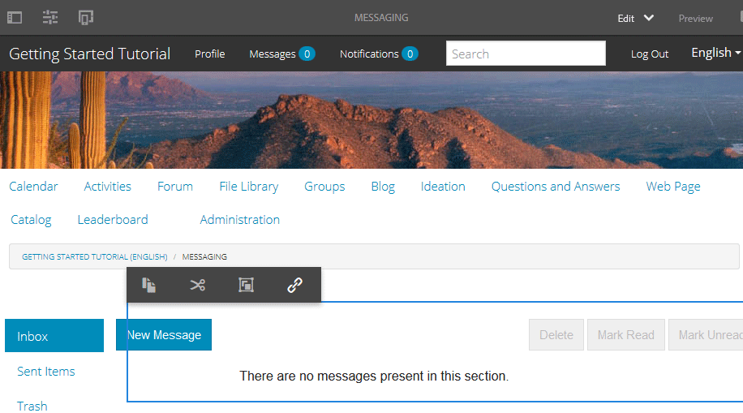

# Función de mensajería {#messaging-feature}

Además de las interacciones públicamente visibles que se producen en los foros y comentarios, la función de mensajería de AEM Communities permite a los miembros de la comunidad interactuar entre sí de forma más privada.

Esta función se puede incluir cuando se crea un sitio [de](overview.md#communitiessites) comunidad.

Las funciones de mensajería permiten:

* Envío de un mensaje a uno o varios miembros de la comunidad
* Envío de un mensaje a un grupo de miembros de la comunidad
* Envío de un mensaje con datos adjuntos
* Reenviar un mensaje
* Responder a un mensaje
* Eliminar un mensaje
* Restaurar un mensaje eliminado

Para habilitar y modificar la función de mensajería, visite

* [Configuración de la mensajería](messaging.md) para administradores
* [Esenciales](essentials-messaging.md) de mensajería para desarrolladores

>[!NOTE]
>
>No se pueden agregar `Compose Message, Message, or Message List` componentes (que se encuentran en el grupo de `Communities`componentes) a una página en modo de edición de autor.

## Configuración de componentes de mensajería {#configuring-messaging-components}

Cuando se habilita la mensajería para un sitio de comunidad, se configura completamente sin necesidad de realizar ninguna otra configuración. Esta información se proporciona si es necesario cambiar la configuración predeterminada.

### Configuración de la Lista de mensajes (messagebox) {#configuring-message-list-messagebox}

Para modificar la configuración de la lista de mensajes para las páginas **Bandeja de entrada**, Elementos **** enviados y **Papelera** de la función de mensajería, abra el sitio en modo [de edición de](sites-console.md#authoring-site-content)autor.

En `Preview` modo, seleccione el vínculo **[!UICONTROL Mensajes]** para abrir la página de mensajes principal. A continuación, seleccione **[!UICONTROL Bandeja de entrada, Elementos enviados o Papelera]** para configurar el componente para esa lista de mensajes.

En `Edit` modo, seleccione el componente en la página.

Para acceder al cuadro de diálogo de configuración, es necesario cancelar la herencia seleccionando el `link`icono .

Una vez completada la configuración, es necesario restaurar la herencia seleccionando el `broken link` icono .

Una vez cancelada la herencia, se podrá seleccionar el icono `configure` para abrir el cuadro de diálogo de configuración.

#### Basic tab {#basic-tab}

* **[!UICONTROL Selector]** de servicio (*obligatorio*) Establezca este valor en el valor de la propiedad `serviceSelector.name` desde el servicio [de operaciones de mensajería de](messaging.md#messaging-operations-service)AEM Communities.

* **[!UICONTROL Página]** de composición (*obligatoria*) La página que se abrirá cuando un miembro haga clic en el `Reply` botón. La página destinatario debe contener el formulario **[!UICONTROL Redactar mensaje]** .

* **[!UICONTROL Responder/Vista como recurso]** Si se selecciona, la URL de respuesta y la URL de Vista harán referencia a un recurso; de lo contrario, los datos se pasarán como parámetros de consulta en la dirección URL.

* **[!UICONTROL Formulario]** de visualización de PerfilFormulario de perfil que se utiliza para mostrar el perfil de los remitentes.

* **[!UICONTROL Carpeta]** de papelera Si está activada, este componente de Lista de mensajes solo muestra los mensajes marcados como eliminados (papelera).

* **[!UICONTROL Rutas]** de carpeta (*obligatorio*) Referencia a los valores establecidos para `inbox.path.name` y `sentitems.path.name` en el servicio [de operaciones de mensajería de](messaging.md#messaging-operations-service)AEM Communities. Al configurar para un `Inbox`, agregue una entrada usando el valor de `inbox.path.name`. Al configurar para un `Outbox`, agregue una entrada usando el valor de `sentitems.path.name`. Al configurar para `Trash`, agregue dos entradas con ambos valores.

#### Ficha Mostrar {#display-tab}

* **[!UICONTROL Marcar botón]** de lectura Si está activado, muestra un 
`Read`que permite marcar un mensaje como leído.

* **[!UICONTROL Marcar botón]** no leído Si está activado, muestra un 
`Mark Unread` que permite marcar un mensaje como leído.

* **[!UICONTROL Botón]** Eliminar si está marcado, muestra un 
`Delete`que permite marcar un mensaje como leído. duplicado la funcionalidad de eliminación si también **`Message Options`** está marcada.

* **[!UICONTROL Opciones]** de mensaje Si se selecciona, se muestra 
**`Reply`**, **`Reply All`**, **`Forward`** y **`Delete`** botones que permiten que un mensaje se vuelva a enviar o se elimine. duplicado la funcionalidad de eliminación si también **`Delete Button`** está marcada.

* **[!UICONTROL Mensajes por página]** El número especificado es el número máximo de mensajes que se muestran por página en un esquema de paginación. Si no se especifica ningún número (se deja en blanco), se muestran todos los mensajes y no hay paginación.

* **[!UICONTROL Patrones]** de marca de hora Proporciona patrones de marca de hora para uno o más idiomas. El valor predeterminado es en, de, fr, it, es, ja, zh_CN, ko_KR.

* **[!UICONTROL Mostrar usuario]** Elija una de estas opciones 
**`Sender`** o **`Recipients`** para determinar si desea mostrar el remitente o los Destinatarios.

### Configuración del mensaje de composición {#configuring-compose-message}

Para modificar la configuración de la página de mensaje de composición, abra el sitio en modo [de edición de](sites-console.md#authoring-site-content)autor.

En `Preview`modo, seleccione el vínculo **[!UICONTROL Mensajes]** para abrir la página de mensajes principal. A continuación, seleccione el botón Nuevo mensaje para abrir la `Compose Message` página.

En `Edit` modo, seleccione el componente principal en la página que contiene el cuerpo del mensaje.

Para acceder al cuadro de diálogo de configuración, es necesario cancelar la herencia seleccionando el `link`icono .

Una vez completada la configuración, es necesario restaurar la herencia seleccionando el `broken link` icono .

Una vez cancelada la herencia, se podrá seleccionar el icono `configure` para abrir el cuadro de diálogo de configuración.

#### Basic tab {#basic-tab-1}

* **[!UICONTROL Dirección URL]** de redirecciónIntroduzca la dirección URL de la página que se muestra después de enviar el mensaje. Por ejemplo, 
`../messaging.html`.

* **[!UICONTROL Cancelar URL]** Introduzca la dirección URL de la página mostrada si el remitente cancela el mensaje. Por ejemplo, 
`../messaging.html`.

* **[!UICONTROL Longitud máxima del asunto]** del mensaje El número máximo de caracteres permitidos en el campo Asunto. Por ejemplo, 500. El valor predeterminado no es límite.

* **[!UICONTROL Longitud máxima del cuerpo]** del mensaje El número máximo de caracteres permitidos en el campo Contenido. Por ejemplo, 10000. El valor predeterminado no es límite.

* **[!UICONTROL Selector]** de servicio (*obligatorio*) Establezca este valor en el valor de la propiedad **`serviceSelector.name`** desde el servicio [de operaciones de mensajería de](messaging.md#messaging-operations-service)AEM Communities.

#### Ficha Mostrar {#display-tab-1}

* **[!UICONTROL Mostrar campo]** Asunto si está marcado, mostrar la variable 
`Subject` y habilitar la adición de un asunto al mensaje. El valor predeterminado no está marcado.

* **[!UICONTROL Etiqueta]** AsuntoIntroduzca el texto que desea mostrar junto a la variable 
`Subject` field. El valor predeterminado es `Subject`.

* **[!UICONTROL Mostrar campo]** Adjuntar archivo si está marcado, mostrar la variable 
`Attachment` y activar la adición de archivos adjuntos al mensaje. El valor predeterminado no está marcado.

* **[!UICONTROL Adjuntar etiqueta]** de archivoIntroduzca el texto que desea mostrar junto a la variable 
`Attachment` field. El valor predeterminado es **`Attach File`**.

* **[!UICONTROL Mostrar campo]** de contenido Si está marcado, muestre la variable 
`Content` y activar la adición de un cuerpo de mensaje. El valor predeterminado no está marcado.

* **[!UICONTROL Etiqueta]** de contenidoEscriba el texto que desea mostrar junto a la variable 
`Content` field. El valor predeterminado es **`Body`**.

* **[!UICONTROL Con el Editor]** de texto enriquecido Si está activado, indica el uso de un cuadro de texto de contenido personalizado con su propio editor de texto enriquecido. El valor predeterminado no está marcado.

* **[!UICONTROL Patrones]** de marca de hora Proporciona patrones de marca de hora para uno o más idiomas. El valor predeterminado es en, de, fr, it, es, ja, zh_CN, ko_KR.

