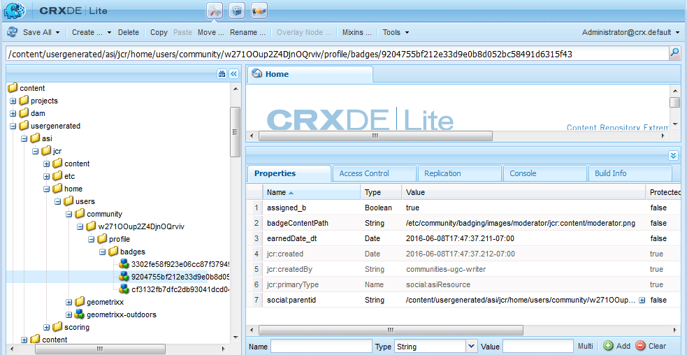

# Aspectos básicos de la puntuación y los distintivos {#scoring-and-badges-essentials}

>[!CAUTION]
>
>AEM 6.4 ha llegado al final de la compatibilidad ampliada y esta documentación ya no se actualiza. Para obtener más información, consulte nuestra [períodos de asistencia técnica](https://helpx.adobe.com/es/support/programs/eol-matrix.html). Buscar las versiones compatibles [here](https://experienceleague.adobe.com/docs/).

La función de puntuación y distintivos de AEM Communities permite identificar y premiar a los miembros de la comunidad.

Los detalles de la configuración de la función se describen en

* [Puntuación y distintivos de comunidades](implementing-scoring.md)

Esta página contiene detalles técnicos adicionales:

* Cómo [mostrar un distintivo](#displaying-badges) como imagen o texto
* Activación de [registro de depuración](#debug-log-for-scoring-and-badging)
* Cómo [acceder a UGC](#ugc-for-scoring-and-badging) relacionados con la puntuación y el distintivo

>[!CAUTION]
>
>La estructura de implementación visible en el CRXDE Lite está sujeta a cambios.

## Visualización de distintivos {#displaying-badges}

Si un distintivo se muestra como texto o como imagen se controla en el lado del cliente en la plantilla HBS.

Por ejemplo, busque `this.isAssigned` en `/libs/social/forum/components/hbs/topic/list-item.hbs`,

```
{{#each author.badges}}

  {{#if this.isAssigned}}

    <div class="scf-badge-text">

      {{this.title}}

    </div>

  {{/if}}

{{/each}}

{{#each author.badges}}

  {{#unless this.isAssigned}}

    

  {{/unless}}

{{/each}}
```

Si es true, isAssigned indica que el distintivo se asignó a una función y que el distintivo debe mostrarse como texto.

Si es falso, si es asignado indica que el distintivo se concedió para una puntuación ganada y que el distintivo debe mostrarse como una imagen.

Cualquier cambio en este comportamiento debe realizarse en una secuencia de comandos personalizada (ya sea en una anulación o en una superposición). Consulte [Personalización del lado del cliente](client-customize.md).

## Registro de depuración para la puntuación y el distintivo {#debug-log-for-scoring-and-badging}

Para ayudar a depurar la puntuación y el distintivo, se puede configurar un archivo de registro personalizado. El contenido de este archivo de registro se puede proporcionar al servicio de atención al cliente si se producen problemas con la función.

Para obtener instrucciones detalladas, visite [Crear un archivo de registro personalizado](../../help/sites-deploying/monitoring-and-maintaining.md#create-a-custom-log-file).

Para configurar rápidamente un archivo de registro de slinglog:

1. Acceda a la **[!UICONTROL Compatibilidad de registro de la consola web de Adobe Experience Manager]**, por ejemplo

   * http://localhost:4502/system/console/slinglog

1. Select **[!UICONTROL Agregar nuevo registrador]**

   1. Select `DEBUG` para **[!UICONTROL Nivel de registro]**
   1. Escriba un nombre para **[!UICONTROL Archivo de registro]**, por ejemplo

      * logs/scoring-debug.log
   1. Escriba dos **[!UICONTROL Registrador]** (clase) entradas (utilizando `+` icono)

      * `com.adobe.cq.social.scoring`
      * `com.adobe.cq.social.badging`
   1. Seleccione **[!UICONTROL Guardar]**


Para ver las entradas de registro:

* Desde la consola web

   * En el **[!UICONTROL Estado]** menú
   * Select **[!UICONTROL Archivos de registro]**
   * Busque su nombre de archivo de registro, como `scoring-debug`

* En el disco local del servidor

   * El archivo de registro se encuentra en &lt;*server-install-dir*>/crx-quickstart/logs/&lt;*log-file-name*>.log
   * Por ejemplo, `.../crx-quickstart/logs/scoring-debug.log`. 


## UGC para puntuación y distintivo {#ugc-for-scoring-and-badging}

Es posible ver el UGC relacionado con la puntuación y el distintivo cuando el SRP elegido es JSRP o MSRP, pero no ASRP. (Si no está familiarizado con estos términos, consulte [Almacenamiento de contenido de la comunidad](working-with-srp.md) y [Información general del proveedor de recursos de almacenamiento](srp.md).)

Las descripciones para acceder a los datos de puntuación e identificación utilizan JSRP, ya que el UGC es fácilmente accesible mediante [CRXDE Lite](../../help/sites-developing/developing-with-crxde-lite.md).

**JSRP en autor**: la experimentación en el entorno de creación resulta en UGC que solo es visible desde el entorno de creación.

**JSRP al publicar**: del mismo modo, si realiza pruebas en el entorno de publicación, será necesario acceder a CRXDE Lite con privilegios administrativos en una instancia de publicación. Si la instancia de publicación se está ejecutando en [modo de producción](../../help/sites-administering/production-ready.md) (nosamplecontent runmode), será necesario [habilitar CRXDE Lite](../../help/sites-administering/enabling-crxde-lite.md).

La ubicación de base del UGC en el JSRP es `/content/usergenerated/asi/jcr/`.

### API de puntuación y asignación {#scoring-and-badging-apis}

Las siguientes API están disponibles para su uso:

* [com.adobe.cq.social.scoring.api](https://docs.adobe.com/content/docs/en/aem/6-3/develop/ref/javadoc/com/adobe/cq/social/scoring/api/package-summary.html)
* [com.adobe.cq.social.badging.api](https://docs.adobe.com/content/docs/en/aem/6-3/develop/ref/javadoc/com/adobe/cq/social/badging/api/package-summary.html)

Los últimos Javadocs para los [versiones](deploy-communities.md#LatestReleases) están disponibles para los desarrolladores desde el repositorio de Adobe. Consulte [Uso de Maven para comunidades: Javadocs](maven.md#javadocs).

**La ubicación y el formato del UGC en el repositorio están sujetos a cambios sin previo aviso**.

### Configuración de ejemplo {#example-setup}

Las capturas de pantalla de los datos del repositorio provienen de la configuración de la puntuación y el distintivo para un foro en dos sitios AEM diferentes:

1. Un sitio AEM con un id único (sitio de comunidad creado mediante el asistente):

   * Uso del sitio Tutorial de introducción (participación) creado durante el [tutorial de introducción](getting-started.md)
   * Busque el nodo de la página del foro

      * `/content/sites/engage/en/forum/jcr:content`
   * Agregar propiedades de puntuación y distintivo

      * `scoringRules = [/etc/community/scoring/rules/comments-scoring,`

         `/etc/community/scoring/rules/forums-scoring]`
      * `badgingRules =[/etc/community/badging/rules/comments-scoring,`

         `/etc/community/badging/rules/forums-scoring]`
   * Busque el nodo de componente del foro

      * `/content/sites/engage/en/forum/jcr:content/content/primary/forum`

         ( `sling:resourceType = social/forum/components/hbs/forum`)
   * Agregar propiedad para mostrar distintivos

      * `allowBadges = true`
   * Un usuario inicia sesión, crea un tema de foro y recibe una insignia de bronce


1. Un sitio AEM *without* un id único:

   * Al usar la variable [Guía de componentes de comunidad](components-guide.md)
   * Busque el nodo de la página del foro

      * `/content/community-components/en/forum/jcr:content`
   * Agregar propiedades de puntuación y distintivo

      ```
      scoringRules = [/etc/community/scoring/rules/comments-scoring,
      /etc/community/scoring/rules/forums-scoring]
      ```

      ```
      badgingRules =[/etc/community/badging/rules/comments-scoring,
      /etc/community/badging/rules/forums-scoring]
      ```

   * Busque el nodo de componente del foro

      * `/content/community-components/en/forum/jcr:content/content/forum`

         ( `sling:resourceType = social/forum/components/hbs/forum`)
   * Agregar propiedad para mostrar distintivos

      * `allowBadges = true`
   * Un usuario inicia sesión, crea un tema de foro y recibe una insignia de bronce


1. A un usuario se le asigna un distintivo de moderador mediante cURL:

```shell
curl -i -X POST -H "Accept:application/json" -u admin:admin -F ":operation=social:assignBadge" -F "badgeContentPath=/etc/community/badging/images/moderator/jcr:content/moderator.png" http://localhost:4503/home/users/community/w271OOup2Z4DjnOQrviv/profile.social.json
```

Como un usuario ha ganado dos insignias de bronce y se le ha concedido una insignia de moderador, así es como aparece el usuario con su entrada en el foro:


>[!NOTE]
>
>Este ejemplo no sigue estas prácticas recomendadas:
>
>* los nombres de las reglas de puntuación deben ser únicos a nivel global; no deben terminar con el mismo nombre.\
   >  Un ejemplo de qué *not* para hacer:\
   >  /etc/community/scoring/rules/site1/forums-scoring\
   >  /etc/community/scoring/rules/site2/forums-scoring
>
>* creación de imágenes de distintivo únicas para diferentes sitios de AEM
>


### Acceso a UGC de puntuación {#access-scoring-ugc}

Uso del [API](#scoring-and-badging-apis) es preferible.

Para fines de investigación, con JSRP por ejemplo, la carpeta base que contiene puntuaciones es

* `/content/usergenerated/asi/jcr/scoring`

El nodo secundario de `scoring`es el nombre de la regla de puntuación. Por lo tanto, una práctica recomendada es que los nombres de reglas de puntuación en un servidor sean únicos a nivel global.

Para el sitio Participación de Geometrixx, el usuario y su puntuación se encuentran en una ruta construida con el nombre de la regla de puntuación, el ID del sitio del sitio de la comunidad ( `engage-ba81p`), un id único y el id del usuario:

* `.../scoring/forums-scoring/engage-ba81p/6d179715c0e93cb2b20886aa0434ca9b5a540401/riley`

Para el sitio de la guía de componentes de comunidad, el usuario y su puntuación se encuentran en una ruta construida con el nombre de la regla de puntuación, un id predeterminado ( `default-site`), un id único y el id del usuario:

* `.../scoring/forums-scoring/default-site/b27a17cb4910a9b69fe81fb1b492ba672d2c086e/riley`

La puntuación se almacena en la propiedad `scoreValue_tl` que puede contener directamente sólo un valor o hacer referencia indirectamente a un atomicCounter.


### Acceso al distintivo UGC {#access-badging-ugc}

Uso del [API](#scoring-and-badging-apis) es preferible.

Para fines de investigación, utilizando JSRP para el ejemplo, la carpeta base que contiene información sobre distintivos asignados o concedidos es

* /content/usergenerated/asi/jcr

Seguido de la ruta al perfil del usuario, que termina en una carpeta de distintivos, como

* /home/users/community/w271Up2Z4DjnOQrviv/profile/badges

#### Distintivo adjudicado {#awarded-badge}


#### distintivo asignado {#assigned-badge}



## Información adicional {#additional-information}

Para mostrar una lista ordenada de miembros basada en puntos:

* [Función del panel de instrumentos](functions.md#leaderboard-function) para su inclusión en un sitio de la comunidad o en una plantilla de grupo.
* [Componente del panel de control](enabling-leaderboard.md), el componente destacado de la función del panel de vanguardia, para la creación de páginas.
